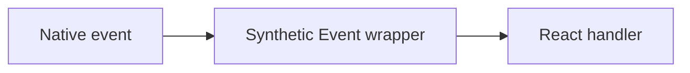

# Synthetic Events

## Detailed explanation
Synthetic Events are React's cross-browser wrapper around native browser events. They provide a consistent event API across browsers and integrate with React's event delegation and update system.

In modern React, event pooling has been removed, so Synthetic Event objects are less surprising than in older React versions. Still, the concept matters because interviewers often ask how React event handling differs from direct DOM events.

## 1. One-line mental model
A Synthetic Event is React's normalized wrapper around a browser event.

## 2. Problem it solves
Browsers have historically had event differences, and React needs a consistent event system that works with component rendering.

## 3. Core idea
- React handlers receive Synthetic Event objects.
- They expose familiar methods like `preventDefault`.
- They wrap native events.
- React uses event delegation internally.
- Modern React no longer pools events.

## 4. Visual / analogy
Synthetic Events are adapters: different browser plugs go into one React socket.



## 5. Minimal example

```tsx
function Form() {
  function handleSubmit(event: React.FormEvent<HTMLFormElement>) {
    event.preventDefault();
  }

  return <form onSubmit={handleSubmit} />;
}
```

## 6. Real-world example

```tsx
function TextField() {
  function handleChange(event: React.ChangeEvent<HTMLInputElement>) {
    const value = event.currentTarget.value;
    trackInput(value);
  }

  return <input onChange={handleChange} />;
}
```

## 7. Common interview questions
#### What are Synthetic Events?
- **The Engine Mechanism (Why it behaves this way):** Synthetic Events are React's cross-browser wrapper objects around native browser events. When a native event fires, React creates a SyntheticEvent object that normalizes the event's properties across browsers. The SyntheticEvent has the same interface as the native event (`target`, `currentTarget`, `preventDefault`, `stopPropagation`, etc.) but with consistent behavior. React attaches a single event listener at the root of the app (event delegation) and dispatches SyntheticEvents to the appropriate component handlers. In React 17+, listeners are attached to the React root container rather than `document`.
- **The Unforgettable Mental Model:** The **Universal Power Adapter**. Different countries (browsers) have different power outlets (native events) — different shapes, voltages, and frequencies. A SyntheticEvent is like a universal adapter that lets you plug any device into any outlet and get consistent behavior.
- **The Trap:** Thinking SyntheticEvent is a completely different event system. It wraps the native event — `nativeEvent` property gives you access to the original. SyntheticEvent is a thin normalization layer, not a replacement.
- **Senior Interview Playbook (Verbal Script):** "When asked this in an interview, say: Synthetic Events are React's cross-browser wrapper around native browser events. They provide a consistent API regardless of which browser fires the event, normalizing differences in event properties and behavior. React uses event delegation internally — attaching a single listener at the root container — and dispatches SyntheticEvents to the appropriate component handlers. The SyntheticEvent object exposes the same interface as the native event, and you can access the original event through the `nativeEvent` property."

#### Why does React use Synthetic Events?
- **The Engine Mechanism (Why it behaves this way):** React uses Synthetic Events for two main reasons. First, browser compatibility: historically, browsers had significant differences in event implementations (e.g., `event.target` vs `event.srcElement`, different key codes, inconsistent `stopPropagation` behavior). SyntheticEvent normalizes these differences so React code works identically across browsers. Second, performance through event delegation: instead of attaching individual listeners to every DOM node that needs an event handler, React attaches a single listener per event type at the root container. When an event fires, React determines which component should handle it by walking up the component tree from the event target.
- **The Unforgettable Mental Model:** The **Centralized Mail Room**. Instead of every employee having their own mailbox outside the building (individual listeners), all mail goes to one central mail room (root listener). The mail room staff (React) sorts and delivers each piece to the right person (component handler). This is more efficient and ensures consistent delivery rules.
- **The Trap:** Thinking Synthetic Events are only for browser compatibility. The event delegation performance benefit is equally important — fewer listeners means less memory usage and faster event setup/teardown.
- **Senior Interview Playbook (Verbal Script):** "When asked this in an interview, say: React uses Synthetic Events for browser compatibility and performance. Historically, browsers had inconsistent event implementations, and SyntheticEvent normalizes these differences so code works identically everywhere. More importantly, React uses event delegation — attaching one listener per event type at the root container instead of individual listeners on every element. This reduces memory usage and speeds up event setup. When an event fires, React walks the component tree from the target to find the right handler."

#### Are Synthetic Events pooled?
- **The Engine Mechanism (Why it behaves this way):** Event pooling was a performance optimization in React 16 and earlier. React reused SyntheticEvent objects across events by resetting their properties after the event handler completed. This meant accessing event properties asynchronously (e.g., in a `setTimeout` or Promise callback) would return `null` because the object had been recycled. Developers had to call `event.persist()` to opt out of pooling. In React 17+, pooling was removed — SyntheticEvent objects are no longer reused, and all properties remain accessible asynchronously. This change simplified the API and removed a common source of bugs.
- **The Unforgettable Mental Model:** The **Library Book Return**. With pooling (React 16), the event object was like a library book — after you finished reading it, you had to return it, and it would be checked out to someone else. If you tried to read it again later, it was gone. Without pooling (React 17+), you keep the book forever — no need to return it.
- **The Trap:** Giving outdated answers about event pooling. Many tutorials and interview prep materials still describe pooling behavior, but it was removed in React 17. Always clarify which React version you're discussing.
- **Senior Interview Playbook (Verbal Script):** "When asked this in an interview, say: In React 16 and earlier, SyntheticEvents were pooled — React reused event objects for performance, resetting their properties after each handler. This meant async access to event properties returned null, and you had to call `event.persist()` to keep the object. In React 17 and later, pooling was removed. SyntheticEvent objects are no longer reused, so all properties remain accessible in async callbacks. This change eliminated a common source of confusion and bugs."

#### How do you access the native event?
- **The Engine Mechanism (Why it behaves this way):** Every SyntheticEvent object has a `nativeEvent` property that holds a reference to the original browser event. This gives you access to browser-specific properties that React doesn't normalize, such as `TouchEvent.touches`, `ClipboardEvent.clipboardData`, or browser-specific event properties. The native event is the actual DOM event object that the browser created, with all its browser-specific quirks and features intact.
- **The Unforgettable Mental Model:** The **Envelope Inside the Package**. The SyntheticEvent is the outer packaging — standardized, clean, and consistent. The `nativeEvent` is the original letter inside — it has all the original details, stamps, and handwriting that the packaging abstracted away.
- **The Trap:** Modifying the native event directly. While you can read from `nativeEvent`, modifying it can cause unexpected behavior because other event handlers may also be reading from it.
- **Senior Interview Playbook (Verbal Script):** "When asked this in an interview, say: You can access the native browser event through the `nativeEvent` property on any SyntheticEvent. This gives you access to browser-specific properties that React doesn't normalize, like touch event data or clipboard data. For example, `event.nativeEvent.touches` gives you the raw touch list. In most cases, the SyntheticEvent interface is sufficient, but `nativeEvent` is available when you need browser-specific features."

#### What is event delegation?
- **The Engine Mechanism (Why it behaves this way):** Event delegation is a pattern where instead of attaching event listeners to individual elements, you attach a single listener to a common ancestor (in React's case, the root container). When an event fires on a child element, it bubbles up to the ancestor where the listener catches it. React then determines which component should handle the event by walking the component tree from the event target upward, invoking handlers at each level. This works because most events bubble through the DOM tree. React maintains a mapping of event types to the root container and dispatches events through its internal event system.
- **The Unforgettable Mental Model:** The **Building Security Desk**. Instead of putting a security guard at every door (individual listeners), you put one guard at the main entrance (root listener). Everyone who enters or exits passes through that guard, who decides where to route them. One guard, full coverage.
- **The Trap:** Thinking event delegation means events don't bubble normally. Events still bubble through the DOM — React just catches them at the root and re-dispatches them through the component tree. Native event propagation still works.
- **Senior Interview Playbook (Verbal Script):** "When asked this in an interview, say: Event delegation is a pattern where React attaches a single event listener per event type at the root container, rather than individual listeners on every element. When an event fires, it bubbles up to the root, where React catches it and determines which component should handle it by walking the component tree from the target. This reduces memory usage, speeds up event setup for large trees, and simplifies event management. Events still bubble normally through the DOM — React just intercepts them at the root."

#### How do `target` and `currentTarget` differ?
- **The Engine Mechanism (Why it behaves this way):** `target` is the element that originally fired the event — the deepest element in the DOM tree where the event occurred. `currentTarget` is the element that the event handler is currently attached to. In React, `currentTarget` is the element with the `onClick` (or other event) prop. During event bubbling, `target` stays constant (it's always the original source), while `currentTarget` changes as the event bubbles up through ancestor elements. In React's synthetic event system, `currentTarget` is set to the element where the React handler is defined, which may differ from the native event's `currentTarget` due to React's event delegation.
- **The Unforgettable Mental Model:** The **Crime Scene**. `target` is where the crime actually happened (the broken window). `currentTarget` is where the police officer is currently investigating (could be the window, the house, or the neighborhood — depending on which level you're looking at).
- **The Trap:** Using `event.target` when you need the element with the handler. If a child element inside a clickable div is clicked, `target` points to the child, not the div. Use `currentTarget` when you need the element that has the event handler.
- **Senior Interview Playbook (Verbal Script):** "When asked this in an interview, say: `target` is the element that originally fired the event — the deepest element where the interaction occurred. `currentTarget` is the element the event handler is attached to. During bubbling, `target` stays constant while `currentTarget` changes. In practice, use `target` when you need to know exactly what the user clicked, and use `currentTarget` when you need the element that has the handler. For example, in a button with an icon inside, clicking the icon makes `target` the icon but `currentTarget` the button."

#### How do you prevent default behavior?
- **The Engine Mechanism (Why it behaves this way):** Calling `event.preventDefault()` on a SyntheticEvent calls the same method on the underlying native event, preventing the browser's default action. For example, on a form submit event, it prevents the page reload; on a link click, it prevents navigation. React's SyntheticEvent wraps this call so it works consistently across browsers. The method sets a flag on the event object that React checks before allowing the native event's default action to proceed. In React, you can also return `false` from an inline handler (like `onClick={() => false}`) to prevent default, but calling `preventDefault()` explicitly is the recommended approach.
- **The Unforgettable Mental Model:** The **Stop Sign**. The browser has a default route it wants to take (submit the form, follow the link). `preventDefault()` is a stop sign that says "don't go that way" — the browser halts its default action and lets your custom logic take over.
- **The Trap:** Forgetting `preventDefault()` on form submissions. Without it, the form submits normally and the page reloads, destroying your React app's state.
- **Senior Interview Playbook (Verbal Script):** "When asked this in an interview, say: You call `event.preventDefault()` on the SyntheticEvent to prevent the browser's default action. For form submissions, this stops the page reload. For link clicks, it prevents navigation. The method works identically to the native event's `preventDefault()` — React's wrapper calls the native method under the hood. It's essential for forms in React, where you want to handle submission with JavaScript instead of letting the browser do a full page reload."

## 8. Active recall test
1. **What does a SyntheticEvent wrap?**
   - **Explanation:** A SyntheticEvent wraps the native browser event, normalizing its properties and behavior across different browsers. The original native event is accessible via `event.nativeEvent`.
2. **Why did React introduce SyntheticEvents?**
   - **Explanation:** For browser compatibility (normalizing inconsistent event implementations) and performance (event delegation attaches one listener per event type at the root instead of individual listeners on every element).
3. **What method stops default form reload?**
   - **Explanation:** `event.preventDefault()` called on the SyntheticEvent prevents the browser's default action, such as the page reload that normally occurs on form submission.
4. **Are modern SyntheticEvents pooled?**
   - **Explanation:** No. Event pooling was removed in React 17. SyntheticEvent objects are no longer reused, so all properties remain accessible in async callbacks without calling `event.persist()`.
5. **What does `currentTarget` mean?**
   - **Explanation:** `currentTarget` is the element that the event handler is attached to. It differs from `target`, which is the element that originally fired the event. During bubbling, `target` stays constant while `currentTarget` changes.

## 9. Mistakes / traps
- Giving old answers that events are still pooled in modern React.
- Confusing `target` and `currentTarget`.
- Forgetting event propagation.
- Accessing DOM directly when event data is enough.
- Using wrong TypeScript event types.

## 10. Compare with related concepts
- **Synthetic Event vs native event:** wrapper vs original browser event.
- **Event delegation vs direct listener:** delegated handling attaches fewer listeners.
- **Event handling vs state updates:** events trigger logic; state updates cause rendering.

## 11. Summary from memory
Explain how React normalizes a form submit event and why `preventDefault` is used.

## 12. Spaced revision prompts
- After 1 day: Define Synthetic Event.
- After 3 days: Explain pooling history.
- After 7 days: Compare `target` and `currentTarget`.
- After 14 days: Explain event delegation.

