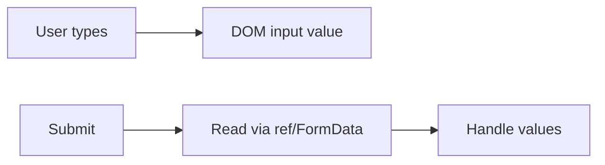

# Uncontrolled Components

## Detailed explanation
An uncontrolled component stores its current value outside parent React state, often inside the DOM itself. React can provide the initial value through `defaultValue` or `defaultChecked`, but after mount, the DOM owns the live value.

This pattern is useful for simple forms, file inputs, and large forms where updating React state on every keystroke would cause unnecessary rendering. It is not a lesser pattern; it is a trade-off between control, performance, and simplicity.

## 1. One-line mental model
An uncontrolled component keeps its current value in the DOM or internal component state instead of receiving it from the parent every render.

## 2. Problem it solves
Some inputs do not need React to track every keystroke. Uncontrolled components reduce state wiring and can improve performance for large forms or simple one-time value reads.

## 3. Core idea
- The DOM owns the input value.
- React may provide an initial value with `defaultValue` or `defaultChecked`.
- A ref can read the value when needed.
- Uncontrolled inputs are useful for simple forms and file inputs.
- Libraries like React Hook Form use uncontrolled patterns for performance.

## 4. Visual / analogy
An uncontrolled input is like a notebook: the user writes in it directly, and React reads it when it needs to submit.



## 5. Minimal example

```tsx
function EmailForm() {
  const inputRef = React.useRef<HTMLInputElement>(null);

  function handleSubmit(event: React.FormEvent) {
    event.preventDefault();
    console.log(inputRef.current?.value);
  }

  return <form onSubmit={handleSubmit}><input ref={inputRef} defaultValue="" /></form>;
}
```

## 6. Real-world example

```tsx
function UploadForm() {
  const fileRef = React.useRef<HTMLInputElement>(null);

  function handleSubmit() {
    const file = fileRef.current?.files?.[0];
    if (file) uploadApi.send(file);
  }

  return <input ref={fileRef} type="file" onChange={handleSubmit} />;
}
```

File inputs are naturally uncontrolled because browsers restrict programmatic file value control.

## 7. Common interview questions
- What is an uncontrolled component?
- When would you use uncontrolled inputs?
- What is `defaultValue`?
- How do refs relate to uncontrolled components?
- Why are file inputs uncontrolled?
- Controlled vs uncontrolled components?
- How does React Hook Form use uncontrolled inputs?

## 8. Active recall test
1. Who owns the value in an uncontrolled input?
2. What is the difference between `value` and `defaultValue`?
3. How do you read an uncontrolled input on submit?
4. Why are file inputs special?
5. What is one downside of uncontrolled inputs?

## 9. Mistakes / traps
- Expecting `defaultValue` changes to update the DOM value after mount.
- Mixing `value` and `defaultValue`.
- Using uncontrolled inputs when UI must react to every keystroke.
- Forgetting refs can be `null`.
- Treating uncontrolled as less valid; it is a trade-off.

## 10. Compare with related concepts
- **Uncontrolled vs controlled:** uncontrolled stores value outside parent React state.
- **Uncontrolled vs ref:** ref is how React accesses the uncontrolled value.
- **Uncontrolled vs internal state:** uncontrolled form inputs often use DOM state; custom components may use internal React state.

## 11. Summary from memory
Explain how an uncontrolled signup form can collect values with `FormData` on submit.

## 12. Spaced revision prompts
- After 1 day: Define uncontrolled component.
- After 3 days: Compare `value` and `defaultValue`.
- After 7 days: Explain why file inputs are uncontrolled.
- After 14 days: Compare controlled and uncontrolled forms for large forms.
