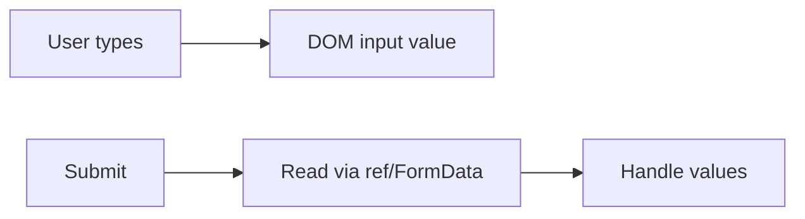

# Uncontrolled Components

## Detailed explanation
An uncontrolled component stores its current value outside parent React state, often inside the DOM itself. React can provide the initial value through `defaultValue` or `defaultChecked`, but after mount, the DOM owns the live value.

This pattern is useful for simple forms, file inputs, and large forms where updating React state on every keystroke would cause unnecessary rendering. It is not a lesser pattern; it is a trade-off between control, performance, and simplicity.

## 1. One-line mental model
An uncontrolled component keeps its current value in the DOM or internal component state instead of receiving it from the parent every render.

## 2. Problem it solves
Some inputs do not need React to track every keystroke. Uncontrolled components reduce state wiring and can improve performance for large forms or simple one-time value reads.

## 3. Core idea
- The DOM owns the input value.
- React may provide an initial value with `defaultValue` or `defaultChecked`.
- A ref can read the value when needed.
- Uncontrolled inputs are useful for simple forms and file inputs.
- Libraries like React Hook Form use uncontrolled patterns for performance.

## 4. Visual / analogy
An uncontrolled input is like a notebook: the user writes in it directly, and React reads it when it needs to submit.



## 5. Minimal example

```tsx
function EmailForm() {
  const inputRef = React.useRef<HTMLInputElement>(null);

  function handleSubmit(event: React.FormEvent) {
    event.preventDefault();
    console.log(inputRef.current?.value);
  }

  return <form onSubmit={handleSubmit}><input ref={inputRef} defaultValue="" /></form>;
}
```

## 6. Real-world example

```tsx
function UploadForm() {
  const fileRef = React.useRef<HTMLInputElement>(null);

  function handleSubmit() {
    const file = fileRef.current?.files?.[0];
    if (file) uploadApi.send(file);
  }

  return <input ref={fileRef} type="file" onChange={handleSubmit} />;
}
```

File inputs are naturally uncontrolled because browsers restrict programmatic file value control.

## 7. Common interview questions
#### What is an uncontrolled component?
- **The Engine Mechanism (Why it behaves this way):** An uncontrolled component lets the DOM manage the element's value after the initial mount. React sets the initial value using `defaultValue` or `defaultChecked` during the commit phase of the first render. After that, React does not write the `value` property on subsequent renders — the browser's native input handling takes over. When React needs to read the value, it accesses the DOM node directly through a ref (`useRef`) or reads from `FormData` on form submission. The DOM node's `value` property is the source of truth, not React state.
- **The Unforgettable Mental Model:** The **Guest Book**. You hand someone a blank book (defaultValue), they write whatever they want (user types), and you only read it when they hand it back (submit via ref). You never intervene while they're writing.
- **The Trap:** Thinking uncontrolled means "no React involvement." React still renders the element, sets the initial value, and can read it — it just doesn't control the live value during user interaction.
- **Senior Interview Playbook (Verbal Script):** "When asked this in an interview, say: An uncontrolled component is a form element where the DOM — not React state — holds the current value. React sets the initial value using `defaultValue` or `defaultChecked` on mount, but after that, the browser manages the input. We read the value when needed using a ref or FormData. This is a deliberate trade-off that reduces re-renders and simplifies code for cases where we don't need real-time validation or reactive UI."

#### When would you use uncontrolled inputs?
- **The Engine Mechanism (Why it behaves this way):** Uncontrolled inputs are optimal when the UI doesn't need to react to every keystroke. Since the DOM owns the value, no `onChange` handler fires, no `setState` is called, and no re-render is triggered per keystroke. This matters in large forms where controlling 30+ fields would cause 30+ re-renders per keystroke. The Fiber scheduler still has to process each state update even if batched. Uncontrolled inputs also work naturally with file inputs (which browsers restrict from programmatic control) and third-party DOM-manipulating libraries that expect direct DOM access.
- **The Unforgettable Mental Model:** The **Suggestion Box**. You don't need to read every note as it's dropped in. You only open the box at the end of the day (submit) to collect all the suggestions at once. No need for real-time monitoring.
- **The Trap:** Using uncontrolled inputs when the UI must react to input changes — like a live search filter, character counter, or real-time validation. The DOM value changes, but React won't re-render to reflect those changes.
- **Senior Interview Playbook (Verbal Script):** "When asked this in an interview, say: I use uncontrolled inputs when the UI doesn't need to react to every keystroke — simple forms, file uploads, or large forms where controlling every field would cause excessive re-renders. They're also the natural choice for file inputs since browsers don't allow programmatic value control. Libraries like React Hook Form leverage uncontrolled patterns with subscriptions to minimize re-renders while still providing validation and error handling."

#### What is `defaultValue`?
- **The Engine Mechanism (Why it behaves this way):** `defaultValue` is a prop that React reads only during the initial mount commit. React sets the DOM element's `value` property to the `defaultValue` once, and then ignores it on subsequent renders. This is fundamentally different from `value`, which React reads on every render and writes to the DOM each time. If `defaultValue` changes in a parent re-render, the DOM input value does not update because React has already relinquished control of that element's value to the browser. React's reconciliation algorithm skips updating the `value` property for uncontrolled inputs after the initial mount.
- **The Unforgettable Mental Model:** The **First-Day Seating Chart**. On day one, the teacher assigns seats (defaultValue). After that, students can move around freely, and the teacher's original chart is never consulted again. Changing the chart later doesn't move anyone.
- **The Trap:** Expecting `defaultValue` to update the input when the prop changes. It won't — it's only read once on mount. If you need the input to update when external data changes, you need a controlled component with `value`, or a `key` change to force remount.
- **Senior Interview Playbook (Verbal Script):** "When asked this in an interview, say: `defaultValue` sets the initial value of an uncontrolled input on mount, but React never reads it again. Unlike `value`, which updates the DOM on every render, `defaultValue` is a one-time setup. If the parent passes a new `defaultValue` later, the input won't update because the DOM now owns the value. To force an uncontrolled input to reset, you'd change its `key` to trigger a full remount."

#### How do refs relate to uncontrolled components?
- **The Engine Mechanism (Why it behaves this way):** A ref (`useRef`) provides a stable reference to a DOM node across renders. When attached to an uncontrolled input via the `ref` prop, React assigns the actual DOM element to `ref.current` after the commit phase. The ref object itself is a plain JavaScript object (`{ current: null }`) that persists across renders without triggering re-renders when mutated. Reading `ref.current.value` accesses the DOM's live value property directly, bypassing React's state system entirely. This is safe because reading the DOM is a side effect that happens outside the render phase.
- **The Unforgettable Mental Model:** The **Hidden Camera**. The camera (ref) is installed once and records everything happening in the room (DOM). You can check the footage anytime (read ref.current.value) without interrupting what's going on. The camera doesn't control events — it just observes.
- **The Trap:** Accessing `ref.current` during render. Refs are populated after the commit phase, so they're `null` during the first render. They should be read in event handlers or effects, not during the render phase.
- **Senior Interview Playbook (Verbal Script):** "When asked this in an interview, say: Refs are the bridge between React and the DOM for uncontrolled components. We create a ref with `useRef`, attach it to the input, and after mount, `ref.current` points to the actual DOM node. We can then read `ref.current.value` in event handlers like form submission to get the current input value. Refs don't trigger re-renders when their values change, making them ideal for reading DOM state without involving React's rendering cycle."

#### Why are file inputs uncontrolled?
- **The Engine Mechanism (Why it behaves this way):** Browser security restrictions prevent JavaScript from programmatically setting the `value` property of `<input type="file">`. This is a security measure — if JavaScript could set file input values, malicious scripts could forge file uploads without user consent. Because React cannot control the value prop of a file input, it must be uncontrolled. The only way to access selected files is through the `FileList` object on the DOM node, read via `ref.current.files` or from the `onChange` event's `event.target.files`. React's controlled component pattern is fundamentally incompatible with file inputs.
- **The Unforgettable Mental Model:** The **Bank Vault**. Only the user (browser security) has the combination. No matter who you are (React included), you can't open it or put things inside — you can only receive what the user voluntarily places in it.
- **The Trap:** Trying to set `value` on a file input or reset it by setting state to an empty string. Neither works. To reset a file input, you must either set its `key` to a new value (forcing remount) or set `ref.current.value = ""` directly on the DOM.
- **Senior Interview Playbook (Verbal Script):** "When asked this in an interview, say: File inputs must be uncontrolled because browsers don't allow JavaScript to programmatically set their value — it's a security restriction to prevent forged file uploads. We can only read selected files through the DOM node's `FileList` property using a ref or the onChange event. To reset a file input, we change its key to force a remount, since setting value directly is blocked by browser security."

#### Controlled vs uncontrolled components?
- **The Engine Mechanism (Why it behaves this way):** The difference is where the source of truth lives. In controlled components, React state holds the value — every change triggers setState → re-render → reconciliation → commit with the new value written to the DOM. In uncontrolled components, the DOM holds the value — React sets it once with `defaultValue` on mount and reads it later via refs. Controlled components re-render on every change; uncontrolled components don't. Controlled enables real-time validation and reactive UI; uncontrolled is simpler and more performant for large forms. React's Fiber architecture handles both, but the render workload differs significantly.
- **The Unforgettable Mental Model:** **Autopilot vs. Manual Flying**. Controlled is autopilot — the system (React) manages every adjustment and you see every change on the dashboard. Uncontrolled is manual — the pilot (browser) flies the plane, and you only check the instruments when you need to land (submit).
- **The Trap:** Treating one as universally better. Controlled is better for reactive UI; uncontrolled is better for performance in large forms. The right choice depends on the specific use case.
- **Senior Interview Playbook (Verbal Script):** "When asked this in an interview, say: The difference comes down to the source of truth. Controlled components store the value in React state, enabling real-time validation, reactive UI, and predictable data flow — but every keystroke triggers a re-render. Uncontrolled components store the value in the DOM, reducing re-renders and simplifying code for cases where we only need the value at submission. I choose controlled when the UI needs to react to input changes, and uncontrolled for large forms or simple data collection where performance matters."

#### How does React Hook Form use uncontrolled inputs?
- **The Engine Mechanism (Why it behaves this way):** React Hook Form registers uncontrolled inputs by attaching refs to each field during mount. Instead of using React state for each input value, it stores field metadata (value, errors, touched state) in an internal state object. When an input changes, React Hook Form's event handler reads the DOM value directly from the ref and updates only its internal metadata state — not the input's value. This means the input itself doesn't re-render. React Hook Form uses the `useSubscribeToStateChange` pattern internally, re-rendering only the specific error message components or validation indicators that depend on changed metadata, not the entire form.
- **The Unforgettable Mental Model:** The **Silent Observer Network**. Each input has a silent observer (ref) watching it. When something changes, the observer sends a tiny report to headquarters (React Hook Form's state). Headquarters updates its records but doesn't disturb the input. Only if there's an error does headquarters send a visible signal (error message) to that specific input.
- **The Trap:** Assuming React Hook Form doesn't re-render at all. It does re-render — but only for validation errors, touched states, and form-level status, not for every input value change. The inputs themselves stay uncontrolled.
- **Senior Interview Playbook (Verbal Script):** "When asked this in an interview, say: React Hook Form uses uncontrolled inputs by registering refs for each field. Instead of storing input values in React state, it reads values directly from the DOM via refs on change. It only stores validation metadata — errors, touched state, dirty state — in React state. This means typing in a field doesn't trigger a re-render of that field or the form. React Hook Form selectively re-renders only the components that depend on changed metadata, like error messages, making it significantly more performant for large forms than fully controlled approaches."

## 8. Active recall test
1. **Who owns the value in an uncontrolled input?**
   - **Explanation:** The DOM owns the value. React sets the initial value with `defaultValue` on mount, but after that, the browser's native input handling manages the live value. React reads it via refs or FormData only when needed.
2. **What is the difference between `value` and `defaultValue`?**
   - **Explanation:** `value` is read on every render and written to the DOM each time (controlled). `defaultValue` is read only once on initial mount and never again (uncontrolled). Changing `defaultValue` after mount has no effect on the displayed input value.
3. **How do you read an uncontrolled input on submit?**
   - **Explanation:** Attach a ref to the input with `useRef`, then read `ref.current.value` inside the submit handler. Alternatively, use the `FormData` API by passing the form element to `new FormData(form)` and extracting values by field name.
4. **Why are file inputs special?**
   - **Explanation:** Browser security prevents JavaScript from programmatically setting the value of file inputs. This makes controlled file inputs impossible — you can only read selected files through the DOM's `FileList` via refs or event objects.
5. **What is one downside of uncontrolled inputs?**
   - **Explanation:** The UI cannot react to input changes in real time. You can't show live validation errors, character counters, or conditional UI based on the current input value because React doesn't re-render when the DOM value changes.

## 9. Mistakes / traps
- Expecting `defaultValue` changes to update the DOM value after mount.
- Mixing `value` and `defaultValue`.
- Using uncontrolled inputs when UI must react to every keystroke.
- Forgetting refs can be `null`.
- Treating uncontrolled as less valid; it is a trade-off.

## 10. Compare with related concepts
- **Uncontrolled vs controlled:** uncontrolled stores value outside parent React state.
- **Uncontrolled vs ref:** ref is how React accesses the uncontrolled value.
- **Uncontrolled vs internal state:** uncontrolled form inputs often use DOM state; custom components may use internal React state.

## 11. Summary from memory
Explain how an uncontrolled signup form can collect values with `FormData` on submit.

## 12. Spaced revision prompts
- After 1 day: Define uncontrolled component.
- After 3 days: Compare `value` and `defaultValue`.
- After 7 days: Explain why file inputs are uncontrolled.
- After 14 days: Compare controlled and uncontrolled forms for large forms.
