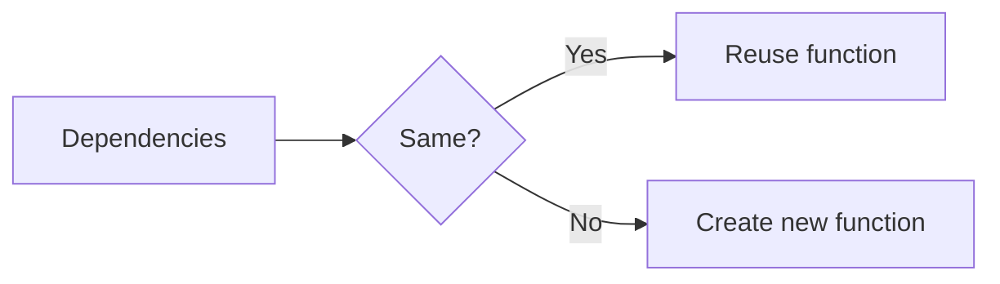

# useCallback

## Detailed explanation
`useCallback` memoizes a function reference between renders until its dependencies change. It is most useful when passing callbacks to memoized child components or hooks that depend on stable function identity.

It does not make the function itself faster. It helps avoid unnecessary re-renders or effect re-runs caused by changing function references.

## 1. One-line mental model
`useCallback` caches a function reference until dependencies change.

## 2. Problem it solves
Function components create new function objects on every render, which can break memoization or retrigger dependency-based logic.

## 3. Core idea
- Pass a function and dependencies.
- React returns a stable function reference when dependencies are unchanged.
- Useful with `React.memo` children.
- Useful for hook dependencies.
- Avoid using it everywhere by default.

## 4. Visual / analogy
`useCallback` is like keeping the same phone number until your contact details change.



## 5. Minimal example

```tsx
const handleSave = React.useCallback(() => {
  saveDraft(draft);
}, [draft]);
```

## 6. Real-world example

```tsx
const Row = React.memo(function Row({ onSelect }: { onSelect: () => void }) {
  return <button onClick={onSelect}>Select</button>;
});

function Table({ id }: { id: string }) {
  const handleSelect = React.useCallback(() => selectRow(id), [id]);
  return <Row onSelect={handleSelect} />;
}
```

## 7. Common interview questions
- What is `useCallback`?
- When should you use it?
- When should you not use it?
- Does `useCallback` prevent re-rendering by itself?
- `useCallback` vs `useMemo`?
- How does stale closure happen with `useCallback`?
- Why does it matter with `React.memo`?

## 8. Active recall test
1. What does `useCallback` return?
2. Does it make function execution faster?
3. Why pair it with `React.memo`?
4. What triggers new function creation?
5. What happens with missing dependencies?

## 9. Mistakes / traps
- Wrapping every function with `useCallback`.
- Expecting `useCallback` alone to stop child re-renders.
- Missing dependencies and capturing stale values.
- Passing unstable objects alongside stable callbacks.
- Making code harder to read for no measurable gain.

## 10. Compare with related concepts
- **`useCallback` vs `useMemo`:** callback caches function; memo caches value.
- **`useCallback` vs `React.memo`:** stable prop vs component render skip.
- **`useCallback` vs event handler:** event handler is the function; `useCallback` stabilizes its identity.

## 11. Summary from memory
Explain why `useCallback` might help a memoized row component in a large table.

## 12. Spaced revision prompts
- After 1 day: Define `useCallback`.
- After 3 days: Compare it with `useMemo`.
- After 7 days: Explain stale callback closure.
- After 14 days: Identify unnecessary `useCallback`.

