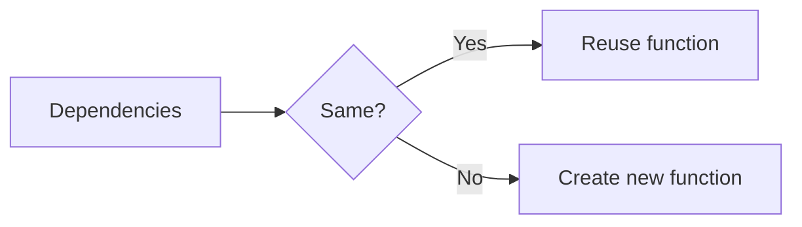

# useCallback

## Detailed explanation
`useCallback` memoizes a function reference between renders until its dependencies change. It is most useful when passing callbacks to memoized child components or hooks that depend on stable function identity.

It does not make the function itself faster. It helps avoid unnecessary re-renders or effect re-runs caused by changing function references.

## 1. One-line mental model
`useCallback` caches a function reference until dependencies change.

## 2. Problem it solves
Function components create new function objects on every render, which can break memoization or retrigger dependency-based logic.

## 3. Core idea
- Pass a function and dependencies.
- React returns a stable function reference when dependencies are unchanged.
- Useful with `React.memo` children.
- Useful for hook dependencies.
- Avoid using it everywhere by default.

## 4. Visual / analogy
`useCallback` is like keeping the same phone number until your contact details change.



## 5. Minimal example

```tsx
const handleSave = React.useCallback(() => {
  saveDraft(draft);
}, [draft]);
```

## 6. Real-world example

```tsx
const Row = React.memo(function Row({ onSelect }: { onSelect: () => void }) {
  return <button onClick={onSelect}>Select</button>;
});

function Table({ id }: { id: string }) {
  const handleSelect = React.useCallback(() => selectRow(id), [id]);
  return <Row onSelect={handleSelect} />;
}
```

## 7. Common interview questions
#### What is `useCallback`?
- **The Engine Mechanism (Why it behaves this way):** `useCallback(fn, deps)` stores the function reference on the Fiber node alongside its dependency values. On each render, React compares the current dependencies with the previous ones using `Object.is()`. If all dependencies are equal, React returns the previously stored function reference. If any dependency changed, React stores the new function and its dependencies, returning the new reference. The function itself is not modified — only its identity (reference) is cached.
- **The Unforgettable Mental Model:** The **Phone Number Port**. You change your address (render), but keep the same phone number (function reference). People can still reach you at the same number without updating their contacts. Only when your contact details change (dependencies) do you get a new number.
- **The Trap:** Thinking `useCallback` makes the function execute faster. It doesn't — it only prevents the function reference from changing between renders. The function body executes at the same speed either way.
- **Senior Interview Playbook (Verbal Script):** "When asked this in an interview, say: `useCallback` memoizes a function reference between renders. It takes a function and a dependency array, and returns the same function reference as long as the dependencies haven't changed. When dependencies change, it returns the new function. This is useful for passing stable callbacks to memoized child components or for preventing effect re-runs caused by changing function references. It doesn't make the function faster — it just keeps the same identity."

#### When should you use it?
- **The Engine Mechanism (Why it behaves this way):** `useCallback` is valuable when function identity matters to downstream consumers. `React.memo` children use `Object.is()` to compare props — a new function reference causes the child to re-render even if all other props are identical. Effects and other hooks that include functions in their dependency arrays will re-run when the function reference changes. `useCallback` prevents these unnecessary downstream updates by maintaining a stable function reference.
- **The Unforgettable Mental Model:** The **Subscription Service**. If your magazine changes its ISSN number (function reference) every issue, every subscriber (child component) thinks it's a new magazine and re-subscribes (re-renders). Keep the same ISSN, and subscribers only react when the content actually changes.
- **The Trap:** Using `useCallback` for functions that are only used within the same component and never passed to memoized children or dependency arrays. The overhead provides no benefit.
- **Senior Interview Playbook (Verbal Script):** "When asked this in an interview, say: I use `useCallback` in two main scenarios. First, when passing callbacks to memoized child components wrapped in `React.memo` — without it, the child re-renders every time the parent renders because the function reference changes. Second, when a function is used in a `useEffect` or `useCallback` dependency array — stabilizing the reference prevents unnecessary effect re-runs. I don't use it for functions that stay within the component or aren't compared by reference."

#### When should you not use it?
- **The Engine Mechanism (Why it behaves this way):** `useCallback` introduces overhead: storing the function reference, comparing dependencies with `Object.is()` on every render, and managing the cache. If the function is only used within the component, never passed to memoized children, and not used in any dependency array, this overhead provides zero benefit. Additionally, wrapping every function in `useCallback` makes code harder to read and maintain, and can mask architectural issues like components that are too large or have too many responsibilities.
- **The Unforgettable Mental Model:** The **Vault for a Paperclip**. You don't store a paperclip (simple function) in a bank vault (useCallback). The vault's security system (overhead) costs more than the paperclip is worth. Just leave it on your desk.
- **The Trap:** Wrapping every event handler in `useCallback` as a default practice. Most event handlers are only used within the component and don't need stable references.
- **Senior Interview Playbook (Verbal Script):** "When asked this in an interview, say: I avoid `useCallback` for functions that are only used within the component, aren't passed to memoized children, and aren't in any dependency array. The overhead of dependency comparison and caching provides no benefit in these cases. I also avoid it as a default practice for every function — that makes code harder to read and can mask design issues. I add `useCallback` deliberately when I can identify a specific downstream consumer that benefits from referential stability."

#### Does `useCallback` prevent re-rendering by itself?
- **The Engine Mechanism (Why it behaves this way):** `useCallback` only stabilizes a function reference — it does not prevent the component that calls it from rendering. The parent component still renders fully. The benefit is that the stable reference allows `React.memo`-wrapped children to skip their renders when comparing props with `Object.is()`. Without `React.memo` on the child, the child renders regardless of whether the callback reference changed. So `useCallback` alone does nothing for performance — it must be paired with a consumer that checks reference equality.
- **The Unforgettable Mental Model:** The **Key Without a Lock**. `useCallback` forges a stable key (function reference). But without a lock that checks the key (`React.memo`), the door opens every time anyway. The key only matters if someone is checking it.
- **The Trap:** Adding `useCallback` to a function passed to a non-memoized child and expecting the child to skip renders. Without `React.memo`, the child renders regardless.
- **Senior Interview Playbook (Verbal Script):** "When asked this in an interview, say: No, `useCallback` by itself doesn't prevent any re-rendering. It only stabilizes a function reference. The performance benefit only materializes when that stable reference is consumed by something that checks reference equality — typically a `React.memo`-wrapped child component. Without `React.memo`, the child renders regardless of whether the callback reference changed. So `useCallback` is only useful when paired with memoized consumers or dependency-aware hooks."

#### `useCallback` vs `useMemo`?
- **The Engine Mechanism (Why it behaves this way):** Both hooks use identical underlying memoization logic on the Fiber node. `useCallback(fn, deps)` is literally implemented as `useMemo(() => fn, deps)` in React's source code. The difference is purely semantic and ergonomic: `useCallback` takes a function directly and returns that function, while `useMemo` takes a factory function and returns its result. `useCallback` is for caching function references; `useMemo` is for caching computed values.
- **The Unforgettable Mental Model:** The **Same Machine, Different Product**. Both hooks are the same factory machine (memoization engine). `useCallback` produces a tool (function) you can use later. `useMemo` produces a finished product (value) you can display.
- **The Trap:** Using `useMemo` to memoize functions: `useMemo(() => handleClick, [dep])`. This works but is confusing — `useCallback` is the idiomatic choice.
- **Senior Interview Playbook (Verbal Script):** "When asked this in an interview, say: Under the hood, `useCallback` and `useMemo` use the same memoization mechanism. In fact, `useCallback(fn, deps)` is implemented as `useMemo(() => fn, deps)`. The difference is semantic: `useCallback` caches a function reference, while `useMemo` caches a computed value. I use `useCallback` for event handlers and callbacks, and `useMemo` for derived data, filtered lists, or expensive calculations. The choice communicates intent to other developers."

#### How does stale closure happen with `useCallback`?
- **The Engine Mechanism (Why it behaves this way):** When `useCallback` omits a dependency, the returned function captures (closes over) the value from the render when it was created. If that value changes in a subsequent render, the memoized function still references the old value because its dependency didn't change, so React didn't recreate the function. The function's closure scope is frozen at creation time — it cannot see newer values of variables that weren't listed as dependencies.
- **The Unforgettable Mental Model:** The **Time Capsule**. `useCallback` with missing dependencies is like sealing a letter in a time capsule. The letter (function) contains the news from the day it was sealed (captured values). Even if the world changes outside, the letter still has the old news.
- **The Trap:** Omitting state or props from the dependency array to avoid re-creating the function. This creates a function that silently uses outdated values, leading to bugs that are hard to trace.
- **Senior Interview Playbook (Verbal Script):** "When asked this in an interview, say: A stale closure with `useCallback` happens when a dependency is missing from the array. The memoized function captures values from the render when it was created. If those values change but the dependency array doesn't include them, React doesn't recreate the function, so it keeps using the old captured values. The fix is either to include all reactive values in the dependency array, or to use functional state updates and refs to access the latest values without needing them as dependencies."

#### Why does it matter with `React.memo`?
- **The Engine Mechanism (Why it behaves this way):** `React.memo` wraps a component and performs a shallow comparison of props using `Object.is()` before re-rendering. If all props are referentially equal to their previous values, React skips rendering the component. Functions created during render are new objects every time, so `Object.is()` returns `false` for function props, causing `React.memo` to re-render the child. `useCallback` provides a stable function reference that passes the `Object.is()` check, allowing `React.memo` to skip the child render.
- **The Unforgettable Mental Model:** The **Bouncer's ID Check**. `React.memo` is the bouncer checking IDs (props). If your ID looks different (new function reference), you get checked in again (re-render). `useCallback` gives you the same ID every time, so the bouncer lets you skip the line.
- **The Trap:** Wrapping a child in `React.memo` but passing it a new function reference every render. The memo is useless because the function prop always appears "changed."
- **Senior Interview Playbook (Verbal Script):** "When asked this in an interview, say: `React.memo` skips re-rendering a child when all props are referentially equal. But functions created during render are new objects every time, so they fail the `Object.is()` check and force the child to re-render. `useCallback` solves this by providing a stable function reference that passes the equality check. Together, `useCallback` on the parent and `React.memo` on the child prevent unnecessary child renders. Without `useCallback`, `React.memo` is often ineffective for components that receive callback props."

## 8. Active recall test
1. **What does `useCallback` return?**
   - **Explanation:** A memoized function reference that stays the same between renders as long as its dependencies haven't changed. When dependencies change, a new function reference is returned.
2. **Does it make function execution faster?**
   - **Explanation:** No. It only stabilizes the function's identity (reference). The function body executes at the same speed. The benefit is preventing downstream re-renders, not speeding up execution.
3. **Why pair it with `React.memo`?**
   - **Explanation:** `React.memo` uses `Object.is()` to compare props. Without `useCallback`, function props are new references every render, causing `React.memo` to re-render the child. Stable references allow the memo check to pass.
4. **What triggers new function creation?**
   - **Explanation:** Any change in the dependency array detected via `Object.is()`. When a dependency's reference changes, React creates a new function and stores it with the new dependencies.
5. **What happens with missing dependencies?**
   - **Explanation:** The function captures (closes over) stale values from the render when it was created. It will use outdated state/props even after those values have changed, causing subtle bugs.

## 9. Mistakes / traps
- Wrapping every function with `useCallback`.
- Expecting `useCallback` alone to stop child re-renders.
- Missing dependencies and capturing stale values.
- Passing unstable objects alongside stable callbacks.
- Making code harder to read for no measurable gain.

## 10. Compare with related concepts
- **`useCallback` vs `useMemo`:** callback caches function; memo caches value.
- **`useCallback` vs `React.memo`:** stable prop vs component render skip.
- **`useCallback` vs event handler:** event handler is the function; `useCallback` stabilizes its identity.

## 11. Summary from memory
Explain why `useCallback` might help a memoized row component in a large table.

## 12. Spaced revision prompts
- After 1 day: Define `useCallback`.
- After 3 days: Compare it with `useMemo`.
- After 7 days: Explain stale callback closure.
- After 14 days: Identify unnecessary `useCallback`.

