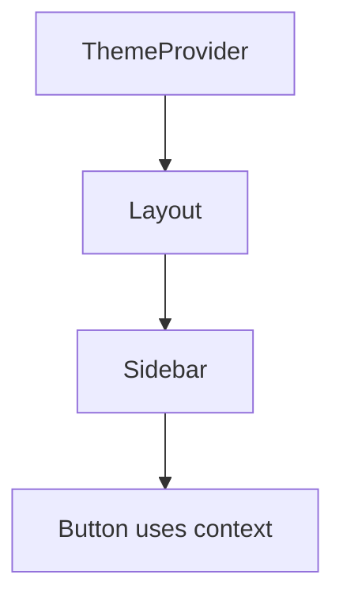

# useContext

## Detailed explanation
`useContext` reads a value from the nearest matching React Context provider above the component. It is useful for values that many components need without passing props through every intermediate layer, such as theme, current user shell data, locale, or dependency injection.

Context is not automatically a performance optimization or full state management solution. When the provider value changes, consumers re-render. For high-frequency updates, split contexts or use selector-based stores.

## 1. One-line mental model
`useContext` lets a component read shared provider data without prop drilling.

## 2. Problem it solves
Deeply nested components sometimes need common values, and passing props through every layer creates noise.

## 3. Core idea
- Create a context.
- Wrap part of the tree with a provider.
- Read the value with `useContext`.
- Consumers re-render when provider value changes.
- Keep provider values stable and scoped.

## 4. Visual / analogy
Context is like a building-wide announcement system: any room inside the building can hear the current message.



## 5. Minimal example

```tsx
const ThemeContext = React.createContext("light");

function Button() {
  const theme = React.useContext(ThemeContext);
  return <button data-theme={theme}>Save</button>;
}
```

## 6. Real-world example

```tsx
function useAuth() {
  const auth = React.useContext(AuthContext);
  if (!auth) throw new Error("useAuth must be used inside AuthProvider");
  return auth;
}
```

## 7. Common interview questions
#### What is `useContext`?
- **The Engine Mechanism (Why it behaves this way):** `useContext(ContextObject)` walks up the React component tree from the current Fiber node, searching for the nearest `Context.Provider` Fiber that matches the context's internal identifier. When found, React reads the `value` prop from that provider and returns it. If no provider is found, React returns the `defaultValue` that was passed to `createContext()`. React subscribes the consuming Fiber to the provider, so when the provider's value changes, all consumers are scheduled for re-render.
- **The Unforgettable Mental Model:** The **Building Intercom**. Instead of walking floor by floor passing a message (prop drilling), you pick up the intercom and instantly hear whatever the building manager (provider) is broadcasting. Every room with an intercom (consumer) gets the same message.
- **The Trap:** Thinking `useContext` is a performance optimization. It actually causes all consumers to re-render when the provider value changes, which can be worse than prop drilling if the value changes frequently.
- **Senior Interview Playbook (Verbal Script):** "When asked this in an interview, say: `useContext` is a hook that lets a component read a value from the nearest matching Context provider above it in the tree. It eliminates prop drilling by allowing deeply nested components to access shared values like themes, authentication state, or locale directly. When the provider's value changes, all consuming components re-render. It's a tool for avoiding intermediate prop passing, not a general-purpose state management solution."

#### How does Context avoid prop drilling?
- **The Engine Mechanism (Why it behaves this way):** Without Context, data flows exclusively through props — each component in the tree must explicitly receive and forward values it may not use itself. Context creates a "wormhole" in the component tree: a provider at any level makes its value available to any descendant, regardless of depth. React's Fiber tree traversal during rendering checks each component's context dependencies, and if a component calls `useContext`, React resolves the value from the nearest provider Fiber without requiring intermediate components to participate.
- **The Unforgettable Mental Model:** The **Elevator vs. the Stairs**. Prop drilling is taking the stairs — you stop at every floor (component) even if you don't need anything there. Context is the elevator — you go directly from the penthouse (provider) to the lobby (consumer) without stopping at intermediate floors.
- **The Trap:** Overusing Context for values that only need to pass through 1-2 levels. Prop drilling through a few components is more explicit and easier to trace than a global Context.
- **Senior Interview Playbook (Verbal Script):** "When asked this in an interview, say: Context avoids prop drilling by creating a direct communication channel between a provider and any descendant consumer. Instead of passing a value through every intermediate component that doesn't use it, the provider makes the value available at the tree level, and any component below can read it with `useContext`. This keeps intermediate components clean and focused on their own concerns. However, I only use it when the value needs to cross three or more component levels — for shorter distances, explicit props are clearer."

#### When should you use Context?
- **The Engine Mechanism (Why it behaves this way):** Context is ideal for values that are genuinely global or semi-global within a subtree and change infrequently. Because every consumer re-renders when the provider value changes, Context works best for low-frequency updates like theme toggles, locale changes, authentication state, or feature flags. React's reconciliation handles these efficiently because the re-render cost is proportional to the consumer tree size, which is manageable for infrequent changes.
- **The Unforgettable Mental Model:** The **Town Square Bulletin Board**. Perfect for announcements that everyone needs to see but don't change every minute — the mayor's speech, holiday schedules, emergency contacts. Terrible for a live stock ticker that updates every second.
- **The Trap:** Using Context for high-frequency state like form input values, scroll positions, or animation frames. This causes massive re-render cascades across all consumers.
- **Senior Interview Playbook (Verbal Script):** "When asked this in an interview, say: I use Context for values that many components need but change infrequently — things like theme, current user, locale, feature flags, or dependency injection. The key criterion is update frequency: if the value changes rarely, Context's re-render cost is negligible. If it changes frequently, I'd split the context, use a selector-based store like Zustand, or keep the state localized. Context is about avoiding prop drilling, not about managing all application state."

#### When should you not use Context?
- **The Engine Mechanism (Why it behaves this way):** Context triggers re-renders for all consumers whenever the provider value changes, with no built-in mechanism for selective subscription. If you store rapidly changing data (form inputs, mouse positions, animation frames) in a single broad context, every consumer re-renders on every change, regardless of whether it uses the changed portion. This is because React's context subscription is all-or-nothing — there's no selector mechanism to subscribe to only a slice of the context value.
- **The Unforgettable Mental Model:** The **Fire Alarm System**. When the alarm rings (context value changes), every room in the building (every consumer) gets notified, even if the fire is only in the kitchen. For high-frequency updates, this broadcast model is too expensive.
- **The Trap:** Putting an entire application state object in a single Context provider. Every state change re-renders every consumer, even those that only need one field.
- **Senior Interview Playbook (Verbal Script):** "When asked this in an interview, say: I avoid Context for high-frequency state updates, complex state management with derived values, or data that only a few components need. Context's all-or-nothing subscription model means every consumer re-renders on every value change. For complex state, I prefer libraries with selectors like Zustand or Redux Toolkit. For data that changes rapidly, I keep state localized or split contexts by update frequency. And for server data, I use dedicated data-fetching libraries with caching."

#### Why can Context cause re-renders?
- **The Engine Mechanism (Why it behaves this way):** When a Context provider's `value` prop changes, React marks all Fiber nodes that called `useContext` for that context as needing re-render. This happens during the reconciliation phase — React traverses the tree, finds all consumers, and schedules them. The comparison is done via `Object.is()` on the entire provider value. If you pass a new object or array literal as the value on every render (`value={{ theme, user }}`), `Object.is()` always returns `false`, triggering re-renders even if the contents haven't changed.
- **The Unforgettable Mental Model:** The **Loudspeaker Announcement**. Every time the provider speaks (value changes), everyone listening (consumers) stops what they're doing and pays attention. If the provider speaks every second with a new object reference, everyone is constantly interrupted — even if the message content is the same.
- **The Trap:** Creating the provider value inline: `<ThemeContext value={{ dark: isDark }}>`. This creates a new object every render, causing all consumers to re-render even when `isDark` hasn't changed.
- **Senior Interview Playbook (Verbal Script):** "When asked this in an interview, say: Context causes re-renders because React subscribes every consumer to the provider's value. When the value reference changes — detected via `Object.is()` — all consumers are scheduled for re-render. A common mistake is creating the value inline as a new object each render, which always triggers re-renders. To prevent this, I memoize the provider value with `useMemo` or split contexts so that only the relevant consumers re-render for each piece of state."

#### How do you optimize Context?
- **The Engine Mechanism (Why it behaves this way):** Optimization strategies work by reducing the number of consumers that re-render or the frequency of value changes. (1) Memoizing the provider value with `useMemo` prevents unnecessary reference changes. (2) Splitting contexts separates high-frequency and low-frequency values so only relevant consumers update. (3) Extracting consumers into memoized components with `React.memo` prevents re-renders of children that don't use the changed value. (4) Using selector patterns with libraries like `use-context-selector` allows components to subscribe to only a slice of the context value.
- **The Unforgettable Mental Model:** The **Departmental Memos**. Instead of sending every memo to every employee (single broad context), you split memos by department (split contexts), only send them when there's actual new information (memoized value), and let each employee choose which memos to read (selectors).
- **The Trap:** Trying to optimize a single monolithic context with `React.memo` on consumers. If the context value reference changes, `React.memo` can't prevent the re-render because the context subscription happens before the memo check.
- **Senior Interview Playbook (Verbal Script):** "When asked this in an interview, say: I optimize Context in three ways. First, I memoize the provider value with `useMemo` to avoid creating new object references on every render. Second, I split contexts by update frequency — theme in one context, user data in another — so only relevant consumers re-render. Third, for complex state, I use selector-based libraries or extract consumers into memoized components. The goal is to minimize the blast radius of each context change."

#### Context vs Redux/Zustand?
- **The Engine Mechanism (Why it behaves this way):** Context is a built-in React mechanism with all-or-nothing subscriptions — every consumer re-renders on any value change. Redux and Zustand are external state management libraries that implement selective subscriptions: components subscribe to specific slices of state via selectors, and only re-render when their selected slice changes. Redux uses a single store with reducers and middleware; Zustand uses a hook-based store with direct state access. Both provide devtools, time-travel debugging, and middleware ecosystems that Context lacks.
- **The Unforgettable Mental Model:** The **Radio vs. the Podcast Feed**. Context is like a radio station — everyone hears everything that's broadcast. Redux/Zustand is like a podcast feed — you subscribe only to the shows you care about, and you're notified only when new episodes of those shows drop.
- **The Trap:** Using Context as a full Redux replacement. Context lacks selectors, middleware, devtools, time-travel debugging, and the ecosystem that makes Redux/Zustand powerful for complex applications.
- **Senior Interview Playbook (Verbal Script):** "When asked this in an interview, say: Context is great for avoiding prop drilling with low-frequency values like theme or auth. But for complex application state, I prefer Redux or Zustand because they offer selective subscriptions — components only re-render when their specific slice of state changes. They also provide middleware, devtools, time-travel debugging, and predictable state transitions. Context is a transport mechanism; Redux/Zustand are full state management ecosystems. I choose based on complexity: simple shared values use Context, complex state uses a dedicated store."

## 8. Active recall test
1. **What provider does `useContext` read from?**
   - **Explanation:** The nearest matching `Context.Provider` above the component in the React tree. If no provider exists, it returns the `defaultValue` from `createContext()`.
2. **What happens when provider value changes?**
   - **Explanation:** All components that called `useContext` for that context are scheduled for re-render. React uses `Object.is()` to detect value changes — if the reference changes, all consumers update.
3. **What data is good for context?**
   - **Explanation:** Low-frequency, semi-global values: theme, locale, authenticated user, feature flags, dependency injection tokens. Values that many components need but change rarely.
4. **Why split providers?**
   - **Explanation:** To isolate re-render blast radius. If theme and user data are in separate contexts, changing theme only re-renders theme consumers, not user data consumers.
5. **Why wrap context access in a custom hook?**
   - **Explanation:** For encapsulation, validation, and future-proofing. A custom hook like `useAuth()` can throw if used outside a provider, add default behavior, and allow the underlying implementation to change without touching every consumer.

## 9. Mistakes / traps
- Putting rapidly changing state in one broad context.
- Creating a new provider value object every render.
- Using context for everything global.
- Forgetting default value behavior.
- Hiding dependencies too deeply.

## 10. Compare with related concepts
- **Context vs props:** context skips intermediate props; props are explicit.
- **Context vs global store:** global stores often provide selectors and finer subscriptions.
- **Context vs server state:** context does not solve caching or invalidation.

## 11. Summary from memory
Explain how a theme provider works and why context can cause unnecessary re-renders.

## 12. Spaced revision prompts
- After 1 day: Define `useContext`.
- After 3 days: Explain provider value changes.
- After 7 days: Optimize a context provider.
- After 14 days: Compare context and Zustand.

