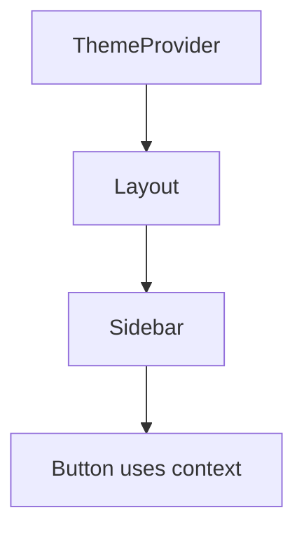

# useContext

## Detailed explanation
`useContext` reads a value from the nearest matching React Context provider above the component. It is useful for values that many components need without passing props through every intermediate layer, such as theme, current user shell data, locale, or dependency injection.

Context is not automatically a performance optimization or full state management solution. When the provider value changes, consumers re-render. For high-frequency updates, split contexts or use selector-based stores.

## 1. One-line mental model
`useContext` lets a component read shared provider data without prop drilling.

## 2. Problem it solves
Deeply nested components sometimes need common values, and passing props through every layer creates noise.

## 3. Core idea
- Create a context.
- Wrap part of the tree with a provider.
- Read the value with `useContext`.
- Consumers re-render when provider value changes.
- Keep provider values stable and scoped.

## 4. Visual / analogy
Context is like a building-wide announcement system: any room inside the building can hear the current message.



## 5. Minimal example

```tsx
const ThemeContext = React.createContext("light");

function Button() {
  const theme = React.useContext(ThemeContext);
  return <button data-theme={theme}>Save</button>;
}
```

## 6. Real-world example

```tsx
function useAuth() {
  const auth = React.useContext(AuthContext);
  if (!auth) throw new Error("useAuth must be used inside AuthProvider");
  return auth;
}
```

## 7. Common interview questions
- What is `useContext`?
- How does Context avoid prop drilling?
- When should you use Context?
- When should you not use Context?
- Why can Context cause re-renders?
- How do you optimize Context?
- Context vs Redux/Zustand?

## 8. Active recall test
1. What provider does `useContext` read from?
2. What happens when provider value changes?
3. What data is good for context?
4. Why split providers?
5. Why wrap context access in a custom hook?

## 9. Mistakes / traps
- Putting rapidly changing state in one broad context.
- Creating a new provider value object every render.
- Using context for everything global.
- Forgetting default value behavior.
- Hiding dependencies too deeply.

## 10. Compare with related concepts
- **Context vs props:** context skips intermediate props; props are explicit.
- **Context vs global store:** global stores often provide selectors and finer subscriptions.
- **Context vs server state:** context does not solve caching or invalidation.

## 11. Summary from memory
Explain how a theme provider works and why context can cause unnecessary re-renders.

## 12. Spaced revision prompts
- After 1 day: Define `useContext`.
- After 3 days: Explain provider value changes.
- After 7 days: Optimize a context provider.
- After 14 days: Compare context and Zustand.

