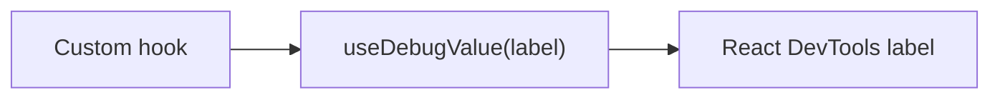

# useDebugValue

## Detailed explanation
`useDebugValue` lets custom hooks display a label in React DevTools. It does not affect runtime behavior or rendering. It is mainly useful for library hooks or shared hooks where DevTools readability matters.

Most application hooks do not need it. Use it when a hook's internal state is difficult to inspect and a concise DevTools label would help debugging.

## 1. One-line mental model
`useDebugValue` adds a DevTools label for a custom hook.

## 2. Problem it solves
Custom hooks can hide useful internal state from quick inspection in React DevTools.

## 3. Core idea
- Call it inside a custom hook.
- It labels hook state in DevTools.
- It does not change app behavior.
- Formatting can be deferred.
- Mostly useful for shared or library hooks.

## 4. Visual / analogy
It is like a label on a storage box: it does not change the contents, but it makes debugging easier.



## 5. Minimal example

```tsx
function useOnlineStatus() {
  const online = useOnlineStore();
  React.useDebugValue(online ? "Online" : "Offline");
  return online;
}
```

## 6. Real-world example

```tsx
function useAuthSession() {
  const session = React.useContext(AuthContext);
  React.useDebugValue(session, (value) => value?.user.name ?? "Anonymous");
  return session;
}
```

## 7. Common interview questions
- What is `useDebugValue`?
- Does it affect rendering?
- Where is it visible?
- When should it be used?
- Why is it mostly for custom hooks?
- What is deferred formatting?
- Should every hook use it?

## 8. Active recall test
1. Where do you see `useDebugValue` output?
2. Does it affect production UI?
3. Which hooks benefit most?
4. What does the formatter function do?
5. Why not use it everywhere?

## 9. Mistakes / traps
- Thinking it logs to console.
- Using it in every small hook.
- Putting expensive formatting inline.
- Expecting behavior changes.
- Using it instead of clear hook names.

## 10. Compare with related concepts
- **`useDebugValue` vs console.log:** DevTools label vs runtime log.
- **`useDebugValue` vs React DevTools:** hook supplies label; DevTools displays it.
- **Debug label vs state:** label describes state; it does not own state.

## 11. Summary from memory
Explain when a shared `useAuthSession` hook might use `useDebugValue`.

## 12. Spaced revision prompts
- After 1 day: Define `useDebugValue`.
- After 3 days: Explain where it appears.
- After 7 days: Add a debug label to a custom hook.
- After 14 days: Explain deferred formatting.

