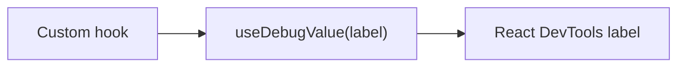

# useDebugValue

## Detailed explanation
`useDebugValue` lets custom hooks display a label in React DevTools. It does not affect runtime behavior or rendering. It is mainly useful for library hooks or shared hooks where DevTools readability matters.

Most application hooks do not need it. Use it when a hook's internal state is difficult to inspect and a concise DevTools label would help debugging.

## 1. One-line mental model
`useDebugValue` adds a DevTools label for a custom hook.

## 2. Problem it solves
Custom hooks can hide useful internal state from quick inspection in React DevTools.

## 3. Core idea
- Call it inside a custom hook.
- It labels hook state in DevTools.
- It does not change app behavior.
- Formatting can be deferred.
- Mostly useful for shared or library hooks.

## 4. Visual / analogy
It is like a label on a storage box: it does not change the contents, but it makes debugging easier.



## 5. Minimal example

```tsx
function useOnlineStatus() {
  const online = useOnlineStore();
  React.useDebugValue(online ? "Online" : "Offline");
  return online;
}
```

## 6. Real-world example

```tsx
function useAuthSession() {
  const session = React.useContext(AuthContext);
  React.useDebugValue(session, (value) => value?.user.name ?? "Anonymous");
  return session;
}
```

## 7. Common interview questions
#### What is `useDebugValue`?
- **The Engine Mechanism (Why it behaves this way):** `useDebugValue(value)` registers a label that React DevTools displays next to the custom hook in its component inspector. Under the hood, React stores the value in a debug-only field on the current Fiber's hook object. In production builds, this call is essentially a no-op — the value is stored but never rendered or transmitted. It has zero impact on the component's rendering behavior, reconciliation, or commit phases. It exists purely as a developer experience tool.
- **The Unforgettable Mental Model:** The **Luggage Tag**. A luggage tag doesn't change what's inside your suitcase or how it travels. It just helps you identify your bag on the carousel. `useDebugValue` is the same — it labels your hook in DevTools without affecting runtime behavior.
- **The Trap:** Thinking `useDebugValue` logs to the console or affects production behavior. It only appears in React DevTools and is stripped/ignored in production builds.
- **Senior Interview Playbook (Verbal Script):** "When asked this in an interview, say: `useDebugValue` is a hook that adds a label to a custom hook in React DevTools. It doesn't affect rendering, performance, or production behavior — it's purely a debugging aid. You call it inside a custom hook with a value you want to see in DevTools, and it appears next to the hook name in the component inspector. It's mainly useful for shared or library hooks where the internal state isn't obvious from the hook name alone."

#### Does it affect rendering?
- **The Engine Mechanism (Why it behaves this way):** `useDebugValue` has no connection to React's rendering pipeline. It doesn't schedule updates, doesn't modify the Virtual DOM, doesn't affect reconciliation, and doesn't trigger any phase of the commit process. The value is stored in a debug-only field on the Fiber hook object and is only read by React DevTools when you inspect the component. In production builds, the call may be entirely eliminated by tree-shaking or reduced to a no-op.
- **The Unforgettable Mental Model:** The **Sticky Note on a Monitor**. Placing a sticky note on your screen doesn't change what the computer is processing. It's just a visual aid for the person looking at the screen.
- **The Trap:** Using `useDebugValue` to pass data between components or hooks. It's not a communication mechanism — it's a DevTools label only.
- **Senior Interview Playbook (Verbal Script):** "When asked this in an interview, say: No, `useDebugValue` has absolutely no effect on rendering. It doesn't trigger re-renders, doesn't affect reconciliation, and doesn't change the component's output. It stores a value in a debug-only field that React DevTools reads when you inspect the component. In production, it's essentially a no-op. It's purely a developer experience tool — like a comment that shows up in DevTools instead of in the source code."

#### Where is it visible?
- **The Engine Material (Why it behaves this way):** The debug value appears in React DevTools under the "Components" tab, nested inside the custom hook's entry when you inspect a component that uses it. It shows as a label next to the hook name. For example, if a hook is named `useOnlineStatus` and you call `useDebugValue(online ? "Online" : "Offline")`, DevTools will display `useOnlineStatus: "Online"` next to the hook in the component tree inspector. It is not visible in the browser console, the DOM, or anywhere outside React DevTools.
- **The Unforgettable Mental Model:** The **Behind-the-Scenes Tour**. The debug value is like the stage directions in a theater script — the audience never sees them, but the director (developer) can read them during rehearsal (DevTools inspection).
- **The Trap:** Expecting to see the value in `console.log` or the browser's Elements panel. It only appears in React DevTools' component inspector.
- **Senior Interview Playbook (Verbal Script):** "When asked this in an interview, say: The debug value is visible only in React DevTools, specifically in the Components tab when you inspect a component. It appears as a label next to the custom hook name in the hook list. It's not visible in the console, the DOM, or anywhere in the browser outside DevTools. Think of it as metadata for developers inspecting the component tree, not as runtime data."

#### When should it be used?
- **The Engine Mechanism (Why it behaves this way):** `useDebugValue` is most valuable in custom hooks that are shared across a codebase or published as a library, where other developers need to understand the hook's internal state without reading its source code. It's also useful for hooks with complex internal state that isn't obvious from the hook's return value. For simple hooks like `useBoolean` that return a single obvious value, the debug label adds little value. The benefit scales with the hook's complexity and the number of developers who use it.
- **The Unforgettable Mental Model:** The **Product Manual**. A simple product (basic hook) doesn't need a detailed manual. A complex product (shared hook with multiple internal states) benefits from clear labeling so users understand what's happening inside.
- **The Trap:** Adding `useDebugValue` to every custom hook regardless of complexity. For simple hooks, the label is redundant with the hook name and return value.
- **Senior Interview Playbook (Verbal Script):** "When asked this in an interview, say: I use `useDebugValue` for custom hooks that are shared across teams or published as libraries — hooks where other developers benefit from seeing internal state in DevTools. It's especially useful for hooks with complex internal state that isn't obvious from the return value, like a `useAuthSession` hook that manages token refresh, expiration, and user data. For simple hooks like `useBoolean` or `useCounter`, the debug label adds little value beyond what the hook name already communicates."

#### Why is it mostly for custom hooks?
- **The Engine Mechanism (Why it behaves this way):** Built-in hooks like `useState` and `useEffect` already have their values displayed in React DevTools by default — DevTools knows how to render state values, effect dependencies, and context values. `useDebugValue` is specifically designed for custom hooks because DevTools has no built-in understanding of what a custom hook's internal state means. Without a debug label, a custom hook appears in DevTools with its internal hook calls but no high-level description of what the hook represents.
- **The Unforgettable Mental Model:** The **Name Badge at a Conference**. Built-in hooks already have printed name badges (DevTools knows them). Custom hooks are new attendees — they need to write their own name badge (`useDebugValue`) so people know who they are.
- **The Trap:** Using `useDebugValue` in regular components instead of custom hooks. It only works when called inside a custom hook — calling it in a component function has no effect.
- **Senior Interview Playbook (Verbal Script):** "When asked this in an interview, say: Built-in hooks are already labeled in React DevTools — state shows its value, effects show their dependencies, context shows its provider value. Custom hooks are opaque to DevTools; they appear as a collection of internal hook calls without a meaningful label. `useDebugValue` gives custom hooks a human-readable label that describes what the hook represents at a high level. It's specifically for custom hooks because that's where DevTools needs the most help understanding what's happening."

#### What is deferred formatting?
- **The Engine Mechanism (Why it behaves this way):** `useDebugValue` accepts an optional second argument: a formatter function. `useDebugValue(value, formatter)` — React only calls the formatter function when DevTools is open and inspecting the component. If DevTools is closed, the formatter is never called. This defers expensive formatting operations (like date parsing, JSON serialization, or complex string building) until they're actually needed for display, avoiding unnecessary computation during normal app execution.
- **The Unforgettable Mental Model:** The **On-Demand Translator**. Instead of translating a document before anyone asks for it, you keep the original and only translate when someone requests it. If nobody asks, you saved the translation effort.
- **The Trap:** Passing an already-formatted value as the first argument: `useDebugValue(formatExpensiveData(data))`. This formats on every render regardless of whether DevTools is open. Use the formatter function instead.
- **Senior Interview Playbook (Verbal Script):** "When asked this in an interview, say: Deferred formatting is when you pass a formatter function as the second argument to `useDebugValue`. React only calls this formatter when React DevTools is open and inspecting the component. This is important for expensive formatting operations — if you format the value inline as the first argument, it runs on every render. With deferred formatting, the expensive operation only runs when a developer is actually looking at the DevTools, saving CPU cycles during normal execution."

#### Should every hook use it?
- **The Engine Mechanism (Why it behaves this way):** Adding `useDebugValue` to every custom hook increases bundle size (however minimally), adds cognitive overhead to the codebase, and provides diminishing returns for simple hooks. The value of a debug label is proportional to the hook's complexity and the number of developers who use it. A `useToggle` hook that returns `[value, toggle]` is self-explanatory — the DevTools display of the internal `useState` already tells you everything. A `useDataFetcher` hook with loading states, error handling, caching, and retry logic benefits greatly from a label like `"loading"`, `"success (42 items)"`, or `"error: timeout"`.
- **The Unforgettable Mental Model:** The **Book Index**. A short pamphlet doesn't need an index. A 500-page textbook does. The debug label is the index — it helps you navigate complexity, but it's overkill for simple content.
- **The Trap:** Adding `useDebugValue` to every hook as a rule. This creates noise in DevTools and code without meaningful benefit for simple hooks.
- **Senior Interview Playbook (Verbal Script):** "When asked this in an interview, say: No, not every hook needs `useDebugValue`. I add it selectively to hooks that are complex, shared across teams, or have internal state that isn't obvious from the name and return value. Simple hooks like `useBoolean` or `useToggle` are self-explanatory — their internal state is clear from the hook name. Complex hooks like `useDataFetcher`, `useAuthSession`, or `useWebSocket` benefit from debug labels because their internal state has multiple dimensions that aren't immediately obvious. It's a judgment call based on complexity and audience."

## 8. Active recall test
1. **Where do you see `useDebugValue` output?**
   - **Explanation:** In React DevTools' Components tab, as a label next to the custom hook name when inspecting a component. It's not visible anywhere else — not in console, DOM, or production.
2. **Does it affect production UI?**
   - **Explanation:** No. It has zero impact on rendering, reconciliation, or production behavior. In production builds, it's essentially a no-op or may be tree-shaken entirely.
3. **Which hooks benefit most?**
   - **Explanation:** Complex shared hooks or library hooks with non-obvious internal state — data fetchers, auth sessions, WebSocket connections. Simple hooks like `useBoolean` don't benefit much.
4. **What does the formatter function do?**
   - **Explanation:** It defers expensive formatting until DevTools is open. React only calls the formatter when inspecting the component, avoiding unnecessary computation during normal execution.
5. **Why not use it everywhere?**
   - **Explanation:** It adds code noise and cognitive overhead without meaningful benefit for simple hooks. The value scales with hook complexity and the number of developers who need to understand the hook's internals.

## 9. Mistakes / traps
- Thinking it logs to console.
- Using it in every small hook.
- Putting expensive formatting inline.
- Expecting behavior changes.
- Using it instead of clear hook names.

## 10. Compare with related concepts
- **`useDebugValue` vs console.log:** DevTools label vs runtime log.
- **`useDebugValue` vs React DevTools:** hook supplies label; DevTools displays it.
- **Debug label vs state:** label describes state; it does not own state.

## 11. Summary from memory
Explain when a shared `useAuthSession` hook might use `useDebugValue`.

## 12. Spaced revision prompts
- After 1 day: Define `useDebugValue`.
- After 3 days: Explain where it appears.
- After 7 days: Add a debug label to a custom hook.
- After 14 days: Explain deferred formatting.

