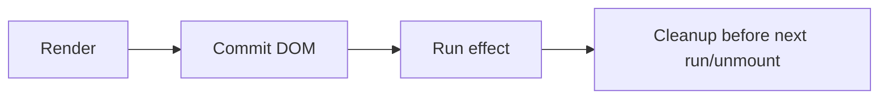

# useEffect

## Detailed explanation
`useEffect` lets a component synchronize with systems outside React after rendering, such as subscriptions, timers, browser APIs, analytics, or manual network requests. It runs after React commits updates to the DOM.

The most important point is that effects are not for deriving render data. If something can be calculated from props or state during render, it usually should not be placed in an effect. Effects should connect React to external systems and clean up after themselves when needed.

## 1. One-line mental model
`useEffect` synchronizes a component with something outside React after commit.

## 2. Problem it solves
Components sometimes need to start or update external work after React has rendered the UI.

## 3. Core idea
- Effects run after commit.
- Dependencies tell React when to re-run the effect.
- Cleanup runs before the effect re-runs and when the component unmounts.
- Effects should be idempotent and cleanup-safe.
- Avoid effects for pure derived state.

## 4. Visual / analogy
An effect is like plugging in equipment after the room is built, then unplugging it when leaving.



## 5. Minimal example

```tsx
function Title({ title }: { title: string }) {
  React.useEffect(() => {
    document.title = title;
  }, [title]);

  return <h1>{title}</h1>;
}
```

## 6. Real-world example

```tsx
function OnlineStatus() {
  const [online, setOnline] = React.useState(navigator.onLine);

  React.useEffect(() => {
    const update = () => setOnline(navigator.onLine);
    window.addEventListener("online", update);
    window.addEventListener("offline", update);
    return () => {
      window.removeEventListener("online", update);
      window.removeEventListener("offline", update);
    };
  }, []);

  return <p>{online ? "Online" : "Offline"}</p>;
}
```

## 7. Common interview questions
#### What is `useEffect` used for?
- **The Engine Mechanism (Why it behaves this way):** `useEffect` registers a side-effect callback that React stores on the current Fiber node. After React commits DOM mutations (the commit phase), it schedules the effect to run asynchronously via the browser's event loop. This ensures the effect runs after the user sees the updated UI. Effects are designed for synchronizing with external systems — subscriptions, timers, DOM APIs, network requests — that exist outside React's rendering model.
- **The Unforgettable Mental Model:** The **After-Show Cleanup Crew**. The actors perform their scene (render), the audience sees the final stage (commit), and only then does the crew come out to adjust the props for the next act (effect). They never work while the curtain is up.
- **The Trap:** Using `useEffect` to derive data from props/state that could be computed during render. Effects are for external synchronization, not for transforming render data.
- **Senior Interview Playbook (Verbal Script):** "When asked this in an interview, say: `useEffect` is used to synchronize a React component with external systems — things outside React's rendering model. This includes subscriptions, timers, browser APIs, analytics events, and manual network requests. It runs after React commits DOM updates, ensuring effects don't block the visual update. Importantly, effects should not be used to derive render data from props or state — that should happen during the render phase itself."

#### When does `useEffect` run?
- **The Engine Mechanism (Why it behaves this way):** Effects run during the "effect phase" of the commit cycle, after React has applied all DOM mutations but before the browser paints. However, `useEffect` callbacks are scheduled asynchronously via `setTimeout`-like scheduling, meaning they fire after the paint completes. This differs from `useLayoutEffect`, which fires synchronously before paint. On mount, the effect runs after the first commit. On updates, it runs after each commit where dependencies changed.
- **The Unforgettable Mental Model:** The **Text Message Delay**. You send a message (render commits), the recipient sees it on screen (browser paints), and only then does your phone buzz with the reply notification (effect fires). There's always a beat between the visual update and the effect execution.
- **The Trap:** Assuming effects run synchronously with render. They do not — there is always at least one paint cycle between the DOM update and the effect callback execution.
- **Senior Interview Playbook (Verbal Script):** "When asked this in an interview, say: `useEffect` runs asynchronously after React commits DOM updates and after the browser has painted the screen. On mount, it runs after the initial render and paint. On updates, it runs after each render where its dependencies have changed. Because it fires after paint, it never blocks the visual update, which makes it ideal for non-urgent side effects like subscriptions or analytics."

#### What is the dependency array?
- **The Engine Mechanism (Why it behaves this way):** The dependency array is an array of reactive values that React compares using `Object.is()` between renders. After each commit, React iterates through the effect's dependency list and compares each value with its previous counterpart. If any comparison returns `false`, React schedules the effect to re-run. If all values are `Object.is()`-equal, React skips the effect. An empty array `[]` means "never re-run after mount." No array means "run after every render."
- **The Unforgettable Mental Model:** The **Security Checkpoint**. Each dependency is a guard checking an ID badge. If any badge has changed since last time, the gate opens and the effect runs. If all badges match, the gate stays closed and the effect is skipped.
- **The Trap:** Omitting values that are used inside the effect callback. This creates a stale closure where the effect reads outdated values from a previous render's scope.
- **Senior Interview Playbook (Verbal Script):** "When asked this in an interview, say: The dependency array tells React which reactive values the effect depends on. React compares each dependency with its previous value using `Object.is()`. If any dependency changed, the effect re-runs. An empty array means the effect runs only on mount. Omitting the array entirely means it runs after every render. The golden rule is: every reactive value used inside the effect — props, state, derived variables — must be listed as a dependency to avoid stale closures."

#### What is cleanup?
- **The Engine Mechanism (Why it behaves this way):** When an effect returns a function, React stores it as the cleanup callback. Before re-running the effect (on dependency change) or unmounting the component, React calls this cleanup function synchronously during the commit phase. This ensures that subscriptions are unsubscribed, timers are cleared, and event listeners are removed before the next effect runs or the component is destroyed. Cleanup runs in the same phase as DOM mutations, not asynchronously.
- **The Unforgettable Mental Model:** The **Hotel Checkout**. Before you check into a new room (new effect), you must check out of the old one (cleanup) — return the key, settle the bill, leave the room clean. If you never check out, you accumulate charges (memory leaks).
- **The Trap:** Forgetting cleanup for subscriptions, event listeners, or timers. This causes memory leaks, duplicate subscriptions, and handlers firing on unmounted components.
- **Senior Interview Playbook (Verbal Script):** "When asked this in an interview, say: Cleanup is a function returned from an effect that React calls before re-running the effect or when the component unmounts. It's essential for preventing memory leaks and stale behavior — unsubscribing from data sources, removing event listeners, and clearing timers. React guarantees cleanup runs before the next effect execution, so you don't end up with duplicate subscriptions or orphaned handlers. Every effect that connects to an external system should have a cleanup function."

#### Why does `useEffect` run twice in StrictMode development?
- **The Engine Mechanism (Why it behaves this way):** In development mode with StrictMode enabled, React intentionally mounts the component, runs effects, then immediately unmounts it (calling cleanup), and remounts it again. This simulates the behavior of Concurrent Mode, where React may create, destroy, and recreate component trees before committing them. The purpose is to surface bugs related to missing cleanup functions and non-idempotent effects that would otherwise only appear in production under concurrent rendering.
- **The Unforgettable Mental Model:** The **Fire Drill**. StrictMode runs a practice fire drill: it evacuates the building (unmounts), then has everyone return (remounts). If your emergency plan (cleanup) is broken, the drill exposes it before a real fire (production concurrent rendering) happens.
- **The Trap:** Thinking the double-run is a bug. It's intentional. If your effect behaves incorrectly on double-run, it means your cleanup is missing or your effect isn't idempotent.
- **Senior Interview Playbook (Verbal Script):** "When asked this in an interview, say: StrictMode double-invokes effects in development to help surface bugs related to missing cleanup and non-idempotent effects. It simulates Concurrent Mode behavior, where React may create and destroy component trees before committing. If an effect works correctly under StrictMode's double-run, it means the effect properly cleans up after itself and can safely handle being mounted, unmounted, and remounted — which is essential for resilient concurrent rendering."

#### When should you not use `useEffect`?
- **The Engine Mechanism (Why it behaves this way):** React's render phase is designed for pure computation — deriving UI from state. When you put computation in an effect, you force React to complete a full render-commit cycle before the computation even starts, then trigger another render when the effect updates state. This creates a render-effect-render cascade that is slower and more error-prone than computing the value directly during render. React 18's architecture specifically optimizes the render phase for this pattern.
- **The Unforgettable Mental Model:** The **Detour Route**. You need to get from A to C. The direct route is computing during render (A → C). Using an effect is driving A → B → C — you go all the way to the effect, update state, then render again. It's always longer.
- **The Trap:** Using effects to transform data: `useEffect(() => setFiltered(items.filter(...)), [items])`. This should be `const filtered = items.filter(...)` computed during render or wrapped in `useMemo`.
- **Senior Interview Playbook (Verbal Script):** "When asked this in an interview, say: I avoid `useEffect` for deriving data from props or state — that should happen during render. I also avoid it for event-driven logic that should live in event handlers, and for initialization that can be done with lazy state. Effects are specifically for synchronizing with external systems. If the logic can be expressed as a pure computation from existing data, it belongs in the render body or `useMemo`, not in an effect."

#### How do you handle async logic in effects?
- **The Engine Mechanism (Why it behaves this way):** The effect callback itself cannot be `async` because React expects either `undefined` or a cleanup function as the return value. An `async` function returns a Promise, which React would mistakenly treat as a cleanup function. Instead, you define an async function inside the effect and call it immediately, or use `.then()` chains. For cancellation, you use an `AbortController` or a boolean flag checked in the cleanup function to prevent state updates on unmounted components.
- **The Unforgettable Mental Model:** The **Ghost Caller**. An async request is like someone who leaves to make a phone call. If the meeting ends (component unmounts) before they return, their callback still rings. You need a way to tell them "the meeting's over, don't report back" (AbortController/cleanup flag).
- **The Trap:** Making the effect callback `async` directly: `useEffect(async () => {...})`. This returns a Promise, which React interprets as a cleanup function and will call it, causing errors.
- **Senior Interview Playbook (Verbal Script):** "When asked this in an interview, say: You can't make the effect callback async directly because React expects the return value to be a cleanup function, not a Promise. Instead, I define an async function inside the effect and invoke it immediately. For cancellation, I use an AbortController and pass its signal to fetch, then abort in the cleanup function. This prevents state updates on unmounted components and avoids memory leaks from orphaned promises."

## 8. Active recall test
1. **Does `useEffect` run during render?**
   - **Explanation:** No. `useEffect` runs asynchronously after React commits DOM updates and after the browser paints. The render phase must complete fully before effects are scheduled.
2. **What does cleanup prevent?**
   - **Explanation:** Cleanup prevents memory leaks, duplicate subscriptions, stale event listeners, and state updates on unmounted components. It runs before the next effect execution and on component unmount.
3. **What happens with an empty dependency array?**
   - **Explanation:** The effect runs only once after the initial mount and never re-runs on subsequent renders. It still runs cleanup on unmount.
4. **Why is derived state usually not an effect?**
   - **Explanation:** Computing derived state in an effect requires a render → effect → state update → re-render cycle, which is slower and error-prone. Derived values should be computed directly during render or with `useMemo`.
5. **How do you cancel a fetch in an effect?**
   - **Explanation:** Create an `AbortController`, pass its `signal` to `fetch()`, and call `controller.abort()` in the cleanup function. This cancels the in-flight request and prevents state updates on unmounted components.

## 9. Mistakes / traps
- Using effects to compute values that can be derived during render.
- Missing dependencies and creating stale closures.
- Adding unstable dependencies that cause loops.
- Forgetting cleanup for subscriptions or timers.
- Making the effect callback itself `async`.

## 10. Compare with related concepts
- **`useEffect` vs `useLayoutEffect`:** effect runs after paint; layout effect runs before paint.
- **Effect vs event handler:** effects react to rendering; handlers react to user actions.
- **Effect vs render:** render calculates UI; effect synchronizes external systems.

## 11. Summary from memory
Explain when you would use `useEffect`, what dependencies do, and why cleanup matters.

## 12. Spaced revision prompts
- After 1 day: Define `useEffect`.
- After 3 days: Explain dependency arrays.
- After 7 days: Fix a stale closure effect.
- After 14 days: Explain when not to use effects.

