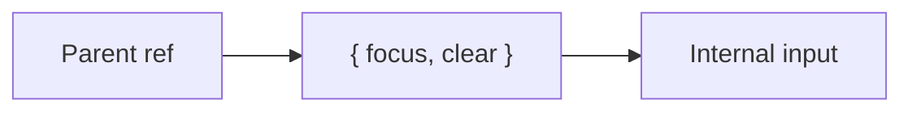

# useImperativeHandle

## Detailed explanation
`useImperativeHandle` customizes the value exposed to a parent through a forwarded ref. Instead of exposing the entire DOM node or internal component details, a child can expose a small intentional imperative API such as `focus()`, `clear()`, or `scrollToTop()`.

This hook is an escape hatch. Prefer declarative props first. Use it when a reusable component genuinely needs to expose imperative behavior while preserving encapsulation.

## 1. One-line mental model
`useImperativeHandle` lets a component choose what its forwarded ref exposes.

## 2. Problem it solves
Parents sometimes need imperative access, but exposing internal DOM nodes can leak implementation details.

## 3. Core idea
- Requires `forwardRef`.
- Defines a custom ref handle.
- Exposes intentional methods.
- Hides internal DOM structure.
- Use sparingly.

## 4. Visual / analogy
It is like giving someone a remote control with three buttons instead of access to the whole machine.



## 5. Minimal example

```tsx
type InputHandle = { focus: () => void };

const Input = React.forwardRef<InputHandle>((_, ref) => {
  const inputRef = React.useRef<HTMLInputElement>(null);
  React.useImperativeHandle(ref, () => ({
    focus: () => inputRef.current?.focus(),
  }));
  return <input ref={inputRef} />;
});
```

## 6. Real-world example

```tsx
type ModalHandle = { open: () => void; close: () => void };
```

A design-system modal might expose a controlled imperative API to integrate with legacy flows, though declarative `open` props are usually preferred.

## 7. Common interview questions
- What is `useImperativeHandle`?
- Why does it need `forwardRef`?
- When should you use it?
- What should a ref handle expose?
- Why is it an escape hatch?
- How does it preserve encapsulation?
- Declarative prop vs imperative handle?

## 8. Active recall test
1. What hook customizes ref exposure?
2. What must wrap the component?
3. Why not expose the full DOM node?
4. What is one valid method to expose?
5. Why prefer declarative APIs first?

## 9. Mistakes / traps
- Overusing imperative APIs.
- Exposing internal DOM structure.
- Forgetting dependency concerns in handle creation.
- Using it instead of simple props.
- Returning unstable handles unnecessarily.

## 10. Compare with related concepts
- **`useImperativeHandle` vs `forwardRef`:** forwardRef passes ref in; imperative handle customizes what goes out.
- **Imperative handle vs props:** props describe desired state; handles command actions.
- **Handle vs DOM node:** handle can hide DOM internals.

## 11. Summary from memory
Explain how an input can expose only `focus()` to its parent instead of the raw DOM node.

## 12. Spaced revision prompts
- After 1 day: Define `useImperativeHandle`.
- After 3 days: Explain relation to `forwardRef`.
- After 7 days: Design a minimal ref handle.
- After 14 days: Compare imperative handle and declarative prop.

