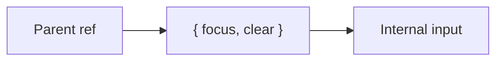

# useImperativeHandle

## Detailed explanation
`useImperativeHandle` customizes the value exposed to a parent through a forwarded ref. Instead of exposing the entire DOM node or internal component details, a child can expose a small intentional imperative API such as `focus()`, `clear()`, or `scrollToTop()`.

This hook is an escape hatch. Prefer declarative props first. Use it when a reusable component genuinely needs to expose imperative behavior while preserving encapsulation.

## 1. One-line mental model
`useImperativeHandle` lets a component choose what its forwarded ref exposes.

## 2. Problem it solves
Parents sometimes need imperative access, but exposing internal DOM nodes can leak implementation details.

## 3. Core idea
- Requires `forwardRef`.
- Defines a custom ref handle.
- Exposes intentional methods.
- Hides internal DOM structure.
- Use sparingly.

## 4. Visual / analogy
It is like giving someone a remote control with three buttons instead of access to the whole machine.



## 5. Minimal example

```tsx
type InputHandle = { focus: () => void };

const Input = React.forwardRef<InputHandle>((_, ref) => {
  const inputRef = React.useRef<HTMLInputElement>(null);
  React.useImperativeHandle(ref, () => ({
    focus: () => inputRef.current?.focus(),
  }));
  return <input ref={inputRef} />;
});
```

## 6. Real-world example

```tsx
type ModalHandle = { open: () => void; close: () => void };
```

A design-system modal might expose a controlled imperative API to integrate with legacy flows, though declarative `open` props are usually preferred.

## 7. Common interview questions
#### What is `useImperativeHandle`?
- **The Engine Mechanism (Why it behaves this way):** `useImperativeHandle(ref, createHandle, deps)` customizes the object that a parent receives when it passes a `ref` to a child component wrapped in `forwardRef`. During the commit phase, after the DOM node or component instance is created, React calls the `createHandle` function and assigns its return value to the parent's `ref.current`. The dependency array works like `useCallback` — if dependencies change, React re-calls `createHandle` and updates `ref.current` with the new handle object.
- **The Unforgettable Mental Model:** The **Concierge Desk**. Instead of giving guests (parent) access to the entire hotel's back office (internal DOM), the concierge (useImperativeHandle) provides a curated list of services: "We can do check-in, room service, and wake-up calls." Everything else is behind the scenes.
- **The Trap:** Thinking it creates a new ref. It doesn't — it customizes what an existing forwarded ref exposes. You still need `forwardRef` to receive the ref from the parent.
- **Senior Interview Playbook (Verbal Script):** "When asked this in an interview, say: `useImperativeHandle` lets a child component control what a parent sees through a forwarded ref. Instead of exposing the raw DOM node or internal implementation details, the child defines a custom API — methods like `focus()`, `clear()`, or `scrollTo()`. It's an escape hatch for component libraries that need to expose imperative behavior while maintaining encapsulation. I use it sparingly, preferring declarative props whenever possible."

#### Why does it need `forwardRef`?
- **The Engine Mechanism (Why it behaves this way):** In React, function components don't have instances, so they can't receive refs directly. `forwardRef` is a higher-order component that wraps a function component and intercepts the `ref` prop from the parent, passing it as a second argument to the component function. Without `forwardRef`, the `ref` prop is silently dropped and never reaches the child. `useImperativeHandle` needs this ref to customize what gets assigned to `ref.current` — without the ref being passed in, there's nothing to customize.
- **The Unforgettable Mental Model:** The **Mail Forwarding Service**. `forwardRef` is like a mail forwarding address — it takes mail (ref) sent to the building (component) and delivers it to the specific apartment (function). Without forwarding, the mail goes to the void.
- **The Trap:** Using `useImperativeHandle` in a component that isn't wrapped with `forwardRef`. The ref will be undefined, and the handle won't be assigned anywhere.
- **Senior Interview Playbook (Verbal Script):** "When asked this in an interview, say: Function components don't have instances, so they can't receive refs natively. `forwardRef` bridges this gap by intercepting the ref from the parent and passing it as a second argument to the component function. `useImperativeHandle` needs this ref to customize what the parent sees. Without `forwardRef`, the ref is dropped and `useImperativeHandle` has nothing to work with. They work as a pair: `forwardRef` brings the ref in, `useImperativeHandle` decides what goes out."

#### When should you use it?
- **The Engine Mechanism (Why it behaves this way):** `useImperativeHandle` is appropriate when a reusable component needs to expose imperative methods that can't be expressed declaratively. Common cases include: form inputs that need programmatic focus, scrollable containers with `scrollTo()` methods, media players with play/pause controls, and design system components that integrate with legacy code requiring imperative APIs. The hook lets you expose a minimal, intentional API while hiding internal DOM structure and implementation details.
- **The Unforgettable Mental Model:** The **ATM Interface**. You don't need access to the bank's vault or accounting system. The ATM gives you exactly what you need: deposit, withdraw, check balance. Clean, limited, intentional.
- **The Trap:** Using imperative handles for things that could be declarative props. If a parent can express its intent through `isOpen={true}` instead of `ref.current.open()`, the declarative approach is always preferred.
- **Senior Interview Playbook (Verbal Script):** "When asked this in an interview, say: I use `useImperativeHandle` when building reusable components that genuinely need imperative APIs — form inputs with focus/clear methods, scrollable containers with scrollTo, media players with play/pause. It's also useful for integrating with legacy code that expects imperative APIs. But I always ask first: can this be done declaratively? If a parent can achieve the same result with props like `isOpen` or `autoFocus`, I prefer that. Imperative handles are an escape hatch, not a default pattern."

#### What should a ref handle expose?
- **The Engine Mechanism (Why it behaves this way):** A ref handle should expose only the minimal set of methods that a parent genuinely needs to control the child imperatively. Each method should be a stable function (often wrapped in `useCallback`) that operates on the child's internal DOM or state. The handle should never expose raw DOM nodes, internal state objects, or implementation details. This encapsulation allows the child component to change its internal implementation without breaking the parent's usage of the handle.
- **The Unforgettable Mental Model:** The **Car Dashboard**. The dashboard exposes exactly what the driver needs: steering wheel, pedals, gear shift. It doesn't expose the engine block, the wiring harness, or the fuel injection system. Those are internal.
- **The Trap:** Exposing the entire DOM node or internal state: `useImperativeHandle(ref, () => ({ inputElement, state, methods }))`. This leaks implementation details and couples the parent to the child's internals.
- **Senior Interview Playbook (Verbal Script):** "When asked this in an interview, say: A ref handle should expose only the minimal imperative methods a parent needs — things like `focus()`, `clear()`, `scrollTo()`, or `open()`. It should never expose raw DOM nodes, internal state, or implementation details. Each method should be a pure action that the parent can call without knowing how the child works internally. This encapsulation protects both components: the child can change its internals freely, and the parent has a clean, stable API to work with."

#### Why is it an escape hatch?
- **The Engine Mechanism (Why it behaves this way):** React's core paradigm is declarative: you describe what the UI should look like for a given state, and React handles the DOM updates. Imperative handles break this paradigm by allowing parents to directly command children to perform actions, bypassing the declarative state-driven flow. This creates a two-way communication channel that's harder to reason about, test, and debug. React provides `useImperativeHandle` because sometimes the declarative model isn't sufficient — but it's deliberately positioned as an exception, not the norm.
- **The Unforgettable Mental Model:** The **Emergency Exit**. The main entrance (declarative props) is where everyone should enter and exit. The emergency exit (imperative handle) is there for special cases, but you don't use it for daily traffic because it bypasses the normal flow.
- **The Trap:** Building entire component communication through imperative handles. This creates tightly coupled, hard-to-maintain code that defeats React's declarative design.
- **Senior Interview Playbook (Verbal Script):** "When asked this in an interview, say: It's an escape hatch because it breaks React's declarative model. React's strength is describing UI as a function of state — you set props, and React figures out the DOM. Imperative handles let parents directly command children, which creates imperative code paths that are harder to reason about and test. React provides this escape hatch because sometimes you genuinely need imperative control — like focusing an input or scrolling to a position — but it should be the exception, not the rule. Declarative props should always be the first choice."

#### How does it preserve encapsulation?
- **The Engine Mechanism (Why it behaves this way):** Encapsulation is preserved because the handle object returned by `useImperativeHandle` is a custom abstraction layer between the parent and the child's internals. The parent interacts with the handle's methods, not with the child's DOM nodes or state. The child can change its internal DOM structure, switch from `<input>` to `<textarea>`, or reorganize its state — as long as the handle's methods continue to work, the parent is unaffected. This is the same principle as public vs. private methods in object-oriented programming.
- **The Unforgettable Mental Model:** The **Restaurant Kitchen Window**. Diners (parents) see the food come through the window (handle methods). They don't see the kitchen layout, the chef's techniques, or the ingredient storage (internal DOM/state). The kitchen can reorganize completely without diners noticing.
- **The Trap:** Returning the internal DOM node directly: `useImperativeHandle(ref, () => inputRef.current)`. This exposes the entire DOM API, defeating encapsulation entirely.
- **Senior Interview Playbook (Verbal Script):** "When asked this in an interview, say: `useImperativeHandle` preserves encapsulation by creating an abstraction layer. The parent only sees the methods I explicitly expose — `focus()`, `clear()`, etc. — not the internal DOM nodes or state. I can change the child's implementation — swap elements, restructure the DOM, refactor state management — and as long as the handle methods work the same way, the parent is unaffected. This is much safer than exposing the raw DOM node, which would couple the parent to the child's internal structure."

#### Declarative prop vs imperative handle?
- **The Engine Mechanism (Why it behaves this way):** Declarative props describe the desired state: `isOpen={true}` tells the modal "be open." The modal component decides how to transition, animate, and manage focus. Imperative handles command an action: `ref.current.open()` tells the modal "open now." The parent controls the timing and execution. Declarative is better for state that React owns and manages; imperative is better for one-off actions that don't correspond to persistent state, like focusing an input after an error or scrolling to a specific position.
- **The Unforgettable Mental Model:** The **Thermostat vs. the Light Switch**. A thermostat (declarative) says "keep the room at 72°F" — the system manages how to get there. A light switch (imperative) says "turn on now" — it's a direct command with no ongoing management.
- **The Trap:** Using imperative handles for state that should be declarative. `ref.current.show()` vs `visible={true}` — the declarative version is easier to reason about, test, and debug.
- **Senior Interview Playbook (Verbal Script):** "When asked this in an interview, say: I prefer declarative props whenever possible because they fit React's model — the parent describes the desired state, and the child manages how to achieve it. `isOpen={true}` is clearer than `ref.current.open()`. I use imperative handles only for actions that don't map to persistent state — focusing an input, scrolling to a position, or triggering an animation. The rule of thumb is: if it's a state the component maintains, use a prop. If it's a one-off action, an imperative handle might be appropriate."

## 8. Active recall test
1. **What hook customizes ref exposure?**
   - **Explanation:** `useImperativeHandle(ref, createHandle, deps)` — it lets a child component define what object the parent receives through a forwarded ref.
2. **What must wrap the component?**
   - **Explanation:** `forwardRef`. Function components can't receive refs directly, so `forwardRef` intercepts the ref from the parent and passes it as a second argument.
3. **Why not expose the full DOM node?**
   - **Explanation:** It leaks implementation details and couples the parent to the child's internal structure. If the child changes its DOM, the parent breaks. A curated handle preserves encapsulation.
4. **What is one valid method to expose?**
   - **Explanation:** `focus()` on a custom input component, `scrollTo()` on a list, `open()`/`close()` on a modal — minimal, intentional actions that the parent needs to trigger imperatively.
5. **Why prefer declarative APIs first?**
   - **Explanation:** Declarative props fit React's model of UI as a function of state. They're easier to reason about, test, and debug. Imperative handles create two-way communication that's harder to track and maintain.

## 9. Mistakes / traps
- Overusing imperative APIs.
- Exposing internal DOM structure.
- Forgetting dependency concerns in handle creation.
- Using it instead of simple props.
- Returning unstable handles unnecessarily.

## 10. Compare with related concepts
- **`useImperativeHandle` vs `forwardRef`:** forwardRef passes ref in; imperative handle customizes what goes out.
- **Imperative handle vs props:** props describe desired state; handles command actions.
- **Handle vs DOM node:** handle can hide DOM internals.

## 11. Summary from memory
Explain how an input can expose only `focus()` to its parent instead of the raw DOM node.

## 12. Spaced revision prompts
- After 1 day: Define `useImperativeHandle`.
- After 3 days: Explain relation to `forwardRef`.
- After 7 days: Design a minimal ref handle.
- After 14 days: Compare imperative handle and declarative prop.

