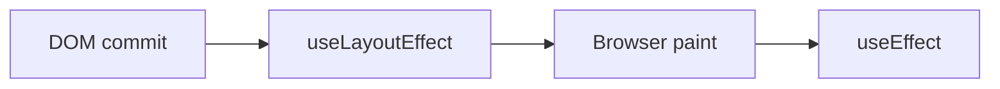

# useLayoutEffect

## Detailed explanation
`useLayoutEffect` runs after React has updated the DOM but before the browser paints. It is used when you must measure layout or synchronously adjust DOM-related state before the user sees the frame.

Most effects should use `useEffect`. `useLayoutEffect` can block painting, so overusing it hurts performance. Use it for layout measurement, scroll positioning, or avoiding visible flicker in rare cases.

## 1. One-line mental model
`useLayoutEffect` runs before paint when layout must be read or corrected synchronously.

## 2. Problem it solves
Some UI needs DOM measurements before the browser paints, otherwise users see a flicker or incorrect position.

## 3. Core idea
- Runs after DOM commit.
- Runs before browser paint.
- Can read layout synchronously.
- Can block paint.
- Use only when normal effects are too late.

## 4. Visual / analogy
It is like adjusting a picture frame after hanging it but before opening the curtain.



## 5. Minimal example

```tsx
React.useLayoutEffect(() => {
  const rect = ref.current?.getBoundingClientRect();
  setWidth(rect?.width ?? 0);
}, []);
```

## 6. Real-world example

```tsx
function Tooltip({ targetRef }: Props) {
  const [position, setPosition] = React.useState({ top: 0, left: 0 });

  React.useLayoutEffect(() => {
    const rect = targetRef.current?.getBoundingClientRect();
    if (rect) setPosition({ top: rect.bottom, left: rect.left });
  }, [targetRef]);

  return <div style={position}>Tooltip</div>;
}
```

## 7. Common interview questions
- What is `useLayoutEffect`?
- How is it different from `useEffect`?
- When should it be used?
- Why can it hurt performance?
- Does it run before or after paint?
- How does it help avoid flicker?
- What about server rendering warnings?

## 8. Active recall test
1. When does `useLayoutEffect` run?
2. Why not use it everywhere?
3. What is a layout measurement use case?
4. Which runs later: `useEffect` or `useLayoutEffect`?
5. Why can SSR be a concern?

## 9. Mistakes / traps
- Replacing every `useEffect` with `useLayoutEffect`.
- Doing expensive work before paint.
- Measuring layout repeatedly without need.
- Ignoring SSR warnings.
- Using it for data fetching.

## 10. Compare with related concepts
- **`useLayoutEffect` vs `useEffect`:** before paint vs after paint.
- **Layout effect vs render:** layout effect can read DOM; render should not.
- **Layout effect vs ref callback:** both can access nodes; timing and use case differ.

## 11. Summary from memory
Explain why tooltip positioning might need `useLayoutEffect`.

## 12. Spaced revision prompts
- After 1 day: Define `useLayoutEffect`.
- After 3 days: Compare with `useEffect`.
- After 7 days: Explain paint blocking.
- After 14 days: Identify a valid layout effect use case.

