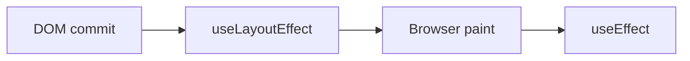

# useLayoutEffect

## Detailed explanation
`useLayoutEffect` runs after React has updated the DOM but before the browser paints. It is used when you must measure layout or synchronously adjust DOM-related state before the user sees the frame.

Most effects should use `useEffect`. `useLayoutEffect` can block painting, so overusing it hurts performance. Use it for layout measurement, scroll positioning, or avoiding visible flicker in rare cases.

## 1. One-line mental model
`useLayoutEffect` runs before paint when layout must be read or corrected synchronously.

## 2. Problem it solves
Some UI needs DOM measurements before the browser paints, otherwise users see a flicker or incorrect position.

## 3. Core idea
- Runs after DOM commit.
- Runs before browser paint.
- Can read layout synchronously.
- Can block paint.
- Use only when normal effects are too late.

## 4. Visual / analogy
It is like adjusting a picture frame after hanging it but before opening the curtain.



## 5. Minimal example

```tsx
React.useLayoutEffect(() => {
  const rect = ref.current?.getBoundingClientRect();
  setWidth(rect?.width ?? 0);
}, []);
```

## 6. Real-world example

```tsx
function Tooltip({ targetRef }: Props) {
  const [position, setPosition] = React.useState({ top: 0, left: 0 });

  React.useLayoutEffect(() => {
    const rect = targetRef.current?.getBoundingClientRect();
    if (rect) setPosition({ top: rect.bottom, left: rect.left });
  }, [targetRef]);

  return <div style={position}>Tooltip</div>;
}
```

## 7. Common interview questions
#### What is `useLayoutEffect`?
- **The Engine Mechanism (Why it behaves this way):** `useLayoutEffect` registers a callback that React stores on the Fiber node, similar to `useEffect`. However, during the commit phase, React fires `useLayoutEffect` callbacks synchronously after DOM mutations but before the browser has a chance to paint. This means the layout effect runs, potentially reads DOM measurements, updates state, and React performs another synchronous render — all before the user sees anything on screen. The browser's paint is blocked until all layout effects complete.
- **The Unforgettable Mental Model:** The **Interior Designer Before Open House**. The stagers (layout effects) adjust furniture placement, measure distances, and fix positioning before the doors open (browser paint). The visitors (users) never see the room in a messy state.
- **The Trap:** Using `useLayoutEffect` for everything because "it runs earlier." This blocks the browser's paint on every render, causing visible jank and poor performance.
- **Senior Interview Playbook (Verbal Script):** "When asked this in an interview, say: `useLayoutEffect` is a hook that runs synchronously after React commits DOM updates but before the browser paints. This makes it ideal for reading DOM measurements and synchronously adjusting state before the user sees the frame. Because it blocks paint, I use it sparingly — only when I need to measure layout or prevent visible flicker. For most side effects, `useEffect` is the right choice because it doesn't block painting."

#### How is it different from `useEffect`?
- **The Engine Mechanism (Why it behaves this way):** The key difference is timing within the commit phase. `useLayoutEffect` fires synchronously during the commit phase, before the browser paint. `useEffect` fires asynchronously after the paint completes. This means `useLayoutEffect` can block the visual update — if it performs expensive work or triggers a re-render, the user sees a blank or frozen screen. `useEffect` never blocks paint because it's scheduled via the browser's event loop after the frame is displayed.
- **The Unforgettable Mental Model:** The **Dress Rehearsal vs. the Opening Night**. `useLayoutEffect` is the dress rehearsal — everything must be perfect before the audience arrives (before paint). `useEffect` is the post-show reception — it happens after the audience has already seen the performance (after paint).
- **The Trap:** Thinking the only difference is "earlier vs. later." The real difference is "blocks paint vs. doesn't block paint" — which has major performance implications.
- **Senior Interview Playbook (Verbal Script):** "When asked this in an interview, say: The difference is timing and paint blocking. `useLayoutEffect` runs synchronously after DOM mutations but before the browser paints, which means it can block the visual update. `useEffect` runs asynchronously after the paint completes, so it never blocks what the user sees. I use `useLayoutEffect` only when I need to measure DOM layout or prevent visible flicker. For everything else — subscriptions, analytics, data fetching — `useEffect` is the correct choice because it doesn't impact rendering performance."

#### When should it be used?
- **The Engine Mechanism (Why it behaves this way):** `useLayoutEffect` is necessary when you must read DOM measurements (dimensions, positions, scroll state) and use those measurements to update React state before the browser paints. If you used `useEffect` instead, the user would see a frame with incorrect positioning, then a second frame with corrected positioning — a visible flicker. `useLayoutEffect` prevents this by making the correction synchronously before any paint occurs. Common use cases include tooltip positioning, modal centering, scroll restoration, and measuring element dimensions for animations.
- **The Unforgettable Mental Model:** The **Tailor's Fitting**. The tailor measures you (read DOM), adjusts the hem (update state), and only then lets you look in the mirror (browser paint). If the tailor adjusted after you looked in the mirror, you'd see the wrong fit first.
- **The Trap:** Using `useLayoutEffect` for data fetching, subscriptions, or any effect that doesn't need to read DOM measurements before paint. This unnecessarily blocks rendering.
- **Senior Interview Playbook (Verbal Script):** "When asked this in an interview, say: I use `useLayoutEffect` only when I need to read DOM measurements and update state before the browser paints. Typical cases are tooltip positioning, preventing visible flicker in modals, measuring element dimensions for animations, and scroll restoration. The rule is: if using `useEffect` would cause the user to see a flash of incorrect layout, I use `useLayoutEffect`. For everything else — network requests, subscriptions, analytics — `useEffect` is appropriate because it doesn't block paint."

#### Why can it hurt performance?
- **The Engine Mechanism (Why it behaves this way):** `useLayoutEffect` runs synchronously during the commit phase, which blocks the browser's paint. If the layout effect performs expensive computation, makes synchronous DOM reads/writes that trigger layout recalculations (reflow), or triggers a state update that causes another render, the browser cannot display anything to the user until all of this completes. This extends the time between the user's action and the visual response, creating perceived jank. Multiple layout effects compound this problem because they all run synchronously before paint.
- **The Unforgettable Mental Model:** The **Traffic Jam at a Toll Booth**. Every car (render) must stop at the toll booth (layout effect) before continuing. If the toll booth processes slowly (expensive work), all cars pile up behind it (blocked paint). The highway (browser) is idle while everyone waits.
- **The Trap:** Doing expensive work in layout effects: large DOM queries, complex calculations, or state updates that trigger cascading re-renders. All of this happens before the user sees anything.
- **Senior Interview Playbook (Verbal Script):** "When asked this in an interview, say: `useLayoutEffect` blocks the browser's paint because it runs synchronously during the commit phase. If it performs expensive work — heavy DOM queries, complex calculations, or state updates that trigger re-renders — the user sees nothing until it all completes. This creates perceived jank and poor performance. That's why I keep layout effects minimal: only read the DOM measurements I need, update state synchronously, and move everything else to `useEffect`. The layout effect should be as fast as possible."

#### Does it run before or after paint?
- **The Engine Mechanism (Why it behaves this way):** `useLayoutEffect` runs before paint. The browser's rendering pipeline is: JavaScript execution → DOM mutations → style calculation → layout → paint. React's commit phase applies DOM mutations, then fires `useLayoutEffect` callbacks synchronously. Only after all layout effects complete does the browser proceed to style calculation, layout, and paint. `useEffect` callbacks fire after paint, scheduled via the browser's task queue.
- **The Unforgettable Mental Model:** The **Green Room vs. the Stage**. `useLayoutEffect` works in the green room (before the actor goes on stage/paint). `useEffect` works after the actor has already performed on stage (after paint).
- **The Trap:** Confusing the order. The sequence is: render → commit DOM → useLayoutEffect → browser paint → useEffect.
- **Senior Interview Playbook (Verbal Script):** "When asked this in an interview, say: `useLayoutEffect` runs before the browser paints. The sequence is: React renders components, commits DOM mutations, fires `useLayoutEffect` callbacks synchronously, then the browser paints the screen, and finally `useEffect` callbacks fire asynchronously. This timing is what makes `useLayoutEffect` suitable for preventing visible flicker — it can correct layout before the user sees anything."

#### How does it help avoid flicker?
- **The Engine Mechanism (Why it behaves this way):** Flicker occurs when the browser paints a frame with incorrect layout, then a subsequent frame corrects it. With `useEffect`, the sequence is: render with initial position → paint (user sees wrong position) → effect runs → state updates → re-render with correct position → paint (user sees correct position). The user sees the wrong position briefly. With `useLayoutEffect`, the sequence is: render with initial position → layout effect reads DOM and updates state → re-render with correct position → paint (user sees correct position). The incorrect position is never painted.
- **The Unforgettable Mental Model:** The **Photoshop Before Publishing**. You edit the photo in Photoshop (layout effect), fix the cropping and colors (state update), and only then publish it (paint). The audience never sees the unedited version.
- **The Trap:** Using `useLayoutEffect` for effects that don't affect visual layout. The flicker-prevention benefit only applies to DOM measurement and positioning corrections.
- **Senior Interview Playbook (Verbal Script):** "When asked this in an interview, say: `useLayoutEffect` avoids flicker by running before the browser paints. If a component needs to measure a DOM element and adjust its position, `useLayoutEffect` lets it do that measurement and update state synchronously before any paint occurs. The user only ever sees the final, correctly positioned element. With `useEffect`, the user would see a brief flash of the incorrectly positioned element before the effect runs and corrects it."

#### What about server rendering warnings?
- **The Engine Mechanism (Why it behaves this way):** During server-side rendering, there is no DOM — no `window`, no `document`, no layout to measure. `useLayoutEffect` expects to read DOM measurements, which don't exist on the server. React detects this mismatch and warns that `useLayoutEffect` does nothing on the server. The effect will only run on the client during hydration. This can cause a hydration mismatch if the server renders different content than the client's initial layout effect state.
- **The Unforgettable Mental Model:** The **Architect Without a Building Site**. `useLayoutEffect` is like an architect trying to measure a room that hasn't been built yet (server). There's nothing to measure, so the architect's tools are useless until the building exists (client hydration).
- **The Trap:** Ignoring the SSR warning. If your layout effect sets state that affects the rendered output, the server and client may render different content, causing hydration mismatches and UI flashes.
- **Senior Interview Playbook (Verbal Script):** "When asked this in an interview, say: `useLayoutEffect` fires a warning during SSR because there's no DOM on the server to measure. The effect only runs on the client during hydration. If this causes hydration mismatches, I have a few options: conditionally use `useEffect` on the server and `useLayoutEffect` on the client, provide a safe default value that works for both server and client, or use `useInsertionEffect` for CSS-in-JS injection. The key is ensuring the server-rendered HTML matches the client's initial render."

## 8. Active recall test
1. **When does `useLayoutEffect` run?**
   - **Explanation:** Synchronously after React commits DOM mutations but before the browser paints. This allows reading DOM measurements and updating state before the user sees anything.
2. **Why not use it everywhere?**
   - **Explanation:** It blocks the browser's paint. Any expensive work in a layout effect delays what the user sees, causing jank and poor perceived performance. Most effects don't need to run before paint.
3. **What is a layout measurement use case?**
   - **Explanation:** Tooltip positioning, modal centering, scroll restoration, measuring element dimensions for animations — any case where you need DOM measurements to compute the correct visual layout.
4. **Which runs later: `useEffect` or `useLayoutEffect`?**
   - **Explanation:** `useEffect` runs later. The order is: render → commit DOM → useLayoutEffect → browser paint → useEffect.
5. **Why can SSR be a concern?**
   - **Explanation:** There is no DOM on the server, so `useLayoutEffect` cannot run. This can cause hydration mismatches if the effect sets state that affects rendered output. A warning is logged in development.

## 9. Mistakes / traps
- Replacing every `useEffect` with `useLayoutEffect`.
- Doing expensive work before paint.
- Measuring layout repeatedly without need.
- Ignoring SSR warnings.
- Using it for data fetching.

## 10. Compare with related concepts
- **`useLayoutEffect` vs `useEffect`:** before paint vs after paint.
- **Layout effect vs render:** layout effect can read DOM; render should not.
- **Layout effect vs ref callback:** both can access nodes; timing and use case differ.

## 11. Summary from memory
Explain why tooltip positioning might need `useLayoutEffect`.

## 12. Spaced revision prompts
- After 1 day: Define `useLayoutEffect`.
- After 3 days: Compare with `useEffect`.
- After 7 days: Explain paint blocking.
- After 14 days: Identify a valid layout effect use case.

