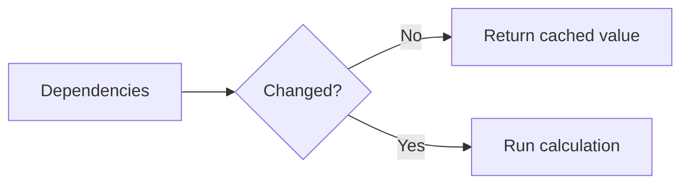

# useMemo

## Detailed explanation
`useMemo` memoizes the result of a calculation between renders until its dependencies change. It is useful for expensive calculations or for keeping a derived value reference stable when that stability matters.

`useMemo` is not a default requirement for every computed value. It has overhead and can make code harder to read. Use it when profiling, expensive work, or referential stability justifies it.

## 1. One-line mental model
`useMemo` caches a calculated value until dependencies change.

## 2. Problem it solves
Some calculations are expensive or create new references that cause unnecessary downstream work on every render.

## 3. Core idea
- Pass a calculation function.
- Pass dependencies.
- React reuses the previous result when dependencies are equal.
- Use for expensive derived data.
- Avoid using it everywhere by default.

## 4. Visual / analogy
`useMemo` is like saving a spreadsheet result and recalculating only when input cells change.



## 5. Minimal example

```tsx
const total = React.useMemo(() => items.reduce((sum, item) => sum + item.price, 0), [items]);
```

## 6. Real-world example

```tsx
const visibleRows = React.useMemo(() => {
  return rows
    .filter((row) => row.status === status)
    .sort((a, b) => a.name.localeCompare(b.name));
}, [rows, status]);
```

## 7. Common interview questions
- What is `useMemo`?
- When should you use `useMemo`?
- When should you not use `useMemo`?
- Does `useMemo` guarantee performance?
- How does dependency array work?
- `useMemo` vs `useCallback`?
- How does referential equality matter?

## 8. Active recall test
1. What does `useMemo` cache?
2. What triggers recalculation?
3. Why not wrap every calculation?
4. What is referential stability?
5. How can stale memo values happen?

## 9. Mistakes / traps
- Using `useMemo` for cheap calculations everywhere.
- Missing dependencies.
- Depending on objects recreated every render.
- Thinking `useMemo` prevents component rendering.
- Memoizing impure calculations.

## 10. Compare with related concepts
- **`useMemo` vs `useCallback`:** value result vs function reference.
- **`useMemo` vs `React.memo`:** memoize calculation vs memoize component rendering.
- **`useMemo` vs derived state:** memo calculates during render; state stores and updates separately.

## 11. Summary from memory
Explain when filtering a large table should use `useMemo` and when it should not.

## 12. Spaced revision prompts
- After 1 day: Define `useMemo`.
- After 3 days: Explain dependency recalculation.
- After 7 days: Compare `useMemo` and `useCallback`.
- After 14 days: Identify overuse of `useMemo`.

