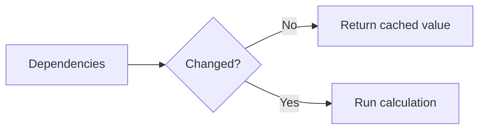

# useMemo

## Detailed explanation
`useMemo` memoizes the result of a calculation between renders until its dependencies change. It is useful for expensive calculations or for keeping a derived value reference stable when that stability matters.

`useMemo` is not a default requirement for every computed value. It has overhead and can make code harder to read. Use it when profiling, expensive work, or referential stability justifies it.

## 1. One-line mental model
`useMemo` caches a calculated value until dependencies change.

## 2. Problem it solves
Some calculations are expensive or create new references that cause unnecessary downstream work on every render.

## 3. Core idea
- Pass a calculation function.
- Pass dependencies.
- React reuses the previous result when dependencies are equal.
- Use for expensive derived data.
- Avoid using it everywhere by default.

## 4. Visual / analogy
`useMemo` is like saving a spreadsheet result and recalculating only when input cells change.



## 5. Minimal example

```tsx
const total = React.useMemo(() => items.reduce((sum, item) => sum + item.price, 0), [items]);
```

## 6. Real-world example

```tsx
const visibleRows = React.useMemo(() => {
  return rows
    .filter((row) => row.status === status)
    .sort((a, b) => a.name.localeCompare(b.name));
}, [rows, status]);
```

## 7. Common interview questions
#### What is `useMemo`?
- **The Engine Mechanism (Why it behaves this way):** `useMemo(() => computation, deps)` stores the result of a computation on the Fiber node alongside its dependency values. On each render, React compares the current dependencies with the previous ones using `Object.is()`. If all dependencies are equal, React returns the cached result without re-running the computation. If any dependency changed, React runs the computation function, stores the new result and new dependency values, and returns the fresh result. The computation runs during the render phase.
- **The Unforgettable Mental Model:** The **Cached Calculator**. You type in a formula and get a result. If you type the same numbers again, the calculator shows the cached answer instantly instead of recalculating. Change any number, and it recomputes.
- **The Trap:** Thinking `useMemo` is a performance requirement for every computed value. It adds memory overhead (storing the cached result) and comparison overhead (checking dependencies). For cheap computations, it's slower than just recalculating.
- **Senior Interview Playbook (Verbal Script):** "When asked this in an interview, say: `useMemo` memoizes the result of a computation between renders. It takes a function and a dependency array, runs the function on the first render, and caches the result. On subsequent renders, if dependencies haven't changed, it returns the cached value without re-running the function. It's useful for expensive calculations and for maintaining referential stability of derived values. But it's not a default — I only use it when profiling shows a bottleneck or when referential stability is required."

#### When should you use `useMemo`?
- **The Engine Mechanism (Why it behaves this way):** `useMemo` is justified in three scenarios: (1) Expensive computations — filtering/sorting large arrays, complex mathematical operations, or data transformations that take measurable time. (2) Referential stability — when a derived value is passed to a memoized child component (`React.memo`) or used in a `useEffect`/`useCallback` dependency array, and you need the reference to stay the same between renders. (3) Avoiding expensive object creation — when creating objects that are passed as props to children that use `Object.is()` comparison.
- **The Unforgettable Mental Model:** The **Expensive Restaurant Dish**. You don't pre-cook every dish (memoize everything) — that wastes ingredients and storage. You only pre-cook the dishes that take hours to prepare (expensive computations) or that customers order repeatedly (referential stability needs).
- **The Trap:** Memoizing cheap computations like `const name = firstName + ' ' + lastName`. String concatenation is faster than the overhead of `useMemo`'s dependency comparison and cache management.
- **Senior Interview Playbook (Verbal Script):** "When asked this in an interview, say: I use `useMemo` in three cases. First, for genuinely expensive computations — filtering or sorting large datasets, complex data transformations. Second, when I need referential stability for a value passed to memoized children or used in dependency arrays. Third, when profiling shows a specific computation is a bottleneck. I don't use it by default for every computed value — the overhead of dependency comparison and caching often exceeds the cost of simple recalculations."

#### When should you not use `useMemo`?
- **The Engine Mechanism (Why it behaves this way):** `useMemo` introduces overhead: storing the cached value in memory, comparing dependencies with `Object.is()` on every render, and managing the cache lifecycle. For cheap operations (string concatenation, simple arithmetic, property access), this overhead exceeds the cost of recomputation. Additionally, `useMemo` makes code harder to read — `const total = items.reduce(...)` is clearer than `const total = useMemo(() => items.reduce(...), [items])`. React's official documentation explicitly states that `useMemo` is an optimization, not a semantic requirement.
- **The Unforgettable Mental Model:** The **Security Guard for a Pencil**. Putting a security guard (useMemo) to watch a pencil (cheap computation) costs more than the pencil itself. The guard's salary (overhead) exceeds the value of what's being protected.
- **The Trap:** Wrapping every computed value in `useMemo` "just in case." This makes code harder to read, increases memory usage, and can actually hurt performance due to comparison overhead.
- **Senior Interview Playbook (Verbal Script):** "When asked this in an interview, say: I avoid `useMemo` for cheap computations — string concatenation, simple math, property access. The overhead of dependency comparison and cache management exceeds the cost of recomputing. I also avoid it when it makes code significantly harder to read without measurable benefit. React's docs explicitly say `useMemo` is an optimization, not a requirement. I add it only when profiling identifies a bottleneck or when referential stability is functionally required for downstream memoization."

#### Does `useMemo` guarantee performance?
- **The Engine Mechanism (Why it behaves this way):** `useMemo` does not prevent the component from rendering — it only prevents the computation function from re-running. The component still goes through the full render phase: the function executes, JSX is created, and React reconciles the output. Performance gains from `useMemo` only materialize when (a) the computation is expensive enough to matter, or (b) the stable reference prevents downstream work (memoized child skips, effect doesn't re-run). In many cases, `useMemo` adds overhead without meaningful benefit.
- **The Unforgettable Mental Model:** The **Express Lane with a Toll**. `useMemo` is like an express lane that skips the computation traffic jam — but you still have to pay the toll (overhead) and you still arrive at the same destination (component renders). The express lane only helps if the traffic jam is really bad.
- **The Trap:** Assuming `useMemo` makes the component render faster. It doesn't — the component still renders. It only skips the specific computation inside it.
- **Senior Interview Playbook (Verbal Script):** "When asked this in an interview, say: No, `useMemo` doesn't guarantee performance improvements. It only prevents a specific computation from re-running — the component still renders fully. The memoization itself has overhead: storing cached values and comparing dependencies. Performance gains only occur when the computation is genuinely expensive or when the stable reference prevents downstream re-renders in memoized children. I always profile before and after adding `useMemo` to verify it actually helps."

#### How does dependency array work?
- **The Engine Mechanism (Why it behaves this way):** React stores the previous dependency array alongside the cached value. On each render, it iterates through both arrays in parallel, comparing each pair with `Object.is()`. `Object.is()` is stricter than `==` but similar to `===` — it handles `NaN` correctly and distinguishes `+0` from `-0`. If all comparisons return `true`, the cached value is returned. If any comparison returns `false`, the computation runs and the new result and dependencies are stored. For objects and arrays, `Object.is()` compares references, not contents.
- **The Unforgettable Mental Model:** The **Combination Lock**. Each dependency is a dial on the lock. If all dials are in the same position as last time, the lock opens instantly (cached value). If even one dial moved, you must solve the combination again (recompute).
- **The Trap:** Including objects or functions created inline in the dependency array. Since they're new references every render, `Object.is()` always returns `false`, causing the computation to re-run every time — defeating the purpose of memoization.
- **Senior Interview Playbook (Verbal Script):** "When asked this in an interview, say: The dependency array works by React comparing each value with its previous counterpart using `Object.is()`. If all values are referentially equal, the cached result is returned. If any value changed, the computation re-runs. For primitive values, this works intuitively. For objects and arrays, `Object.is()` compares references, not contents — so a new object literal always counts as changed. This is why dependencies should be stable primitives or memoized objects, not inline creations."

#### `useMemo` vs `useCallback`?
- **The Engine Mechanism (Why it behaves this way):** Both hooks use the same underlying memoization mechanism on the Fiber node. `useMemo` caches the return value of a computation function. `useCallback` caches the function reference itself — it's essentially `useMemo(() => fn, deps)` syntactic sugar. The difference is semantic: `useMemo` is for computed values (numbers, objects, arrays), while `useCallback` is for function references. Both compare dependencies with `Object.is()` and return cached results when dependencies are unchanged.
- **The Unforgettable Mental Model:** The **Photo vs. the Photographer**. `useMemo` caches the photo (computed value). `useCallback` caches the photographer (function) — the person who takes photos. Both are "cached," but one is a result, the other is a tool.
- **The Trap:** Using `useMemo` to memoize functions: `useMemo(() => () => {...}, deps)`. This works but is less readable than `useCallback(() => {...}, deps)`.
- **Senior Interview Playbook (Verbal Script):** "When asked this in an interview, say: `useMemo` and `useCallback` use the same underlying memoization mechanism. The difference is what they cache: `useMemo` caches a computed value — a number, object, or array. `useCallback` caches a function reference. `useCallback(fn, deps)` is essentially shorthand for `useMemo(() => fn, deps)`. I choose based on what I'm memoizing — values use `useMemo`, functions use `useCallback`. Both help maintain referential stability between renders."

#### How does referential equality matter?
- **The Engine Mechanism (Why it behaves this way):** Referential equality determines whether React considers two values "the same." When a memoized value's reference changes, downstream components that receive it as a prop will re-render (unless memoized), and effects that depend on it will re-run. This is because React's reconciliation uses `Object.is()` for prop comparison in `React.memo` and for dependency comparison in hooks. A new reference signals "something changed" even if the contents are identical, triggering unnecessary work downstream.
- **The Unforgettable Mental Model:** The **ID Badge Check**. Security doesn't compare your face (contents) — they check your ID badge (reference). Same person, new badge = new entry. Same badge = you've already been cleared.
- **The Trap:** Creating objects inline as props to memoized children: `<Child config={{ mode: 'dark' }} />`. Even if `mode` hasn't changed, the object is a new reference every render, so `React.memo` can't skip the child.
- **Senior Interview Playbook (Verbal Script):** "When asked this in an interview, say: Referential equality matters because React uses `Object.is()` to detect changes in props and dependencies. If a value's reference changes, React assumes the value changed and triggers downstream work — re-rendering memoized children, re-running effects, recomputing memos. This is why maintaining stable references through `useMemo`, `useCallback`, or lifting object creation outside the component is important for performance. It's not about the value's contents — it's about whether the reference is the same."

## 8. Active recall test
1. **What does `useMemo` cache?**
   - **Explanation:** The return value of the computation function. React stores this value and returns it unchanged when dependencies are referentially equal.
2. **What triggers recalculation?**
   - **Explanation:** Any dependency that changes its reference (detected via `Object.is()`). If even one dependency is different from the previous render, the computation re-runs.
3. **Why not wrap every calculation?**
   - **Explanation:** `useMemo` has overhead — storing cached values, comparing dependencies, managing cache lifecycle. For cheap computations, this overhead exceeds the cost of simple recalculation.
4. **What is referential stability?**
   - **Explanation:** When a value maintains the same object/function reference between renders. This prevents downstream re-renders in memoized components and unnecessary effect re-runs.
5. **How can stale memo values happen?**
   - **Explanation:** When a dependency is missing from the array, the memo returns a cached value computed with outdated data. The computation doesn't re-run even though the data it depends on has changed.

## 9. Mistakes / traps
- Using `useMemo` for cheap calculations everywhere.
- Missing dependencies.
- Depending on objects recreated every render.
- Thinking `useMemo` prevents component rendering.
- Memoizing impure calculations.

## 10. Compare with related concepts
- **`useMemo` vs `useCallback`:** value result vs function reference.
- **`useMemo` vs `React.memo`:** memoize calculation vs memoize component rendering.
- **`useMemo` vs derived state:** memo calculates during render; state stores and updates separately.

## 11. Summary from memory
Explain when filtering a large table should use `useMemo` and when it should not.

## 12. Spaced revision prompts
- After 1 day: Define `useMemo`.
- After 3 days: Explain dependency recalculation.
- After 7 days: Compare `useMemo` and `useCallback`.
- After 14 days: Identify overuse of `useMemo`.

