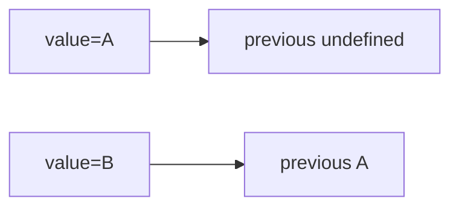

# Previous State or Value Hook

## Detailed explanation
A previous value hook stores the value from the previous render so the current render can compare it with the old one. It is often built with `useRef` because updating the previous value should not itself cause a re-render.

This is useful for detecting changes, comparing previous props, running animations, or debugging transitions. It should not replace normal state modeling.

## 1. One-line mental model
`usePrevious` remembers what a value was in the previous render.

## 2. Problem it solves
Components sometimes need to compare current and previous values.

## 3. Core idea
- Store previous value in a ref.
- Update ref after render.
- Return the previous ref value.
- Does not trigger re-render.
- Useful for comparisons.

## 4. Visual / analogy
It is like a rearview mirror for a value.



## 5. Minimal example

```tsx
function usePrevious<T>(value: T) {
  const ref = React.useRef<T | undefined>(undefined);
  React.useEffect(() => {
    ref.current = value;
  }, [value]);
  return ref.current;
}
```

## 6. Real-world example

```tsx
const previousStatus = usePrevious(status);
const changedToSuccess = previousStatus === "loading" && status === "success";
```

## 7. Common interview questions
- How do you build `usePrevious`?
- Why use ref?
- Does updating previous value re-render?
- When is previous value useful?
- Why update in effect?
- Can previous value be undefined?
- How do you type it?

## 8. Active recall test
1. What stores previous value?
2. Why not use state?
3. When does ref update?
4. What is initial previous value?
5. Name one use case.

## 9. Mistakes / traps
- Using state and causing extra renders.
- Expecting previous value on first render.
- Updating ref during render without understanding timing.
- Using previous value to patch bad state design.
- Forgetting dependency on value.

## 10. Compare with related concepts
- **Previous value vs current state:** previous is historical snapshot; state is current source.
- **Ref vs state:** ref stores without render; state drives UI.
- **usePrevious vs effect cleanup:** both can observe transitions, but serve different purposes.

## 11. Summary from memory
Explain how `usePrevious` can detect a transition from loading to success.

## 12. Spaced revision prompts
- After 1 day: Define previous value hook.
- After 3 days: Build `usePrevious`.
- After 7 days: Explain why ref is used.
- After 14 days: Use it for status transition.

