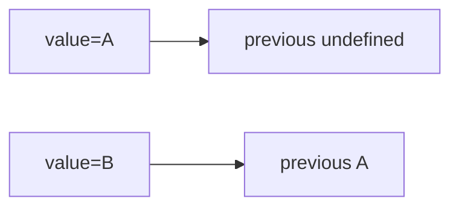

# Previous State or Value Hook

## Detailed explanation
A previous value hook stores the value from the previous render so the current render can compare it with the old one. It is often built with `useRef` because updating the previous value should not itself cause a re-render.

This is useful for detecting changes, comparing previous props, running animations, or debugging transitions. It should not replace normal state modeling.

## 1. One-line mental model
`usePrevious` remembers what a value was in the previous render.

## 2. Problem it solves
Components sometimes need to compare current and previous values.

## 3. Core idea
- Store previous value in a ref.
- Update ref after render.
- Return the previous ref value.
- Does not trigger re-render.
- Useful for comparisons.

## 4. Visual / analogy
It is like a rearview mirror for a value.



## 5. Minimal example

```tsx
function usePrevious<T>(value: T) {
  const ref = React.useRef<T | undefined>(undefined);
  React.useEffect(() => {
    ref.current = value;
  }, [value]);
  return ref.current;
}
```

## 6. Real-world example

```tsx
const previousStatus = usePrevious(status);
const changedToSuccess = previousStatus === "loading" && status === "success";
```

## 7. Common interview questions
#### How do you build `usePrevious`?
- **The Engine Mechanism (Why it behaves this way):** `usePrevious` uses `useRef` to store the previous value and `useEffect` to update the ref after each render. The ref is initialized with `undefined`. During render, the hook returns `ref.current` (the value from the previous render). After the render commits to the DOM, the effect runs and updates `ref.current` to the current value. This timing ensures the returned value is always one render behind the current value.
- **The Unforgettable Mental Model:** The **Rearview Mirror**. The mirror shows you where you were, not where you are. As you drive forward (render), the mirror updates to show your previous position after you've moved.
- **The Trap:** Updating the ref during render instead of in an effect. While updating refs during render is technically allowed in React 18+ (with the `useRef` return value pattern), the effect-based approach is clearer and ensures the ref updates after the commit phase.
- **Senior Interview Playbook (Verbal Script):** "When asked this in an interview, say: I build `usePrevious` with `useRef` to store the previous value and `useEffect` to update it after each render. The effect runs after commit, so during render, `ref.current` holds the value from the previous render. The hook returns `ref.current`, giving the component access to the previous value for comparison or transition detection."

#### Why use ref?
- **The Engine Mechanism (Why it behaves this way):** `useRef` stores a mutable value that persists across renders without triggering re-renders when updated. If `usePrevious` used `useState`, updating the previous value would schedule another render, creating an infinite loop: render → update previous state → render → update previous state. The ref's `.current` property is updated in the effect (after commit), so it doesn't interfere with React's rendering cycle.
- **The Unforgettable Mental Model:** The **Shadow**. A shadow follows you without affecting your movement. The ref stores the previous value silently — it doesn't cause the component to re-render when it updates, unlike state which would trigger a new render cycle.
- **The Trap:** Expecting the ref update to cause a re-render. Refs are for storing values that don't drive UI. The component re-renders because of its own state/prop changes, not because the ref was updated.
- **Senior Interview Playbook (Verbal Script):** "When asked this in an interview, say: I use ref because updating the previous value must not trigger a re-render. If I used `useState`, updating the previous value would schedule another render, creating an infinite loop. Refs provide mutable, persistent storage that's invisible to React's rendering cycle — perfect for storing historical values that the component reads but doesn't need to react to."

#### Does updating previous value re-render?
- **The Engine Mechanism (Why it behaves this way):** No. Updating `ref.current` is a synchronous JavaScript assignment that has no interaction with React's Fiber scheduler. React only schedules re-renders when `setState`, `dispatch`, or context values change. The ref update in the effect happens after the commit phase, and since it doesn't call any state setter, React doesn't schedule another render. The component only re-renders when its own props or state change.
- **The Unforgettable Mental Model:** The **Diary Entry**. Writing in your diary (updating ref) doesn't change what's happening in your life (rendering). Your life changes because of events (state/prop changes), not because you wrote about them.
- **The Trap:** Confusing the re-render that triggers the effect update with a re-render caused by the ref update. The component re-renders for its own reasons; the effect then updates the ref as a side effect of that render.
- **Senior Interview Playbook (Verbal Script):** "When asked this in an interview, say: No, updating `ref.current` never triggers a re-render. Refs are mutable storage that React's scheduler ignores. The component re-renders because of its own state or prop changes, and the effect updates the ref as a consequence. This is exactly what we want — the previous value is a passive observation, not an active driver of rendering."

#### When is previous value useful?
- **The Engine Mechanism (Why it behaves this way):** Previous value comparison is useful for detecting transitions: did a status change from "loading" to "success"? Did a prop cross a threshold? Did the user navigate to a different section? It's also useful for animations (comparing old and new positions), debugging (logging what changed), and conditional side effects (running logic only when a specific transition occurs). The comparison happens during render, so the component can branch its output based on the transition.
- **The Unforgettable Mental Model:** The **Before-and-After Photo**. You can't see change by looking at a single photo. You need the before photo (previous value) and the after photo (current value) side by side to spot what changed.
- **The Trap:** Using `usePrevious` to patch poor state design. If you need the previous value to fix a state management issue, the real fix is usually to restructure the state model, not to add a previous-value comparison.
- **Senior Interview Playbook (Verbal Script):** "When asked this in an interview, say: Previous value is useful for detecting transitions — like a status changing from loading to success, a prop crossing a threshold, or a route change. It's also useful for animations, debugging, and conditional side effects. I use it sparingly though — if I find myself needing the previous value frequently, it's often a sign that my state model could be improved to track transitions explicitly."

#### Why update in effect?
- **The Engine Mechanism (Why it behaves this way):** The effect runs after the commit phase, which means the current render's value has been fully committed to the DOM. Updating the ref at this point captures the value that was just rendered, making it the "previous" value for the next render. If you updated the ref during render, it would hold the current value during the current render, defeating the purpose. The effect's post-commit timing is what creates the one-render lag.
- **The Unforgettable Mental Model:** The **Photographer's Delay**. The photographer takes the picture (render), then files it in the "previous" album (effect). The next time you look, the most recent photo is in the "previous" album.
- **The Trap:** Updating the ref before the return statement in the component function. This would make `ref.current` equal to the current value during the current render, not the previous one.
- **Senior Interview Playbook (Verbal Script):** "When asked this in an interview, say: The effect runs after the commit phase, which is the perfect timing to capture the value that was just rendered. If I updated the ref during render, it would hold the current value during the current render, not the previous one. The effect's post-commit timing ensures that `ref.current` always contains the value from the previous render when the component function executes."

#### Can previous value be undefined?
- **The Engine Mechanism (Why it behaves this way):** Yes, on the first render. The ref is initialized with `undefined` (or any initial value you choose). During the first render, the effect hasn't run yet, so `ref.current` is still the initial value. After the first commit, the effect updates `ref.current` to the first rendered value. From the second render onward, `ref.current` holds the previous render's value. TypeScript types should reflect this: `T | undefined`.
- **The Unforgettable Mental Model:** The **First Day of School**. On the first day, you have no "previous day" to compare to. From the second day onward, you can always compare today with yesterday.
- **The Trap:** Not handling `undefined` in comparisons. `previousValue === currentValue` on the first render compares `undefined` with the actual value, which is always `false`. Guard with `if (previousValue !== undefined)`.
- **Senior Interview Playbook (Verbal Script):** "When asked this in an interview, say: Yes, on the first render the previous value is `undefined` because the effect hasn't run yet. The ref starts with `undefined` and is only updated after the first commit. I always handle this in comparisons with a guard like `if (previousValue !== undefined)`. TypeScript should type the return as `T | undefined` to enforce this handling at compile time."

#### How do you type it?
- **The Engine Mechanism (Why it behaves this way):** The hook uses a generic type parameter `T` that matches the input value's type. The ref is typed as `React.useRef<T | undefined>(undefined)` because the initial value is `undefined`. The return type is `T | undefined`. This ensures type safety: if you pass a `string`, you get `string | undefined` back. TypeScript enforces handling the `undefined` case before using the previous value in comparisons or operations.
- **The Unforgettable Mental Model:** The **Label Maker**. The generic type `T` is a label that says "whatever type goes in, the same type comes out (plus undefined for the first render)." It keeps the type system honest.
- **The Trap:** Typing the ref as `React.useRef<T>(undefined)` without the `| undefined`. This creates a type mismatch — the initial value is `undefined` but the type says `T`, which is incorrect and will cause TypeScript errors.
- **Senior Interview Playbook (Verbal Script):** "When asked this in an interview, say: I type `usePrevious` with a generic: `function usePrevious<T>(value: T): T | undefined`. The ref is `useRef<T | undefined>(undefined)` to account for the initial undefined state. The return type `T | undefined` forces consumers to handle the undefined case on first render. This gives full type safety — if you pass a number, you get `number | undefined` back."

## 8. Active recall test
1. **What stores the previous value?**
   - **Explanation:** A `useRef` hook. The ref's `.current` property holds the value from the previous render. It's updated in a `useEffect` that runs after each commit, ensuring the ref always lags one render behind the current value.
2. **Why not use state?**
   - **Explanation:** Updating state triggers a re-render. If `usePrevious` used state to store the previous value, updating it would cause another render, which would update it again, creating an infinite loop. Refs update silently without affecting the render cycle.
3. **When does the ref update?**
   - **Explanation:** In the `useEffect` callback, which runs after the commit phase. This timing ensures the ref captures the value that was just rendered, making it available as the "previous" value during the next render.
4. **What is the initial previous value?**
   - **Explanation:** `undefined`. The ref is initialized with `undefined`, and on the first render, the effect hasn't run yet. After the first commit, the effect updates the ref to the first rendered value. From the second render onward, it holds the actual previous value.
5. **Name one use case.**
   - **Explanation:** Detecting a status transition from "loading" to "success": `const prev = usePrevious(status); const justSucceeded = prev === 'loading' && status === 'success'`. This lets you trigger a one-time side effect (like showing a toast) when a specific transition occurs.

## 9. Mistakes / traps
- Using state and causing extra renders.
- Expecting previous value on first render.
- Updating ref during render without understanding timing.
- Using previous value to patch bad state design.
- Forgetting dependency on value.

## 10. Compare with related concepts
- **Previous value vs current state:** previous is historical snapshot; state is current source.
- **Ref vs state:** ref stores without render; state drives UI.
- **usePrevious vs effect cleanup:** both can observe transitions, but serve different purposes.

## 11. Summary from memory
Explain how `usePrevious` can detect a transition from loading to success.

## 12. Spaced revision prompts
- After 1 day: Define previous value hook.
- After 3 days: Build `usePrevious`.
- After 7 days: Explain why ref is used.
- After 14 days: Use it for status transition.

