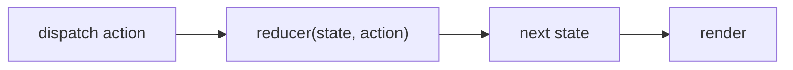

# useReducer

## Detailed explanation
`useReducer` manages state through a reducer function and dispatched actions. It is useful when state transitions are complex, related, or easier to describe as events instead of separate setter calls.

The reducer receives current state and an action, then returns next state. This makes updates predictable and testable, especially for forms, wizards, carts, filters, and multi-step UI state.

## 1. One-line mental model
`useReducer` updates state by dispatching actions to a reducer.

## 2. Problem it solves
Multiple related `useState` calls can become hard to coordinate when state transitions depend on action types and previous state.

## 3. Core idea
- Define a reducer function.
- Dispatch actions.
- Reducer returns next state.
- State updates remain immutable.
- Good for complex transition logic.

## 4. Visual / analogy
`useReducer` is like a ticket counter: every change is submitted as a ticket, and the reducer decides the official result.



## 5. Minimal example

```tsx
function reducer(count: number, action: { type: "inc" | "dec" }) {
  return action.type === "inc" ? count + 1 : count - 1;
}

function Counter() {
  const [count, dispatch] = React.useReducer(reducer, 0);
  return <button onClick={() => dispatch({ type: "inc" })}>{count}</button>;
}
```

## 6. Real-world example

```tsx
type Action =
  | { type: "fieldChanged"; field: string; value: string }
  | { type: "submitted" }
  | { type: "failed"; error: string };

function formReducer(state: FormState, action: Action): FormState {
  switch (action.type) {
    case "fieldChanged":
      return { ...state, values: { ...state.values, [action.field]: action.value } };
    case "submitted":
      return { ...state, status: "submitting" };
    case "failed":
      return { ...state, status: "error", error: action.error };
  }
}
```

## 7. Common interview questions
- What is `useReducer`?
- When use `useReducer` over `useState`?
- What is a reducer?
- What is dispatch?
- How do actions work?
- How do you type reducers?
- How does `useReducer` relate to Redux?

## 8. Active recall test
1. What arguments does a reducer receive?
2. What should a reducer return?
3. Why should reducer be pure?
4. When is `useState` simpler?
5. What is an action object?

## 9. Mistakes / traps
- Mutating state inside reducer.
- Dispatching vague actions like `{ type: "set" }` for every change.
- Putting async logic directly in reducer.
- Using reducer for trivial booleans.
- Forgetting exhaustive action handling.

## 10. Compare with related concepts
- **`useReducer` vs `useState`:** reducer centralizes complex transitions; state is simpler for independent values.
- **`useReducer` vs Redux:** local component reducer vs app-level store ecosystem.
- **Reducer vs action:** reducer computes; action describes event.

## 11. Summary from memory
Explain how a shopping cart reducer handles add, remove, and quantity-change actions.

## 12. Spaced revision prompts
- After 1 day: Define reducer.
- After 3 days: Write a counter reducer.
- After 7 days: Compare `useReducer` and `useState`.
- After 14 days: Type a reducer with discriminated unions.

