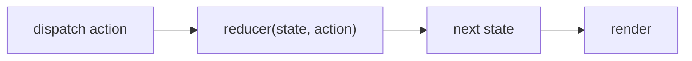

# useReducer

## Detailed explanation
`useReducer` manages state through a reducer function and dispatched actions. It is useful when state transitions are complex, related, or easier to describe as events instead of separate setter calls.

The reducer receives current state and an action, then returns next state. This makes updates predictable and testable, especially for forms, wizards, carts, filters, and multi-step UI state.

## 1. One-line mental model
`useReducer` updates state by dispatching actions to a reducer.

## 2. Problem it solves
Multiple related `useState` calls can become hard to coordinate when state transitions depend on action types and previous state.

## 3. Core idea
- Define a reducer function.
- Dispatch actions.
- Reducer returns next state.
- State updates remain immutable.
- Good for complex transition logic.

## 4. Visual / analogy
`useReducer` is like a ticket counter: every change is submitted as a ticket, and the reducer decides the official result.



## 5. Minimal example

```tsx
function reducer(count: number, action: { type: "inc" | "dec" }) {
  return action.type === "inc" ? count + 1 : count - 1;
}

function Counter() {
  const [count, dispatch] = React.useReducer(reducer, 0);
  return <button onClick={() => dispatch({ type: "inc" })}>{count}</button>;
}
```

## 6. Real-world example

```tsx
type Action =
  | { type: "fieldChanged"; field: string; value: string }
  | { type: "submitted" }
  | { type: "failed"; error: string };

function formReducer(state: FormState, action: Action): FormState {
  switch (action.type) {
    case "fieldChanged":
      return { ...state, values: { ...state.values, [action.field]: action.value } };
    case "submitted":
      return { ...state, status: "submitting" };
    case "failed":
      return { ...state, status: "error", error: action.error };
  }
}
```

## 7. Common interview questions
#### What is `useReducer`?
- **The Engine Mechanism (Why it behaves this way):** `useReducer(reducer, initialArg)` stores state on the Fiber node similar to `useState`, but instead of a simple setter, it uses a dispatch function. When `dispatch(action)` is called, React queues the action on the hook's update queue. During the next render phase, React calls `reducer(currentState, action)` to compute the next state. The reducer is a pure function that receives the current state and an action object, and returns the next state. React then uses this new state for the render.
- **The Unforgettable Mental Model:** The **Bank Teller**. You don't directly change your account balance (state). You submit a transaction slip (action) to the teller (reducer), who verifies it, applies the rules, and updates your balance. Every change goes through the same verified process.
- **The Trap:** Thinking `useReducer` is only for complex state. It can simplify even moderate state when multiple values are related and change together based on specific events.
- **Senior Interview Playbook (Verbal Script):** "When asked this in an interview, say: `useReducer` is a state management hook that uses a reducer function to compute state transitions. Instead of calling individual setters, you dispatch action objects that describe what happened. The reducer is a pure function that takes the current state and action, then returns the next state. This pattern centralizes state logic, makes transitions predictable and testable, and is especially useful when multiple state values change together based on the same event."

#### When use `useReducer` over `useState`?
- **The Engine Mechanism (Why it behaves this way):** `useReducer` shines when state transitions are complex because the reducer function encapsulates all transition logic in one place. With `useState`, related state updates are scattered across multiple setter calls in different event handlers, making it harder to trace how state changes. `useReducer` also provides the dispatch function as a stable reference (it never changes identity), which means it can safely be omitted from dependency arrays without causing stale closures or unnecessary effect re-runs.
- **The Unforgettable Mental Model:** The **Traffic Control Tower**. With `useState`, each light operator works independently — chaos ensues when lights need coordinated changes. With `useReducer`, one control tower (reducer) manages all lights from a single console, ensuring coordinated, predictable transitions.
- **The Trap:** Using `useReducer` for a single boolean or counter. The boilerplate of actions and switch statements outweighs the benefit for trivial state.
- **Senior Interview Playbook (Verbal Script):** "When asked this in an interview, say: I choose `useReducer` over `useState` when state transitions are complex, when multiple related values change together, or when the next state depends heavily on the previous state in non-trivial ways. It's also my go-to when I need to pass a state updater deep into the component tree — `dispatch` is always stable, so it doesn't need to be in dependency arrays. For simple independent values like a boolean toggle or a counter, `useState` is cleaner and more direct."

#### What is a reducer?
- **The Engine Mechanism (Why it behaves this way):** A reducer is a pure function with the signature `(state, action) => nextState`. "Pure" means it produces no side effects — no API calls, no DOM mutations, no random values, no mutations of the input state. Given the same state and action, it always returns the same next state. React relies on this purity because it may call the reducer multiple times during development (StrictMode double-invocation) and expects consistent results. The reducer's return value becomes the new `memoizedState` on the Fiber hook.
- **The Unforgettable Mental Model:** The **Mathematical Formula**. A reducer is like `f(x) = x + 1` — same input, same output, every time. No hidden variables, no side effects, no surprises. You feed it state and an action, it spits out the next state.
- **The Trap:** Putting side effects inside the reducer: API calls, `console.log`, `Date.now()`, or mutating the state object directly. Reducers must be pure — side effects belong in effects or event handlers.
- **Senior Interview Playbook (Verbal Script):** "When asked this in an interview, say: A reducer is a pure function that takes the current state and an action, then returns the next state. 'Pure' means no side effects — given the same inputs, it always produces the same output. Reducers should never make API calls, mutate state directly, or depend on external variables. All side effects belong in `useEffect` or event handlers. The purity guarantee makes reducers predictable, testable, and compatible with React's StrictMode double-invocation."

#### What is dispatch?
- **The Engine Mechanism (Why it behaves this way):** `dispatch` is a function returned by `useReducer` that accepts an action object and queues it on the hook's internal update queue. When React processes the queue during the next render phase, it feeds each queued action through the reducer function to compute the next state. The dispatch function identity is stable across renders — React guarantees the same function reference, which means it can safely be omitted from dependency arrays in `useEffect` and `useCallback`.
- **The Unforgettable Mental Model:** The **Mail Slot**. You drop a letter (action) into the slot (dispatch). You don't control when or how the letter is processed — the postal system (React) handles it. But you can trust that every letter you drop will be delivered and processed in order.
- **The Trap:** Trying to read the new state immediately after dispatch. `dispatch({ type: 'inc' }); console.log(count)` logs the old value because dispatch schedules an update — it doesn't synchronously change state.
- **Senior Interview Playbook (Verbal Script):** "When asked this in an interview, say: `dispatch` is the function you call to trigger a state transition in `useReducer`. You pass it an action object describing what happened, and React queues it for processing. During the next render, React feeds the action through the reducer to compute the new state. One key advantage over `useState` is that `dispatch` has a stable identity — it never changes between renders, so you don't need to include it in dependency arrays, which eliminates a common source of stale closure bugs."

#### How do actions work?
- **The Engine Mechanism (Why it behaves this way):** Actions are plain JavaScript objects that describe an event that occurred. By convention, they have a `type` property (a string constant) and optionally a `payload` with additional data. React passes the action as the second argument to the reducer. The reducer typically uses a `switch` statement or a lookup map to handle different action types. TypeScript discriminated unions make this pattern type-safe — the compiler ensures you handle all action types and that payloads match their types.
- **The Unforgettable Mental Model:** The **Restaurant Order Ticket**. The ticket says what the customer wants (type: 'ORDER_PLACED') and the details (payload: { item: 'burger', side: 'fries' }). The kitchen (reducer) reads the ticket and knows exactly what to do.
- **The Trap:** Using vague action types like `{ type: 'set' }` with a generic payload. Action types should be specific and descriptive: `{ type: 'userLoggedIn', payload: { userId, name } }`.
- **Senior Interview Playbook (Verbal Script):** "When asked this in an interview, say: Actions are plain objects that describe what happened in the application. They have a `type` field identifying the event and optionally a `payload` with relevant data. The reducer uses the action type to determine how to compute the next state. I prefer discriminated union types in TypeScript — they ensure type safety and exhaustiveness checking. Good action names are specific and past-tense: `formSubmitted`, `itemAdded`, `filterChanged` — they describe events, not commands."

#### How do you type reducers?
- **The Engine Mechanism (Why it behaves this way):** TypeScript typing for reducers involves three types: the state shape, the action discriminated union, and the reducer function signature. The action union uses a `type` field as the discriminant, allowing TypeScript to narrow the payload type within each case branch. The reducer function is typed as `(state: State, action: Action) => State`. This provides compile-time guarantees that all action types are handled, payloads match their types, and the return value matches the state shape.
- **The Unforgettable Mental Model:** The **Contract Template**. The type definitions are a legal contract: the state must have these fields, actions must have these types with matching payloads, and the reducer must return a valid state. TypeScript enforces the contract at compile time.
- **The Trap:** Using `any` for action types or state. This defeats the purpose of discriminated unions and loses the compile-time safety that makes reducers robust.
- **Senior Interview Playbook (Verbal Script):** "When asked this in an interview, say: I type reducers using three layers: the state interface, a discriminated union for actions, and the reducer function signature. The action union uses the `type` field as the discriminant, so TypeScript narrows the payload type within each switch case. I also use exhaustive checking — a default case that throws or uses the `never` type — to ensure all action types are handled. This gives compile-time guarantees that new actions are handled and payloads are correctly typed."

#### How does `useReducer` relate to Redux?
- **The Engine Mechanism (Why it behaves this way):** `useReducer` implements the same core pattern as Redux — a reducer function that processes actions to produce state — but scoped to a single component. Redux extends this pattern with a global store, middleware pipeline (thunks, sagas), devtools with time-travel debugging, and a subscription model that notifies components of state changes. `useReducer` is essentially Redux's core algorithm extracted into a React hook. Many Redux patterns (action creators, combineReducers) can be replicated with `useReducer` at the component level.
- **The Unforgettable Mental Model:** The **Single Register vs. the Corporate HQ**. `useReducer` is like a single cash register in one store — it handles transactions locally. Redux is the corporate headquarters — it manages all registers across all stores, tracks everything centrally, and provides reporting tools.
- **The Trap:** Building a Redux-like architecture with `useReducer` and Context for the entire app. This reinvents Redux poorly — you lose middleware, devtools, and performance optimizations that dedicated libraries provide.
- **Senior Interview Playbook (Verbal Script):** "When asked this in an interview, say: `useReducer` uses the same reducer pattern as Redux — pure functions that process actions to produce state — but scoped to a single component. Redux takes this pattern and adds a global store, middleware, devtools, and selective subscriptions. `useReducer` is great for complex component-level state; Redux is better when that state needs to be shared across the entire application with advanced tooling. I sometimes use `useReducer` as a stepping stone — if component state grows complex enough to need global sharing, I migrate to Redux or Zustand."

## 8. Active recall test
1. **What arguments does a reducer receive?**
   - **Explanation:** The current state and an action object. The action describes what happened (via its `type`) and may carry additional data in a `payload`.
2. **What should a reducer return?**
   - **Explanation:** The next state — a new state object (never the mutated input). If the action type is unrecognized, it should return the current state unchanged.
3. **Why should reducer be pure?**
   - **Explanation:** Purity ensures predictable, testable state transitions. React may call the reducer multiple times in StrictMode, and impure reducers would produce inconsistent results or cause side effects during render.
4. **When is `useState` simpler?**
   - **Explanation:** For independent, simple values like booleans, strings, or numbers that don't have complex transition logic. A single `useState` call is cleaner than a full reducer with action types and switch statements.
5. **What is an action object?**
   - **Explanation:** A plain JavaScript object with a `type` property describing the event that occurred, and optionally a `payload` with additional data. Actions describe what happened, not what to do.

## 9. Mistakes / traps
- Mutating state inside reducer.
- Dispatching vague actions like `{ type: "set" }` for every change.
- Putting async logic directly in reducer.
- Using reducer for trivial booleans.
- Forgetting exhaustive action handling.

## 10. Compare with related concepts
- **`useReducer` vs `useState`:** reducer centralizes complex transitions; state is simpler for independent values.
- **`useReducer` vs Redux:** local component reducer vs app-level store ecosystem.
- **Reducer vs action:** reducer computes; action describes event.

## 11. Summary from memory
Explain how a shopping cart reducer handles add, remove, and quantity-change actions.

## 12. Spaced revision prompts
- After 1 day: Define reducer.
- After 3 days: Write a counter reducer.
- After 7 days: Compare `useReducer` and `useState`.
- After 14 days: Type a reducer with discriminated unions.

