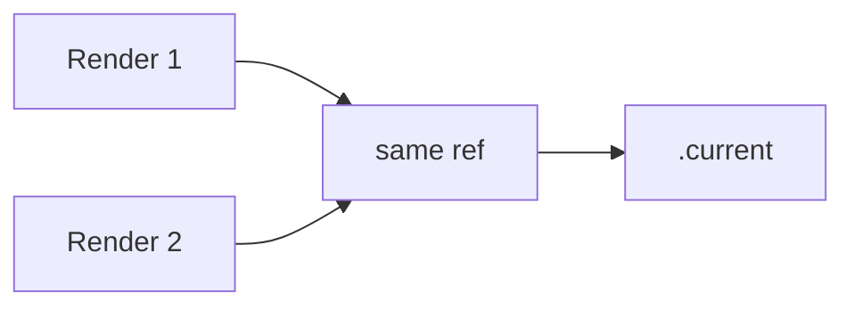

# useRef

## Detailed explanation
`useRef` returns a stable object whose `.current` property can hold a mutable value across renders. It is commonly used for DOM access, timers, storing latest values, and integrating with imperative APIs.

Updating `.current` does not trigger a re-render. That makes refs useful for values that need to persist but should not directly affect the rendered output.

## 1. One-line mental model
`useRef` is a persistent mutable box that does not re-render when changed.

## 2. Problem it solves
Function components need a way to keep mutable values across renders without using state.

## 3. Core idea
- `useRef(initialValue)` returns the same object every render.
- `.current` stores the value.
- DOM refs are populated after commit.
- Mutating `.current` does not re-render.
- Use state instead if UI must update.

## 4. Visual / analogy
`useRef` is like a drawer beside the component: you can change what is inside without repainting the room.



## 5. Minimal example

```tsx
function FocusInput() {
  const inputRef = React.useRef<HTMLInputElement>(null);
  return <input ref={inputRef} />;
}
```

## 6. Real-world example

```tsx
function Stopwatch() {
  const intervalRef = React.useRef<number | null>(null);

  function stop() {
    if (intervalRef.current !== null) window.clearInterval(intervalRef.current);
  }

  return <button onClick={stop}>Stop</button>;
}
```

## 7. Common interview questions
#### What does `useRef` do?
- **The Engine Mechanism (Why it behaves this way):** `useRef(initialValue)` creates a plain JavaScript object `{ current: initialValue }` and attaches it to the current Fiber node's hook list. On every subsequent render, React returns the exact same object reference — it does not create a new one. The `.current` property is mutable and can be read or written at any time. Because the object reference is stable, changing `.current` does not trigger React's reconciliation process or cause a re-render.
- **The Unforgettable Mental Model:** The **Safety Deposit Box**. The bank gives you the same box number every visit (stable reference). You can swap out the contents anytime (mutate `.current`), but the bank doesn't send you a notification when you do (no re-render).
- **The Trap:** Thinking `useRef` returns a special React object. It returns a plain `{ current: value }` object — the "magic" is only that React guarantees the same object across renders.
- **Senior Interview Playbook (Verbal Script):** "When asked this in an interview, say: `useRef` returns a stable mutable object with a `.current` property that persists across renders. The same object reference is returned on every render, and mutating `.current` does not trigger a re-render. It's commonly used for DOM node access, storing timer IDs, holding the latest value of a prop for use in closures, and any other case where you need persistence without triggering UI updates."

#### Does changing ref cause re-render?
- **The Engine Mechanism (Why it behaves this way):** React's update scheduling is triggered exclusively by state setters (`useState`, `useReducer`) and context provider value changes. Ref mutations are plain JavaScript property assignments that bypass React's update queue entirely. React has no mechanism to detect `.current` changes because there's no Proxy, getter/setter, or observer wrapping the ref object. The Fiber node simply holds a reference to the object, and any mutation to its properties is invisible to React's reconciliation engine.
- **The Unforgettable Mental Model:** The **Behind-the-Scenes Crew**. The stage crew can rearrange props backstage (mutate ref) without the audience noticing. Only when the director calls for a scene change (state update) does the audience see something different.
- **The Trap:** Mutating a ref and expecting the UI to update. `ref.current = 5` silently stores the value — the component will not re-render until something else triggers it.
- **Senior Interview Playbook (Verbal Script):** "When asked this in an interview, say: No, changing `ref.current` does not cause a re-render. Refs are plain JavaScript objects that exist outside React's update scheduling system. Mutating them is a silent operation — React has no way to detect the change. If you need the UI to reflect a value change, use `useState` instead. Refs are for values that need to persist but should not directly affect the rendered output."

#### `useRef` vs `useState`?
- **The Engine Mechanism (Why it behaves this way):** Both hooks store values on the Fiber node, but through different mechanisms. `useState` stores values in `memoizedState` with an associated update queue — calling the setter queues an update and schedules a re-render. `useRef` stores values in a plain object attached to the hook — mutating `.current` has no queue and no scheduling. During reconciliation, React checks state values for changes to decide whether to re-render children, but ref values are never consulted in this decision process.
- **The Unforgettable Mental Model:** The **Public Announcement vs. the Private Notebook**. `useState` is a public announcement — everyone hears the change and reacts accordingly. `useRef` is a private notebook — you write in it, but nobody reacts unless you choose to share.
- **The Trap:** Using `useRef` for values that should trigger UI updates, or using `useState` for values that change frequently but don't need rendering (causing unnecessary re-renders).
- **Senior Interview Playbook (Verbal Script):** "When asked this in an interview, say: The difference comes down to rendering. `useState` triggers a re-render when updated — use it for values that affect what the user sees. `useRef` does not trigger a re-render — use it for values that need to persist across renders but shouldn't affect the UI, like DOM references, timer IDs, or the latest value for use in closures. If changing the value should update the screen, it's state. If it's just bookkeeping, it's a ref."

#### How do DOM refs work?
- **The Engine Mechanism (Why it behaves this way):** When you pass a ref to a JSX element's `ref` prop, React stores the ref object on the Fiber node for that element. During the commit phase, after React creates or updates the actual DOM node, it assigns the DOM node to `ref.current`. This happens synchronously during commit, so the ref is populated before the browser paints. On unmount, React sets `ref.current` back to `null`. For function components, refs only work with `forwardRef` because function component instances don't have a direct DOM representation.
- **The Unforgettable Mental Model:** The **Name Tag**. When an actor walks on stage (DOM node mounts), you hand them a name tag (ref assignment). When they leave (unmount), you take the name tag back (null). The name tag lets you find and interact with that specific actor anytime during the performance.
- **The Trap:** Reading a DOM ref during the render phase or before mount. The ref is `null` until after the commit phase. Access it in effects, event handlers, or layout effects — never during render.
- **Senior Interview Playbook (Verbal Script):** "When asked this in an interview, say: DOM refs work by React assigning the actual DOM node to `ref.current` during the commit phase, after the node is created but before the browser paints. This means the ref is `null` during the initial render and only populated after commit. I access DOM refs in `useEffect` for post-paint operations or `useLayoutEffect` for pre-paint measurements. The ref is set back to `null` on unmount, so I always check for null before accessing DOM properties."

#### How do refs store timer IDs?
- **The Engine Mechanism (Why it behaves this way):** Timer IDs from `setTimeout` or `setInterval` are numeric values that need to persist across renders so they can be cleared later. Storing them in `useState` would cause unnecessary re-renders every time the ID changes. Storing them in `useRef` keeps the ID accessible across renders without triggering any rendering. The ref object survives the component's render cycles, so `clearInterval(ref.current)` works correctly even after multiple re-renders.
- **The Unforgettable Mental Model:** The **Coat Check Ticket**. You don't need to display your coat check number on a billboard (state). You just need to keep it in your pocket (ref) so you can claim your coat later. The number itself isn't visible to anyone — it's just for your reference.
- **The Trap:** Storing timer IDs in state, which causes a re-render every time you start or stop a timer. Timer IDs are bookkeeping data, not UI data.
- **Senior Interview Playbook (Verbal Script):** "When asked this in an interview, say: I store timer IDs in refs because they're bookkeeping data, not UI data. A timer ID doesn't affect what the user sees, so storing it in state would cause unnecessary re-renders. By using `useRef`, I can start a timer, store its ID in `ref.current`, and later clear it with `clearInterval(ref.current)` — all without triggering any renders. The ref persists across renders, so the ID is always accessible when I need to clean up."

#### When should refs be avoided?
- **The Engine Mechanism (Why it behaves this way):** Refs bypass React's declarative rendering model. When you use a ref to store a value that should affect the UI, you're manually managing synchronization between the ref and the rendered output — exactly the problem React was designed to solve. React's Fiber architecture and reconciliation engine are optimized for state-driven rendering; using refs for UI state defeats these optimizations and introduces manual synchronization bugs where the ref value and the displayed value can diverge.
- **The Unforgettable Mental Model:** The **Manual Override Switch**. React's state system is the autopilot — it keeps everything synchronized automatically. Using refs for UI state is like grabbing the manual controls — you can do it, but you're now responsible for keeping everything in sync, and you will make mistakes.
- **The Trap:** Using refs to "optimize" away re-renders for values that actually need to render. This creates bugs where the UI shows stale data because the ref changed but no re-render was triggered.
- **Senior Interview Playbook (Verbal Script):** "When asked this in an interview, say: I avoid refs for any value that should affect the rendered UI. If changing a value should update what the user sees, it must be state. I also avoid refs for values that multiple components need to react to — that's either state lifted up or context. Refs are appropriate for DOM access, timer IDs, storing the latest value for use in closures, and integrating with imperative third-party APIs. The rule of thumb is: if it affects rendering, it's state. If it's invisible bookkeeping, it's a ref."

#### What is latest-value ref?
- **The Engine Mechanism (Why it behaves this way):** A latest-value ref is a pattern where you store the most recent value of a prop or state in a ref, typically updated during render or in an effect: `ref.current = value`. This is useful because closures (in effects, callbacks, or timers) capture values from the render they were created in. By reading from `ref.current` instead of the captured variable, the closure always accesses the freshest value, even if the closure itself was created many renders ago. This works because the ref object is stable — all closures reference the same object.
- **The Unforgettable Mental Model:** The **Live Scoreboard**. A closure captures a snapshot of the score at the moment it was created (stale value). A latest-value ref is like a live scoreboard that always shows the current score — no matter when you look at it, you see the real-time value.
- **The Trap:** Forgetting to update `ref.current` on every render. If you only set it once, it becomes stale itself. The ref must be updated consistently to stay current.
- **Senior Interview Playbook (Verbal Script):** "When asked this in an interview, say: A latest-value ref is a pattern where I store the current value of a prop or state in a ref, updating it on every render. This solves the stale closure problem — when a callback or effect was created in an earlier render and captures old values, it can instead read from `ref.current` to get the freshest value. It's particularly useful for timers, intervals, and async callbacks that need access to current state without recreating themselves on every render."

## 8. Active recall test
1. **What does `.current` hold?**
   - **Explanation:** Any JavaScript value — a DOM node, timer ID, latest prop/state value, or any mutable data that needs to persist across renders without triggering re-renders.
2. **Does `ref.current = x` re-render?**
   - **Explanation:** No. Ref mutations are plain JavaScript property assignments that bypass React's update scheduling. React has no mechanism to detect `.current` changes.
3. **Why use ref for timer ID?**
   - **Explanation:** Timer IDs are bookkeeping data, not UI data. Storing them in state causes unnecessary re-renders. Refs persist the ID across renders without triggering any rendering.
4. **When is state better?**
   - **Explanation:** When the value affects what the user sees. If changing the value should update the UI, use `useState`. Refs are only for values that don't directly affect rendering.
5. **When is DOM ref available?**
   - **Explanation:** After the commit phase — in `useEffect`, `useLayoutEffect`, or event handlers. It is `null` during the initial render and before commit, and set back to `null` on unmount.

## 9. Mistakes / traps
- Using ref for visible UI state.
- Reading DOM ref before mount.
- Mutating refs during render for important logic.
- Forgetting null checks.
- Treating refs as a general global store.

## 10. Compare with related concepts
- **`useRef` vs `useState`:** ref persists silently; state updates UI.
- **`useRef` vs variable:** ref survives renders; variable resets.
- **`useRef` vs `createRef`:** `useRef` is stable in function components; `createRef` creates a new object if called during render.

## 11. Summary from memory
Explain why focusing an input uses a ref, but showing input text uses state.

## 12. Spaced revision prompts
- After 1 day: Define `useRef`.
- After 3 days: Compare ref and state.
- After 7 days: Store a timer ID in a ref.
- After 14 days: Explain latest-value refs.

