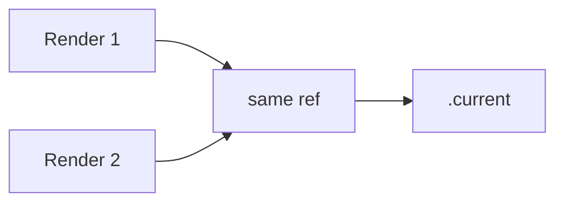

# useRef

## Detailed explanation
`useRef` returns a stable object whose `.current` property can hold a mutable value across renders. It is commonly used for DOM access, timers, storing latest values, and integrating with imperative APIs.

Updating `.current` does not trigger a re-render. That makes refs useful for values that need to persist but should not directly affect the rendered output.

## 1. One-line mental model
`useRef` is a persistent mutable box that does not re-render when changed.

## 2. Problem it solves
Function components need a way to keep mutable values across renders without using state.

## 3. Core idea
- `useRef(initialValue)` returns the same object every render.
- `.current` stores the value.
- DOM refs are populated after commit.
- Mutating `.current` does not re-render.
- Use state instead if UI must update.

## 4. Visual / analogy
`useRef` is like a drawer beside the component: you can change what is inside without repainting the room.



## 5. Minimal example

```tsx
function FocusInput() {
  const inputRef = React.useRef<HTMLInputElement>(null);
  return <input ref={inputRef} />;
}
```

## 6. Real-world example

```tsx
function Stopwatch() {
  const intervalRef = React.useRef<number | null>(null);

  function stop() {
    if (intervalRef.current !== null) window.clearInterval(intervalRef.current);
  }

  return <button onClick={stop}>Stop</button>;
}
```

## 7. Common interview questions
- What does `useRef` do?
- Does changing ref cause re-render?
- `useRef` vs `useState`?
- How do DOM refs work?
- How do refs store timer IDs?
- When should refs be avoided?
- What is latest-value ref?

## 8. Active recall test
1. What does `.current` hold?
2. Does `ref.current = x` re-render?
3. Why use ref for timer ID?
4. When is state better?
5. When is DOM ref available?

## 9. Mistakes / traps
- Using ref for visible UI state.
- Reading DOM ref before mount.
- Mutating refs during render for important logic.
- Forgetting null checks.
- Treating refs as a general global store.

## 10. Compare with related concepts
- **`useRef` vs `useState`:** ref persists silently; state updates UI.
- **`useRef` vs variable:** ref survives renders; variable resets.
- **`useRef` vs `createRef`:** `useRef` is stable in function components; `createRef` creates a new object if called during render.

## 11. Summary from memory
Explain why focusing an input uses a ref, but showing input text uses state.

## 12. Spaced revision prompts
- After 1 day: Define `useRef`.
- After 3 days: Compare ref and state.
- After 7 days: Store a timer ID in a ref.
- After 14 days: Explain latest-value refs.

