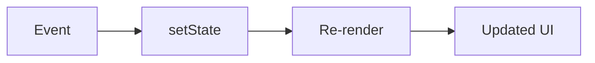

# useState

## Detailed explanation
`useState` is the basic React hook for storing component-owned state in functional components. It returns the current state value and a setter function. Calling the setter schedules a re-render with the new value.

Use `useState` for local UI state such as input values, selected tabs, open/closed flags, counters, and small independent values. If the next state depends on the previous state, use the functional updater form to avoid stale values.

## 1. One-line mental model
`useState` gives a function component memory that can trigger re-rendering.

## 2. Problem it solves
Function components need a way to remember values between renders and update the UI when those values change.

## 3. Core idea
- `useState(initialValue)` returns `[value, setValue]`.
- The initial value is used on the first render.
- Calling the setter schedules a re-render.
- State should be updated immutably.
- Use functional updates when the next value depends on the previous value.

## 4. Visual / analogy
`useState` is like a whiteboard beside a component: React reads it during render and redraws when it changes.



## 5. Minimal example

```tsx
function Counter() {
  const [count, setCount] = React.useState(0);
  return <button onClick={() => setCount(count + 1)}>{count}</button>;
}
```

## 6. Real-world example

```tsx
function SearchInput({ onSearch }: { onSearch: (value: string) => void }) {
  const [value, setValue] = React.useState("");

  return (
    <form onSubmit={(event) => {
      event.preventDefault();
      onSearch(value.trim());
    }}>
      <input value={value} onChange={(event) => setValue(event.currentTarget.value)} />
    </form>
  );
}
```

## 7. Common interview questions
- What does `useState` return?
- Why does state not update immediately?
- What is a functional state update?
- How do you update objects or arrays in state?
- What is lazy initialization?
- When should you avoid `useState`?
- How is `useState` different from `useRef`?

## 8. Active recall test
1. What triggers the re-render?
2. Why is `setCount(count + 1)` sometimes unsafe in repeated updates?
3. How do you initialize expensive state lazily?
4. Why should arrays in state be copied?
5. When is derived state unnecessary?

## 9. Mistakes / traps
- Mutating state directly.
- Storing derived values as separate state.
- Expecting the state variable to change immediately after calling the setter.
- Using stale values instead of functional updates.
- Keeping state too high in the tree.

## 10. Compare with related concepts
- **`useState` vs `useReducer`:** `useState` is simpler; `useReducer` fits complex transitions.
- **`useState` vs `useRef`:** state re-renders; ref does not.
- **`useState` vs props:** state is owned locally; props are received.

## 11. Summary from memory
Explain how `useState` drives a controlled input and why functional updates matter.

## 12. Spaced revision prompts
- After 1 day: Write `useState` syntax from memory.
- After 3 days: Explain functional updates.
- After 7 days: Update an array immutably.
- After 14 days: Compare `useState`, `useReducer`, and `useRef`.

