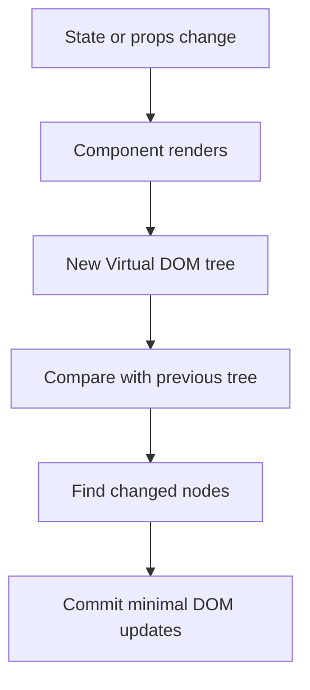

# Virtual DOM and Reconciliation

## Detailed explanation
The Virtual DOM is React's in-memory description of the UI. When a component renders, React creates React element objects that describe what should be on the screen. After state or props change, React creates a new tree and compares it with the previous tree.

That comparison process is reconciliation. React uses it to decide which parts of the UI changed before committing updates to the real DOM. This is why React can let developers write declarative UI while still updating the browser efficiently enough for complex applications.

## 1. One-line mental model
The Virtual DOM is React's lightweight description of the UI, and reconciliation is the process React uses to compare old and new UI descriptions before updating the real DOM.

## 2. Problem it solves
Updating the real DOM directly is expensive and error-prone when UI changes frequently. Before React, developers often had to manually find DOM nodes, decide what changed, update them in the right order, and avoid unnecessary work.

The pain was:

- UI updates were scattered across many imperative DOM operations.
- It was easy to update too much of the page.
- Manual DOM manipulation made state and UI drift apart.
- List changes were hard to update correctly.
- Complex screens became difficult to reason about.

React solves this by letting developers describe what the UI should look like for a given state. React then figures out how to update the DOM.

## 3. Core idea
- React renders components into React elements, which are plain JavaScript objects describing the UI.
- These element objects form a Virtual DOM tree.
- When state or props change, React creates a new Virtual DOM tree.
- Reconciliation compares the previous tree with the new tree.
- React commits only the necessary changes to the real DOM.

Important: the Virtual DOM does not make every update automatically faster. Its main value is predictable declarative UI plus efficient enough updates for most applications.

## 4. Visual / analogy
Think of the Virtual DOM like an architect's blueprint. If the house plan changes, the builder compares the old blueprint with the new blueprint before changing the real house.



For a list:

```txt
Previous: [A, B, C]
Next:     [A, C, D]

With stable keys:
- A stays
- B is removed
- C moves or stays matched by identity
- D is inserted
```

## 5. Minimal example

```tsx
function Counter() {
  const [count, setCount] = React.useState(0);

  return (
    <button onClick={() => setCount((value) => value + 1)}>
      Count: {count}
    </button>
  );
}
```

When `setCount` runs:

1. React renders `Counter` again.
2. The new element says the button text should be `Count: 1`.
3. React compares it with the old element, where the text was `Count: 0`.
4. React updates the text node in the real DOM.

React does not recreate the whole page for this update.

## 6. Real-world example

```tsx
type Todo = {
  id: string;
  title: string;
  completed: boolean;
};

function TodoList({ todos }: { todos: Todo[] }) {
  return (
    <ul>
      {todos.map((todo) => (
        <li key={todo.id}>
          <label>
            <input type="checkbox" checked={todo.completed} readOnly />
            {todo.title}
          </label>
        </li>
      ))}
    </ul>
  );
}
```

The `key={todo.id}` is critical. During reconciliation, React uses the key to understand which todo is the same item between renders.

If a new todo is inserted at the top:

```txt
Before: [{id: "1"}, {id: "2"}]
After:  [{id: "3"}, {id: "1"}, {id: "2"}]
```

With stable IDs, React knows items `1` and `2` are the same items, just shifted. Without stable keys, React may match by position and reuse the wrong component state.

## 7. Common interview questions
- What is the Virtual DOM?
- Why does React use a Virtual DOM?
- What is reconciliation in React?
- What is the difference between render and commit?
- How does React decide what changed?
- What role do keys play in reconciliation?
- Why should array index not be used as a key for dynamic lists?
- Is the Virtual DOM always faster than direct DOM manipulation?
- What happens when the element type changes from `<div>` to `<span>`?
- How is reconciliation related to React Fiber?

## 8. Active recall test
Answer these without looking above:

1. What is stored in the Virtual DOM?
2. What triggers React to create a new Virtual DOM tree?
3. What does reconciliation compare?
4. Why are stable keys important?
5. What can go wrong when index is used as a key?
6. What is the difference between calculating changes and committing changes?
7. Why is "Virtual DOM is always faster" an incomplete answer?
8. What happens when React sees two different element types at the same position?

## 9. Mistakes / traps
- Saying the Virtual DOM is a copy of the real DOM. It is not; it is a lightweight JavaScript description of UI.
- Saying React updates the whole DOM on every state change. React re-renders components, compares output, then commits needed DOM changes.
- Saying keys are only for removing console warnings. Keys preserve identity during reconciliation.
- Using array index as key when list items can be inserted, deleted, sorted, or filtered.
- Thinking memoization stops reconciliation completely. It can skip some component renders, but it depends on stable props and component boundaries.
- Thinking the Virtual DOM alone guarantees performance. Large renders, unstable props, and huge lists can still be slow.

## 10. Compare with related concepts
- **Virtual DOM vs real DOM:** the Virtual DOM is an in-memory UI description; the real DOM is the browser's actual document tree.
- **Reconciliation vs rendering:** rendering calls components to produce React elements; reconciliation compares old and new trees.
- **Reconciliation vs commit:** reconciliation decides what changed; commit applies changes to the real DOM and runs layout-related work.
- **Keys vs IDs:** an ID is data identity; a key is React's hint for preserving identity in a rendered list. They are often the same value.
- **Virtual DOM vs React Fiber:** Fiber is React's internal architecture for scheduling and organizing work; reconciliation runs through Fiber nodes in modern React.

## 11. Summary from memory
Close the book and explain this concept in your own words:

- What is the Virtual DOM?
- Why does React create a new UI tree after state changes?
- How does reconciliation decide what DOM work is needed?
- Why do stable keys matter in lists?
- What is the main misconception about Virtual DOM performance?

If you cannot explain it in two minutes, reread sections 3, 4, 6, and 9.

## 12. Spaced revision prompts
- After 1 day: Explain Virtual DOM vs real DOM in three sentences.
- After 3 days: Draw the render → reconcile → commit flow from memory.
- After 7 days: Explain why index keys break when inserting an item at the top of a list.
- After 14 days: Compare reconciliation, rendering, commit, and Fiber.
- Before interview: Answer "Is the Virtual DOM always faster?" with a nuanced explanation.
