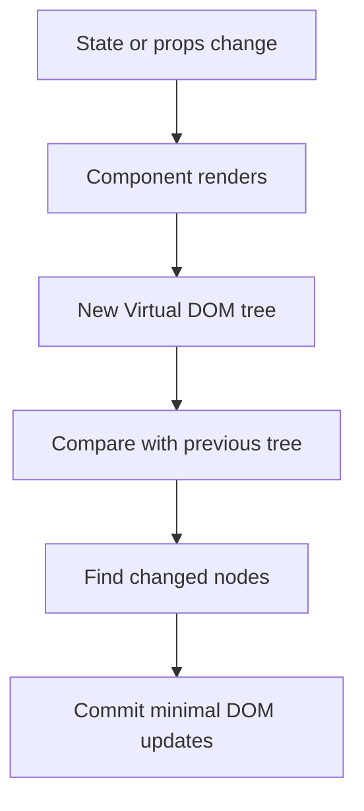

# Virtual DOM and Reconciliation

## Detailed explanation
The Virtual DOM is React's in-memory description of the UI. When a component renders, React creates React element objects that describe what should be on the screen. After state or props change, React creates a new tree and compares it with the previous tree.

That comparison process is reconciliation. React uses it to decide which parts of the UI changed before committing updates to the real DOM. This is why React can let developers write declarative UI while still updating the browser efficiently enough for complex applications.

## 1. One-line mental model
The Virtual DOM is React's lightweight description of the UI, and reconciliation is the process React uses to compare old and new UI descriptions before updating the real DOM.

## 2. Problem it solves
Updating the real DOM directly is expensive and error-prone when UI changes frequently. Before React, developers often had to manually find DOM nodes, decide what changed, update them in the right order, and avoid unnecessary work.

The pain was:

- UI updates were scattered across many imperative DOM operations.
- It was easy to update too much of the page.
- Manual DOM manipulation made state and UI drift apart.
- List changes were hard to update correctly.
- Complex screens became difficult to reason about.

React solves this by letting developers describe what the UI should look like for a given state. React then figures out how to update the DOM.

## 3. Core idea
- React renders components into React elements, which are plain JavaScript objects describing the UI.
- These element objects form a Virtual DOM tree.
- When state or props change, React creates a new Virtual DOM tree.
- Reconciliation compares the previous tree with the new tree.
- React commits only the necessary changes to the real DOM.

Important: the Virtual DOM does not make every update automatically faster. Its main value is predictable declarative UI plus efficient enough updates for most applications.

## 4. Visual / analogy
Think of the Virtual DOM like an architect's blueprint. If the house plan changes, the builder compares the old blueprint with the new blueprint before changing the real house.



For a list:

```txt
Previous: [A, B, C]
Next:     [A, C, D]

With stable keys:
- A stays
- B is removed
- C moves or stays matched by identity
- D is inserted
```

## 5. Minimal example

```tsx
function Counter() {
  const [count, setCount] = React.useState(0);

  return (
    <button onClick={() => setCount((value) => value + 1)}>
      Count: {count}
    </button>
  );
}
```

When `setCount` runs:

1. React renders `Counter` again.
2. The new element says the button text should be `Count: 1`.
3. React compares it with the old element, where the text was `Count: 0`.
4. React updates the text node in the real DOM.

React does not recreate the whole page for this update.

## 6. Real-world example

```tsx
type Todo = {
  id: string;
  title: string;
  completed: boolean;
};

function TodoList({ todos }: { todos: Todo[] }) {
  return (
    <ul>
      {todos.map((todo) => (
        <li key={todo.id}>
          <label>
            <input type="checkbox" checked={todo.completed} readOnly />
            {todo.title}
          </label>
        </li>
      ))}
    </ul>
  );
}
```

The `key={todo.id}` is critical. During reconciliation, React uses the key to understand which todo is the same item between renders.

If a new todo is inserted at the top:

```txt
Before: [{id: "1"}, {id: "2"}]
After:  [{id: "3"}, {id: "1"}, {id: "2"}]
```

With stable IDs, React knows items `1` and `2` are the same items, just shifted. Without stable keys, React may match by position and reuse the wrong component state.

## 7. Common interview questions
#### What is the Virtual DOM?
- **The Engine Mechanism (Why it behaves this way):** The Virtual DOM is a tree of plain JavaScript objects called React elements. Each element has a `type` (string for host elements like `'div'`, or function/class for components), `props`, and `children`. When a component renders, React calls the function and collects these objects into a tree structure. This tree lives entirely in JavaScript memory — it is not the real DOM. During the render phase, React builds this tree; during the commit phase, it translates the tree into actual DOM operations.
- **The Unforgettable Mental Model:** The **Architect's Blueprint**. The Virtual DOM is not the house — it's the blueprint. The real DOM is the actual house. When plans change, you update the blueprint first, figure out what construction work is needed, then send workers to modify only the affected rooms.
- **The Trap:** Saying "the Virtual DOM is a copy of the real DOM." It is not a copy at all — it is a lightweight JavaScript description that may never have a 1:1 correspondence with DOM nodes (e.g., Fragments produce no DOM node, and context providers are invisible in the DOM).
- **Senior Interview Playbook (Verbal Script):** "When asked this in an interview, say: The Virtual DOM is React's in-memory representation of the UI — a tree of plain JavaScript objects called React elements. Each element describes what should appear on screen: its type, props, and children. When state changes, React builds a new Virtual DOM tree by re-rendering components, then compares it with the previous tree to compute the minimal set of DOM mutations. The key insight is that the Virtual DOM is not a copy of the real DOM; it's a declarative description that React translates into efficient DOM operations."

#### Why does React use a Virtual DOM?
- **The Engine Mechanism (Why it behaves this way):** Direct DOM manipulation is expensive because every change can trigger style recalculation, layout, and paint — the browser's rendering pipeline. If developers manually update the DOM for every state change, they risk redundant operations, inconsistent UI states, and performance degradation. React's Virtual DOM lets developers write declarative code ("this is what the UI should look like") while React handles the imperative work. The reconciliation algorithm compares trees in JavaScript (fast) before touching the DOM (slow), batching mutations into a single commit.
- **The Unforgettable Mental Model:** The **Batch Processor**. Imagine you need to renovate a kitchen. Instead of calling a plumber for the sink, then an electrician for the lights, then a painter for the walls (three separate visits), you write down all changes, hand the list to a general contractor, and they do everything in one coordinated visit.
- **The Trap:** Claiming "the Virtual DOM makes React fast." The Virtual DOM's primary benefit is developer ergonomics and predictability, not raw speed. For simple updates, direct DOM manipulation can be faster. The Virtual DOM shines in complex apps where manual DOM management becomes unmaintainable.
- **Senior Interview Playbook (Verbal Script):** "When asked this in an interview, say: React uses the Virtual DOM primarily for developer experience and predictability, not raw performance. It lets developers describe UI declaratively — saying what should be on screen rather than how to get there. React then handles the expensive work of computing minimal DOM updates. The Virtual DOM acts as a buffer: React does all the comparison work in JavaScript, which is fast, and only touches the real DOM when it has a finalized set of mutations to apply. This makes complex UIs maintainable while keeping performance efficient enough for most applications."

#### What is reconciliation in React?
- **The Engine Mechanism (Why it behaves this way):** Reconciliation is the process React uses to compare the newly rendered element tree with the previous tree and determine what changed. It runs during the render phase and produces a set of mutations for the commit phase. React uses two key heuristics: (1) if two elements have different types, React tears down the old subtree and builds a new one from scratch; (2) for children in a list, React uses the `key` prop to match elements across renders. The result is a diff that tells the commit phase exactly which DOM nodes to create, update, move, or remove.
- **The Unforgettable Mental Model:** The **Document Diff Tool**. Like Git's diff showing exactly which lines were added, removed, or changed between two file versions, reconciliation shows exactly which UI elements changed between two renders. It doesn't rebuild the whole document — it produces a patch.
- **The Trap:** Confusing reconciliation with rendering. Rendering is calling component functions to produce element trees. Reconciliation is comparing those trees. They are distinct phases: render produces, reconciliation compares, commit applies.
- **Senior Interview Playbook (Verbal Script):** "When asked this in an interview, say: Reconciliation is React's comparison process that runs between rendering and committing. After React renders components and produces a new element tree, reconciliation compares it with the previous tree to identify what changed. It uses heuristics — like type comparison and key-based matching — to efficiently find differences. The output is a set of mutations that the commit phase applies to the real DOM. Reconciliation is what enables React's declarative model: you describe the desired UI, and React figures out the minimal work to get there."

#### What is the difference between render and commit?
- **The Engine Mechanism (Why it behaves this way):** The render phase is pure computation: React calls component functions, builds Virtual DOM trees, runs reconciliation, and produces a work plan. This phase can be paused, resumed, or discarded (in Concurrent Mode) because it has no side effects on the visible UI. The commit phase is when React applies the computed mutations to the real DOM, runs `useLayoutEffect` synchronously, and then schedules `useEffect` to fire asynchronously. The commit phase cannot be interrupted because the DOM is being mutated and the user can see the changes.
- **The Unforgettable Mental Model:** The **Kitchen vs. Dining Room**. The render phase is the kitchen — chefs can prep, taste, adjust recipes, and even start over without anyone seeing. The commit phase is when plates leave the kitchen and hit the dining room — once served, the customer sees it, and you can't take it back mid-bite.
- **The Trap:** Thinking `setState` immediately updates the screen. `setState` schedules a render. The actual DOM update happens later in the commit phase, which may be batched with other updates or deferred for priority reasons.
- **Senior Interview Playbook (Verbal Script):** "When asked this in an interview, say: The render phase is where React calls components, builds the new Virtual DOM tree, and computes what changed through reconciliation. This phase is pure and can be interrupted or discarded. The commit phase is where React applies those computed changes to the real DOM, fires layout effects synchronously, and schedules passive effects. The critical distinction: render calculates, commit applies. With Concurrent Mode, React can pause render work to handle urgent updates, but once commit starts, it runs to completion."

#### How does React decide what changed?
- **The Engine Mechanism (Why it behaves this way):** React's diffing algorithm uses two heuristics. First, it compares elements at the same position in the tree by their `type`. If the type changes (e.g., `<div>` becomes `<span>`, or `ComponentA` becomes `ComponentB`), React destroys the entire old subtree and creates a new one — including unmounting all components and losing their state. Second, if the type is the same, React keeps the DOM node and only updates the changed props. For lists, React uses the `key` prop to match children across renders. Without keys, React matches by position, which causes state bugs when items are reordered.
- **The Unforgettable Mental Model:** The **Twin Detection System**. React first checks: "Is this the same type of thing?" If yes, it keeps the existing structure and updates the details. If no, it demolishes everything and rebuilds from scratch. For siblings in a row, it checks name tags (keys) to know who is who.
- **The Trap:** Assuming React does a deep comparison of props. React only checks if `prevProps !== nextProps` (reference equality) at the element level. It does not deep-compare prop objects during reconciliation — that's what `React.memo` does at the component boundary.
- **Senior Interview Playbook (Verbal Script):** "When asked this in an interview, say: React decides what changed using two main heuristics. First, it compares element types at each position — if the type differs, React replaces the entire subtree, destroying state and rebuilding from scratch. If the type matches, React preserves the DOM node and updates only the changed props. For list children, React uses keys to match elements across renders by identity rather than position. This approach makes diffing O(n) instead of O(n³), which is practical for real-world UI trees."

#### What role do keys play in reconciliation?
- **The Engine Mechanism (Why it behaves this way):** Keys are React's mechanism for preserving component identity across renders in a list. During reconciliation, when React encounters a list of children, it builds a map from key to element. On the next render, it uses this map to determine which elements are the same, which are new, and which have been removed. Without keys, React matches children by position — so if you insert an item at index 0, every subsequent child appears to have changed, causing unnecessary re-renders and, worse, state corruption (e.g., an input field retaining the wrong value).
- **The Unforgettable Mental Model:** The **Name Tag at a Conference**. Without name tags, you'd assume the person standing in position 3 is the same person as yesterday. But if people shuffle around, you'd be wrong. Name tags (keys) let you correctly identify each person regardless of where they're standing.
- **The Trap:** Using array index as key. Index works only if the list is static — no insertions, deletions, reordering, or filtering. As soon as the list mutates, index-based keys cause React to match the wrong elements, leading to stale state and incorrect DOM reuse.
- **Senior Interview Playbook (Verbal Script):** "When asked this in an interview, say: Keys give React a stable identity for list items across renders. During reconciliation, React uses keys to match children by identity rather than position. This means when items are inserted, deleted, or reordered, React can correctly identify which elements are the same and preserve their state. Without keys, React falls back to position-based matching, which causes unnecessary re-renders and state bugs. The best keys are stable, unique identifiers from your data — like database IDs — not array indices."

#### Why should array index not be used as a key for dynamic lists?
- **The Engine Mechanism (Why it behaves this way):** When you use array index as a key, React associates component state with the position in the list, not the data item. If you insert an item at the beginning, the item that was at index 0 moves to index 1, but React thinks the component at index 1 is the same component it rendered last time at index 1. This means the component's internal state (like input values, toggle states, or effect subscriptions) stays attached to the wrong data item. The DOM node is reused incorrectly, and the UI shows stale or swapped data.
- **The Unforgettable Mental Model:** The **Hotel Room Mix-up**. Imagine a hotel that assigns guests to rooms by arrival order (index 1, 2, 3). If a VIP cuts in line and takes room 1, everyone else gets bumped down. But the hotel's system still thinks the person in room 2 is the same person who was there yesterday — so their luggage, preferences, and room service orders all go to the wrong guest.
- **The Trap:** Thinking "my list never changes, so index is fine." Even if the list seems static today, future requirements often add sorting, filtering, or pagination. Using index from the start is a technical debt trap.
- **Senior Interview Playbook (Verbal Script):** "When asked this in an interview, say: Array index as a key ties component identity to position rather than data. When a list changes — through insertion, deletion, or reordering — React incorrectly reuses DOM nodes and component state for the wrong items. For example, if you insert an item at the top, every item shifts down by one index, and React thinks each position still holds the same component. This causes input values, focus states, and effect subscriptions to attach to the wrong data. The fix is always to use a stable, unique identifier from the data itself."

#### Is the Virtual DOM always faster than direct DOM manipulation?
- **The Engine Mechanism (Why it behaves this way):** No. The Virtual DOM adds a layer of abstraction — building element trees, running reconciliation, and computing diffs — which has its own CPU cost. For simple, isolated DOM updates, direct manipulation via `document.querySelector` and `element.textContent` is faster because it skips this overhead entirely. The Virtual DOM's advantage is not raw speed but predictable performance at scale. In complex applications with hundreds of interdependent state changes, manual DOM management becomes error-prone and often does more work than necessary because developers can't track every dependency.
- **The Unforgettable Mental Model:** The **GPS vs. Local Knowledge**. If you're going to the corner store, walking directly is faster than opening a GPS app, waiting for it to calculate a route, and following turn-by-turn directions. But for a cross-country road trip with traffic, construction, and detours, the GPS will consistently find better routes than your memory alone.
- **The Trap:** Using "Virtual DOM is faster" as a blanket answer. Interviewers want nuance: the Virtual DOM trades a small overhead for predictable, maintainable updates in complex apps. For simple cases, direct DOM wins on raw speed.
- **Senior Interview Playbook (Verbal Script):** "When asked this in an interview, say: No, the Virtual DOM is not always faster. For simple, targeted DOM updates, direct manipulation is faster because it avoids the overhead of building trees and running diffing. The Virtual DOM's real value is predictability and developer experience at scale. In complex applications with many interdependent state changes, the Virtual DOM ensures consistent, efficient updates without requiring developers to manually track every DOM dependency. It's about sustainable performance, not peak speed."

#### What happens when the element type changes from `<div>` to `<span>`?
- **The Engine Mechanism (Why it behaves this way):** When React's diffing algorithm encounters a type change at the same position in the tree, it treats this as a complete replacement. React unmounts the entire old subtree (running `componentWillUnmount` for class components and cleanup functions for `useEffect`), destroys all associated DOM nodes, and creates a brand new subtree from scratch. Any component state in the replaced subtree is lost because React associates state with the component instance, and a type change creates a new instance.
- **The Unforgettable Mental Model:** The **Demolition and Rebuild**. If you tell the builder "replace the wooden door with a steel door," they don't repaint the old door — they tear it out completely and install a new one. Everything attached to the old door (the handle, the hinges, the paint) is gone.
- **The Trap:** Assuming React will preserve state or DOM nodes when types change. Even if the new element looks similar or has the same children, a type change triggers a full teardown and rebuild.
- **Senior Interview Playbook (Verbal Script):** "When asked this in an interview, say: When the element type changes at a position, React treats it as a complete replacement. It unmounts the entire old subtree — running all cleanup functions and destroying DOM nodes — then mounts a brand new subtree. Any local state in the replaced components is lost because React creates new component instances. This is intentional: different types represent fundamentally different UI elements, and React assumes they're not compatible enough to preserve state between them."

#### How is reconciliation related to React Fiber?
- **The Engine Mechanism (Why it behaves this way):** React Fiber is the internal architecture that implements reconciliation. In the Fiber architecture, each node in the component tree is represented by a Fiber object — a JavaScript object that tracks the component's type, state, props, child, sibling, and return (parent) pointers. Reconciliation walks this Fiber tree, comparing old and new elements, marking nodes with effect tags (Placement, Update, Deletion), and building a linked list of work. Fiber enables reconciliation to be interruptible: React can pause work on a Fiber node, handle higher-priority updates, and resume later. The Fiber tree also maintains a "work-in-progress" tree that runs in parallel with the current tree during reconciliation.
- **The Unforgettable Mental Model:** The **Assembly Line with Pause Button**. Pre-Fiber React was like an assembly line that had to finish the entire product before stopping. Fiber breaks the line into individual stations, each handling one component. The manager can pause any station, redirect workers to urgent orders, and resume when ready — all while the current product stays on display.
- **The Trap:** Treating Fiber and reconciliation as separate concepts. Fiber is not an alternative to reconciliation — it is the engine that runs reconciliation. Reconciliation is the "what" (comparing trees); Fiber is the "how" (the data structure and scheduling system).
- **Senior Interview Playbook (Verbal Script):** "When asked this in an interview, say: React Fiber is the internal architecture that implements reconciliation. Each component is represented as a Fiber node — a JavaScript object with pointers to its child, sibling, and parent. Reconciliation walks this Fiber tree, comparing elements and marking nodes with effect tags. Fiber's key innovation is that it makes reconciliation interruptible: React can pause work on low-priority updates, handle urgent interactions, and resume later. Fiber also maintains a work-in-progress tree alongside the current tree, enabling React to prepare the next UI state without affecting what's currently on screen."

## 8. Active recall test
1. **What is the Virtual DOM?**
   - **Explanation:** It is a tree of plain JavaScript objects (React elements) that describe the UI. Each element has a type, props, and children. It lives in memory and is not the real DOM.
2. **What triggers a new Virtual DOM tree?**
   - **Explanation:** State changes (`setState`, `useState` setter), prop changes from parent re-renders, and context value changes trigger React to re-render affected components, producing a new Virtual DOM tree.
3. **What does reconciliation compare?**
   - **Explanation:** Reconciliation compares the newly rendered element tree with the previous element tree to identify which nodes changed, were added, or were removed, producing a set of DOM mutations for the commit phase.
4. **Why are stable keys important?**
   - **Explanation:** Stable keys let React match list items by identity across renders. Without them, React matches by position, causing incorrect DOM reuse, unnecessary re-renders, and state corruption when items are reordered, inserted, or deleted.
5. **What goes wrong with index keys?**
   - **Explanation:** Index keys tie component identity to position. When the list mutates, React reuses DOM nodes and component state for the wrong data items, causing inputs to show wrong values, effects to fire on wrong elements, and state to become desynchronized from data.
6. **What is the difference between render and commit?**
   - **Explanation:** Render is the pure computation phase where React calls components and builds element trees — it can be paused or discarded. Commit is when React applies mutations to the real DOM and fires effects — it runs synchronously and cannot be interrupted.
7. **Why is "Virtual DOM is always faster" wrong?**
   - **Explanation:** The Virtual DOM adds overhead from tree construction and diffing. For simple updates, direct DOM manipulation is faster. The Virtual DOM's value is predictable, maintainable performance at scale, not raw speed.
8. **What happens when element type changes?**
   - **Explanation:** React unmounts the entire old subtree, destroys all DOM nodes, runs cleanup functions, and creates a brand new subtree. All component state in the replaced subtree is lost because a new component instance is created.

## 9. Mistakes / traps
- Saying the Virtual DOM is a copy of the real DOM. It is not; it is a lightweight JavaScript description of UI.
- Saying React updates the whole DOM on every state change. React re-renders components, compares output, then commits needed DOM changes.
- Saying keys are only for removing console warnings. Keys preserve identity during reconciliation.
- Using array index as key when list items can be inserted, deleted, sorted, or filtered.
- Thinking memoization stops reconciliation completely. It can skip some component renders, but it depends on stable props and component boundaries.
- Thinking the Virtual DOM alone guarantees performance. Large renders, unstable props, and huge lists can still be slow.

## 10. Compare with related concepts
- **Virtual DOM vs real DOM:** the Virtual DOM is an in-memory UI description; the real DOM is the browser's actual document tree.
- **Reconciliation vs rendering:** rendering calls components to produce React elements; reconciliation compares old and new trees.
- **Reconciliation vs commit:** reconciliation decides what changed; commit applies changes to the real DOM and runs layout-related work.
- **Keys vs IDs:** an ID is data identity; a key is React's hint for preserving identity in a rendered list. They are often the same value.
- **Virtual DOM vs React Fiber:** Fiber is React's internal architecture for scheduling and organizing work; reconciliation runs through Fiber nodes in modern React.

## 11. Summary from memory
Close the book and explain this concept in your own words:

- What is the Virtual DOM?
- Why does React create a new UI tree after state changes?
- How does reconciliation decide what DOM work is needed?
- Why do stable keys matter in lists?
- What is the main misconception about Virtual DOM performance?

If you cannot explain it in two minutes, reread sections 3, 4, 6, and 9.

## 12. Spaced revision prompts
- After 1 day: Explain Virtual DOM vs real DOM in three sentences.
- After 3 days: Draw the render → reconcile → commit flow from memory.
- After 7 days: Explain why index keys break when inserting an item at the top of a list.
- After 14 days: Compare reconciliation, rendering, commit, and Fiber.
- Before interview: Answer "Is the Virtual DOM always faster?" with a nuanced explanation.
