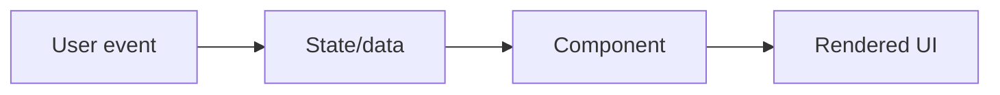

# What Is React and Why It Is Used

## Detailed explanation
React is a UI library that helps developers build screens from components instead of manually updating the DOM. A component describes what should appear for a given set of props and state. When that data changes, React runs the component again, compares the new UI description with the previous one, and updates the browser where needed.

In real projects, React is used for dashboards, SaaS apps, e-commerce flows, admin panels, mobile apps through React Native, and meta-framework apps through Next.js or Remix. Interviewers ask this concept first because it reveals whether you understand React as a state-driven rendering model, not just a syntax for writing HTML inside JavaScript.

## 1. One-line mental model
React is a JavaScript library for building user interfaces by describing UI as reusable components that update when data changes.

## 2. Problem it solves
Traditional DOM-heavy frontend code becomes difficult to maintain when many parts of the screen depend on changing state. Developers had to manually update DOM nodes, keep UI in sync with data, and reuse UI patterns without a consistent component model.

## 3. Core idea
- React lets you describe what the UI should look like for a given state.
- UI is split into reusable components.
- Data flows down through props.
- State changes trigger re-rendering.
- React updates the browser DOM through its render and reconciliation process.

## 4. Visual / analogy
React is like a spreadsheet for UI: when the data changes, the dependent cells update automatically.



## 5. Minimal example

```tsx
function Greeting({ name }: { name: string }) {
  return <h1>Hello, {name}</h1>;
}
```

## 6. Real-world example

```tsx
function DashboardPage() {
  const userQuery = useUserQuery();

  if (userQuery.isLoading) return <PageSkeleton />;
  if (userQuery.isError) return <ErrorState />;

  return <DashboardShell user={userQuery.data} />;
}
```

React helps express loading, error, and success UI as state-driven branches.

## 7. Common interview questions
#### What is React?
- **The Engine Mechanism (Why it behaves this way):** React is a declarative, component-based JavaScript library for building user interfaces. Under the hood, React maintains an in-memory representation of the UI called the Virtual DOM (a tree of React element objects). When state or props change, React re-executes the affected component functions, producing a new Virtual DOM tree. It then runs its reconciliation algorithm (diffing) to compare the new tree with the previous one, computes the minimal set of mutations, and applies them to the real browser DOM in a single commit phase.
- **The Unforgettable Mental Model:** The **Architect's Blueprint**. Instead of manually laying every brick (imperative DOM manipulation), you hand the architect a blueprint of what the house should look like (declarative JSX). When requirements change, you hand over a revised blueprint, and the construction crew figures out exactly which walls to move.
- **The Trap:** Calling React a "framework." React is strictly a UI rendering library. It does not provide routing, data fetching, or build tooling out of the box — those come from the ecosystem (React Router, TanStack Query, Vite, Next.js, etc.).
- **Senior Interview Playbook (Verbal Script):** "When asked this in an interview, say: React is a declarative JavaScript library for building user interfaces. It lets developers describe what the UI should look like for any given state using components. When state changes, React re-renders the component tree, diffs the new Virtual DOM against the previous one, and applies only the necessary changes to the real DOM, ensuring efficient and predictable UI updates."

#### Why is React used?
- **The Engine Mechanism (Why it behaves this way):** React is used because it solves the complexity of synchronizing UI with application state. In traditional imperative code, every state change requires manual DOM queries (`document.querySelector`), class toggling, element creation, and removal. React abstracts this by treating UI as a pure function of state: `UI = f(state)`. The Fiber architecture enables React to schedule and prioritize rendering work, interrupt low-priority updates, and batch multiple state changes into a single render pass.
- **The Unforgettable Mental Model:** The **Auto-Sync Dashboard**. Imagine a control room where every gauge, light, and screen automatically updates the moment a sensor reading changes — no one has to walk over and flip switches manually. That's React for UI.
- **The Trap:** Thinking React is only for SPAs. React powers server-rendered apps (Next.js), static sites, mobile apps (React Native), and even 3D/VR experiences (React Three Fiber).
- **Senior Interview Playbook (Verbal Script):** "When asked this in an interview, say: React is used because it dramatically simplifies UI development by making the UI a direct function of state. Instead of manually tracking and mutating DOM nodes, developers declare what the screen should look like, and React handles the diffing and updates. Its component model promotes reusability, its ecosystem is vast, and its concurrent rendering capabilities enable smooth, responsive user experiences even in complex applications."

#### Is React a library or framework?
- **The Engine Mechanism (Why it behaves this way):** React is classified as a library because it only handles one concern: rendering UI and managing component state. It does not prescribe routing, HTTP clients, state management strategies, or build configurations. A framework (like Angular or Next.js) is opinionated and provides a complete application skeleton. React gives you the `createElement` and reconciliation engine; you choose the rest.
- **The Unforgettable Mental Model:** The **Power Tool vs. the Workshop**. React is a high-precision power drill (library) — it does one thing exceptionally well. A framework is the entire workshop — it includes the drill, the saw, the workbench, and tells you exactly where to place each tool.
- **The Trap:** Confusing React with Next.js. Next.js is a React framework that adds routing, SSR/SSG, API routes, and deployment conventions on top of the React library.
- **Senior Interview Playbook (Verbal Script):** "When asked this in an interview, say: React is a library, not a framework. It focuses exclusively on the view layer — rendering components and managing local state. It deliberately leaves routing, data fetching, and global state management to the ecosystem. This unopinionated approach gives teams the flexibility to choose tools that fit their specific architecture, whether that's React Router, Redux, TanStack Query, or a meta-framework like Next.js."

#### What problem does React solve?
- **The Engine Mechanism (Why it behaves this way):** React solves the "UI state synchronization" problem. As applications grow, the number of interactive elements, conditional branches, and data dependencies increases exponentially. Manually keeping the DOM in sync with application state leads to bugs where the UI shows stale data, event handlers fire on removed elements, or conflicting updates overwrite each other. React's declarative model ensures that the rendered output is always a consistent reflection of the current state.
- **The Unforgettable Mental Model:** The **Single Source of Truth Ledger**. Instead of having ten different notebooks tracking the same information, React maintains one master ledger (state). Every time the ledger is updated, every dependent display panel automatically refreshes to match.
- **The Trap:** Believing React eliminates all bugs. It eliminates DOM synchronization bugs, but introduces its own categories of bugs: stale closures, infinite re-render loops, and unnecessary re-renders from poor memoization.
- **Senior Interview Playbook (Verbal Script):** "When asked this in an interview, say: React solves the fundamental problem of keeping the UI synchronized with application state. In complex applications, manually updating the DOM leads to inconsistencies, race conditions, and hard-to-debug state drift. React guarantees that the UI is always a deterministic reflection of the current state by re-rendering components declaratively and applying minimal, batched DOM updates through its reconciliation engine."

#### How does React update the UI?
- **The Engine Mechanism (Why it behaves this way):** React updates the UI through a three-phase process:
  1. **Trigger:** A state update (`setState`) or prop change schedules a re-render.
  2. **Render Phase:** React calls the component functions, builds a new Virtual DOM tree, and runs the diffing algorithm against the previous tree. This phase is pure and can be paused or interrupted (Concurrent Mode).
  3. **Commit Phase:** React applies the calculated mutations to the real DOM in a single synchronous burst. After commit, `useLayoutEffect` fires synchronously, then `useEffect` fires asynchronously.
- **The Unforgettable Mental Model:** The **Three-Act Play**. Act 1 (Trigger): The director calls "action!" Act 2 (Render): Actors rehearse their new positions off-stage, figuring out who moves where. Act 3 (Commit): The curtain rises, and the audience sees the final stage change all at once — no awkward mid-scene shuffling.
- **The Trap:** Thinking React updates the DOM immediately when you call `setState`. State updates are batched and deferred until React is ready to commit.
- **Senior Interview Playbook (Verbal Script):** "When asked this in an interview, say: React updates the UI through a render-and-commit cycle. When state changes, React re-executes the affected components to produce a new Virtual DOM tree. It then diffs this against the previous tree to compute the minimal set of changes. Finally, in the commit phase, React applies those changes to the real DOM in a single batch. This two-phase approach allows React to optimize performance and, with Concurrent Mode, even interrupt rendering to handle higher-priority updates."

#### What is a component?
- **The Engine Mechanism (Why it behaves this way):** A React component is a JavaScript function (or class) that accepts an input object called `props` and returns a React element tree (JSX). Each component instance has its own isolated state, lifecycle hooks, and execution context. When React renders a component, it calls the function, collects the returned element tree, and recursively renders any child components. The output is a description of what the DOM should look like, not the DOM itself.
- **The Unforgettable Mental Model:** The **Stamping Machine**. A component is like a machine that takes raw materials (props), applies its internal settings (state), and stamps out a finished product (UI). Feed it different materials, get different products — but the machine itself never changes.
- **The Trap:** Treating components as templates. Components are executable functions with logic, state, side effects, and lifecycle — not static HTML snippets.
- **Senior Interview Playbook (Verbal Script):** "When asked this in an interview, say: A React component is a reusable, self-contained unit of UI logic. It's a function that accepts props as input and returns a description of what should appear on screen. Components encapsulate their own state, lifecycle behavior, and rendering logic, making them the fundamental building blocks of a React application. They promote composability, testability, and maintainability by breaking complex UIs into manageable, independent pieces."

#### What is declarative UI?
- **The Engine Mechanism (Why it behaves this way):** Declarative UI means describing the desired end state of the interface rather than scripting the steps to achieve it. In React, you write JSX that expresses "if `isLoading` is true, show a spinner; if `data` exists, show a table." React's engine compares this declaration with the current DOM and performs the necessary operations. This contrasts with imperative code where you'd write `document.getElementById('spinner').style.display = 'block'`.
- **The Unforgettable Mental Model:** The **Restaurant Order**. Declarative UI is like ordering a meal — you describe what you want on the plate. Imperative UI is like walking into the kitchen and telling the chef exactly which pan to use, how long to cook each ingredient, and in what order to plate everything.
- **The Trap:** Thinking declarative means "no logic." Declarative UI still contains conditional logic, loops, and computations — they're just expressed as part of the output description, not as DOM mutations.
- **Senior Interview Playbook (Verbal Script):** "When asked this in an interview, say: Declarative UI means describing what the interface should look like for a given state, rather than writing step-by-step instructions to manipulate the DOM. In React, we declare the UI structure using JSX with conditional rendering and data binding. React's reconciliation engine then figures out the most efficient way to transform the current DOM into the desired state. This approach makes code more predictable, easier to debug, and less prone to synchronization bugs."

#### What is one-way data flow?
- **The Engine Mechanism (Why it behaves this way):** One-way data flow means data travels in a single direction: from parent to child via props. Children cannot directly modify parent state; they must request changes by calling callback functions passed down from the parent. This creates a predictable, traceable data flow graph where every state change originates from a known source and propagates downward through the component tree.
- **The Unforgettable Mental Model:** The **Waterfall**. Water (data) flows from the top of the mountain (root component) down through each tier (child components). If a lower tier needs to affect the source, it sends a signal back up (callback), but the water itself only flows downward.
- **The Trap:** Thinking one-way data flow means data can never go "up." It can — through callbacks — but the *ownership* of state always remains with the component that declared it.
- **Senior Interview Playbook (Verbal Script):** "When asked this in an interview, say: One-way data flow means that data in React always travels downward from parent to child through props. Children receive data but cannot directly mutate their parent's state. Instead, they invoke callback functions passed down by the parent to request state changes. This unidirectional flow makes the application's data flow predictable and traceable, preventing the chaotic state mutations that plague two-way binding systems."

## 8. Active recall test
1. **What does React do when state changes?**
   - **Explanation:** React schedules a re-render, re-executes the affected component functions to produce a new Virtual DOM tree, diffs it against the previous tree, and applies the minimal necessary mutations to the real DOM in a single commit phase.
2. **Why are components useful?**
   - **Explanation:** Components encapsulate UI logic, state, and rendering into reusable, self-contained units. They enable composability (building complex UIs from simple pieces), testability (isolated unit testing), and maintainability (changes to one component don't break others).
3. **What does "UI is a function of state" mean?**
   - **Explanation:** It means the rendered output is entirely determined by the current values of props and state. Given the same inputs, a component will always produce the same UI description. There are no hidden DOM mutations or external side effects affecting what's on screen.
4. **What does React not provide out of the box?**
   - **Explanation:** React does not provide routing, data fetching, global state management, form validation, or build tooling. These are handled by ecosystem libraries (React Router, TanStack Query, Redux/Zustand, React Hook Form, Vite, etc.) or meta-frameworks like Next.js.
5. **Explain React in one sentence.**
   - **Explanation:** React is a declarative JavaScript library that lets developers build user interfaces by composing reusable components whose output is automatically synchronized with their internal state and props.

## 9. Mistakes / traps
- Saying React is a full framework like Angular. React focuses on UI; routing, data fetching, and build setup come from ecosystem tools.
- Saying React directly changes everything in the DOM on every update.
- Thinking React is only for single-page apps.
- Treating components as just HTML templates instead of state-driven UI units.

## 10. Compare with related concepts
- **React vs Angular:** React is mainly a UI library; Angular is a full framework.
- **React vs Vue:** both are component-based UI tools with different syntax and ecosystem conventions.
- **React vs DOM API:** React describes UI declaratively; DOM API updates nodes imperatively.
- **React vs Next.js:** Next.js is a React framework for routing, rendering, caching, and deployment patterns.

## 11. Summary from memory
Explain why a team would use React for a dashboard with changing data, reusable widgets, and many user interactions.

## 12. Spaced revision prompts
- After 1 day: Define React and component.
- After 3 days: Explain why React is declarative.
- After 7 days: Compare React with direct DOM manipulation.
- After 14 days: Explain what React does and does not provide.
