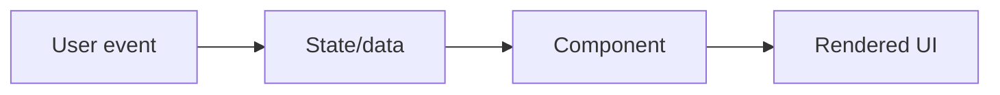

# What Is React and Why It Is Used

## Detailed explanation
React is a UI library that helps developers build screens from components instead of manually updating the DOM. A component describes what should appear for a given set of props and state. When that data changes, React runs the component again, compares the new UI description with the previous one, and updates the browser where needed.

In real projects, React is used for dashboards, SaaS apps, e-commerce flows, admin panels, mobile apps through React Native, and meta-framework apps through Next.js or Remix. Interviewers ask this concept first because it reveals whether you understand React as a state-driven rendering model, not just a syntax for writing HTML inside JavaScript.

## 1. One-line mental model
React is a JavaScript library for building user interfaces by describing UI as reusable components that update when data changes.

## 2. Problem it solves
Traditional DOM-heavy frontend code becomes difficult to maintain when many parts of the screen depend on changing state. Developers had to manually update DOM nodes, keep UI in sync with data, and reuse UI patterns without a consistent component model.

## 3. Core idea
- React lets you describe what the UI should look like for a given state.
- UI is split into reusable components.
- Data flows down through props.
- State changes trigger re-rendering.
- React updates the browser DOM through its render and reconciliation process.

## 4. Visual / analogy
React is like a spreadsheet for UI: when the data changes, the dependent cells update automatically.



## 5. Minimal example

```tsx
function Greeting({ name }: { name: string }) {
  return <h1>Hello, {name}</h1>;
}
```

## 6. Real-world example

```tsx
function DashboardPage() {
  const userQuery = useUserQuery();

  if (userQuery.isLoading) return <PageSkeleton />;
  if (userQuery.isError) return <ErrorState />;

  return <DashboardShell user={userQuery.data} />;
}
```

React helps express loading, error, and success UI as state-driven branches.

## 7. Common interview questions
- What is React?
- Why is React used?
- Is React a library or framework?
- What problem does React solve?
- How does React update the UI?
- What is a component?
- What is declarative UI?
- What is one-way data flow?

## 8. Active recall test
1. Explain React in one sentence.
2. What does React do when state changes?
3. Why are components useful?
4. What does "UI is a function of state" mean?
5. What does React not provide out of the box?

## 9. Mistakes / traps
- Saying React is a full framework like Angular. React focuses on UI; routing, data fetching, and build setup come from ecosystem tools.
- Saying React directly changes everything in the DOM on every update.
- Thinking React is only for single-page apps.
- Treating components as just HTML templates instead of state-driven UI units.

## 10. Compare with related concepts
- **React vs Angular:** React is mainly a UI library; Angular is a full framework.
- **React vs Vue:** both are component-based UI tools with different syntax and ecosystem conventions.
- **React vs DOM API:** React describes UI declaratively; DOM API updates nodes imperatively.
- **React vs Next.js:** Next.js is a React framework for routing, rendering, caching, and deployment patterns.

## 11. Summary from memory
Explain why a team would use React for a dashboard with changing data, reusable widgets, and many user interactions.

## 12. Spaced revision prompts
- After 1 day: Define React and component.
- After 3 days: Explain why React is declarative.
- After 7 days: Compare React with direct DOM manipulation.
- After 14 days: Explain what React does and does not provide.
