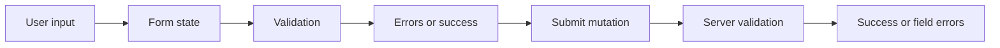

# Forms in React

## Detailed explanation
Forms in React connect user input, validation, server submission, and feedback UI. They may be controlled, uncontrolled, schema-validated, multi-step, dynamic, or powered by libraries such as React Hook Form and Formik.

Strong form architecture matters because forms are often the most business-critical frontend flows: login, checkout, onboarding, payments, profile updates, search filters, and admin workflows.

## 1. One-line mental model
A React form is a controlled conversation between user input, validation, UI feedback, and final submission.

## 2. Problem it solves
Forms collect user data, but production forms must also handle validation, errors, async checks, dirty state, touched state, file uploads, reset behavior, accessibility, and double-submit protection.

## 3. Core idea
- Controlled inputs keep values in React state; uncontrolled inputs keep values in the DOM and read them when needed.
- Validation can be field-level, form-level, schema-based, async, or server-side.
- Form libraries reduce re-renders and centralize dirty/touched/error state.
- The server remains the final authority for validation.
- Accessible forms need labels, error connections, keyboard support, and focus handling.

## 4. Visual / analogy
Think of a form like airport check-in: the passenger enters details, the system checks required fields, validates documents, shows exact issues, and only submits when the data is acceptable.



## 5. Minimal example

```tsx
function ContactForm() {
  const [email, setEmail] = React.useState("");

  function handleSubmit(event: React.FormEvent<HTMLFormElement>) {
    event.preventDefault();
    console.log({ email });
  }

  return (
    <form onSubmit={handleSubmit}>
      <label htmlFor="email">Email</label>
      <input id="email" value={email} onChange={(event) => setEmail(event.target.value)} />
      <button type="submit">Submit</button>
    </form>
  );
}
```

## 6. Real-world example

```tsx
const schema = z.object({
  email: z.string().email(),
  password: z.string().min(8),
});

type LoginValues = z.infer<typeof schema>;

function LoginForm() {
  const form = useForm<LoginValues>({
    resolver: zodResolver(schema),
    defaultValues: { email: "", password: "" },
  });

  const login = useMutation({ mutationFn: authApi.login });

  return (
    <form onSubmit={form.handleSubmit((values) => login.mutate(values))}>
      <input {...form.register("email")} aria-invalid={Boolean(form.formState.errors.email)} />
      <input type="password" {...form.register("password")} />
      <button disabled={login.isPending}>Sign in</button>
    </form>
  );
}
```

## 7. Common interview questions
- Controlled vs uncontrolled forms?
- React Hook Form vs Formik?
- What are dirty and touched states?
- What is schema validation?
- How do you handle async validation?
- How do you map server-side validation errors to fields?
- How do you prevent double submit?
- How do you optimize large forms?
- How do you handle file uploads?
- How do you make forms accessible?

## 8. Active recall test
- Why can uncontrolled inputs be faster in large forms?
- When should validation run on blur instead of on change?
- How do you focus the first invalid field?
- What should happen if server validation fails?
- How do field arrays differ from simple fields?

## 9. Mistakes / traps
- Validating only on the frontend and trusting the result.
- Showing errors before the user interacts with the field.
- Re-rendering a huge form on every keystroke.
- Forgetting `event.preventDefault()` on manual submit handlers.
- Not disabling or guarding submit while a request is pending.
- Missing labels and accessible error text.

## 10. Compare with related concepts
- **Not plain input state:** production form state includes value, dirty, touched, validation, submission, and errors.
- **Not server validation:** frontend validation improves UX; server validation enforces correctness.
- **Not only controlled components:** uncontrolled and subscription-based libraries can be better for large forms.
- **Not data fetching:** submit mutations belong to server-state flow after form validation.

## 11. Summary from memory
Explain how you would build a login form with validation, loading state, server error mapping, accessibility, and double-submit prevention.

## 12. Spaced revision prompts
- After 1 day: Define controlled and uncontrolled forms.
- After 3 days: Explain dirty, touched, and error state.
- After 7 days: Design a multi-step form with schema validation.
- After 14 days: Compare React Hook Form, Formik, and Final Form.
