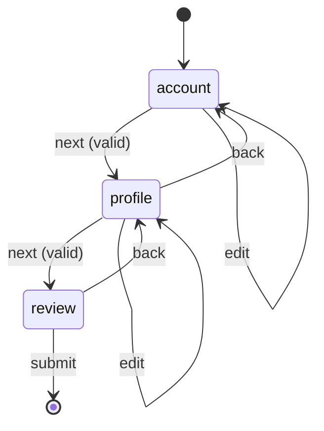
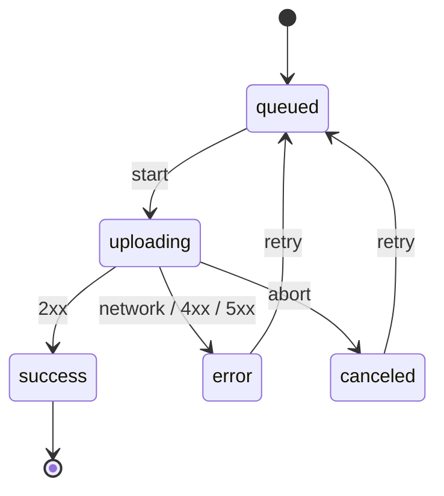

# Forms & User Input

Forms are where controlled state, validation, async work, and accessibility all meet. Every problem below repeats the same core move with higher stakes: one source of truth for values, errors derived during render, and explicit handling of async races and cleanup.

---

## Controlled Form with Validation

`Difficulty: Medium` `Probability: Very High`

### What are we building?

A form where every input is controlled by React state, validation runs on blur and on submit, errors render inline next to the field, and submission is guarded while invalid or in flight. A signup form (name, email, password) is the canonical vehicle.

### Example

```text
Name     [ Alice________________ ]
Email    [ alice@example______ ]   Enter a valid email.
Password [ •••••••• ]
                                   [ Create account ]
```

Errors appear only after the field has been blurred or the form submitted &mdash; never on the first keystroke.

### What is the interviewer testing?

- One state object for values instead of a `useState` per field
- Validation derived at render time, not stored and synced in an effect
- Touched / submitted gating so errors do not flash while typing
- Field-level accessibility wiring (`aria-invalid`, `aria-describedby`)
- Async submit with a double-submit guard

### State Design

```ts
type Values = { name: string; email: string; password: string };
type Field = keyof Values;

values: Values                          // source of truth
touched: Partial<Record<Field, boolean>> // which fields have been blurred
submitted: boolean                       // has the user tried to submit
submitting: boolean                      // request in flight (disables the button)
```

**Do NOT store:** `errors`, `isValid`, `isDirty`, or `canSubmit`. All are produced by calling a pure `validate(values)` during render. Caching them in state creates a second value that can lag behind `values`.

### Basic Version

```ts
type Values = { name: string; email: string; password: string };
type Field = keyof Values;

const labels: Record<Field, string> = {
  name: "Name",
  email: "Email",
  password: "Password",
};

const initialValues: Values = { name: "", email: "", password: "" };

function validate(values: Values): Partial<Record<Field, string>> {
  const errors: Partial<Record<Field, string>> = {};
  if (!values.name.trim()) errors.name = "Name is required.";
  if (!/^[^\s@]+@[^\s@]+\.[^\s@]+$/.test(values.email)) errors.email = "Enter a valid email.";
  if (values.password.length < 8) errors.password = "Use at least 8 characters.";
  return errors;
}

async function submitToServer(_values: Values): Promise<void> {
  await new Promise((resolve) => setTimeout(resolve, 600)); // stand-in for fetch
}

export function SignupForm() {
  const [values, setValues] = useState<Values>(initialValues);
  const [touched, setTouched] = useState<Partial<Record<Field, boolean>>>({});
  const [submitted, setSubmitted] = useState(false);
  const [submitting, setSubmitting] = useState(false);

  const errors = validate(values);                       // derived every render
  const isValid = Object.keys(errors).length === 0;

  const setField =
    (field: Field) => (e: React.ChangeEvent<HTMLInputElement>) =>
      setValues((prev) => ({ ...prev, [field]: e.target.value }));

  const blurField = (field: Field) => () =>
    setTouched((prev) => ({ ...prev, [field]: true }));

  const showError = (field: Field) => (touched[field] || submitted) && errors[field];

  const onSubmit = async (e: React.FormEvent) => {
    e.preventDefault();
    setSubmitted(true);
    if (!isValid || submitting) return;

    setSubmitting(true);
    try {
      await submitToServer(values);
      setValues(initialValues);
      setTouched({});
      setSubmitted(false);
    } finally {
      setSubmitting(false);
    }
  };

  return (
    <form onSubmit={onSubmit} noValidate>
      {(Object.keys(labels) as Field[]).map((field) => {
        const message = showError(field);
        return (
          <div key={field}>
            <label htmlFor={field}>{labels[field]}</label>
            <input
              id={field}
              name={field}
              type={field === "password" ? "password" : field === "email" ? "email" : "text"}
              value={values[field]}
              onChange={setField(field)}
              onBlur={blurField(field)}
              aria-invalid={Boolean(message)}
              aria-describedby={message ? `${field}-error` : undefined}
            />
            {message && (
              <p id={`${field}-error`} role="alert">
                {message}
              </p>
            )}
          </div>
        );
      })}

      <button type="submit" disabled={submitting}>
        {submitting ? "Creating..." : "Create account"}
      </button>
    </form>
  );
}
```

### How It Works

- `values` is the only source of truth. `errors` is recomputed from it on every render, so it can never be stale.
- `touched` and `submitted` control *visibility*, not validity. The form is invalid from the start; the user just does not see it until they interact or submit.
- `showError` returns the message only when the field is touched or the form was submitted. This is the whole "do not yell at the user while they type" behavior in one line.
- The double-submit guard (`if (submitting) return`) plus `disabled` prevents duplicate requests when the button is clicked rapidly.
- `noValidate` disables the browser's native tooltips so your error UI is the single source of truth.

### Edge Cases

- Whitespace-only name: `trim()` before validating, but do not trim the password.
- Email rules are intentionally naive; do not over-engineer a RFC-5322 regex.
- Autofill does not fire `onChange` in every browser &mdash; a blur or submit re-runs `validate`, so nothing is lost.
- IME composition: Enter can confirm a character rather than submit; check `e.nativeEvent.isComposing`.
- Server-side field errors (email already taken) must be merged into the same error map after submit; keep async errors separate from the derived synchronous ones.
- Reset the form only after a successful submit, not on failure.

### Interview Follow-ups

- **Level 1:** Validate on submit only.
- **Level 2:** Validate on blur and re-validate on change once a field is touched (the version above).
- **Level 3:** Add a password strength meter derived from `values.password` (never store the score).
- **Level 4:** Debounced async username availability check. Use `AbortController` and ignore results whose request is no longer current.
- **Level 5:** Field-level validators from a config map so the same engine drives several forms.
- **Level 6:** Extract a generic `useForm({ initialValues, validate, onSubmit })` hook returning `{ values, errors, touched, setField, blurField, handleSubmit }`.
- **Level 7:** Add cross-field validation (confirm password, end date after start date) without a sync effect.

### Production Version

At real scale, a form library (React Hook Form) plus a schema validator (Zod) removes the boilerplate and gives uncontrolled-input performance. Say that in the interview, but the requirement is still to explain derivation, touched state, and async error merging &mdash; those are the library's actual value.

### Accessibility

- Every input has a real `<label htmlFor>`; placeholder text is not a label.
- `aria-invalid` plus `aria-describedby` pointing at the error element ties the message to the field.
- `role="alert"` announces the message when it appears; a `polite` live region is the alternative if `alert` is too aggressive.
- Keep the submit button visible and disabled rather than removing it, so keyboard users can find it.

### Performance

For a handful of fields this is free. For 50+ fields, controlled inputs become the bottleneck: each keystroke re-renders the whole form. The fixes are uncontrolled inputs with `defaultValue` and refs, or splitting each field into its own component, or React Hook Form's subscription model. Do not reach for `useMemo` on `validate` until the form is large.

### Testing

```text
✓ submit with empty fields shows all errors
✓ typing does not show an error until blur or submit
✓ a valid form calls the submit handler once
✓ the submit button is disabled while submitting
✓ blurring an empty name shows "Name is required."
✓ server error is displayed next to the right field
```

### Common Mistakes

- Storing `errors` in state and syncing it in an effect (`setErrors(validate(values))`), which gives a render of stale errors and can loop.
- A `useState` per field, making reset and submit cumbersome.
- Disabling the submit button before the user has tried, so they cannot discover why.
- Using `onChange` for validation and showing "invalid email" at `a`.
- Trimming the password value.
- Forgetting `noValidate` and fighting native validation bubbles.

### Interview Takeaway

Values are state; errors and validity are derived. Track *touched* separately from *valid*, and keep async errors distinct from synchronous ones. That single split makes every form in this chapter tractable.

---

## Login / Signup Form

`Difficulty: Medium` `Probability: High`

### What are we building?

A credential form that toggles between sign in and sign up, reveals the password on demand, supports "remember me", blocks double submits, and shows a form-level error when the server rejects the credentials. It adds the pieces a plain validated form does not have: secrets, mode switching, and server errors.

### Example

```text
Email     [ alice@example.com ]
Password  [ •••••••• ] [ Show ]
Remember me  (x)
                              [ Sign in ]

Email or password is incorrect.
```

### What is the interviewer testing?

- Mode switching that resets the right fields and keeps the rest
- Show/hide password without losing cursor or value
- Form-level vs field-level errors
- `pending` guard and `autocomplete` hints for password managers
- Deriving `passwordsMatch` and `canSubmit` instead of storing them

### State Design

```ts
type Mode = "login" | "signup";
type Values = { email: string; password: string; confirm: string };

mode: Mode                 // which form is shown
values: Values             // source of truth for all three inputs
showPassword: boolean      // UI-only toggle
pending: boolean           // request in flight
formError: string | null    // server/auth error, not field validation
```

**Do NOT store:** `passwordsMatch`, `canSubmit`, or `isSignup`. They are derived from `mode` and `values`. Also do not store the confirmed password in a second variable "just for signup" &mdash; one object keeps reset and switch simple.

### Basic Version

```ts
type Mode = "login" | "signup";

type Values = { email: string; password: string; confirm: string };

const emptyValues: Values = { email: "", password: "", confirm: "" };

export function AuthForm({
  onLogin,
  onSignup,
}: {
  onLogin: (email: string, password: string) => Promise<void>;
  onSignup: (email: string, password: string) => Promise<void>;
}) {
  const [mode, setMode] = useState<Mode>("login");
  const [values, setValues] = useState<Values>(emptyValues);
  const [showPassword, setShowPassword] = useState(false);
  const [pending, setPending] = useState(false);
  const [formError, setFormError] = useState<string | null>(null);

  const isSignup = mode === "signup";
  const passwordsMatch = !isSignup || values.confirm === values.password;
  const canSubmit =
    values.email.trim() !== "" && values.password !== "" && passwordsMatch && !pending;

  const setField =
    (field: keyof Values) => (e: React.ChangeEvent<HTMLInputElement>) =>
      setValues((prev) => ({ ...prev, [field]: e.target.value }));

  const switchMode = () => {
    setMode((m) => (m === "login" ? "signup" : "login"));
    setValues((prev) => ({ ...prev, password: "", confirm: "" })); // keep email
    setFormError(null);
    setShowPassword(false);
  };

  const onSubmit = async (e: React.FormEvent) => {
    e.preventDefault();
    if (!canSubmit) return;

    setPending(true);
    setFormError(null);
    try {
      if (isSignup) await onSignup(values.email.trim(), values.password);
      else await onLogin(values.email.trim(), values.password);
    } catch (err) {
      setFormError(err instanceof Error ? err.message : "Something went wrong.");
    } finally {
      setPending(false);
    }
  };

  return (
    <form onSubmit={onSubmit} noValidate>
      <h1>{isSignup ? "Create account" : "Sign in"}</h1>

      <label htmlFor="email">Email</label>
      <input
        id="email"
        name="email"
        type="email"
        autoComplete="email"
        value={values.email}
        onChange={setField("email")}
      />

      <label htmlFor="password">Password</label>
      <div>
        <input
          id="password"
          name="password"
          type={showPassword ? "text" : "password"}
          autoComplete={isSignup ? "new-password" : "current-password"}
          value={values.password}
          onChange={setField("password")}
        />
        <button
          type="button"
          onClick={() => setShowPassword((v) => !v)}
          aria-pressed={showPassword}
          aria-label={showPassword ? "Hide password" : "Show password"}
        >
          {showPassword ? "Hide" : "Show"}
        </button>
      </div>

      {isSignup && (
        <>
          <label htmlFor="confirm">Confirm password</label>
          <input
            id="confirm"
            name="confirm"
            type={showPassword ? "text" : "password"}
            autoComplete="new-password"
            value={values.confirm}
            onChange={setField("confirm")}
            aria-invalid={!passwordsMatch}
            aria-describedby={!passwordsMatch ? "confirm-error" : undefined}
          />
          {!passwordsMatch && (
            <p id="confirm-error" role="alert">
              Passwords do not match.
            </p>
          )}
        </>
      )}

      {!isSignup && (
        <label>
          <input type="checkbox" name="remember" /> Remember me
        </label>
      )}

      {formError && <p role="alert">{formError}</p>}

      <button type="submit" disabled={!canSubmit}>
        {pending ? "Please wait..." : isSignup ? "Create account" : "Sign in"}
      </button>

      <button type="button" onClick={switchMode}>
        {isSignup ? "Have an account? Sign in" : "Need an account? Sign up"}
      </button>
    </form>
  );
}
```

### How It Works

- `mode` drives which fields render, and `switchMode` clears only the secret fields while keeping the email. That avoids retyping the identifier on a failed signup.
- The password toggle is a `type="button"` so it does not submit the form. It only flips `type` between `password` and `text`; the value and focus are untouched.
- `passwordsMatch` is a comparison, not state. Storing a `match` boolean means two values can disagree after an edit.
- `formError` is separate from field validation because it comes from the server and must survive until the next submit attempt.
- `canSubmit` folds in `!pending`, so the button is disabled during the request and re-enabled in `finally` even if the call throws.

### Edge Cases

- Autofill: password managers fill and submit the same tick; read values from the form on submit if you support that flow.
- Caps Lock is on: surface a hint via `getModifierState("CapsLock")` on key events.
- 401 vs 500: show "incorrect email or password" for auth failures and a retry message for server failures.
- Password managers expect `autocomplete="current-password"` for login and `"new-password"` for signup; wrong hints break saving.
- Rapid double Enter: `pending` short-circuits the second submit.
- Confirm field visible while `showPassword` toggles: both inputs should switch together.
- Unmount mid-request: ignore the response; for auth, prefer aborting the request.

### Interview Follow-ups

- **Level 1:** Login only, with pending and a server error.
- **Level 2:** Add the show/hide password toggle.
- **Level 3:** Add signup mode with confirm-password matching (the version above).
- **Level 4:** Add a derived password strength meter and a checklist (length, number, symbol).
- **Level 5:** Show per-field server errors (email already registered) mapped back to the inputs.
- **Level 6:** Add rate-limit feedback after repeated failures, with a cooldown timer that cleans up on unmount.
- **Level 7:** Mock token storage and redirect, keeping credentials out of `localStorage`.

### Production Version

Real apps rely on an auth provider and secure, `HttpOnly` cookies; never store tokens in `localStorage`. On the form side, React Hook Form plus a Zod schema covers the same state with less code, and its `formState.isSubmitting` replaces the manual `pending` flag. The interview answer still needs the manual pending/error discipline.

### Accessibility

- Use `autocomplete` hints so password managers and assistive tech work correctly.
- The toggle needs `aria-pressed` and a name that describes the current state ("Hide password").
- `role="alert"` on the form error ensures it is announced without moving focus.
- Mark the confirm field `aria-invalid` and link the mismatch message with `aria-describedby`.

### Performance

Negligible. The only cost is re-rendering the whole form per keystroke; split into field components only if the form grows.

### Testing

```text
✓ typing updates the email and password inputs
✓ the Show button reveals the password without clearing it
✓ switching to signup shows the confirm field and keeps the email
✓ mismatched passwords disable submit and show an error
✓ a rejected login shows the server message
✓ the submit button is disabled while pending and re-enabled after
```

### Common Mistakes

- Storing `showPassword`, `pending`, and `formError` inside the `values` object.
- Clearing the email when switching modes, forcing a retype.
- Using an `onChange` handler that rebuilds the whole values object with stale fields (`{ email, password, confirm }` captured earlier).
- Swallowing the server error and leaving the button disabled with no feedback.
- Putting `autocomplete="off"` on password fields, which breaks password managers.
- Storing the auth token in `localStorage`.

### Interview Takeaway

Separate what the user typed (`values`) from how the request is going (`pending`, `formError`) from how it is revealed (`showPassword`, `mode`). Derive the match and submit rules. That separation is what makes the extra features cheap to add.

---

## Multi-Step Form / Wizard

`Difficulty: Hard` `Probability: Very High`

### What are we building?

A wizard that collects data across several steps (account &rarr; profile &rarr; review), validates each step before advancing, preserves everything when the user goes back, and submits once at the end. The trap is treating each step as an independent form and losing data on unmount.

### Example

```text
(1 Account) — (2 Profile) — (3 Review)

Email    [ alice@example.com ]
Password [ •••••••• ]

                        [ Back ]   [ Next ]
```

### What is the interviewer testing?

- Lifting all field state into the parent so step components can unmount freely
- Per-step validation without storing per-step validity
- Back/next navigation and progress indicators
- Conditional steps and the review step
- Focus management and announcements on step change

### State Design

```ts
type FormData = {
  email: string;
  password: string;
  fullName: string;
  bio: string;
  plan: "free" | "pro";
};

stepIndex: number          // which step is visible
data: FormData             // ALL field values live here, one object
submitted: boolean         // reveal errors for the current step
submitting: boolean        // final request in flight
```

**Do NOT store:** `canGoNext`, `currentStepErrors`, `isLastStep`, or a per-step copy of `data`. `canGoNext` comes from `validateStep(step, data)`; `isLastStep` is `stepIndex === STEPS.length - 1`. Do not store a `completed: Set<number>` unless you need it for a progress bar &mdash; even then, derive it from `data`.

The step transitions form a small state machine:



### Basic Version

```ts
const STEPS = ["account", "profile", "review"] as const;
type StepId = (typeof STEPS)[number];

type FormData = {
  email: string;
  password: string;
  fullName: string;
  bio: string;
  plan: "free" | "pro";
};

const initialData: FormData = {
  email: "",
  password: "",
  fullName: "",
  bio: "",
  plan: "free",
};

function validateStep(step: StepId, data: FormData): Partial<Record<keyof FormData, string>> {
  const errors: Partial<Record<keyof FormData, string>> = {};
  if (step === "account") {
    if (!/^[^\s@]+@[^\s@]+\.[^\s@]+$/.test(data.email)) errors.email = "Enter a valid email.";
    if (data.password.length < 8) errors.password = "Use at least 8 characters.";
  }
  if (step === "profile" && !data.fullName.trim()) errors.fullName = "Full name is required.";
  return errors;
}

export function Wizard({ onSubmit }: { onSubmit: (data: FormData) => Promise<void> }) {
  const [stepIndex, setStepIndex] = useState(0);
  const [data, setData] = useState<FormData>(initialData);
  const [submitted, setSubmitted] = useState(false);
  const [submitting, setSubmitting] = useState(false);
  const headingRef = useRef<HTMLHeadingElement>(null);

  const step = STEPS[stepIndex];
  const errors = validateStep(step, data);
  const isValid = Object.keys(errors).length === 0;
  const isLast = stepIndex === STEPS.length - 1;

  const update = <K extends keyof FormData,>(key: K, value: FormData[K]) =>
    setData((prev) => ({ ...prev, [key]: value }));

  // move focus to the step heading when the step changes
  useEffect(() => {
    headingRef.current?.focus();
  }, [stepIndex]);

  const next = () => {
    setSubmitted(true);
    if (!isValid) return;
    setSubmitted(false);
    setStepIndex((i) => Math.min(i + 1, STEPS.length - 1));
  };

  const back = () => {
    setSubmitted(false);
    setStepIndex((i) => Math.max(i - 1, 0));
  };

  const submit = async () => {
    setSubmitted(true);
    if (!isValid || submitting) return;
    setSubmitting(true);
    try {
      await onSubmit(data);
    } finally {
      setSubmitting(false);
    }
  };

  const show = (field: keyof FormData) => (submitted ? errors[field] : undefined);

  return (
    <section>
      <ol aria-label="Progress">
        {STEPS.map((id, i) => (
          <li key={id} aria-current={i === stepIndex ? "step" : undefined}>
            {i + 1}. {id}
          </li>
        ))}
      </ol>

      <h2 ref={headingRef} tabIndex={-1}>
        {step}
      </h2>

      {step === "account" && (
        <>
          <label htmlFor="email">Email</label>
          <input id="email" value={data.email} onChange={(e) => update("email", e.target.value)} />
          {show("email") && <p role="alert">{errors.email}</p>}

          <label htmlFor="password">Password</label>
          <input
            id="password"
            type="password"
            value={data.password}
            onChange={(e) => update("password", e.target.value)}
          />
          {show("password") && <p role="alert">{errors.password}</p>}
        </>
      )}

      {step === "profile" && (
        <>
          <label htmlFor="fullName">Full name</label>
          <input
            id="fullName"
            value={data.fullName}
            onChange={(e) => update("fullName", e.target.value)}
          />
          {show("fullName") && <p role="alert">{errors.fullName}</p>}

          <label htmlFor="plan">Plan</label>
          <select
            id="plan"
            value={data.plan}
            onChange={(e) => update("plan", e.target.value as FormData["plan"])}
          >
            <option value="free">Free</option>
            <option value="pro">Pro</option>
          </select>
        </>
      )}

      {step === "review" && (
        <dl>
          <dt>Email</dt>
          <dd>{data.email}</dd>
          <dt>Name</dt>
          <dd>{data.fullName || "\u2014"}</dd>
          <dt>Plan</dt>
          <dd>{data.plan}</dd>
        </dl>
      )}

      <div>
        <button type="button" onClick={back} disabled={stepIndex === 0}>
          Back
        </button>
        {isLast ? (
          <button type="button" onClick={submit} disabled={submitting}>
            {submitting ? "Submitting..." : "Submit"}
          </button>
        ) : (
          <button type="button" onClick={next}>
            Next
          </button>
        )}
      </div>
    </section>
  );
}
```

### How It Works

- All field values live in the parent's `data`. A step component can unmount on "Next" without losing anything, because it never owned the values.
- `update` uses a functional spread, so editing the second field cannot overwrite the first with a stale snapshot.
- Validation is a pure function of `(step, data)`. `isValid` and the error messages are recomputed each render, so they are correct after a "Back" edit.
- `submitted` is scoped to the current step and reset on navigation, so errors show only when the user tries to advance.
- The focus effect depends on `stepIndex`, so the heading receives focus once per step, which is what screen-reader users expect from a wizard.

### Edge Cases

- Editing a step after reaching review: because validation is derived, "Next" on account re-validates the edited email.
- Conditional steps: if a step is skipped, a direct "Back" or "Next" index can land on a hidden step. Clamp against the filtered step list, not a fixed length.
- Browser back button does not move wizard steps. Either accept it, push history entries, or warn before leaving.
- Draft persistence: save `data` and `stepIndex` to `localStorage` on change, and restore with a lazy initializer.
- Async submit failure: keep the user on review and show an error; do not reset `data`.
- Validation of fields belonging to other steps (cross-step rules) should run at submit, not per step.
- Empty `data` after a failed parse of restored JSON: guard the lazy initializer.

### Interview Follow-ups

- **Level 1:** Two steps with Back/Next and a progress bar.
- **Level 2:** Per-step validation before advancing (the version above).
- **Level 3:** Preserve data across Back/Forward and focus the step heading on change.
- **Level 4:** Add a conditional step (e.g., "Company" only for the `pro` plan) with clamping navigation.
- **Level 5:** Add localStorage draft persistence with reset on successful submit.
- **Level 6:** Add a review step that links back to a specific step to edit.
- **Level 7:** Extract a generic `<Wizard steps={...} onComplete={...} />` where each step is a config with `validate` and `render`.
- **Level 8:** Make the async submit cancelable and guard against duplicate submissions across step changes.

### Production Version

Wizard logic is a great fit for `useReducer` once there are more than three actions (`NEXT`, `BACK`, `SET_FIELD`, `RESET`), because the transitions become explicit and testable. For persistence, store drafts as a serialized object; TanStack Query can own the final submit mutation. A form library helps for the field rendering, but the step machine is still yours.

### Accessibility

- Mark the current step with `aria-current="step"` and give the list an accessible name.
- On step change, move focus to the step heading (with `tabIndex={-1}`) and keep the heading order correct.
- Announce errors with `role="alert"`; do not move focus to an error automatically unless the step is entirely invalid.
- Use real `<button type="button">` for navigation so Enter inside a field does not accidentally submit the wizard.

### Performance

Each keystroke re-renders the parent and the active step, which is fine. If a step is expensive, extract it with `React.memo` and pass stable `onChange` callbacks. Do not keep every step mounted and hidden with CSS just to avoid re-rendering &mdash; that hurts focus order and initial cost.

### Testing

```text
✓ advancing with an invalid step shows errors and stays put
✓ going back preserves previously entered values
✓ a valid account step advances to profile
✓ the review step shows the collected values
✓ submitting calls onSubmit once with the full data
✓ the final submit button is disabled while submitting
```

### Common Mistakes

- Keeping each step's values in the step component, so Back/Next wipes them.
- Storing `canGoNext` in state and forgetting to recompute after a back-edit.
- Using a single `isValid` across all fields and blocking "Next" because a later step is incomplete.
- Rendering all steps as one giant form and relying on hidden fields; validation and focus get confused.
- Resetting `data` on a failed submit.
- Not guarding against double submit on the last step.
- Forgetting `type="button"` on Back/Next, causing an implicit submit.

### Interview Takeaway

A wizard is one form with a visible subset. Keep all data in the parent, derive per-step validity, and let step components be disposable views. Navigation is just an index into a list of steps.

---

## Dynamic Form from Configuration

`Difficulty: Medium` `Probability: High`

### What are we building?

A form whose fields are described by a config array (text, email, number, select, checkbox) and rendered by a generic renderer, with one values object keyed by field name.

### Example

```text
Full name   [________________]
Email       [________________]
Plan        [ Professional  v ]
Newsletter  [x] Subscribe
                        [ Submit ]
```

The same component renders a completely different form when handed a different config array.

### What is the interviewer testing?

- Rendering from data instead of hard-coded JSX
- A discriminated union for field configs with exhaustive `switch`
- Storing values in a keyed record, not one state per field
- Deriving defaults and errors from the config
- Stable keys by field name

### State Design

```ts
type FieldConfig =
  | { type: "text" | "email" | "password"; name: string; label: string; required?: boolean }
  | { type: "number"; name: string; label: string; min?: number; max?: number }
  | { type: "select"; name: string; label: string; options: { value: string; label: string }[] }
  | { type: "checkbox"; name: string; label: string };

type FormValues = Record<string, string | number | boolean>;

values: FormValues                    // one entry per field name
touched: Record<string, boolean>       // per field
submitted: boolean
```

**Do NOT store:** the rendered field elements, a per-field error object, or a copy of the config. Defaults and errors are functions of the config and `values`, computed during render.

### Basic Version

```ts
type FieldConfig =
  | { type: "text" | "email" | "password"; name: string; label: string; required?: boolean }
  | { type: "number"; name: string; label: string; min?: number; max?: number }
  | { type: "select"; name: string; label: string; options: { value: string; label: string }[] }
  | { type: "checkbox"; name: string; label: string };

type FormValues = Record<string, string | number | boolean>;

function initialValues(fields: FieldConfig[]): FormValues {
  return Object.fromEntries(
    fields.map((field) => [field.name, field.type === "checkbox" ? false : ""]),
  );
}

function validateFields(fields: FieldConfig[], values: FormValues): Record<string, string> {
  const errors: Record<string, string> = {};
  for (const field of fields) {
    if (field.type === "checkbox") continue;
    const value = values[field.name];
    if (field.type === "number") {
      const num = Number(value);
      if (value !== "" && Number.isNaN(num)) errors[field.name] = "Enter a number.";
      else if (field.min !== undefined && num < field.min) errors[field.name] = `Min ${field.min}.`;
      else if (field.max !== undefined && num > field.max) errors[field.name] = `Max ${field.max}.`;
    } else if (field.required && String(value).trim() === "") {
      errors[field.name] = `${field.label} is required.`;
    }
  }
  return errors;
}

function Field({
  config,
  value,
  error,
  onChange,
}: {
  config: FieldConfig;
  value: string | number | boolean;
  error?: string;
  onChange: (name: string, value: string | number | boolean) => void;
}) {
  const id = `field-${config.name}`;
  const describedBy = error ? `${id}-error` : undefined;

  const control = (() => {
    switch (config.type) {
      case "checkbox":
        return (
          <input
            id={id}
            type="checkbox"
            checked={Boolean(value)}
            onChange={(e) => onChange(config.name, e.target.checked)}
          />
        );
      case "select":
        return (
          <select
            id={id}
            value={String(value)}
            onChange={(e) => onChange(config.name, e.target.value)}
          >
            <option value="">Choose...</option>
            {config.options.map((option) => (
              <option key={option.value} value={option.value}>
                {option.label}
              </option>
            ))}
          </select>
        );
      case "number":
        return (
          <input
            id={id}
            type="number"
            min={config.min}
            max={config.max}
            value={String(value)}
            onChange={(e) => onChange(config.name, e.target.value)}
            aria-invalid={Boolean(error)}
            aria-describedby={describedBy}
          />
        );
      default:
        return (
          <input
            id={id}
            type={config.type}
            value={String(value)}
            onChange={(e) => onChange(config.name, e.target.value)}
            aria-invalid={Boolean(error)}
            aria-describedby={describedBy}
          />
        );
    }
  })();

  return (
    <div>
      <label htmlFor={id}>{config.label}</label>
      {control}
      {error && (
        <p id={`${id}-error`} role="alert">
          {error}
        </p>
      )}
    </div>
  );
}

export function DynamicForm({
  fields,
  onSubmit,
}: {
  fields: FieldConfig[];
  onSubmit: (values: FormValues) => void;
}) {
  const [values, setValues] = useState<FormValues>(() => initialValues(fields));
  const [touched, setTouched] = useState<Record<string, boolean>>({});
  const [submitted, setSubmitted] = useState(false);

  const errors = validateFields(fields, values);
  const isValid = Object.keys(errors).length === 0;

  const change = (name: string, value: string | number | boolean) =>
    setValues((prev) => ({ ...prev, [name]: value }));

  const markTouched = (name: string) => setTouched((prev) => ({ ...prev, [name]: true }));

  return (
    <form
      onSubmit={(e) => {
        e.preventDefault();
        setSubmitted(true);
        if (isValid) onSubmit(values);
      }}
      noValidate
    >
      {fields.map((field) => (
        <div key={field.name} onBlur={() => markTouched(field.name)}>
          <Field
            config={field}
            value={values[field.name]}
            error={touched[field.name] || submitted ? errors[field.name] : undefined}
            onChange={change}
          />
        </div>
      ))}
      <button type="submit">Submit</button>
    </form>
  );
}
```

### How It Works

- The `FieldConfig` union plus a `switch` on `config.type` gives TypeScript exact narrowing: inside `case "select"`, `config.options` exists. Adding a field type is a compile error until handled.
- Values live in one `Record<string, ...>` keyed by `name`. The renderer never needs a state variable per field.
- `initialValues` and `validateFields` are pure functions of the config, so defaults and errors cannot drift.
- `key={field.name}` keeps each field's identity stable when the array order changes.
- The `checkbox` case is skipped by validation but still rendered, which keeps the union honest.

### Edge Cases

- Duplicate `name`s: derive from config once and warn or throw in development.
- Number inputs report `""` when cleared, so `Number("")` is `0`; check `value !== ""` before coercing.
- Conditional fields (`showIf`): when a field becomes hidden, decide whether to keep or clear its value; keeping is safer for back-edits, clearing avoids submitting stale data.
- Schema changes at runtime: `useState` initializes once, so key the form with a schema id or reset explicitly.
- Unknown field type should render a safe fallback, not crash.
- Checkbox values are booleans, not strings; the change signature must allow all three primitives.

### Interview Follow-ups

- **Level 1:** Render text and number fields from config (the version above).
- **Level 2:** Add select and checkbox and make the switch exhaustive.
- **Level 3:** Add `showIf` for conditional visibility, derived from current values.
- **Level 4:** Add grouped sections and a grid layout described in the config.
- **Level 5:** Add a field-type registry (`{ [type]: Component }`) so apps can register custom fields.
- **Level 6:** Add repeatable groups (an array of sub-forms) with add/remove and stable ids.
- **Level 7:** Drive the whole form from a JSON schema returned by the server, with a safe allow-list of types.

### Production Version

This is the core of most form builders. The production version separates the schema (serializable), the registry (component per type), and the runtime (values, errors). React Hook Form accepts dynamic `register(name)`, and Zod schemas can be generated from the same config, but the derived-values discipline stays the same.

### Accessibility

- Generate `id` from the field name and wire `htmlFor`/`aria-describedby` consistently.
- Group related fields with `<fieldset>`/`<legend>` from the config's section metadata.
- Do not rely on the visual order alone; ensure the DOM order matches the reading order.
- Error elements need stable ids so `aria-describedby` resolves.

### Performance

The generic renderer re-renders every field on any change. For large schemas, memoize `Field` and pass a stable `onChange` via `useCallback`, or store values in a ref-backed subscription. Do not rebuild the config array inside render; hoist it or memoize it.

### Testing

```text
✓ renders one input per config field with the right labels
✓ changing a text field updates values by name
✓ number min/max produces an error
✓ required fields block submit
✓ the select renders all options
✓ submit passes the complete values object
```

### Common Mistakes

- A `useState` per field, which makes the form impossible to reset generically.
- Switching on `config.type` without a default, so a new type crashes at runtime.
- Using the array index as key when fields can reorder.
- Treating all values as strings and breaking checkboxes.
- Recomputing `initialValues(fields)` on every render and resetting edits.
- Forgetting that hidden fields keep their values and get submitted.

### Interview Takeaway

Config-driven UI is a discriminated union plus a generic renderer plus a keyed value store. The config is data; the renderer is the only code that knows about input types. That separation is the reusable pattern behind every form builder.

---

## Dependent Form Fields

`Difficulty: Medium` `Probability: High`

### What are we building?

A cascading form where each field depends on its parent: country &rarr; state &rarr; city. Changing a parent clears its descendants, and some options load asynchronously. The interview pressure is in clearing downstream values and handling out-of-order async responses.

### Example

```text
Country [ United States   v ]
State   [ California      v ]
City    [ Loading...        ]
```

### What is the interviewer testing?

- Options derived from the parent selection, not stored redundantly
- Clearing descendants inside the change handler, not in an effect
- Async option fetching with `AbortController` and stale-response handling
- Loading and error states for dependent data
- Prefilled edit mode without wiping values

### State Design

```ts
type Option = { value: string; label: string };

country: string          // selection
state: string            // selection
city: string             // selection
cities: Option[]         // loaded data for the current (country, state)
loadingCities: boolean   // request in flight
citiesError: string | null
```

**Do NOT store:** the states list (derive it synchronously from `country`), `hasCityOptions` (derive from `cities.length`), or a flag for whether the city field is enabled (derive from `Boolean(state)`). Also do not keep the previously loaded cities around when the parent changes &mdash; that is how a stale list stays visible.

### Basic Version

**Synchronous cascade**

```ts
type Option = { value: string; label: string };

const STATES_BY_COUNTRY: Record<string, Option[]> = {
  US: [
    { value: "CA", label: "California" },
    { value: "NY", label: "New York" },
  ],
  IN: [
    { value: "MH", label: "Maharashtra" },
    { value: "KA", label: "Karnataka" },
  ],
};

export function AddressForm() {
  const [country, setCountry] = useState("");
  const [state, setState] = useState("");
  const [city, setCity] = useState("");

  const states = STATES_BY_COUNTRY[country] ?? [];

  const selectCountry = (next: string) => {
    setCountry(next);
    setState("");   // clear descendants in the same handler
    setCity("");
  };

  const selectState = (next: string) => {
    setState(next);
    setCity("");
  };

  return (
    <form>
      <label htmlFor="country">Country</label>
      <select id="country" value={country} onChange={(e) => selectCountry(e.target.value)}>
        <option value="">Choose...</option>
        <option value="US">United States</option>
        <option value="IN">India</option>
      </select>

      <label htmlFor="state">State</label>
      <select
        id="state"
        value={state}
        onChange={(e) => selectState(e.target.value)}
        disabled={!country}
      >
        <option value="">Choose...</option>
        {states.map((option) => (
          <option key={option.value} value={option.value}>
            {option.label}
          </option>
        ))}
      </select>

      <label htmlFor="city">City</label>
      <select
        id="city"
        value={city}
        onChange={(e) => setCity(e.target.value)}
        disabled={!state}
      >
        <option value="">Choose...</option>
      </select>
    </form>
  );
}
```

**Async cities with cancellation**

```ts
async function fetchCities(
  country: string,
  state: string,
  signal: AbortSignal,
): Promise<Option[]> {
  const response = await fetch(`/api/cities?country=${country}&state=${state}`, { signal });
  if (!response.ok) throw new Error("Failed to load cities");
  return (await response.json()) as Option[];
}

export function AddressFormAsync() {
  const [country, setCountry] = useState("");
  const [state, setState] = useState("");
  const [city, setCity] = useState("");
  const [cities, setCities] = useState<Option[]>([]);
  const [loadingCities, setLoadingCities] = useState(false);
  const [citiesError, setCitiesError] = useState<string | null>(null);

  const states = STATES_BY_COUNTRY[country] ?? [];

  const selectCountry = (next: string) => {
    setCountry(next);
    setState("");
    setCity("");
    setCities([]);
  };

  const selectState = (next: string) => {
    setState(next);
    setCity("");
    setCities([]);
  };

  useEffect(() => {
    if (!country || !state) {
      setCities([]);
      return;
    }

    const controller = new AbortController();
    setLoadingCities(true);
    setCitiesError(null);

    fetchCities(country, state, controller.signal)
      .then((options) => setCities(options))
      .catch((error: unknown) => {
        if (error instanceof DOMException && error.name === "AbortError") return;
        setCitiesError("Could not load cities.");
      })
      .finally(() => {
        if (!controller.signal.aborted) setLoadingCities(false);
      });

    return () => controller.abort();
  }, [country, state]);

  const selectCity = (next: string) => setCity(next);

  return (
    <form>
      {/* country and state selects as above, with selectCountry/selectState */}

      <label htmlFor="city">City</label>
      <select
        id="city"
        value={city}
        onChange={(e) => selectCity(e.target.value)}
        disabled={!state || loadingCities}
        aria-busy={loadingCities}
      >
        <option value="">{loadingCities ? "Loading..." : "Choose..."}</option>
        {cities.map((option) => (
          <option key={option.value} value={option.value}>
            {option.label}
          </option>
        ))}
      </select>

      <p role="status" aria-live="polite">
        {loadingCities ? "Loading cities..." : ""}
      </p>
      {citiesError && <p role="alert">{citiesError}</p>}
    </form>
  );
}
```

### How It Works

- `states` is derived from `country` on every render. There is no second copy to keep in sync.
- The parent's change handler clears the children immediately. This is an *event*, not a render side effect, so an effect is not needed and `setState` loops are impossible.
- `disabled={!country}` encodes the dependency in the DOM; the browser prevents interaction before the parent is chosen.
- Because clearing happens with the parent update, React never paints an invalid combination like `US` with a `Maharashtra` state.
- The fetch effect depends on `[country, state]`. When either changes, React runs the cleanup first, which aborts the previous request. A slow response for the old state can never overwrite the new state's list.
- `controller.signal.aborted` guards `setLoadingCities(false)` in `finally`, so an aborted request does not leave the spinner stuck on.
- Clearing `cities` in `selectState` (an event) avoids rendering the old list for a frame under the new state label.
- The loading and error states are real async state and therefore belong in `useState`; the *options* are also async data, but the derived `states` list stays derived because it is synchronous.

### Edge Cases

- Fast switching between states: abort plus a per-run `AbortController` handles it; a boolean "isCurrent" flag alone is not enough because `setState` after unmount is still wasteful.
- Prefilled edit mode: if the form loads with a saved `cities` list, the effect runs on mount and refetches anyway. Seed a cache or skip the fetch when the current `(country, state)` already matches the loaded data.
- Empty result: show "No cities found" rather than an empty select.
- Error with retry: keep the request parameters in state so a retry can reuse them, or add a `nonce` state that the effect depends on.
- Unmount mid-request: the cleanup aborts; no warning and no leaked request.
- Value drifting from its parent (e.g., restored from storage): validate that `state` belongs to `country` when hydrating.
- Four-level chains multiply the effect count; consider one effect per level or a single cache keyed by path.

### Interview Follow-ups

- **Level 1:** Two synchronized selects with synchronous options (the first version).
- **Level 2:** Clear descendants when a parent changes (both versions).
- **Level 3:** Load the third level asynchronously with a loading state.
- **Level 4:** Cancel in-flight requests and ignore stale responses (the second version).
- **Level 5:** Add an error state and a retry button.
- **Level 6:** Support edit mode without clearing preloaded descendants.
- **Level 7:** Debounce the fetch for a free-text dependent field (e.g., city search) and reuse one `useDependentOptions` hook.
- **Level 8:** Generalize to an arbitrary cascade with a single keyed cache and a request-id guard.

### Production Version

In a real app the option lists are server state: cache them per `(parent)`, dedupe inflight requests, and let TanStack Query key on the path (`["cities", country, state]`). Its `enabled` option replaces the `if (!state) return` guard, and it handles cancellation on key change. The manual version above is the mental model behind that.

### Accessibility

- `disabled` communicates the dependency; pair it with `aria-busy` while loading.
- Announce loading and errors via `role="status"`/`role="alert"`.
- Give each select a real label; dependent selects should still have their own label, not an asterisk.
- When a parent change clears the child, move focus to the child only if the user explicitly triggered it; otherwise leave focus on the parent.

### Performance

Options lists are usually small. Memoize the derived `states` if the list is large, and avoid refetching when the parent selection did not actually change. Do not debounce a `<select>` change; there is no reason to wait.

### Testing

```text
✓ choosing a country enables the state select
✓ changing the country clears state and city
✓ choosing a state clears the city
✓ cities load and populate the third select
✓ rapidly changing state only shows the final list
✓ a failed city request shows an error and does not crash
```

### Common Mistakes

- Syncing a parent change to children in a `useEffect`, which causes an extra render and can loop.
- Storing the derived states list in state.
- Not aborting the previous request, so the older response wins the race.
- Leaving the city value set after the state changes.
- Using `useEffect` to clear a value that should be cleared in the change handler.
- Forgetting that `fetch` rejects with an `AbortError`, which must not be shown as a user-facing error.

### Interview Takeaway

Dependents are derived options plus event-driven clearing plus cancelable async. Clear children in the handler that changes the parent, derive what you can, and abort what you cannot derive.

---

## OTP / Verification Code Input

`Difficulty: Medium` `Probability: High`

### What are we building?

A fixed set of single-character boxes (usually six) that accept a one-time code: typing advances, backspace retreats, pasting distributes the digits, and the form auto-submits when complete.

### Example

```text
[1] [2] [3] [4] [ ] [ ]     Verify
```

Pasting `123456` fills every box and submits once.

### What is the interviewer testing?

- A ref array for focus management instead of state
- Controlled single-character inputs and numeric filtering
- Paste, backspace, and arrow-key semantics
- Auto-submit exactly once when the code completes
- Timer cleanup for a resend cooldown

### State Design

```ts
digits: string[]     // length N, "" for empty boxes; the source of truth
```

**Do NOT store:** `activeIndex` or per-box focus (use refs), the joined `code` (derive with `digits.join("")`), or `isComplete` (derive). A single `string` of length N is also acceptable, but an array makes per-index updates and paste simpler.

### Basic Version

```ts
const LENGTH = 6;

export function OtpInput({
  length = LENGTH,
  onComplete,
}: {
  length?: number;
  onComplete?: (code: string) => void;
}) {
  const [digits, setDigits] = useState<string[]>(() => Array(length).fill(""));
  const refs = useRef<Array<HTMLInputElement | null>>([]);
  const completedRef = useRef<string | null>(null);

  const code = digits.join("");
  const isComplete = digits.every((digit) => digit !== "");

  const focusAt = (index: number) => refs.current[index]?.focus();

  const setDigit = (index: number, value: string) =>
    setDigits((prev) => {
      const next = [...prev];
      next[index] = value;
      return next;
    });

  // auto-submit once per completed code
  useEffect(() => {
    if (isComplete && completedRef.current !== code) {
      completedRef.current = code;
      onComplete?.(code);
    }
    if (!isComplete) completedRef.current = null;
  }, [code, isComplete, onComplete]);

  const handleChange = (index: number, raw: string) => {
    const value = raw.replace(/\D/g, "").slice(-1); // keep the last typed digit
    setDigit(index, value);
    if (value && index < length - 1) focusAt(index + 1);
  };

  const handleKeyDown = (index: number, e: React.KeyboardEvent<HTMLInputElement>) => {
    if (e.key === "Backspace" && !digits[index] && index > 0) {
      e.preventDefault();
      setDigit(index - 1, "");
      focusAt(index - 1);
    } else if (e.key === "ArrowLeft" && index > 0) {
      e.preventDefault();
      focusAt(index - 1);
    } else if (e.key === "ArrowRight" && index < length - 1) {
      e.preventDefault();
      focusAt(index + 1);
    }
  };

  const handlePaste = (index: number, e: React.ClipboardEvent<HTMLInputElement>) => {
    const pasted = e.clipboardData.getData("text").replace(/\D/g, "");
    if (!pasted) return;
    e.preventDefault();
    setDigits((prev) => {
      const next = [...prev];
      for (let i = 0; i < pasted.length && index + i < length; i += 1) {
        next[index + i] = pasted[i];
      }
      return next;
    });
    focusAt(Math.min(index + pasted.length, length - 1));
  };

  return (
    <fieldset>
      <legend>Enter the {length}-digit code</legend>
      <div role="group" aria-label="Verification code">
        {digits.map((digit, index) => (
          <input
            // fixed-length, never reordered: index is a stable key here
            key={index}
            ref={(el) => {
              refs.current[index] = el;
            }}
            value={digit}
            onChange={(e) => handleChange(index, e.target.value)}
            onKeyDown={(e) => handleKeyDown(index, e)}
            onPaste={(e) => handlePaste(index, e)}
            inputMode="numeric"
            autoComplete={index === 0 ? "one-time-code" : "off"}
            maxLength={1}
            aria-label={`Digit ${index + 1} of ${length}`}
          />
        ))}
      </div>
    </fieldset>
  );
}
```

### How It Works

- `digits` is an array of single characters. `code` and `isComplete` are computed, so the submit effect reads the latest value and never a stale one.
- Focus is imperative, so it lives in `refs`, not state. Storing `activeIndex` would cause a render on every focus change for no visual gain.
- `handleChange` strips non-digits and keeps the last character. That makes overtyping a filled box replace it instead of appending.
- Backspace on an empty box clears and focuses the previous box, matching the way native OTP fields behave.
- Paste is handled per input at its index, so pasting into box 3 fills boxes 3..N &mdash; not always box 1.
- The submit effect uses a `completedRef` guard so it fires once per distinct code. Without it, any unrelated re-render would resubmit.

### Edge Cases

- Auto-submit firing twice: the `completedRef` guard plus resetting when the code becomes incomplete handles it.
- Paste longer than the remaining boxes: the loop stops at `length`; consider trimming the string first and focusing the last box.
- Non-digit paste (e.g., spaces or a formatted code): strip with `/\D/g`, and consider stripping spaces from a code like `123 456`.
- Backspace with `preventDefault` at box 0: do nothing so the browser's default does not navigate back.
- IME composition: filtering `\D` during composition can drop characters; check `e.nativeEvent.isComposing`.
- Autofill via `autocomplete="one-time-code"` fires `onChange` on the first box with the whole code in some browsers; run the paste distribution for multi-character values too.
- Disabled state while verifying: disable all boxes and show a spinner.
- `length` changing at runtime: `useState` initializes once; key the component on `length` or reset via an effect if the length is dynamic.

### Interview Follow-ups

- **Level 1:** Six boxes that accept one character each.
- **Level 2:** Auto-advance on type and auto-retreat on backspace.
- **Level 3:** Paste distribution and arrow-key navigation (the version above).
- **Level 4:** Auto-submit exactly once when complete, with a pending state.
- **Level 5:** Add a resend button with a cooldown timer that cleans up on unmount.
- **Level 6:** Mask the digits (password-style) and reveal the active one.
- **Level 7:** Handle server rejection by clearing the code, refocusing box 1, and shaking/announcing the error.

Resend timer with proper cleanup:

```ts
function useCountdown(seconds: number) {
  const [left, setLeft] = useState(0);

  useEffect(() => {
    if (left <= 0) return;
    const id = setTimeout(() => setLeft((value) => value - 1), 1000);
    return () => clearTimeout(id);
  }, [left]);

  return { left, restart: () => setLeft(seconds) };
}
```

### Production Version

A prebuilt OTP input is worth it in a real app because of the edge cases above; mention it, but implement the manual version first. The key details to carry over are `inputMode="numeric"`, `autoComplete="one-time-code"`, paste handling, and a single auto-submit.

### Accessibility

- Wrap the boxes in a labelled group and give each box `aria-label="Digit i of n"`.
- Announce verification success and failure with `role="alert"`/`role="status"`.
- Do not disable the boxes on error; clear them and move focus to the first.
- The submit button (if present) needs a real label; icon-only resend buttons need `aria-label`.

### Performance

Six inputs are trivial. The only avoided cost is not storing focus in state, which would re-render the group on every focus move.

### Testing

```text
✓ typing a digit fills the box and advances focus
✓ backspace on an empty box clears and focuses the previous
✓ pasting "123456" fills all boxes
✓ non-digit characters are ignored
✓ completing the code calls onComplete exactly once
✓ arrow keys move focus without changing values
```

### Common Mistakes

- Storing the focused index in state instead of using refs.
- Using array index as a key when boxes can be reordered (acceptable here only because the array is fixed length).
- Calling `onComplete` inside `onChange` on every keystroke, firing with a partial code.
- Allowing non-digits through because only `maxLength` is set.
- Not resetting the input value when the code is rejected.
- Forgetting to clean up the resend `setTimeout` (a leak and a state update after unmount).
- Managing each box's value in a separate `useState`.

### Interview Takeaway

OTP input is a fixed-length array plus imperative focus. Keep the digits in one piece of state, use refs for focus, handle paste as a first-class case, and guard auto-submit so it fires exactly once.

---

## File Upload Form

`Difficulty: Easy` `Probability: High`

### What are we building?

A form that accepts files via a picker or drag-and-drop, validates type and size, shows the selected list with image previews and remove buttons, and submits the batch. It is the File API warm-up before the progress-tracking version.

### Example

```text
[ Choose files ]   or drop them here

(thumb) alice.png    [ Remove ]
[file]  report.pdf   [ Remove ]

                    [ Upload ]
```

### What is the interviewer testing?

- Working with the `File` / `FileList` / `DataTransfer` APIs
- Object URL creation and revocation (no leaks)
- Drag events and `preventDefault`
- Validation before adding, with errors surfaced
- Resetting the input so re-selecting the same file works

### State Design

```ts
type Item = { id: string; file: File };

items: Item[]          // selected files + stable ids
dragOver: boolean      // is a drag currently hovering
rejected: string[]     // messages for files that failed validation
```

**Do NOT store:** `canUpload` (derive from `items.length > 0`), the total size, or the preview URLs as separate string state. A preview URL is a *resource* derived from a `File`; it belongs in an effect with a cleanup that revokes it, not in a synced state field.

### Basic Version

```ts
const MAX_SIZE = 5 * 1024 * 1024;
const ACCEPT = ["image/png", "image/jpeg", "application/pdf"];

function useObjectUrl(file: File | null): string | null {
  const [url, setUrl] = useState<string | null>(null);

  useEffect(() => {
    if (!file) {
      setUrl(null);
      return;
    }
    const next = URL.createObjectURL(file);
    setUrl(next);
    return () => URL.revokeObjectURL(next); // always revoke the URL you created
  }, [file]);

  return url;
}

function Preview({ file }: { file: File }) {
  const url = useObjectUrl(file.type.startsWith("image/") ? file : null);
  return url ? (
    
  ) : (
    <span aria-hidden="true">[file]</span>
  );
}

export function UploadForm({ onUpload }: { onUpload: (files: File[]) => Promise<void> }) {
  const [items, setItems] = useState<Item[]>([]);
  const [dragOver, setDragOver] = useState(false);
  const [rejected, setRejected] = useState<string[]>([]);
  const [uploading, setUploading] = useState(false);

  const addFiles = (list: FileList | null) => {
    if (!list) return;
    const accepted: Item[] = [];
    const errors: string[] = [];

    for (const file of Array.from(list)) {
      if (!ACCEPT.includes(file.type)) errors.push(`${file.name}: unsupported type`);
      else if (file.size > MAX_SIZE) errors.push(`${file.name}: over 5 MB`);
      else accepted.push({ id: crypto.randomUUID(), file });
    }

    if (accepted.length) setItems((prev) => [...prev, ...accepted]);
    setRejected(errors);
  };

  const remove = (id: string) => setItems((prev) => prev.filter((item) => item.id !== id));

  const submit = async (e: React.FormEvent) => {
    e.preventDefault();
    if (items.length === 0 || uploading) return;
    setUploading(true);
    try {
      await onUpload(items.map((item) => item.file));
      setItems([]);
    } finally {
      setUploading(false);
    }
  };

  return (
    <form onSubmit={submit}>
      <label htmlFor="files">Attach files</label>
      <input
        id="files"
        type="file"
        multiple
        accept={ACCEPT.join(",")}
        onChange={(e) => {
          addFiles(e.target.files);
          e.target.value = ""; // allow re-selecting the same file
        }}
      />

      <div
        onDragOver={(e) => {
          e.preventDefault();
          setDragOver(true);
        }}
        onDragLeave={() => setDragOver(false)}
        onDrop={(e) => {
          e.preventDefault();
          setDragOver(false);
          addFiles(e.dataTransfer.files);
        }}
        data-dragover={dragOver}
      >
        Drop files here
      </div>

      <ul>
        {items.map((item) => (
          <li key={item.id}>
            <Preview file={item.file} />
            <span>{item.file.name}</span>
            <button
              type="button"
              onClick={() => remove(item.id)}
              aria-label={`Remove ${item.file.name}`}
            >
              Remove
            </button>
          </li>
        ))}
      </ul>

      {rejected.length > 0 && (
        <ul role="alert">
          {rejected.map((message, index) => (
            <li key={`${message}-${index}`}>{message}</li>
          ))}
        </ul>
      )}

      <button type="submit" disabled={items.length === 0 || uploading}>
        {uploading ? "Uploading..." : "Upload"}
      </button>
    </form>
  );
}
```

### How It Works

- `File` objects are immutable handles to the user's disk; storing them in state is fine and does not read the bytes into memory.
- `useObjectUrl` creates one URL per file and revokes it in the effect cleanup. Without revocation, every re-selection leaks a blob URL for the life of the document.
- `addFiles` validates first and only adds accepted files, so `items` never contains an invalid entry.
- `e.target.value = ""` after reading `files` clears the input, which is required to fire `change` again when the user picks the same file twice.
- `onDragOver` must call `preventDefault` or the browser will not allow the drop.

### Edge Cases

- Dropping a directory: `dataTransfer.files` may be empty; check `dataTransfer.items[i].kind === "file"` and skip, or support `webkitGetAsEntry` for folder drops.
- Drag leave firing when moving over a child: use a drag counter or set `pointer-events: none` on children of the drop zone.
- Duplicate files: allow but de-duplicate by `name + size + lastModified` if the server rejects duplicates.
- Very large files: do not read them into memory for preview; only images need object URLs.
- Removing a file must revoke its URL &mdash; handled by `useObjectUrl` cleanup on unmount.
- Zero-byte files and files with no `type`: decide and document.
- Revoking a URL while an `` still uses it shows a broken image; revocation on unmount is safe.
- Submit while empty: disabled button plus the `items.length === 0` guard.

### Interview Follow-ups

- **Level 1:** A single-file picker with name and size.
- **Level 2:** Multiple files with remove buttons (the version above).
- **Level 3:** Drag-and-drop with a highlighted drop zone.
- **Level 4:** Image previews with revoked object URLs.
- **Level 5:** Type and size validation with an error list.
- **Level 6:** Paste-to-upload from the clipboard (`onPaste` reading `clipboardData.files`).
- **Level 7:** Per-file progress and cancellation (see **#14**).
- **Level 8:** Chunked or resumable upload for large files.

### Production Version

Real uploads go through a signed URL flow: request a presigned URL, `PUT` the file directly to storage, and confirm with the server. This keeps large payloads off the app server. Libraries such as Uppy handle retries and resumable chunks, but the `File` + `FormData` + object URL basics are still what the interview checks.

### Accessibility

- Use a real `<label htmlFor>` for the file input; a styled drop zone is an enhancement, not a replacement.
- Make the drop zone keyboard reachable via the input itself, or turn it into a `<button type="button">` that opens the picker.
- Announce added and rejected files with a live region.
- Remove buttons need accessible names that include the file name.
- Use `alt={file.name}` for image previews; the name is meaningful here.

### Performance

Object URLs are cheap but must be revoked. Do not base64-encode files for preview; that is a large memory hit. For many files, windowing the list is unnecessary until hundreds of rows.

### Testing

```text
✓ selecting files adds them to the list with names
✓ an oversized file is rejected with a message
✓ an unsupported type is rejected with a message
✓ removing a file removes it from the list
✓ dropping files adds them
✓ selecting the same file twice still fires onChange
```

### Common Mistakes

- Forgetting `URL.revokeObjectURL`, leaking memory.
- Storing the preview data URL in state and creating a new one on every render.
- Not clearing `input.value`, so choosing the same file does nothing.
- Forgetting `preventDefault` on `dragover`, so drops are ignored.
- Reading the entire file with `FileReader` just to display its name.
- Keying list items by file name when duplicates are allowed.
- Using `accept` as validation &mdash; it is a hint; always re-check `file.type` and `file.size`.

### Interview Takeaway

The File API is about handles, not contents: keep `File` objects in state, create object URLs in effects with cleanup, validate before adding, and reset the input value. That covers a surprising number of "upload is broken" bugs.

---

## File Upload with Preview, Progress, Validation, Cancellation

`Difficulty: Hard` `Probability: Medium`

### What are we building?

A multi-file uploader where each file has its own lifecycle (queued, uploading, success, error, canceled), a live progress bar, a cancel button backed by `AbortController`/`XMLHttpRequest.abort`, validation on add, and retry for failures. Concurrency is limited so a hundred files do not open a hundred connections.

### Example

```text
(thumb) alice.png   [####------] 48%    [ Cancel ]
        bob.jpg     [##########] 100%   Uploaded
        bad.zip      File too large      [ Retry ]
```

### What is the interviewer testing?

- Per-item state updates without mutation
- Upload progress, which `fetch` does not expose (use `XMLHttpRequest`)
- Cancellation and unmount cleanup
- Limiting concurrency without an effect loop
- Stable keys and a clear status model

### State Design

```ts
type Status = "queued" | "uploading" | "success" | "error" | "canceled";

type UploadItem = {
  id: string;              // stable key (crypto.randomUUID)
  file: File;
  status: Status;
  progress: number;        // 0..100
  error?: string;
};

items: UploadItem[]                        // one entry per file
controllers: Map<string, XMLHttpRequest>   // ref, NOT state
```

**Do NOT store:** aggregate progress or counts (derive from `items`), the `FormData` (build it per send), the object URL (derive via `useObjectUrl` from #13), or a copy of the file contents. Inflight handles belong in a ref so mutating them does not re-render.

Each file follows one lifecycle:



### Basic Version

```ts
type Status = "queued" | "uploading" | "success" | "error" | "canceled";

type UploadItem = {
  id: string;
  file: File;
  status: Status;
  progress: number;
  error?: string;
};

const MAX_CONCURRENT = 2;
const MAX_SIZE = 5 * 1024 * 1024;

// Run tasks with a fixed number of workers; avoids spawning one request per file.
async function runWithConcurrency<T>(tasks: Array<() => Promise<T>>, limit: number) {
  let cursor = 0;
  const workers = Array.from({ length: Math.min(limit, tasks.length) }, async () => {
    while (cursor < tasks.length) {
      const task = tasks[cursor];
      cursor += 1;
      await task();
    }
  });
  await Promise.all(workers);
}

export function FileUploader({ uploadUrl }: { uploadUrl: string }) {
  const [items, setItems] = useState<UploadItem[]>([]);
  const controllers = useRef(new Map<string, XMLHttpRequest>());

  const update = useCallback((id: string, patch: Partial<UploadItem>) => {
    setItems((prev) =>
      prev.map((item) => (item.id === id ? { ...item, ...patch } : item)),
    );
  }, []);

  const uploadItem = (item: UploadItem) =>
    new Promise<void>((resolve) => {
      const xhr = new XMLHttpRequest();
      controllers.current.set(item.id, xhr);

      const body = new FormData();
      body.append("file", item.file);

      xhr.upload.onprogress = (e) => {
        if (e.lengthComputable) {
          update(item.id, { progress: Math.round((e.loaded / e.total) * 100) });
        }
      };
      xhr.onload = () => {
        controllers.current.delete(item.id);
        if (xhr.status >= 200 && xhr.status < 300) {
          update(item.id, { status: "success", progress: 100 });
        } else {
          update(item.id, { status: "error", error: `Upload failed (${xhr.status})` });
        }
        resolve();
      };
      xhr.onerror = () => {
        controllers.current.delete(item.id);
        update(item.id, { status: "error", error: "Network error" });
        resolve();
      };
      xhr.onabort = () => {
        controllers.current.delete(item.id);
        update(item.id, { status: "canceled" });
        resolve();
      };

      update(item.id, { status: "uploading", progress: 0 });
      xhr.open("POST", uploadUrl);
      xhr.send(body);
    });

  const addFiles = (incoming: File[]) => {
    const accepted: UploadItem[] = [];
    for (const file of incoming) {
      const id = crypto.randomUUID();
      if (file.size > MAX_SIZE) {
        accepted.push({ id, file, status: "error", progress: 0, error: "File too large" });
      } else {
        accepted.push({ id, file, status: "queued", progress: 0 });
      }
    }
    setItems((prev) => [...prev, ...accepted]);

    const tasks = accepted
      .filter((item) => item.status === "queued")
      .map((item) => () => uploadItem(item));
    void runWithConcurrency(tasks, MAX_CONCURRENT);
  };

  const cancel = (id: string) => controllers.current.get(id)?.abort();

  const retry = (item: UploadItem) => {
    update(item.id, { status: "queued", progress: 0, error: undefined });
    void runWithConcurrency([() => uploadItem(item)], 1);
  };

  const remove = (id: string) => {
    controllers.current.get(id)?.abort(); // cancel if still in flight
    setItems((prev) => prev.filter((item) => item.id !== id));
  };

  // abort everything on unmount so no request outlives the component
  useEffect(() => {
    const active = controllers.current;
    return () => {
      active.forEach((xhr) => xhr.abort());
      active.clear();
    };
  }, []);

  const { done, total } = {
    done: items.filter((item) => item.status === "success").length,
    total: items.length,
  };

  return (
    <section>
      <label htmlFor="files">Choose files</label>
      <input
        id="files"
        type="file"
        multiple
        onChange={(e) => {
          addFiles(Array.from(e.target.files ?? []));
          e.target.value = "";
        }}
      />

      <p aria-live="polite">
        {done} of {total} uploaded
      </p>

      <ul>
        {items.map((item) => (
          <li key={item.id}>
            <Preview file={item.file} />
            <span>{item.file.name}</span>
            <progress
              value={item.progress}
              max={100}
              aria-label={`Upload progress for ${item.file.name}`}
            />
            <span>{item.progress}%</span>

            {item.status === "uploading" && (
              <button type="button" onClick={() => cancel(item.id)}>
                Cancel
              </button>
            )}
            {(item.status === "error" || item.status === "canceled") && (
              <button type="button" onClick={() => retry(item)}>
                Retry
              </button>
            )}
            <button
              type="button"
              onClick={() => remove(item.id)}
              aria-label={`Remove ${item.file.name}`}
            >
              Remove
            </button>

            <span>{item.error ?? item.status}</span>
          </li>
        ))}
      </ul>
    </section>
  );
}
```

### How It Works

- Each file is one `UploadItem`. Progress lives on the item, so the list renders from a single array with stable `id` keys.
- `update` is a functional `map`, so concurrent progress events on different files cannot clobber each other.
- `XMLHttpRequest` is used deliberately: it exposes `upload.onprogress` and can be aborted. `fetch` has no upload-progress event in browsers.
- `runWithConcurrency` spawns `MAX_CONCURRENT` workers that pull from a shared cursor. This limits connections without a queue-management effect that would re-run on every `items` change.
- On abort, `onabort` (not `onerror`) sets `canceled`, so the UI distinguishes a user cancel from a failure.
- The unmount effect aborts every in-flight request from a captured reference, so nothing writes to state after the component is gone.

### Edge Cases

- Cancel while queued: the item has no controller yet; mark it `canceled` and it will not be started. (In the version above, cancel is only shown while uploading, which sidesteps this.)
- Retry after cancel: `uploadItem` captures the original item; only `id` and `file` are read, so the stale `status` does not matter.
- Server returns 4xx/5xx: `xhr.onload` still fires; branch on `xhr.status` rather than treating any load as success.
- `lengthComputable === false`: keep the progress at 0 and show an indeterminate state instead of a stuck bar.
- Zero-byte files: `e.total` is 0; guard the percentage division.
- Very fast uploads: progress may jump straight to 100; that is fine.
- Duplicate rapid clicks on Retry: disable the button while a request is in flight for that id, or check `controllers.current.has(id)`.
- Large concurrency and many files: `runWithConcurrency` caps browser connections; keep `MAX_CONCURRENT` small (2&ndash;6).
- Timeouts: `xhr.timeout` plus `ontimeout` for a stalled request.
- Memory: object URLs are revoked by `useObjectUrl`; do not retain `File` objects after success if the list is long.

### Interview Follow-ups

- **Level 1:** Upload one file with a progress bar (XHR).
- **Level 2:** Support multiple files with per-file progress and status (the version above).
- **Level 3:** Cancel an individual upload with `AbortController`/`abort` and show `canceled`.
- **Level 4:** Retry failed uploads.
- **Level 5:** Limit concurrency with a worker pool.
- **Level 6:** Abort all in-flight uploads on unmount.
- **Level 7:** Add a per-file status message in a live region and announce completion.
- **Level 8:** Chunked/resumable upload with `Range` headers and a server-side upload session.
- **Level 9:** Presigned-URL direct-to-storage upload, then a confirm call to the API.

### Production Version

For real workloads, upload straight to object storage with a presigned URL so the app server never proxies bytes, and use multipart/resumable uploads for large files. Libraries like Uppy or `tus-js-client` implement the retry, resume, and concurrency logic. The client still keeps the same per-item lifecycle model; only the transport changes.

### Accessibility

- `<progress value max>` gives a native, screen-reader-friendly bar; pair it with a text percentage.
- Announce aggregate completion (`aria-live="polite"`) without flooding the queue with every progress tick.
- Cancel/Retry/Remove need names that include the file name.
- The status text (`Uploaded`, `File too large`) should be part of the item, not only color.

### Performance

- Limit concurrency; hundreds of parallel XHRs will saturate the connection pool and the UI.
- Batch progress state updates if events fire very fast (throttle to ~10/s per file) to avoid a render per byte.
- Revoke object URLs and drop `File` references after success for long lists.
- Memoize each list row if the list is large, passing stable callbacks.

### Testing

```text
✓ selecting a valid file shows a progress bar that reaches 100%
✓ an oversized file is marked error without a request
✓ cancel aborts the request and shows canceled
✓ retry re-sends the file and can succeed
✓ at most MAX_CONCURRENT uploads run at once
✓ unmount aborts all in-flight uploads
✓ the aggregate "x of y uploaded" count updates
```

### Common Mistakes

- Using `fetch` and then wondering why there is no upload progress.
- Storing progress in a separate map that drifts from `items`.
- Mutating `items` (`item.progress = 50`) instead of returning a new array.
- Creating a new `AbortController` per render instead of per upload.
- Forgetting to abort on unmount, causing state updates after teardown.
- Treating any `xhr.onload` as success without checking `xhr.status`.
- Starting one request per file and hitting the browser's connection limit.
- Not revoking object URLs, leaking memory across selections.

### Interview Takeaway

Uploads are a per-item state machine: `queued &rarr; uploading &rarr; success | error | canceled`, updated immutably and keyed by id. Use XHR for progress, abort for cancellation, a worker pool for concurrency, and an unmount cleanup. Everything else is decoration.
