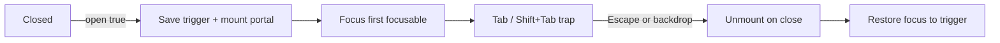
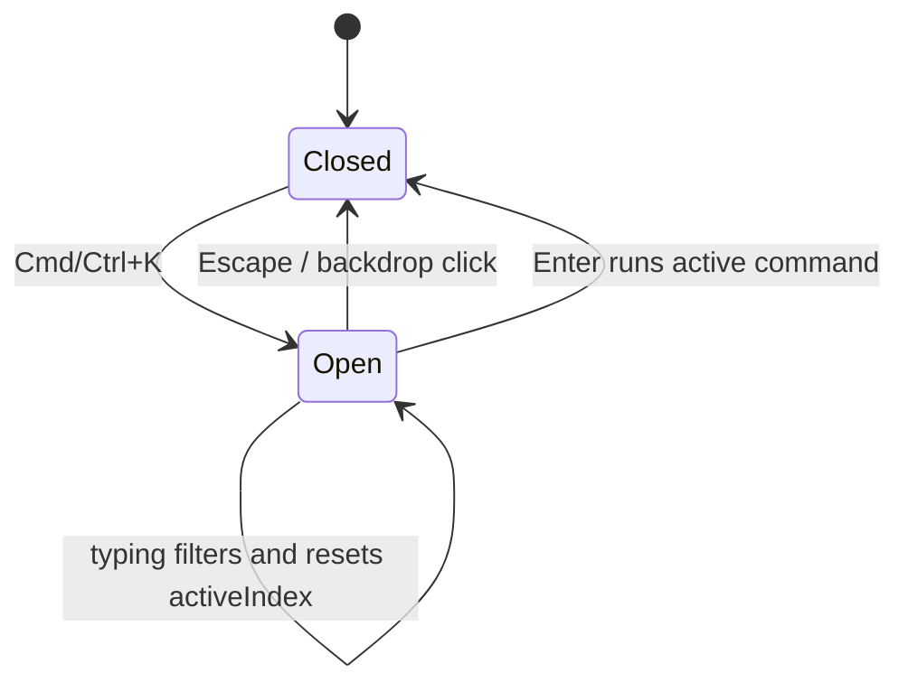

# Reusable Interactive Components

These are the components every product eventually rebuilds: an accordion, tabs, a modal, a select, a multi-select, and a combobox. They are grouped here because they share one trait &mdash; the visible UI is small, but correct keyboard support, focus management, and ARIA semantics are what separate a toy from a shippable component.

The golden rule for all six: **the component owns behavior, the consumer owns data.** Keep the interaction state minimal and derivable, push focus and ARIA into the DOM, and expose a controlled API so the component can be lifted, persisted, or driven by a URL.

---

## Accordion

`Difficulty: Easy` `Probability: Very High`

### What are we building?

A stack of collapsible panels. Clicking a header toggles its panel, optionally only one panel can be open at a time, and the whole thing is navigable and announced correctly by a screen reader. It looks trivial, which is why it is a favorite: it exposes whether you can wire ARIA ids, model "single vs multiple" as one piece of state, and add keyboard navigation without scattering state into each panel.

### Example

```text
[ Shipping                                  + ]
[ Returns                                   - ]
    Free returns within 30 days.
[ Warranty                                  + ]

Click toggles a panel. In "single" mode opening one closes the other.
```

### What is the interviewer testing?

- Modeling open panels as one array (`openIds`) instead of a boolean per panel
- `aria-expanded`, `aria-controls`, `role="region"`, `aria-labelledby` wired with stable generated ids
- Single vs multiple selection with the same state shape
- Roving tabindex and Arrow/Home/End navigation between headers
- A controlled API (`value` / `defaultValue` / `onValueChange`) that still works uncontrolled
- Using a real `<button>`, not a clickable `<div>`

### State Design

```ts
type AccordionType = "single" | "multiple";

items: Item[]                 // prop: { id, title, content }
type: AccordionType           // prop: single | multiple
value?: string[]              // prop: controlled open ids (uncontrolled if undefined)
defaultValue?: string[]       // prop: initial open ids
onValueChange?: (next: string[]) => void

// internal (only when uncontrolled)
uncontrolledOpen: string[]    // the open panel ids
focusedIndex: number          // which header currently owns the roving tab stop
```

**Do NOT store:** an `isOpen` flag inside each item object, the derived panel id strings, or a count of open panels. All are derived from `openIds` and the item `id`s during render. Storing `isOpen` on the data makes "only one open" impossible to enforce and survives incorrectly across reorders.

### Basic Version

```ts
import { useId, useRef, useState } from "react";

type Item = { id: string; title: string; content: React.ReactNode };

type AccordionProps = {
  items: Item[];
  type?: "single" | "multiple";
  defaultValue?: string[];
};

export function Accordion({ items, type = "multiple", defaultValue = [] }: AccordionProps) {
  const baseId = useId();
  const [openIds, setOpenIds] = useState<string[]>(() =>
    type === "single" ? defaultValue.slice(0, 1) : defaultValue,
  );
  const headerRefs = useRef<Array<HTMLButtonElement | null>>([]);
  const [focusedIndex, setFocusedIndex] = useState(0);

  const toggle = (id: string) =>
    setOpenIds((prev) => {
      if (prev.includes(id)) return prev.filter((x) => x !== id);
      return type === "single" ? [id] : [...prev, id];
    });

  const focusAt = (index: number) => {
    const next = (index + items.length) % items.length;
    setFocusedIndex(next);
    headerRefs.current[next]?.focus();
  };

  const onHeaderKeyDown = (e: React.KeyboardEvent, index: number) => {
    switch (e.key) {
      case "ArrowDown": e.preventDefault(); focusAt(index + 1); break;
      case "ArrowUp":   e.preventDefault(); focusAt(index - 1); break;
      case "Home":      e.preventDefault(); focusAt(0); break;
      case "End":       e.preventDefault(); focusAt(items.length - 1); break;
    }
  };

  return (
    <div>
      {items.map((item, index) => {
        const open = openIds.includes(item.id);
        const headerId = `${baseId}-header-${item.id}`;
        const panelId = `${baseId}-panel-${item.id}`;

        return (
          <div key={item.id}>
            <h3 style={{ margin: 0 }}>
              <button
                id={headerId}
                ref={(el) => { headerRefs.current[index] = el; }}
                type="button"
                aria-expanded={open}
                aria-controls={panelId}
                tabIndex={focusedIndex === index ? 0 : -1}
                onClick={() => toggle(item.id)}
                onKeyDown={(e) => onHeaderKeyDown(e, index)}
              >
                {item.title}
                <span aria-hidden="true">{open ? "-" : "+"}</span>
              </button>
            </h3>

            <div
              id={panelId}
              role="region"
              aria-labelledby={headerId}
              hidden={!open}
            >
              {item.content}
            </div>
          </div>
        );
      })}
    </div>
  );
}
```

### How It Works

- `openIds: string[]` is the whole state. Single mode is not a different component; it just never lets the array grow past one element. That keeps the toggle logic in one function.
- `aria-expanded` tells assistive tech whether the panel is open. `aria-controls` points at the panel, and `aria-labelledby` on the panel points back at the header, so a screen reader announces "Returns, region, collapsed" and then the content.
- `hidden={!open}` removes the panel from the layout *and* the accessibility tree. This is usually better than `display:none` alone because it keeps the DOM node (so scroll position and form state inside survive) while hiding it correctly.
- The roving `tabIndex` means only one header is in the page Tab sequence; Arrow keys move focus between headers and wrap at the ends. `focusAt` uses `(index + length) % length`, which handles both directions with one expression.
- `useId()` generates a prefix that is stable across server and client render, so the header/panel ids never collide when two accordions share a page.

### Edge Cases

- **All panels closed in single mode.** "Single" can mean "exactly one open" or "at most one open." Decide and document it; `collapsible` is the usual prop name for allowing none.
- **Controlled value out of sync.** If `value` contains an id that no longer exists in `items`, ignore it during render instead of throwing.
- **Heavy panel content.** `hidden` keeps the node mounted; if a panel holds a chart or editor, render it only while open and accept losing its internal state.
- **Duplicate ids.** The consumer's `item.id` must be unique. If it is not, `aria-controls` points at the wrong panel &mdash; derive ids from the index only as a last resort.
- **Nested accordions.** `useId` makes the prefixes unique automatically; do not hardcode ids.
- **Animation.** You cannot animate a `hidden` element. Use a ref + `max-height`/`grid-template-rows` transition, then apply `hidden` after the transition ends (or animate a wrapper instead).

### Interview Follow-ups

- **Level 1:** Basic open/close with a single `openIds` array; add the `type` prop for single vs multiple. (The version above.)
- **Level 2:** Full ARIA wiring: `aria-expanded`, `aria-controls`, `role="region"`, `aria-labelledby`, and `hidden`. Add `aria-disabled` and skip disabled headers in `focusAt`.
- **Level 3:** Roving focus with `ArrowUp`/`ArrowDown`/`Home`/`End`, wrapping at the ends. (Shown above; note that the ARIA APG allows every header to be a tab stop and treats arrow keys as an enhancement &mdash; say which behavior you chose and why.)
- **Level 4:** A reusable **controlled** API. Normalize everything to arrays internally and expose `value`, `defaultValue`, and `onValueChange` with a tiny `useControllableState` helper:

  ```ts
  function useControllableState<T>(
    controlled: T | undefined,
    defaultValue: T,
    onChange?: (next: T) => void,
  ) {
    const [uncontrolled, setUncontrolled] = useState(defaultValue);
    const isControlled = controlled !== undefined;
    const value = isControlled ? controlled : uncontrolled;

    const setValue = (next: T) => {
      if (!isControlled) setUncontrolled(next);
      onChange?.(next);
    };
    return [value, setValue] as const;
  }
  ```

  Callers can then render `<Accordion value={open} onValueChange={setOpen} ... />` or leave both off and stay uncontrolled.
- **Level 5:** Animated expand/collapse with a height transition that respects `prefers-reduced-motion`.
- **Level 6:** "Expand all" / "Collapse all", multiple `defaultValue` entries, and an icon that rotates with `transform` rather than swapping glyphs.

### Production Version

A design system should ship one accessible accordion rather than one per team. Radix, Headless UI, and React Aria all implement this exact APG pattern, including the animation coordination problem. If the open state needs to survive a reload or be linkable, lift `value` into the URL (`useSearchParams`) or a context; the component itself stays presentational and controlled.

### Accessibility

- The header must be a `<button>` so it is focusable, activatable by Enter/Space, and announced as a button.
- `aria-expanded` goes on the *button*, never on the panel. The panel carries `role="region"` and `aria-labelledby`.
- Wrap the header button in a real heading (`<h3>`) so the page has a navigable outline; do not fake it with bold text.
- Do not use `aria-hidden` on a panel that still contains focusable elements &mdash; use `hidden` so focus cannot land inside invisible content.
- The `+`/`-` glyph is decoration; mark it `aria-hidden="true"` so it is not read as "plus".

### Performance

Cheap. The only real cost is panel content, not the headers. Keep heavy content unmounted when closed, and animate transform/opacity rather than layout properties where possible. Do not `useMemo` the toggle handler for a five-item accordion.

### Testing

```text
✓ clicking a header expands its panel (aria-expanded flips to true)
✓ clicking again collapses it
✓ single mode closes the previously open panel
✓ multiple mode keeps both panels open
✓ ArrowDown/ArrowUp move focus between headers and wrap
✓ Home/End jump to the first/last header
✓ the panel is hidden when collapsed
✓ a controlled accordion calls onValueChange and does not change without it
```

### Common Mistakes

- A `<div onClick>` header: not focusable, not announced, no keyboard support.
- `aria-expanded` on the panel instead of the button.
- Forgetting `type="button"`, so the header submits an enclosing form.
- Using `key={index}`; reordering items then moves the wrong panel's state.
- Storing `isOpen` on each item and letting two panels open in "single" mode.
- Generating ids with `Math.random()` during render, which breaks hydration.

### Interview Takeaway

An accordion is a list of ids plus one array of open ids. Get the button/panel ARIA pair right, keep the tab stop on one header, and expose a controlled value. This same "disclosure" primitive is what powers menus, sidebars, and FAQ sections.

---

## Tabs

`Difficulty: Medium` `Probability: Very High`

### What are we building?

A set of tab buttons that swap a single visible panel. Exactly one tab is selected, only the selected tab is in the page Tab sequence, and Arrow/Home/End move between tabs. Panels are lazy: a panel's content is not created until the tab is first visited, then kept mounted so its internal state survives switching away.

### Example

```text
[ Overview ]  Profile   Settings
-------------
Overview panel content

One tab is selected and tabbable; the others are reachable with Arrow keys.
Panel content mounts the first time its tab is opened.
```

### What is the interviewer testing?

- One `activeId` source of truth instead of a boolean per tab
- The `tablist` / `tab` / `tabpanel` ARIA relationship with generated ids
- Roving `tabIndex` so Tab enters the tablist once, then leaves to the panel
- Arrow / Home / End handling, including wrap-around
- Lazy panel mounting without losing state on switch-away
- A controlled API that can be driven by the URL

### State Design

```ts
tabs: Tab[]                     // prop: { id, label, content }
activeId: string                // the ONLY required state
visited: string[]               // ids whose panel has been mounted at least once (lazy)
focusedIndex: number            // roving tab stop among the tab buttons
// controlled mode
value?: string                  // prop: replaces activeId
onValueChange?: (id: string) => void
```

**Do NOT store:** the active panel's index (an id is stable across reordering), the panel ids, `isActive` flags on each tab, or a "first mount" flag per panel. All are derived from `activeId` and `visited`.

### Basic Version

```ts
import { useId, useRef, useState } from "react";

type Tab = { id: string; label: string; content: React.ReactNode };

type TabsProps = { tabs: Tab[]; defaultActiveId?: string };

export function Tabs({ tabs, defaultActiveId }: TabsProps) {
  const baseId = useId();
  const initial = defaultActiveId ?? tabs[0]?.id ?? "";
  const [activeId, setActiveId] = useState(initial);
  const [visited, setVisited] = useState<string[]>([initial]);
  const tabRefs = useRef<Array<HTMLButtonElement | null>>([]);

  const tabId = (id: string) => `${baseId}-tab-${id}`;
  const panelId = (id: string) => `${baseId}-panel-${id}`;

  // Selecting a tab both activates it and marks its panel as visited.
  const activate = (id: string) => {
    setActiveId(id);
    setVisited((prev) => (prev.includes(id) ? prev : [...prev, id]));
  };

  const focusAt = (index: number) => {
    const next = (index + tabs.length) % tabs.length;
    activate(tabs[next].id);
    tabRefs.current[next]?.focus();
  };

  const onKeyDown = (e: React.KeyboardEvent, index: number) => {
    switch (e.key) {
      case "ArrowRight": e.preventDefault(); focusAt(index + 1); break;
      case "ArrowLeft":  e.preventDefault(); focusAt(index - 1); break;
      case "Home":       e.preventDefault(); focusAt(0); break;
      case "End":        e.preventDefault(); focusAt(tabs.length - 1); break;
    }
  };

  return (
    <div>
      <div role="tablist" aria-label="Sections">
        {tabs.map((tab, index) => {
          const selected = tab.id === activeId;
          return (
            <button
              key={tab.id}
              id={tabId(tab.id)}
              ref={(el) => { tabRefs.current[index] = el; }}
              role="tab"
              type="button"
              aria-selected={selected}
              aria-controls={panelId(tab.id)}
              tabIndex={selected ? 0 : -1}
              onClick={() => activate(tab.id)}
              onKeyDown={(e) => onKeyDown(e, index)}
            >
              {tab.label}
            </button>
          );
        })}
      </div>

      {tabs.map((tab) =>
        visited.includes(tab.id) ? (
          <div
            key={tab.id}
            id={panelId(tab.id)}
            role="tabpanel"
            aria-labelledby={tabId(tab.id)}
            tabIndex={0}
            hidden={tab.id !== activeId}
          >
            {tab.content}
          </div>
        ) : null,
      )}
    </div>
  );
}
```

### How It Works

- `activeId` (a string) is the source of truth. Indexes shift when tabs are reordered or closed; ids do not.
- Only the selected tab has `tabIndex={0}`; every other tab has `-1`. Pressing Tab once enters the tablist on the selected tab, then Tab again leaves to the panel. Arrow keys move focus *and* selection together (automatic activation).
- `activate` updates `visited` in the same handler that changes `activeId`, so no effect is needed to sync them. `visited` is what implements laziness: a panel is not in the DOM until its tab has been opened at least once.
- Panels stay mounted once visited and are toggled with `hidden`. This preserves typed input and scroll position when the user switches away and back.
- `tabIndex={0}` on the panel lets keyboard users Tab from the tablist straight into the panel content and then scroll it with arrows.

### Edge Cases

- **No tabs / empty array.** Guard `tabs[0]?.id ?? ""`; render an empty state or nothing.
- **`defaultActiveId` not in `tabs`.** Fall back to the first tab rather than rendering zero selected tabs.
- **Manual vs automatic activation.** Automatic (selection follows focus) is fine for lightweight panels; for expensive panels use manual activation &mdash; arrows move `focusedIndex` only and Enter/Space select. Say which you chose.
- **Tabs that overflow.** Do not let a horizontal tablist trap the browser's native scroll; add left/right scroll buttons or wrap instead of hidden overflow.
- **Vertical tabs.** Set `aria-orientation="vertical"` on the tablist and use ArrowUp/ArrowDown.
- **Focus lost when a tab is removed.** Move focus to the next surviving tab, not to `<body>`.

### Interview Follow-ups

- **Level 1:** Active index plus click-to-switch. (A plain `useState(0)` is enough at this stage.)
- **Level 2:** Full ARIA: `role="tablist"`, `role="tab"`, `role="tabpanel"`, `aria-selected`, `aria-controls`, `aria-labelledby`, and id generation with `useId`.
- **Level 3:** Roving `tabIndex` with Arrow/Home/End and wrap-around. (Shown above.)
- **Level 4:** Lazy panels with a `visited` list, keeping visited panels mounted and hidden so their state survives.
- **Level 5:** A controlled `value` / `onValueChange` API, then sync the active tab to the URL (`useSearchParams`) so a tab is linkable and survives reload.
- **Level 6:** Vertical tabs, closeable tabs (with focus recovery after close), and overflow menus for tabs that do not fit.

### Production Version

Tabs are usually controlled by routing rather than local state: each tab is a route or a query parameter. Keep the ARIA component dumb and let the app decide what "active" means. A design system will ship one Tabs implementation (Radix, Headless UI, React Aria); the value you add in an interview is knowing where the tab stop lives and why panels stay mounted.

### Accessibility

- The tablist needs an accessible name (`aria-label` or `aria-labelledby`).
- `aria-selected` belongs on the tab, and the selected tab must be keyboard reachable (`tabIndex={0}`).
- Give each panel `tabIndex={0}` and a label pointing back at its tab, so a screen reader announces "Overview, tab panel".
- Never remove the active panel from the DOM while focus is inside it.
- Do not use color alone to indicate the selected tab; pair it with `aria-selected`, a border, or an underline.
- If you animate the panel, honor `prefers-reduced-motion`.

### Performance

Rendering the active panel is the only required work. Laziness avoids paying for panels the user never opens, and keeping them mounted afterwards avoids re-fetching or re-initializing. If a panel's content is heavy, mount it inside `startTransition` or defer it until the tab is actually focused. Memoize each panel component if it is expensive and its props are stable.

### Testing

```text
✓ the first tab is selected by default (aria-selected="true")
✓ clicking a tab shows only its panel
✓ ArrowRight/ArrowLeft move selection and wrap
✓ Home/End select the first/last tab
✓ only the selected tab has tabIndex 0
✓ an unvisited panel is not in the DOM
✓ a visited panel stays mounted when you switch away
✓ onValueChange fires and a controlled value does not change on its own
```

### Common Mistakes

- Storing `activeIndex` and `tabs` separately, then reordering one without the other.
- Every tab having `tabIndex={0}`, which forces the user to Tab through all of them.
- No `tabIndex={0}` on the panel, so keyboard users cannot reach panel content.
- Using `<div role="tab">` without a key handler, making the tabs click-only.
- Unmounting panels on switch and silently destroying form state.
- Putting focus on the panel instead of the tab when selecting via keyboard.

### Interview Takeaway

Tabs are one selected id plus a set of stable ids. ARIA makes the relationship explicit, roving tabindex keeps the keyboard path short, and a `visited` list gives you lazy mounting for free. Once it is controlled, the same component can back a router.

---

## Accessible Modal / Dialog

`Difficulty: Hard` `Probability: Very High`

### What are we building?

A dialog that renders above the page in a portal, closes on Escape and on a backdrop click, locks background scrolling, moves focus into itself when opened, traps Tab inside it, and restores focus to the trigger when it closes. This is the flagship accessibility problem: almost every candidate gets the visuals right and the focus lifecycle wrong.

### Example

```text
        +--------------------------------------+
        |  Delete project                 [x]  |
        |--------------------------------------|
        |  This action cannot be undone.       |
        |                                      |
        |              [ Cancel ]  [ Delete ]  |
        +--------------------------------------+

Escape closes. Tab cycles Cancel <-> Delete <-> Close.
Closing returns focus to the button that opened it.
```

### What is the interviewer testing?

- Portals with `createPortal` and why they are needed
- The focus lifecycle: save trigger &rarr; move focus in &rarr; trap &rarr; restore
- Escape handling, backdrop-vs-content clicks, and event cleanup
- Body scroll lock including scrollbar-width compensation
- `role="dialog"`, `aria-modal`, `aria-labelledby`, `aria-describedby`
- A controlled `open` / `onClose` API that does not fight React

### State Design

```ts
open: boolean                        // prop: controlled visibility (the only source of truth)
onClose: () => void                  // prop: parent flips `open`
titleId / descriptionId: string      // generated with useId

// refs, NOT state
triggerRef: HTMLElement | null       // who had focus before opening
dialogRef: HTMLDivElement | null     // the dialog node for the focus trap
```

**Do NOT store:** the previously focused element as *state* (it is a DOM ref, not render data), the set of focusable nodes (query the DOM when Tab is pressed), the current body `overflow` value (capture and restore it inside the effect), or an `isMounted` flag (derive visibility from `open`). Storing any of these creates an extra render pass between "open" and "focusable", which is exactly when focus escapes.

### Basic Version

```ts
import { useEffect, useId, useRef } from "react";
import { createPortal } from "react-dom";

const FOCUSABLE =
  'a[href], button:not([disabled]), textarea:not([disabled]), input:not([disabled]), select:not([disabled]), [tabindex]:not([tabindex="-1"])';

type ModalProps = {
  open: boolean;
  onClose: () => void;
  title: string;
  description?: string;
  children: React.ReactNode;
};

export function Modal({ open, onClose, title, description, children }: ModalProps) {
  const titleId = useId();
  const descriptionId = useId();
  const dialogRef = useRef<HTMLDivElement>(null);
  const restoreRef = useRef<HTMLElement | null>(null);

  // Move focus in on open, restore it on close.
  useEffect(() => {
    if (!open) return;
    restoreRef.current = document.activeElement as HTMLElement | null;

    const dialog = dialogRef.current;
    const first = dialog?.querySelector<HTMLElement>(FOCUSABLE);
    (first ?? dialog)?.focus();

    return () => {
      // Only restore if the trigger is still in the document.
      if (restoreRef.current?.isConnected) restoreRef.current.focus();
    };
  }, [open]);

  // Escape to close + a Tab/Shift+Tab trap.
  useEffect(() => {
    if (!open) return;

    const onKeyDown = (e: KeyboardEvent) => {
      if (e.key === "Escape") {
        e.stopPropagation();
        onClose();
        return;
      }
      if (e.key !== "Tab") return;

      const nodes = dialogRef.current?.querySelectorAll<HTMLElement>(FOCUSABLE);
      if (!nodes || nodes.length === 0) return;

      const list = Array.from(nodes).filter((el) => el.offsetParent !== null);
      const first = list[0];
      const last = list[list.length - 1];
      const active = document.activeElement as HTMLElement | null;

      if (!active || !dialogRef.current?.contains(active)) {
        e.preventDefault();
        first.focus();
      } else if (e.shiftKey && active === first) {
        e.preventDefault();
        last.focus();
      } else if (!e.shiftKey && active === last) {
        e.preventDefault();
        first.focus();
      }
    };

    document.addEventListener("keydown", onKeyDown);
    return () => document.removeEventListener("keydown", onKeyDown);
  }, [open, onClose]);

  // Lock background scroll, compensating for the removed scrollbar.
  useEffect(() => {
    if (!open) return;
    const { overflow, paddingRight } = document.body.style;
    const gap = window.innerWidth - document.documentElement.clientWidth;

    document.body.style.overflow = "hidden";
    if (gap > 0) document.body.style.paddingRight = `${gap}px`;

    return () => {
      document.body.style.overflow = overflow;
      document.body.style.paddingRight = paddingRight;
    };
  }, [open]);

  if (!open) return null;

  return createPortal(
    <div
      className="modal-backdrop"
      // mousedown, not click: a drag that starts inside and ends on the backdrop must not close
      onMouseDown={(e) => {
        if (e.target === e.currentTarget) onClose();
      }}
    >
      <div
        ref={dialogRef}
        role="dialog"
        aria-modal="true"
        aria-labelledby={titleId}
        aria-describedby={description ? descriptionId : undefined}
        tabIndex={-1}
        className="modal"
      >
        <h2 id={titleId}>{title}</h2>
        {description && <p id={descriptionId}>{description}</p>}
        <div>{children}</div>
        <button type="button" onClick={onClose} aria-label="Close dialog">x</button>
      </div>
    </div>,
    document.body,
  );
}
```



### How It Works

- `createPortal(..., document.body)` renders the dialog outside the app's DOM subtree, so no parent `overflow: hidden`, `transform`, or `z-index` can clip or hide it.
- The focus effect captures `document.activeElement` *before* moving focus. On cleanup (which runs when `open` flips to `false`, or on unmount) it restores focus. Cleanup is the natural home for restore because it pairs exactly with the open/close transition.
- The keydown listener is attached to `document`, not the dialog, so Escape works even if focus is momentarily on the body. It is removed in the effect cleanup, so no listener leaks.
- The trap handles the two edges: Shift+Tab from the first focusable wraps to the last, and Tab from the last wraps to the first. It also catches the case where focus is somehow outside the dialog and pulls it back to the first focusable.
- `offsetParent !== null` filters out elements that are visually hidden (for example, an `sr-only` button), so the trap never sends focus to something invisible.
- The scroll-lock effect captures and restores the *previous* inline styles rather than blindly clearing them, so nested locks and pre-existing styles are respected.
- The backdrop uses `onMouseDown` with an identity check (`e.target === e.currentTarget`). A `click` handler would close the dialog when a text selection that began inside the dialog ends on the backdrop.

### Edge Cases

- **The trigger unmounts while the dialog is open.** `restoreRef.current?.isConnected` guards the restore; otherwise you focus a detached node and focus falls to `<body>`.
- **No focusable content.** Focus the dialog itself (`tabIndex={-1}`), which is why the fallback is `(first ?? dialog)?.focus()`.
- **Nested dialogs.** A single `document.body` overflow assignment is wrong for two open dialogs; use a module-level open counter and release the lock only when the last dialog closes.
- **Two dialogs, both with Escape.** Each listens on `document`, so one Escape would close both. Add a stack: only the topmost dialog handles Escape. This is the single most common bug in modal code.
- **Scrollbar jump.** Hiding overflow removes the scrollbar and shifts the page; `paddingRight` compensation prevents the content from jumping.
- **Rapid open/close.** Effects clean up in order; if you animate the exit, keep the portal mounted until the transition ends and only then remove it.
- **Portal target missing in SSR.** Render nothing on the server, or portal into a stable node created on mount.

### Interview Follow-ups

- **Level 1:** Open/close from state, rendered inline, no portal.
- **Level 2:** Portal to `document.body` so parent stacking and overflow cannot clip it.
- **Level 3:** Escape to close and backdrop click to close (with the `mousedown` + identity-check detail).
- **Level 4:** Body scroll lock with scrollbar-width compensation and style restoration. Track a global open count for nested dialogs.
- **Level 5:** Initial focus (prefer the first sensible control, never a destructive one) and focus restore on close.
- **Level 6:** A full Tab/Shift+Tab focus trap, filtering out hidden nodes.
- **Level 7:** A reusable controlled API: `open` / `onClose` plus optional `initialFocusRef`, `returnFocusRef`, and `aria-describedby`. Optionally switch to a compound API (`Modal.Trigger`, `Modal.Content`) backed by context so the trigger and content talk without prop drilling.
- **Level 8:** Nested dialogs with a stack (only the topmost closes on Escape) and background isolation via `inert` on the app root instead of `aria-hidden`.
- **Level 9:** Exit animation via a presence wrapper that keeps the portal mounted until the transition ends, respecting `prefers-reduced-motion`.

### Production Version

Production dialog libraries (Radix Dialog, Headless UI, React Aria) exist almost entirely because of the focus lifecycle above. They also handle `inert` background isolation, scroll-lock counters, and portal containers. Using one is the right call in a real codebase; in an interview, implement the manual version so you can explain *why* each effect exists. If dialogs are opened from many places, a single `useModal` hook or a provider keeps the open/close plumbing out of every feature component.

### Accessibility

- `role="dialog"` (or `role="alertdialog"` for destructive confirmations) plus `aria-modal="true"` tells assistive tech the rest of the page is inert.
- Always label the dialog with `aria-labelledby` pointing at its heading. Add `aria-describedby` for the explanatory sentence.
- Move focus into the dialog on open, and put it on the *least destructive* control or the dialog container &mdash; never on "Delete".
- Trap Tab, close on Escape, and restore focus to the trigger on close. All three are mandatory, not nice-to-have.
- Keep the dialog's heading level correct for its position in the page outline.
- Do not rely on `aria-hidden` alone to hide the background; it does not stop clicks or focus. Prefer the `inert` attribute on the app root.
- Announce nothing twice: if the dialog has `aria-modal`, do not also add a live region for the same text.

### Performance

Mounting a portal is cheap. The real costs are large dialog contents and layout thrash from focus queries. Query focusable nodes only when Tab is pressed (as above), not on every render, and avoid re-running the focus effect when `onClose` changes by keeping it out of the trap effect's logic where possible. If the content is heavy, render it only while `open`.

### Testing

```text
✓ clicking the trigger opens the dialog and it is in document.body
✓ focus moves into the dialog on open
✓ Tab from the last focusable wraps to the first
✓ Shift+Tab from the first wraps to the last
✓ Escape calls onClose
✓ mousedown on the backdrop calls onClose; mousedown inside does not
✓ close restores focus to the trigger
✓ body overflow is hidden while open and restored after
✓ the dialog has role="dialog", aria-modal, and an accessible name
```

### Common Mistakes

- Forgetting to restore focus, leaving the user at the top of the page after closing.
- Trapping only Tab but not Shift+Tab.
- Attaching the key listener to the dialog instead of `document`, so Escape fails when focus is on `<body>`.
- No effect cleanup, leaking a `keydown` listener on every open.
- Closing on backdrop *click* and losing a drag that started inside the content.
- Rendering the dialog inside a scroll container so it gets clipped.
- Using `aria-hidden` on the app root while the dialog is a *child* of that root, which hides the dialog too.
- Nested dialogs where one Escape closes both.
- Locking body scroll without restoring the original overflow and padding.

### Interview Takeaway

A modal is a focus-lifecycle problem wearing a visual costume: save &rarr; move &rarr; trap &rarr; restore, with Escape and cleanup around it. Get the portal and the trap right, handle nested dialogs with a stack, and this becomes the component you can most confidently defend in a code review.

---

## Dropdown / Select

`Difficulty: Medium` `Probability: Very High`

### What are we building?

A custom select: a button showing the current value and a popup list of options. It opens on click or keyboard, closes on outside click, Escape, or selection, supports Arrow/Home/End navigation, jumps to options as you type (typeahead), and exposes `role="combobox"` + `role="listbox"` semantics. The searchable variant &mdash; a text input that filters options as you type &mdash; is the same component with one extra field, so treat it as a level here rather than a separate problem.

### Example

```text
[ Medium            v ]
+--------------------+
| Low                |
| > Medium           |  <- keyboard highlight (active descendant)
| High               |
+--------------------+

Click, ArrowDown, Enter, or type "h" to jump to High.
```

### What is the interviewer testing?

- Open/close state plus a separate highlighted index
- Outside-click dismissal with a `pointerdown` listener and a root ref
- Full keyboard support: Arrow/Enter/Space/Escape/Home/End and typeahead
- Correct listbox semantics (`combobox`, `listbox`, `option`, `aria-activedescendant`)
- A controlled `value` and a derived selected option
- The transition to a searchable select without rewriting the component

### State Design

```ts
open: boolean                     // popup visibility
activeIndex: number               // keyboard highlight, independent of selection
value: string | null              // prop: controlled selection
onChange: (value: string) => void // prop
query: string                     // only in the searchable level

// refs
rootRef: HTMLElement | null       // containment check for outside clicks
typeaheadRef: { query: string }   // the buffer for type-to-jump
```

**Do NOT store:** the selected option object (derive it from `value` and `options`), the filtered options list (derive with `useMemo`), the option's DOM node as state (use `aria-activedescendant`), or an `isOpen` copy anywhere else. `open` and `activeIndex` are the only two values that must exist.

### Basic Version

```ts
import { useEffect, useId, useRef, useState } from "react";

type Option = { value: string; label: string };

type SelectProps = {
  options: Option[];
  value: string | null;
  onChange: (value: string) => void;
  placeholder?: string;
};

export function Select({ options, value, onChange, placeholder = "Select..." }: SelectProps) {
  const baseId = useId();
  const [open, setOpen] = useState(false);
  const [activeIndex, setActiveIndex] = useState(0);
  const rootRef = useRef<HTMLDivElement>(null);
  const typeahead = useRef({ query: "", timer: 0 as ReturnType<typeof setTimeout> });

  const selected = options.find((o) => o.value === value) ?? null;
  const listId = `${baseId}-list`;

  // Outside click: pointerdown fires before click, so the popup closes
  // before any background control receives the click.
  useEffect(() => {
    if (!open) return;
    const onPointerDown = (e: PointerEvent) => {
      if (!rootRef.current?.contains(e.target as Node)) setOpen(false);
    };
    document.addEventListener("pointerdown", onPointerDown);
    return () => document.removeEventListener("pointerdown", onPointerDown);
  }, [open]);

  const openList = () => {
    const i = options.findIndex((o) => o.value === value);
    setActiveIndex(i >= 0 ? i : 0);
    setOpen(true);
  };

  const commit = (index: number) => {
    const option = options[index];
    if (!option) return;
    onChange(option.value);
    setOpen(false);
  };

  const runTypeahead = (char: string) => {
    const buffer = typeahead.current;
    buffer.query += char.toLowerCase();
    clearTimeout(buffer.timer);
    buffer.timer = setTimeout(() => { buffer.query = ""; }, 500);
    const match = options.findIndex((o) => o.label.toLowerCase().startsWith(buffer.query));
    if (match >= 0) {
      setActiveIndex(match);
      if (!open) setOpen(true);
    }
  };

  const onKeyDown = (e: React.KeyboardEvent) => {
    if (!open) {
      if (["ArrowDown", "ArrowUp", "Enter", " "].includes(e.key)) {
        e.preventDefault();
        openList();
      } else if (e.key.length === 1 && !e.ctrlKey && !e.metaKey && !e.altKey) {
        runTypeahead(e.key);
      }
      return;
    }

    switch (e.key) {
      case "ArrowDown":
        e.preventDefault();
        setActiveIndex((i) => Math.min(i + 1, options.length - 1));
        break;
      case "ArrowUp":
        e.preventDefault();
        setActiveIndex((i) => Math.max(i - 1, 0));
        break;
      case "Home":
        e.preventDefault();
        setActiveIndex(0);
        break;
      case "End":
        e.preventDefault();
        setActiveIndex(options.length - 1);
        break;
      case "Enter":
      case " ":
        e.preventDefault();
        commit(activeIndex);
        break;
      case "Escape":
        e.preventDefault();
        setOpen(false);
        break;
      case "Tab":
        setOpen(false);
        break;
      default:
        if (e.key.length === 1 && !e.ctrlKey && !e.metaKey && !e.altKey) runTypeahead(e.key);
    }
  };

  return (
    <div ref={rootRef} onKeyDown={onKeyDown}>
      <button
        type="button"
        role="combobox"
        aria-haspopup="listbox"
        aria-expanded={open}
        aria-controls={listId}
        aria-activedescendant={open ? `${baseId}-opt-${options[activeIndex]?.value}` : undefined}
        onClick={() => (open ? setOpen(false) : openList())}
      >
        {selected?.label ?? placeholder}
        <span aria-hidden="true">v</span>
      </button>

      {open && (
        <ul id={listId} role="listbox" aria-label="Options">
          {options.map((option, index) => (
            <li
              key={option.value}
              id={`${baseId}-opt-${option.value}`}
              role="option"
              aria-selected={option.value === value}
              className={index === activeIndex ? "active" : undefined}
              onMouseEnter={() => setActiveIndex(index)}
              onMouseDown={(e) => e.preventDefault()}
              onClick={() => commit(index)}
            >
              {option.label}
            </li>
          ))}
        </ul>
      )}
    </div>
  );
}
```

### How It Works

- `open` and `activeIndex` are separate. Keyboard highlight is a preview; selection only happens on Enter/Space/click. Selection and highlight coincidentally line up when the popup opens (we seed `activeIndex` from the current `value`).
- The outside-click listener uses `pointerdown` rather than `click`. `pointerdown` fires before focus and click, so clicking another control both closes this popup and lets that control do its job in one interaction.
- Focus never leaves the trigger button. The highlighted option is communicated with `aria-activedescendant`, which is why options do not need to be focusable and why `onMouseDown={e.preventDefault()}` matters &mdash; it stops the click from moving focus out of the trigger.
- `runTypeahead` accumulates printable characters into a buffer and resets it after 500ms of inactivity, so typing "hi" jumps to "High" while a pause starts a new search. The timeout is stored on the ref so successive keystrokes can clear the previous one.
- `selected` is derived with `find`, never stored, so the label can never disagree with `value`.

### Edge Cases

- **`value` not present in `options`** (stale or remote data): show the placeholder or the raw value; do not crash on `undefined`.
- **Empty options list**: render "No options" and keep the trigger disabled or return early from `commit`.
- **Popup near the viewport edge**: a real implementation flips the list above the trigger. Mention it; a full positioning engine (Floating UI) is a production concern.
- **Typeahead and Space**: Space is a printable character but is also the "select" key. Decide: when the list is open, Space selects; when closed, Space opens. Typeahead should not swallow it.
- **Filtered vs full list (searchable level)**: `activeIndex` indexes the *visible* list. Reset it to `0` whenever `query` changes, or the highlight points at a different option.
- **Scroll the active option into view**: call `optionEl.scrollIntoView({ block: "nearest" })` when `activeIndex` changes, or long lists highlight off-screen.
- **Disabled options**: skip them in arrow navigation and typeahead, and mark `aria-disabled`.

### Interview Follow-ups

- **Level 1:** Open/close on click with a plain list and a selected label.
- **Level 2:** Outside-click dismissal using a root ref and a `pointerdown` listener with cleanup.
- **Level 3:** Keyboard support: ArrowDown/ArrowUp to open and move, Enter/Space to select, Escape/Tab to close, Home/End to jump.
- **Level 4:** Accessible listbox semantics: `role="combobox"`, `aria-expanded`, `aria-controls`, `role="listbox"`, `role="option"`, `aria-selected`, and `aria-activedescendant`.
- **Level 5:** Typeahead with a timed buffer (shown above) so typing jumps to a matching option.
- **Level 6:** **Searchable Select** &mdash; the trigger becomes a text input, add `query` state, derive `filtered = options.filter(...)` with `useMemo`, and keep `activeIndex` clamped to `filtered.length`. Show "No matches" and keep the input focused the whole time. This is the same combobox skeleton you will extend in **Autocomplete / Combobox**.
- **Level 7:** A controlled/uncontrolled pair (`value` + `defaultValue`) and an option renderer for custom rows (avatars, checkmarks).
- **Level 8:** Virtualize the option list when it can hold thousands of entries, and add async option loading with debounce.

### Production Version

For short, simple lists, a native `<select>` beats any custom widget on mobile, accessibility, and performance &mdash; say that first. Reserve a custom listbox for cases that genuinely need rich option rendering or search. Production custom selects sit on a positioning library (Floating UI) for flipping and collision handling, and on a virtualization library for long lists.

### Accessibility

- The trigger is the combobox: `role="combobox"`, `aria-haspopup="listbox"`, `aria-expanded`, `aria-controls`, and `aria-activedescendant`.
- The popup is a labelled `role="listbox"`; each row is `role="option"` with `aria-selected`. Do not nest focusable controls inside an option.
- Keep focus on the trigger and use `aria-activedescendant` to announce the highlighted option &mdash; do not move DOM focus into the list.
- Escape must close without changing the selection; Enter must commit the highlighted option.
- Return focus to the trigger after selecting from the popup if focus ever moved.
- Never encode the selected state with color alone; use `aria-selected` plus a visible checkmark.

### Performance

Cheap for dozens of options. For hundreds, memoize the filtered list and virtualize the popup. The typeahead `setTimeout` is created and cleared constantly; storing the handle on a ref (not state) avoids a render per keystroke. Do not close/reopen the popup on `mouseenter`; only `activeIndex` changes.

### Testing

```text
✓ clicking the trigger opens the listbox with aria-expanded="true"
✓ clicking an option selects it and closes the popup
✓ clicking outside closes the popup
✓ ArrowDown/ArrowUp move the active option and wrap/clamp
✓ Enter selects the active option
✓ Escape closes without changing the selection
✓ Home/End jump to the first/last option
✓ typing "hi" highlights High (typeahead)
✓ aria-activedescendant points at the active option
```

### Common Mistakes

- Using `click` for outside dismissal, which fires after focus moved and can reopen the popup.
- Storing `isOpen` in more than one place, or deriving `selected` on every render from a stale copy.
- Making every option focusable, so Tab walks through the whole list.
- Forgetting `onMouseDown={preventDefault}`, which blurs the trigger before the option click lands.
- Not resetting `activeIndex` when the option list changes (especially after filtering).
- Opening on `focus` and closing on `blur`, which fights every click inside the popup.
- Announcing selection by only restyling the row, with no `aria-selected`.

### Interview Takeaway

A select is three values: open, highlighted index, and value. Everything else is derived. The ARIA combobox pattern lets focus stay on the trigger while `aria-activedescendant` narrates the highlight, which is what makes both the plain and searchable variants work with the same skeleton.

---

## Multi-Select

`Difficulty: Hard` `Probability: High`

### What are we building?

A combobox where the value is a *set*: options are toggled on and off, chosen items render as removable tags, a "select all" control reflects all/none/some, and the whole thing works by keyboard with `aria-multiselectable`. It is the select from the previous problem plus set semantics, select-all, and tag management.

### Example

```text
[ React x ] [ TypeScript x ]   [ Search...           v ]

+--------------------------------------------+
| [x] Select all                             |
|--------------------------------------------|
| [x] React                                  |
| [x] TypeScript                             |
| [ ] Vue                                    |
+--------------------------------------------+
3 selected
```

### What is the interviewer testing?

- Set membership with arrays or a `Set`, and immutable membership toggles
- Select-all plus the *indeterminate* checkbox state (a ref side effect, not a prop)
- Derived `allSelected` / `someSelected` instead of stored flags
- Full keyboard: arrows, Space/Enter to toggle, Backspace to remove the last tag, Escape
- `aria-multiselectable="true"` and `aria-activedescendant` on the combobox
- Keeping the filter input valuable while children are removable

### State Design

```ts
options: Option[]                 // prop: { value, label, disabled? }
value: string[]                   // prop: controlled selected values
onChange: (next: string[]) => void
open: boolean                     // popup visibility
query: string                     // the filter input
activeIndex: number               // keyboard highlight in the filtered list

// refs
allRef: HTMLInputElement | null   // the select-all checkbox, for .indeterminate
rootRef: HTMLElement | null       // outside-click containment
```

**Do NOT store:** `allSelected`, `someSelected`, the filtered list, the selected option objects, or a `Set` that mirrors `value`. Derive all of them. In particular, `allSelected` is `options.every(o => selected.has(o.value))`, and `someSelected` is `value.length > 0 && !allSelected`. Never keep a `Set` in state alongside the array.

### Basic Version

```ts
import { useEffect, useId, useMemo, useRef, useState } from "react";

type Option = { value: string; label: string; disabled?: boolean };

type MultiSelectProps = {
  options: Option[];
  value: string[];
  onChange: (next: string[]) => void;
  placeholder?: string;
};

export function MultiSelect({
  options,
  value,
  onChange,
  placeholder = "Select...",
}: MultiSelectProps) {
  const baseId = useId();
  const [open, setOpen] = useState(false);
  const [query, setQuery] = useState("");
  const [activeIndex, setActiveIndex] = useState(0);
  const rootRef = useRef<HTMLDivElement>(null);
  const allRef = useRef<HTMLInputElement>(null);

  const selected = useMemo(() => new Set(value), [value]);

  const filtered = useMemo(() => {
    const q = query.trim().toLowerCase();
    return q ? options.filter((o) => o.label.toLowerCase().includes(q)) : options;
  }, [options, query]);

  const allSelected = options.length > 0 && options.every((o) => selected.has(o.value));
  const someSelected = value.length > 0 && !allSelected;

  // `.indeterminate` is a DOM property, not an attribute: set it via a ref.
  useEffect(() => {
    if (allRef.current) allRef.current.indeterminate = someSelected;
  }, [someSelected]);

  useEffect(() => {
    if (!open) return;
    const onPointerDown = (e: PointerEvent) => {
      if (!rootRef.current?.contains(e.target as Node)) setOpen(false);
    };
    document.addEventListener("pointerdown", onPointerDown);
    return () => document.removeEventListener("pointerdown", onPointerDown);
  }, [open]);

  // Clamp the highlight during render instead of storing a corrected value.
  const active = filtered.length === 0 ? -1 : Math.min(activeIndex, filtered.length - 1);

  const toggle = (v: string) =>
    onChange(selected.has(v) ? value.filter((x) => x !== v) : [...value, v]);

  const toggleAll = () => onChange(allSelected ? [] : options.map((o) => o.value));

  const onKeyDown = (e: React.KeyboardEvent) => {
    switch (e.key) {
      case "ArrowDown":
        e.preventDefault();
        setOpen(true);
        setActiveIndex(Math.min(active + 1, filtered.length - 1));
        break;
      case "ArrowUp":
        e.preventDefault();
        setActiveIndex(Math.max(active - 1, 0));
        break;
      case "Home":
        e.preventDefault();
        setActiveIndex(0);
        break;
      case "End":
        e.preventDefault();
        setActiveIndex(filtered.length - 1);
        break;
      case "Enter":
      case " ": {
        const option = filtered[active];
        if (option && !option.disabled) {
          e.preventDefault();
          toggle(option.value);
        }
        break;
      }
      case "Backspace":
        // Only when the filter is empty, so typing still deletes characters.
        if (!query && value.length > 0) {
          e.preventDefault();
          onChange(value.slice(0, -1));
        }
        break;
      case "Escape":
        setOpen(false);
        break;
      case "Tab":
        setOpen(false);
        break;
    }
  };

  return (
    <div ref={rootRef}>
      <ul aria-label="Selected options">
        {value.map((v) => {
          const label = options.find((o) => o.value === v)?.label ?? v;
          return (
            <li key={v}>
              {label}
              <button type="button" aria-label={`Remove ${label}`} onClick={() => toggle(v)}>
                x
              </button>
            </li>
          );
        })}
      </ul>

      <label style={{ display: "block" }}>
        <input
          ref={allRef}
          type="checkbox"
          checked={allSelected}
          onChange={toggleAll}
          disabled={options.length === 0}
        />
        Select all
      </label>

      <input
        value={query}
        placeholder={placeholder}
        role="combobox"
        aria-expanded={open}
        aria-controls={`${baseId}-list`}
        aria-autocomplete="list"
        aria-activedescendant={
          open && active >= 0 ? `${baseId}-opt-${filtered[active].value}` : undefined
        }
        onFocus={() => setOpen(true)}
        onChange={(e) => {
          setQuery(e.target.value);
          setOpen(true);
          setActiveIndex(0);
        }}
        onKeyDown={onKeyDown}
      />

      {open && (
        <ul id={`${baseId}-list`} role="listbox" aria-multiselectable="true" aria-label="Options">
          {filtered.length === 0 && <li role="presentation">No matches</li>}
          {filtered.map((option, index) => {
            const isSelected = selected.has(option.value);
            return (
              <li
                key={option.value}
                id={`${baseId}-opt-${option.value}`}
                role="option"
                aria-selected={isSelected}
                aria-disabled={option.disabled || undefined}
                className={index === active ? "active" : undefined}
                onMouseEnter={() => setActiveIndex(index)}
                onMouseDown={(e) => e.preventDefault()}
                onClick={() => !option.disabled && toggle(option.value)}
              >
                <span aria-hidden="true">{isSelected ? "[x]" : "[ ]"}</span> {option.label}
              </li>
            );
          })}
        </ul>
      )}

      <p aria-live="polite">{value.length} selected</p>
    </div>
  );
}
```

### How It Works

- `value: string[]` is the source of truth. Membership tests go through a `Set` that is rebuilt with `useMemo` only when `value` changes &mdash; O(1) lookups for hundreds of options without a second piece of state.
- `toggle` uses the functional style: if present, filter it out; if absent, append. Both branches return a new array, so React always sees a change and the original is never mutated.
- `allSelected` and `someSelected` are computed each render. `someSelected` drives the visual indeterminate state, which must be set as a DOM property (`input.indeterminate`) through a ref because there is no HTML attribute for it.
- The highlight is clamped *during render* (`active`), so a filter change can never point the highlight past the end of the list. No effect, no extra render.
- `Backspace` removes the last tag only when the query is empty, matching how Gmail and similar tag inputs behave: typing edits text, empty-field Backspace deletes chips.
- Focus stays on the input; `aria-activedescendant` narrates the highlighted option while `aria-selected` marks the checked ones.
- Options render a decorative `[x]`/`[ ]` span with `aria-hidden`, so screen readers hear "selected" from ARIA rather than reading punctuation.

### Edge Cases

- **Select-all scope.** With an active filter, decide whether "select all" selects the whole list or just the visible options. Most apps select all, but it must be documented; the derived `allSelected` must match that choice.
- **Value not in options.** Persisted selections can outlive the option list; render the raw value in its tag and keep it in `value` until the user removes it.
- **Disabled options.** Exclude them from `toggleAll` and from keyboard toggle, and mark them `aria-disabled="true"`.
- **Max selection cap.** When a limit is reached, disable unselected options and announce it; do not silently drop selections.
- **Empty state.** "No matches" inside the listbox should be `role="presentation"` (or a `role="option"` marked disabled) so the listbox is never empty without explanation.
- **Removing a tag by mouse** moves focus to `<body>` because the button unmounts. Keep focus in the input by focusing it in the remove handler.
- **Duplicates.** Deduplicate on `onChange`; `value` should behave like a set even if it is stored as an array.

### Interview Follow-ups

- **Level 1:** Options with visual checkboxes and a tag list above the field; click to toggle.
- **Level 2:** Select-all with an indeterminate state driven by `allRef.current.indeterminate`.
- **Level 3:** A filter input with derived `filtered` and a "No matches" state.
- **Level 4:** Full keyboard: Arrow/Home/End to move, Space/Enter to toggle, Backspace to remove the last tag, Escape to close.
- **Level 5:** `aria-multiselectable="true"`, `aria-activedescendant`, and `aria-selected` on the options.
- **Level 6:** A max-selection limit with disabled unselected options and a live-region message.
- **Level 7:** Async options plus virtualization; render tags as a virtualized row when the selection is large, and collapse to "N selected" with a popover.

### Production Version

Large multi-selects are usually async and virtualized: options load per query and the popup renders a windowed list. The controlled `value` array is the contract; persistence, "apply", and server sync live above the component. A design system multi-select is a thin skin over the same set logic, so the set operations are the part worth practicing.

### Accessibility

- The input is the combobox; the popup is a `role="listbox"` with `aria-multiselectable="true"`.
- Each option is `role="option"` with `aria-selected`. Do **not** place a real `<input type="checkbox">` inside an option &mdash; options must not contain focusable descendants. Use a decorative span plus ARIA.
- The select-all checkbox lives outside the listbox; it is a normal checkbox with an accessible label.
- Tags are a labelled list; each remove button needs an accessible name ("Remove React").
- Announce the selected count in a polite live region so the change is perceivable without sight.
- Keep keyboard focus on the input at all times; the option highlight is virtual.

### Performance

Rebuilding the `Set` on every value change is O(n) and cheap. Filtering is O(n) per keystroke; for thousands of options use `useDeferredValue` or `startTransition` so typing stays responsive, and virtualize the popup. Tag rendering is the other cost: for very large selections, render the first few plus a "+N" summary rather than hundreds of chips.

### Testing

```text
✓ clicking an option adds it to the tag list
✓ clicking a selected option removes it
✓ the tag's remove button removes the correct value
✓ select-all selects every enabled option; clicking again clears
✓ the select-all checkbox is indeterminate when some are selected
✓ Backspace with an empty query removes the last tag
✓ Backspace with text deletes a character instead
✓ arrow keys move the highlight through the filtered list
✓ the listbox has aria-multiselectable="true"
✓ the count live region updates
```

### Common Mistakes

- Storing `allSelected`/`someSelected` in state and forgetting to update them.
- Trying to set `indeterminate` as a JSX prop; it is a DOM property that needs a ref.
- Nesting a focusable checkbox inside `role="option"`.
- Clamping `activeIndex` in an effect instead of during render, causing a highlight flash.
- Backspace deleting tags even while the user is typing a filter.
- Using `key={index}` for tags; removing one then mismatches the rest.
- Mutating the array (`value.push`) instead of returning a new one.

### Interview Takeaway

Multi-select is a combobox over a set. Keep the array as truth, derive the set with `useMemo`, derive select-all flags, and clamp the highlight during render. The ARIA rule worth remembering: options are not containers &mdash; decorate, do not nest controls.

---

## Autocomplete / Typeahead / Combobox

`Difficulty: Hard` `Probability: Very High`

### What are we building?

A text input that suggests options as the user types, with keyboard selection and the full ARIA combobox pattern. The local version filters a fixed list; the async version debounces the query, aborts stale requests, and shows loading / empty / error states. This is the single most common "build a component" prompt because it combines controlled input, derived lists, keyboard interaction, async race conditions, and accessibility.

### Example

```text
City: [ san                 ]
      +------------------------------+
      | San Francisco                |
      | > San Diego                  |  <- aria-activedescendant
      | Santa Fe                     |
      +------------------------------+
      3 results

ArrowDown opens, Enter selects, Escape closes, typing refetches (debounced).
```

### What is the interviewer testing?

- Controlled input plus a highlighted index that is independent of the selection
- The combobox ARIA pattern: `role="combobox"`, `aria-expanded`, `aria-controls`, `aria-autocomplete`, `aria-activedescendant`
- Keeping focus on the input while options are "focused" virtually
- Debounce plus `AbortController` so stale responses cannot overwrite fresh results
- Loading / empty / error / retry states modeled as one status
- The distinction between local filtering and server-side search

### State Design

```ts
inputValue: string                 // what the user typed (controlled)
selected: Option | null            // the committed choice, or null for free text
options: Option[]                  // suggestions (local prop OR server results)
open: boolean                      // suggestion list visibility
activeIndex: number                // keyboard highlight

// async mode only
status: "idle" | "loading" | "success" | "error"   // ONE status value, not three booleans
error: string | null

// refs
abortRef: AbortController | null   // cancel the in-flight request
cacheRef: Map<string, Option[]>    // memoize query -> results
```

**Do NOT store:** the filtered list (derive with `useMemo` locally), a separate `isLoading`/`hasError`/`isSuccess` triple (derive from `status`), `activeIndex` clamped to length (clamp during render), or the selected option's label duplicated in state (derive it from `selected` or `inputValue`). Storing a stale results array alongside the query is the root cause of the "wrong suggestions" race bug.

### Basic Version

```ts
import { useId, useMemo, useState } from "react";

type Option = { value: string; label: string };

type ComboboxProps = {
  options: Option[];
  onSelect?: (option: Option) => void;
};

export function Combobox({ options, onSelect }: ComboboxProps) {
  const baseId = useId();
  const [inputValue, setInputValue] = useState("");
  const [open, setOpen] = useState(false);
  const [activeIndex, setActiveIndex] = useState(0);

  const filtered = useMemo(() => {
    const q = inputValue.trim().toLowerCase();
    return q ? options.filter((o) => o.label.toLowerCase().includes(q)) : options;
  }, [options, inputValue]);

  // Clamp during render: the filtered list can shrink under the highlight.
  const active = filtered.length === 0 ? -1 : Math.min(activeIndex, filtered.length - 1);

  const commit = (option: Option) => {
    setInputValue(option.label);
    setOpen(false);
    onSelect?.(option);
  };

  const onKeyDown = (e: React.KeyboardEvent) => {
    switch (e.key) {
      case "ArrowDown":
        e.preventDefault();
        setOpen(true);
        setActiveIndex(Math.min(active + 1, filtered.length - 1));
        break;
      case "ArrowUp":
        e.preventDefault();
        setActiveIndex(Math.max(active - 1, 0));
        break;
      case "Home":
        e.preventDefault();
        setActiveIndex(0);
        break;
      case "End":
        e.preventDefault();
        setActiveIndex(filtered.length - 1);
        break;
      case "Enter": {
        const option = filtered[active];
        if (option) {
          e.preventDefault();
          commit(option);
        }
        break;
      }
      case "Escape":
        setOpen(false);
        break;
      case "Tab":
        setOpen(false);
        break;
    }
  };

  return (
    <div>
      <label htmlFor={`${baseId}-input`}>Search</label>
      <input
        id={`${baseId}-input`}
        type="text"
        role="combobox"
        aria-expanded={open}
        aria-controls={`${baseId}-list`}
        aria-autocomplete="list"
        aria-activedescendant={
          open && active >= 0 ? `${baseId}-opt-${filtered[active].value}` : undefined
        }
        autoComplete="off"
        value={inputValue}
        onChange={(e) => {
          setInputValue(e.target.value);
          setOpen(true);
          setActiveIndex(0);
        }}
        onKeyDown={onKeyDown}
      />

      {open && (
        <ul id={`${baseId}-list`} role="listbox" aria-label="Suggestions">
          {filtered.length === 0 ? (
            <li role="presentation">No matches</li>
          ) : (
            filtered.map((option, index) => (
              <li
                key={option.value}
                id={`${baseId}-opt-${option.value}`}
                role="option"
                aria-selected={index === active}
                onMouseEnter={() => setActiveIndex(index)}
                // Prevent blur-before-click; focus stays on the input.
                onMouseDown={(e) => e.preventDefault()}
                onClick={() => commit(option)}
              >
                {option.label}
              </li>
            ))
          )}
        </ul>
      )}
    </div>
  );
}
```

**Async version (the same input, now debounced and abortable).**

```ts
import { useEffect, useId, useRef, useState } from "react";

type Option = { value: string; label: string };
type Status = "idle" | "loading" | "success" | "error";

export function AsyncCombobox({ onSelect }: { onSelect?: (option: Option) => void }) {
  const baseId = useId();
  const [query, setQuery] = useState("");
  const [options, setOptions] = useState<Option[]>([]);
  const [status, setStatus] = useState<Status>("idle");
  const [open, setOpen] = useState(false);
  const [activeIndex, setActiveIndex] = useState(0);
  const cacheRef = useRef(new Map<string, Option[]>());

  useEffect(() => {
    const q = query.trim();
    if (!q) {
      setOptions([]);
      setStatus("idle");
      return;
    }

    const cached = cacheRef.current.get(q);
    if (cached) {
      setOptions(cached);
      setStatus("success");
      return;
    }

    // Every effect run gets its own controller; cleanup aborts the stale one.
    const controller = new AbortController();
    setStatus("loading");

    const timer = setTimeout(async () => {
      try {
        const res = await fetch(`/api/search?q=${encodeURIComponent(q)}`, {
          signal: controller.signal,
        });
        if (!res.ok) throw new Error(`HTTP ${res.status}`);
        const data: Option[] = await res.json();
        cacheRef.current.set(q, data);
        setOptions(data);
        setStatus("success");
      } catch (err) {
        if ((err as Error).name === "AbortError") return; // superseded, not an error
        setStatus("error");
      }
    }, 250);

    return () => {
      clearTimeout(timer);
      controller.abort();
    };
  }, [query]);

  const active = options.length === 0 ? -1 : Math.min(activeIndex, options.length - 1);

  const commit = (option: Option) => {
    setQuery(option.label);
    setOpen(false);
    onSelect?.(option);
  };

  return (
    <div>
      <label htmlFor={`${baseId}-input`}>Search</label>
      <input
        id={`${baseId}-input`}
        type="text"
        role="combobox"
        aria-expanded={open}
        aria-controls={`${baseId}-list`}
        aria-autocomplete="list"
        aria-activedescendant={
          open && active >= 0 ? `${baseId}-opt-${options[active].value}` : undefined
        }
        autoComplete="off"
        value={query}
        onChange={(e) => {
          setQuery(e.target.value);
          setOpen(true);
          setActiveIndex(0);
        }}
        onBlur={() => setOpen(false)}
        onKeyDown={(e) => {
          if (e.key === "ArrowDown") {
            e.preventDefault();
            setOpen(true);
            setActiveIndex(Math.min(active + 1, options.length - 1));
          } else if (e.key === "ArrowUp") {
            e.preventDefault();
            setActiveIndex(Math.max(active - 1, 0));
          } else if (e.key === "Enter") {
            const option = options[active];
            if (open && option) {
              e.preventDefault();
              commit(option);
            }
          } else if (e.key === "Escape") {
            setOpen(false);
          }
        }}
      />

      <p role="status" aria-live="polite">
        {status === "loading" && "Searching..."}
        {status === "success" && `${options.length} results`}
        {status === "error" && "Could not load results."}
      </p>

      {open && (
        <ul id={`${baseId}-list`} role="listbox" aria-label="Suggestions">
          {status === "success" && options.length === 0 && (
            <li role="presentation">No matches</li>
          )}
          {status === "error" && (
            <li role="presentation">
              <button type="button" onMouseDown={(e) => e.preventDefault()} onClick={() => setQuery("")}>
                Try again
              </button>
            </li>
          )}
          {options.map((option, index) => (
            <li
              key={option.value}
              id={`${baseId}-opt-${option.value}`}
              role="option"
              aria-selected={index === active}
              onMouseEnter={() => setActiveIndex(index)}
              onMouseDown={(e) => e.preventDefault()}
              onClick={() => commit(option)}
            >
              {option.label}
            </li>
          ))}
        </ul>
      )}
    </div>
  );
}
```

### How It Works

- The input is always controlled by `inputValue` (or `query`). The suggestion list is derived for a local list and fetched for a remote one, but the input is the single source of truth for what is displayed.
- `active` is clamped during render rather than corrected in an effect. When the list shrinks from 8 to 1, the highlight cannot dangle past the end.
- The ARIA combobox pattern keeps DOM focus on the input. Options are never focusable; `aria-activedescendant` points at the highlighted option's `id`, so screen readers announce it as if it were focused.
- `onMouseDown={preventDefault}` on every option prevents the input from blurring before the click fires. Without it, the list unmounts on blur and the click never lands.
- The async effect owns a fresh `AbortController` per run. When `query` changes, cleanup clears the pending debounce and aborts the in-flight request, so only the newest response can update state. The `AbortError` is ignored because it is an expected cancellation, not a failure.
- `status` collapses loading/success/error into one value, so impossible combinations (loading *and* error) cannot exist.
- The cache (`Map` in a ref) short-circuits repeated queries, including backspacing to a previous term.

### Edge Cases

- **Out-of-order responses.** Aborting handles this; if you cannot abort, tag each request with a sequence number and ignore any response whose tag is not the latest.
- **Trailing whitespace / case.** Normalize with `trim().toLowerCase()` before comparing or caching, but send the raw query to the server.
- **Empty query.** Reset to `idle` and clear options instead of rendering stale results.
- **Free text vs strict selection.** Decide whether Enter with no highlight commits the raw text. If yes, validate it; if no, keep the previous selection.
- **Blur closing the list before a click.** Solved by `onMouseDown` preventDefault (or by delaying the close with a short timeout).
- **IME composition.** Do not fire a search while `e.nativeEvent.isComposing` is true, or every intermediate character triggers a request.
- **`activeIndex` after results change.** Reset to `-1` or `0` when new results arrive, and clamp during render.
- **Selected value not in the current input.** Keep a `selected` value separate from `inputValue` if the user can type freely.
- **Very large local lists.** Use `useDeferredValue` so typing stays responsive while filtering.

### Interview Follow-ups

- **Level 1:** Controlled input with a local `filtered` list rendered in a plain `<ul>`.
- **Level 2:** The full ARIA combobox pattern: `role="combobox"`, `aria-expanded`, `aria-controls`, `aria-autocomplete`, `aria-activedescendant`, `role="listbox"`, `role="option"`.
- **Level 3:** Keyboard navigation: ArrowDown/ArrowUp, Home/End, Enter to select, Escape and Tab to close.
- **Level 4:** Debounced async search with `AbortController` cleanup and a single `status` value (shown above).
- **Level 5:** Cache results by normalized query in a `Map` ref; add a retry action for the error state.
- **Level 6:** Highlight the matched substring in each option (escape the query before injecting it into markup) and show a result count in a polite live region.
- **Level 7:** A multi-select variant where Enter turns the active option into a tag (this is **Multi-Select** with a text query) and Backspace removes the last tag.
- **Level 8:** Recent or "popular" suggestions shown before the user types, with a section label inside the listbox.

### Production Version

In a real app the async plumbing above is exactly what a server-state cache library does for you: TanStack Query's `useQuery` with the query string in the key gives you debounce-friendly caching, request deduplication, abort on unmount, and retry, replacing the manual `Map`, `AbortController`, and `status` management. Mention that as the production shortcut, but implement the manual version first &mdash; the race-condition reasoning is what the interview is testing, and the library hides it.

### Accessibility

- Input: `role="combobox"`, `aria-expanded`, `aria-controls`, `aria-autocomplete="list"`, `aria-activedescendant`. The input carries the accessible name from a `<label>`.
- Popup: `role="listbox"` with an accessible name; each row `role="option"` with `aria-selected`.
- Keep focus on the input; never move DOM focus into the list. This is what makes "type and pick" work for keyboard and screen-reader users alike.
- Put the result count and loading/error text in a polite live region so changes are announced without stealing focus.
- Escape should close the list without clearing the input; a second Escape can clear.
- Provide a visible focus ring and never disable the input while loading.

### Performance

Debounce (250&ndash;300ms) before fetching, and abort on every keystroke. Cache queries so backspacing is instant. For local lists, filtering is O(n) per keystroke: use `useDeferredValue` or `startTransition` to keep the input responsive, and virtualize when the list is large. Avoid re-rendering the whole list on highlight changes by memoizing option rows; highlight a row with a class, not by remounting it.

### Testing

```text
✓ typing filters the local list
✓ the listbox shows "No matches" when nothing matches
✓ ArrowDown/ArrowUp move aria-activedescendant
✓ Enter selects the highlighted option and fills the input
✓ Escape closes the list without clearing the input
✓ focus stays on the input the whole time
✓ a slow first request does not overwrite a fast second one (abort)
✓ the loading status is announced while fetching
✓ a failed request shows the error state and a retry
✓ repeated queries hit the cache (no duplicate fetch)
```

### Common Mistakes

- Fetching on every keystroke with no debounce and no abort, so stale responses overwrite fresh ones.
- Storing the filtered/remote list in state *and* the query, then letting them drift.
- Moving DOM focus into the options instead of using `aria-activedescendant`.
- Closing on `blur` without preventing the option's mousedown, so clicks never register.
- Clamping `activeIndex` in an effect, causing a one-frame highlight glitch.
- Using `key={index}` when results reorder, so `aria-activedescendant` points at the wrong node.
- Forgetting `autoComplete="off"`, letting the browser's own suggestions cover the listbox.
- Firing a request during IME composition.
- Treating `AbortError` as a real error and flashing an error state on every keystroke.

### Interview Takeaway

A combobox is a controlled input plus a derived list plus a virtual highlight. Focus never leaves the input; `aria-activedescendant` carries the interaction. For the async version, one effect per query with a debounce timer and an `AbortController` in its cleanup is the entire race-condition fix &mdash; and it is the single detail interviewers most want to see.


## Command Palette

`Difficulty: Hard` `Probability: Very High`

### What are we building?

A `Cmd/Ctrl+K` overlay that searches a flat list of commands, groups the matches by category, surfaces recently used commands when the query is empty, and runs the highlighted command on Enter. It is the most realistic "advanced combobox" interview question because it combines a modal shell, a virtual-highlight list, global keyboard shortcuts, persistence, and fuzzy ranking &mdash; without ever moving DOM focus into the list.

Use **Problem 20 (Autocomplete / Combobox)** for the input/listbox mechanics (`role="combobox"`, `aria-activedescendant`, keyboard plumbing). This problem reuses that pattern and adds the palette-specific pieces: the modal shell, command grouping, recents, and the global hotkey.

### Example

```text
┌─ Command palette ──────────────────────────────┐
│ > rea______________________________________    │
│                                                │
│ RECENT                                         │
│   Search settings                 ⌘K            │
│   Open README                     ⌘O            │
│ NAVIGATION                                     │
│ ▸ Go to Dashboard                 G D           │
│   Go to Settings                  G S           │
└────────────────────────────────────────────────┘
```

Typing `rea` filters to commands whose label or keywords match `r`, `e`, `a` in order. Arrow keys move the highlight, Enter runs it, Escape closes and restores focus.

### What is the interviewer testing?

- Composition: modal + combobox + filtered list, wired with one `open` flag
- A flat, indexed list plus derived groups (no per-group state)
- Fuzzy (subsequence) filtering and stable ranking
- Global hotkey registered and removed cleanly, without firing while typing in another field
- Recent items persisted and de-duplicated
- Focus management: focus the input on open, restore the previous element on close
- Correct ARIA for a listbox inside a dialog

### State Design

```ts
type Command = {
  id: string;
  label: string;
  group: string;          // "Navigation", "Settings", ...
  keywords?: string[];    // extra search terms
  shortcut?: string;      // display only, e.g. "G D"
  run: () => void;
};

open: boolean                 // prop or parent state
query: string                 // input value
activeIndex: number           // index into the FLAT ordered list
recentIds: string[]           // persisted, newest first
commands: Command[]           // prop / config
```

**Do NOT store:** the filtered list, the grouped list, `activeCommand`, `matchCount`, or `isOpen` duplicated per group. The visible ordering is derived from `query` and `recentIds` on every render. The `activeIndex` is the only cursor, and it points into the flat derived list.

### Basic Version

```ts
import { Fragment, useCallback, useEffect, useId, useMemo, useRef, useState } from "react";
import { createPortal } from "react-dom";

type Command = {
  id: string;
  label: string;
  group: string;
  keywords?: string[];
  shortcut?: string;
  run: () => void;
};

// Subsequence match. Returns -1 for "no match", otherwise a higher-is-better score.
function fuzzyScore(text: string, query: string): number {
  const target = text.toLowerCase();
  const needle = query.toLowerCase();
  let cursor = 0;
  let score = 0;
  let lastMatch = -1;

  for (const char of needle) {
    const found = target.indexOf(char, cursor);
    if (found === -1) return -1;
    score += found === lastMatch + 1 ? 3 : 0;   // reward consecutive characters
    score += Math.max(0, 6 - found) ;           // reward early matches
    lastMatch = found;
    cursor = found + 1;
  }
  return score;
}

const RECENT_KEY = "command-palette-recents";
const readRecent = (): string[] => {
  try {
    return JSON.parse(localStorage.getItem(RECENT_KEY) ?? "[]") as string[];
  } catch {
    return [];
  }
};

export function CommandPalette({
  commands,
  open,
  onOpenChange,
}: {
  commands: Command[];
  open: boolean;
  onOpenChange: (open: boolean) => void;
}) {
  const baseId = useId();
  const [query, setQuery] = useState("");
  const [activeIndex, setActiveIndex] = useState(0);
  const [recentIds, setRecentIds] = useState<string[]>(readRecent);
  const inputRef = useRef<HTMLInputElement>(null);
  const restoreRef = useRef<HTMLElement | null>(null);

  // One ordered flat list drives rendering, grouping, and keyboard movement.
  const ordered = useMemo(() => {
    if (!query.trim()) {
      const recent = recentIds
        .map((id) => commands.find((c) => c.id === id))
        .filter((c): c is Command => Boolean(c));
      const rest = commands.filter((c) => !recentIds.includes(c.id));
      return [...recent, ...rest];
    }
    return commands
      .map((command) => ({
        command,
        score: fuzzyScore(
          `${command.label} ${(command.keywords ?? []).join(" ")}`,
          query.trim(),
        ),
      }))
      .filter((entry) => entry.score >= 0)
      .sort((a, b) => b.score - a.score)
      .map((entry) => entry.command);
  }, [commands, query, recentIds]);

  const groups = useMemo(() => {
    const map = new Map<string, Command[]>();
    for (const command of ordered) {
      const list = map.get(command.group) ?? [];
      list.push(command);
      map.set(command.group, list);
    }
    return [...map.entries()];
  }, [ordered]);

  const indexOf = useMemo(
    () => new Map(ordered.map((command, index) => [command.id, index])),
    [ordered],
  );

  const active = ordered.length === 0 ? -1 : Math.min(activeIndex, ordered.length - 1);

  const close = useCallback(() => onOpenChange(false), [onOpenChange]);

  // Global Cmd/Ctrl+K. Registered once per open state; always removed.
  useEffect(() => {
    const onKeyDown = (event: KeyboardEvent) => {
      if ((event.metaKey || event.ctrlKey) && event.key.toLowerCase() === "k") {
        event.preventDefault();
        onOpenChange(!open);
      }
    };
    window.addEventListener("keydown", onKeyDown);
    return () => window.removeEventListener("keydown", onKeyDown);
  }, [open, onOpenChange]);

  // Open: focus the input, lock scroll, listen for Escape. Close: restore everything.
  useEffect(() => {
    if (!open) return;
    restoreRef.current = document.activeElement as HTMLElement | null;
    setQuery("");
    setActiveIndex(0);
    inputRef.current?.focus();

    const onKey = (event: KeyboardEvent) => {
      if (event.key === "Escape") close();
    };
    document.addEventListener("keydown", onKey);
    const previousOverflow = document.body.style.overflow;
    document.body.style.overflow = "hidden";

    return () => {
      document.removeEventListener("keydown", onKey);
      document.body.style.overflow = previousOverflow;
      restoreRef.current?.focus();
    };
  }, [open, close]);

  const runCommand = (command: Command) => {
    setRecentIds((prev) => {
      const next = [command.id, ...prev.filter((id) => id !== command.id)].slice(0, 5);
      try {
        localStorage.setItem(RECENT_KEY, JSON.stringify(next));
      } catch {
        /* storage disabled: recents are best-effort */
      }
      return next;
    });
    close();
    command.run();
  };

  if (!open) return null;

  return createPortal(
    <div
      className="palette-backdrop"
      onMouseDown={(event) => {
        if (event.target === event.currentTarget) close();
      }}
    >
      <div role="dialog" aria-modal="true" aria-label="Command palette" className="palette">
        <input
          ref={inputRef}
          id={`${baseId}-input`}
          role="combobox"
          aria-expanded="true"
          aria-controls={`${baseId}-list`}
          aria-autocomplete="list"
          aria-activedescendant={
            active >= 0 ? `${baseId}-cmd-${ordered[active].id}` : undefined
          }
          autoComplete="off"
          placeholder="Type a command or search..."
          value={query}
          onChange={(event) => {
            setQuery(event.target.value);
            setActiveIndex(0);
          }}
          onKeyDown={(event) => {
            if (event.key === "ArrowDown") {
              event.preventDefault();
              setActiveIndex((i) => Math.min(i + 1, ordered.length - 1));
            } else if (event.key === "ArrowUp") {
              event.preventDefault();
              setActiveIndex((i) => Math.max(i - 1, 0));
            } else if (event.key === "Home") {
              event.preventDefault();
              setActiveIndex(0);
            } else if (event.key === "End") {
              event.preventDefault();
              setActiveIndex(ordered.length - 1);
            } else if (event.key === "Enter") {
              event.preventDefault();
              const command = ordered[active];
              if (command) runCommand(command);
            } else if (event.key === "Escape") {
              event.preventDefault();
              close();
            }
          }}
        />

        <p role="status" aria-live="polite" className="sr-only">
          {ordered.length} command{ordered.length === 1 ? "" : "s"}
        </p>

        <ul id={`${baseId}-list`} role="listbox" aria-label="Commands" className="palette-list">
          {ordered.length === 0 && (
            <li role="presentation" className="palette-empty">
              No commands match.
            </li>
          )}
          {groups.map(([group, items]) => (
            <Fragment key={group}>
              <li role="presentation" className="palette-group-label">
                {group}
              </li>
              {items.map((command) => {
                const index = indexOf.get(command.id) ?? -1;
                const selected = index === active;
                return (
                  <li
                    key={command.id}
                    id={`${baseId}-cmd-${command.id}`}
                    role="option"
                    aria-selected={selected}
                    className={selected ? "palette-option is-active" : "palette-option"}
                    onMouseMove={() => setActiveIndex(index)}
                    onMouseDown={(event) => event.preventDefault()}
                    onClick={() => runCommand(command)}
                  >
                    <span>{command.label}</span>
                    {command.shortcut && <kbd>{command.shortcut}</kbd>}
                  </li>
                );
              })}
            </Fragment>
          ))}
        </ul>
      </div>
    </div>,
    document.body,
  );
}
```

### How It Works

- `ordered` is the single derived list. Grouping is a `Map` fold over it, so the visible order and the keyboard order can never disagree.
- `activeIndex` is clamped during render (`active = Math.min(activeIndex, ordered.length - 1)`) instead of being corrected in an effect. Filtering shrinks the list and the highlight follows immediately, with no extra render.
- The global hotkey toggles `open`. Because `open` is a dependency, the listener always closes over the current value; the cleanup removes the old listener before adding the new one.
- Opening focuses the input and records `document.activeElement`. The effect's cleanup restores focus on close, so the palette is fully keyboard-reversible.
- `aria-activedescendant` points at the highlighted option while focus stays on the input. Focus never enters the list, which is what makes arrow keys and typing coexist.
- Running a command closes the palette *before* calling `run`, so a command that opens a dialog does not do so underneath the fading overlay.



### Edge Cases

- **No matches:** render an explicit empty state and keep `activeIndex` at `-1` so Enter is a no-op.
- **Query changes:** reset the highlight to the top match in `onChange`. Never clamp in an effect, or the highlight lags one frame.
- **Recents reference deleted commands:** `find` returns `undefined`; filter it out rather than rendering a broken row.
- **Recents cap:** keep the newest five and de-duplicate on insert.
- **Duplicate labels:** identity is `id`, never the label; two "Open settings" rows must both be addressable.
- **Palette open while a text field is focused:** the hotkey must not hijack `Cmd+K` when it is a text-editing shortcut in a code editor. Scope the listener to when it should apply.
- **Nested/global dialogs:** only one palette should be open; the parent owns `open`.
- **IME composition:** ignore Enter while `event.nativeEvent.isComposing` is true.
- **StrictMode double-invoke:** the open effect runs twice in development; every resource it touches (listener, scroll lock) is created and cleaned symmetrically, so the result is idempotent.

### Interview Follow-ups

- **Level 1:** Open/close with a button and render a static list.
- **Level 2:** Add the `Cmd/Ctrl+K` hotkey and Escape-to-close with focus restore.
- **Level 3:** Add the fuzzy filter and arrow-key virtual highlight (the version above).
- **Level 4:** Group by category and show recents when the query is empty.
- **Level 5:** Add keyboard-shortcut hints and run nested actions without closing (chained commands).
- **Level 6:** Add command parameters, e.g. `theme > dark` or `assign @alice` (a second-level input).
- **Level 7:** Make it async: commands come from an API, so add debounce, `AbortController`, loading, and error states (see **Problem 20**).
- **Level 8:** Announce results to screen readers, mark the dialog `aria-modal`, and trap Tab inside the overlay.

### Production Version

`cmdk` (by Paco) is the production command-menu package; it implements exactly this filter/listbox contract plus `Cmd+K` and grouping. Mention it, but be ready to write the fuzzy filter by hand: interviewers use it to check that you understand subsequence matching and score-based ranking. For a large command set, precompute a lowercase search key per command and replace `indexOf` with an index map (already done above) to avoid O(n²).

### Accessibility

- The overlay is `role="dialog"` + `aria-modal="true"` with a label. Reuse the focus trap from **Problem 17 (Accessible Modal)** so Tab cannot escape.
- The input is `role="combobox"` with `aria-expanded`, `aria-controls`, and `aria-activedescendant`; the list is `role="listbox"` with `role="option"` children.
- Group labels are presentation text; if you use `role="group"`, label it with `aria-labelledby`.
- Keep a polite live region reporting the result count so filtering is audible.
- Restore focus to the element that was active before opening.
- Announce that the palette is open, not just that it is visible.

### Performance

- Filtering is O(commands × label length); memoize it on `[commands, query, recentIds]`.
- Use an index `Map` (`indexOf`) so rendering options is O(n), not O(n²) from repeated `indexOf` calls.
- Avoid re-creating the `run` closures each render if commands are stable; keep the command array referentially stable in the parent with `useMemo`.
- If the command set is huge, cap rendered options and virtualize (**Virtualized List**).
- The overlay only mounts when open, so the closed state costs nothing.

### Testing

```text
✓ Cmd/Ctrl+K opens the palette and focuses the input
✓ Escape closes it and returns focus to the previously active element
✓ typing filters commands by subsequence
✓ an empty query shows recents first, then all groups
✓ ArrowDown/ArrowUp move aria-activedescendant and never move DOM focus
✓ Enter runs the highlighted command and closes the palette
✓ running a command writes it to the recents list (newest first, de-duplicated)
✓ clicking the backdrop closes; clicking inside does not
✓ "No commands match" renders for a query with no match
```

### Common Mistakes

- Storing the filtered/grouped list in state and letting it drift from `query`.
- Clamping `activeIndex` in an effect instead of deriving it, causing a one-frame stale highlight.
- A `keydown` listener added on every render without cleanup, so Escape fires the handler N times.
- Putting focus inside the options; then the input cannot receive the next keystroke.
- Using the command label as the `key` or id, so duplicate labels collide.
- Forgetting `onMouseDown={preventDefault}` on options, so the input blurs before the click lands.
- Leaving `body` scroll locked after close.
- Persisting recents without a cap, so `localStorage` grows unbounded.

### Interview Takeaway

A command palette is a combobox wearing a modal. Keep one flat, derived, indexed list; point a single `activeIndex` at it; keep DOM focus on the input; and treat recents as a small persisted dedupe list. The hotkey and focus restore are effects with exact cleanups &mdash; no more, no less.

---

## Star Rating

`Difficulty: Easy` `Probability: High`

### What are we building?

A five-star control with a hover preview, keyboard selection, an optional read-only display mode, and half-star precision as a follow-up. It looks trivial, which is the point: the interviewer is checking whether you separate *committed* state from *preview* state and whether the keyboard behavior is real ARIA or just clickable icons.

### Example

```text
Committed value is 3. While hovering the 5th star:

★ ★ ★ ★ ★     ← preview (hovering 5)
★ ★ ★ ☆ ☆     ← committed value (3)

Keyboard: ←/→ move focus, Space/Enter selects, clicking the active star clears it.
Read-only: ★★★★☆  "4 out of 5 stars"
```

### What is the interviewer testing?

- One committed value plus a transient hover preview, not two sources of truth
- `radiogroup`/`radio` semantics with roving `tabIndex`, or radio inputs
- Arrow / Home / End keyboard behavior
- A clean read-only render path with a single accessible name
- Optional clearing and the boundary between `0` and `max`

### State Design

```ts
value: number          // committed rating, 0..max
hover: number | null   // transient preview target, null when not hovering
focusIndex: number     // roving focus among the stars
max?: number           // prop, default 5
readOnly?: boolean     // prop
onChange?: (v: number) => void
```

**Do NOT store:** `displayValue` (it is `hover ?? value`), `isHovering` (it is `hover !== null`), `filledCount`, or a per-star `isFilled` flag. All are derived at render time.

### Basic Version

```ts
import { useRef, useState } from "react";

type StarRatingProps = {
  value: number;
  max?: number;
  onChange?: (value: number) => void;
  readOnly?: boolean;
  label?: string;
};

export function StarRating({
  value,
  max = 5,
  onChange,
  readOnly = false,
  label = "Rating",
}: StarRatingProps) {
  const [hover, setHover] = useState<number | null>(null);
  const [focusIndex, setFocusIndex] = useState(() => Math.round(value) || 1);
  const starRefs = useRef<Array<HTMLButtonElement | null>>([]);

  const interactive = !readOnly && typeof onChange === "function";
  const display = hover ?? value;

  if (!interactive) {
    return (
      <span role="img" aria-label={`${value} out of ${max} stars`}>
        {Array.from({ length: max }, (_, i) => (i < Math.round(value) ? "\u2605" : "\u2606")).join("")}
      </span>
    );
  }

  const moveFocus = (next: number) => {
    const clamped = Math.min(max, Math.max(1, next));
    setFocusIndex(clamped);
    starRefs.current[clamped - 1]?.focus();
  };

  const commit = (next: number) => {
    onChange?.(next === value ? 0 : next); // click/Enter the current value to clear
  };

  return (
    <div
      role="radiogroup"
      aria-label={label}
      onMouseLeave={() => setHover(null)}
      onBlur={(event) => {
        if (!event.currentTarget.contains(event.relatedTarget as Node)) setHover(null);
      }}
    >
      {Array.from({ length: max }, (_, i) => {
        const rating = i + 1;
        return (
          <button
            key={rating}
            ref={(el) => {
              starRefs.current[i] = el;
            }}
            type="button"
            role="radio"
            aria-checked={value === rating}
            aria-label={`${rating} star${rating > 1 ? "s" : ""}`}
            tabIndex={rating === focusIndex ? 0 : -1}
            className={rating <= display ? "star is-filled" : "star"}
            onMouseEnter={() => setHover(rating)}
            onFocus={() => setFocusIndex(rating)}
            onClick={() => commit(rating)}
            onKeyDown={(event) => {
              if (event.key === "ArrowRight" || event.key === "ArrowUp") {
                event.preventDefault();
                moveFocus(rating + 1);
              } else if (event.key === "ArrowLeft" || event.key === "ArrowDown") {
                event.preventDefault();
                moveFocus(rating - 1);
              } else if (event.key === "Home") {
                event.preventDefault();
                moveFocus(1);
              } else if (event.key === "End") {
                event.preventDefault();
                moveFocus(max);
              } else if (event.key === " " || event.key === "Enter") {
                event.preventDefault();
                commit(rating);
              }
            }}
          >
            {rating <= display ? "\u2605" : "\u2606"}
          </button>
        );
      })}
    </div>
  );
}
```

### How It Works

- `value` is the committed rating. `hover` is a scratch preview that disappears on mouse-leave. `display = hover ?? value` is the single number every star reads, so preview and committed state can never disagree.
- Roving `tabIndex` means Tab enters the group once (on `focusIndex`), then arrow keys move focus within the group &mdash; standard `radiogroup` behavior. `moveFocus` both updates the tab stop and calls `.focus()`.
- `commit(next === value ? 0 : next)` gives "click the active star to clear", a common real-world requirement. Detect it deliberately; do not leave it accidental.
- The read-only branch returns a single `role="img"` with one accessible name, instead of five unlabeled shapes.
- The `onBlur` guard clears the preview only when focus leaves the whole group, so moving between stars keeps the preview stable.

### Edge Cases

- **Touch devices:** there is no hover, so a tap both previews and commits. Acceptable; do not require a hover to select.
- **Value out of range:** clamp `value` on render (`Math.min(max, Math.max(0, value))`) or normalize in the parent.
- **Fractional value:** `display` may be `3.5`; the fill test `rating <= display` still lights three stars for `3.5`. Precise halves need the half-star technique below.
- **Clear behavior:** decide explicitly whether clicking the current value clears to `0`; document it.
- **Read-only with a fractional value:** round for the glyph row but keep the exact number in `aria-label` (or use `aria-valuetext`).
- **RTL:** ArrowRight should mean "toward the logical end" in RTL locales; flip the direction or use `dir`-aware logic.
- **Disabled:** if the rating is temporarily locked, use `aria-disabled` on the group rather than removing keyboard access.

### Interview Follow-ups

- **Level 1:** Clickable stars with a single `value` (above).
- **Level 2:** Add hover preview and mouse-leave reset.
- **Level 3:** Add keyboard `radiogroup` semantics with roving focus.
- **Level 4:** Add a read-only display component with one accessible name.
- **Level 5:** Half stars. Compute `(event.clientX - rect.left) / rect.width < 0.5 ? rating - 0.5 : rating` on click. Draw halves by layering two glyphs and clipping the top one with `width: 50%` and `overflow: hidden`.
- **Level 6:** Render a distribution histogram (`value: count`) next to the average; derive the average with `reduce`.
- **Level 7:** Integrate with a form via a hidden `<input type="number" name="rating">` so native validation and `FormData` work.

### Production Version

In a real product, rating submission is server-backed and optimistic: apply the new value immediately, then reconcile or roll back (see **Problem 4, Like / Favorite Button**). React 19's `useOptimistic` fits a rating aggregate well. For the widget itself, a small headless component is better than pulling in a full UI kit; the logic here is the whole implementation.

### Accessibility

- Prefer real semantics over styling: `role="radiogroup"` with `role="radio"` children, or five native `<input type="radio">` inputs styled with labels (which gives keyboard behavior for free).
- Give each star a label ("3 stars"), and give the read-only display one label with the exact value.
- Keep a visible focus ring. Users must be able to see which star has focus.
- Do not rely on color/fill alone: the fill and the accessible name both change.
- Announce value changes through `aria-checked` on the radios (or a live region if the control is custom).

### Performance

Irrelevant at five elements. Do not memoize. The only real concern is not re-measuring `getBoundingClientRect` on every mouse-move; read it once on click for half stars.

### Testing

```text
✓ hovering a star previews it without changing value
✓ mouse-leave restores the committed value
✓ clicking a star commits it via onChange
✓ clicking the active star clears to 0
✓ ArrowRight/ArrowLeft move focus and keep one tab stop
✓ Home/End jump to the first/last star
✓ Space/Enter commits the focused star
✓ read-only mode renders one role="img" with the correct label
```

### Common Mistakes

- Storing `hover` and `value` merged into one state, so a mouse-leave loses the committed rating.
- Rendering `<span>` stars with `onClick` and no keyboard path.
- Setting `tabIndex={0}` on every star, so Tab visits five stops.
- Forgetting `event.preventDefault()` on Space, causing the page to scroll.
- Rounding or clamping in an effect rather than during render.
- Using five separate `aria-label`s in read-only mode, so a screen reader reads "star star star".

### Interview Takeaway

A star rating is two numbers: the committed `value` and the transient `hover`. Derive the visible fill from `hover ?? value`, put a real `radiogroup` under it, and provide one clean read-only path. Half stars are a coordinate calculation, not a state model.

---

## Tooltip & Popover

`Difficulty: Medium` `Probability: High`

### What are we building?

A single primitive with two modes: a **hover tooltip** (non-interactive, described content) and a **click popover** (interactive content with focus management). Both anchor to a trigger, render through a portal, position themselves near the trigger, and flip/clamp when there is no room. The distinction that interviewers probe: a tooltip *describes* (`aria-describedby`), a popover *contains controls* (`role="dialog"`, focusable, dismissible).

### Example

```text
Hover (tooltip)                      Click (popover)
┌───────────────┐                    ┌───────────────────────┐
│  Save changes │                    │ Title            [×]   │
└───────┬───────┘                    │ Interactive content   │
        │ 400ms delay                │ [ Cancel ]  [ Apply ] │
   ┌────▼─────────┐                  └───────────┬───────────┘
   │ Saves a draft│                              │ anchored, flips up
   └──────────────┘                              ▼ when needed
```

### What is the interviewer testing?

- Positioning with `getBoundingClientRect`, portal rendering, and viewport clamping/flipping
- Delay handling with timers that are always cleared
- Hover + focus for tooltips; click + outside-click + Escape for popovers
- Correct ARIA: `aria-describedby` vs `role="dialog"`
- Focus management: move focus into an interactive popover, restore it on close
- Cleaning up scroll/resize listeners and document listeners

### State Design

```ts
open: boolean                       // one flag per instance
coords: { top: number; left: number; placement: Placement } | null
// refs (no re-render):
timer: number | null                // hover delay
triggerRef, contentRef: RefObject   // measured, never stored in state
```

**Do NOT store:** whether the pointer "is over" the trigger as separate state (`open` already encodes it), the trigger DOM rect (measure on open), or a `placement` state that you then sync &mdash; compute the resolved placement together with `coords` in one pass.

### Basic Version

```ts
import {
  useCallback,
  useEffect,
  useId,
  useLayoutEffect,
  useRef,
  useState,
} from "react";
import { createPortal } from "react-dom";

type Placement = "top" | "bottom" | "left" | "right";
type Coords = { top: number; left: number; placement: Placement };

function computePosition(
  trigger: DOMRect,
  content: DOMRect,
  preferred: Placement,
  gap = 8,
): Coords {
  const vw = window.innerWidth;
  const vh = window.innerHeight;
  const fits = (p: Placement) =>
    p === "top"
      ? trigger.top - gap - content.height >= 0
      : p === "bottom"
        ? trigger.bottom + gap + content.height <= vh
        : p === "left"
          ? trigger.left - gap - content.width >= 0
          : trigger.right + gap + content.width <= vw;

  const opposite: Record<Placement, Placement> = {
    top: "bottom",
    bottom: "top",
    left: "right",
    right: "left",
  };

  let placement = preferred;
  if (!fits(placement) && fits(opposite[placement])) placement = opposite[placement];

  let top = 0;
  let left = 0;
  if (placement === "top") {
    top = trigger.top - gap - content.height;
    left = trigger.left + (trigger.width - content.width) / 2;
  } else if (placement === "bottom") {
    top = trigger.bottom + gap;
    left = trigger.left + (trigger.width - content.width) / 2;
  } else if (placement === "left") {
    top = trigger.top + (trigger.height - content.height) / 2;
    left = trigger.left - gap - content.width;
  } else {
    top = trigger.top + (trigger.height - content.height) / 2;
    left = trigger.right + gap;
  }

  // Clamp inside the viewport so it is never cut off.
  return {
    top: Math.min(Math.max(8, top), vh - content.height - 8),
    left: Math.min(Math.max(8, left), vw - content.width - 8),
    placement,
  };
}

function useFloating(
  triggerRef: React.RefObject<HTMLElement | null>,
  contentRef: React.RefObject<HTMLElement | null>,
  open: boolean,
  placement: Placement,
) {
  const [coords, setCoords] = useState<Coords | null>(null);

  useLayoutEffect(() => {
    if (!open) return;
    const update = () => {
      const trigger = triggerRef.current?.getBoundingClientRect();
      const content = contentRef.current?.getBoundingClientRect();
      if (trigger && content) setCoords(computePosition(trigger, content, placement));
    };
    update();
    window.addEventListener("scroll", update, true);
    window.addEventListener("resize", update);
    return () => {
      window.removeEventListener("scroll", update, true);
      window.removeEventListener("resize", update);
    };
  }, [open, placement, triggerRef, contentRef]);

  return coords;
}

export function Tooltip({
  label,
  children,
  delay = 400,
}: {
  label: string;
  children: React.ReactNode;
  delay?: number;
}) {
  const [open, setOpen] = useState(false);
  const id = useId();
  const triggerRef = useRef<HTMLSpanElement>(null);
  const contentRef = useRef<HTMLDivElement>(null);
  const timer = useRef<number | null>(null);

  const clear = () => {
    if (timer.current !== null) window.clearTimeout(timer.current);
    timer.current = null;
  };
  const show = (wait: number) => {
    clear();
    timer.current = window.setTimeout(() => setOpen(true), wait);
  };
  const hide = useCallback(() => {
    clear();
    timer.current = window.setTimeout(() => setOpen(false), 100);
  }, []);

  // Clear any pending timer on unmount; Escape dismisses (WCAG 1.4.13).
  useEffect(() => () => clear(), []);
  useEffect(() => {
    if (!open) return;
    const onKeyDown = (event: KeyboardEvent) => {
      if (event.key === "Escape") setOpen(false);
    };
    document.addEventListener("keydown", onKeyDown);
    return () => document.removeEventListener("keydown", onKeyDown);
  }, [open]);

  const coords = useFloating(triggerRef, contentRef, open, "top");

  return (
    <>
      <span
        ref={triggerRef}
        aria-describedby={open ? id : undefined}
        onMouseEnter={() => show(delay)}
        onMouseLeave={hide}
        onFocus={() => show(0)}
        onBlur={hide}
        onKeyDown={(event) => {
          if (event.key === "Escape") setOpen(false);
        }}
      >
        {children}
      </span>

      {open &&
        createPortal(
          <div
            id={id}
            ref={contentRef}
            role="tooltip"
            className="tooltip"
            style={{ position: "fixed", top: coords?.top ?? 0, left: coords?.left ?? 0 }}
            onMouseEnter={clear}
            onMouseLeave={hide}
          >
            {label}
          </div>,
          document.body,
        )}
    </>
  );
}

export function Popover({
  trigger,
  children,
  label = "Popover",
}: {
  trigger: React.ReactNode;
  children: React.ReactNode;
  label?: string;
}) {
  const [open, setOpen] = useState(false);
  const id = useId();
  const triggerRef = useRef<HTMLButtonElement>(null);
  const contentRef = useRef<HTMLDivElement>(null);

  useEffect(() => {
    if (!open) return;
    const onPointerDown = (event: PointerEvent) => {
      const target = event.target as Node;
      if (triggerRef.current?.contains(target)) return;
      if (contentRef.current?.contains(target)) return;
      setOpen(false);
    };
    const onKeyDown = (event: KeyboardEvent) => {
      if (event.key === "Escape") {
        setOpen(false);
        triggerRef.current?.focus();
      }
    };
    document.addEventListener("pointerdown", onPointerDown);
    document.addEventListener("keydown", onKeyDown);
    return () => {
      document.removeEventListener("pointerdown", onPointerDown);
      document.removeEventListener("keydown", onKeyDown);
    };
  }, [open]);

  // Move focus into interactive content when it opens.
  useEffect(() => {
    if (!open) return;
    const focusable = contentRef.current?.querySelector<HTMLElement>(
      'a[href], button:not([disabled]), input, select, textarea, [tabindex]:not([tabindex="-1"])',
    );
    (focusable ?? contentRef.current)?.focus();
  }, [open]);

  const coords = useFloating(triggerRef, contentRef, open, "bottom");

  return (
    <>
      <button
        ref={triggerRef}
        type="button"
        aria-haspopup="dialog"
        aria-expanded={open}
        aria-controls={open ? id : undefined}
        onClick={() => setOpen((value) => !value)}
      >
        {trigger}
      </button>

      {open &&
        createPortal(
          <div
            id={id}
            ref={contentRef}
            role="dialog"
            aria-label={label}
            tabIndex={-1}
            className="popover"
            style={{ position: "fixed", top: coords?.top ?? 0, left: coords?.left ?? 0 }}
          >
            {children}
          </div>,
          document.body,
        )}
    </>
  );
}
```

### How It Works

- Both components measure `getBoundingClientRect()` for the trigger and the content, then compute a `position: fixed` coordinate pair. `fixed` avoids offset-parent surprises and works through a portal.
- `computePosition` tests the preferred placement for room, flips to the opposite if it does not fit, and finally clamps into the viewport. That single function is the whole "positioning" requirement.
- `useFloating` re-measures on `scroll` (capture: true so nested scrollers count) and `resize`, and removes both listeners when closed or unmounted.
- The tooltip opens after `delay` on hover and immediately on focus, so keyboard users are not forced to wait. The close is delayed slightly so the pointer can travel onto the tooltip without it vanishing.
- The popover adds document-level `pointerdown` for outside clicks and `keydown` for Escape, checks both the trigger and the content (which lives in a portal), and returns focus to the trigger on Escape.
- Focus moves into the popover on open; on unmount, the browser's normal focus rules apply, but Escape explicitly restores the trigger.

### Edge Cases

- **Portal outside-click false positives:** compare against `contentRef.current.contains(target)`; a naive `document.body` check closes on every click.
- **Escape must dismiss a tooltip** (WCAG 1.4.13) even though it is non-interactive, and the tooltip must remain visible long enough to read.
- **Pointer travels from trigger to tooltip:** close delay plus `onMouseEnter` on the content keeps it open.
- **Scroll while open:** re-measure, or close on scroll. Re-measuring is smoother for a popover; either is defensible.
- **Nested popovers:** each manages its own `open`; a child's pointerdown must not close the parent (stop propagation or check ancestry).
- **Disabled button as trigger:** disabled elements do not fire mouse events; wrap in a span or use `aria-disabled`.
- **RTL:** use logical placement or flip `left`/`right` based on `dir`.
- **SSR:** `createPortal` needs `document`; guard rendering until mounted.
- **Focus ring:** after restoring focus, the trigger should show a visible `:focus-visible` ring.

### Interview Follow-ups

- **Level 1:** A tooltip that appears on hover with a fixed position.
- **Level 2:** Add delay, focus-trigger, Escape dismissal, and `aria-describedby`.
- **Level 3:** Portal the content and position it with `getBoundingClientRect` (above).
- **Level 4:** Add flipping and viewport clamping; re-position on scroll/resize.
- **Level 5:** Add a click popover with outside-click, Escape, and focus management.
- **Level 6:** Hover cards (interactive content revealed on hover) with a safe travel corridor.
- **Level 7:** A `useFloating` hook shared by both modes, with arbitrary `placement` and offset.
- **Level 8:** Arrow/caret rendering and `aria-labelledby` for rich popovers.

### Production Version

Floating UI (`@floating-ui/react`) is the production implementation of this positioning math, including flip, shift, arrow, and auto-update. It is the right choice once you need nested overlays and collision detection. Say so, but keep the by-hand `computePosition` in your back pocket: it is the answer the interviewer wants to see.

### Accessibility

- **Tooltip:** trigger gets `aria-describedby="<id>"`; content is `role="tooltip"`. Never nest interactive content in a tooltip. Dismissible with Escape, hoverable, and persistent (WCAG 1.4.13).
- **Popover:** interactive content needs `role="dialog"` (or `role="menu"` for menus), a label, and focus management. Consider trapping focus if it is modal-like (see **Problem 17**).
- Trigger exposes `aria-haspopup` and `aria-expanded`; `aria-controls` points at the content while open.
- Restore focus to the trigger on Escape and on outside-click dismissal where appropriate.
- Do not open on hover for keyboard-only flows; `onFocus` covers that.

### Performance

- Measure only while open; the closed state has no listeners.
- Positioning writes `top`/`left` via inline style once per update. Prefer `transform: translate3d()` to avoid layout and keep it on the compositor.
- Debounce or `requestAnimationFrame`-throttle the scroll handler if many popovers can be open. For animated content, the Floating UI `autoUpdate` pattern is the reference.
- Avoid `useState` for high-frequency pointer data; keep it in refs.

### Testing

```text
✓ tooltip appears after the delay on hover and on focus
✓ Escape dismisses the tooltip
✓ trigger has aria-describedby pointing at the tooltip while open
✓ popover opens on click and sets aria-expanded
✓ clicking outside closes the popover; clicking inside does not
✓ Escape closes the popover and returns focus to the trigger
✓ focus moves into the popover on open
✓ content flips when there is no room above and clamps at the viewport edge
✓ scroll/resize listeners are removed on close (no leaks)
```

### Common Mistakes

- Using `aria-labelledby` for a tooltip instead of `aria-describedby`.
- Putting buttons or links inside a tooltip.
- A tooltip that cannot be dismissed with Escape (a WCAG 1.4.13 failure).
- Outside-click detection that also matches clicks inside the portal, closing immediately.
- `setTimeout` for the hover delay with no cleanup, so the tooltip appears after the component unmounts.
- Measuring position once and never updating, so it detaches from the trigger on scroll.
- Rendering the popover inline with `position: absolute` and fighting `overflow: hidden` ancestors instead of using a portal.

### Interview Takeaway

One `open` flag, one `computePosition` function, one `useFloating` hook, and two very different content contracts: a tooltip *describes* (`aria-describedby`, non-interactive), a popover *contains* (`role="dialog"`, focusable, dismissible). Delay timers and document listeners are the cleanup surface; get those right and the rest is geometry.

---

## Toast / Notification System

`Difficulty: Medium` `Probability: Very High`

### What are we building?

A global notification system: a `ToastProvider` at the app root, a `useToast()` hook callable from any component, a portal-rendered viewport, a bounded queue, auto-dismiss timers that pause on hover/focus and when the tab is hidden, stacking, variants, optional actions, and `aria-live` announcements. This is the answer to "build a global toast provider", so the provider architecture is part of the problem, not a separate heading.

### Example

```text
                                                    ┌───────────────────────────────┐
                                                    │ ✓ Changes saved         [×]   │
                                                    └───────────────────────────────┘
                                                    ┌───────────────────────────────┐
                                                    │ ! Upload failed  [Retry] [×]  │
                                                    └───────────────────────────────┘
Stack newest on top/bottom, cap the visible count, and let the pointer pause the timer.
```

### What is the interviewer testing?

- Context + a `useToast()` hook with a safe "must be inside provider" guard
- A portal viewport appended to `document.body`
- Auto-dismiss timers with cleanup, and pause/resume on hover and focus
- A bounded queue and deterministic stacking order
- `role="status"` / `role="alert"` and polite vs assertive announcements
- Not stealing focus from the user's work
- Architecture that works when called from outside React (a ref or event bus)

### State Design

```ts
type ToastVariant = "info" | "success" | "warning" | "error";

type Toast = {
  id: string;
  message: string;
  variant: ToastVariant;
  duration: number;               // ms; Infinity = sticky
  action?: { label: string; onClick: () => void };
};

toasts: Toast[]                   // provider state, oldest -> newest
// per-ToastItem refs (no re-render):
remaining: number                 // ms left on the dismiss timer
startedAt: number                 // when the current run began
paused: boolean                   // derived from hover/focus/hidden
```

**Do NOT store:** `remaining` time in React state (it changes every tick and would re-render constantly &mdash; keep it in a ref), `isVisible`/`isLeaving` flags (mount/unmount handles it), or a separate list per variant. The queue is one array; variant is a field.

### Basic Version

```ts
import {
  createContext,
  useCallback,
  useContext,
  useEffect,
  useMemo,
  useReducer,
  useRef,
  useState,
} from "react";
import { createPortal } from "react-dom";

export type ToastVariant = "info" | "success" | "warning" | "error";

export type Toast = {
  id: string;
  message: string;
  variant: ToastVariant;
  duration: number;
  action?: { label: string; onClick: () => void };
};

type ToastInput = Omit<Toast, "id" | "variant" | "duration"> &
  Partial<Pick<Toast, "variant" | "duration">>;

type ToastAction =
  | { type: "ADD"; toast: Toast }
  | { type: "DISMISS"; id: string }
  | { type: "CLEAR" };

const MAX_TOASTS = 5;

function toastReducer(state: Toast[], action: ToastAction): Toast[] {
  switch (action.type) {
    case "ADD":
      return [...state, action.toast].slice(-MAX_TOASTS);
    case "DISMISS":
      return state.filter((toast) => toast.id !== action.id);
    case "CLEAR":
      return [];
  }
}

type ToastContextValue = {
  toast: (input: ToastInput) => string;
  dismiss: (id: string) => void;
  clear: () => void;
};

const ToastContext = createContext<ToastContextValue | null>(null);

export function useToast(): ToastContextValue {
  const context = useContext(ToastContext);
  if (!context) throw new Error("useToast must be used within <ToastProvider>");
  return context;
}

export function ToastProvider({ children }: { children: React.ReactNode }) {
  const [toasts, dispatch] = useReducer(toastReducer, []);

  const toast = useCallback((input: ToastInput) => {
    const id = crypto.randomUUID();
    dispatch({
      type: "ADD",
      toast: { variant: "info", duration: 5000, ...input, id },
    });
    return id;
  }, []);

  const dismiss = useCallback((id: string) => dispatch({ type: "DISMISS", id }), []);
  const clear = useCallback(() => dispatch({ type: "CLEAR" }), []);

  const value = useMemo(() => ({ toast, dismiss, clear }), [toast, dismiss, clear]);

  return (
    <ToastContext.Provider value={value}>
      {children}
      <ToastViewport toasts={toasts} dismiss={dismiss} />
    </ToastContext.Provider>
  );
}

function ToastViewport({
  toasts,
  dismiss,
}: {
  toasts: Toast[];
  dismiss: (id: string) => void;
}) {
  const [host, setHost] = useState<HTMLElement | null>(null);

  useEffect(() => {
    const element = document.createElement("div");
    element.className = "toast-viewport";
    element.setAttribute("aria-live", "polite");
    element.setAttribute("aria-relevant", "additions");
    document.body.appendChild(element);
    setHost(element);
    return () => {
      document.body.removeChild(element);
    };
  }, []);

  if (!host) return null;

  return createPortal(
    <ol className="toast-list">
      {toasts.map((item) => (
        <li key={item.id}>
          <ToastItem toast={item} onDismiss={dismiss} />
        </li>
      ))}
    </ol>,
    host,
  );
}

function useDismissTimer(onDismiss: () => void, duration: number, paused: boolean) {
  const remaining = useRef(duration);
  const startedAt = useRef<number | null>(null);

  useEffect(() => {
    if (paused || duration === Infinity) return;
    startedAt.current = Date.now();
    const id = window.setTimeout(onDismiss, remaining.current);
    return () => {
      window.clearTimeout(id);
      if (startedAt.current !== null) {
        remaining.current -= Date.now() - startedAt.current;
        startedAt.current = null;
      }
    };
  }, [paused, duration, onDismiss]);
}

function ToastItem({ toast, onDismiss }: { toast: Toast; onDismiss: (id: string) => void }) {
  const [hovered, setHovered] = useState(false);
  const [focused, setFocused] = useState(false);
  const [hidden, setHidden] = useState(false);

  useEffect(() => {
    const onVisibility = () => setHidden(document.hidden);
    document.addEventListener("visibilitychange", onVisibility);
    return () => document.removeEventListener("visibilitychange", onVisibility);
  }, []);

  const dismiss = useCallback(() => onDismiss(toast.id), [onDismiss, toast.id]);
  useDismissTimer(dismiss, toast.duration, hovered || focused || hidden);

  return (
    <div
      role={toast.variant === "error" ? "alert" : undefined}
      className={`toast toast--${toast.variant}`}
      onMouseEnter={() => setHovered(true)}
      onMouseLeave={() => setHovered(false)}
      onFocus={() => setFocused(true)}
      onBlur={() => setFocused(false)}
    >
      <span className="toast__message">{toast.message}</span>

      {toast.action && (
        <button
          type="button"
          onClick={() => {
            toast.action?.onClick();
            dismiss();
          }}
        >
          {toast.action.label}
        </button>
      )}

      <button type="button" aria-label="Dismiss notification" onClick={dismiss}>
        {"\u00d7"}
      </button>
    </div>
  );
}
```

### How It Works

- `toastReducer` owns the queue. `ADD` appends and `slice(-MAX_TOASTS)` drops the oldest, so the visible count is bounded without extra state.
- The context value is memoized on stable callbacks, so `toast`, `dismiss`, and `clear` keep the same identity and consumers do not re-render when the queue changes.
- `ToastViewport` creates a dedicated host element, portals into it, and removes it in cleanup. The host carries `aria-live="polite"` and `aria-relevant="additions"` so added items are announced.
- Each `ToastItem` owns its timer. `useDismissTimer` stores the *remaining* time in a ref: on pause it subtracts elapsed time, on resume it schedules the remainder. This is the correct pause/resume, not "restart from full".
- Error toasts get `role="alert"` (implicitly assertive); everything else rides the polite region. Keeping one live region container avoids duplicate announcements.
- Timers pause on hover, on focus, and when the tab is hidden, satisfying the "timing adjustable" accessibility expectation without a settings dialog.

### Edge Cases

- **StrictMode:** effects run twice in development. Each timer is created and cleared symmetrically, so no double dismiss.
- **SSR:** the viewport creates `document` nodes in an effect and renders nothing until `host` is set; `document.hidden` is only read inside effects.
- **Unmount mid-timer:** the effect cleanup clears the `setTimeout`.
- **Rapid toasts:** the queue caps at `MAX_TOASTS`; ordering stays insertion order. For a large burst, collapse duplicate keys ("Saved" ×20) instead of stacking.
- **Sticky errors:** `duration: Infinity` never schedules a timer; the user must dismiss or act.
- **Action + auto-dismiss:** the timer still runs, which may remove an actionable toast. Consider making actionable toasts sticky.
- **Reduced motion:** disable slide/fade transitions under `prefers-reduced-motion`.
- **Calling toast outside React:** expose a module-level ref set by the provider so non-React code (fetch interceptors) can push notifications.
- **Focus doesn't move to a toast** (important: a toast must not steal focus); but the dismiss button must be reachable if the user Tab-navigates to it.

### Interview Follow-ups

- **Level 1:** A local array of banners with a dismiss button.
- **Level 2:** Provider + context + `useToast()` (the version above).
- **Level 3:** Auto-dismiss with pause-on-hover and pause-on-focus.
- **Level 4:** Variants, icons, actions, and a max-stack cap.
- **Level 5:** `aria-live` announcements with polite for info and assertive for errors.
- **Level 6:** An imperative `toastRef` so non-React modules can emit toasts.
- **Level 7:** Enter/exit animations with `prefers-reduced-motion` and a leave phase before removal.
- **Level 8:** Deduplicate identical toasts into a counter and route toasts to a "notification center" after dismissal.

### Production Version

`sonner` and `react-hot-toast` are the mature packages for this. They add promise toasts, swipe-to-dismiss, and accessible stacking. Mention them, but implement the provider and timer yourself first: the pause/resume math and the live-region choice are exactly what the interviewer is evaluating.

### Accessibility

- The viewport is a live region: `aria-live="polite"` with `aria-relevant="additions"`. Errors use `role="alert"` for assertive announcement.
- Never move focus to a toast. The user's current focus must be preserved.
- Dismiss buttons need accessible names ("Dismiss notification"), and the message must be readable before it disappears &mdash; pause on hover/focus gives users control (WCAG 2.2.1).
- Do not rely on color for variant meaning; pair it with an icon and text.
- Give users a way to pause or extend; hover/focus pausing plus a visible close button covers the common cases.

### Performance

- One provider, one portal host, one live region &mdash; not one per toast.
- Keep remaining time in refs; putting it in state would re-render every tick.
- Memoize the context value so unrelated consumers do not re-render when the queue changes. Consider splitting the action context from the state context if many components consume it.
- Cap the queue; an unbounded list of timers is a leak waiting to happen.
- Animate with `transform`/`opacity` only.

### Testing

```text
✓ useToast outside a provider throws a clear error
✓ toast() adds a message that appears in the viewport
✓ a toast auto-dismisses after its duration
✓ hovering pauses the timer and leaving resumes with the remaining time
✓ focusing an action/dismiss button pauses the timer
✓ the queue never exceeds MAX_TOASTS
✓ error toasts render role="alert"; info toasts render in the polite region
✓ calling clear() removes all toasts
✓ unmounting the provider clears every timeout
```

### Common Mistakes

- Putting each toast in its own `aria-live` region, so screen readers stutter or double-announce.
- `setTimeout` in the provider keyed by id but never keyed by re-render, so pausing restarts the full duration.
- Recreating the context value every render, re-rendering every consumer on each toast.
- Using array index as the toast key, breaking animations and dismiss targeting.
- Moving focus into the toast, disrupting the user's typing.
- No cap, so a retry loop spawns hundreds of toasts.
- Storing "is this toast expiring" in state instead of letting mount/unmount express it.
- Forgetting the `aria-label` on the icon-only close button.

### Interview Takeaway

A toast system is a reducer queue behind a context, rendered once through a portal into a persistent live region. Each item owns its timer and keeps the remaining time in a ref so pause/resume is exact. Focus stays put, the queue is bounded, and variant drives announcement politeness. Once you can state that architecture, you have answered the "global toast provider" question in full.

---

## Carousel / Slider

`Difficulty: Medium` `Probability: Very High`

### What are we building?

An image/content carousel with prev/next, wrap-around, dots, keyboard support, autoplay that pauses on hover and focus, `prefers-reduced-motion` respect, pointer/touch swipe, a transform-animated track, and a minimal-DOM rendering variant. It is one problem whose levels climb from "slide index" to "accessible, motion-safe, touch-enabled carousel".

### Example

```text
        ┌───────────────────────────────┐
        │          Slide 2 / 5          │
   ‹    │        [ content ]            │    ›
        └───────────────────────────────┘
              ○  ●  ○  ○  ○

Autoplay stops while hovered/focused, never starts under prefers-reduced-motion,
and swipe left/right advances with a threshold.
```

### What is the interviewer testing?

- One `index` source of truth, modulo wrap-around, derived translate
- Correct carousel ARIA (`aria-roledescription`, slide roles, labels)
- Autoplay with a real pause/resume and cleanup
- `prefers-reduced-motion` as a behavior switch, not just CSS
- Pointer-event swipe without fighting vertical scroll
- Transform animation and a minimal-DOM option for large slide counts

### State Design

```ts
index: number             // current slide
paused: boolean           // hover/focus/tab-hidden
reduced: boolean          // prefers-reduced-motion: reduce
count: number             // derived from children
dragX: number | null      // ref, start x of an active pointer drag
```

**Do NOT store:** the translate offset (derive `index * 100%`), `isFirst`/`isLast` (wrap-around has no boundary), the current slide element (derive `slides[index]`), or autoplay "isRunning" if it is really `autoPlay && !paused && !reduced`.

### Basic Version

```ts
import { Children, useEffect, useRef, useState } from "react";

type CarouselProps = {
  children: React.ReactNode;
  label?: string;
  autoPlay?: boolean;
  interval?: number;
};

export function Carousel({
  children,
  label = "Content carousel",
  autoPlay = false,
  interval = 4000,
}: CarouselProps) {
  const slides = Children.toArray(children);
  const count = slides.length;
  const [index, setIndex] = useState(0);
  const [paused, setPaused] = useState(false);
  const [reduced, setReduced] = useState(false);
  const dragX = useRef<number | null>(null);

  const go = (next: number) => {
    if (count === 0) return;
    setIndex(((next % count) + count) % count);
  };

  // Honor reduced motion as a behavior switch, live.
  useEffect(() => {
    const query = window.matchMedia("(prefers-reduced-motion: reduce)");
    const onChange = () => setReduced(query.matches);
    onChange();
    query.addEventListener("change", onChange);
    return () => query.removeEventListener("change", onChange);
  }, []);

  // Autoplay: one interval, cleaned up whenever a pause changes.
  useEffect(() => {
    if (!autoPlay || paused || reduced || count <= 1) return;
    const id = window.setInterval(() => setIndex((i) => (i + 1) % count), interval);
    return () => window.clearInterval(id);
  }, [autoPlay, paused, reduced, interval, count]);

  // Pause while the tab is hidden.
  useEffect(() => {
    const onVisibility = () => setPaused(document.hidden);
    document.addEventListener("visibilitychange", onVisibility);
    return () => document.removeEventListener("visibilitychange", onVisibility);
  }, []);

  const onKeyDown = (event: React.KeyboardEvent) => {
    if (event.key === "ArrowLeft") {
      event.preventDefault();
      go(index - 1);
    } else if (event.key === "ArrowRight") {
      event.preventDefault();
      go(index + 1);
    } else if (event.key === "Home") {
      event.preventDefault();
      go(0);
    } else if (event.key === "End") {
      event.preventDefault();
      go(count - 1);
    }
  };

  if (count === 0) return null;

  return (
    <div
      role="region"
      aria-roledescription="carousel"
      aria-label={label}
      tabIndex={0}
      className="carousel"
      onKeyDown={onKeyDown}
      onMouseEnter={() => setPaused(true)}
      onMouseLeave={() => setPaused(false)}
      onFocus={() => setPaused(true)}
      onBlur={() => setPaused(false)}
    >
      <div className="carousel__viewport">
        <div
          className="carousel__track"
          style={{
            transform: `translateX(-${index * 100}%)`,
            transition: reduced ? "none" : "transform 300ms ease",
          }}
          onPointerDown={(event) => {
            dragX.current = event.clientX;
          }}
          onPointerUp={(event) => {
            if (dragX.current === null) return;
            const delta = event.clientX - dragX.current;
            if (Math.abs(delta) > 40) go(index + (delta < 0 ? 1 : -1));
            dragX.current = null;
          }}
          onPointerCancel={() => {
            dragX.current = null;
          }}
        >
          {slides.map((slide, i) => (
            <div
              key={i}
              role="group"
              aria-roledescription="slide"
              aria-label={`${i + 1} of ${count}`}
              aria-hidden={i !== index}
              inert={i !== index || undefined}
              className="carousel__slide"
            >
              {slide}
            </div>
          ))}
        </div>
      </div>

      <button type="button" onClick={() => go(index - 1)} aria-label="Previous slide">
        {"\u2039"}
      </button>
      <button type="button" onClick={() => go(index + 1)} aria-label="Next slide">
        {"\u203a"}
      </button>

      <div role="group" aria-label="Choose slide">
        {slides.map((_, i) => (
          <button
            key={i}
            type="button"
            aria-label={`Go to slide ${i + 1}`}
            aria-current={i === index ? "true" : undefined}
            onClick={() => go(i)}
          />
        ))}
      </div>

      <p role="status" aria-live="polite" className="sr-only">
        {`Slide ${index + 1} of ${count}`}
      </p>
    </div>
  );
}
```

### How It Works

- `index` is the only positional state. The track transform is `translateX(-index * 100%)`, so there is nothing to keep in sync.
- `go` wraps with `((next % count) + count) % count`, which handles negative deltas and overruns without boundary branching.
- Autoplay is a single `setInterval` inside an effect whose dependencies include `paused`, `reduced`, and `count`. Any pause change tears the interval down and, if still eligible, builds a new one. There is no "isPlaying" state to drift.
- Hover/focus/blur set `paused`. Focus is captured at the container level, so focusing any control in the carousel pauses autoplay.
- `prefers-reduced-motion` is read with `matchMedia` and used *both* to disable the transition and to refuse to start autoplay. Reduced motion is a behavior contract, not only a CSS courtesy.
- Swipe uses pointer events: record the start x, compare on pointer-up, advance past a 40px threshold. Vertical scrolling is preserved with `touch-action: pan-y` in CSS.
- Inactive slides get `inert` so their links/buttons are not tabbable and are hidden from assistive tech; `aria-hidden` alone on a focusable subtree is not enough.

### Edge Cases

- **Zero slides:** return `null` (or an empty state) before indexing.
- **One slide:** hide prev/next and dots, disable autoplay.
- **Rapid clicks:** index is a number; wrap arithmetic keeps it valid. Buttons never disable because wrap-around is infinite.
- **Reduced motion toggled live:** the `matchMedia` listener updates `reduced`, which stops autoplay mid-session.
- **Tab hidden:** pause on `visibilitychange` and resume on return.
- **RTL:** `translateX` direction and arrow semantics should flip; use logical directions or check `dir`.
- **Swipe vs scroll:** set `touch-action: pan-y` on the track so horizontal gestures are captured and vertical ones scroll the page.
- **Focus on a slide element:** slides must be `inert` when inactive or keyboard focus can land off-screen.
- **Timer drift:** `setInterval` at a fixed rate is fine for a carousel; a recursive `setTimeout` is more precise if you need it.
- **`aria-live` while autoplaying:** do not set an assertive live region on the track, or a screen reader will announce every automatic change.

### Interview Follow-ups

- **Level 1:** Prev/next with an index and no wrap.
- **Level 2:** Wrap-around and dot indicators.
- **Level 3:** Carousel + slide ARIA, keyboard arrows, and focus pause.
- **Level 4:** Autoplay with hover/focus pause (the version above).
- **Level 5:** `prefers-reduced-motion` and pause-when-tab-hidden.
- **Level 6:** Pointer swipe with a threshold and `touch-action` handling.
- **Level 7:** Minimal-DOM variant: render only the active and adjacent slides and position them absolutely, reintroducing a transform for the current offset.
- **Level 8:** Multiple items per view, vertical orientation, thumbnails, and infinite/virtualized slides.

### Production Version

`embla-carousel` and `Swiper` are the production choices; both handle drag physics, infinite loops, and virtualization. Mention them, but be ready to write the index/transform/autoplay core: that is the signal. A minimal-DOM variant is worth name-checking for large galleries, where mounting every slide's media is the real cost.

### Accessibility

- Container: `role="region"` + `aria-roledescription="carousel"` + `aria-label`.
- Slides: `role="group"` + `aria-roledescription="slide"` + `aria-label="n of total"`.
- Provide pause/play control when autoplay is on (WCAG 2.2.2); hover/focus pause alone is not always sufficient &mdash; a visible button is the safe answer.
- Keyboard: device-independent arrows plus Home/End. The region is focusable so keyboard users can reach it.
- Dots need names ("Go to slide 3") and `aria-current`; do not rely on a filled dot alone.
- Announce slide changes politely, but never while autoplay is advancing on its own.
- Respect `prefers-reduced-motion` for both transition and autoplay.

### Performance

- Animate `transform` only; never animate `left`/`width`, which forces layout.
- Add `will-change: transform` sparingly, only during interaction if profiling shows a need.
- Render all slides only for small counts. For galleries, use the minimal-DOM variant or `content-visibility: auto`.
- Avoid reading layout (`offsetWidth`) during the transition; measure on open, not per frame.
- `setInterval` is cheaper than `requestAnimationFrame` for a 4s cadence; do not animate in JS.
- Lazy-load off-screen media with `loading="lazy"` and decode images ahead of the neighbor slides.

### Testing

```text
✓ next/prev advance the index and wrap at both ends
✓ dots jump to a slide and mark aria-current
✓ ArrowLeft/ArrowRight/Home/End navigate when the carousel has focus
✓ autoplay advances and stops on hover, on focus, and when the tab is hidden
✓ autoplay never starts under prefers-reduced-motion
✓ a swipe past the threshold advances; a small drag does not
✓ inactive slides are inert (not tabbable)
✓ controls are hidden or disabled for a single slide; zero slides renders nothing
```

### Common Mistakes

- An effect with `paused` omitted from its dependencies, so pausing never actually stops the timer.
- Forgetting to clear the interval, so hidden carousels keep ticking.
- Autoplaying despite `prefers-reduced-motion`.
- Putting `aria-hidden` on a slide that still contains focusable controls.
- Using `left` instead of `transform`, causing jank.
- `key={index}` when slides can reorder; use a stable slide id.
- Off-by-one on wrap (`index % count` without the `+ count`) producing a negative index.
- Restarting autoplay from zero on every hover instead of pausing.
- No pause control for autoplaying content.

### Interview Takeaway

A carousel is one index, a modulo, and a translated track. Autoplay is an effect keyed on `paused`/`reduced`, motion safety is a `matchMedia` subscription, and swipe is a start/end pointer delta. The accessibility layer &mdash; carousel/slide roles, `inert` inactive slides, a pause control &mdash; is what turns a demo into a shippable component.

---

## Image Gallery / Lightbox

`Difficulty: Medium` `Probability: High`

### What are we building?

A thumbnail grid that opens a full-screen lightbox on click, with previous/next navigation, keyboard control, captions, focus management, and lazy/preloaded images. It reuses the accessible dialog from **Problem 17 (Accessible Modal)** and adds media-specific concerns: preloading neighbors, broken-image fallback, and one-image edge cases.

### Example

```text
Thumbnail grid                         Lightbox (portal)
┌────┐ ┌────┐ ┌────┐ ┌────┐             ┌───────────────────────────┐
│ 1  │ │ 2  │ │ 3  │ │ 4  │   click →   │       ‹   image 2/4   ›    │
└────┘ └────┘ └────┘ └────┘             │   "Caption goes here"     │
                                        │              [ Close ]    │
                                        └───────────────────────────┘
```

### What is the interviewer testing?

- Using `null` as the closed state instead of a second `isOpen` boolean
- A portal dialog with `aria-modal`, focus trap/restore, Escape, and body scroll lock
- Derived navigation over an array (clamp vs wrap)
- Preloading adjacent images and lazy-loading the rest
- Broken-image handling and alt text
- Not mounting every full-size image at once

### State Design

```ts
images: Image[]              // prop: { id, src, thumb, alt, caption? }
openIndex: number | null     // null = closed; a number = open at that image
failed: Set<string>          // ids whose full image failed to load
// no other state: the current image is images[openIndex]
```

**Do NOT store:** `isOpen` (it is `openIndex !== null`), the current `Image` object (derive it), `isFirst`/`isLast` (derive from index and length), or per-thumbnail "loaded" flags beyond the `failed` set.

### Basic Version

```ts
import { useCallback, useEffect, useMemo, useRef, useState } from "react";
import { createPortal } from "react-dom";

type Image = { id: string; src: string; thumb: string; alt: string; caption?: string };

export function Gallery({ images }: { images: Image[] }) {
  const [openIndex, setOpenIndex] = useState<number | null>(null);
  const [failed, setFailed] = useState<Set<string>>(new Set());
  const closeRef = useRef<HTMLButtonElement>(null);
  const restoreRef = useRef<HTMLElement | null>(null);

  const count = images.length;
  const current = openIndex === null ? null : images[openIndex];

  const open = (index: number, trigger: HTMLElement) => {
    restoreRef.current = trigger;
    setOpenIndex(index);
  };

  const close = useCallback(() => {
    setOpenIndex(null);
    restoreRef.current?.focus();
  }, []);

  const go = (delta: number) =>
    setOpenIndex((index) =>
      index === null || count === 0 ? index : (index + delta + count) % count,
    );

  // Keyboard, scroll lock, initial focus, focus restore.
  useEffect(() => {
    if (openIndex === null) return;
    const onKeyDown = (event: KeyboardEvent) => {
      if (event.key === "Escape") close();
      else if (event.key === "ArrowLeft") go(-1);
      else if (event.key === "ArrowRight") go(1);
    };
    document.addEventListener("keydown", onKeyDown);
    const previousOverflow = document.body.style.overflow;
    document.body.style.overflow = "hidden";
    closeRef.current?.focus();

    return () => {
      document.removeEventListener("keydown", onKeyDown);
      document.body.style.overflow = previousOverflow;
    };
  }, [openIndex, close]);

  // Preload the immediate neighbors of the open image.
  useEffect(() => {
    if (!current) return;
    const neighbors = [images[openIndex! - 1], images[openIndex! + 1]].filter(Boolean);
    const preloaders = neighbors.map((image) => {
      const element = new window.Image();
      element.src = image.src;
      return element;
    });
    return () => {
      preloaders.forEach((element) => {
        element.onload = null;
        element.onerror = null;
      });
    };
  }, [current, images, openIndex]);

  const markFailed = useCallback((id: string) => {
    setFailed((prev) => new Set(prev).add(id));
  }, []);

  return (
    <div>
      <ul className="gallery-grid">
        {images.map((image, index) => (
          <li key={image.id}>
            <button
              type="button"
              onClick={(event) => open(index, event.currentTarget)}
              aria-label={`Open image: ${image.alt}`}
            >
              
            </button>
          </li>
        ))}
      </ul>

      {current &&
        openIndex !== null &&
        createPortal(
          <div
            role="dialog"
            aria-modal="true"
            aria-label="Image viewer"
            className="lightbox"
            onMouseDown={(event) => {
              if (event.target === event.currentTarget) close();
            }}
          >
            <p className="lightbox__counter" aria-live="polite">
              {`Image ${openIndex + 1} of ${count}`}
            </p>

            <button type="button" onClick={() => go(-1)} aria-label="Previous image">
              {"\u2039"}
            </button>

            {failed.has(current.id) ? (
              <p role="img" aria-label={`${current.alt} (failed to load)`}>
                Image unavailable
              </p>
            ) : (
               markFailed(current.id)}
              />
            )}

            <button type="button" onClick={() => go(1)} aria-label="Next image">
              {"\u203a"}
            </button>

            {current.caption && <p className="lightbox__caption">{current.caption}</p>}

            <button ref={closeRef} type="button" onClick={close} aria-label="Close viewer">
              {"\u00d7"}
            </button>
          </div>,
          document.body,
        )}
    </div>
  );
}
```

### How It Works

- `openIndex: number | null` is both the selection and the open/closed flag. The current image is `images[openIndex]`, so there is no object to keep in sync.
- The keyboard/scroll-lock effect depends on `openIndex`, so it re-registers as the user navigates (Left/Right) but always cleans up listeners and restores `overflow`.
- `go` wraps with the modulo trick, so the first/last images loop. If you prefer clamping, the change is localized to `go`.
- Neighbor preloading runs in an effect keyed on the current image: construct `new Image()` for `index ± 1`, let the browser cache them. Cleanup clears handlers so a late load cannot touch an unmounted path.
- `failed` is a `Set` updated immutably (`.add` on a copy). A broken full-size image renders an accessible fallback instead of a broken icon.
- Thumbnails use `alt=""` because the button already carries an accessible name; the full image uses the real `alt`. This avoids double announcement.

### Edge Cases

- **Empty array:** `count === 0`; the grid renders, and opening is impossible.
- **One image:** hide prev/next (or leave them wrapping to the same image); Escape still closes.
- **Index invalidated by a data refresh:** if `images` can shrink while open, guard `current` and clamp `openIndex`.
- **Broken image:** `onError` flips to the fallback; also handle the thumbnail failing.
- **Rapid navigation:** preloading neighbors means the next image is likely cached; use a `key={current.id}` on the `` so React swaps rather than mutates.
- **Long captions / small viewports:** clamp caption height and allow scroll; never let controls scroll off-screen.
- **Swipe:** reuse the pointer-delta technique from **Problem 25** if the gallery should be swipeable.
- **Focus trap:** the modal should trap Tab; reuse Problem 17's trap rather than reimplementing.
- **Zoom/pan:** a follow-up; keep it out of the base version.

### Interview Follow-ups

- **Level 1:** A grid of images, no lightbox.
- **Level 2:** Open a portal overlay at the clicked index; close with Escape.
- **Level 3:** Add prev/next with wrap and a counter (the version above).
- **Level 4:** Add focus restore, scroll lock, and the dialog roles.
- **Level 5:** Preload neighbors and lazy-load thumbnails.
- **Level 6:** Add a thumbnail strip inside the lightbox and swipe navigation.
- **Level 7:** Add zoom/pan with pointer events and `wheel` handling.
- **Level 8:** Slideshow mode with the same autoplay/pause rules as **Problem 25**.

### Production Version

`yet-another-react-lightbox` or `react-photo-view` are the production packages; they add zoom, thumbnails, and animation. Mention one, but write the grid/portal/keyboard core yourself, because that is where the focus and index reasoning lives.

### Accessibility

- The lightbox is `role="dialog"` + `aria-modal="true"` with a label; trap Tab inside (Problem 17).
- Announce the position with a polite live region ("Image 2 of 4").
- Every control is a real button with a name; the close button receives focus on open.
- Restore focus to the thumbnail that opened the viewer.
- Full images carry meaningful `alt`; decorative thumbnails use `alt=""` because the button labels them.
- Handle loading failures with an accessible fallback, not a silent blank.

### Performance

- Lazy-load thumbnails (`loading="lazy"`, `decoding="async"`); do not mount full-size images until the lightbox opens.
- Preload only immediate neighbors; preloading everything defeats lazy loading.
- Use responsive `srcset`/`sizes` so a phone does not download desktop-size images.
- Keep the grid as CSS grid; avoid JS layout.
- If the gallery has thousands of images, virtualize the grid (see **Virtualized List**).
- Animate opacity/transform only for open/close.

### Testing

```text
✓ clicking a thumbnail opens the lightbox at the right image
✓ Escape closes and returns focus to the opening thumbnail
✓ ArrowLeft/ArrowRight wrap between images
✓ the counter/live region announces "n of total"
✓ body scroll is locked while open and restored on close
✓ a broken full-size image shows the fallback
✓ neighbors are preloaded (a Network assertion) without loading all images
✓ empty array renders no open affordance
```

### Common Mistakes

- A separate `isOpen` boolean plus `index`, which can disagree.
- No focus restore, stranding keyboard users on the removed overlay.
- Mounting every full-size image in the grid.
- A missing `onError` path, so a failed image breaks navigation.
- Forgetting the scroll lock, letting the page behind scroll.
- Using the array index as the React key when the image list can reorder.
- Announcing both the thumbnail and its image with the same alt text.
- Leaving prev/next enabled with a single image in a way that confuses users.

### Interview Takeaway

A gallery is a modal whose content happens to be an indexed list. Model the open state as `openIndex | null`, derive the current image, wrap navigation with a modulo, and reuse the modal's focus and scroll-lock rules. Preloading neighbors plus `onError` is what separates a demo from a media viewer that survives real data.

---

## Pagination

`Difficulty: Easy` `Probability: High`

### What are we building?

A pagination control that shows the current page, a window of nearby pages, ellipses for the gaps, and first/last jumps, with disabled boundaries. The interesting part is the derived page window and its ellipsis logic, not the buttons.

### Example

```text
[ Previous ]   1  …  4  [5]  6  …  20   [ Next ]

current=1:     [1]  2  3  4  …  20
current=2:      1  [2]  3  4  …  20
current=10:     1  …  9 [10] 11  …  20
current=20:     1  …  17 18 19 [20]
```

### What is the interviewer testing?

- Deriving the visible page window from `current` and `total`
- Ellipsis placement without off-by-one errors
- Boundary disabling for prev/next
- `aria-current="page"` and a labelled `<nav>`
- URL sync and handling an out-of-range page as a follow-up

### State Design

```ts
page: number           // current page, 1-based
totalPages: number     // derived from total / pageSize, or a prop
siblingCount?: number  // pages shown on each side, default 1
onChange: (page: number) => void
```

**Do NOT store:** the page list, `isFirst`/`isLast`, or the ellipsis flags. `getPageItems(page, totalPages, siblingCount)` returns them fresh on every render. If the parent has the full dataset, `totalPages = Math.ceil(total / pageSize)` is derived too.

### Basic Version

```ts
type PageItem = number | "ellipsis-start" | "ellipsis-end";

export function getPageItems(
  current: number,
  totalPages: number,
  siblings = 1,
): PageItem[] {
  if (totalPages <= 0) return [];

  // first + last + current + 2 siblings + 2 ellipses
  const windowSize = siblings * 2 + 5;
  if (totalPages <= windowSize) {
    return Array.from({ length: totalPages }, (_, i) => i + 1);
  }

  const left = Math.max(current - siblings, 2);
  const right = Math.min(current + siblings, totalPages - 1);

  const items: PageItem[] = [1];
  if (left > 2) items.push("ellipsis-start");
  for (let page = left; page <= right; page += 1) items.push(page);
  if (right < totalPages - 1) items.push("ellipsis-end");
  items.push(totalPages);
  return items;
}

export function Pagination({
  page,
  totalPages,
  onChange,
  siblingCount = 1,
}: {
  page: number;
  totalPages: number;
  onChange: (page: number) => void;
  siblingCount?: number;
}) {
  if (totalPages <= 1) return null;

  const safePage = Math.min(Math.max(1, page), totalPages);
  const items = getPageItems(safePage, totalPages, siblingCount);
  const isFirst = safePage <= 1;
  const isLast = safePage >= totalPages;

  return (
    <nav aria-label="Pagination">
      <ul className="pagination">
        <li>
          <button
            type="button"
            onClick={() => onChange(safePage - 1)}
            disabled={isFirst}
            aria-label="Previous page"
          >
            Previous
          </button>
        </li>

        {items.map((item) =>
          typeof item === "number" ? (
            <li key={item}>
              <button
                type="button"
                onClick={() => onChange(item)}
                aria-current={item === safePage ? "page" : undefined}
                aria-label={`Page ${item}`}
              >
                {item}
              </button>
            </li>
          ) : (
            <li key={item} aria-hidden="true">
              {"\u2026"}
            </li>
          ),
        )}

        <li>
          <button
            type="button"
            onClick={() => onChange(safePage + 1)}
            disabled={isLast}
            aria-label="Next page"
          >
            Next
          </button>
        </li>
      </ul>
    </nav>
  );
}
```

### How It Works

- `getPageItems` is a pure function of `current` and `totalPages`. When there are few enough pages, it returns them all with no ellipses; otherwise it always anchors page `1` and the last page, and windows around `current`.
- `left = Math.max(current - siblings, 2)` keeps at least page `1` visible, and `right = Math.min(current + siblings, totalPages - 1)` keeps the last page visible. The ellipses are inserted only when the gap is larger than one, so you never render `1 … 2`.
- `safePage` clamps the incoming page. If the dataset shrinks and `page` exceeds `totalPages`, the control still renders a valid state instead of an empty window.
- The ellipsis is `aria-hidden` decoration; screen-reader users navigate by the numbered buttons.
- `aria-current="page"` is the correct token for the active page in a set of links/buttons.

### Edge Cases

- **`totalPages === 0` / `1`:** render nothing (or a disabled control) rather than a lone page `1`.
- **Page out of range:** clamp with `safePage`; optionally notify the parent so it can re-fetch.
- **Shrinking data:** a user on page 20 when results drop to 3 pages must be clamped, not shown an empty page.
- **Small window:** `windowSize` guards against rendering ellipses when the list is short.
- **`siblingCount` large:** if the window would cover everything, the `totalPages <= windowSize` branch handles it.
- **URL sync (follow-up):** read the page from the query string and push on change; the back button should work. Use `useSearchParams` (React Router) or `URLSearchParams` + `history.pushState`.
- **Keyboard:** each button is reachable by Tab; no custom key handling is required for a simple grid of buttons.
- **Many pages:** "Previous/Next" plus a jump-to-page input is friendlier than rendering dozens of numbered buttons.

### Interview Follow-ups

- **Level 1:** Prev/next only, with disabled boundaries.
- **Level 2:** Numbered buttons and `aria-current`.
- **Level 3:** The windowed list with ellipses (the version above).
- **Level 4:** First/last jumps and a configurable `siblingCount`.
- **Level 5:** Sync to the URL query string and restore from it.
- **Level 6:** A "rows per page" selector that resets to page 1 on change.
- **Level 7:** Server-side pagination with loading/empty/error states and request cancellation (see **Problem 20** for the race pattern).
- **Level 8:** A `usePagination` hook returning `items`, `rangeStart`, `rangeEnd`, and `canPrevious`/`canNext`.

### Production Version

Once pagination drives a server query, the page is URL state, not component state. Keep the page in the query string (`?page=3`), derive `totalPages` from the response, and cancel stale requests with an `AbortController`. A data library such as TanStack Query's `keepPreviousData` removes the loading flash between pages, but the page-window math stays exactly as written.

### Accessibility

- Wrap the control in `<nav aria-label="Pagination">` and use a list so the relationship between items is conveyed.
- Mark the active page with `aria-current="page"`, not a class alone.
- Give each control a full name: "Page 5", "Previous page", "Next page" &mdash; not just a number glyph.
- Use `disabled` on prev/next at the boundaries so the state is programmatically exposed.
- Keep ellipses out of the accessibility tree (`aria-hidden`), since they are not actionable.

### Performance

Trivial. The window function is O(pages shown), independent of dataset size. If the parent re-renders the list on every page change, that is where the cost is, not here.

### Testing

```text
✓ renders the current page with aria-current="page"
✓ prev is disabled on page 1; next is disabled on the last page
✓ clicking a number calls onChange with that page
✓ ellipses appear only when the gap is larger than one page
✓ a page beyond totalPages is clamped
✓ totalPages <= 1 renders nothing
✓ first and last pages are always present
```

### Common Mistakes

- Storing the page window in state and failing to recompute on `totalPages` change.
- Rendering `1 … 2` (an ellipsis where a single page fits).
- Forgetting to clamp when the dataset shrinks.
- Using `aria-selected` instead of `aria-current="page"`.
- Disabling a button and then also omitting it, so the layout jumps.
- Off-by-one: treating `totalPages` as exclusive, so the last page is never rendered.

### Interview Takeaway

Pagination is a pure windowing function plus a boundary rule. Derive the items from `current`/`totalPages`, always anchor first and last, insert an ellipsis only when it hides more than one page, and clamp the input. Keep the page in local state for a demo and in the URL once real data is involved.

---

## Breadcrumb

`Difficulty: Easy` `Probability: Medium`

### What are we building?

A navigation trail that encodes hierarchy: a `<nav>` wrapping an `<ol>` of links, with the current page marked `aria-current="page"` and rendered as plain text. When the trail is too long, it collapses the middle behind an ellipsis that expands on demand.

### Example

```text
Home / Products / Electronics / Laptops
Home / … / Laptops          ← collapsed when > maxVisible on a narrow layout
Home                         ← a single level is not a breadcrumb; render nothing
```

### What is the interviewer testing?

- Correct semantics: `<nav>`, `<ol>`, `<li>`; separators hidden from assistive tech
- The last crumb is the current page, not a link
- Collapse overflow without losing the first and last context
- Deriving `isLast` instead of storing it

### State Design

```ts
type Crumb = { label: string; href?: string };

items: Crumb[]        // prop, root -> current
maxVisible?: number   // prop, collapse threshold
expanded: boolean     // the ONLY state, for the overflow reveal
```

**Do NOT store:** `isLast` (derive from the index), the collapsed list (derive with a slice), or the separator (it is presentational). If the trail is short, there is no state at all.

### Basic Version

```ts
import { useState } from "react";

type Crumb = { label: string; href?: string };

export function Breadcrumb({
  items,
  maxVisible = 4,
}: {
  items: Crumb[];
  maxVisible?: number;
}) {
  const [expanded, setExpanded] = useState(false);

  if (items.length <= 1) return null;

  const collapsed = !expanded && items.length > maxVisible;
  const hiddenCount = items.length - (maxVisible - 1);
  const visible: Array<Crumb | "ellipsis"> = collapsed
    ? [items[0], "ellipsis", ...items.slice(items.length - (maxVisible - 2))]
    : items;

  return (
    <nav aria-label="Breadcrumb">
      <ol className="breadcrumb">
        {visible.map((item, index) => {
          const isLast = index === visible.length - 1;

          if (item === "ellipsis") {
            return (
              <li key="ellipsis" className="breadcrumb__item">
                <button
                  type="button"
                  onClick={() => setExpanded(true)}
                  aria-label={`Show ${hiddenCount} hidden breadcrumb levels`}
                >
                  {"\u2026"}
                </button>
                <span className="breadcrumb__separator" aria-hidden="true">
                  /
                </span>
              </li>
            );
          }

          const crumb = item as Crumb;
          return (
            <li key={`${crumb.label}-${index}`} className="breadcrumb__item">
              {isLast || !crumb.href ? (
                <span aria-current={isLast ? "page" : undefined}>{crumb.label}</span>
              ) : (
                <a href={crumb.href}>{crumb.label}</a>
              )}
              {!isLast && (
                <span className="breadcrumb__separator" aria-hidden="true">
                  /
                </span>
              )}
            </li>
          );
        })}
      </ol>
    </nav>
  );
}
```

### How It Works

- The list is the source of truth. `isLast` is computed per item during render, so the current-page treatment can never drift.
- The final crumb is a `<span aria-current="page">`, not a link. Linking to the page you are already on is both redundant and wrong for assistive tech.
- Separators are `aria-hidden`, so a screen reader hears "Home, Products, Electronics, Laptops" rather than "Home slash Products slash".
- Collapse keeps the first crumb and the trailing crumbs, hiding the middle. The ellipsis is a real button so keyboard users can reveal the hidden levels; `hiddenCount` makes its label specific.
- Keys combine the label with the index because breadcrumbs can repeat a label (two "Settings" levels); the composite stays unique without a separate id.

### Edge Cases

- **One item:** return `null` &mdash; a single crumb carries no hierarchy and adds noise.
- **Empty:** same as one item; render nothing.
- **Long labels:** truncate with CSS (`text-overflow: ellipsis`, `max-width`), not by slicing the string, so the full text remains in the DOM and the accessible name stays complete.
- **Repeated labels:** use the composite key as above; do not key on label alone.
- **Collapse math:** `maxVisible` must be at least 3 (first + ellipsis + last); guard or clamp it.
- **`maxVisible` larger than the list:** no collapse, no ellipsis.
- **RTL:** the separator becomes direction-aware; use CSS logical properties so it mirrors correctly.
- **Mobile:** prefer the collapse over horizontal scrolling; a wrapping breadcrumb is hard to scan.
- **Dynamic trails:** derive from the router's matched routes; do not hardcode.

### Interview Follow-ups

- **Level 1:** Static list of labels.
- **Level 2:** Semantic `<nav>`/`<ol>`, links, and `aria-current="page"` (the version above).
- **Level 3:** Collapse the middle with an expandable ellipsis.
- **Level 4:** Wire the items to router matches so the trail is derived, not passed.
- **Level 5:** Replace the ellipsis expansion with a dropdown of hidden levels (see **Problem 18**).
- **Level 6:** Add structured data (`BreadcrumbList` JSON-LD) for SEO.

### Production Version

Router-aware breadcrumbs (React Router's `useMatches`, Next.js segment metadata) derive `items` from the matched route tree, so the component stays fully presentational. That is the right split: the router owns hierarchy, the breadcrumb owns rendering. SEO structured data is the only production-only addition worth mentioning.

### Accessibility

- `<nav aria-label="Breadcrumb">` distinguishes this navigation from others on the page.
- The ordered list communicates sequence; each crumb is an `<li>`.
- `aria-current="page"` marks the last crumb.
- Separators are decorative and `aria-hidden`.
- The collapse control is a labelled button, not a bare ellipsis.
- Visible focus styles on links and the expand button.

### Performance

None. This is a list of at most a handful of nodes. Do not memoize.

### Testing

```text
✓ renders an ordered list inside a labelled nav
✓ the last crumb has aria-current="page" and is not a link
✓ separators are hidden from the accessibility tree
✓ one item (or none) renders nothing
✓ overflow collapses the middle and keeps first and last
✓ the ellipsis expands and reveals the hidden crumbs
✓ repeated labels produce unique keys without console warnings
```

### Common Mistakes

- Using `<div>`/`<span>` soup instead of `<nav>`/`<ol>`/`<li>`.
- Linking the current page.
- Letting screen readers read the separators.
- Keying on the label, causing duplicate-key warnings for repeated levels.
- Slicing labels in JavaScript, truncating the accessible name along with the visual.
- Collapsing away the root crumb, so the user loses the top of the hierarchy.

### Interview Takeaway

A breadcrumb is semantics first: a labelled `<nav>`, an ordered list, decorative separators, and `aria-current` on the last, unlinked crumb. Collapse is a derived slice that preserves the first and last items; the only state is whether the user expanded it.

---

## Context Menu

`Difficulty: Medium` `Probability: Medium`

### What are we building?

A right-click menu positioned at the pointer, clamped to the viewport, dismissed by outside click or Escape, navigable by keyboard, and rendered through a portal with `role="menu"`/`role="menuitem"`. It is a dropdown whose trigger is a coordinate instead of a button.

### Example

```text
right-click anywhere in the area
              ┌──────────────────────┐
              │ Copy            ⌘C   │
              │ Paste           ⌘V   │
              ├──────────────────────┤
              │ Delete          ⌫    │
              └──────────────────────┘
                    ▲ pointer position
near an edge, the menu flips/clamps so it stays fully on screen.
```

### What is the interviewer testing?

- Capturing the pointer position and positioning a portal menu with `position: fixed`
- Viewport clamping when the menu would overflow right/bottom
- Outside-click and Escape dismissal with focus restore
- Keyboard navigation over `role="menuitem"` with roving focus
- Handling context menu events vs native menus and touch long-press

### State Design

```ts
items: MenuItem[]                           // prop (config)
anchor: { x: number; y: number } | null     // pointer position; null = closed
position: { top: number; left: number } | null  // clamped, measured
activeIndex: number                         // roving focus over enabled items
```

**Do NOT store:** which item is "open" (there is no nesting in the base version), `isOpen` (it is `anchor !== null`), or the clamped coordinates before measurement. `position` is computed once the menu has a size.

### Basic Version

```ts
import { useCallback, useEffect, useLayoutEffect, useRef, useState } from "react";
import { createPortal } from "react-dom";

type MenuItem = {
  id: string;
  label: string;
  disabled?: boolean;
  separator?: boolean;
  onSelect?: () => void;
};

export function ContextMenuArea({
  items,
  children,
}: {
  items: MenuItem[];
  children: React.ReactNode;
}) {
  const [anchor, setAnchor] = useState<{ x: number; y: number } | null>(null);
  const [position, setPosition] = useState<{ top: number; left: number } | null>(null);
  const [activeIndex, setActiveIndex] = useState(0);
  const menuRef = useRef<HTMLDivElement>(null);
  const restoreRef = useRef<HTMLElement | null>(null);

  const actionable = items.filter((item) => !item.disabled && !item.separator);

  const close = useCallback(() => {
    setAnchor(null);
    setPosition(null);
    restoreRef.current?.focus();
  }, []);

  const select = useCallback(
    (item: MenuItem) => {
      close();
      item.onSelect?.();
    },
    [close],
  );

  // Measure once, then clamp into the viewport.
  useLayoutEffect(() => {
    if (!anchor || !menuRef.current) return;
    const { width, height } = menuRef.current.getBoundingClientRect();
    setPosition({
      left: Math.max(8, Math.min(anchor.x, window.innerWidth - width - 8)),
      top: Math.max(8, Math.min(anchor.y, window.innerHeight - height - 8)),
    });
    menuRef.current.focus();
  }, [anchor]);

  useEffect(() => {
    if (!anchor) return;
    const onPointerDown = (event: PointerEvent) => {
      if (!menuRef.current?.contains(event.target as Node)) close();
    };
    const onKeyDown = (event: KeyboardEvent) => {
      if (event.key === "Escape") {
        event.preventDefault();
        close();
      }
    };
    document.addEventListener("pointerdown", onPointerDown);
    document.addEventListener("keydown", onKeyDown);
    return () => {
      document.removeEventListener("pointerdown", onPointerDown);
      document.removeEventListener("keydown", onKeyDown);
    };
  }, [anchor, close]);

  return (
    <div
      className="context-menu-area"
      onContextMenu={(event) => {
        event.preventDefault();
        restoreRef.current = document.activeElement as HTMLElement | null;
        setActiveIndex(0);
        setAnchor({ x: event.clientX, y: event.clientY });
      }}
    >
      {children}

      {anchor &&
        createPortal(
          <div
            ref={menuRef}
            role="menu"
            aria-label="Context menu"
            tabIndex={-1}
            className="context-menu"
            style={{
              position: "fixed",
              top: position?.top ?? anchor.y,
              left: position?.left ?? anchor.x,
              visibility: position ? "visible" : "hidden",
            }}
            onKeyDown={(event) => {
              const max = actionable.length - 1;
              if (event.key === "ArrowDown") {
                event.preventDefault();
                setActiveIndex((i) => {
                  const next = Math.min(i + 1, max);
                  actionable[next] && menuRef.current
                    ?.querySelector<HTMLElement>(`[data-index="${next}"]`)
                    ?.focus();
                  return next;
                });
              } else if (event.key === "ArrowUp") {
                event.preventDefault();
                setActiveIndex((i) => {
                  const next = Math.max(i - 1, 0);
                  menuRef.current
                    ?.querySelector<HTMLElement>(`[data-index="${next}"]`)
                    ?.focus();
                  return next;
                });
              } else if (event.key === "Home") {
                event.preventDefault();
                setActiveIndex(0);
                menuRef.current?.querySelector<HTMLElement>('[data-index="0"]')?.focus();
              } else if (event.key === "End") {
                event.preventDefault();
                setActiveIndex(max);
                menuRef.current
                  ?.querySelector<HTMLElement>(`[data-index="${max}"]`)
                  ?.focus();
              } else if (event.key === "Enter" || event.key === " ") {
                event.preventDefault();
                select(actionable[activeIndex]);
              }
            }}
          >
            {items.map((item) =>
              item.separator ? (
                <div key={item.id} role="separator" />
              ) : (
                <button
                  key={item.id}
                  type="button"
                  role="menuitem"
                  data-index={actionable.indexOf(item)}
                  disabled={item.disabled}
                  onClick={() => select(item)}
                >
                  {item.label}
                </button>
              ),
            )}
          </div>,
          document.body,
        )}
    </div>
  );
}
```

### How It Works

- The native `contextmenu` event fires with `clientX`/`clientY`. `event.preventDefault()` suppresses the browser menu, and the coordinates become the anchor. Coordinates are viewport-relative, matching `position: fixed`.
- The menu renders hidden on the first frame, then `useLayoutEffect` measures it and clamps: `Math.min(anchor.x, innerWidth - width - 8)` keeps the right edge on screen, and the `Math.max(8, …)` protects the left. It flips implicitly by clamping; a fancier version chooses a side.
- Outside-click uses `pointerdown` on the document and ignores events inside the menu (which lives in a portal, so a naive ancestor check would always miss).
- Escape closes and returns focus to whatever was focused before the right-click.
- Keyboard uses arrow keys over the actionable items with a roving `activeIndex`; Home/End jump; Enter/Space selects.
- Focus moves into the menu on open so the whole interaction is keyboard-reachable once triggered.

### Edge Cases

- **Right-click near an edge:** clamping keeps it visible; optionally flip to open up/left when near the bottom/right.
- **Scroll while open:** the menu is anchored to viewport coordinates, so scrolling would detach it. Close on scroll, or re-measure. Closing is the common, simpler choice.
- **Touch devices:** `contextmenu` fires on long-press in many Android browsers but is inconsistent on iOS. Provide an explicit affordance (a "more" button) as a fallback.
- **Disabled items:** skip them in the roving focus and mark `aria-disabled`/`disabled`.
- **Separators:** are not actionable and not focusable; render `role="separator"`.
- **Nested submenus (follow-up):** add ArrowRight/ArrowLeft and a submenu anchor; see **Problem 30** for the roving model.
- **Browser-native shortcut:** if you do not `preventDefault`, both menus open.
- **Multiple areas:** each instance owns its own state; only one open at a time per instance.
- **Focus restore when the original target is gone:** guard the ref before calling `.focus()`.

### Interview Follow-ups

- **Level 1:** A right-click that shows a single "Copy" item.
- **Level 2:** Position at the pointer through a portal and clamp to the viewport.
- **Level 3:** Outside-click and Escape dismissal with focus restore.
- **Level 4:** Full keyboard navigation (the version above).
- **Level 5:** Disabled items, separators, and icons/shortcut hints.
- **Level 6:** Nested submenus that open on ArrowRight/Enter and close on ArrowLeft.
- **Level 7:** Touch long-press support and a fallback trigger button.
- **Level 8:** Screen-reader-only mode where the menu is opened from a visible "Actions" button.

### Production Version

`@radix-ui/react-context-menu` implements this exact model, including submenus, typeahead, collision handling, and touch. Mention it, but be prepared to write the coordinate capture and the clamping by hand &mdash; those two lines are the question.

### Accessibility

- `role="menu"` on the container and `role="menuitem"` on each actionable row; separators are `role="separator"`.
- Move focus into the menu on open and restore it on close.
- Escape always closes; arrow keys move; Enter/Space select.
- Disabled items use `aria-disabled` and are skipped by arrow navigation.
- Because right-click is a mouse gesture, always provide a keyboard/visible-button path to the same actions.
- Keep a visible focus ring on the active item.

### Performance

- The menu only mounts when open; the closed state adds just the `onContextMenu` handler.
- Measure once per open with `useLayoutEffect`; do not measure on every pointer move.
- Use `position: fixed` and inline `top`/`left` so no ancestor styles interfere.
- Close on scroll/resize rather than re-positioning every frame.

### Testing

```text
✓ right-click opens the menu at the pointer and suppresses the native menu
✓ the menu is clamped so it stays inside the viewport near an edge
✓ a left-click or pointerdown outside closes it
✓ Escape closes it and restores focus to the previously focused element
✓ ArrowUp/ArrowDown move roving focus and skip disabled items
✓ Home/End jump to the first/last actionable item
✓ Enter/Space run the focused item and close the menu
✓ separators are not focusable and are not selectable
```

### Common Mistakes

- Computing position on first render before the menu has a size, so it flashes at the wrong spot (hence the hidden-first-frame pattern).
- Outside-click detection that ignores portals or matches the menu itself.
- Forgetting `event.preventDefault()`, so the native menu appears too.
- Not restoring focus on close.
- Leaving the menu open after a scroll, detached from the page.
- Relying on `contextmenu` alone with no keyboard-accessible alternative.
- Building roving focus but never calling `.focus()`, so the DOM focus stays outside the menu.

### Interview Takeaway

A context menu is a dropdown anchored to a pointer coordinate. Capture `clientX`/`clientY`, render through a portal hidden for one frame, clamp after measuring, and wire the same `role="menu"` keyboard model as any other menu. The one non-negotiable: right-click can never be the only way in.

---

## Menu / Menubar

`Difficulty: Medium` `Probability: Medium`

### What are we building?

An application-style menubar: a horizontal row of menus ("File", "Edit", "View"), each opening a list of items, with roving focus, Arrow-key navigation, submenus on ArrowRight/Enter, Escape to close, and `role="menubar"` semantics. It is distinct from **Problem 18 (Dropdown / Select)** &mdash; a dropdown is one button opening one list; a menubar is a persistent bar of several menus with shared keyboard focus.

### Example

```text
[ File ] [ Edit ] [ View ]
            │
   ┌────────▼────────────┐
   │ Undo         ⌘Z     │
   │ Redo         ⇧⌘Z    │
   ├─────────────────────┤
   │ Cut          ⌘X     │
   └─────────────────────┘

ArrowLeft/Right move between top-level menus; ArrowDown/Enter open;
ArrowUp/Down move within a menu; Escape closes and returns focus.
```

### What is the interviewer testing?

- Roving focus across top-level `role="menuitem"` buttons
- One open menu at a time and the `aria-expanded`/`aria-haspopup` wiring
- Arrow semantics that differ by level (bar vs open menu vs submenu)
- Escape closing the current level and restoring focus
- Keeping the menu accessible to keyboard-only users

### State Design

```ts
menus: MenuGroup[]        // prop: { id, label, items }
openId: string | null     // which top-level menu is open
activeItem: number        // roving index within the open menu
focusedBarIndex: number   // roving focus across the menubar
```

**Do NOT store:** per-menu `isOpen` booleans (one `openId` enforces "only one open"), per-item focus flags, or submenu open flags if the submenu is derived from `activeItem`. Derive `isOpen = menu.id === openId`.

### Basic Version

```ts
import { useEffect, useRef, useState } from "react";

type MenuEntry = { id: string; label: string; disabled?: boolean; onSelect?: () => void };
type MenuGroup = { id: string; label: string; items: MenuEntry[] };

export function Menubar({ menus }: { menus: MenuGroup[] }) {
  const [openId, setOpenId] = useState<string | null>(null);
  const [activeItem, setActiveItem] = useState(0);
  const [focusedBarIndex, setFocusedBarIndex] = useState(0);

  const barRefs = useRef<Array<HTMLButtonElement | null>>([]);
  const itemRefs = useRef<Array<HTMLButtonElement | null>>([]);
  const containerRef = useRef<HTMLDivElement>(null);

  const openMenu = menus.find((menu) => menu.id === openId) ?? null;

  const focusBar = (index: number) => {
    const next = (index + menus.length) % menus.length;
    setFocusedBarIndex(next);
    barRefs.current[next]?.focus();
  };

  const openAt = (menu: MenuGroup, index = 0) => {
    setOpenId(menu.id);
    setActiveItem(0);
    requestAnimationFrame(() => itemRefs.current[index]?.focus());
  };

  const closeAndRestore = (barIndex: number) => {
    setOpenId(null);
    barRefs.current[barIndex]?.focus();
  };

  // Outside click closes.
  useEffect(() => {
    if (!openId) return;
    const onPointerDown = (event: PointerEvent) => {
      if (!containerRef.current?.contains(event.target as Node)) setOpenId(null);
    };
    document.addEventListener("pointerdown", onPointerDown);
    return () => document.removeEventListener("pointerdown", onPointerDown);
  }, [openId]);

  const onBarKeyDown = (event: React.KeyboardEvent, index: number) => {
    const menu = menus[index];
    if (event.key === "ArrowRight") {
      event.preventDefault();
      focusBar(index + 1);
    } else if (event.key === "ArrowLeft") {
      event.preventDefault();
      focusBar(index - 1);
    } else if (event.key === "Home") {
      event.preventDefault();
      focusBar(0);
    } else if (event.key === "End") {
      event.preventDefault();
      focusBar(menus.length - 1);
    } else if (event.key === "ArrowDown" || event.key === "Enter" || event.key === " ") {
      event.preventDefault();
      openAt(menu);
    } else if (event.key === "Escape" && openId) {
      closeAndRestore(index);
    }
  };

  const onItemKeyDown = (
    event: React.KeyboardEvent,
    menu: MenuGroup,
    barIndex: number,
    itemIndex: number,
  ) => {
    const enabled = menu.items.filter((item) => !item.disabled);
    const last = enabled.length - 1;

    if (event.key === "ArrowDown") {
      event.preventDefault();
      const next = Math.min(itemIndex + 1, last);
      setActiveItem(next);
      itemRefs.current[next]?.focus();
    } else if (event.key === "ArrowUp") {
      event.preventDefault();
      const next = Math.max(itemIndex - 1, 0);
      setActiveItem(next);
      itemRefs.current[next]?.focus();
    } else if (event.key === "Home") {
      event.preventDefault();
      setActiveItem(0);
      itemRefs.current[0]?.focus();
    } else if (event.key === "End") {
      event.preventDefault();
      setActiveItem(last);
      itemRefs.current[last]?.focus();
    } else if (event.key === "ArrowRight") {
      event.preventDefault();
      focusBar(barIndex + 1);
      setOpenId(menus[(barIndex + 1) % menus.length].id);
    } else if (event.key === "ArrowLeft") {
      event.preventDefault();
      const prev = (barIndex - 1 + menus.length) % menus.length;
      focusBar(prev);
      setOpenId(menus[prev].id);
    } else if (event.key === "Enter" || event.key === " ") {
      event.preventDefault();
      const entry = enabled[itemIndex];
      if (entry) {
        setOpenId(null);
        barRefs.current[barIndex]?.focus();
        entry.onSelect?.();
      }
    } else if (event.key === "Escape") {
      event.preventDefault();
      closeAndRestore(barIndex);
    }
  };

  return (
    <div ref={containerRef}>
      <div role="menubar" aria-label="Main menu" className="menubar">
        {menus.map((menu, barIndex) => {
          const isOpen = menu.id === openId;
          return (
            <div key={menu.id} className="menubar__group">
              <button
                ref={(el) => {
                  barRefs.current[barIndex] = el;
                }}
                type="button"
                role="menuitem"
                aria-haspopup="true"
                aria-expanded={isOpen}
                tabIndex={barIndex === focusedBarIndex ? 0 : -1}
                onClick={() => (isOpen ? setOpenId(null) : openAt(menu))}
                onKeyDown={(event) => onBarKeyDown(event, barIndex)}
              >
                {menu.label}
              </button>

              {isOpen && (
                <ul role="menu" aria-label={menu.label} className="menubar__menu">
                  {menu.items.map((entry, itemIndex) => (
                    <li key={entry.id} role="none">
                      <button
                        ref={(el) => {
                          itemRefs.current[itemIndex] = el;
                        }}
                        type="button"
                        role="menuitem"
                        tabIndex={-1}
                        disabled={entry.disabled}
                        onClick={() => {
                          setOpenId(null);
                          entry.onSelect?.();
                        }}
                        onKeyDown={(event) =>
                          onItemKeyDown(event, menu, barIndex, itemIndex)
                        }
                      >
                        {entry.label}
                      </button>
                    </li>
                  ))}
                </ul>
              )}
            </div>
          );
        })}
      </div>
    </div>
  );
}
```

### How It Works

- `openId` is one value, so only one menu can be open. `isOpen` is derived per group.
- The menubar uses roving `tabIndex`: only the `focusedBarIndex` button is tabbable, and Left/Right move focus and the tab stop together.
- ArrowDown/Enter/Space on a bar button opens that menu and focuses its first item. Once open, Left/Right move to the adjacent top-level menu *and* open it, which matches native menubar behavior.
- Item focus is roving across enabled items. Disabled items are filtered for the enabled list but still rendered so the visual layout is stable.
- Escape closes and returns focus to the bar button, closing the loop for keyboard users.
- Outside `pointerdown` closes the menu; because the trigger (inside `containerRef`) and the menu (also inside) are both checked, clicking the trigger does not immediately re-close.

### Edge Cases

- **Only one open at a time:** enforced by `openId`.
- **Moving off the end:** Left/Right wrap with the modulo.
- **Disabled items:** skipped by arrow navigation and not selectable.
- **Tab out:** after a selection, focus returns to the bar; letting Tab move on closes the menu (add an `onBlur` guard if needed).
- **Submenus (follow-up):** ArrowRight opens a submenu and focuses its first item; ArrowLeft closes it and returns to the parent item; Escape closes one level at a time.
- **Typeahead (follow-up):** typing a letter jumps to the next item starting with it.
- **RTL:** swap the ArrowLeft/ArrowRight behavior.
- **Touch:** a tap opens and a tap selection runs; ensure the outside-click handler does not race the trigger click.
- **No items:** render the bar button but open an empty menu with an empty state, or disable it.

### Interview Follow-ups

- **Level 1:** A row of buttons; click opens a list.
- **Level 2:** Roving focus with Left/Right on the bar and Up/Down in the open menu.
- **Level 3:** `role="menubar"`/`menu`/`menuitem`, `aria-haspopup`, `aria-expanded`, Escape handling.
- **Level 4:** Only one open, and Left/Right while open moves and opens the adjacent menu (the version above).
- **Level 5:** Nested submenus with ArrowRight/ArrowLeft and per-level Escape.
- **Level 6:** Typeahead, separators, disabled items, and keyboard shortcut hints.
- **Level 7:** Collapse overflow menus into a "More" item on narrow screens.

### Production Version

`@radix-ui/react-menubar` (or the ARIA Authoring Practices menubar example) is the production reference; it covers submenus, typeahead, and collision-aware positioning. The dropdown from **Problem 18** is the single-menu building block; a menubar is the multi-menu composition with shared roving focus.

### Accessibility

- `role="menubar"` on the container; `role="menuitem"` on each bar button and each item; `role="menu"` on each open list.
- `aria-haspopup="true"` and `aria-expanded` on the bar buttons.
- Roving `tabIndex` so the whole bar is one Tab stop.
- Escape closes the current level and restores focus to its trigger.
- Arrow keys follow the standard model: Left/Right moves along the bar, Up/Down moves within an open menu, Right opens/enters a submenu, Left leaves it.
- Never open a menu on hover for keyboard flows; click and Enter are the triggers.

### Performance

Trivial. Menus mount only when open. Keep `menus` referentially stable to avoid re-registering refs; the ref callbacks are cheap at this size.

### Testing

```text
✓ only one menu is open at a time
✓ ArrowDown/Enter opens the focused menu and focuses its first item
✓ ArrowUp/Down rove through items and skip disabled ones
✓ ArrowLeft/ArrowRight move between top-level menus and open them when open
✓ Escape closes and returns focus to the bar button
✓ clicking outside closes the menu
✓ selecting an item calls its handler, closes, and returns focus
✓ Tab reaches the bar once, not every button
```

### Common Mistakes

- A boolean per menu instead of a single `openId`, allowing two open at once.
- Setting `tabIndex={0}` on every bar button, so Tab visits each one.
- Roving `activeItem` without calling `.focus()`, leaving DOM focus outside the menu.
- Forgetting `aria-expanded` on the bar buttons.
- Closing the menu on `blur` while focus is moving between items, flickering it shut.
- ArrowLeft/ArrowRight moving within a submenu when they should traverse the bar.
- Not restoring focus after Escape.
- Treating a menubar like a dropdown: one trigger, one list. The distinguishing feature is the persistent bar and shared focus.

### Interview Takeaway

A menubar is a dropdown composition with shared roving focus. One `openId` guarantees a single open menu; roving `tabIndex` makes the bar one Tab stop; and the arrow model differs by level. The essential contrast with **Problem 18** is "many triggers, one focus model" versus "one trigger, one list".

---

## Stepper

`Difficulty: Easy` `Probability: High`

### What are we building?

The visual progress indicator for a wizard: a horizontal or vertical sequence of steps with completed, current, and upcoming states, optionally clickable to jump back to a visited step. The stepper is presentational and controlled &mdash; the wizard's state machine lives in **Problem 9 (Multi-Step Form / Wizard)**. This problem is the component that *shows* and *navigates* the steps; keep the two distinct so you do not rebuild the wizard here.

### Example

```text
   ✓────────●────────○────────○
 Account   Profile  Payment  Review

Horizontal on desktop, vertical on mobile.
✓ = complete, ● = current (aria-current="step"), ○ = upcoming.
Clicking an upcoming step is blocked until the user reaches it.
```

### What is the interviewer testing?

- Deriving each step's status from `activeStep`, not storing it
- A controlled component (`activeStep` + `onStepChange`) so the wizard owns state
- Clickable guards: completed/visited steps are navigable, future steps are not
- `aria-current="step"` and an ordered list for sequence
- Distinguishing the stepper from the form logic (no validation/fetching here)

### State Design

```ts
type Step = { id: string; label: string; description?: string; optional?: boolean };

steps: Step[]            // prop
activeStep: number       // prop, 0-based; owned by the wizard (Problem 9)
maxReached: number       // highest step the user may jump to, default = activeStep
onStepChange?: (index: number) => void
orientation?: "horizontal" | "vertical"
```

**Do NOT store:** each step's `status` (derive from `index` vs `activeStep`), the completion count, or `isFirst`/`isLast`. The stepper is otherwise stateless; if you need local state for animation, keep it out of the status model.

### Basic Version

```ts
type Step = { id: string; label: string; description?: string; optional?: boolean };

type StepStatus = "complete" | "current" | "upcoming";

export function Stepper({
  steps,
  activeStep,
  maxReached = activeStep,
  onStepChange,
  orientation = "horizontal",
}: {
  steps: Step[];
  activeStep: number;
  maxReached?: number;
  onStepChange?: (index: number) => void;
  orientation?: "horizontal" | "vertical";
}) {
  const statusOf = (index: number): StepStatus => {
    if (index === activeStep) return "current";
    return index < activeStep ? "complete" : "upcoming";
  };

  return (
    <nav aria-label="Progress" className={`stepper stepper--${orientation}`}>
      <ol className="stepper__list">
        {steps.map((step, index) => {
          const status = statusOf(index);
          const canNavigate = index <= maxReached && Boolean(onStepChange);
          const statusText =
            status === "current"
              ? "current step"
              : status === "complete"
                ? "completed"
                : "upcoming";

          const content = (
            <>
              <span className="stepper__marker" aria-hidden="true">
                {status === "complete" ? "\u2713" : index + 1}
              </span>
              <span className="stepper__label">
                {step.label}
                {step.optional && <span className="stepper__optional"> (optional)</span>}
              </span>
              {step.description && (
                <span className="stepper__description">{step.description}</span>
              )}
            </>
          );

          return (
            <li
              key={step.id}
              className={`stepper__item is-${status}`}
              aria-current={status === "current" ? "step" : undefined}
            >
              {canNavigate ? (
                <button
                  type="button"
                  onClick={() => onStepChange?.(index)}
                  aria-label={`Step ${index + 1} of ${steps.length}: ${step.label}, ${statusText}`}
                  disabled={index > maxReached}
                >
                  {content}
                </button>
              ) : (
                <span
                  aria-label={`Step ${index + 1} of ${steps.length}: ${step.label}, ${statusText}`}
                >
                  {content}
                </span>
              )}
            </li>
          );
        })}
      </ol>
    </nav>
  );
}
```

### How It Works

- `statusOf` derives `complete` / `current` / `upcoming` from the index alone. There is no status array to update when the user advances.
- The component is controlled: `activeStep` and `onStepChange` come from the wizard (Problem 9). This keeps the stepper reusable for any wizard and testable in isolation.
- Navigability is a single guard: `index <= maxReached`. `maxReached` defaults to `activeStep`, which means users can click any completed or current step but not jump ahead. Pass a larger value if the wizard allows free navigation.
- Unreachable steps render a `<span>`, not a disabled button, so they are inert but their label is still read. Steps that are reachable render a button.
- `aria-current="step"` marks the current step; the ordered list conveys sequence; the marker is `aria-hidden` and the button/span label carries the full status.
- Completion is shown with a checkmark *and* the word "completed" in the accessible name, so it does not depend on color or glyph alone.

### Edge Cases

- **`activeStep` out of range:** clamp during render; a wizard should never pass an invalid index, but the component must not crash.
- **Back-navigation only:** `maxReached = activeStep` is exactly this; forward jumps require a larger `maxReached`.
- **Optional steps:** label them "(optional)" and let the wizard skip them; the stepper only reflects the flag.
- **Error state (follow-up):** a step can fail validation. Add an `"error"` status via a `stepStatus` map prop, but keep it a prop so the wizard owns validation.
- **Many steps / long labels:** on horizontal layouts, allow the list to scroll or switch to vertical; truncate labels with CSS, not string slicing.
- **Vertical on mobile:** pass `orientation="vertical"` at a breakpoint.
- **Single step:** render nothing, or a single current step; a one-step wizard is usually not worth a stepper.
- **RTL:** connector direction flips; use logical CSS properties.
- **Animation:** animate the connector width/height, but disable under `prefers-reduced-motion`.

### Interview Follow-ups

- **Level 1:** Render steps from an array with the current one highlighted.
- **Level 2:** Derive complete/current/upcoming and add `aria-current="step"`.
- **Level 3:** Make completed steps clickable with an `onStepChange` guard (the version above).
- **Level 4:** Add an `"error"` status supplied by the wizard for failed validation.
- **Level 5:** Add a vertical orientation and responsive switch.
- **Level 6:** Animate the progress connector and respect `prefers-reduced-motion`.
- **Level 7:** Sync the active step to the URL hash so deep links and the back button work.
- **Level 8:** Add a `useStepper` hook that pairs with the wizard's reducer in **Problem 9**.

### Production Version

Keep the stepper presentational and let the wizard (Problem 9) own the reducer, validation, and persistence. In production, the current step is often URL state (`/checkout?step=2`) so reloads and back-navigation work; the stepper reads it and calls `onStepChange`. Form libraries help *inside* the wizard, never in the stepper.

### Accessibility

- Wrap in `<nav aria-label="Progress">` and use an ordered list for sequence.
- Mark the current step with `aria-current="step"`.
- Do not convey status by color alone: include a check icon and a status word in the accessible name.
- Unreachable steps should not be focusable buttons; render inert text or `aria-disabled`.
- Announce step changes through the wizard's live region, not by moving focus unexpectedly.
- Keep focus visible on the clickable step buttons.

### Performance

Negligible. The list is short and re-renders once per step change. Do not memoize individual steps; the component is cheaper than the bookkeeping.

### Testing

```text
✓ derives complete/current/upcoming from activeStep
✓ marks only the current step with aria-current="step"
✓ completed steps call onStepChange; upcoming steps do not
✓ maxReached expands the set of clickable steps
✓ optional steps include "(optional)" in the label
✓ vertical orientation applies the vertical class/structure
✓ an out-of-range activeStep is clamped without crashing
✓ the accessible name includes "Step n of total" and the status
```

### Common Mistakes

- Storing a `status` on every step and forgetting to update it when the user advances.
- Making the stepper own the wizard's state instead of accepting `activeStep` + `onStepChange`.
- Letting users click ahead with no guard, bypassing validation.
- Using `aria-current="page"` instead of `aria-current="step"`.
- Conveying "complete" only with a green color or only a checkmark.
- Rebuilding the multi-step form here instead of linking to **Problem 9**.
- Rendering unreachable steps as focusable buttons that do nothing.
- Truncating labels in JavaScript so the accessible name is cut too.

### Interview Takeaway

A stepper is a controlled, presentational list: derive each status from `activeStep`, guard clickability with `maxReached`, mark the current step with `aria-current="step"`, and expose the full status in the accessible name. The wizard logic belongs to **Problem 9**; the stepper only shows progress and calls `onStepChange`.
