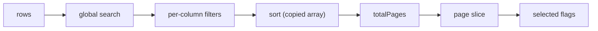

# Lists, Trees & Complex State

Once a list is no longer flat, the hard part stops being "how do I add an item" and becomes "what is the source of truth, and what do I derive from it". Trees, checkboxes, sortable rows, and tables are all exercises in keeping one canonical structure and computing every view from it.

---

## Transfer List

`Difficulty: Medium` `Probability: High`

### What are we building?

Two side-by-side lists, "Available" and "Selected", with a checkbox on every row, a header checkbox that selects the visible rows, and controls to move the checked items right or left. It is the canonical Material-UI transfer list and a clean test of set algebra, derived selection state, and the `indeterminate` checkbox.

### Example

```text
  Available                    Selected
[x] Write docs                [ ] Ship v2
[ ] Review PR     [ > ]       [x] Fix bug
[ ] Fix bug       [ < ]       [x] Write docs
---------------- ------------
 2 checked         Move all ->>
```

The header checkbox is empty, checked, or indeterminate (`-`) depending on how many visible rows are checked.

### What is the interviewer testing?

- Whether you store two arrays (left/right) or derive them from one list plus a set of selected ids
- Set operations: union, difference, intersection, and "select all visible"
- Deriving `allChecked` / `someChecked` during render instead of syncing them
- The `indeterminate` property, which is **not** an HTML attribute
- Stable keys and moving checked state along with moved items

### State Design

```ts
type Item = { id: string; label: string };

items: Item[]                 // the universe, source of truth
selectedIds: Set<string>      // membership = which list a row is in
leftChecked: Set<string>      // checkboxes on the Available side
rightChecked: Set<string>     // checkboxes on the Selected side
leftQuery: string             // optional per-list search
rightQuery: string
```

Derived every render:

```ts
const left  = items.filter((i) => !selectedIds.has(i.id) && matches(i, leftQuery));
const right = items.filter((i) =>  selectedIds.has(i.id) && matches(i, rightQuery));
const allLeftChecked  = left.length > 0 && left.every((i) => leftChecked.has(i.id));
const someLeftChecked = left.some((i) => leftChecked.has(i.id));
```

**Do NOT store:** the `left`/`right` arrays, their counts, `allLeftChecked`, `someLeftChecked`, or an `isSelected` flag inside each item. All of them are derived from `items` and the two/three sets, and every one of them can drift if duplicated.

### Basic Version

```ts
type Item = { id: string; label: string };

function toggleInSet(set: ReadonlySet<string>, id: string): Set<string> {
  const next = new Set(set);
  next.has(id) ? next.delete(id) : next.add(id);
  return next;
}

// `indeterminate` is a DOM property; it must be set imperatively.
function IndeterminateCheckbox({
  checked,
  indeterminate,
  onChange,
  label,
}: {
  checked: boolean;
  indeterminate: boolean;
  onChange: () => void;
  label: string;
}) {
  const ref = useRef<HTMLInputElement>(null);

  useEffect(() => {
    if (ref.current) ref.current.indeterminate = indeterminate;
  }, [indeterminate]);

  return (
    <input
      ref={ref}
      type="checkbox"
      checked={checked}
      onChange={onChange}
      aria-label={label}
    />
  );
}

export function TransferList({ items }: { items: Item[] }) {
  const [selectedIds, setSelectedIds] = useState<Set<string>>(new Set());
  const [leftChecked, setLeftChecked] = useState<Set<string>>(new Set());
  const [rightChecked, setRightChecked] = useState<Set<string>>(new Set());
  const [query, setQuery] = useState("");

  const match = (item: Item) =>
    item.label.toLowerCase().includes(query.trim().toLowerCase());

  const left = items.filter((i) => !selectedIds.has(i.id) && match(i));
  const right = items.filter((i) => selectedIds.has(i.id) && match(i));

  const stats = (list: Item[], checked: Set<string>) => ({
    all: list.length > 0 && list.every((i) => checked.has(i.id)),
    some: list.some((i) => checked.has(i.id)),
  });
  const leftStats = stats(left, leftChecked);
  const rightStats = stats(right, rightChecked);

  const moveChecked = (dir: "right" | "left") => {
    const checked = dir === "right" ? leftChecked : rightChecked;
    if (checked.size === 0) return;

    setSelectedIds((prev) => {
      const next = new Set(prev);
      checked.forEach((id) => (dir === "right" ? next.add(id) : next.delete(id)));
      return next;
    });

    // Clear the checkboxes that were just moved.
    (dir === "right" ? setLeftChecked : setRightChecked)(new Set());
  };

  const setAll = (side: "left" | "right", list: Item[], all: boolean) => {
    const next = all ? new Set<string>() : new Set(list.map((i) => i.id));
    (side === "left" ? setLeftChecked : setRightChecked)(next);
  };

  const renderSide = (
    side: "left" | "right",
    list: Item[],
    checked: Set<string>,
    stats: { all: boolean; some: boolean },
  ) => (
    <fieldset>
      <legend>{side === "left" ? "Available" : "Selected"}</legend>
      <label>
        <IndeterminateCheckbox
          checked={stats.all}
          indeterminate={stats.some && !stats.all}
          onChange={() => setAll(side, list, stats.all)}
          label={`Select all ${side}`}
        />
        Select all
      </label>
      <ul>
        {list.map((item) => (
          <li key={item.id}>
            <label>
              <input
                type="checkbox"
                checked={checked.has(item.id)}
                onChange={() =>
                  (side === "left" ? setLeftChecked : setRightChecked)((prev) =>
                    toggleInSet(prev, item.id),
                  )
                }
              />
              {item.label}
            </label>
          </li>
        ))}
      </ul>
      <p>{checked.size} checked</p>
    </fieldset>
  );

  return (
    <div>
      <input
        type="search"
        value={query}
        onChange={(e) => setQuery(e.target.value)}
        placeholder="Filter"
        aria-label="Filter both lists"
      />
      <div style={{ display: "flex", gap: 16, alignItems: "center" }}>
        {renderSide("left", left, leftChecked, leftStats)}
        <div>
          <button
            type="button"
            onClick={() => moveChecked("right")}
            disabled={leftChecked.size === 0}
            aria-label={`Move ${leftChecked.size} items to Selected`}
          >
            &gt;
          </button>
          <button
            type="button"
            onClick={() => moveChecked("left")}
            disabled={rightChecked.size === 0}
            aria-label={`Move ${rightChecked.size} items to Available`}
          >
            &lt;
          </button>
        </div>
        {renderSide("right", right, rightChecked, rightStats)}
      </div>
    </div>
  );
}
```

### How It Works

- `selectedIds` is the only thing that decides which side an item lives on. Moving is `next.add(id)` / `next.delete(id)` &mdash; a set difference, not array splicing across two arrays.
- `left` and `right` are recomputed from `items` and `selectedIds` on every render, so a move is reflected instantly and there is no second copy to keep in sync.
- `stats.all` / `stats.some` are derived from the *visible, filtered* list, so "select all" respects the current search. This is the subtle part interviewers probe: does select-all mean the whole dataset or the rows the user can see? Here it means what the user sees; document that choice.
- The header checkbox is `checked` when all visible rows are checked and `indeterminate` when only some are. Browsers render neither attribute for "partially checked", so `input.indeterminate` is assigned through a ref in an effect.
- New `Set`s are created on every toggle. Mutating the existing set would keep the same reference and React would skip the re-render.

### Edge Cases

- **Move-all vs move-checked:** ship "move all visible" as a second pair of buttons; it is the same set operation with `new Set(list.map((i) => i.id))` as the argument.
- **Checked item becomes hidden by a search:** its id stays in `leftChecked` but is not in `left`, so it is not counted and not moved. Either move it or clear hidden checks on query change; state the decision.
- **Duplicates:** identity is the `id`; duplicate labels are fine.
- **Empty sides:** disable the move buttons and show an empty state, not a collapsing box.
- **No movement possible:** a single item already on the right &mdash; the right list is the source of truth for ordering; do not let a user move the same item twice.
- **Very large universes:** a `Set` keeps membership O(1), but rendering thousands of rows needs virtualization (see **Virtualized List**).

### Interview Follow-ups

- **Level 1:** Two lists, per-row checkboxes, move checked both ways.
- **Level 2:** Header select-all with the indeterminate state.
- **Level 3:** Per-list search that filters without losing checked selection.
- **Level 4:** Move-all buttons and disabled states.
- **Level 5:** Reorder within the Selected list with up/down buttons (ids as keys, never indices).
- **Level 6:** A controlled API: `value: string[]` + `onChange(nextIds)`, so the component can be used in a form.
- **Level 7:** Make it a `<form>` field with named hidden inputs, or wire it to React Hook Form.
- **Level 8:** Keyboard support: Space toggles, Enter moves, and Ctrl+A selects the visible list.
- **Level 9:** Cross-list drag instead of buttons (this becomes the **Sortable List** and **Kanban** machinery).
- **Level 10:** Virtualize both panes for tens of thousands of options.

### Production Version

Expose a controlled component (`value`/`onChange`) so the state can live in a parent form. For huge datasets, pair a virtualized list with server-side search: fetch matches on the query and keep only the selected ids client-side. If drag between the panes is required, reach for `dnd-kit` rather than hand-rolling multi-list drag; the set logic above stays the same and the library only replaces the gesture layer.

### Accessibility

- Group each pane with `<fieldset>`/`<legend>` so screen readers announce "Available" and "Selected".
- Give the move buttons an accessible name that includes the count: `aria-label="Move 3 items to Selected"`. ">" alone is meaningless.
- Every checkbox needs a label; wrap the input in a `<label>` with the item text.
- Announce moves in a polite live region ("3 items moved to Selected") because otherwise only sighted users see the change.
- `disabled` on the move buttons communicates state; do not hide them.

### Performance

Sets make membership and difference O(1)/O(n). The real cost is rendering every option; filter and render are the visible work, so `useMemo` the filtered lists and virtualize the panes once options reach the thousands. Do not memoize the button handlers for a 30-item list &mdash; the bookkeeping costs more than the render.

### Testing

```text
✓ moves exactly the checked items to the other list
✓ clearing checked state after a move
✓ header checkbox is indeterminate when some visible rows are checked
✓ header checkbox selects/clears all visible rows
✓ select-all respects the active search filter
✓ move buttons are disabled when nothing is checked
✓ checked ids survive a search that hides their rows
```

### Common Mistakes

- Storing `left` and `right` as two arrays and trying to keep them synchronized.
- Mutating a `Set` in place (`set.delete(id)`) and wondering why nothing re-renders.
- Setting `indeterminate` as a JSX prop (`<input indeterminate={...}>`) &mdash; React does not forward it.
- Computing `allChecked` from the whole dataset while the user is filtered.
- Using the array index as the React key, so a moved row keeps the wrong checkbox state.

### Interview Takeaway

A transfer list is one list plus a set of ids. Every visible list, count, and "all/none/some" flag is derived. Get comfortable with `Set` operations and the imperative `indeterminate` property &mdash; the same pattern reappears in the Data Table's row selection.

---

## Nested Checkboxes

`Difficulty: Medium` `Probability: High`

### What are we building?

A checkbox tree where checking a parent checks every descendant, and a parent shows an indeterminate state when only some of its descendants are checked. The direction that matters is bottom-up: the parent's visual state is never stored, it is *derived* from its children.

### Example

```text
[-] Frontend
    [x] JavaScript
    [ ] TypeScript
    [x] CSS
[x] Backend
    [x] Node
    [x] Databases
[ ] Ops
```

`Frontend` is indeterminate because two of its three children are checked. `Backend` is checked because all of its children are.

### What is the interviewer testing?

- Recursion over a tree and a single `Set` of checked ids
- Deriving parent state instead of syncing it in both directions
- Correct indeterminate semantics at every level
- Immutable bulk updates (checking a parent touches the whole subtree)
- Whether ancestors need updating at all (they do not, if they are derived)

### State Design

```ts
type Node = { id: string; label: string; children?: Node[] };

data: Node[]           // immutable tree, source of truth
checked: Set<string>   // ids the user has checked
```

Derived per node during render:

```ts
type Tri = "checked" | "unchecked" | "indeterminate";

function collectSubtree(node: Node): string[] {
  return [node.id, ...(node.children?.flatMap(collectSubtree) ?? [])];
}

function subtreeState(node: Node, checked: ReadonlySet<string>): Tri {
  const ids = collectSubtree(node);
  const hits = ids.filter((id) => checked.has(id)).length;
  if (hits === 0) return "unchecked";
  if (hits === ids.length) return "checked";
  return "indeterminate";
}
```

**Do NOT store:** a parent's `checked`/`indeterminate` flag, a per-node `isChecked`, or an ancestor list. A parent is fully described by its subtree's ids and the one `checked` set. Storing it means two sources of truth that disagree the moment a leaf changes.

### Basic Version

```ts
type Node = { id: string; label: string; children?: Node[] };

function CheckboxNode({
  node,
  checked,
  onToggle,
}: {
  node: Node;
  checked: ReadonlySet<string>;
  onToggle: (node: Node) => void;
}) {
  const state = subtreeState(node, checked);

  return (
    <li>
      <IndeterminateCheckbox
        checked={state === "checked"}
        indeterminate={state === "indeterminate"}
        onChange={() => onToggle(node)}
        label={node.label}
      />
      {node.children?.length ? (
        <ul role="group">
          {node.children.map((child) => (
            <CheckboxNode key={child.id} node={child} checked={checked} onToggle={onToggle} />
          ))}
        </ul>
      ) : null}
    </li>
  );
}

export function NestedCheckboxes({ data }: { data: Node[] }) {
  const [checked, setChecked] = useState<Set<string>>(new Set());

  const toggle = (node: Node) => {
    const ids = collectSubtree(node);
    const state = subtreeState(node, checked);

    setChecked((prev) => {
      const next = new Set(prev);
      if (state === "checked") {
        ids.forEach((id) => next.delete(id));
      } else {
        // unchecked OR indeterminate -> check the whole subtree
        ids.forEach((id) => next.add(id));
      }
      return next;
    });
  };

  return (
    <ul role="tree" aria-label="Categories">
      {data.map((node) => (
        <CheckboxNode key={node.id} node={node} checked={checked} onToggle={toggle} />
      ))}
    </ul>
  );
}
```

### How It Works

- Checking a parent walks its subtree once (`collectSubtree`) and applies a single additive or subtractive set update. Nothing recurses back up because ancestors have no state to update &mdash; they read `subtreeState` on the next render.
- The three-way rule is deliberate: `unchecked -> checked`, and `indeterminate -> checked` (check everything). Only a fully `checked` node clears its subtree. This matches how file explorers and permission trees behave.
- A leaf's subtree is just `[self]`, so it can only be `checked` or `unchecked`; it never renders indeterminate. The same code path handles both leaves and branches.
- The recursive component keys each child by `child.id`, so expanding or reordering a tree does not misassign checkbox identity.

### Edge Cases

- **Deep trees and repeated work:** `subtreeState` re-walks the subtree for every node, which is O(n&sup2;) overall on a deep tree. Acceptable for interview sizes; normalize to a `Map<id, Node>` plus a parent map when the tree is large (see Performance).
- **Disabled nodes:** either skip them in `collectSubtree` or block toggling a branch that contains one; state the policy.
- **Empty `children: []`:** treat it as a leaf, not a branch with no children.
- **A parent with a checked child, then the child unchecked:** the parent becomes indeterminate automatically because it is derived.
- **Async / lazy children:** if children load on expand, `subtreeState` cannot see unseen children; require a full load before deciding the parent is fully checked, or track "all loaded".
- **Duplicate ids:** the `Set` collapses them; validate uniqueness at the data boundary.

### Interview Follow-ups

- **Level 1:** A flat list of independent checkboxes with a global select-all.
- **Level 2:** A nested tree where checking a parent checks its descendants (top-down only).
- **Level 3:** Bottom-up derivation with indeterminate parents (the version above).
- **Level 4:** Expand/collapse per branch, reusing the `openIds` set from **File Explorer / Tree View**.
- **Level 5:** A search box that filters leaves and auto-expands the ancestors of matches.
- **Level 6:** Lazy-loaded children fetched on expand.
- **Level 7:** A root "select all" that also shows indeterminate, and a list of the currently checked ids for form submission.
- **Level 8:** Disabled nodes, max-selection limits, and dependency rules (checking A forces B).
- **Level 9:** Move the whole reducer into `selectedReducer` with `toggleNode`, `setSubtree`, and `clear`.

### Production Version

For form integration, render the checked ids into hidden inputs or bind the tree to a `Controller` in React Hook Form. At scale, normalize the tree into a `Record<id, { parentId; childIds }>` map so `subtreeState` can be computed with incremental counts and updates are O(depth) instead of O(subtree). A `Set` of checked ids is still the right public shape; the map is an internal optimization.

### Accessibility

- Native `<input type="checkbox">` gives keyboard toggling and the correct role for free. Use `aria-checked="mixed"` only on ARIA widgets such as `role="treeitem"`; a native checkbox expresses "mixed" through the `indeterminate` property.
- Wrap each checkbox in a `<label>` so the accessible name is the node label.
- Use nested `<ul>`/`<li>` (or `role="group"`) to convey hierarchy; do not rely on indentation alone.
- Announce bulk changes ("3 items checked") in a live region when a parent toggles many descendants.

### Performance

The naive recursive derivation is O(n&sup2;) for a large tree. Two fixes: memoize `collectSubtree` per node with `useMemo`, or normalize the tree and precompute descendant counts. For very deep or very wide trees, virtualize the *flattened* visible rows (see **File Explorer / Tree View**) rather than rendering every recursive node.

### Testing

```text
✓ checking a leaf marks it and its ancestors indeterminate
✓ checking all children makes the parent checked
✓ checking a parent checks every descendant
✓ unchecking a fully checked parent clears the subtree
✓ a partially checked parent toggles to fully checked
✓ leaves never render indeterminate
✓ the checked set is exactly the union of user-toggled leaves
```

### Common Mistakes

- Storing `parentChecked` and updating it in an effect or in the toggle handler, then watching it drift.
- Checking a parent but forgetting to update descendants (or the reverse).
- Building the descendant list with mutation and passing the same array around.
- Using `key={index}` on a recursive list, so collapsing/expanding mixes up node state.
- Treating "mixed" as a third checkbox value in state instead of deriving it.

### Interview Takeaway

Bottom-up derived checkbox state is the same lesson as the Transfer List: keep the smallest set of facts (which ids are checked) and compute every parent's appearance. When nothing flows upward, most of the synchronization bugs disappear.

---

## File Explorer / Tree View

`Difficulty: Hard` `Probability: Very High`

### What are we building?

An IDE-style file explorer: a tree of folders and files, where clicking a folder expands or collapses it, clicking a file selects it, and the whole thing is keyboard-navigable like a native tree. This one problem bundles the levels interviewers actually grade: recursion, an expansion `Set`, flattening a tree into rows, full ARIA tree semantics, roving focus, and the awareness that huge trees need virtualization.

### Example

```text
▾ src
    ▾ components
        Button.tsx
        Modal.tsx
    App.tsx
    main.tsx
▸ public
  package.json
  README.md
```

`▾` marks an expanded folder, `▸` a collapsed one. Only the selected row is in the tab order; the arrow keys move between rows.

### What is the interviewer testing?

- A recursive component vs a flat render from a depth-first walk
- One `openIds` set instead of an `isOpen` boolean buried in the data
- Deriving the visible row list rather than storing it
- Full `role="tree"` / `role="treeitem"` / `role="group"` semantics with `aria-expanded`, `aria-level`, `aria-selected`
- Roving `tabindex`: exactly one focusable row at a time
- Knowing when to stop rendering and virtualize

### State Design

```ts
type TreeNode =
  | { id: string; name: string; type: "folder"; children: TreeNode[] }
  | { id: string; name: string; type: "file" };

data: TreeNode[]              // source of truth (immutable)
openIds: Set<string>          // expanded folder ids
selectedId: string | null     // committed selection
focusedId: string | null      // roving-tabindex target
query: string                 // optional search filter
```

Derived every render:

```ts
const rows: FlatNode[] = flattenVisible(data, openIds); // only visible nodes
const isExpanded = (id: string) => openIds.has(id && id);  // a Set lookup
```

**Do NOT store:** the visible-row list, a per-node `isOpen` flag, depth, `aria-level`, whether a node "hasVisibleChildren", or a parent pointer. All of these come from `data` and `openIds`. Storing the flattened list is the classic bug: after an expand, the stale array is one frame behind and focus jumps.

### Basic Version

```ts
type TreeNode =
  | { id: string; name: string; type: "folder"; children: TreeNode[] }
  | { id: string; name: string; type: "file" };

type FlatNode = { node: TreeNode; depth: number; parentId: string | null };

function flattenVisible(nodes: TreeNode[], openIds: ReadonlySet<string>): FlatNode[] {
  const out: FlatNode[] = [];
  const walk = (list: TreeNode[], depth: number, parentId: string | null) => {
    for (const node of list) {
      out.push({ node, depth, parentId });
      if (node.type === "folder" && openIds.has(node.id) && node.children.length > 0) {
        walk(node.children, depth + 1, node.id);
      }
    }
  };
  walk(nodes, 0, null);
  return out;
}

function TreeItemView({
  node,
  openIds,
  selectedId,
  onToggle,
  onSelect,
}: {
  node: TreeNode;
  openIds: ReadonlySet<string>;
  selectedId: string | null;
  onToggle: (id: string) => void;
  onSelect: (id: string) => void;
}) {
  const isFolder = node.type === "folder";
  const isOpen = isFolder && openIds.has(node.id);

  return (
    <li>
      <button
        type="button"
        onClick={() => (isFolder ? onToggle(node.id) : onSelect(node.id))}
        onFocus={() => onSelect(node.id)}
        aria-expanded={isFolder ? isOpen : undefined}
        aria-current={selectedId === node.id ? "true" : undefined}
      >
        {isFolder ? (isOpen ? "▾ " : "▸ ") : "• "}
        {node.name}
      </button>
      {isFolder && isOpen && node.children.length > 0 ? (
        <ul>
          {node.children.map((child) => (
            <TreeItemView
              key={child.id}
              node={child}
              openIds={openIds}
              selectedId={selectedId}
              onToggle={onToggle}
              onSelect={onSelect}
            />
          ))}
        </ul>
      ) : null}
    </li>
  );
}

export function FileExplorer({ data }: { data: TreeNode[] }) {
  const [openIds, setOpenIds] = useState<Set<string>>(new Set());
  const [selectedId, setSelectedId] = useState<string | null>(null);

  const toggle = (id: string) =>
    setOpenIds((prev) => {
      const next = new Set(prev);
      next.has(id) ? next.delete(id) : next.add(id);
      return next;
    });

  return (
    <ul role="tree" aria-label="Files">
      {data.map((node) => (
        <TreeItemView
          key={node.id}
          node={node}
          openIds={openIds}
          selectedId={selectedId}
          onToggle={toggle}
          onSelect={setSelectedId}
        />
      ))}
    </ul>
  );
}
```

### How It Works

The recursive version above is the easy level. The interview-grade version renders **one flat list** produced by a depth-first walk of only the visible nodes, which is what makes roving focus, `aria-level`, and virtualization trivial:

```ts
const rows = useMemo(() => flattenVisible(data, openIds), [data, openIds]);
```

- `flattenVisible` pushes a node, then recurses into it only if it is an open folder. The result is exactly the rows the user can see, in the order they appear on screen. A flat array means the keyboard handler is just "move to index &plusmn; 1", not "walk the tree again".
- `depth` is carried by the walk, so `aria-level={depth + 1}` is a lookup, not stored state. `parentId` rides along too, which makes "Arrow Left goes to the parent" and "Arrow Right descends into the first child" one array lookup each.
- `openIds` is the only expansion state. Toggling is a set add/delete. Collapsing a folder automatically hides its descendants because the walk stops there &mdash; there is no need to unselect or prune anything.
- Selection and focus are separate. `selectedId` is what the user chose; `focusedId` is which row owns the roving `tabindex`. In a tree, moving with arrows usually selects as it goes, but keeping the two concepts distinct is what lets you later support multi-select without rewriting navigation.

### Edge Cases

- **Empty folders:** still render them as expandable (or as `disabled`), but do not recurse. Decide whether the triangle shows before expanding.
- **Deep nesting:** `flattenVisible` recursion can blow the stack on pathological depths; cap or convert to an explicit stack if the data is untrusted.
- **Cyclic references:** an API-built "tree" with a back-edge will loop forever. Validate or track visited ids during the walk.
- **Duplicate names:** identity is `id`; two files can share a name across folders.
- **Selecting a collapsed folder's child, then collapsing the parent:** either move selection to the parent or keep it (it is simply not rendered). Choose and document.
- **Deleting the selected node:** move selection to the next visible sibling or the parent.
- **Renaming inline:** one `renamingId` + draft, same pattern as **Inline Editable List**; Escape cancels, Enter commits.
- **Search:** filter matches, then auto-open the ancestors of every match so results are visible. This is a derived `openIds`, not a second source of truth.
- **Huge trees:** virtualization (below) or an extremely narrow node component.

### Interview Follow-ups

- **Level 1:** Recursive render with click-to-expand folders.
- **Level 2:** `openIds: Set<string>` for expansion, plus Expand All / Collapse All.
- **Level 3:** Flatten to visible rows from a DFS (above); render the flat list.
- **Level 4:** Add `role="tree"` / `role="treeitem"` / `role="group"` and `aria-expanded` / `aria-level` / `aria-selected`.
- **Level 5:** Roving focus with Arrow Up/Down/Left/Right, Home/End, and Enter to select.
- **Level 6:** Inline rename, plus create/delete node through a `useReducer` tree reducer.
- **Level 7:** Search with auto-expanding ancestors and highlight.
- **Level 8:** Lazy-load a folder's children on first expand; show a spinner row.
- **Level 9:** Drag to move a node between folders (this is the **Kanban** drop logic applied to a tree).
- **Level 10:** Virtualize the flat rows for 100k-node repositories.

### Production Version

Use `dnd-kit` for drag-to-move (a tree drag adds drop-into-folder and drop-between-siblings targets), `react-arborist` for a batteries-included tree, and `react-window`/`@tanstack/react-virtual` for the flat rows. A tree reducer (`EXPAND`, `COLLAPSE`, `RENAME`, `CREATE`, `DELETE`, `MOVE`) keeps tree mutations immutable and testable. If the tree comes from the server, normalize to a `Record<id, Node>` map plus `childIds` so updates are O(depth), and keep the raw nested tree only as an adapter.

### Accessibility

This is where the File Explorer is won or lost.

- **Roles:** the container is `role="tree"`; each row is `role="treeitem"`; a nested list of children is `role="group"`. Do not use `role="tree"` on a `<ul>` and then forget the group wrappers.
- **`aria-expanded`** belongs on folders only (expandable items); omit it on files. Omit it or set it to `false` for folders that are collapsed.
- **`aria-level={depth + 1}`** tells the screen reader the hierarchy without relying on indentation.
- **`aria-selected="true"`** on the selected row; `aria-current` is an acceptable alternative but `aria-selected` matches the tree pattern.
- **Roving tabindex:** exactly one row has `tabIndex={0}` (the focused/selected row) and every other row has `tabIndex={-1}`. Tab enters the tree once; arrows move within it. Without this, every one of a thousand nodes is a tab stop.
- **Keyboard map:**
  - `ArrowDown` / `ArrowUp` &mdash; next / previous visible row.
  - `ArrowRight` &mdash; on a closed folder, open it; on an open folder, move to its first child; on a file, no-op.
  - `ArrowLeft` &mdash; on an open folder, close it; otherwise move to the parent row.
  - `Home` / `End` &mdash; first / last visible row.
  - `Enter` / `Space` &mdash; select (and toggle, if you map Enter to expand).
  - Letter keys &mdash; typeahead to the next node whose name starts with that letter.

```ts
const onKeyDown = (e: React.KeyboardEvent) => {
  const index = rows.findIndex((r) => r.node.id === focusedId);
  const move = (i: number) => {
    const clamped = Math.max(0, Math.min(rows.length - 1, i));
    setFocusedId(rows[clamped].node.id);
    setSelectedId(rows[clamped].node.id);
  };

  switch (e.key) {
    case "ArrowDown": e.preventDefault(); move(index + 1); break;
    case "ArrowUp":   e.preventDefault(); move(index - 1); break;
    case "ArrowRight": {
      e.preventDefault();
      const row = rows[index];
      if (row.node.type === "folder") {
        if (!openIds.has(row.node.id)) toggle(row.node.id);
        else move(index + 1);
      }
      break;
    }
    case "ArrowLeft": {
      e.preventDefault();
      const row = rows[index];
      if (row.node.type === "folder" && openIds.has(row.node.id)) toggle(row.node.id);
      else {
        const parent = rows.findIndex((r) => r.node.id === row.parentId);
        if (parent >= 0) move(parent);
      }
      break;
    }
    case "Home": e.preventDefault(); move(0); break;
    case "End":  e.preventDefault(); move(rows.length - 1); break;
  }
};
```

Focus is applied in an effect keyed on `focusedId`, using a `Map<string, HTMLElement>` of row refs, so the node is focused after it has mounted (important when an arrow key expanded a folder in the same render).

### Performance

- Memoize the DFS: `useMemo(() => flattenVisible(data, openIds), [data, openIds])`. Expanding one folder should not re-walk when unrelated state changes.
- Collapsing a folder removes a whole subtree from the render list for free &mdash; the flat model is inherently lazy about hidden nodes.
- Memoize `TreeRow` with `React.memo` and pass primitives (`depth`, `isOpen`) plus stable callbacks, so expanding one folder only re-renders the affected rows. Passing a new object literal per render defeats the memo.
- For huge trees, virtualize the flat rows (see **Virtualized List**). The flat DFS output is exactly the array a windowing library wants, which is the strongest argument for the flat model over recursive rendering.
- Keep `openIds` small operations: set add/delete is O(1); never rebuild the whole set for one toggle.

### Testing

```text
✓ renders root nodes collapsed by default
✓ clicking a folder node toggles its children
✓ openIds controls which descendants render
✓ flattenVisible returns only visible nodes in DFS order
✓ aria-expanded is true/false on folders and absent on files
✓ aria-level reflects nesting depth
✓ ArrowRight opens a closed folder and descends into an open one
✓ ArrowLeft closes an open folder, otherwise jumps to the parent
✓ Home/End move to the first/last visible row
✓ only one row has tabindex=0
```

### Common Mistakes

- Storing the visible-row list in state and syncing it with an effect.
- Putting `isOpen` on each node instead of a single `openIds` set.
- Using `key={index}` in the recursive list, so collapsing mixes up rows.
- Making every treeitem focusable (no roving `tabindex`), which makes Tab unusable.
- Forgetting `role="group"` around child lists, so screen readers lose the hierarchy.
- Re-rendering the entire tree on a single expand because callbacks are recreated inline.
- Ignoring virtualization, then freezing on a real repository.

### Interview Takeaway

Model the tree once, keep expansion in one `Set`, and derive the visible rows with a depth-first walk. That flat array unlocks ARIA, roving focus, and virtualization &mdash; which are the difference between a toy tree and a usable file explorer.

---

## Nested Comments

`Difficulty: Hard` `Probability: Medium`

### What are we building?

A threaded comment section: comments contain replies, replies contain replies, and a user can add a reply at any depth, collapse a thread, and see indentation that communicates depth. It is the recursive-tree update problem, but the emphasis is on immutable insertion and not re-rendering the world.

### Example

```text
Ada · 2h
The migration looks good.
  [ Collapse ] [ Reply ]
  └─ Lin · 1h
     Agreed, ship it.
       └─ Ada · 30m
          Nice. Merging now.
        [ Collapse ] [ Reply ]
```

`Collapse` hides a whole subtree and shows the reply count instead.

### What is the interviewer testing?

- A recursive immutable update: insert a reply into a nested tree without mutating
- Returning the *same* references for untouched siblings (structural sharing)
- Collapse state as one `Set` of ids, not a field on each comment
- Depth as a render argument, never stored
- Stable `id` keys and correct ordering of new replies

### State Design

```ts
type Comment = {
  id: string;
  author: string;
  body: string;
  createdAt: number;
  replies: Comment[];
};

comments: Comment[]          // source of truth, immutable
collapsed: Set<string>       // subtree ids that are hidden
replyingTo: string | null    // comment id, or null
draft: string                // reply text
```

Derived during render: each node's `depth` (passed down), a comment's total reply count (recursive), and whether it is collapsed (`collapsed.has(id)`).

**Do NOT store:** `depth`, `replyCount`, `isCollapsed`, or a flattened list (unless you are virtualizing). Depth and counts change whenever the tree changes; storing them guarantees they go stale. Collapse lives in one set so it is trivial to "collapse all".

### Basic Version

```ts
type Comment = {
  id: string;
  author: string;
  body: string;
  createdAt: number;
  replies: Comment[];
};

// Insert without mutating and without cloning untouched branches.
function addReply(list: Comment[], parentId: string, reply: Comment): Comment[] {
  let changed = false;
  const next = list.map((c) => {
    if (c.id === parentId) {
      changed = true;
      return { ...c, replies: [...c.replies, reply] };
    }
    const replies = addReply(c.replies, parentId, reply);
    if (replies !== c.replies) {
      changed = true;
      return { ...c, replies };
    }
    return c; // keep identity so React.memo and consumers can bail out
  });
  return changed ? next : list;
}

function countReplies(comment: Comment): number {
  return comment.replies.reduce((sum, r) => sum + 1 + countReplies(r), 0);
}

function CommentNode({
  comment,
  depth,
  collapsed,
  replyingTo,
  draft,
  onToggle,
  onReply,
  onDraft,
  onSubmit,
}: {
  comment: Comment;
  depth: number;
  collapsed: ReadonlySet<string>;
  replyingTo: string | null;
  draft: string;
  onToggle: (id: string) => void;
  onReply: (id: string) => void;
  onDraft: (value: string) => void;
  onSubmit: (parentId: string) => void;
}) {
  const isCollapsed = collapsed.has(comment.id);

  return (
    <li style={{ marginInlineStart: Math.min(depth, 5) * 16 }}>
      <article aria-label={`Comment by ${comment.author}`}>
        <header>
          <strong>{comment.author}</strong>{" "}
          <time dateTime={new Date(comment.createdAt).toISOString()}>
            {new Date(comment.createdAt).toLocaleString()}
          </time>
        </header>
        <p>{comment.body}</p>

        <div>
          <button type="button" aria-expanded={!isCollapsed} onClick={() => onToggle(comment.id)}>
            {isCollapsed ? `Expand (${countReplies(comment)})` : "Collapse"}
          </button>
          <button type="button" onClick={() => onReply(comment.id)}>
            Reply
          </button>
        </div>

        {replyingTo === comment.id && (
          <form
            onSubmit={(e) => {
              e.preventDefault();
              onSubmit(comment.id);
            }}
          >
            <textarea
              value={draft}
              onChange={(e) => onDraft(e.target.value)}
              aria-label={`Reply to ${comment.author}`}
            />
            <button type="submit" disabled={!draft.trim()}>
              Post reply
            </button>
          </form>
        )}
      </article>

      {!isCollapsed && comment.replies.length > 0 && (
        <ul>
          {comment.replies.map((reply) => (
            <CommentNode
              key={reply.id}
              comment={reply}
              depth={depth + 1}
              collapsed={collapsed}
              replyingTo={replyingTo}
              draft={draft}
              onToggle={onToggle}
              onReply={onReply}
              onDraft={onDraft}
              onSubmit={onSubmit}
            />
          ))}
        </ul>
      )}
    </li>
  );
}

export function CommentThread({ initial }: { initial: Comment[] }) {
  const [comments, setComments] = useState(initial);
  const [collapsed, setCollapsed] = useState<Set<string>>(new Set());
  const [replyingTo, setReplyingTo] = useState<string | null>(null);
  const [draft, setDraft] = useState("");

  const toggle = (id: string) =>
    setCollapsed((prev) => {
      const next = new Set(prev);
      next.has(id) ? next.delete(id) : next.add(id);
      return next;
    });

  const submit = (parentId: string) => {
    const body = draft.trim();
    if (!body) return;
    const reply: Comment = {
      id: crypto.randomUUID(),
      author: "You",
      body,
      createdAt: Date.now(),
      replies: [],
    };
    setComments((prev) => addReply(prev, parentId, reply));
    setDraft("");
    setReplyingTo(null);
  };

  return (
    <ul>
      {comments.map((c) => (
        <CommentNode
          key={c.id}
          comment={c}
          depth={0}
          collapsed={collapsed}
          replyingTo={replyingTo}
          draft={draft}
          onToggle={toggle}
          onReply={setReplyingTo}
          onDraft={setDraft}
          onSubmit={submit}
        />
      ))}
    </ul>
  );
}
```

### How It Works

- `addReply` walks the tree and only clones the nodes on the path to `parentId`. Untouched siblings keep their original object identity because the function returns `c` unchanged when its subtree did not change. That structural sharing is what lets a memoized `CommentNode` skip re-rendering branches that were not touched.
- It returns the original `list` reference when `parentId` was not found, so a stray reply targets nothing and React bails out instead of re-rendering the tree.
- `depth` flows down as a prop and is used to cap indentation (`Math.min(depth, 5)`) so a deep thread stays readable rather than marching off-screen.
- Collapse is a single `Set`. "Collapse all" is `new Set(allIds)`; "expand all" is `new Set()`. Neither touches the comment data.
- New replies are appended to the parent's `replies` array, so they appear at the bottom of that thread &mdash; the usual convention for comments.

### Edge Cases

- **Deep threads:** cap visual depth or flatten past a threshold ("continue this thread"), and consider that recursion has a stack limit on hostile data.
- **Deleting a parent:** decide between a tombstone (`[deleted]` keeping replies) and a cascade (remove the subtree). Tombstones preserve conversation context; cascades lose it. State the choice.
- **Very large threads:** virtualize using a flattened, visible-node list derived from `collapsed`, exactly like the **File Explorer / Tree View** DFS. The flat list is the render target; the tree is the data.
- **Optimistic posting:** append the reply immediately, then reconcile with the server id on success and remove it on failure (see **Optimistic Mutation with Rollback**).
- **A reply arriving while collapsed:** keep the collapsed state; the count should update so the user knows something changed.
- **XSS:** render `body` as text, never `dangerouslySetInnerHTML`.
- **Editing comments:** track `editingId` + draft, same as **Inline Editable List**.
- **Ordering:** newest-first vs oldest-first is a server concern; be consistent within a thread.

### Interview Follow-ups

- **Level 1:** Render a flat list of comments.
- **Level 2:** Render replies recursively.
- **Level 3:** Add a reply at any node (the immutable insert above).
- **Level 4:** Collapse/expand a subtree with a `Set`.
- **Level 5:** Cap indentation and show an indentation guide.
- **Level 6:** Edit and delete a comment, plus a tombstone for deleted parents.
- **Level 7:** Optimistic posting with rollback and a pending state.
- **Level 8:** Sort threads (newest / oldest / most replies) and "load more" per thread.
- **Level 9:** Normalize to `Record<id, Comment>` with `parentId` and reconstruct order; useful once comments stream in or update individually.
- **Level 10:** Virtualize the flattened visible comments and add realtime updates.

### Production Version

Normalize comments to a `Record<id, Comment>` map plus ordered child ids, so a single comment update (edit, vote, realtime event) is O(1) instead of a tree walk, and render the flattened visible list with a virtualizer. Posting is a mutation: optimistic insert, server id on success, rollback on error. TanStack Query's `useMutation` with `onMutate`/`onError` fits this exactly, and its cache gives you per-thread pagination.

### Accessibility

- Use nested `<ul>`/`<li>` so the hierarchy is conveyed structurally, and give each comment an accessible name (`aria-label="Comment by Ada"` or a visually hidden heading).
- The collapse control is a real `<button>` with `aria-expanded`; do not toggle with a clickable `<div>`. The button's visible label already communicates the action.
- `Reply` buttons need a name that identifies the target: `aria-label="Reply to Ada"`.
- Announce a posted reply in a live region so screen-reader users know it succeeded.
- Indentation is a visual cue only; never the sole signal of nesting. The list structure carries the meaning for assistive tech.
- If you support keyboard shortcuts, scope them so they do not fire while typing in the reply textarea.

### Performance

- `addReply` returns unchanged references for untouched branches, which is what makes memoization effective. Wrap `CommentNode` in `React.memo` and pass stable callbacks so a single reply does not re-render the entire tree.
- If you memoize, the recursive insert must preserve identity as above; a naive `.map((c) => ({ ...c, replies: recurse(c.replies) }))` clones every node and defeats the memo.
- `countReplies` is O(subtree). Do not call it in a loop over a large thread; compute it during the same pass or store a denormalized count on the server.
- For thousands of comments, flatten the visible nodes and virtualize. A collapsed subtree should not mount any DOM.

### Testing

```text
✓ renders nested replies with increasing depth
✓ adding a reply inserts it under the correct parent
✓ addReply does not mutate the original tree
✓ untouched siblings keep referential identity
✓ collapsing hides a subtree and shows the reply count
✓ expanding restores it
✓ submitting an empty reply is blocked
✓ deleting a parent keeps its children (tombstone) or removes them, per policy
```

### Common Mistakes

- Mutating the tree: `comment.replies.push(reply)`.
- Cloning every node on every insert, so memoization never helps.
- Using the array index as the key, so inserting a reply reuses the wrong node.
- Storing `depth` or `replyCount` on each comment and forgetting to update them.
- One `isCollapsed` boolean per comment instead of a set, making "collapse all" awkward.
- Rendering user text as HTML.

### Interview Takeaway

Nested comments are the transfer-list lesson applied to a tree: one immutable structure, derived depth and counts, and a single set for the transient UI state. The one genuinely new skill is the recursive immutable insert that returns unchanged references for untouched branches &mdash; that is what makes a tree both correct and fast.

---

## Sortable List

`Difficulty: Medium` `Probability: High`

### What are we building?

A list of rows the user can reorder by dragging. The output is the same list in a new order, persisted as an array of ids. This is the single-container reorder primitive; it is the building block the **Drag-and-Drop Kanban** extends to multiple containers.

### Example

```text
⠿ Design tokens
⠿ Components        <- dragging "Layout" above "Components"
⠿ Layout
⠿ Pages
```

A dashed line or gap shows where the row will land when dropped.

### What is the interviewer testing?

- Reordering an array immutably with a stable identity (ids, not indices)
- The native HTML5 Drag and Drop API: `draggable`, `dragstart`, `dragover`, `drop`, `dragend`
- `preventDefault` on `dragover` (without it, drop never fires)
- Cleaning up drag state on `dragend` even when the drop happens outside a target
- A keyboard-accessible alternative, because HTML5 DnD is mouse-only

### State Design

```ts
type Item = { id: string; label: string };

items: Item[]              // source of truth, ordered
dragId: string | null      // the row being dragged
overId: string | null      // the row it is hovering, for the insertion indicator
```

**Do NOT store:** a separate "ordered ids" array that mirrors `items`, a `draggingIndex`, or a copy of the list created on drag start. `dragId`/`overId` describe the gesture; `items` describes the result. Indices go stale the moment the list changes; ids do not.

### Basic Version

```ts
type Item = { id: string; label: string };

function moveBefore<T extends { id: string }>(list: T[], dragId: string, overId: string): T[] {
  const from = list.findIndex((i) => i.id === dragId);
  const to = list.findIndex((i) => i.id === overId);
  if (from === -1 || to === -1 || from === to) return list;

  const next = list.slice();
  const [moved] = next.splice(from, 1);
  next.splice(to, 0, moved);
  return next;
}

export function SortableList({ initial }: { initial: Item[] }) {
  const [items, setItems] = useState(initial);
  const [dragId, setDragId] = useState<string | null>(null);
  const [overId, setOverId] = useState<string | null>(null);

  return (
    <ul aria-label="Reorderable list">
      {items.map((item) => (
        <li
          key={item.id}
          draggable
          onDragStart={(e) => {
            setDragId(item.id);
            e.dataTransfer.effectAllowed = "move";
            // Required by Firefox to actually start a drag.
            e.dataTransfer.setData("text/plain", item.id);
          }}
          onDragOver={(e) => {
            e.preventDefault(); // REQUIRED: allows the drop
            e.dataTransfer.dropEffect = "move";
            if (overId !== item.id) setOverId(item.id);
          }}
          onDrop={(e) => {
            e.preventDefault();
            if (dragId) setItems((prev) => moveBefore(prev, dragId, item.id));
            setDragId(null);
            setOverId(null);
          }}
          onDragEnd={() => {
            // Always runs, even if the drop missed every target.
            setDragId(null);
            setOverId(null);
          }}
          style={{
            opacity: dragId === item.id ? 0.4 : 1,
            borderTop: overId === item.id && dragId !== item.id ? "2px solid #4f8" : "2px solid transparent",
          }}
        >
          <span aria-hidden="true">⠿</span> {item.label}
        </li>
      ))}
    </ul>
  );
}
```

### How It Works

- `moveBefore` copies the array with `slice()`, splices the dragged item out, and splices it back at the hovered item's index. `Array.prototype.splice` mutates, so it must run on the copy. The result is a brand-new array with the same item references.
- `aria-dropeffect` is deprecated; the visual indicator (`overId`) plus a live-region announcement is the modern substitute.
- `e.preventDefault()` inside `onDragOver` is mandatory. Without it the browser treats the element as a non-drop-target and `onDrop` never fires &mdash; the single most common DnD bug.
- `e.dataTransfer.setData` is required for Firefox; without a payload the drag does not start. The value is not needed by the handler because `dragId` already holds the id, but the call is not optional.
- `onDragEnd` runs on the source element whether the drop succeeded or was cancelled, so it is the safe place to reset `dragId` and `overId`. Relying only on `onDrop` leaves rows stuck at 40% opacity when the user drops on empty space.
- Reordering is computed once on drop, not on every `dragover`. The only per-move render is the insertion indicator, which is cheap.

Because HTML5 DnD does not fire on touch devices, the production version either adds an up/down keyboard control or switches to pointer events. A pointer-event implementation tracks `pointerdown` &rarr; `setPointerCapture` &rarr; `pointermove` (compute the index under the cursor) &rarr; `pointerup` (commit), and works uniformly on touch and mouse.

### Edge Cases

- **Drop outside any target:** `onDragEnd` clears the gesture; do not commit a reorder.
- **Drop on itself:** `moveBefore` early-returns when `from === to`.
- **Drag over the source row:** the indicator should not point at itself; guard with `dragId !== item.id`.
- **Reorder + active filter/search:** the visible order is a subsequence of the array. Reordering by id within the full array while only some rows are visible can move items past hidden siblings. Decide whether to disable drag while filtered or reorder only the visible slice.
- **Nested interactive controls** (a button inside a row): set `draggable` on the row and mark inner controls `draggable={false}`, or the browser may drag the control.
- **Keyboard:** provide Move Up / Move Down buttons or a grab-and-arrow mode; HTML5 DnD is not keyboard-operable.
- **Persistence:** save the ordered id array on drop; if the save fails, roll back the local reorder.
- **Virtualized list:** dragging across a virtualized window needs autoscroll and stable window tracking; keep it out of scope unless asked.
- **Stable keys:** after reorder, React reuses the right DOM node only if the key is `id`.

### Interview Follow-ups

- **Level 1:** Reorder with Move Up / Move Down buttons (keyboard-accessible by construction).
- **Level 2:** HTML5 drag and drop within one list (above).
- **Level 3:** Show an insertion indicator and dim the source row.
- **Level 4:** Pointer-event implementation that also works on touch.
- **Level 5:** Keyboard "lift, move, drop" mode with live announcements.
- **Level 6:** Multi-select drag (move a set of rows together).
- **Level 7:** Drag a row between two lists &mdash; this is the bridge to the **Drag-and-Drop Kanban**.
- **Level 8:** Persist order, with optimistic update and rollback.
- **Level 9:** Virtualized sortable list with autoscroll near the edges.
- **Level 10:** Grouping rules (some items cannot cross a boundary) and cancel-on-Escape.

### Production Version

`dnd-kit` is the modern choice: it is built on pointer events, works on touch, supports sensors, collision detection, and built-in screen-reader announcements and keyboard coordinates. Reach for it when the interaction must support keyboard and touch out of the box. The `moveBefore`-style helper and the "commit on drop, not on move" discipline stay identical &mdash; the library replaces the gesture layer, not the state model.

### Accessibility

- A drag handle should be a real focusable control (`<button aria-label="Reorder Design tokens">`), not a decorative glyph.
- Provide a keyboard mechanism: Space/Enter to lift, Arrow Up/Down to move, Space/Enter to drop, Escape to cancel. `dnd-kit` ships this; hand-rolled versions must implement it.
- Announce each move in a polite live region: "Design tokens moved to position 2 of 4".
- `aria-grabbed` is deprecated; use `aria-roledescription="draggable item"` and the live region instead.
- Never make color or motion the only indicator that a drop will occur.
- Move Up / Move Down buttons are a perfectly good accessible fallback and are worth shipping even alongside drag.

### Performance

- Only `overId` changes during a drag; do not put pointer coordinates in React state or you re-render the list on every mouse move.
- CSS `transform` on the dragged row (and a placeholder gap) is GPU-friendly; avoid animating `top`/`left`.
- For long lists, virtualize and implement autoscroll; a plain long list is fine under a few hundred rows.
- Keep item components memoized and callbacks stable so reordering re-renders only the affected rows.

### Testing

```text
✓ moveBefore returns a new array with the item at the target index
✓ moveBefore is a no-op when drag and drop ids match
✓ dropping commits the new order
✓ dragend clears state when the drop is outside any target
✓ dragover calls preventDefault (drop is reachable)
✓ the source row is dimmed and the target shows an indicator
✓ Move Up/Down reorders via keyboard
✓ the reordered order is persisted on save
```

### Common Mistakes

- Forgetting `e.preventDefault()` in `onDragOver`, so drops never fire.
- No `onDragEnd` cleanup, leaving the dragged row permanently dimmed.
- Mutating `items` with `splice` directly instead of on a copy.
- Using the index as the key, so the wrong DOM node is reused after reorder.
- Omitting `dataTransfer.setData`, breaking Firefox.
- Shipping mouse-only drag with no keyboard fallback.
- Reordering past hidden items when a filter is active.

### Interview Takeaway

Sortable list is "compute the new array once, on drop, keyed by id". Track the gesture with `dragId`/`overId`, keep the data in `items`, and always clean up in `onDragEnd`. The same `moveBefore` helper is reused verbatim in the Kanban.

---

## Drag-and-Drop Kanban

`Difficulty: Hard` `Probability: High`

### What are we building?

A multi-column board (To Do / In Progress / Done) where cards can be reordered within a column and moved across columns, dropping at a precise position. It is the **Sortable List** generalized to multiple containers, and it is where the state model earns its keep.

### Example

```text
  To Do            In Progress          Done
┌──────────┐     ┌──────────┐        ┌──────────┐
│ Design DB│     │ API auth │        │ Scaffold │
│ Fix login│     │ [card]   │        │ CI       │
└──────────┘     └──────────┘        └──────────┘
        └──── dropping "Design DB" between API auth and the gap
```

### What is the interviewer testing?

- A normalized state model: columns hold card *ids*, cards live in one map
- Reordering within a column and moving across columns with one function
- Computing the insertion index from the hovered card (above/below midpoint)
- Empty columns as valid drop targets
- Keeping drag gestures out of persistent state until drop
- The accessibility fallback, which is the hard part

### State Design

```ts
type Card = { id: string; title: string };
type Column = { id: string; title: string; cardIds: string[] };

columns: Column[]                      // ordered columns, ordered card ids
cardsById: Record<string, Card>        // the single card store
drag: { cardId: string; fromColumnId: string } | null
over: { columnId: string; index: number } | null
```

**Do NOT store:** the same card in both `columns[*].cardIds` and a positional array of card objects, a `dragging` boolean on the card, or the resolved `Card[]` per column. A card's title lives in exactly one place (`cardsById`); its position is exactly one entry in one column's `cardIds`. Resolving `column.cardIds.map((id) => cardsById[id])` during render is the whole point.

### Basic Version

```ts
type Card = { id: string; title: string };
type Column = { id: string; title: string; cardIds: string[] };

function reorder<T>(list: T[], from: number, to: number): T[] {
  const next = list.slice();
  const [moved] = next.splice(from, 1);
  next.splice(to, 0, moved);
  return next;
}

function moveCard(
  columns: Column[],
  cardId: string,
  toColumnId: string,
  toIndex: number,
): Column[] {
  const fromColumn = columns.find((c) => c.cardIds.includes(cardId));
  if (!fromColumn) return columns;

  const fromIndex = fromColumn.cardIds.indexOf(cardId);

  // When moving down inside the same column, the removal shifts the target.
  let index = toIndex;
  if (fromColumn.id === toColumnId && fromIndex < toIndex) index -= 1;

  return columns.map((col) => {
    if (col.id === fromColumn.id && col.id === toColumnId) {
      return { ...col, cardIds: reorder(col.cardIds, fromIndex, index) };
    }
    if (col.id === fromColumn.id) {
      return { ...col, cardIds: col.cardIds.filter((id) => id !== cardId) };
    }
    if (col.id === toColumnId) {
      const ids = col.cardIds.slice();
      ids.splice(index, 0, cardId);
      return { ...col, cardIds: ids };
    }
    return col;
  });
}

export function Kanban({
  initialColumns,
  cardsById,
}: {
  initialColumns: Column[];
  cardsById: Record<string, Card>;
}) {
  const [columns, setColumns] = useState(initialColumns);
  const [drag, setDrag] = useState<{ cardId: string; fromColumnId: string } | null>(null);
  const [over, setOver] = useState<{ columnId: string; index: number } | null>(null);

  const commit = (columnId: string, index: number) => {
    if (drag) {
      setColumns((prev) => moveCard(prev, drag.cardId, columnId, index));
    }
    setDrag(null);
    setOver(null);
  };

  return (
    <div style={{ display: "flex", gap: 16, alignItems: "flex-start" }}>
      {columns.map((column) => {
        const cards = column.cardIds.map((id) => cardsById[id]).filter(Boolean);
        return (
          <section
            key={column.id}
            aria-label={column.title}
            onDragOver={(e) => {
              e.preventDefault();
              // Hovering the column background means "append at the end".
              if (over?.columnId !== column.id || over.index !== cards.length) {
                setOver({ columnId: column.id, index: cards.length });
              }
            }}
            onDrop={(e) => {
              e.preventDefault();
              commit(column.id, over?.index ?? cards.length);
            }}
          >
            <h3>
              {column.title} <span>({cards.length})</span>
            </h3>

            <ul>
              {cards.map((card, index) => (
                <li
                  key={card.id}
                  draggable
                  onDragStart={(e) => {
                    e.dataTransfer.effectAllowed = "move";
                    e.dataTransfer.setData("text/plain", card.id);
                    setDrag({ cardId: card.id, fromColumnId: column.id });
                  }}
                  onDragOver={(e) => {
                    e.preventDefault();
                    const rect = e.currentTarget.getBoundingClientRect();
                    const below = e.clientY - rect.top > rect.height / 2;
                    const at = below ? index + 1 : index;
                    if (over?.columnId !== column.id || over.index !== at) {
                      setOver({ columnId: column.id, index: at });
                    }
                  }}
                  onDrop={(e) => {
                    e.preventDefault();
                    e.stopPropagation();
                    commit(column.id, over?.index ?? index);
                  }}
                  onDragEnd={() => {
                    setDrag(null);
                    setOver(null);
                  }}
                  style={{ opacity: drag?.cardId === card.id ? 0.4 : 1 }}
                >
                  {card.title}
                </li>
              ))}
            </ul>

            {cards.length === 0 && <p>Drop cards here</p>}
          </section>
        );
      })}
    </div>
  );
}
```

### How It Works

- State is normalized: `cardsById` is the single card store, and each `Column.cardIds` is an ordered list of ids. The rendered cards are `column.cardIds.map((id) => cardsById[id])`, derived on every render. Title edits touch one map entry; moves touch only the two affected `cardIds` arrays.
- `moveCard` is the general operation. Moving within a column is a reorder; moving across columns is a remove plus an insert. The `fromIndex < toIndex` adjustment compensates because the dragged card is removed before it is re-inserted; without it, dragging a card down by one lands it one slot too far.
- The insertion index comes from the pointer's position inside the hovered card: above the midpoint &rarr; insert before, below &rarr; insert after (`index + 1`). Hovering the column *background* means "append to the end", which is also how an empty column accepts a drop.
- Only `drag` and `over` change during the gesture. The persistent `columns` array updates exactly once, on drop. This keeps the render count low and makes cancel trivial.
- Empty columns still render a `ul` (or a placeholder) with `onDragOver`/`onDrop`, so they remain valid targets.
- The relationship to the **Sortable List** is direct: `reorder` is shared, `moveCard` adds the cross-container case, and the drag gesture (`drag`/`over`) is the same `dragId`/`overId` idea with a column added.

### Edge Cases

- **Drop on the same card / same position:** `moveCard` should detect a no-op and return the same `columns` reference so React bails out.
- **Drop outside the board:** `onDragEnd` clears `drag`/`over`; no cards move.
- **Empty column:** the placeholder `ul` must still call `preventDefault` in `onDragOver`.
- **Very tall columns / page scroll:** implement autoscroll while dragging near the viewport edge.
- **Touch devices:** HTML5 DnD does not work; use pointer events or a library.
- **Filtering/search:** the visible card order is a subsequence; disable cross-position drops or define the mapping between visible and full indices.
- **Persistence:** optimistic move plus rollback on failure.
- **WIP limits:** reject a drop into a full column, or allow it and flag the violation visually.
- **Card count / column count:** render counts from `cardIds.length`; never store them.

### Interview Follow-ups

- **Level 1:** Render static columns and cards.
- **Level 2:** Reorder cards within a single column.
- **Level 3:** Move cards across columns with a correct insertion index.
- **Level 4:** Placeholder gap and dimmed source card while dragging.
- **Level 5:** Empty-column drop targets and a column-level "append" drop.
- **Level 6:** Keyboard accessibility: pick up (Space), move between positions/columns (arrows), drop (Space), cancel (Escape), with live announcements.
- **Level 7:** Add / edit / delete cards and columns.
- **Level 8:** WIP limits per column with a visual warning.
- **Level 9:** Optimistic persistence with rollback and a saving indicator.
- **Level 10:** Multi-select drag, filtering, and realtime remote moves.

### Production Version

`dnd-kit` supports multiple containers with `SortableContext` per column and `useDroppable` for empty columns, and it includes the keyboard sensor and screen-reader announcements. Persist moves optimistically: apply `moveCard` locally, send `{ cardId, toColumnId, toIndex }`, and roll back on error. For collaborative boards, reconcile remote moves too; because state is normalized, applying a remote move is the same `moveCard` call.

### Accessibility

The hard requirement interviewers probe:

- Cards should be `role="listitem"` inside a labelled column; the column heading is the group name.
- Provide a non-drag path to move a card: a focusable card with keyboard controls, or a "Move to..." menu listing the columns and positions. Drag alone is not keyboard- or screen-reader-accessible.
- If you implement lift/move/drop: Space lifts the card, `ArrowLeft`/`ArrowRight` change column, `ArrowUp`/`ArrowDown` change position, Space drops, Escape cancels. Announce each step in a polite live region ("Design DB, In Progress, position 2 of 3").
- Keep focus on the moved card after a drop so keyboard users do not lose their place.
- Never convey column membership by color only; the heading and the accessible name carry it.
- Announce drop failures and WIP-limit rejections.

### Performance

- Normalize and memoize `column.cardIds.map((id) => cardsById[id])`, and wrap the card in `React.memo`, so moving one card does not re-render every card in every column.
- Only `over` changes during the drag; keep pointer coordinates out of React state.
- `moveCard` allocates a new array for the two affected columns and reuses the rest, which is the minimum necessary work.
- Do not virtualize columns during drag unless you also implement autoscroll; windowing a drag source is a known hard problem.
- Keep `cardsById` updates surgical (spread one entry), so an edit re-renders one card.

### Testing

```text
✓ moveCard reorders within a column
✓ moveCard moves a card to another column at the given index
✓ moving down within the same column lands one slot lower, not two
✓ dropping on an empty column inserts at index 0
✓ dropping outside the board leaves columns unchanged
✓ the source card is dimmed and the placeholder shows the target
✓ card counts update after a move
✓ an optimistic move rolls back if persistence fails
```

### Common Mistakes

- Storing cards inside columns *and* in a card map, then keeping them in sync.
- Forgetting the same-column index adjustment, so downward moves overshoot by one.
- Putting pointer coordinates or the whole hovered card in state on every `dragover`.
- No `onDragEnd` cleanup, leaving a ghost card.
- No keyboard/assistive fallback for a core action.
- Mutating `cardIds` with `splice` directly.
- Losing a card on a failed persistence call because the optimistic move was never rolled back.

### Interview Takeaway

A Kanban is a normalized store (`cardsById`) plus ordered id lists per column, and one `moveCard` function that handles both within- and across-column moves. Keep the gesture in ephemeral state, commit once on drop, and always provide a non-drag path. The Sortable List teaches the reorder; the Kanban teaches the multi-container generalization.

---

## Data Table

`Difficulty: Hard` `Probability: Very High`

### What are we building?

The most requested "real app" component: a table that can be configured with columns, sorted, filtered per column, searched globally, paginated, and row-selected, with a server-side mode that swaps the same UI onto a remote API. The follow-ups push into editable cells, column visibility and resizing, and a reusable column-config API. Almost every one of these features is a derived view over one row array, so the whole problem is a test of not storing what you can compute.

### Example

```text
Search all: [ ada            ]                     Showing 1-10 of 243

 Name ▲        Email            Role     Active
 [x] Ada Lovelace  ada@...      Admin    [x]
 [ ] Alan Turing   alan@...     Editor   [ ]
 [ ] Grace Hopper  grace@...    Viewer   [x]

 Page 1 of 25   [ < ]  [ > ]      [x] 3 selected
```

The header checkbox is indeterminate because some, not all, visible rows are selected. `▲` marks the sorted column.

### What is the interviewer testing?

- A pure derived pipeline: filter &rarr; sort &rarr; paginate, all in `useMemo`
- Immutable sorting (`.sort` mutates; copy first) and a correct comparator
- Stable row keys (`id`) surviving sort, filter, and pagination
- Selection with select-all and the `indeterminate` header state
- The mental model shift to server-side mode: query state instead of a full row array
- Loading, error, and empty states, plus aborting stale requests

### State Design

```ts
type SortDir = "asc" | "desc";

type Column<T> = {
  key: keyof T & string;
  header: string;
  sortable?: boolean;
  filterable?: boolean;
  editable?: boolean;
  width?: number;
  render?: (row: T) => React.ReactNode;
};

type TableState<T> = {
  sort: { key: keyof T & string; dir: SortDir } | null;
  filters: Record<string, string>;          // per-column contains filters
  query: string;                            // global search
  page: number;
  pageSize: number;
  selectedIds: Set<string>;
  editingCell: { rowId: string; key: string } | null;
  draft: string;
  visibleKeys: Set<string>;                 // column visibility
  widths: Record<string, number>;           // column resizing
};
```

Server mode replaces the in-memory rows with query state plus a response:

```ts
type ServerState<T> = {
  rows: T[];          // just the current page
  total: number;      // for page count
  loading: boolean;
  error: string | null;
} & Pick<TableState<T>, "sort" | "filters" | "query" | "page" | "pageSize">;
```

**Do NOT store:** the sorted array, the filtered array, the paginated slice, `totalPages`, `allSelected`/`someSelected`, or the array of visible columns. Every one is a pure function of the rows plus the state above. In server mode, do **not** slice or sort on the client &mdash; the server owns the page &mdash; but still derive `totalPages` and selection flags.

### Basic Version

```ts
type SortDir = "asc" | "desc";

type Column<T> = {
  key: keyof T & string;
  header: string;
  sortable?: boolean;
  filterable?: boolean;
  render?: (row: T) => React.ReactNode;
};

function compareValues(a: unknown, b: unknown): number {
  if (a == null && b == null) return 0;
  if (a == null) return -1;
  if (b == null) return 1;
  if (typeof a === "number" && typeof b === "number") return a - b;
  return String(a).localeCompare(String(b));
}

export function DataTable<T extends { id: string }>({
  rows,
  columns,
  pageSize = 10,
}: {
  rows: T[];
  columns: Column<T>[];
  pageSize?: number;
}) {
  const [sort, setSort] = useState<{ key: keyof T & string; dir: SortDir } | null>(null);
  const [filters, setFilters] = useState<Record<string, string>>({});
  const [query, setQuery] = useState("");
  const [page, setPage] = useState(1);
  const [selectedIds, setSelectedIds] = useState<Set<string>>(new Set());

  // The whole pipeline is derived. One memo, one pass, no stored intermediates.
  const processed = useMemo(() => {
    const q = query.trim().toLowerCase();

    const filtered = rows.filter((row) => {
      const matchesQuery =
        !q || columns.some((c) => String(row[c.key] ?? "").toLowerCase().includes(q));
      if (!matchesQuery) return false;

      return columns.every((c) => {
        if (!c.filterable) return true;
        const needle = (filters[c.key] ?? "").trim().toLowerCase();
        if (!needle) return true;
        return String(row[c.key] ?? "").toLowerCase().includes(needle);
      });
    });

    if (!sort) return filtered;

    const dir = sort.dir === "asc" ? 1 : -1;
    // Copy before sorting: Array.prototype.sort mutates in place.
    return [...filtered].sort(
      (a, b) => compareValues(a[sort.key], b[sort.key]) * dir,
    );
  }, [rows, columns, filters, query, sort]);

  const totalPages = Math.max(1, Math.ceil(processed.length / pageSize));
  const safePage = Math.min(page, totalPages);
  const pageRows = processed.slice((safePage - 1) * pageSize, safePage * pageSize);

  const allSelected = pageRows.length > 0 && pageRows.every((r) => selectedIds.has(r.id));
  const someSelected = pageRows.some((r) => selectedIds.has(r.id));

  const toggleSort = (key: keyof T & string) =>
    setSort((prev) =>
      prev?.key !== key
        ? { key, dir: "asc" }
        : prev.dir === "asc"
          ? { key, dir: "desc" }
          : null, // third click clears sorting
    );

  const toggleRow = (id: string) =>
    setSelectedIds((prev) => {
      const next = new Set(prev);
      next.has(id) ? next.delete(id) : next.add(id);
      return next;
    });

  const togglePage = () =>
    setSelectedIds((prev) => {
      const next = new Set(prev);
      pageRows.forEach((r) => (allSelected ? next.delete(r.id) : next.add(r.id)));
      return next;
    });

  return (
    <div>
      <input
        type="search"
        value={query}
        onChange={(e) => {
          setQuery(e.target.value);
          setPage(1); // a new search invalidates the current page
        }}
        placeholder="Search all columns"
        aria-label="Search all columns"
      />

      <table>
        <caption>Records ({processed.length})</caption>
        <thead>
          <tr>
            <th scope="col">
              <IndeterminateCheckbox
                checked={allSelected}
                indeterminate={someSelected && !allSelected}
                onChange={togglePage}
                label="Select all rows on this page"
              />
            </th>
            {columns.map((col) => {
              const active = sort?.key === col.key;
              return (
                <th
                  key={col.key}
                  scope="col"
                  aria-sort={
                    active ? (sort!.dir === "asc" ? "ascending" : "descending") : "none"
                  }
                >
                  {col.sortable ? (
                    <button type="button" onClick={() => toggleSort(col.key)}>
                      {col.header}
                      {active ? (sort!.dir === "asc" ? " ▲" : " ▼") : ""}
                    </button>
                  ) : (
                    col.header
                  )}
                  {col.filterable && (
                    <input
                      value={filters[col.key] ?? ""}
                      onChange={(e) => {
                        setFilters((f) => ({ ...f, [col.key]: e.target.value }));
                        setPage(1);
                      }}
                      aria-label={`Filter by ${col.header}`}
                    />
                  )}
                </th>
              );
            })}
          </tr>
        </thead>

        <tbody>
          {pageRows.map((row) => (
            <tr key={row.id}>
              <td>
                <input
                  type="checkbox"
                  checked={selectedIds.has(row.id)}
                  onChange={() => toggleRow(row.id)}
                  aria-label={`Select row ${row.id}`}
                />
              </td>
              {columns.map((col) => (
                <td key={col.key}>
                  {col.render ? col.render(row) : String(row[col.key] ?? "")}
                </td>
              ))}
            </tr>
          ))}
        </tbody>
      </table>

      {pageRows.length === 0 && <p role="status">No matching rows.</p>}

      <nav aria-label="Pagination">
        <button
          type="button"
          onClick={() => setPage((p) => Math.max(1, p - 1))}
          disabled={safePage === 1}
        >
          Previous
        </button>
        <span>
          Page {safePage} of {totalPages}
        </span>
        <button
          type="button"
          onClick={() => setPage((p) => Math.min(totalPages, p + 1))}
          disabled={safePage === totalPages}
        >
          Next
        </button>
      </nav>

      <p role="status">{selectedIds.size} selected</p>
    </div>
  );
}
```

### How It Works

The client pipeline is a single pure function of state:



- `processed` is derived inside one `useMemo`. Filtering, then sorting, then slicing happens in that order; putting sort before filter wastes work, and paginating before filter is simply wrong.
- `[...filtered].sort(...)` copies first because `sort` mutates its receiver. Sorting the memoized `filtered` array in place would silently corrupt it; on the next run the array is already ordered and the comparator's stable behavior changes.
- `totalPages` and `safePage` are derived. When a search shrinks the result set below the current page, `safePage` clamps to the last valid page instead of showing a blank table. `page` itself is left alone so the user returns to it when the filter clears.
- Selection stores ids, not indices, so it survives sorting and filtering. `allSelected`/`someSelected` are computed from the current page only; the header checkbox is `indeterminate` when some but not all are selected.
- The header's `aria-sort` reports the sort to assistive tech. In the client version the third click clears sorting (`asc &rarr; desc &rarr; none`); decide whether to allow unsorted and keep it consistent.
- `render` lets a column customize its cell (a badge, a link, an edit button) without the table knowing about it. This is the seed of the reusable column-config API.

**Server-side mode.** In production the table rarely has all rows in memory. The same component keeps only the *query* in state and asks the server for one page:

```ts
type Query = {
  page: number;
  pageSize: number;
  sort: { key: string; dir: "asc" | "desc" } | null;
  query: string;
  filters: Record<string, string>;
};

export function useServerRows<T>(query: Query) {
  const [state, setState] = useState<{ rows: T[]; total: number; loading: boolean; error: string | null }>(
    { rows: [], total: 0, loading: true, error: null },
  );

  useEffect(() => {
    const controller = new AbortController();
    setState((s) => ({ ...s, loading: true, error: null }));

    fetch("/api/rows?" + new URLSearchParams({
      page: String(query.page),
      pageSize: String(query.pageSize),
      sortKey: query.sort?.key ?? "",
      sortDir: query.sort?.dir ?? "",
      q: query.query,
      ...query.filters,
    }), { signal: controller.signal })
      .then((res) => {
        if (!res.ok) throw new Error(`Request failed: ${res.status}`);
        return res.json() as Promise<{ rows: T[]; total: number }>;
      })
      .then((data) => setState({ rows: data.rows, total: data.total, loading: false, error: null }))
      .catch((err) => {
        if (err.name !== "AbortError") {
          setState((s) => ({ ...s, loading: false, error: err.message }));
        }
      });

    return () => controller.abort(); // kills stale responses on rapid changes
  }, [query.page, query.pageSize, query.sort, query.query, query.filters]);

  return state;
}
```

Server-side differences to state clearly in an interview:

- **The client no longer slices or sorts.** It sends `page`, `pageSize`, `sort`, and `filters` and renders whatever comes back. `totalPages` is `Math.ceil(total / pageSize)` from the response.
- **`total` comes from the server**, not `rows.length`. The response carries the filtered count.
- **The loading / error / empty states are first-class.** Show a skeleton while `loading`, a retry button on `error`, and "No matching rows" only when `!loading && !error && rows.length === 0`. Never show "empty" during loading.
- **Debounce the global search** (e.g. 300 ms) and abort in-flight requests with `AbortController`, or a slow page-1 response can overwrite a fast page-2 response (see **Race Conditions & Stale Responses**).
- **Selection across pages** needs ids on the client: either keep a `Map<id, row>` of selected rows, or send the selection to the server. Select-all-page selects the page's ids; "select all matching" requires a server count and a flag, not client-side iteration.
- **URL as state:** mirror `page`, `sort`, `query`, and filters into query parameters so the view is shareable and survives refresh &mdash; use `useSearchParams` rather than component state when the feature matters.

### Edge Cases

- **Page out of range after filtering:** clamp with `safePage` (client) or reset `page` to 1 on every filter/search change (server). Pick one for each mode and be consistent.
- **Sorting mixed or null values:** a comparator must define where `null` goes; `compareValues` puts them first ascending.
- **Numeric columns sorted as strings:** `"10" < "9"`. Coerce or provide a typed comparator per column when the data is genuinely numeric.
- **Stable sort ties:** `Array.prototype.sort` is stable in modern engines; add an `id` tie-breaker if your target is not.
- **Hiding the currently sorted column:** clear `sort` or keep sorting invisibly; clearing is less surprising.
- **Column identity changes:** keep the config array stable; rebuilding it every render invalidates the memo and, worse, memoized rows.
- **Editable cell + sort/filter:** committing an edit while sorted re-sorts the row; that is expected, but warn the user or keep the edit sheet open.
- **Editing an invalid value:** validate on commit; Escape cancels; blur commits. Reuse the `editingCell` + `draft` pattern from **Inline Editable List**.
- **Resizing below the minimum:** clamp to a `minWidth` (e.g. 80 px) and use `table-layout: fixed` so widths are respected.
- **Select-all semantics:** page vs all-filtered are different; label the checkbox accordingly.
- **Empty and single-row tables:** do not divide by zero; `totalPages` is at least 1.

### Interview Follow-ups

- **Level 1:** Render rows from a `columns` config (`header` + `key`), with a `render` escape hatch.
- **Level 2:** Click-to-sort with `asc &rarr; desc &rarr; none` and `aria-sort`.
- **Level 3:** Per-column `contains` filters.
- **Level 4:** Global search across all columns, debounced.
- **Level 5:** Client pagination with page size and clamped "page X of Y".
- **Level 6:** Row selection with select-all, `indeterminate`, and selection preserved across pages.
- **Level 7:** Server-side pagination and sorting: query state, `total`, loading / error / empty states, and `AbortController` for stale responses.
- **Level 8:** Editable cells: one `editingCell` + draft, Enter/blur commit, Escape cancel, validation, optimistic save with rollback.
- **Level 9:** Column visibility toggles (`visibleKeys: Set<string>`) and drag-to-resize (`widths: Record<string, number>` with a `minWidth`).
- **Level 10:** A reusable, controlled column-config API: `useDataTable` returns `{ state, rows, columns, getHeaderProps, getRowProps, getCellProps }`, so rows and headers can be rendered in any markup and the logic lives in one hook.
- **Level 11:** Virtualize the body (and the header) for 100k rows while keeping sort/filter/pagination derived.

### Production Version

TanStack Table (headless) supplies the column model, sorting, filtering, pagination, and selection state machines without rendering anything, so you keep full control of markup. Pair it with TanStack Query for the server mode: the query key is the table query object, `keepPreviousData` (v5: `placeholderData`) keeps the old page visible while the next loads, and `useMutation` drives optimistic cell edits. The hand-built version above is still what an interviewer wants to see, because it proves you understand what the library is doing.

### Accessibility

- Use a real `<table>` with a `<caption>`, `<th scope="col">`, and `<th scope="row">` where appropriate. Do not fake a table with `div`s.
- Sortable headers are `<button>`s inside the `<th>`; the `<th>` carries `aria-sort="ascending" | "descending" | "none"`. An icon alone is not enough.
- Every row checkbox needs an accessible name that identifies the row (`aria-label={`Select ${row.name}`}`), not just "checkbox".
- Announce result changes in a live region ("243 records, page 1 of 25, 3 selected") so filtering and sorting are perceivable without sight.
- Pagination buttons use real `<button disabled>` semantics with labels; the "Page X of Y" text is part of the control group's description.
- Editable cells must be reachable by keyboard and announce their editing state; return focus to the cell after commit.
- Column visibility toggles are real checkboxes with labels; hidden columns should not remain in the tab order.

### Performance

- One `useMemo` for the whole pipeline; do not create `filtered`, `sorted`, and `paged` as separate memos with intermediate arrays unless each is genuinely reused.
- Keep the `columns` array referentially stable (define it outside the component or `useMemo` it); a new array each render invalidates every downstream memo and `React.memo` row.
- Memoize the row component and pass primitives plus stable callbacks so sorting or a single selection does not re-render every cell.
- For very large datasets, virtualize the `<tbody>` (see **Virtualized List**). If rows are tall and variable, use a measured virtualizer. Keep the header outside the scroll container or mirror it.
- In server mode, debounce search and cache pages (or use TanStack Query) so paging back is instant; avoid refetching on every keystroke.
- Avoid sorting on every render; sorting is O(n log n) and belongs behind the memo.

### Testing

```text
✓ renders one row per record with the configured columns
✓ sorting toggles asc -> desc -> none and reorders rows
✓ sorting does not mutate the source array
✓ per-column filter narrows rows
✓ global search matches across columns
✓ pagination shows the correct slice and clamps an out-of-range page
✓ select-all checks the page and the header is indeterminate when partial
✓ 3 pages and a 3-item selection are reported correctly
✓ server mode shows loading, then rows, and an error state with retry
✓ a stale server response does not overwrite a newer one
✓ editing a cell commits on Enter and cancels on Escape
✓ hiding a column removes it from the DOM
```

### Common Mistakes

- Storing `sortedRows` / `filteredRows` / `pagedRows` in state and syncing them with effects.
- Sorting in place: `rows.sort(...)` mutates the prop and corrupts the memo.
- Using the array index as the row key, so selection and edit state attach to the wrong row after sort.
- Forgetting to set `indeterminate` (a DOM property) on the header checkbox.
- Not clamping the page after a filter shrinks the result set.
- In server mode, slicing or sorting again on the client, or trusting `rows.length` as the total.
- Showing "No results" while a request is still loading.
- Firing a request on every keystroke without debounce, and letting a stale response win.
- Rebuilding the `columns` array inline, defeating memoization.
- Conflating "select this page" with "select all matching rows".

### Interview Takeaway

A data table is one derived pipeline &mdash; filter, sort, paginate, select &mdash; over a single rows array, with every intermediate computed during render. Build the client version first, then move the same query state behind a server call and add loading/error/empty handling and request cancellation. Get that abstraction right and the follow-ups (editable cells, column visibility, resizing, a reusable column API) are variations on the same theme rather than new problems.
