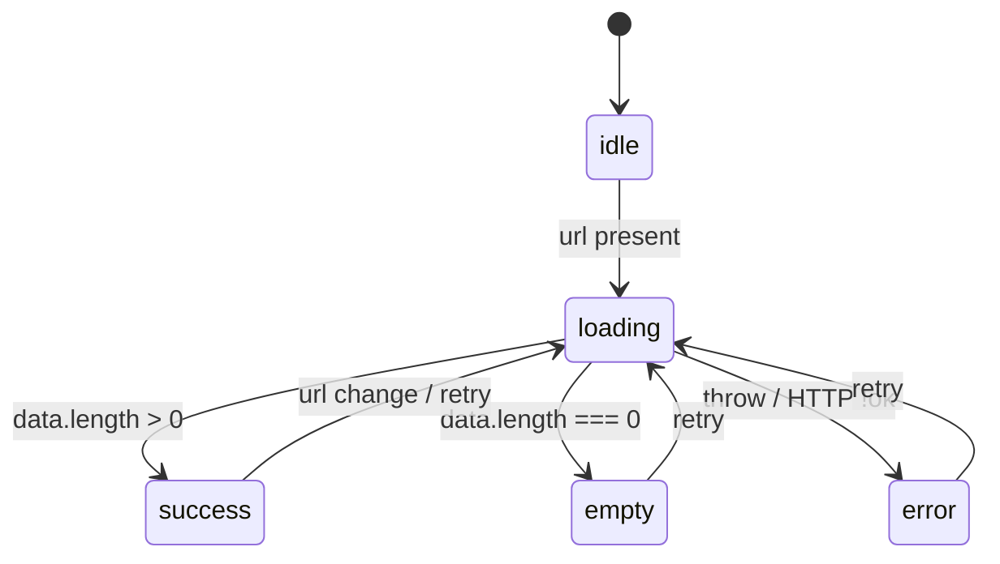
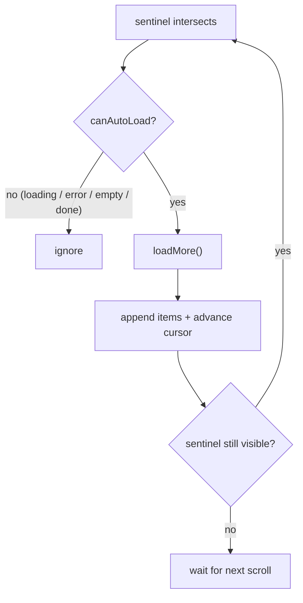
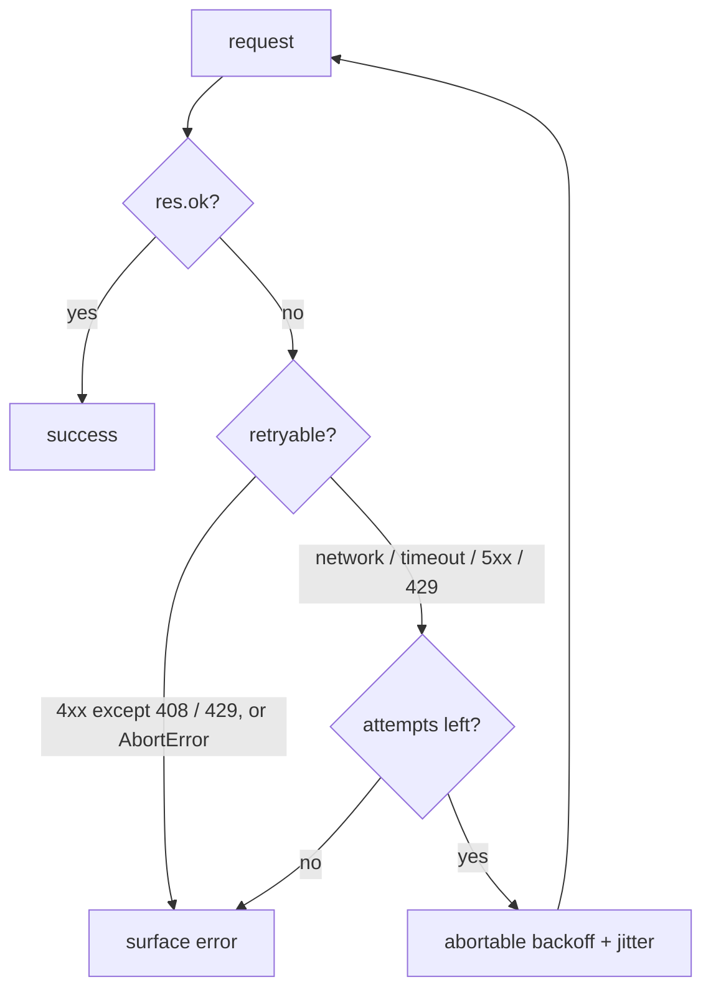

# API / Async React

Almost every real React interview eventually asks for a request, and almost every candidate gets the same three bugs: a state update after unmount, a stale response overwriting a fresh one, and a missing `loading`/`error`/`empty` branch. This section treats one request as a small state machine and then adds exactly one new concern per problem, so you can see the pattern grow instead of memorizing seven unrelated components.

The relationships between the problems are deliberate and worth stating up front:

- **#39 is the template.** It establishes the async state machine (`idle | loading | success | empty | error`), retry, cleanup, cancellation, stale-response guarding, duplicate-request protection, and error normalization. Every later problem keeps this skeleton and adds to it.
- **#40 adds only timing.** Debouncing is a scheduling concern layered *on top of* #39's machine; the abort/cleanup discipline is unchanged.
- **#41 deepens cancellation.** It turns the baseline abort into full race-condition handling: overlapping requests, sequence numbers, cancel buttons, and the difference between "we aborted the network call" and "we are allowed to render this result".
- **#42 adds caching.** Same machine, same races, but now a request can be answered from memory, which introduces cache keys, TTL, and request de-duplication.
- **#43 is the component and keyboard layer.** It composes #40, #41, and #42 into an ARIA combobox. New content is interaction: highlight management, `aria-activedescendant`, and pick-vs-type semantics.
- **#44 and #45 are the same append-only pagination state with different triggers.** #44 loads the next page from a button; #45 replaces the button with an `IntersectionObserver` sentinel. The data model does not change &mdash; only what fires `loadMore`.

Every async effect in this section addresses the same five obligations, and you should say them out loud in the interview:

1. **Cleanup** &mdash; clear timers, disconnect observers, remove listeners.
2. **Abort** on unmount and whenever dependencies change.
3. **Stale responses** &mdash; an older response must never overwrite a newer one, even if abort is best-effort.
4. **Duplicate-request protection** &mdash; one in-flight request per logical query, and no double-submits.
5. **Error normalization** &mdash; turn `AbortError`, `TypeError`, HTTP failures, and unknown throws into one user-facing message.

---

## API-Backed List

`Difficulty: Medium` `Probability: Very High`

### What are we building?

A list whose data comes from an API, with honest `loading`, `success`, `empty`, `error`, and `idle` states plus a retry button. This is the template for the whole section: one status value drives the UI, the effect owns an `AbortController`, a sequence number guards against stale responses, and every failure is normalized to a single message. The next six problems each add one concern on top of this skeleton rather than replacing it.

### Example

```text
┌─────────────────────────────────────────────┐
│  Posts                                      │
│                                             │
│  loading  →  ▢ ▢ ▢   (3 skeleton rows)       │
│  success  →  • First post                    │
│              • Second post                   │
│  empty    →  "Nothing here yet."             │
│  error    →  "Request failed (500)"          │
│              [ Try again ]                    │
└─────────────────────────────────────────────┘
```

The same URL change mid-flight (e.g. a route param) must cancel the old request and never flash the old list.

### What is the interviewer testing?

- Modeling async as a **single discriminated status**, not three booleans that can contradict each other
- `useEffect` cleanup: abort on unmount **and** on every dependency change
- A stale-response guard for the case where abort did not win the race
- Deriving `empty` from `data.length`, not from a manually set flag
- Normalizing `AbortError`, `TypeError`, and HTTP status errors into one message
- Retry that re-runs the request without duplicating it
- Rendering all five states, including `idle` before the first effect runs

### State Design

```ts
type Status = "idle" | "loading" | "success" | "empty" | "error";

type AsyncState<T> = {
  status: Status;
  data: T[] | null;       // only meaningful in "success"
  error: string | null;   // only meaningful in "error"
};

// refs (do not cause renders)
abortRef: AbortController | null;
seqRef: number;           // stale-response guard
```

**Do NOT store:** `isLoading`, `isError`, `isEmpty`, or `hasFetched` as separate booleans. They are all functions of `status`, and duplicating them lets the UI show a spinner and an error at the same time. Do not store a copy of the previous `data` to "avoid flicker" &mdash; if you want to keep the old list visible while refetching, model that explicitly with a `refreshing` status instead of a shadow copy.

### Basic Version

A reusable hook first (this is the template), then a thin component.

```ts
import { useCallback, useEffect, useRef, useState } from "react";

type Status = "idle" | "loading" | "success" | "empty" | "error";

type AsyncState<T> = {
  status: Status;
  data: T[] | null;
  error: string | null;
};

export function normalizeError(err: unknown): string {
  if (err instanceof DOMException && err.name === "AbortError") return "Request cancelled.";
  if (err instanceof TypeError) return "Network error. Check your connection.";
  if (err instanceof Error && err.message) return err.message;
  return "Something went wrong.";
}

export function useApiList<T>(url: string | null) {
  const [state, setState] = useState<AsyncState<T>>({
    status: "idle",
    data: null,
    error: null,
  });
  const [attempt, setAttempt] = useState(0);
  const abortRef = useRef<AbortController | null>(null);
  const seqRef = useRef(0);

  useEffect(() => {
    // 1. Every run gets a new sequence number. Old runs are invalid immediately.
    const seq = ++seqRef.current;

    // 2. Cancel whatever was in flight (dependency change, retry, or unmount).
    abortRef.current?.abort();

    if (!url) {
      setState({ status: "idle", data: null, error: null });
      return;
    }

    const controller = new AbortController();
    abortRef.current = controller;
    setState((prev) => ({ ...prev, status: "loading", error: null }));

    (async () => {
      try {
        const res = await fetch(url, { signal: controller.signal });
        if (!res.ok) throw new Error(`Request failed (${res.status})`);
        const data = (await res.json()) as T[];

        // 3. Correctness guard: abort is best-effort, the sequence is not.
        if (seq !== seqRef.current) return;

        setState({
          status: data.length === 0 ? "empty" : "success",
          data,
          error: null,
        });
      } catch (err) {
        if (seq !== seqRef.current) return;
        if (err instanceof DOMException && err.name === "AbortError") return;
        setState({ status: "error", data: null, error: normalizeError(err) });
      }
    })();

    // 4. Cleanup runs before the next effect and on unmount.
    return () => controller.abort();
  }, [url, attempt]);

  const retry = useCallback(() => setAttempt((n) => n + 1), []);

  return { ...state, retry };
}

type Post = { id: string; title: string; body: string };

export function ApiList({ url }: { url: string }) {
  const { status, data, error, retry } = useApiList<Post>(url);

  if (status === "idle" || status === "loading") {
    return (
      <p role="status" aria-live="polite">
        Loading…
      </p>
    );
  }

  if (status === "error") {
    return (
      <div role="alert">
        <p>{error}</p>
        <button type="button" onClick={retry}>
          Try again
        </button>
      </div>
    );
  }

  if (status === "empty") {
    return <p role="status">Nothing here yet.</p>;
  }

  return (
    <ul aria-busy={false}>
      {(data ?? []).map((post) => (
        <li key={post.id}>
          <strong>{post.title}</strong>
          <p>{post.body}</p>
        </li>
      ))}
    </ul>
  );
}
```

### How It Works



- `status` is the single source of truth for the UI. The component is a `switch` over it, so contradictory states (spinner and error) are impossible.
- The effect increments `seqRef` **before** anything else. That first line invalidates every in-flight run, including the case where `url` becomes `null` (the early-return branch would otherwise leave a live request that could still write state).
- `abortRef.current?.abort()` handles the common case: a dependency changed, so cancel the old network work. `controller.abort()` in cleanup handles unmount.
- The `seq !== seqRef.current` check is the **correctness** guarantee. Aborting is an optimization; a response that already resolved can still reach the `await` continuation, and some environments ignore the signal. Only the latest sequence may call `setState`.
- `empty` is derived from `data.length === 0` inside the same `setState` that produces `success`, so the two can never disagree.
- `normalizeError` collapses library-specific errors (`AbortError` as a `DOMException`, `TypeError` for a failed fetch, `Error` for HTTP) into one string the UI can render blindly.
- Retrying increments `attempt`, which is a dependency of the effect. The previous run is aborted by cleanup, a new sequence is allocated, and loading is shown again &mdash; no separate "refetch" code path.

### Edge Cases

- **Unmount mid-request.** Cleanup aborts and the sequence guard drops the late result; React 18 no longer warns about setting state after unmount, but the request must still be cancelled.
- **`url` changes then changes back.** Two aborts and three sequences; only the newest result renders.
- **React StrictMode double-invokes effects.** The first effect is aborted by its own cleanup before the second starts; the sequence guard makes the first run a no-op. Do not "fix" StrictMode by removing the abort.
- **HTTP 204 / empty body.** `res.json()` throws on an empty body. Check `res.status === 204` or `Content-Length` and treat it as `[]`.
- **Non-2xx with a JSON error body.** `!res.ok` catches it before parsing; optionally parse the body for a server message.
- **Offline / DNS failure.** `fetch` rejects with a `TypeError`, not an HTTP error; `normalizeError` turns it into a human sentence.
- **Retry pressed twice quickly.** The second click increments `attempt` again and supersedes the first; the UI should also disable the button while `status === "loading"`.
- **Row identity.** Key by server `id`, never by index, so append/refetch does not reuse the wrong DOM node.

### Interview Follow-ups

- **Level 1:** Fetch and render only, with a single `loading` boolean (name the bugs this hides).
- **Level 2:** The five-state machine above with retry (the baseline expected answer).
- **Level 3:** Add a `refreshing` variant that keeps the old list visible while refetching, and a `lastUpdatedAt` timestamp.
- **Level 4:** Extract the logic into a reusable `useApiList(url)` hook with a typed generic (shown above).
- **Level 5:** Poll on an interval with `useEffect` + `setInterval` + cleanup, pausing when the tab is hidden with `document.visibilityState`.
- **Level 6:** Cache responses by URL so navigating back is instant (this is **#42**, applied to a non-search resource).
- **Level 7:** Add optimistic delete: remove the row immediately, restore it on failure (see **Optimistic Mutation with Rollback**).

### Production Version

A server-state library owns this entire lifecycle. TanStack Query's `useQuery` gives you request de-duplication, caching, retry with backoff, abort on unmount, and `isPending`/`isError`/`data` in one call; `staleTime` and `gcTime` replace a hand-rolled cache. Mention it as the production shortcut, but implement the manual version first &mdash; the interview is testing the machine and the cancellation semantics, not the import. For a route-level page, a small `errorElement` boundary plus this hook is the common production shape.

### Accessibility

- Announce loading with `role="status"` (`aria-live="polite"` implies the role), not a visual spinner alone.
- Announce failures with `role="alert"` so screen readers interrupt; keep the retry button next to the message.
- Set `aria-busy="true"` on the list container while a refetch is in flight so assistive tech knows the region is updating.
- Give the retry button a clear name ("Try again"), and never leave the error state with no actionable control.
- Don't hide the whole page behind a spinner; render a skeleton or keep prior content with `aria-busy`.

### Performance

- Abort aggressively: a cancelled request costs one round trip, a rendered stale list costs a confusing bug.
- Render skeletons instead of a text spinner for lists that will populate; it reduces perceived latency and layout shift.
- Memoize list rows only once the list is large; a hundred rows are cheaper than the memo bookkeeping.
- Virtualize when the list can reach thousands (see **Virtualized List**).
- Do not put large response objects into a global context just to share them; cache and fetch near the consumer.

### Testing

```text
✓ shows the loading state before the first response resolves
✓ renders items on success, keyed by id
✓ shows the empty state when the server returns []
✓ shows the error state and message when the response is not ok
✓ clicking "Try again" refetches and clears the error
✓ an unmount during a pending request does not update state (no act warning)
✓ a slow first request does not overwrite a fast second response
✓ AbortError never surfaces as a user-facing error
```

### Common Mistakes

- Storing `isLoading` / `isError` / `isEmpty` separately instead of one `status`.
- No cleanup: the classic "state update on an unmounted component" and a phantom request after navigating away.
- Relying on `AbortController` alone for ordering; a response can land after abort.
- Forgetting to invalidate the in-flight request when `url` becomes `null`.
- Throwing on `!res.ok` but then showing `err.message` like `"Request failed (500)"` without context &mdash; that part is fine, but swallowing the error entirely is not.
- Retry implemented as a second code path that duplicates the fetch instead of re-running the effect.

### Interview Takeaway

An async request is a state machine plus a cancellation policy. Model `status` as one value, allocate a sequence number per run, abort on every dependency change and unmount, derive `empty` from the data, and normalize every error to one message. Write this skeleton once and the next six problems are additions, not rewrites.

---

## Debounced Search

`Difficulty: Medium` `Probability: Very High`

### What are we building?

A search input that waits for the user to stop typing before it fires a request. The async machine from **#39** is unchanged; the only new concern is **timing**. This problem isolates debounce so you can see exactly what it does and does not solve: it reduces request *volume*, but it does nothing about stale responses or caching.

### Example

```text
type:  r
type:  re
type:  rea
type:  react        (user pauses 300ms)
                    ┌───────────────┐
                    │ "react" fetch │  ← exactly one request
                    └───────────────┘
results: React, React Native, React Router

delete: reac
type:   rea         (pause) → another single request
```

Without debounce, that typing sequence is eight requests. With a 300ms debounce, it is two.

### What is the interviewer testing?

- Why debouncing is a *scheduling* fix, not a race fix
- One timer, reset on every keystroke, cleared on unmount
- Keeping the raw input responsive while the query is debounced
- Distinguishing the displayed input value from the value that triggers a request
- Flushing immediately on Enter / search button, bypassing the delay
- Composing debounce with the state machine and abort discipline from #39

### State Design

```ts
query: string            // controlled input; updates on every keystroke
debouncedQuery: string   // produced by useDebouncedValue(query, delay)
status/data/error        // the #39 machine, keyed on debouncedQuery
```

**Do NOT store:** the timer id in state (it belongs in a ref or, better, inside the effect closure), an `isTyping` boolean (derive it as `query !== debouncedQuery`), a per-keystroke results array, or a manually maintained `debouncedQuery` (let the hook own it). Do not debounce the input value itself &mdash; only the value you send to the network; a laggy input feels broken.

### Basic Version

```ts
import { useCallback, useEffect, useRef, useState } from "react";

export function useDebouncedValue<T>(value: T, delay = 300): T {
  const [debounced, setDebounced] = useState(value);

  useEffect(() => {
    const id = setTimeout(() => setDebounced(value), delay);
    // Runs on every change and on unmount: cancels the pending update.
    return () => clearTimeout(id);
  }, [value, delay]);

  return debounced;
}

type Post = { id: string; title: string };

// Reuses the five-state machine from #39, keyed on the debounced query.
function useApiList<T>(url: string | null) {
  /* … exact body from #39 … */
}

export function DebouncedSearch() {
  const [query, setQuery] = useState("");
  const debounced = useDebouncedValue(query, 300);

  const trimmed = debounced.trim();
  const url = trimmed ? `/api/search?q=${encodeURIComponent(trimmed)}` : null;
  const { status, data, error, retry } = useApiList<Post>(url);

  // Derived, not stored: are we currently ahead of the debounce?
  const isTyping = query.trim() !== trimmed;

  return (
    <section aria-labelledby="search-heading">
      <h3 id="search-heading">Search</h3>

      <input
        type="search"
        value={query}
        onChange={(e) => setQuery(e.target.value)}
        placeholder="Search posts"
        aria-label="Search posts"
        aria-describedby="search-status"
      />

      <p id="search-status" role="status" aria-live="polite">
        {isTyping && "Typing…"}
        {!isTyping && status === "loading" && "Searching…"}
        {status === "success" && `${data?.length ?? 0} results`}
        {status === "empty" && "No matches"}
        {status === "error" && error}
      </p>

      {status === "error" && (
        <button type="button" onClick={retry}>
          Try again
        </button>
      )}

      <ul>
        {(data ?? []).map((post) => (
          <li key={post.id}>{post.title}</li>
        ))}
      </ul>
    </section>
  );
}
```

A `useDebouncedCallback` is the sibling hook when you need an imperative flush or cancel:

```ts
export function useDebouncedCallback<A extends unknown[]>(
  fn: (...args: A) => void,
  delay = 300,
) {
  const fnRef = useRef(fn);
  fnRef.current = fn;                 // always call the latest closure
  const timerRef = useRef<number | null>(null);

  const cancel = useCallback(() => {
    if (timerRef.current !== null) {
      clearTimeout(timerRef.current);
      timerRef.current = null;
    }
  }, []);

  const run = useCallback(
    (...args: A) => {
      cancel();
      timerRef.current = window.setTimeout(() => {
        timerRef.current = null;
        fnRef.current(...args);
      }, delay);
    },
    [cancel, delay],
  );

  const flush = useCallback(
    (...args: A) => {
      cancel();
      fnRef.current(...args);
    },
    [cancel],
  );

  useEffect(() => cancel, [cancel]); // clear the pending timer on unmount

  return { run, flush, cancel };
}
```

### How It Works

- `useDebouncedValue` keeps two values: the live `value` it receives and the `debounced` value it returns. Every change schedules a `setTimeout` and clears the previous one, so only the last keystroke in a burst survives. Cleanup guarantees no pending timer fires after unmount or a dependency change.
- The input is bound to `query`, so typing never waits on a timer. Only the request URL is debounced. This is the single most important design decision in the problem.
- `isTyping = query.trim() !== trimmed` is derived. It is true exactly while a keystroke is in flight toward the debounce boundary, and it powers a "Typing…" hint without a second piece of state.
- Once `debounced` changes, the `url` changes, and **#39**'s effect does the rest: abort the previous request, allocate a new sequence, show `loading`, drop stale responses.
- The `null` URL for an empty query is why #39's hook handles `url: string | null`: clearing the box resets to `idle` and invalidates any in-flight search.
- The debounce delay is a UX budget. 250&ndash;300ms feels instant; below ~150ms you barely reduce traffic; above ~500ms the UI feels asleep.

**Flushing on submit.** If there is a visible "Search" button or the user presses Enter, bypass the delay:

```ts
const { run, flush } = useDebouncedCallback((q: string) => setDebounced(q), 300);

<form
  onSubmit={(e) => {
    e.preventDefault();
    flush(query.trim());   // search now
  }}
>
  <input
    value={query}
    onChange={(e) => {
      setQuery(e.target.value);
      run(e.target.value); // debounced
    }}
  />
</form>
```

### Edge Cases

- **Clearing the input.** Empty query must cancel the pending timer and the in-flight request, then return to `idle`; do not render the previous results as if they matched "".
- **Backspacing to a previous term.** Debounce alone re-fetches it. Caching (**#42**) is what makes it instant.
- **Pasting a long string.** One `change` event, one debounce; fine. Multiple rapid pastes still collapse.
- **IME composition.** Don't schedule a request while `e.nativeEvent.isComposing`; intermediate characters are not search terms.
- **Enter during the debounce window.** Without a flush, the user must wait for the timer before anything happens; wire the form submit to flush.
- **Changing `delay` while typing.** The effect depends on `delay`, so a change resets the timer; keep it constant or expect a restart.
- **Unmount with a pending timer.** `clearTimeout` in cleanup; otherwise the fetch fires for a dead component.

### Interview Follow-ups

- **Level 1:** Debounce the input value itself and show the bug (laggy, sometimes skips the last character on slow devices).
- **Level 2:** Debounce only the request value, keep the input controlled and instant (shown above).
- **Level 3:** Add a `useDebouncedCallback` with `flush`/`cancel` and a search button that flushes.
- **Level 4:** Combine with `AbortController` (arrives naturally from #39) and confirm stale responses cannot win (**#41**).
- **Level 5:** Add a request cache keyed by normalized query so backspacing is free (**#42**).
- **Level 6:** Use `useDeferredValue(query)` as a complement: keep filtering or a local preview instant while the debounced network request is the authoritative result. `useDeferredValue` has no fixed delay and adapts to the device; debounce is a fixed UX budget. Mentioning both and when to pick each is a strong signal.

### Production Version

A server-state library handles debouncing at the call site (`useQuery` with a debounced key) or with a small `useDebounce` around the key. Some teams debounce in the input's `onChange` and store the debounced value in a context so several components (a filter bar, a results count) read the same query. Keep the raw value in the URL with `useSearchParams` if the search should be shareable, and debounce only the *navigation* to avoid a history entry per keystroke.

### Accessibility

- The input carries the accessible name; debouncing must not rename or remount it.
- Announce result counts and loading in a polite live region, separate from the input, so focus is never stolen mid-typing.
- Do not auto-focus or auto-open anything when results arrive.
- Keep the typed value visible during loading; never clear the box to "reset".
- A search button, if present, needs a label and works with Enter via a real `<form>`.

### Performance

- Debounce cuts request volume; the timer itself is negligible.
- Never debounce the controlled input value for display &mdash; only the network value.
- Cancel the in-flight request when the query changes (from #39); a debounce without abort still lets an old response land.
- For large *local* filtering, `useDeferredValue` keeps typing smooth without a network call.
- Avoid re-creating the debounce timer on unrelated renders; the effect depends only on `value` and `delay`.

### Testing

```text
✓ typing does not fetch on every keystroke (advance fake timers)
✓ exactly one request fires after the debounce window
✓ the input shows every character immediately, before the debounce
✓ clearing the input cancels the pending request and returns to idle
✓ Enter / submit flushes immediately without waiting
✓ a pending timer is cleared on unmount (no stray fetch)
✓ the latest query's response is the one rendered
```

### Common Mistakes

- Debouncing the controlled input value, making the field lag behind the user.
- `setTimeout` without a `clearTimeout` cleanup, so stale timers fire after unmount.
- Treating debounce as a race-condition fix; a slow response for an older query can still overwrite a newer one.
- Forgetting to cancel the in-flight request when the user clears the box.
- Hardcoding a delay with no way to flush for Enter/search.
- Storing `isTyping` in state and syncing it with an effect instead of deriving it.

### Interview Takeaway

Debounce is a scheduling tool: one timer, reset on every change, cleared on unmount. Keep the input instant and debounce only the value that leaves the client. It reduces traffic but does not order responses &mdash; that is **#41**'s job, and it does not make repeats cheap &mdash; that is **#42**'s.

---

## Cancellable Search & Race Conditions

`Difficulty: Hard` `Probability: Very High`

### What are we building?

A search where every request can be cancelled and where an older response can never overwrite a newer one. **#39** introduced abort on cleanup and a sequence guard; this problem treats the race itself as the subject: overlapping requests, a manual cancel button, retry storms, and the difference between "the network call was aborted" and "this result is still allowed to render".

### Example

```text
t=0ms    type "r"    → request A ………………… 900ms  ─┐
t=100ms  type "re"   → request B …… 200ms          │ A is stale; must be dropped
t=200ms  type "rea"  → request C … 150ms           │
                                                   ▼
screen must show results for "rea" (C),
not "r" (A) when it finally lands.

[ Cancel ] aborts the in-flight request and returns to idle.
```

### What is the interviewer testing?

- The out-of-order-response bug, demonstrated concretely
- `AbortController` created **per effect run**, aborted on cleanup, not shared across runs
- Why abort alone is insufficient, and how a sequence number closes the gap
- Handling `AbortError` as an expected outcome, never as a user-facing error
- Duplicate-request protection: one in-flight request per query, no retry storms
- A discriminated-union state so `data` only exists in `success`
- Unmount safety and StrictMode double-invocation

### State Design

A discriminated union is stricter than #39's object shape: impossible combinations become type errors.

```ts
type SearchState<T> =
  | { status: "idle" }
  | { status: "loading"; query: string }
  | { status: "success"; query: string; data: T[] }
  | { status: "empty"; query: string }
  | { status: "error"; query: string; error: string };

// refs
abortRef: AbortController | null;   // the ONE in-flight request
seqRef: number;                     // monotonic run id; only the newest may render
inFlightRef: boolean;               // duplicate-request guard for manual search
```

**Do NOT store:** a single `data` field that survives across statuses (with a union, `data` is only reachable in `success`), the previous query string as a separate `lastQuery`, or a boolean per request. Do not keep the `AbortController` in state &mdash; aborting is not a render.

### Basic Version

```ts
import { useCallback, useEffect, useRef, useState } from "react";

type SearchState<T> =
  | { status: "idle" }
  | { status: "loading"; query: string }
  | { status: "success"; query: string; data: T[] }
  | { status: "empty"; query: string }
  | { status: "error"; query: string; error: string };

function isAbortError(err: unknown): boolean {
  return err instanceof Error && err.name === "AbortError";
}

function normalizeError(err: unknown): string {
  if (err instanceof TypeError) return "Network error. Check your connection.";
  if (err instanceof Error && err.message) return err.message;
  return "Something went wrong.";
}

type Post = { id: string; title: string };

export function useSearch(query: string) {
  const [state, setState] = useState<SearchState<Post>>({ status: "idle" });
  const [nonce, setNonce] = useState(0);
  const abortRef = useRef<AbortController | null>(null);
  const seqRef = useRef(0);

  useEffect(() => {
    const q = query.trim();
    const seq = ++seqRef.current;   // invalidate every earlier run immediately
    abortRef.current?.abort();      // and stop its network work

    if (!q) {
      setState({ status: "idle" });
      return;
    }

    const controller = new AbortController();
    abortRef.current = controller;
    setState({ status: "loading", query: q });

    const timer = setTimeout(async () => {
      try {
        const res = await fetch(`/api/search?q=${encodeURIComponent(q)}`, {
          signal: controller.signal,
        });
        if (!res.ok) throw new Error(`Request failed (${res.status})`);
        const data = (await res.json()) as Post[];

        if (seq !== seqRef.current) return; // a newer run already won

        setState(
          data.length > 0
            ? { status: "success", query: q, data }
            : { status: "empty", query: q },
        );
      } catch (err) {
        if (seq !== seqRef.current) return;
        if (isAbortError(err)) return;      // expected cancellation, not an error
        setState({ status: "error", query: q, error: normalizeError(err) });
      }
    }, 250);

    return () => {
      clearTimeout(timer);      // still debounced (#40)
      controller.abort();       // and now fully cancellable
    };
  }, [query, nonce]);

  const cancel = useCallback(() => {
    seqRef.current += 1;                 // belt: no in-flight result may render
    abortRef.current?.abort();           // braces: stop the network request
    setState({ status: "idle" });
  }, []);

  const retry = useCallback(() => setNonce((n) => n + 1), []);

  return { state, cancel, retry };
}

export function CancellableSearch() {
  const [query, setQuery] = useState("");
  const { state, cancel, retry } = useSearch(query);

  return (
    <section aria-labelledby="cancellable-heading">
      <h3 id="cancellable-heading">Search</h3>

      <div role="search">
        <label htmlFor="q">Query</label>
        <input
          id="q"
          type="search"
          value={query}
          onChange={(e) => setQuery(e.target.value)}
          autoComplete="off"
        />
        {state.status === "loading" && (
          <button type="button" onClick={cancel}>
            Cancel
          </button>
        )}
      </div>

      <p role="status" aria-live="polite">
        {state.status === "loading" && `Searching for "${state.query}"…`}
        {state.status === "success" && `${state.data.length} results`}
        {state.status === "empty" && "No matches"}
      </p>

      {state.status === "error" && (
        <div role="alert">
          <p>{state.error}</p>
          <button type="button" onClick={retry}>
            Try again
          </button>
        </div>
      )}

      <ul>
        {state.status === "success" &&
          state.data.map((post) => <li key={post.id}>{post.title}</li>)}
      </ul>
    </section>
  );
}
```

### How It Works

- **Abort is created per run.** The controller lives inside the effect closure, so cleanup always aborts the request that this run started &mdash; never a newer one. A single controller in a ref that is reused across runs would abort the *new* request when the old cleanup runs.
- **Sequence is incremented at the top**, before the early return. Clearing the query still invalidates the previous request.
- **Abort is an optimization; the sequence is the guarantee.** When the user types again, stop the old request to save bandwidth. But a response can already have resolved (or a polyfill can ignore the signal), so only the run whose `seq` still equals `seqRef.current` is allowed to call `setState`.
- **`AbortError` is not a failure.** It is handled in a separate branch and never rendered. If you let it fall through, cancelling looks like an error to the user.
- **Order of guards matters.** Check `seq !== seqRef.current` first: a stale run must be discarded even if its error was *not* an abort error. Then check `isAbortError`.
- **`cancel()` double-guards.** It bumps the sequence *and* aborts, so a response that is already in the microtask queue is dropped even if the network abort is too late.
- **Duplicate-request protection.** Within the hook, one controller at a time; the effect aborts the previous run before starting a new one. For an imperative search (a form submit), guard with a ref:

```ts
const inFlightRef = useRef(false);

async function searchNow(q: string) {
  if (inFlightRef.current) return;   // one request at a time
  inFlightRef.current = true;
  try {
    /* … fetch … */
  } finally {
    inFlightRef.current = false;
  }
}
```

- **StrictMode.** React mounts, runs the effect, cleans up (abort + clear timer), and runs it again. The first run's sequence is already stale, so nothing it does can render.

**Advanced signals.** Modern runtimes let you compose or time out signals:

```ts
// Combine a user cancel signal with a 10s timeout.
const controller = new AbortController();
const timeout = AbortSignal.timeout(10_000);
const signal = AbortSignal.any([controller.signal, timeout]);

// Or give a semantic reason for diagnostics.
controller.abort(new DOMException("Superseded by a newer query", "AbortError"));
// later: controller.signal.reason
```

### Edge Cases

- **Old response resolves before abort takes effect.** The sequence guard is the only thing that saves you; test it by resolving the first request *after* the second.
- **Cancel, then type again.** `cancel()` sets `idle`; the next keystroke starts a fresh run with a new sequence. Because `query` changed, the effect re-runs.
- **Cancel while nothing is in flight.** `abort()` on an already-aborted or completed controller is a no-op; the sequence bump is harmless.
- **Retry after cancel.** `retry` bumps `nonce`, so the effect re-runs even though `query` did not change.
- **Server error for a stale query.** Guarded by the sequence check before the error branch; the user sees the error for the *current* query only.
- **Rapid Enter on a form.** `inFlightRef` collapses duplicates; otherwise each press stacks a request.
- **Non-search manual trigger.** If you call the fetch imperatively, remember there is no effect cleanup &mdash; remove/unmount must abort at the call site or in a `useEffect` unmount return.
- **`AbortSignal.timeout` fires.** It rejects with a `TimeoutError` (a `DOMException` named `TimeoutError`), not `AbortError`; decide whether to render it as an error or a retryable timeout.

### Interview Follow-ups

- **Level 1:** Fire a request per keystroke; reproduce the out-of-order bug with a mocked slow endpoint.
- **Level 2:** Add debounce (#40) and observe that the race still occurs when responses are slow.
- **Level 3:** Add per-run `AbortController` cleanup; observe that stale responses *usually* stop.
- **Level 4:** Add the sequence guard and prove ordering with a test where the first response resolves last (shown above).
- **Level 5:** Add a cancel button that aborts and invalidates, plus a retry that re-runs the same query.
- **Level 6:** Extract `useSearch` as a generic hook and reuse it for autocomplete (#43) and pagination validation (#44).
- **Level 7:** Track `controller.signal.reason` and distinguish "user cancelled", "superseded", and "timed out" in telemetry.
- **Level 8:** Move to a server-state cache library and explain which of these guards it still does not remove.

### Production Version

The canonical hard bug is a search dropdown where "ab" resolves after "abc", showing the wrong list. Abort on every keystroke plus the sequence guard is the fix, and it is what libraries implement under the hood; knowing the mechanism means you can debug it when a library's `signal` is not wired up. At scale, add request de-duplication by normalized query (two components asking for "abc" share one request), a timeout, and telemetry on abort reasons. A cache library replaces the manual guards only if it is actually configured with your `signal`; passing a stale `signal` to `useQuery` reintroduces the bug.

### Accessibility

- A visible Cancel button must be reachable by keyboard and announced; pair it with the same action as Escape.
- Announce loading with the query text ("Searching for …") so the user knows which request is running.
- Never move focus when a response lands or when a request is cancelled.
- Keep the input value during cancel; cancelling is not clearing.
- Use `role="alert"` for the error state and keep retry adjacent.
- Avoid live-region spam: announce "Searching" once per query, not on every keystroke.

### Performance

- Abort on every superseded run to free the connection; a debounce reduces runs, abort reduces wasted ones.
- Do not create the `AbortController` in a ref shared across runs; the wrong run's cleanup will cancel the live request.
- Keep the sequence increment cheap. It is a ref, not state, so it never triggers a render.
- If the same query is issued from several places, de-duplicate at the network layer rather than firing N requests.
- Cap concurrent requests (one) for a search box; a queue is only warranted for bulk operations.

### Testing

```text
✓ resolves the latest query when the first response arrives last
✓ aborting on query change rejects with AbortError and does not show an error
✓ clearing the query invalidates the in-flight request
✓ Cancel returns to idle and the next keystroke searches again
✓ Retry re-runs the same query and clears the error
✓ typing "ab" then "abc" renders only "abc" results
✓ unmounting mid-request leaves no state update and no pending timer
✓ a second submit while one is in flight is ignored
✓ a timeout is shown as an error, not silently dropped
```

### Common Mistakes

- One `AbortController` in a ref reused across runs, so an old cleanup aborts the new request.
- Treating `AbortError` as a user-facing failure.
- Relying on abort for correctness; a resolved response still updates state without the sequence guard.
- Incrementing the sequence *after* the early return for an empty query.
- Checking `isAbortError` before the sequence guard, so a stale non-abort error renders.
- No duplicate guard on imperative submits, causing a retry storm.
- Putting the controller in `useState`, which re-renders on every abort.
- Cancelling but leaving the old results on screen as if they matched the new query.

### Interview Takeaway

Cancellation has two parts. `AbortController` stops the work; a monotonic sequence number decides who is allowed to render. Create the controller inside the effect run, increment the sequence first, drop `AbortError`, and guard stale errors before they reach the UI. This is the hardest async bug in interviews and it has a small, repeatable fix.

---

## Cached Search Results

`Difficulty: Hard` `Probability: High`

### What are we building?

A search that remembers previous queries, so backspacing, retyping, and revisiting a term are instant and never hit the network twice. Built on **#41**'s cancellable machine, the new concern is the cache: keys, TTL, size bounds, request de-duplication, and the abort interaction. Caching is also where "show results instantly while refreshing" (stale-while-revalidate) belongs.

### Example

```text
type "react"            → network 180ms   (spinner)
backspace to "reac"     → cache hit        (instant, no spinner)
retype "react"          → cache hit        (instant)
                                                    ┌──────────────┐
after 60s (TTL) retype  → network again            │ cache: 3     │
                                                    │ "r","re","react"│
                                                    └──────────────┘
```

### What is the interviewer testing?

- A normalized cache key (trim + lowercase) applied consistently on read and write
- Cache **before** showing any loading state, to avoid a spinner flash on a hit
- TTL and a size cap (LRU-ish eviction) so memory stays bounded
- Request de-duplication: two identical in-flight queries share one promise
- Not caching errors, and deciding whether to cache empty results
- The tension between per-caller abort and a shared in-flight promise
- Stale-while-revalidate as the "instant but fresh" upgrade

### State Design

```ts
type CacheEntry<T> = { data: T[]; at: number };

// refs (per hook instance; use a module-level Map to share across components)
cacheRef: Map<string, CacheEntry<T>>;      // normalized query -> { data, at }
inflightRef: Map<string, Promise<T[]>>;    // normalized query -> in-flight promise
seqRef: number;                            // from #41
abortRef: AbortController | null;          // from #41
```

State is the same discriminated union as #41:

```ts
type SearchState<T> =
  | { status: "idle" }
  | { status: "loading"; query: string }
  | { status: "success"; query: string; data: T[]; fromCache: boolean }
  | { status: "empty"; query: string }
  | { status: "error"; query: string; error: string };
```

**Do NOT store:** the cache itself in `useState` (mutating it must not re-render; it is a ref or a module singleton), the list of cached keys, a `cacheHit` boolean separate from `fromCache` inside `success`, or fetched results duplicated outside the cache. Do not key the cache by the raw, unnormalized query, or `"React "` and `"react"` become two entries.

### Basic Version

```ts
import { useCallback, useEffect, useRef, useState } from "react";

type CacheEntry<T> = { data: T[]; at: number };

type SearchState<T> =
  | { status: "idle" }
  | { status: "loading"; query: string }
  | { status: "success"; query: string; data: T[]; fromCache: boolean }
  | { status: "empty"; query: string }
  | { status: "error"; query: string; error: string };

type Post = { id: string; title: string };

const TTL_MS = 60_000;
const MAX_ENTRIES = 50;

function normalizeKey(query: string): string {
  return query.trim().toLowerCase();
}

export function useCachedSearch(query: string) {
  const [state, setState] = useState<SearchState<Post>>({ status: "idle" });
  const [nonce, setNonce] = useState(0);

  const cacheRef = useRef(new Map<string, CacheEntry<Post>>());
  const inflightRef = useRef(new Map<string, Promise<Post[]>>());
  const abortRef = useRef<AbortController | null>(null);
  const seqRef = useRef(0);

  useEffect(() => {
    const q = query.trim();
    const seq = ++seqRef.current;
    abortRef.current?.abort();

    if (!q) {
      setState({ status: "idle" });
      return;
    }

    const key = normalizeKey(q);
    const cached = cacheRef.current.get(key);

    // 1. Cache read happens BEFORE loading is ever set: no spinner flash.
    if (cached && Date.now() - cached.at < TTL_MS) {
      setState(
        cached.data.length > 0
          ? { status: "success", query: q, data: cached.data, fromCache: true }
          : { status: "empty", query: q },
      );
      return;
    }

    const controller = new AbortController();
    abortRef.current = controller;
    setState({ status: "loading", query: q });

    (async () => {
      try {
        // 2. De-duplicate: an identical in-flight request is shared, not repeated.
        let promise = inflightRef.current.get(key);
        if (!promise) {
          promise = (async () => {
            const res = await fetch(`/api/search?q=${encodeURIComponent(q)}`, {
              signal: controller.signal,
            });
            if (!res.ok) throw new Error(`Request failed (${res.status})`);
            const data = (await res.json()) as Post[];
            // 3. Only successful responses are cached; errors are not.
            cacheRef.current.set(key, { data, at: Date.now() });
            // 4. Bounded cache: evict oldest inserted keys.
            while (cacheRef.current.size > MAX_ENTRIES) {
              const oldest = cacheRef.current.keys().next().value;
              if (oldest === undefined) break;
              cacheRef.current.delete(oldest);
            }
            return data;
          })();
          inflightRef.current.set(key, promise);
          void promise.finally(() => inflightRef.current.delete(key));
        }

        const data = await promise;
        if (seq !== seqRef.current) return;

        setState(
          data.length > 0
            ? { status: "success", query: q, data, fromCache: false }
            : { status: "empty", query: q },
        );
      } catch (err) {
        if (seq !== seqRef.current) return;
        if (err instanceof Error && err.name === "AbortError") return;
        setState({
          status: "error",
          query: q,
          error: err instanceof Error && err.message ? err.message : "Something went wrong.",
        });
      }
    })();

    return () => controller.abort();
  }, [query, nonce]);

  const invalidate = useCallback((key?: string) => {
    if (key) cacheRef.current.delete(normalizeKey(key));
    else cacheRef.current.clear();
  }, []);

  const retry = useCallback(() => setNonce((n) => n + 1), []);

  return { state, invalidate, retry };
}
```

### How It Works

- **Normalize once.** `normalizeKey` is used on both read and write. Miss it on one side and the cache silently never hits.
- **Read the cache before setting `loading`.** If you set `loading` first and then find a hit, the user sees a spinner flash for one frame. The hit path returns synchronously and keeps the input responsive.
- **The cache is a ref, not state.** Mutating it must not schedule a render; the render is driven by the state machine, with `fromCache` carried inside `success`.
- **Only successes are cached.** Caching an error or a transient network failure would pin a bad result for the whole TTL. Empty results are a judgment call: caching them avoids refetching a confirmed miss, but a new item matching the term will not appear until the TTL expires &mdash; pick one and say why.
- **De-duplication.** If the same normalized key is already in flight, the new run awaits the shared promise instead of issuing a second request. `inflightRef` is cleaned in `finally`, win or lose.
- **Bounded memory.** A `Map` preserves insertion order, so `keys().next()` is the oldest entry; evicting it gives approximate LRU without extra bookkeeping. A true LRU also moves entries to the back on read.
- **Abort interaction.** The owner of a request can abort it on a query change, which would reject the shared promise for any waiter. In a single-component search that is fine (`seq` drops the waiter's result). If several components share a cache, the shared promise should own its own controller (or use ref-counting) so one unmount does not cancel another component's request.
- **Sequence guard still applies.** A cache hit is synchronous, but a shared in-flight promise can resolve after the query has moved on; `seq !== seqRef.current` drops it exactly as in #41.

**Stale-while-revalidate.** To show cached data instantly and refresh it in the background, return the hit immediately and start a fetch that replaces state on success:

```ts
if (cached) {
  setState({ status: "success", query: q, data: cached.data, fromCache: true });
  // Do NOT return: kick off a background refresh, and only the latest seq may replace it.
  void refresh(q, key, seq);
  return;
}
```

The background refresh must reuse the same abort/sequence discipline; otherwise it reintroduces the race from #41 on top of a cache.

### Edge Cases

- **Whitespace and case.** `" React "` and `"react"` are one key. Normalize both sides, send the raw (trimmed) query to the server.
- **Cache hit while offline.** You already have the data; serve it. Decide whether a background refresh failure should downgrade a `success` to `error` (usually no).
- **TTL boundary.** Entries expire lazily on read. Also evict by size so a long session cannot grow unbounded.
- **Two components, one query.** A module-level `Map` shares the cache and the in-flight map; a per-instance ref does not. Choose deliberately.
- **Abort during a shared request.** Discussed above &mdash; do not let one component's cleanup cancel another's data.
- **Empty result caching.** If cached, a later-created match is invisible until TTL. If not cached, repeated misses re-fetch. State the tradeoff.
- **Mutation invalidates.** After creating an item, call `invalidate(query)` (or `invalidate()` for all) so the next search is fresh.
- **Memory leak via closures.** A shared cache holds data indefinitely; bound it and clear it on logout or tenant change.

### Interview Follow-ups

- **Level 1:** Cache in a `ref` `Map`, normalized key, no TTL ("session cache").
- **Level 2:** Add TTL and size-bounded eviction (shown above).
- **Level 3:** Add in-flight de-duplication so concurrent identical queries share one request.
- **Level 4:** Add `invalidate(key?)` and wire it to a mutation (create/delete).
- **Level 5:** Stale-while-revalidate: render cache instantly, refresh in the background.
- **Level 6:** Persist the cache to `sessionStorage` so a full reload keeps results, with a versioned key.
- **Level 7:** Replace the manual cache with a server-state library and compare what you lose (control of abort/seq) and gain (query keys, background refetch, devtools).

### Production Version

This is exactly what a server-state cache library is: keys, TTL/gc, de-duplication, stale-while-revalidate, and invalidation. TanStack Query's `useQuery({ queryKey: ["search", q], queryFn })` and `queryClient.invalidateQueries` replace the code above; SWR's `useSWR` does the same with `revalidateOnFocus`. Mention that as the production answer, then explain the two things candidates miss: (1) the cache key must include every input that changes the response (user/tenant/locale), and (2) a cache without invalidation is how stale UIs are born. Keep the manual version in the interview so you can reason about both.

### Accessibility

- Loading announcements from #40/#41 still apply; cache hits should announce results but **not** a spinner.
- If a background refresh replaces the list, use a polite live region to announce the update, and keep focus in place.
- Do not reorder or remount the list on a background refresh; that can move a screen reader's virtual cursor.
- Errors are still `role="alert"` with retry; cache does not exempt you from the error state.

### Performance

- The cache is the largest win: it removes both latency and network work for repeats.
- Keep the key set bounded; an unbounded map is a memory leak in a long session.
- De-duplication prevents a burst of identical requests (several widgets mounting at once).
- Do not deep-compare results to decide staleness; TTL plus explicit invalidation is simpler and predictable.
- Avoid serializing large caches synchronously on every write if you persist them; debounce persistence.

### Testing

```text
✓ a repeated query is served from the cache with no new fetch
✓ the first render of a cached query never shows "loading"
✓ " React " and "react" hit the same cache entry
✓ the cache does not grow past MAX_ENTRIES
✓ entries older than the TTL trigger a refetch
✓ two concurrent identical queries issue one network request
✓ errors are not cached; retry refetches
✓ invalidate(key) forces the next search to hit the network
✓ a slow cached-then-refreshed response cannot overwrite a newer query
```

### Common Mistakes

- Keying the cache by the raw query, so whitespace/case create duplicate entries.
- Setting `loading` before checking the cache and producing a spinner flash.
- Storing the cache in `useState` and re-rendering the world on every write.
- Caching errors, which pins a failure for the TTL.
- No size bound, so the map grows for the life of the tab.
- Passing one component's `AbortController` into a shared promise and cancelling everyone.
- Forgetting invalidation after a mutation, so a stale list persists.
- Assuming the cache removes the need for the sequence guard; a late shared promise can still land.

### Interview Takeaway

A cache is a keyed, bounded, expiring map that is read before you render `loading`. Normalize the key on both sides, cache only successes, de-duplicate in-flight requests, and keep the abort/sequence discipline from #41 around the shared promise. Say the invalidation story out loud &mdash; a cache without invalidation is just stale data with extra confidence.

---

## API Autocomplete

`Difficulty: Hard` `Probability: Very High`

### What are we building?

A text input that suggests server-backed options as the user types, with full keyboard support and the ARIA combobox pattern. This is the **component layer** on top of #40 (debounce), #41 (cancellation + races), and #42 (cache). The local version of this component already exists in **#20 Autocomplete / Typeahead / Combobox**; this problem is about wiring an async source into that pattern without breaking focus, highlighting, or selection.

### Example

```text
City: [ san                 ]
      ┌───────────────────────────────┐
      │ San Francisco                  │
      │ ▸ San Diego                    │  ← aria-activedescendant
      │ Santa Fe                       │
      └───────────────────────────────┘
      Searching… / 3 results / No matches / Could not load results.

ArrowDown opens the list, Enter selects the highlighted row,
Escape closes without clearing, typing refetches (debounced + cached).
```

### What is the interviewer testing?

- Composing the earlier patterns: debounce + abort + cache + state machine
- The combobox ARIA contract: `role="combobox"`, `aria-expanded`, `aria-controls`, `aria-autocomplete`, `aria-activedescendant`, `role="listbox"`, `role="option"`
- Keeping DOM focus on the input while options are virtually focused
- Managing `activeIndex` as async results change (clamping, resetting)
- Not committing a stale or loading option when Enter is pressed
- Blur-vs-click, IME composition, and free-text vs strict selection
- Announcing loading/empty/error without stealing focus

### State Design

```ts
// interaction state (component)
inputValue: string;            // controlled input
open: boolean;                 // listbox visibility
activeIndex: number;           // highlighted row (virtual focus)

// async state (from #41/#42, shaped as a union)
type OptionsState =
  | { status: "idle" }
  | { status: "loading"; query: string }
  | { status: "success"; query: string; options: Option[]; fromCache: boolean }
  | { status: "empty"; query: string }
  | { status: "error"; query: string; error: string };

// refs
abortRef / seqRef / cacheRef / inflightRef;   // owned by the async hook
```

**Do NOT store:** a `filtered` copy of server results (the server already filtered; do not re-filter and hide its ranking), the highlighted option object (store `activeIndex` and derive the option, clamping during render), a duplicated `selectedLabel` (derive from the selected option or `inputValue`), or separate `isLoading`/`hasError` booleans. Never keep `options` in state *outside* the union for an async source &mdash; that is the wrong-suggestions bug from #41 waiting to return.

### Basic Version

```ts
import { useCallback, useEffect, useId, useRef, useState } from "react";

type Option = { id: string; label: string };

type OptionsState =
  | { status: "idle" }
  | { status: "loading"; query: string }
  | { status: "success"; query: string; options: Option[] }
  | { status: "empty"; query: string }
  | { status: "error"; query: string; error: string };

// #40: debounce only the network value.
function useDebouncedValue<T>(value: T, delay = 250): T {
  const [debounced, setDebounced] = useState(value);
  useEffect(() => {
    const id = setTimeout(() => setDebounced(value), delay);
    return () => clearTimeout(id);
  }, [value, delay]);
  return debounced;
}

// #41 + #42: cancellable, cached, stale-safe async options.
function useAsyncOptions(rawQuery: string) {
  const query = useDebouncedValue(rawQuery, 250);
  const [state, setState] = useState<OptionsState>({ status: "idle" });
  const [nonce, setNonce] = useState(0);

  const cacheRef = useRef(new Map<string, Option[]>());
  const abortRef = useRef<AbortController | null>(null);
  const seqRef = useRef(0);

  useEffect(() => {
    const q = query.trim();
    const seq = ++seqRef.current;
    abortRef.current?.abort();

    if (!q) {
      setState({ status: "idle" });
      return;
    }

    const key = q.toLowerCase();
    const cached = cacheRef.current.get(key);
    if (cached) {
      setState(
        cached.length > 0
          ? { status: "success", query: q, options: cached }
          : { status: "empty", query: q },
      );
      return;
    }

    const controller = new AbortController();
    abortRef.current = controller;
    setState({ status: "loading", query: q });

    (async () => {
      try {
        const res = await fetch(`/api/cities?q=${encodeURIComponent(q)}`, {
          signal: controller.signal,
        });
        if (!res.ok) throw new Error(`Request failed (${res.status})`);
        const options = (await res.json()) as Option[];
        cacheRef.current.set(key, options);
        if (seq !== seqRef.current) return;
        setState(
          options.length > 0
            ? { status: "success", query: q, options }
            : { status: "empty", query: q },
        );
      } catch (err) {
        if (seq !== seqRef.current) return;
        if (err instanceof Error && err.name === "AbortError") return;
        setState({ status: "error", query: q, error: "Could not load results." });
      }
    })();

    return () => controller.abort();
  }, [query, nonce]);

  return { state, retry: useCallback(() => setNonce((n) => n + 1), []) };
}

export function ApiAutocomplete({
  onSelect,
}: {
  onSelect?: (option: Option) => void;
}) {
  const baseId = useId();
  const [inputValue, setInputValue] = useState("");
  const [open, setOpen] = useState(false);
  const [activeIndex, setActiveIndex] = useState(0);

  const { state, retry } = useAsyncOptions(inputValue);
  const options = state.status === "success" ? state.options : [];

  // Derived, never stored: clamp the highlight during render.
  const active = options.length === 0 ? -1 : Math.min(activeIndex, options.length - 1);
  const isOpen = open && inputValue.trim().length > 0;

  const commit = (option: Option) => {
    setInputValue(option.label);
    setOpen(false);
    onSelect?.(option);
  };

  const onKeyDown = (e: React.KeyboardEvent<HTMLInputElement>) => {
    switch (e.key) {
      case "ArrowDown":
        e.preventDefault();
        setOpen(true);
        setActiveIndex(Math.min(active + 1, options.length - 1));
        break;
      case "ArrowUp":
        e.preventDefault();
        setActiveIndex(Math.max(active - 1, 0));
        break;
      case "Home":
        if (isOpen) {
          e.preventDefault();
          setActiveIndex(0);
        }
        break;
      case "End":
        if (isOpen) {
          e.preventDefault();
          setActiveIndex(options.length - 1);
        }
        break;
      case "Enter": {
        // Only commit a real option, never during loading/error/empty.
        const option = isOpen ? options[active] : undefined;
        if (option) {
          e.preventDefault();
          commit(option);
        }
        break;
      }
      case "Escape":
        if (isOpen) {
          e.preventDefault();
          setOpen(false);
        }
        break;
      case "Tab":
        setOpen(false);
        break;
    }
  };

  return (
    <div>
      <label htmlFor={`${baseId}-input`}>City</label>
      <input
        id={`${baseId}-input`}
        type="text"
        role="combobox"
        aria-expanded={isOpen}
        aria-controls={`${baseId}-list`}
        aria-autocomplete="list"
        aria-activedescendant={
          isOpen && active >= 0 ? `${baseId}-opt-${options[active].id}` : undefined
        }
        autoComplete="off"
        value={inputValue}
        onChange={(e) => {
          if (e.nativeEvent.isComposing) return; // ignore IME intermediates
          setInputValue(e.target.value);
          setOpen(true);
          setActiveIndex(0);
        }}
        onKeyDown={onKeyDown}
        onBlur={() => setOpen(false)}
      />

      <p role="status" aria-live="polite">
        {state.status === "loading" && "Searching…"}
        {state.status === "success" && `${state.options.length} results`}
        {state.status === "empty" && "No matches"}
        {state.status === "error" && state.error}
      </p>

      {isOpen && (
        <ul id={`${baseId}-list`} role="listbox" aria-label="City suggestions">
          {state.status === "empty" && <li role="presentation">No matches</li>}
          {state.status === "error" && (
            <li role="presentation">
              <button
                type="button"
                onMouseDown={(e) => e.preventDefault()}
                onClick={retry}
              >
                Try again
              </button>
            </li>
          )}
          {options.map((option, index) => (
            <li
              key={option.id}
              id={`${baseId}-opt-${option.id}`}
              role="option"
              aria-selected={index === active}
              onMouseEnter={() => setActiveIndex(index)}
              // Keep focus on the input so the click lands before blur closes the list.
              onMouseDown={(e) => e.preventDefault()}
              onClick={() => commit(option)}
            >
              {option.label}
            </li>
          ))}
        </ul>
      )}
    </div>
  );
}
```

### How It Works

- **Layering is the point.** `useAsyncOptions` is #40 (debounce) + #41 (abort + sequence) + #42 (cache) wrapped in one hook. The combobox component knows nothing about fetch, timers, or controllers; it only renders the union and manages the highlight.
- **Focus never leaves the input.** Options are not focusable. The input carries `aria-activedescendant` pointing at the highlighted option's `id`, so assistive tech reads the option as if it were focused.
- **`active` is clamped during render**, not corrected in an effect. When a new response shrinks the list from 8 to 1, the highlight cannot dangle past the end.
- **`onChange` ignores IME intermediates** with `e.nativeEvent.isComposing`; otherwise every composition character schedules a search.
- **Enter only commits when `isOpen` and an option exists.** During `loading`, `empty`, or `error` there is no `options[active]`, so Enter does nothing (or, if you support free text, it commits the raw input &mdash; decide and document).
- **`onMouseDown={preventDefault}`** on every option (and the retry button) stops the input from blurring before the click fires. Without it, `onBlur` closes the list and the click never lands.
- **The status line is separate from the list** and lives in a polite live region, so "Searching…" and result counts are announced without moving focus.
- **Cache hits are synchronous**, so backspacing is instant; the highlight is reset by `onChange` (index 0) and clamped by render even if results change underneath it.

### Edge Cases

- **Out-of-order responses.** Handled by the sequence guard in `useAsyncOptions`; abort alone is not enough (see #41).
- **Empty vs loading.** Show "No matches" for `empty` and a spinner/skeleton for `loading`; do not show both.
- **Blur before click.** Solved by `onMouseDown` preventDefault; the alternative is closing on a short delay, which feels laggy.
- **Escape semantics.** Escape closes the list but keeps the typed text; a second Escape could clear it. Document the choice.
- **Free text vs strict selection.** If free text is allowed, keep `selected` separate from `inputValue`, because the user can type a value that is not an option.
- **Highlight after new results.** Reset to `0` on input change and clamp on render; optionally reset when `state.query` changes.
- **Tab.** Close the list and let focus move on; do not commit the highlight on Tab unless the product wants it.
- **Selected option no longer in the list.** Don't clear the selection just because a later query does not include it.
- **Very fast typing.** Debounce + abort + cache keep it bounded; `useDeferredValue` can keep a local pre-filter responsive if you also filter a recent-results list.
- **Clicking an option while a new request is loading.** Enter is guarded; clicking still commits the row the user targeted, which is expected.

### Interview Follow-ups

- **Level 1:** Controlled input over a fixed local list with a plain `<ul>` (see #20).
- **Level 2:** Full ARIA combobox: roles, `aria-expanded`, `aria-controls`, `aria-autocomplete`, `aria-activedescendant`.
- **Level 3:** Keyboard navigation: ArrowUp/Down, Home/End, Enter, Escape, Tab.
- **Level 4:** Async source with debounce and a single status value.
- **Level 5:** `AbortController` + sequence guard so stale suggestions never render (#41).
- **Level 6:** Cache by normalized query so backspacing is instant (#42), with a retry action for errors.
- **Level 7:** Highlight the matched substring safely and show the result count in a polite live region.
- **Level 8:** Multi-select: Enter turns the active option into a tag, Backspace removes the last tag (see **Multi-Select**).
- **Level 9:** Recent/popular suggestions shown before typing, with a section label inside the listbox.

### Production Version

This is the component that most benefits from a server-state cache: `useQuery({ queryKey: ["cities", q], queryFn })` plus a debounced key gives caching, de-duplication, abort, and retry. Two production details matter more than the library: normalize the query for the cache key but send the raw text to the server, and include locale/tenant/user in the key so a shared cache cannot leak results across scopes. For very large datasets, return a server-ranked top-N and never re-sort or re-filter it on the client.

### Accessibility

- Input: `role="combobox"`, `aria-expanded`, `aria-controls`, `aria-autocomplete="list"`, `aria-activedescendant`, plus a real `<label>`.
- Popup: `role="listbox"` with an accessible name; rows `role="option"` with `aria-selected`.
- Keep DOM focus on the input; never move focus into the list.
- Put "Searching…", result counts, "No matches", and errors in a polite live region.
- Escape closes without clearing; make the retry control keyboard-reachable with `onMouseDown` preventDefault.
- Provide a visible focus ring and never disable the input while loading.
- Do not set `aria-busy` on the listbox containing `aria-activedescendant` in a way that hides options; announce status in a sibling region instead.

### Performance

- Debounce before fetching, abort on every superseded query, and cache hits remove repeats.
- Memoize option rows only if profiling shows re-render cost; highlighting a row should be a class change, not a remount.
- For large local lists, `useDeferredValue` keeps typing responsive while the filter catches up.
- Avoid recreating the option list on every highlight change; keep `activeIndex` in the parent and pass a boolean `active` prop to each row.
- Cap rendered options (top 20&ndash;50); virtualize a long local list.

### Testing

```text
✓ typing shows suggestions after the debounce window
✓ "No matches" renders for an empty response
✓ ArrowDown/ArrowUp move aria-activedescendant and clamp at the ends
✓ Enter selects the highlighted option and fills the input
✓ Enter during loading/empty does not select anything
✓ Escape closes the list but keeps the input value
✓ focus stays on the input throughout
✓ a slow first request does not overwrite a fast second one
✓ backspacing to a cached query does not refetch
✓ the error state shows a retry that refetches
✓ IME composition does not fire a request per character
```

### Common Mistakes

- Storing server options outside the union, recreating the wrong-suggestions race.
- Moving DOM focus into the list, which breaks screen readers and type-to-filter.
- Clamping `activeIndex` in an effect instead of during render.
- Committing `options[active]` on Enter while loading or when the list is closed.
- Closing the list on blur before the option's click fires.
- Re-filtering server-ranked results and destroying the intended order.
- Debouncing the wrong value, so the input itself lags.
- Announcing every keystroke in the live region, producing screen-reader spam.

### Interview Takeaway

Async autocomplete is the previous four problems wearing a combobox. Keep the input as the single source of truth for focus and text, derive the highlighted option from `activeIndex`, treat the async result as a union, and let #40/#41/#42 own timing, races, and repeats. If the ARIA contract and the stale-response guard are both correct, the component is correct.

---

## Load More Pagination

`Difficulty: Medium` `Probability: High`

### What are we building?

An append-only list where a button loads the next page. Unlike a classic numbered Data Table (**#38**), which replaces the visible slice, this model **accumulates** pages and exposes a cursor. The async machine from #39 is extended with an append operation, a cursor, and "there is no next page". **#45** is the same data model with an `IntersectionObserver` instead of a button; read this one first because the pagination state is identical.

### Example

```text
┌───────────────────────────────┐
│ • Item 1                      │
│ • Item 2                      │
│ …                             │
│ • Item 10                     │
│                               │
│ [ Load more ]                 │
│ loading the next page…        │
│ (12 of 47 shown)              │
└───────────────────────────────┘

Last page → [ Load more ] disappears, "You're all caught up."
Failed page → "Could not load more." [ Retry ]  (previous items stay)
```

### What is the interviewer testing?

- Accumulating pages without storing a "merged" list alongside the pages
- A cursor (or page number) plus a derived `hasMore`, not two booleans you sync
- Retrying **only the failed page**, not resetting to page 1
- De-duplicating by id because cursor pages can overlap during inserts
- Guarding double clicks and in-flight requests
- Aborting when a filter/query changes, and discarding its stale response
- Loading state distinct from initial-loading state

### State Design

```ts
type Page<T> = { items: T[]; nextCursor: string | null };

items: T[];                        // accumulated, deduplicated
nextCursor: string | null;         // cursor for the NEXT page; null = no more
status: "idle" | "loading" | "success" | "empty" | "error";
error: string | null;

// refs
abortRef: AbortController | null;
inFlightRef: boolean;              // double-click / duplicate guard
seqRef: number;                    // stale page guard when the query changes
```

**Do NOT store:** a separate `pages: T[][]` array *and* a merged `items` list (pick one; a flat deduplicated array is simpler and renders directly), a `hasMore` boolean separate from `nextCursor !== null` unless a server contract needs it, `totalCount` if the server does not provide it, or the previously fetched page to compare. Never store `isLoadingMore` and `isLoading` as two booleans that can both be true &mdash; one `status` plus a `hasLoadedOnce` derivation is enough.

### Basic Version

```ts
import { useCallback, useEffect, useRef, useState } from "react";

type Item = { id: string; label: string };
type Page<T> = { items: T[]; nextCursor: string | null };
type Status = "idle" | "loading" | "success" | "empty" | "error";

function mergeById<T extends { id: string }>(prev: T[], next: T[]): T[] {
  const seen = new Set(prev.map((x) => x.id));
  return [...prev, ...next.filter((x) => !seen.has(x.id))];
}

export function useLoadMore<T extends { id: string }>(
  fetchPage: (cursor: string | null, signal: AbortSignal) => Promise<Page<T>>,
) {
  const [items, setItems] = useState<T[]>([]);
  const [nextCursor, setNextCursor] = useState<string | null>(null);
  const [status, setStatus] = useState<Status>("idle");
  const [error, setError] = useState<string | null>(null);
  const [hasLoadedOnce, setHasLoadedOnce] = useState(false);

  const abortRef = useRef<AbortController | null>(null);
  const inFlightRef = useRef(false);
  const seqRef = useRef(0);

  const load = useCallback(
    async (cursor: string | null) => {
      if (inFlightRef.current) return;       // one request at a time
      inFlightRef.current = true;

      const seq = ++seqRef.current;
      abortRef.current?.abort();
      const controller = new AbortController();
      abortRef.current = controller;

      setStatus("loading");
      setError(null);

      try {
        const page = await fetchPage(cursor, controller.signal);
        if (seq !== seqRef.current) return;  // the query changed underneath us

        setItems((prev) =>
          cursor === null ? page.items : mergeById(prev, page.items),
        );
        setNextCursor(page.nextCursor);
        setStatus(page.items.length === 0 && cursor === null ? "empty" : "success");
        setHasLoadedOnce(true);
      } catch (err) {
        if (seq !== seqRef.current) return;
        if (err instanceof Error && err.name === "AbortError") return;
        setError(err instanceof Error && err.message ? err.message : "Could not load data.");
        setStatus("error");
      } finally {
        inFlightRef.current = false;
      }
    },
    [fetchPage],
  );

  // initial page
  useEffect(() => {
    void load(null);
    return () => abortRef.current?.abort();
  }, [load]);

  const reset = useCallback(() => {
    seqRef.current += 1;
    abortRef.current?.abort();
    inFlightRef.current = false;
    setItems([]);
    setNextCursor(null);
    setStatus("idle");
    setError(null);
    setHasLoadedOnce(false);
  }, []);

  const hasMore = nextCursor !== null;
  const isLoading = status === "loading";
  const showSkeleton = !hasLoadedOnce && isLoading;

  return {
    items,
    status,
    error,
    hasMore,
    isLoading,
    showSkeleton,
    loadMore: () => load(nextCursor),
    retry: () => load(nextCursor), // re-fetch the SAME page
    reset,
    reload: () => {
      reset();
      void load(null);
    },
  };
}

export function LoadMoreList() {
  const {
    items, status, error, hasMore, isLoading, showSkeleton,
    loadMore, retry,
  } = useLoadMore<Item>(async (cursor, signal) => {
    const res = await fetch(`/api/items?cursor=${cursor ?? ""}`, { signal });
    if (!res.ok) throw new Error(`Request failed (${res.status})`);
    return (await res.json()) as Page<Item>;
  });

  return (
    <section aria-labelledby="load-more-heading" aria-busy={isLoading}>
      <h3 id="load-more-heading">Items</h3>

      {showSkeleton && <p role="status">Loading…</p>}

      {status === "empty" && <p role="status">Nothing here yet.</p>}

      <ul>
        {items.map((item) => (
          <li key={item.id}>{item.label}</li>
        ))}
      </ul>

      {status === "error" && (
        <div role="alert">
          <p>{error}</p>
          <button type="button" onClick={retry}>
            Retry
          </button>
        </div>
      )}

      {status !== "error" && hasMore && (
        <button type="button" onClick={loadMore} disabled={isLoading}>
          {isLoading ? "Loading…" : "Load more"}
        </button>
      )}

      {status === "success" && !hasMore && (
        <p role="status">You&rsquo;re all caught up.</p>
      )}

      <p role="status" aria-live="polite">
        {items.length > 0 && `${items.length} shown`}
      </p>
    </section>
  );
}
```

### How It Works

- **Accumulate, don't replace.** `cursor === null` means "first page", so it replaces `items`; every other cursor appends through `mergeById`. That one branch removes the duplicate-header bug when a refetch and a live insert overlap.
- **The cursor is the source of truth for "more".** `hasMore = nextCursor !== null` is derived; there is no second boolean to drift. When the server returns `nextCursor: null`, the button disappears.
- **Retry re-fetches the same page.** `nextCursor` still holds the cursor that failed (it only advances on success), so `retry` calls `load(nextCursor)` and does not reset the accumulated items.
- **`inFlightRef` is the duplicate guard.** A double click or a fast click-then-retry is collapsed before it can issue a second request. `abortRef` handles the case where the request must be superseded (a query change).
- **`seqRef` protects across query changes.** If a filter changes and `reset()` is called, the sequence is bumped so an old page response cannot append into the new list.
- **Two loading flavors.** `showSkeleton` is the *initial* load, when there is nothing to show. `isLoading` with existing items is the *append* state; keep the old items visible and change the button label. Conflating them replaces the list with a spinner on every page.
- **`aria-busy` on the region** tells assistive tech the list is updating while the old items remain readable.

### Edge Cases

- **Double-click "Load more".** `inFlightRef` ignores the second call; the button is also disabled while loading.
- **Empty first page with `nextCursor: null`.** Status `empty`, not `success`; show the empty message, not a "caught up" message.
- **Last page returns fewer than `pageSize` items but a non-null cursor.** Trust the cursor, not the count.
- **Server overlaps pages** (items inserted between requests). `mergeById` keeps keys unique; without it, React throws duplicate-key warnings and renders duplicates.
- **Retry after a failed page.** Re-fetch the same cursor. Resetting to page 1 loses the user's position.
- **Query/filter change mid-load.** `reset()` aborts and bumps the sequence; the late page is discarded.
- **Unmount while loading.** The initial effect's cleanup aborts; no state update after unmount.
- **Total count races.** If the server sends `total`, it may already be stale; prefer cursor presence for `hasMore`.
- **Offset pagination.** Offset/limit duplicates or skips rows when the underlying data changes; a cursor (keyset) is the robust choice. Mention this tradeoff.

### Interview Follow-ups

- **Level 1:** Append-only list with a `page` number and no error handling; show the duplicate-row bug when the data shifts.
- **Level 2:** Cursor-based `nextCursor` and derived `hasMore` (shown above).
- **Level 3:** Separate initial-load and append-load states; keep old items during append.
- **Level 4:** Retry only the failed page; add `reset()` for query changes.
- **Level 5:** De-duplicate by id and abort in-flight requests on reset.
- **Level 6:** Add a total count and "showing X of Y" when the server provides it.
- **Level 7:** Replace the button with `IntersectionObserver` (**#45**), keeping this exact data model.
- **Level 8:** Bidirectional loading (new items at the top, older at the bottom) with scroll-anchor preservation.

### Production Version

Cursor pagination is the production default because it is stable under inserts. In a server-state library, `useInfiniteQuery` models exactly this: `fetchNextPage`, `hasNextPage` from `getNextPageParam`, and `pages` that it flattens for you. If you keep the manual version, put the cursor in state (or the URL) and never in a `useRef` alone, so a remount can resume. For optimistic inserts at the top, keep a separate "new since you left" buffer instead of prepending into the paginated list.

### Accessibility

- The button is the primary control; it must be a real `<button>` with `disabled` while loading, not a styled `div`.
- Announce loading and the final state in a polite live region; `aria-busy` marks the updating region.
- Announce newly appended item counts ("10 more shown") so screen-reader users know the button worked without re-reading the whole list.
- Keep focus on the "Load more" button after an append; do not move it into the list.
- When the button disappears on the last page, announce "You're all caught up" so its removal is not a silent surprise.
- Error retry must be reachable by keyboard and adjacent to the message.

### Performance

- Appending is O(n) in the new page; `mergeById` is O(n + m) with a `Set`. Fine for typical page sizes.
- Do not re-render or re-key existing rows on append; stable ids let React reuse them.
- Virtualize once the accumulated list is large; infinite append without virtualization eventually hurts memory and layout.
- Avoid storing `pages: T[][]` and flattening in render unless you need per-page metadata; the flat array is cheaper.
- Abort on reset so a slow page from an abandoned query does not consume the connection or append.

### Testing

```text
✓ renders the first page on mount
✓ clicking "Load more" appends the next page
✓ the button is disabled while a page is loading
✓ a double click issues only one request
✓ duplicate ids across pages render once
✓ the button disappears when nextCursor is null
✓ an empty first page shows the empty state
✓ a failed page keeps existing items and shows a retry
✓ retry fetches the same cursor, not page 1
✓ reset() aborts the in-flight page and clears items
✓ unmount aborts the pending page
```

### Common Mistakes

- Storing `hasMore` separately from `nextCursor` and letting them disagree.
- Resetting to page 1 on retry.
- Replacing the list with a spinner during an append.
- Forgetting `mergeById`, then hitting duplicate React keys when pages overlap.
- Using offset pagination against a mutating dataset and silently skipping rows.
- No in-flight guard, so a double click doubles the page.
- Keeping a `pages` array and a merged list as two sources of truth.

### Interview Takeaway

Load-more is append-only pagination: a flat deduplicated array, a cursor, and `hasMore` derived from the cursor. Distinguish the initial load from an append, retry the failed page, guard duplicate requests, and discard stale pages with a sequence when the query changes. The data model is #45's, so build it here first.

---

## Infinite Scroll

`Difficulty: Medium` `Probability: Very High`

### What are we building?

The same append-only pagination as **#44**, but the next page loads automatically when a sentinel element scrolls into view. The data model does not change; the **trigger does**. This problem is about `IntersectionObserver`: lifecycle, cleanup, the "sentinel still visible" loop, and keeping an accessible, non-trapping fallback for users who need it.

### Example

```text
┌───────────────────────────────┐  viewport
│ • Item 1                      │
│ • Item 2                      │
│ • Item 3                      │
│ …                             │
│ • Item 10                     │
├───────────────────────────────┤  ← sentinel enters here (rootMargin: 300px)
│   ▢ ▢ ▢  loading more…        │
└───────────────────────────────┘

On error: auto-loading pauses and a [ Retry ] button appears.
At the end: "You're all caught up." and the observer disconnects.
```

### What is the interviewer testing?

- `IntersectionObserver` setup, `rootMargin`, and `disconnect()` on cleanup
- Gating the trigger so a visible sentinel does not loop forever
- Calling the latest `loadMore` from the observer callback without re-creating the observer
- The same append/cursor/retry state machine as #44
- Handling an error without an automatic retry loop
- A keyboard- and screen-reader-accessible fallback (a real button)
- `root` for a scroll container, and StrictMode double-invocation

### State Design

Identical to **#44**, plus a sentinel ref returned by a small observer hook:

```ts
// pagination state (exactly #44)
items: T[];
nextCursor: string | null;
status: "idle" | "loading" | "success" | "empty" | "error";
error: string | null;
hasLoadedOnce: boolean;

// refs
abortRef / inFlightRef / seqRef;    // from #44
sentinelRef: (node: HTMLElement | null) => void;  // callback ref from useOnIntersect
callbackRef: () => void;            // latest loadMore, so the observer is not recreated
```

**Do NOT store:** the observer in state, the sentinel's `isIntersecting` as state (it is an event, not render data), or a `shouldLoad` flag you sync with an effect. Do not create the observer during render, and do not put `loadMore` directly in the effect dependency array unless it is stable &mdash; recreate the observer only when `enabled` flips.

### Basic Version

```ts
import { useCallback, useEffect, useRef, useState } from "react";

type Item = { id: string; label: string };
type Page<T> = { items: T[]; nextCursor: string | null };
type Status = "idle" | "loading" | "success" | "empty" | "error";

// A callback ref that (dis)connects an observer tied to the sentinel node.
export function useOnIntersect(
  onIntersect: () => void,
  enabled: boolean,
  rootMargin = "300px 0px",
) {
  const nodeRef = useRef<HTMLElement | null>(null);
  const observerRef = useRef<IntersectionObserver | null>(null);
  const callbackRef = useRef(onIntersect);
  callbackRef.current = onIntersect; // always call the latest closure

  const setSentinel = useCallback(
    (node: HTMLElement | null) => {
      // Tear down the observer for the previous node.
      observerRef.current?.disconnect();
      observerRef.current = null;
      nodeRef.current = node;

      if (!node || !enabled) return;

      observerRef.current = new IntersectionObserver(
        (entries) => {
          if (entries[0]?.isIntersecting) callbackRef.current();
        },
        { rootMargin },
      );
      observerRef.current.observe(node);
    },
    [enabled, rootMargin],
  );

  useEffect(() => () => observerRef.current?.disconnect(), []);

  return setSentinel;
}

function mergeById<T extends { id: string }>(prev: T[], next: T[]): T[] {
  const seen = new Set(prev.map((x) => x.id));
  return [...prev, ...next.filter((x) => !seen.has(x.id))];
}

export function useInfiniteItems<T extends { id: string }>(
  fetchPage: (cursor: string | null, signal: AbortSignal) => Promise<Page<T>>,
) {
  const [items, setItems] = useState<T[]>([]);
  const [nextCursor, setNextCursor] = useState<string | null>(null);
  const [status, setStatus] = useState<Status>("idle");
  const [error, setError] = useState<string | null>(null);
  const [hasLoadedOnce, setHasLoadedOnce] = useState(false);

  const abortRef = useRef<AbortController | null>(null);
  const inFlightRef = useRef(false);
  const seqRef = useRef(0);
  // Keep the cursor in a ref so the observer callback always sees the latest value.
  const nextCursorRef = useRef<string | null>(null);

  const loadMore = useCallback(async () => {
    if (inFlightRef.current) return;
    inFlightRef.current = true;

    const seq = ++seqRef.current;
    abortRef.current?.abort();
    const controller = new AbortController();
    abortRef.current = controller;

    const cursor = nextCursorRef.current;   // latest cursor, no stale closure
    setStatus("loading");
    setError(null);

    try {
      const page = await fetchPage(cursor, controller.signal);
      if (seq !== seqRef.current) return;
      setItems((prev) => (cursor === null ? page.items : mergeById(prev, page.items)));
      nextCursorRef.current = page.nextCursor;
      setNextCursor(page.nextCursor);
      setStatus(page.items.length === 0 && cursor === null ? "empty" : "success");
      setHasLoadedOnce(true);
    } catch (err) {
      if (seq !== seqRef.current) return;
      if (err instanceof Error && err.name === "AbortError") return;
      setError(err instanceof Error ? err.message : "Could not load data.");
      setStatus("error");
    } finally {
      inFlightRef.current = false;
    }
  }, [fetchPage]);

  useEffect(() => {
    void loadMore();
    return () => abortRef.current?.abort();
  }, [loadMore]);

  const hasMore = nextCursor !== null;
  const canAutoLoad =
    hasMore && status !== "loading" && status !== "error" && status !== "empty";

  return { items, status, error, hasMore, canAutoLoad, hasLoadedOnce, loadMore,
    retry: loadMore };
}

export function InfiniteList() {
  const { items, status, error, canAutoLoad, hasMore, hasLoadedOnce, loadMore, retry } =
    useInfiniteItems<Item>(async (cursor, signal) => {
      const res = await fetch(`/api/items?cursor=${cursor ?? ""}`, { signal });
      if (!res.ok) throw new Error(`Request failed (${res.status})`);
      return (await res.json()) as Page<Item>;
    });

  const setSentinel = useOnIntersect(() => void loadMore(), canAutoLoad);

  return (
    <section aria-labelledby="infinite-heading" aria-busy={status === "loading"}>
      <h3 id="infinite-heading">Feed</h3>

      {!hasLoadedOnce && status === "loading" && <p role="status">Loading…</p>}
      {status === "empty" && <p role="status">Nothing here yet.</p>}

      <ul>
        {items.map((item) => (
          <li key={item.id}>{item.label}</li>
        ))}
      </ul>

      {/* Sentinel: observed only while auto-loading is allowed. */}
      <div ref={setSentinel} aria-hidden="true" style={{ height: 1 }} />

      {status === "loading" && hasLoadedOnce && (
        <p role="status">Loading more…</p>
      )}

      {status === "error" && (
        <div role="alert">
          <p>{error}</p>
          <button type="button" onClick={retry}>
            Retry
          </button>
        </div>
      )}

      {/* Accessible fallback / explicit control for everyone. */}
      {hasMore && status !== "error" && (
        <button type="button" onClick={() => void loadMore()} disabled={status === "loading"}>
          Load more
        </button>
      )}

      {!hasMore && hasLoadedOnce && <p role="status">You&rsquo;re all caught up.</p>}
    </section>
  );
}
```

### How It Works



- **`canAutoLoad` gates the loop.** If the sentinel is visible and loading finishes but `hasMore` is still true, the observer fires again immediately. Gating on `status !== "loading" && status !== "error"` prevents an infinite request loop and prevents auto-retrying after a failure. This is the single most important line in the problem.
- **`nextCursor` lives in a ref too.** The observer callback captures `loadMore`, which must read the *current* cursor. A ref updated alongside state avoids a stale closure without adding `nextCursor` to the observer dependencies (which would recreate it every page).
- **The callback ref pattern keeps the observer stable.** `useOnIntersect` writes the latest `onIntersect` into `callbackRef` on every render, so the observer is created once per `enabled` change, not once per render. Re-creating an `IntersectionObserver` on every render is a common and invisible performance bug.
- **`disconnect()` on node change and unmount.** The callback ref disconnects the previous node's observer before observing a new one (React 19 calls callback refs with `null` on detach, which also disconnects via cleanup). The unmount effect is the final safety net.
- **`rootMargin: "300px 0px"` preloads** before the sentinel is actually visible, so the next page is in flight by the time the user reaches the bottom. Tune it to roughly one viewport of content.
- **The button is not optional.** It is the accessible fallback when the observer never fires (JS disabled, an error state, reduced data), the manual control for keyboard users, and the escape hatch for a failed page. Auto-loading should *enhance* a working list, not replace the control.
- **Append state is identical to #44.** `mergeById`, cursor advance, sequence guard, abort, and retry-the-same-page all carry over unchanged.

**Scroll containers.** If the list scrolls inside a `div` rather than the window, pass that element as `root`:

```ts
new IntersectionObserver(cb, { root: scrollRef.current, rootMargin: "300px 0px" });
```

The sentinel must be a descendant of `root`, or the observer never fires.

### Edge Cases

- **Sentinel visible on first paint with a short list.** The observer fires immediately and loads page 2 before the user scrolls; if the list is still shorter than the viewport, it fires again. `canAutoLoad` allows this *by design* (fill the viewport), but it must stop at the error/empty/done states.
- **Error mid-scroll.** Auto-loading pauses (the sentinel stays visible but `canAutoLoad` is false); the retry button is the only path forward. Never auto-retry in a loop.
- **Server returns an empty page with a non-null cursor.** Append nothing, keep the cursor, and continue if the user keeps scrolling; or normalize it to `nextCursor: null` if that is a contract violation.
- **Fast scroll past several viewports.** Each intersection fires once until loading starts; `inFlightRef` collapses bursts. After a page lands, the observer may fire again to fill.
- **Window resize.** The observer keeps working; no resize listener is needed.
- **StrictMode.** Mount → observe → cleanup → observe. The disconnect makes it idempotent; the initial `loadMore` is guarded by `inFlightRef` and the sequence.
- **Tab hidden.** Observers do not fire while the tab is hidden, which is fine; on return, visibility triggers an intersection if the sentinel is visible.
- **`prefers-reduced-motion` / vestibular concerns.** Auto-loading is not motion, but an auto-advancing feed can still be disorienting; offer the button and honor user scroll behavior.
- **No `IntersectionObserver` support.** Fall back to the button (feature-detect `"IntersectionObserver" in window`). It is universally supported now, but the fallback costs nothing.
- **Images/layout shift.** Reserve space for appended rows (skeletons) to avoid scroll jumps while a page loads.

### Interview Follow-ups

- **Level 1:** Button-only load-more (this is #44) with the shared pagination state.
- **Level 2:** Add `IntersectionObserver` on a sentinel and auto-load when it intersects.
- **Level 3:** Gate with `canAutoLoad` so a visible sentinel cannot loop; pause on error.
- **Level 4:** Use the callback-ref pattern so the observer is not recreated on every render.
- **Level 5:** Support a custom scroll container with `root`, and keep the accessible button fallback.
- **Level 6:** Virtualize the list and keep the sentinel below the rendered window.
- **Level 7:** Bidirectional infinite scroll (prepend newer, append older) with scroll anchoring (`overflow-anchor` or manual offset restore).

### Production Version

A server-state library's `useInfiniteQuery` plus an intersection hook (e.g. `react-intersection-observer`) is the standard production combo: `fetchNextPage` is the `loadMore`, `hasNextPage` is `hasMore`. The parts libraries do not solve for you: the `canAutoLoad` gate (they will happily let you call `fetchNextPage` in a loop), error auto-retry policy, scroll-position restoration when navigating back, and virtualization of the accumulated list. Keep the manual version to explain the loop the gate prevents.

### Accessibility

- Always render a real "Load more" button; auto-loading is progressive enhancement, not a replacement.
- Mark the region `aria-busy` while loading and announce appended counts in a polite live region.
- Do not move focus when a page appends; the user's reading position must stay put.
- Announce the final state ("You're all caught up") so the disappearance of the control is not silent.
- Errors use `role="alert"` with a keyboard-reachable retry; pause auto-loading so the failure is not repeated invisibly.
- The sentinel itself is `aria-hidden` and non-focusable; it is a signal, not content.
- Respect the user's zoom and text-size settings; `rootMargin` should be in pixels but the content should reflow.

### Performance

- Preload with `rootMargin` (~300px) so the request starts before the sentinel is visible.
- Create the observer once per `enabled` change; do not recreate it on every render or every state update.
- Throttle nothing manually; `IntersectionObserver` callbacks are already efficient and off the main thread for intersection computation.
- Reserve height for loading rows to avoid layout shift and scroll jumps when a page appends.
- Virtualize the accumulated list; unbounded DOM nodes are the real cost of infinite scroll, not the requests.
- Abort the in-flight page when the component unmounts or a filter resets the query.

### Testing

```text
✓ the initial page loads on mount
✓ intersecting the sentinel loads the next page
✓ the next page does not load while one is already in flight
✓ a visible sentinel does not loop after the last page (hasMore false)
✓ an error pauses auto-loading and shows a retry
✓ retry resumes from the same cursor
✓ the observer is disconnected on unmount
✓ duplicate ids across pages render once
✓ a reset aborts the in-flight page
✓ the "Load more" button works without the observer (fallback)
```

Mock the observer in tests:

```ts
class MockObserver {
  cb: IntersectionObserverCallback;
  constructor(cb: IntersectionObserverCallback) { this.cb = cb; }
  observe() {}
  disconnect() {}
  unobserve() {}
  trigger(isIntersecting: boolean) {
    this.cb([{ isIntersecting } as IntersectionObserverEntry], this as unknown as IntersectionObserver);
  }
}
```

Then assert that one intersection triggers one request, and that a second trigger while loading does nothing.

### Common Mistakes

- No gate on the trigger, so a visible sentinel fires forever (the classic infinite request loop).
- Re-creating the `IntersectionObserver` on every render.
- Forgetting `disconnect()`, leaking the observer and firing after unmount.
- Capturing a stale `loadMore` / cursor in the observer callback instead of using a ref.
- Omitting the button, leaving keyboard and screen-reader users with no way to load more.
- Auto-retrying after an error in a loop, hammering a failing endpoint.
- Not reserving space for loading rows, causing scroll jumps.
- Using a `root` container that does not contain the sentinel, so the observer never fires.

### Interview Takeaway

Infinite scroll is load-more with an observer trigger. Reuse #44's append/cursor/retry state exactly, gate the trigger with `canAutoLoad`, keep the observer stable through a callback ref, disconnect on cleanup, and always ship the button as the accessible fallback. If you can explain why the gate exists, you understand the whole pattern.


## Retryable Requests

`Difficulty: Medium` `Probability: High`

### What are we building?

A request that retries itself a bounded number of times when the failure is worth retrying, waits longer between each attempt (exponential backoff), spreads those waits out so clients do not stampede (jitter), and stops immediately on an error that retrying cannot fix. There is still a manual **Try again** button for the user, still an `AbortController` for unmount, and still one status machine. The new concern is **policy**: *which* failures get another attempt, and *how long* we wait before taking it.

### Example

```text
┌───────────────────────────────────────────────┐
│  Feed                                          │
│                                                │
│  attempt 1/3 → 503 Service Unavailable         │
│  waiting 240ms (jittered)…                     │
│  attempt 2/3 → network error                   │
│  waiting 980ms…                                │
│  attempt 3/3 → 503                             │
│  ✕ Could not load.               [ Try again ] │
└───────────────────────────────────────────────┘

GET 500 → retried automatically.
GET 400 / 401 / 403 / 404 → shown immediately (no retry).
User hits Cancel → the pending backoff timer is aborted, not waited out.
```

### What is the interviewer testing?

- Classifying errors: network / timeout / 5xx / 429 are retryable; 4xx (except 408/429) and `AbortError` are not
- Exponential backoff with **jitter**, and a cap so the delay cannot grow unbounded
- An **abortable** delay &mdash; aborting must interrupt the wait, not just the request
- A bounded `maxAttempts`, and the difference between attempts and retries
- Distinguishing automatic retry from a user-initiated retry
- Idempotency: why blind POST retries can create duplicates
- Reusing #39's status machine, sequence guard, and cleanup

### State Design

```ts
type Status = "idle" | "loading" | "success" | "empty" | "error";

type RetryState<T> = {
  status: Status;
  data: T[] | null;        // only meaningful in "success"
  error: string | null;    // only meaningful in "error"
  attempt: number;         // 1-based: which attempt is running / last ran
};

// refs (never render)
abortRef: AbortController | null;
seqRef: number;            // stale-response and stale-attempt guard
```

**Do NOT store:** a `retryCount` separate from `attempt` (they are the same number), a `willRetry` boolean (derive it from `attempt < maxAttempts && isRetryable(error)`), the pending timer id in state (it belongs to the effect closure, and clearing it is not a render), or a list of past errors. Do not store the delay between attempts as state either &mdash; it is computed at the moment of the retry.

### Basic Version

Three small pieces: classify, back off, and fetch. Then a hook and a component.

```ts
import { useCallback, useEffect, useRef, useState } from "react";

export class HttpError extends Error {
  constructor(
    public readonly status: number,
    public readonly retryAfterMs: number | null = null,
    message?: string,
  ) {
    super(message ?? `Request failed (${status})`);
    this.name = "HttpError";
  }
}

/** Only these failures earn another attempt. */
export function isRetryable(err: unknown): boolean {
  if (err instanceof DOMException && err.name === "AbortError") return false;
  if (err instanceof TypeError) return true;                          // network / DNS / offline
  if (err instanceof DOMException && err.name === "TimeoutError") return true;
  if (err instanceof HttpError) {
    if (err.status === 408 || err.status === 429) return true;        // timeout / rate limit
    return err.status >= 500;                                         // server-side
  }
  return false;                                                       // unknown → do not retry blindly
}

/** Exponential backoff with full jitter, capped. */
export function retryDelay(attempt: number, base = 300, err?: unknown): number {
  if (err instanceof HttpError && err.retryAfterMs != null) return err.retryAfterMs;
  const cap = 8_000;
  const exp = Math.min(cap, base * 2 ** (attempt - 1)); // 300, 600, 1200, 2400…
  return Math.random() * exp;                            // spread across [0, exp)
}

/** A delay you can abort: cleanup must be able to interrupt the wait. */
export function sleep(ms: number, signal: AbortSignal): Promise<void> {
  return new Promise((resolve, reject) => {
    if (signal.aborted) {
      reject(signal.reason ?? new DOMException("Aborted", "AbortError"));
      return;
    }
    const onAbort = () => {
      clearTimeout(id);
      reject(signal.reason ?? new DOMException("Aborted", "AbortError"));
    };
    const id = setTimeout(() => {
      signal.removeEventListener("abort", onAbort);
      resolve();
    }, ms);
    signal.addEventListener("abort", onAbort, { once: true });
  });
}

export async function fetchWithRetry<T>(
  url: string,
  {
    signal,
    maxAttempts = 3,
    onAttempt,
  }: { signal: AbortSignal; maxAttempts?: number; onAttempt?: (attempt: number) => void },
): Promise<T> {
  let lastError: unknown;

  for (let attempt = 1; attempt <= maxAttempts; attempt++) {
    onAttempt?.(attempt);
    try {
      const res = await fetch(url, { signal });
      if (!res.ok) throw new HttpError(res.status, parseRetryAfter(res));
      return (await res.json()) as T;
    } catch (err) {
      lastError = err;
      if (err instanceof DOMException && err.name === "AbortError") throw err;

      const giveUp = !isRetryable(err) || attempt === maxAttempts;
      if (giveUp) throw err;

      await sleep(retryDelay(attempt, 300, err), signal); // abortable wait
    }
  }
  throw lastError;
}

function parseRetryAfter(res: Response): number | null {
  const header = res.headers.get("Retry-After");
  if (!header) return null;
  const seconds = Number(header);
  return Number.isFinite(seconds) ? seconds * 1000 : null;
}
```

Now the hook reuses #39's skeleton and adds `attempt`:

```ts
type RetryState<T> = {
  status: "idle" | "loading" | "success" | "empty" | "error";
  data: T[] | null;
  error: string | null;
  attempt: number;
};

function normalizeError(err: unknown): string {
  if (err instanceof HttpError) return `Request failed (${err.status}).`;
  if (err instanceof TypeError) return "Network error. Check your connection.";
  if (err instanceof Error && err.message) return err.message;
  return "Something went wrong.";
}

export function useRetryableList<T>(url: string | null, maxAttempts = 3) {
  const [state, setState] = useState<RetryState<T>>({
    status: "idle",
    data: null,
    error: null,
    attempt: 0,
  });
  const [nonce, setNonce] = useState(0);
  const abortRef = useRef<AbortController | null>(null);
  const seqRef = useRef(0);

  useEffect(() => {
    const seq = ++seqRef.current;   // invalidate every earlier run first
    abortRef.current?.abort();

    if (!url) {
      setState({ status: "idle", data: null, error: null, attempt: 0 });
      return;
    }

    const controller = new AbortController();
    abortRef.current = controller;
    setState((prev) => ({ ...prev, status: "loading", error: null, attempt: 0 }));

    (async () => {
      try {
        const data = await fetchWithRetry<T[]>(url, {
          signal: controller.signal,
          maxAttempts,
          onAttempt: (attempt) => {
            if (seq !== seqRef.current) return;          // a stale run must not render
            setState((prev) => ({ ...prev, attempt }));
          },
        });
        if (seq !== seqRef.current) return;
        setState({
          status: data.length === 0 ? "empty" : "success",
          data,
          error: null,
          attempt: 0,
        });
      } catch (err) {
        if (seq !== seqRef.current) return;
        if (err instanceof DOMException && err.name === "AbortError") return;
        setState({ status: "error", data: null, error: normalizeError(err), attempt: 0 });
      }
    })();

    return () => controller.abort();  // stops the request AND the pending sleep
  }, [url, nonce, maxAttempts]);

  const retry = useCallback(() => setNonce((n) => n + 1), []);
  return { ...state, retry, maxAttempts };
}

type Post = { id: string; title: string };

export function RetryableFeed({ url }: { url: string }) {
  const { status, data, error, attempt, maxAttempts, retry } =
    useRetryableList<Post>(url);

  const isInitialLoad = status === "loading" && attempt <= 1;

  if (status === "loading" || status === "idle") {
    return (
      <p role="status" aria-live="polite">
        {isInitialLoad
          ? "Loading…"
          : `Attempt ${attempt}/${maxAttempts} failed — retrying…`}
      </p>
    );
  }

  if (status === "error") {
    return (
      <div role="alert">
        <p>
          {error} <span>({maxAttempts} attempts)</span>
        </p>
        <button type="button" onClick={retry}>
          Try again
        </button>
      </div>
    );
  }

  if (status === "empty") return <p role="status">Nothing here yet.</p>;

  return (
    <ul>
      {(data ?? []).map((post) => (
        <li key={post.id}>{post.title}</li>
      ))}
    </ul>
  );
}
```

### How It Works



- **Classify before retrying.** `isRetryable` is the whole policy in one place. A 404 will never become a 200 by asking again, and retrying it wastes seconds and hides the real problem. `AbortError` is never an error at all.
- **Backoff grows, jitter spreads.** `base * 2 ** (attempt - 1)` gives 300, 600, 1200… and the `cap` stops it running away. Multiplying by `Math.random()` (full jitter) means a thousand clients that failed together do not all wake at the same millisecond. Equal jitter is `exp / 2 + Math.random() * (exp / 2)` if you want a tighter floor.
- **The delay is abortable.** `sleep` listens for `signal.abort` and rejects immediately. Without this, unmounting during a 8s backoff would leave a live timer that fires a fetch for a dead component. Cleanup calls `controller.abort()`, which rejects the sleep, which is caught as `AbortError` and dropped.
- **`onAttempt` is sequence-guarded.** A stale run's attempt number must not overwrite the current run's UI. The check is inside the callback, not after the await, because the callback fires before the request resolves.
- **Manual retry is the same path.** `retry` bumps `nonce`, the effect re-runs, cleanup aborts the old run (and any sleep), and a fresh sequence starts. There is no second `fetch` code path to keep in sync.
- **`Retry-After` wins.** A 429/503 response can tell you exactly how long to wait; honoring it is more polite than guessing with an exponent.
- **Aborting is not failing.** A user cancel (`AbortError`) is dropped in the catch. If you let it through, pressing Cancel would paint a red error.

### Edge Cases

- **Network comes back mid-backoff.** The next attempt succeeds; nothing special to do. Do not reset `attempt` to 1 after a success inside the loop &mdash; the loop ends.
- **`maxAttempts = 1`.** `retryDelay` never runs; the component still shows the manual retry button.
- **Rapid manual retries.** Each click bumps `nonce`; the previous run is aborted and its sequence invalidated, so only one request is ever live.
- **Unmount during backoff.** `controller.abort()` rejects `sleep`; no timer survives and no state is written.
- **`Retry-After` in HTTP-date form** (not seconds). Detect it and fall back to exponential backoff; do not `Number()` your way to `NaN`.
- **Body parsing fails after a successful status.** `res.json()` throws on an empty body; treat HTTP 204 as an empty result rather than retrying a parse error.
- **Non-idempotent method.** A retried `POST /orders` can create two orders. Only auto-retry idempotent requests (`GET`, `PUT`, `DELETE`, `HEAD`); for `POST`, send an `Idempotency-Key` header and let the server drop duplicates, or disable automatic retry and show the manual button.
- **Server swallows the abort and resolves anyway.** The `seq` guard after `await` still drops it.
- **StrictMode.** Mount → run (abort on cleanup) → run again; the first run's sequence is stale, so its attempt updates and results are discarded.

### Interview Follow-ups

- **Level 1:** Retry a fixed number of times with a constant delay.
- **Level 2:** Exponential backoff with a cap (shown above).
- **Level 3:** Add jitter and explain the thundering-herd problem it solves.
- **Level 4:** Classify retryable vs terminal errors and surface `Retry-After`.
- **Level 5:** Make the wait abortable and wire it to `AbortController` cleanup.
- **Level 6:** Distinguish automatic retries from the user's manual retry, and expose `attempt/maxAttempts` to the UI.
- **Level 7:** Only auto-retry idempotent requests; add an idempotency key for `POST`.
- **Level 8:** Compose a request timeout with `AbortSignal.any([controller.signal, AbortSignal.timeout(10_000)])` and treat `TimeoutError` as retryable.

### Production Version

Server-state libraries have this built in: TanStack Query's `retry`, `retryDelay`, and `retryOnMount` options implement exactly this policy, and SWR exposes `onErrorRetry`. The transport-level version is a fetch wrapper (`ky`, `axios-retry`) that owns backoff and jitter for every call. The production details the libraries still expect you to decide: the retry budget (attempts × requests must stay under your connection limit), jitter so a fleet of clients does not synchronize, honoring `Retry-After`, and **idempotency keys** for any mutation you retry. A retry without an idempotency story is a duplicate-order bug in a nice exponential costume.

### Accessibility

- Announce the retry attempt in a polite live region (`Attempt 2/3 failed — retrying…`) so it is not silent, but do not spam; one announcement per attempt.
- The manual retry is a real `<button>` with an accessible name, adjacent to the error, and keyboard-reachable.
- Do not move focus when an automatic retry starts; the user may be mid-task elsewhere on the page.
- The final error uses `role="alert"` so it interrupts; intermediate attempts use `role="status"`.
- Never disable the whole page during backoff; keep prior content visible if you have it.

### Performance

- Abort the sleep on unmount; a floating backoff timer is a leaked network request waiting to happen.
- Cap the delay and the attempt count. Unbounded exponential backoff plus a retry storm is a self-inflicted denial of service.
- Jitter is a performance tool at the fleet level: it converts synchronized spikes into a smooth curve.
- Do not retry by re-mounting the component or re-running an unrelated effect; retry re-runs exactly one request.
- If several components want the same resource, de-duplicate at the cache layer (#42) so you do not multiply retries.

### Testing

```text
✓ a 500 response is retried up to maxAttempts
✓ a 400 response is not retried
✓ AbortError is never shown as an error
✓ the delay grows between attempts (fake timers)
✓ jitter keeps the delay within [0, exp]
✓ aborting during backoff rejects the sleep immediately
✓ an unmount during backoff leaves no pending timer
✓ Retry-After overrides the computed delay
✓ the manual retry re-runs the request and clears the error
✓ a stale attempt number cannot overwrite a newer run
✓ a 204 / empty body does not trigger a retry
```

### Common Mistakes

- Retrying every error, including 4xx and `AbortError`.
- Backoff without jitter, so all clients retry in lockstep.
- `setTimeout` backoff without listening to the abort signal, leaking a timer on unmount.
- Retrying a non-idempotent `POST` and creating duplicates.
- Resetting `attempt` to `0` inside the retry loop so the UI number is meaningless.
- Showing a retry attempt from an aborted run because `onAttempt` was not sequence-guarded.
- Capping nothing, so an outage produces delays of minutes.
- Treating the manual retry as a different code path that duplicates the fetch logic.

### Interview Takeaway

Retrying is a policy plus an abortable wait: classify the error, back off exponentially, add jitter, cap both, and honor `Retry-After`. Keep #39's status machine and sequence guard around it, make the manual retry re-run the same effect, and never retry a non-idempotent request without an idempotency key. The hard part is not the loop &mdash; it is deciding which failures deserve another chance.

---

## Polling / Auto-Refreshing Dashboard

`Difficulty: Medium` `Probability: High`

### What are we building?

A dashboard that refreshes itself every few seconds without the user doing anything. The request logic is #39's machine, but the **trigger is time**. The decisions that matter are: `setInterval` vs recursive `setTimeout`, pausing while the tab is hidden, aborting the in-flight request on unmount, deciding what to show when a poll fails over good data, and offering a manual refresh. Get the scheduling wrong and you get overlapping requests, out-of-order responses, and a battery-draining background tab.

### Example

```text
┌───────────────────────────────────────────────┐
│  Dashboard                     updated 3s ago ⟳│
│                                                │
│  Active users        1,204                     │
│  Requests / min      8,917                     │
│  Error rate          0.4%                      │
│                                                │
│  ⚠ Last refresh failed — showing data from 12s │
│    ago.                          [ Refresh ]   │
└───────────────────────────────────────────────┘

Polls every 5s. Pauses while the tab is hidden. Refetches once on return.
The manual button is disabled while a poll is in flight.
```

### What is the interviewer testing?

- Why recursive `setTimeout` prevents overlapping requests and `setInterval` does not
- Scheduling the next poll **after** the current one settles
- The `visibilitychange` / `document.visibilityState` pause, added and removed cleanly
- Aborting the in-flight request on unmount and on `url` change
- Keeping the last good data visible when a poll fails (stale-data handling) with an honest timestamp
- One in-flight request at a time, and a manual refresh that goes through the same path
- Not resetting scroll/focus or blanking the dashboard on each tick

### State Design

```ts
type PollState<T> = {
  data: T | null;            // last successful payload; survives a failed poll
  error: string | null;      // the latest failure, if any
  fetching: boolean;         // a request is in flight right now
  lastUpdatedAt: number | null; // epoch ms of the last success
};

// refs (inside the effect, per url/interval run)
timer: number | null;        // recursive timeout id
controller: AbortController | null;
seq: number;                 // stale-response guard
```

**Do NOT store:** the `setInterval`/`setTimeout` id in `useState` (clearing a timer is not a render), a `pollCount`, an `isPaused` boolean that you sync with an effect (read `document.visibilityState` directly and react to the event), a second copy of the previous payload (`data` already is the last good value), or a `hasError` boolean next to `error` (derive it).

### Basic Version

```ts
import { useCallback, useEffect, useRef, useState } from "react";

type PollState<T> = {
  data: T | null;
  error: string | null;
  fetching: boolean;
  lastUpdatedAt: number | null;
};

function normalizeError(err: unknown): string {
  if (err instanceof TypeError) return "Network error.";
  if (err instanceof Error && err.message) return err.message;
  return "Something went wrong.";
}

export function usePolling<T>(url: string, intervalMs = 5_000) {
  const [state, setState] = useState<PollState<T>>({
    data: null,
    error: null,
    fetching: true,
    lastUpdatedAt: null,
  });
  const [nonce, setNonce] = useState(0);

  useEffect(() => {
    let cancelled = false;
    let timer: number | null = null;
    let controller: AbortController | null = null;
    let seq = 0;

    const clearTimer = () => {
      if (timer !== null) {
        clearTimeout(timer);
        timer = null;
      }
    };

    const schedule = () => {
      clearTimer();
      // Never schedule while hidden or unmounted; visibilitychange resumes us.
      if (cancelled || document.visibilityState === "hidden") return;
      timer = window.setTimeout(() => void tick(), intervalMs);
    };

    const tick = async () => {
      seq += 1;                     // 1. invalidate any earlier run
      const mySeq = seq;
      controller?.abort();          // 2. stop a slow previous poll
      controller = new AbortController();
      const { signal } = controller;

      setState((prev) => ({ ...prev, fetching: true, error: null }));

      try {
        const res = await fetch(url, { signal });
        if (!res.ok) throw new Error(`Request failed (${res.status})`);
        const data = (await res.json()) as T;

        if (cancelled || mySeq !== seq) return;   // 3. stale guard
        setState({ data, error: null, fetching: false, lastUpdatedAt: Date.now() });
      } catch (err) {
        if (cancelled || mySeq !== seq) return;
        if (err instanceof DOMException && err.name === "AbortError") return;
        // 4. Keep the last good data; surface the failure next to it.
        setState((prev) => ({ ...prev, fetching: false, error: normalizeError(err) }));
      } finally {
        // 5. Schedule only after this run settles → no overlap.
        if (!cancelled && mySeq === seq) schedule();
      }
    };

    const onVisibility = () => {
      if (document.visibilityState === "visible") {
        clearTimer();
        void tick();              // refresh immediately on return
      } else {
        clearTimer();             // pause while hidden; keep last data
      }
    };

    void tick();                  // initial load
    document.addEventListener("visibilitychange", onVisibility);

    return () => {
      cancelled = true;
      seq += 1;
      clearTimer();
      controller?.abort();
      document.removeEventListener("visibilitychange", onVisibility);
    };
  }, [url, intervalMs, nonce]);

  const refresh = useCallback(() => setNonce((n) => n + 1), []);
  return { ...state, refresh };
}
```

```ts
type Metrics = { activeUsers: number; rpm: number; errorRate: number };

function formatAge(at: number | null): string {
  if (at === null) return "never";
  const seconds = Math.max(0, Math.round((Date.now() - at) / 1000));
  return `${seconds}s ago`;
}

export function Dashboard({ url }: { url: string }) {
  const { data, error, fetching, lastUpdatedAt, refresh } = usePolling<Metrics>(url);

  return (
    <section aria-labelledby="dash-heading" aria-busy={fetching}>
      <h3 id="dash-heading">Dashboard</h3>

      <div role="group" aria-label="Refresh controls">
        <span role="status" aria-live="polite">
          {fetching ? "Refreshing…" : `updated ${formatAge(lastUpdatedAt)}`}
        </span>
        <button type="button" onClick={refresh} disabled={fetching}>
          Refresh
        </button>
      </div>

      {error && (
        <p role="alert">
          {error} — showing data from {formatAge(lastUpdatedAt)}.
        </p>
      )}

      {data ? (
        <dl>
          <dt>Active users</dt><dd>{data.activeUsers}</dd>
          <dt>Requests / min</dt><dd>{data.rpm}</dd>
          <dt>Error rate</dt><dd>{(data.errorRate * 100).toFixed(1)}%</dd>
        </dl>
      ) : (
        !error && <p role="status">Loading…</p>
      )}
    </section>
  );
}
```

### How It Works

- **Recursive `setTimeout`, not `setInterval`.** `setInterval(tick, 5000)` fires every 5s no matter what. If a request takes 7s, the next two ticks overlap it, responses arrive out of order, and load during an outage multiplies. Scheduling the *next* timeout inside `finally` means the next poll starts only after the current one settles, so there is at most one in-flight request and the effective gap is `interval + requestTime`.
- **`schedule` checks visibility at call time.** If the tab is hidden when a request finishes, no timer is set. `visibilitychange` is the only thing that restarts the loop, so a background tab is genuinely idle.
- **`visibilitychange` fires an immediate tick on return.** Waiting a full interval for fresh data feels broken after a long absence; refresh at once, then resume the cadence.
- **`seq` is the stale-response guard.** Abort is best-effort; a response that already resolved can still reach the `await` continuation. Only the newest `mySeq` may write.
- **A failed poll is not a failed dashboard.** `data` is left untouched and `error` is set beside it, so the user sees last-known numbers plus an honest age. This is the defining UX decision of the problem.
- **`fetching` drives the spinner and disables Refresh.** It is a plain boolean in state, not derived, because it is genuine render data.
- **Cleanup cancels everything.** `cancelled = true` stops the `finally` from rescheduling, `clearTimer` kills the pending poll, `controller.abort()` stops the live request, and the listener is removed. One return function, four obligations.
- **Manual refresh reuses the whole machine.** `nonce` re-runs the effect: cleanup aborts, a fresh controller and sequence start, and a new schedule is created. No parallel refresh code path.

### Edge Cases

- **Request slower than the interval.** Recursive `setTimeout` simply delays the next poll; `setInterval` would stack them. This is the case worth demonstrating.
- **Tab hidden mid-request.** The request completes and writes data; `schedule` then sees `hidden` and stops. On return, `onVisibility` ticks immediately. If you prefer to save bandwidth, also `controller?.abort()` on hide &mdash; but then be explicit that the last data is older.
- **Multiple visibility toggles.** `clearTimer` is idempotent, and each visible transition starts at most one tick; `seq` drops any that overlap.
- **Poll failures in a row.** Each failed poll replaces `error` and keeps `data`; do not clear `error` until a success (`setState({...prev, error: null})` at the start of a tick already does this, so a new attempt clears the old banner immediately).
- **`pagehide` / bfcache.** `visibilitychange` covers most cases; add `pagehide` if you must stop work before the page is frozen.
- **Slow first load.** `data` is `null` and `fetching` is `true`, so show a skeleton, not the error branch.
- **Interval prop changes.** The effect depends on `intervalMs`, so it restarts cleanly &mdash; acceptable, but note it resets the cadence.
- **Duplicate initial fetch in StrictMode.** Mount → cleanup aborts the first run → mount again; the first run's `seq` is stale and `cancelled` is true, so nothing renders.
- **Clock skew in "updated Xs ago".** The age is computed from `Date.now() - lastUpdatedAt` on the client; it can be stale between renders. Add a 1s ticker if the label must live-update (see follow-ups).

### Interview Follow-ups

- **Level 1:** `setInterval` + `fetch`, and reproduce the overlap with a slow endpoint.
- **Level 2:** Switch to recursive `setTimeout` so polls never overlap.
- **Level 3:** Pause on `visibilitychange` and refresh immediately on return.
- **Level 4:** Abort in-flight requests on unmount and on `url` change; add the `seq` guard.
- **Level 5:** Keep last-good data on failure with `lastUpdatedAt` and a stale banner.
- **Level 6:** Add a manual Refresh that reuses the same path and disables while fetching.
- **Level 7:** Pause polling when the component is off-screen with an `IntersectionObserver`, and pause on an explicit user toggle.
- **Level 8:** Replace fixed intervals with adaptive polling: back off on repeated failures and speed up while data is changing.

### Production Version

Production dashboards almost always move this to a server-state library: TanStack Query's `refetchInterval` and `refetchIntervalInBackground` implement the visibility pause, and `refetchOnWindowFocus` covers the "user came back" case with a single option. At scale you also want the server to push (SSE/WebSocket) for high-frequency data instead of polling, and a shared subscription so ten widgets polling the same endpoint share one request. Keep the manual version in the interview to explain *why* the interval is recursive and where the abort lives.

### Accessibility

- Announce refreshes in a polite live region; do not use `aria-live="assertive"` for routine updates or every poll will interrupt the screen reader.
- Do not move focus, scroll, or remount the data region on refresh; the user may be reading it.
- The stale/failed banner should be `role="alert"` (a genuine problem) while normal updates stay `role="status"`.
- Give the manual Refresh a clear name and a `disabled` state while fetching, but never remove it from the tab order.
- Use `aria-busy="true"` on the updating region and `<time>` with a machine-readable `dateTime` for "updated at".

### Performance

- Recursive scheduling bounds load to one request at a time; this is the single biggest win.
- Pausing hidden tabs saves battery, data, and server capacity.
- Abort the previous poll when a new one starts, so a slow response does not keep a dead connection open.
- Keep the payload small (poll a summary endpoint, not a full page) and prefer `ETag`/`If-None-Match` or `304` to avoid re-serializing unchanged data.
- Only re-render the regions that changed; wrap stable sub-widgets so a new object does not re-render the world.
- If the interval is short, consider adaptive backoff on failures instead of hammering a failing endpoint every 5s.

### Testing

```text
✓ fetches once on mount
✓ schedules the next poll only after the current request settles
✓ a slow request does not cause overlapping requests
✓ advancing fake timers triggers the next poll
✓ hiding the tab stops further polls
✓ becoming visible again triggers one immediate refresh
✓ unmount clears the timer, aborts the request, and removes the listener
✓ a failed poll keeps the previous data and shows an error
✓ a successful poll clears the error and updates lastUpdatedAt
✓ manual Refresh runs exactly one request and is disabled while fetching
✓ changing url aborts the old poll and starts a new one
```

### Common Mistakes

- `setInterval` + `fetch`, producing overlapping and out-of-order requests.
- Scheduling the next tick *before* awaiting the current one.
- Forgetting `removeEventListener("visibilitychange", …)` in cleanup.
- Blanking the dashboard to a spinner on every poll instead of updating in place.
- Clearing `data` when a poll fails, then flashing "no data".
- Relying on abort alone for ordering; a resolved response still needs the sequence guard.
- Storing the timer id in state and re-rendering on every schedule.
- Using `aria-live="assertive"` and interrupting the user every five seconds.

### Interview Takeaway

Polling is a request loop where the trigger is time. Use recursive `setTimeout` so the next run starts only after the current one settles, pause on `visibilitychange`, abort on unmount and `url` change, keep last-good data on failure with a timestamp, and route the manual refresh through the same effect. If you can explain why `setInterval` overlaps, you have answered the question.

---

## Optimistic Mutation with Rollback

`Difficulty: Hard` `Probability: Very High`

### What are we building?

An optimistic **write**: the user toggles a row in a server-backed list, the UI updates instantly, the request flies, and on failure the row snaps back with an error. It is exactly the snapshot → apply → request → reconcile/rollback contract from the **Like / Favorite Button (#4)**, applied to an entity inside a list, where the new hazards are concurrent mutations, entity-granular rollback, and reconciling with a server that may have changed fields you did not send.

### Example

```text
success path
t=0ms    [ ] Ship the release      · click
t=0ms    [x] Ship the release      · optimistic; row shows a spinner
t=0ms    PATCH /tasks/42 { done: true }
t=120ms  200 OK { id: 42, done: true, updatedAt: "…" }
t=120ms  [x] Ship the release      · reconciled with the server entity

failure path
t=0ms    [x] …                     · optimistic
t=180ms  409 Conflict
t=180ms  [ ] …                     · rolled back
         alert: Could not update "Ship the release".

Two different rows can mutate at once; only the failed row rolls back.
```

### What is the interviewer testing?

- Reusing the snapshot/apply/request/reconcile/rollback pattern for a list entity
- Applying optimism **per row**, not by replacing the whole list
- Rolling back at entity granularity so a concurrent edit to another row survives
- A per-row in-flight guard that blocks duplicate submits without freezing the list
- Reconcile on success (accept server-computed fields, not your guess)
- Unmount safety for a mutation you cannot simply abort
- Honest error and pending UI (`aria-busy`, a live region, a disabled control)

### State Design

```ts
type Task = { id: string; title: string; done: boolean };
type Patch = Partial<Pick<Task, "done" | "title">>;

tasks: Task[];                    // server list + optimistic overlay
pending: ReadonlySet<string>;     // ids with a mutation in flight (drives UI)
error: string | null;             // last mutation failure

// refs (never render)
pendingRef: Set<string>;          // authoritative duplicate guard
opSeqRef: Map<string, number>;    // per-row token; a late response only writes if it still owns the row
```

**Do NOT store:** the rollback snapshot inside the entity (a `prevDone` field pollutes server data and leaks to the API), a whole-list `originalTasks` copy (restoring it clobbers concurrent mutations to other rows), a per-row `isSaving` boolean inside `Task` (keep UI status in `pending`), or both `pending` and `isMutating` (they are the same fact). Prefer one `error` over per-row error objects unless each row needs its own message.

### Basic Version

```ts
import { useCallback, useRef, useState } from "react";

type Task = { id: string; title: string; done: boolean };
type Patch = Partial<Pick<Task, "done" | "title">>;

async function patchTask(id: string, patch: Patch): Promise<Task> {
  const res = await fetch(`/api/tasks/${id}`, {
    method: "PATCH",
    headers: { "Content-Type": "application/json" },
    body: JSON.stringify(patch),
  });
  if (!res.ok) throw new Error(`Request failed (${res.status})`);
  return (await res.json()) as Task;
}

export function TaskList({ initial }: { initial: Task[] }) {
  const [tasks, setTasks] = useState<Task[]>(initial);
  const [pending, setPending] = useState<ReadonlySet<string>>(() => new Set());
  const [error, setError] = useState<string | null>(null);

  const pendingRef = useRef<Set<string>>(new Set());
  const opSeqRef = useRef<Map<string, number>>(new Map());

  const setRowPending = useCallback((id: string, on: boolean) => {
    const next = new Set(pendingRef.current);
    if (on) next.add(id);
    else next.delete(id);
    pendingRef.current = next;      // ref first: the guard must be authoritative
    setPending(next);               // state second: drives rendering
  }, []);

  const toggle = async (id: string) => {
    if (pendingRef.current.has(id)) return;   // one mutation per row at a time

    const snapshot = tasks.find((t) => t.id === id);
    if (!snapshot) return;
    const nextDone = !snapshot.done;

    // A per-row token. A resolved response may only write if it still owns the row.
    const opId = (opSeqRef.current.get(id) ?? 0) + 1;
    opSeqRef.current.set(id, opId);

    // 1. Apply optimistically, immediately.
    setTasks((prev) =>
      prev.map((t) => (t.id === id ? { ...t, done: nextDone } : t)),
    );
    setRowPending(id, true);
    setError(null);

    try {
      // 2. Request.
      const saved = await patchTask(id, { done: nextDone });

      // 3. Reconcile with the server's entity (it may set fields we never sent).
      if (opSeqRef.current.get(id) !== opId) return; // superseded; do not clobber
      setTasks((prev) => prev.map((t) => (t.id === id ? saved : t)));
    } catch (err) {
      // 4. Roll back this entity only — never the whole list.
      if (opSeqRef.current.get(id) !== opId) return;
      setTasks((prev) => prev.map((t) => (t.id === id ? snapshot : t)));
      setError(
        `Could not update “${snapshot.title}”. ` +
          (err instanceof Error ? err.message : "Please try again."),
      );
    } finally {
      if (opSeqRef.current.get(id) === opId) setRowPending(id, false);
    }
  };

  return (
    <section aria-labelledby="tasks-heading" aria-busy={pending.size > 0}>
      <h3 id="tasks-heading">Tasks</h3>

      {error && <p role="alert">{error}</p>}

      <ul>
        {tasks.map((task) => {
          const isPending = pending.has(task.id);
          return (
            <li key={task.id}>
              <label>
                <input
                  type="checkbox"
                  checked={task.done}
                  disabled={isPending}
                  onChange={() => void toggle(task.id)}
                />
                {task.title}
              </label>
              {isPending && <span aria-hidden="true"> …</span>}
              <span className="sr-only" role="status" aria-live="polite">
                {isPending ? `Saving ${task.title}` : ""}
              </span>
            </li>
          );
        })}
      </ul>
    </section>
  );
}
```

### How It Works

- **Snapshot before apply.** `snapshot` is the whole entity captured *before* `setTasks`. That object is the rollback value. Snapshot the entity, not the array, so restoring it cannot undo another row's concurrent change.
- **Apply is entity-granular.** `prev.map(...)` rebuilds only the matching row; every other row keeps its reference, so React re-renders the minimum and concurrent mutations on other rows are untouched.
- **`pendingRef` is authoritative.** `if (pendingRef.current.has(id)) return;` collapses a double-click before it issues a second request. Mirroring into `pending` state is only for rendering (disabled input, spinner). If you guard with the state value in a closure, two clicks in the same tick both read the old Set.
- **`opSeqRef` is the stale-response guard for mutations.** A per-row monotonic token means a response only writes if it still owns the row. Aborting a mutation is not a real option &mdash; the server may already have applied it &mdash; so ordering is enforced by the token, not by cancellation.
- **Reconcile, don't assume.** On success we replace the row with the server's returned entity, so `updatedAt`, computed flags, or a server-modified title become correct without a refetch.
- **Rollback is a single `map`.** On error, restore `snapshot`. Because the snapshot is entity-scoped, a mutation that succeeded on row A is never reverted by a failure on row B.
- **`finally` clears pending only if we still own the row.** A superseded operation must not clear the newer operation's indicator.
- **No `AbortController`.** For writes, aborting the HTTP request does not undo it. If the user navigates away mid-flight, the mutation still lands server-side; you handle that by discarding the *UI* write (the unmount reaps the component), not by pretending the request was cancelled.

### Edge Cases

- **Double-click / double-submit.** `pendingRef` returns early on the second call; the checkbox is also `disabled`.
- **Two rows mutated at once.** Different ids, different tokens, different `pending` entries; each resolves independently, and a failure on one rolls back only that one.
- **Unmount mid-mutation.** The request completes server-side; the component is gone, so the `setState` is a no-op. Do not abort writes unless you have a reconciliation/refetch strategy for an "unknown outcome".
- **Optimistic delete.** Snapshot the item **and its index**; on failure re-insert with `toSpliced(index, 0, item)` (or `slice` splice). Removing and re-appending at the end looks like a jump.
- **Optimistic create.** Insert a temp row with `id: crypto.randomUUID()` and a `pending` marker; on success replace the temp id with the server id; on failure remove the temp row. Keying by temp id keeps focus stable.
- **Server returns a different value.** Reconcile to the server entity; do not "trust the delta".
- **Server rejects a business rule (409/422).** Roll back and show the server's message, not a generic failure.
- **A background refetch overwrites the optimistic value.** If polling also writes `tasks` (#47), the refetch may replace the optimistic row before the mutation resolves. Merge by id and prefer the pending row's local value until the mutation settles.
- **Out-of-order mutations on the same row.** Blocked by the pending guard; the token is the safety net if you later allow queuing.
- **Error message ties to the row.** Name the item (`Could not update "Ship the release"`) so the alert is actionable when several rows exist.

### Interview Follow-ups

- **Level 1:** Local-only toggle with no server.
- **Level 2:** Optimistic update with rollback (shown above), single row.
- **Level 3:** Per-row pending state and a duplicate-submit guard.
- **Level 4:** Reconcile with the server's returned entity on success.
- **Level 5:** Support optimistic delete with index-preserving restore, then optimistic create with a temp id.
- **Level 6:** Allow several concurrent mutations across rows; prove that one failure does not touch the others.
- **Level 7:** Extract a `useOptimisticList` hook (or a reducer) so every entity mutation shares the snapshot/token/rollback contract.
- **Level 8:** Add Undo, which is the same snapshot kept on a stack (see **Undo / Redo State History**).

### Production Version

This is the canonical `useMutation` shape. TanStack Query names the three phases: **`onMutate`** cancels in-flight queries for the key, snapshots the previous cache, and applies the optimistic update; **`onError`** restores the snapshot and can roll back or invalidate; **`onSettled`** always invalidates the key so the server's truth wins. React 19's `useOptimistic` provides the apply/rollback primitive for actions pending in a transition. Use them in production, and describe the phases by name &mdash; but only after you can write the snapshot/apply/request/rollback/reconcile sequence by hand, because that sequence is the interview.

### Accessibility

- Announce the outcome in a live region: "Saving…" is polite, the failure is `role="alert"` (or `aria-live="assertive"`), naming the affected item.
- Keep the changed control **focusable** while pending; use `disabled` on the input but do not remove the row or move focus to the error.
- Mark the updating region `aria-busy="true"` so assistive tech knows the row is mid-change.
- A visible spinner needs a text equivalent; a purely visual "…" is invisible to a screen reader.
- If a checkbox is disabled while saving, its optimistic `checked` value is what the user hears &mdash; make sure the label reflects the intended, not the old, state.
- On rollback, announce the reversion; a silently flipping checkbox is confusing.

### Performance

- Entity-granular `map` updates keep untouched rows referentially stable, which lets memoized rows skip re-rendering.
- Store `pending` as a `Set` for O(1) membership, not an array scanned on every row.
- One request per logical action; the pending guard prevents a retry storm from an impatient user.
- Do not refetch the whole list after every mutation if the response returns the updated entity &mdash; reconcile locally and refetch only on conflict.
- For very large lists, combine with virtualization so a rollback re-render is still cheap.

### Testing

```text
✓ clicking toggles the checkbox immediately, before the request resolves
✓ on success the row is replaced with the server entity
✓ on failure the row rolls back to its previous value
✓ a failed row shows an alert naming the item
✓ the checkbox is disabled while the mutation is in flight
✓ a double click issues only one request
✓ mutating row A and row B concurrently keeps both; failing A does not touch B
✓ an optimistic delete restores the item at its original index
✓ an optimistic create swaps the temp id for the server id
✓ unmounting mid-mutation does not throw or warn
```

### Common Mistakes

- Rolling back the **whole list** from a saved copy, silently reverting other successful mutations.
- Storing the snapshot on the entity so it leaks into the API payload.
- Guarding duplicate submits with a state value read from a stale closure.
- No per-row token, so a slow first response overwrites a faster second one.
- Refetching the entire list after every write instead of reconciling the returned entity.
- Aborting a `POST`/`PATCH` and assuming that cancels the server-side effect.
- Leaving the control enabled during the request, inviting duplicate mutations.
- Swallowing the failure and leaving the optimistic value on screen.
- Forgetting to clear `pending` in `finally`, freezing the row forever.

### Interview Takeaway

Optimistic mutation is the #4 contract scaled to a list: snapshot the entity, apply locally, request, reconcile with the server's entity, and on failure restore exactly that entity. Track pending with a Set plus a ref, order late responses with a per-row token, and never assume aborting a write undoes it. If you can explain why rollback is entity-scoped rather than list-scoped, you have the senior-level answer.

---

## Dependent API Requests

`Difficulty: Medium` `Probability: High`

### What are we building?

A screen where request **B** cannot start until request **A** returns, because B's URL is built from A's data. The job is to serialize only where the dependency is real, run everything independent in parallel, and guarantee that if A's input changes while B is in flight, B's response is thrown away. A classic shape: load an order, then load the customer and line items it references.

### Example

```text
GET /api/orders/7            120ms   → { id: 7, customerId: 3 }
   ├── GET /api/customers/3   90ms    (needs order.customerId)
   └── GET /api/orders/7/items 140ms  (needs order.id)
total ≈ 260ms  ← stage 2 runs in parallel, not 230ms serially

While B is in flight the route changes to /orders/8:
the response for order 7 is discarded, never rendered.

[ loading ] ──▶ A ──▶ [ B ∥ C ] ──▶ rendered
```

### What is the interviewer testing?

- Recognizing a **true** dependency (B's URL needs A) vs an artificial waterfall
- Serializing stage 1, then batching stage 2 with `Promise.all`
- A sequence guard checked after **every** `await`, not just the last one
- Aborting the whole chain when the input changes or the component unmounts
- Not firing B when A returned an error or a missing id
- Duplicate-request protection for a manual retry
- A single status for the chain, so the UI never shows partial garbage

### State Design

```ts
type OrderState =
  | { status: "loading" }
  | { status: "success"; order: Order; customer: Customer; items: Item[] }
  | { status: "error"; error: string };

// refs
abortRef: AbortController | null;   // one controller for the whole chain
seqRef: number;                     // the input/dependency version
```

The union makes partial success impossible to render: `customer` only exists once every stage has resolved. If partial rendering is desired, model it with per-stage resources instead (that is **#50**).

**Do NOT store:** `orderId` inside the state (it is the prop/input, and copying it risks the UI describing a different order than the one shown), a `step: 1 | 2` enum (derive it from `status`), `order.customerId` separately (it lives on `order`), or the intermediate `order` outside the union.

### Basic Version

```ts
import { useCallback, useEffect, useRef, useState } from "react";

type Order = { id: string; customerId: string };
type Customer = { id: string; name: string };
type Item = { id: string; sku: string };

async function getJson<T>(url: string, signal: AbortSignal): Promise<T> {
  const res = await fetch(url, { signal });
  if (!res.ok) throw new Error(`Request failed (${res.status})`);
  return (await res.json()) as T;
}

type OrderState =
  | { status: "loading" }
  | { status: "success"; order: Order; customer: Customer; items: Item[] }
  | { status: "error"; error: string };

function normalizeError(err: unknown): string {
  if (err instanceof TypeError) return "Network error.";
  if (err instanceof Error && err.message) return err.message;
  return "Something went wrong.";
}

export function useOrderDetails(orderId: string) {
  const [state, setState] = useState<OrderState>({ status: "loading" });
  const [nonce, setNonce] = useState(0);
  const abortRef = useRef<AbortController | null>(null);
  const seqRef = useRef(0);

  useEffect(() => {
    const seq = ++seqRef.current;   // new input → invalidate every earlier chain
    abortRef.current?.abort();
    const controller = new AbortController();
    abortRef.current = controller;
    const { signal } = controller;
    setState({ status: "loading" });

    (async () => {
      try {
        // Stage 1 (A): required to build the dependent URLs.
        const order = await getJson<Order>(`/api/orders/${orderId}`, signal);
        if (seq !== seqRef.current) return;     // orderId changed while A was in flight

        // Stage 2 (B ∥ C): independent of each other → parallel, not a waterfall.
        const [customer, items] = await Promise.all([
          getJson<Customer>(`/api/customers/${order.customerId}`, signal),
          getJson<Item[]>(`/api/orders/${order.id}/items`, signal),
        ]);
        if (seq !== seqRef.current) return;     // changed while B/C were in flight

        setState({ status: "success", order, customer, items });
      } catch (err) {
        if (seq !== seqRef.current) return;
        if (err instanceof Error && err.name === "AbortError") return;
        setState({ status: "error", error: normalizeError(err) });
      }
    })();

    // One signal for the whole chain: aborting cancels A, B, and C.
    return () => controller.abort();
  }, [orderId, nonce]);

  const retry = useCallback(() => setNonce((n) => n + 1), []);
  return { state, retry };
}
```

```ts
export function OrderDetails({ orderId }: { orderId: string }) {
  const { state, retry } = useOrderDetails(orderId);

  if (state.status === "loading") {
    return <p role="status" aria-live="polite">Loading order…</p>;
  }

  if (state.status === "error") {
    return (
      <div role="alert">
        <p>{state.error}</p>
        <button type="button" onClick={retry}>
          Try again
        </button>
      </div>
    );
  }

  return (
    <article aria-labelledby="order-heading">
      <h3 id="order-heading">Order {state.order.id}</h3>
      <p>Customer: {state.customer.name}</p>
      <ul>
        {state.items.map((item) => (
          <li key={item.id}>{item.sku}</li>
        ))}
      </ul>
    </article>
  );
}
```

### How It Works

- **Only serialize the real dependency.** `order.customerId` and `order.id` do not exist until A resolves, so B and C *must* wait for A. But B and C do not depend on each other, so they share one `Promise.all` &mdash; a two-stage chain, not a three-stage waterfall. Removing that unnecessary serialization is usually the biggest win.
- **One `AbortController` for the chain.** All three requests receive `signal`, so unmount or an `orderId` change cancels whichever stage is live. You do not need a controller per request; they are one logical operation.
- **`seq` is checked after every stage.** The input can change during stage 1 *or* during stage 2. A single check at the end is not enough: a response from stage 1 for the old id could start stage 2 with a stale `customerId`. Guarding after A prevents launching B at all.
- **The union prevents half-rendered states.** `state.status === "success"` guarantees `order`, `customer`, and `items` all exist. The component never has to null-check or show "customer loaded, items pending" by accident.
- **Abort is best-effort; sequence is the guarantee.** If stage-2 responses resolve after abort, `seq !== seqRef.current` drops them, exactly as in #41.
- **Manual retry re-runs the chain.** `nonce` re-triggers the effect, aborting whatever is in flight and starting from A. No duplicated orchestration.
- **Errors stop the chain.** If A throws, the catch runs before any dependent URL is built, so you never request `/api/customers/undefined`.

**Running stage 2 in parallel with an independent stage-1 sibling.** If part of stage 2 does not actually depend on A, pull it up:

```ts
// C does not need A → start it alongside A, then start B once A lands.
const [order, catalog] = await Promise.all([
  getJson<Order>(`/api/orders/${orderId}`, signal),
  getJson<Catalog>("/api/catalog", signal),
]);
if (seq !== seqRef.current) return;
const customer = await getJson<Customer>(`/api/customers/${order.customerId}`, signal);
```

### Edge Cases

- **`orderId` changes mid-flight.** The effect cleanup aborts the chain, `seqRef` increments, and every late stage checks the sequence before writing. This is the central bug of the problem; test it by resolving stage 1 for the *old* id after the new render.
- **A returns 404.** The catch sets `error`; B and C never fire. Do not build B from a missing entity.
- **`order.customerId` is null.** Decide the contract: skip the customer request and render a placeholder, or fail fast. Do not request `/api/customers/null`.
- **B succeeds, C fails.** `Promise.all` rejects, aborting the shared signal is your cleanup, and the whole screen shows the error. If partial rendering is acceptable, use `Promise.allSettled` / the per-resource pattern from #50.
- **Unmount between A and B.** Cleanup aborts; both the stage-1 continuation and stage 2 reject with `AbortError`, which the catch drops.
- **StrictMode.** The first effect aborts its own chain; its `seq` is stale, so the second run is the only one that can render.
- **Slow B, fast retry.** The manual retry bumps `nonce`, cleanup aborts B, and a fresh chain starts; `seq` prevents the old B from writing after the new one.
- **Two components request the same order.** Wrap with the cache from #42 or a shared promise so you do not fire duplicate chains.
- **First stage cached, second not.** A cache hit resolves synchronously in the microtask queue; the sequence checks still apply.
- **Error message should name the stage.** "Could not load customer details" is more useful than "request failed".

### Interview Follow-ups

- **Level 1:** `fetch A` then `fetch B` with no cleanup; show the stale-order bug when the id changes.
- **Level 2:** Add the sequence guard after each `await` and abort on cleanup.
- **Level 3:** Batch independent requests with `Promise.all` to remove the avoidable waterfall (shown above).
- **Level 4:** Move part of stage 2 parallel with A, keeping only the real dependency serialized.
- **Level 5:** Handle partial failure with `Promise.allSettled` and per-section error UI.
- **Level 6:** Prefetch A upstream (route loader or parent) so there is no first-stage latency at all.
- **Level 7:** Collapse the whole thing server-side with a BFF/aggregate endpoint, or use GraphQL to fetch the graph in one round trip, and explain the tradeoff.
- **Level 8:** Combine with a cache and request de-duplication so revisiting an order is instant (#42).

### Production Version

Dependent fetching is where a server-state library earns its keep: `useQuery(['order', id])` returning the id, then `useQuery(['customer', order?.customerId], { enabled: !!order })` expresses the dependency declaratively, with caching, abort, and deduplication handled for you. The `enabled` gate is the production version of "do not fetch B until A exists". At the architecture level, the real fix for deep chains is usually to stop chaining: a backend-for-frontend route or a graph query returns everything in one request, removing the waterfall instead of optimizing it.

### Accessibility

- Announce each stage in one polite live region ("Loading order…", then the result), not a per-request announcement that spams.
- Keep the page's headings and navigation available during loading; a dependent chain should not blank the whole app.
- On error, name the stage that failed and keep the retry button adjacent.
- Do not move focus when the chain resolves; the user may have started reading or typing elsewhere.
- Use `aria-busy="true"` on the region that is filling in.

### Performance

- The two-stage pattern is `A + max(B, C)`. A naive three-stage waterfall is `A + B + C`; eliminating the unnecessary serialization is often a 2× latency win.
- Abort the whole chain on input change so a dead order does not keep three connections open.
- Cache A (order) and de-duplicate B/C so navigating back is instant.
- Do not add artificial `await`s for readability &mdash; every unnecessary `await` is a serialized round trip.
- Prefetch on hover or on route intent so A is already warm when the screen opens.
- If a stage is optional ("also show recommendations"), load it after the critical path so it never delays first paint.

### Testing

```text
✓ A is fetched first, then B and C in parallel
✓ the chain renders only after every required stage resolves
✓ A failing prevents B and C from being requested
✓ changing the id aborts the old chain and starts a new one
✓ a stage-1 response for the old id cannot start a new chain
✓ a stage-2 response for the old id is not rendered
✓ unmounting mid-chain aborts all in-flight requests
✓ an independent stage runs in parallel with A, not after it
✓ retry restarts from A and clears the error
✓ partial failure is either all-error or rendered per section, by design
```

### Common Mistakes

- A three-stage waterfall when two stages are independent and could run in parallel.
- Checking the sequence only once, at the end, so a stale stage-1 response launches stage-2 requests.
- A separate `AbortController` per request, so cleanup misses the stage that is actually in flight.
- Building B's URL before checking that A returned a usable id.
- Putting `orderId` (or a derived id) into state and letting it drift from the prop.
- Treating `AbortError` as a renderable error.
- No duplicate guard on manual retry, stacking chains.
- Refetching A on every render because the effect depends on an object instead of the id.

### Interview Takeaway

Serialize only the dependency that is real. Fetch A, check the sequence, then batch everything that depends on A in one `Promise.all`. One controller and one sequence for the whole chain, checked after every `await`, so a change in A discards B even if B was already in flight. The best dependent-request answer usually removes a round trip rather than adding a spinner.

---

## Parallel API Requests

`Difficulty: Medium` `Probability: High`

### What are we building?

A screen composed of several independent resources &mdash; a dashboard with profile, stats, and notifications &mdash; fetched at the same time instead of one after another. The new concern is **partial failure**: one broken endpoint must not blank the other widgets. That means a per-resource status, a way to settle each promise without rejecting the whole batch, and a conscious choice between `Promise.all` and `Promise.allSettled`.

### Example

```text
┌────────────────────┬────────────────────┐
│ Profile            │ Stats              │
│ Ada Lovelace       │ ▢ loading…         │
├────────────────────┼────────────────────┤
│ Notifications      │ Recommendations    │
│ ⚠ Could not load   │ • Item 1           │
│   [ Retry ]        │ • Item 2           │
└────────────────────┴────────────────────┘

Four requests start together. Three succeed and render;
the failed widget shows its own error and retry.
One rejection does not blank the other three.
```

### What is the interviewer testing?

- `Promise.all` for all-or-nothing, `Promise.allSettled` when partial results are wanted
- A per-request status so one widget's error is isolated
- Why `Promise.all` rejects on the **first** failure &mdash; and that it does **not** cancel the siblings
- Cancelling every in-flight request with one `AbortController` and a sequence guard
- Duplicate-request protection for a manual "refresh all"
- Lazy/deferred widgets so non-critical requests do not delay the page
- Concurrency limiting as the natural follow-up

### State Design

```ts
type Resource<T> =
  | { status: "loading" }
  | { status: "success"; data: T }
  | { status: "error"; error: string };

type Dashboard = {
  profile: Resource<Profile>;
  stats: Resource<Stats>;
  notifications: Resource<Notification[]>;
  recommendations: Resource<Item[]>;
};

// refs
abortRef: AbortController | null;   // one signal shared by the batch
seqRef: number;                     // stale guard for the whole batch
```

**Do NOT store:** an aggregate `isLoading` (derive it with `Object.values(state).some(r => r.status === "loading")`), `hasError` next to each `error`, an array of raw promises (settle them into the union immediately), or a second copy of the data outside `Resource`. If different widgets update at different times, do **not** keep them in one object that must be replaced wholesale &mdash; update the slice that changed.

### Basic Version

The key helper turns a promise into a settled `Resource` so `Promise.all` never rejects:

```ts
import { useCallback, useEffect, useRef, useState } from "react";

type Resource<T> =
  | { status: "loading" }
  | { status: "success"; data: T }
  | { status: "error"; error: string };

async function getJson<T>(url: string, signal: AbortSignal): Promise<T> {
  const res = await fetch(url, { signal });
  if (!res.ok) throw new Error(`Request failed (${res.status})`);
  return (await res.json()) as T;
}

function normalizeError(err: unknown): string {
  if (err instanceof TypeError) return "Network error.";
  if (err instanceof Error && err.message) return err.message;
  return "Something went wrong.";
}

/** Settle one request into a Resource instead of rejecting the batch. */
async function settle<T>(promise: Promise<T>): Promise<Resource<T>> {
  try {
    return { status: "success", data: await promise };
  } catch (err) {
    return { status: "error", error: normalizeError(err) };
  }
}

type Profile = { name: string };
type Stats = { activeUsers: number };
type Notification = { id: string; text: string };
type Item = { id: string; label: string };

type Dashboard = {
  profile: Resource<Profile>;
  stats: Resource<Stats>;
  notifications: Resource<Notification[]>;
  recommendations: Resource<Item[]>;
};

const LOADING: Dashboard = {
  profile: { status: "loading" },
  stats: { status: "loading" },
  notifications: { status: "loading" },
  recommendations: { status: "loading" },
};

export function useDashboard() {
  const [state, setState] = useState<Dashboard>(LOADING);
  const [nonce, setNonce] = useState(0);
  const abortRef = useRef<AbortController | null>(null);
  const seqRef = useRef(0);

  useEffect(() => {
    const seq = ++seqRef.current;
    abortRef.current?.abort();
    const controller = new AbortController();
    abortRef.current = controller;
    const { signal } = controller;
    setState(LOADING);

    (async () => {
      // All four start at once. `settle` means a rejection is data, not a throw,
      // so `Promise.all` here resolves even if some widgets fail.
      const [profile, stats, notifications, recommendations] = await Promise.all([
        settle(getJson<Profile>("/api/profile", signal)),
        settle(getJson<Stats>("/api/stats", signal)),
        settle(getJson<Notification[]>("/api/notifications", signal)),
        settle(getJson<Item[]>("/api/recommendations", signal)),
      ]);

      if (seq !== seqRef.current) return;   // a newer batch already won
      setState({ profile, stats, notifications, recommendations });
    })();

    return () => controller.abort();        // cancels every request in the batch
  }, [nonce]);

  const refreshAll = useCallback(() => setNonce((n) => n + 1), []);
  return { state, refreshAll };
}
```

Now render per-resource, so each widget owns its own loading/error UI:

```ts
function Widget<T>({
  title,
  resource,
  children,
}: {
  title: string;
  resource: Resource<T>;
  children: (data: T) => React.ReactNode;
}) {
  return (
    <section aria-labelledby={`widget-${title}`} aria-busy={resource.status === "loading"}>
      <h4 id={`widget-${title}`}>{title}</h4>
      {resource.status === "loading" && <p role="status">Loading…</p>}
      {resource.status === "error" && (
        <p role="alert">{resource.error}</p>
      )}
      {resource.status === "success" && children(resource.data)}
    </section>
  );
}

export function Dashboard() {
  const { state, refreshAll } = useDashboard();
  const anyLoading = Object.values(state).some((r) => r.status === "loading");

  return (
    <div>
      <button type="button" onClick={refreshAll} disabled={anyLoading}>
        Refresh all
      </button>

      <Widget title="Profile" resource={state.profile}>
        {(profile) => <p>{profile.name}</p>}
      </Widget>

      <Widget title="Stats" resource={state.stats}>
        {(stats) => <p>{stats.activeUsers} active</p>}
      </Widget>

      <Widget title="Notifications" resource={state.notifications}>
        {(items) => (
          <ul>
            {items.map((n) => (
              <li key={n.id}>{n.text}</li>
            ))}
          </ul>
        )}
      </Widget>

      <Widget title="Recommendations" resource={state.recommendations}>
        {(items) => (
          <ul>
            {items.map((i) => (
              <li key={i.id}>{i.label}</li>
            ))}
          </ul>
        )}
      </Widget>
    </div>
  );
}
```

**The built-in alternative.** `Promise.allSettled` gives you partial results without the `settle` wrapper, but it loses positional typing and returns a looser shape:

```ts
const results = await Promise.allSettled([
  getJson<Profile>("/api/profile", signal),
  getJson<Stats>("/api/stats", signal),
]);

const profile: Resource<Profile> =
  results[0].status === "fulfilled"
    ? { status: "success", data: results[0].value }
    : { status: "error", error: normalizeError(results[0].reason) };
```

`settle` + `Promise.all` is the typed, ergonomic equivalent; `Promise.allSettled` is what you reach for when the requests are dynamic (an array of unknown length).

### How It Works

- **`Promise.all` is fail-fast.** It rejects with the **first** rejection and ignores the rest &mdash; but it does **not** cancel them. The other requests keep running and their results are discarded. So `Promise.all` is the right tool only when one failure should fail the screen, and you must still abort the siblings yourself.
- **`Promise.allSettled` never rejects.** It waits for all promises and returns `{ status: "fulfilled" | "rejected" }` per position. That is exactly partial-failure semantics, which is why the typed `settle` wrapper is built on the same idea: convert each rejection into data before `Promise.all` sees it.
- **Four requests, one batch, one `AbortController`.** They share a signal, so unmount or `refreshAll` cancels all of them. No request outlives the component.
- **`seq` guards the whole batch.** If `refreshAll` runs twice quickly, the first batch is aborted and its sequence is stale; only the newest batch may write state. This is #39's sequence guard at batch scope.
- **Per-resource status isolates failure.** `Resource<T>` is a mini state machine per widget. A notification failure sets `notifications` to `error` and leaves `profile`, `stats`, and `recommendations` untouched, so the UI shows three successes and one retry.
- **`anyLoading` is derived.** `Object.values(state).some(...)`; there is no boolean to keep in sync.
- **All-or-nothing vs partial is a product decision.** If the screen is useless without a profile, use raw `Promise.all` and a single error page. If each widget stands alone, use `settle`/`allSettled`. State the choice out loud.

**Streaming results as they arrive.** With `settle` + `Promise.all`, all widgets flip from loading together (at the slowest request). To render each as it lands, fire per-slice updates instead:

```ts
const load = <K extends keyof Dashboard>(key: K, url: string) =>
  settle(getJson<Dashboard[K] extends Resource<infer D> ? D : never>(url, signal)).then(
    (res) => {
      if (seq === seqRef.current) setState((prev) => ({ ...prev, [key]: res }));
    },
  );

void Promise.all([
  load("profile", "/api/profile"),
  load("stats", "/api/stats"),
  load("notifications", "/api/notifications"),
  load("recommendations", "/api/recommendations"),
]);
```

This updates each widget the moment its own request settles while still awaiting the whole batch for "done" bookkeeping.

**Concurrency limit (follow-up).** Browsers cap roughly six connections per host, but firing fifty application requests still floods the client and the backend. A small pool bounds it:

```ts
async function pool<T>(tasks: Array<() => Promise<T>>, limit: number): Promise<T[]> {
  const results = new Array<T>(tasks.length);
  let next = 0;
  const workers = Array.from({ length: Math.min(limit, tasks.length) }, async () => {
    while (next < tasks.length) {
      const index = next++;
      results[index] = await tasks[index]();
    }
  });
  await Promise.all(workers);
  return results;
}
```

Wrap each loader as a thunk (`() => getJson(...)`) so the pool decides when to start it. `p-limit` is the production version.

### Edge Cases

- **One request rejects.** With `settle`/`allSettled`, that widget is `error` and the rest render. With raw `Promise.all`, the whole screen errors and the siblings keep running unless you abort.
- **`Promise.all` "cancels" siblings?** It does not. The promises continue; only their results are ignored. Always abort on the shared signal if you want them stopped.
- **Refresh while a batch is in flight.** `refreshAll` bumps `nonce`, cleanup aborts the batch, and a fresh sequence starts; the old batch cannot write.
- **StrictMode.** Two batches are started; the first is aborted and sequence-stale, the second wins.
- **Unmount mid-batch.** Cleanup aborts every request; the `seq` check drops any that resolved first.
- **Empty result vs error.** A `200 []` is `success` with `data.length === 0`; render "nothing here", not an error.
- **Two widgets, same endpoint.** De-duplicate (shared promise or #42 cache) so the batch does not request it twice.
- **Very many widgets.** Add the concurrency pool; also consider lazy-loading below-the-fold widgets so the initial batch stays small.
- **One slow request.** With `Promise.all`, nothing renders until the slowest finishes; streaming per-slice updates fixes the perceived latency.
- **Partial auth failure.** A `401` on one endpoint may mean the session expired globally; decide whether that escalates to a page-level error instead of one broken widget.

### Interview Follow-ups

- **Level 1:** `await` each request in sequence; label it a waterfall.
- **Level 2:** Convert to `Promise.all` and observe that one failure blanks everything.
- **Level 3:** Switch to `Promise.allSettled` and render a per-widget status.
- **Level 4:** Add a shared `AbortController` and a sequence guard for `refreshAll`.
- **Level 5:** Stream each widget as it settles instead of waiting for the slowest.
- **Level 6:** De-duplicate identical endpoints and share the request across widgets.
- **Level 7:** Add a concurrency limit (pool / `p-limit`) and explain the browser's per-host cap.
- **Level 8:** Make below-the-fold widgets lazy so they join the batch only when visible.

### Production Version

A server-state library models this naturally: one `useQuery` per widget, each with its own key, `isPending`, and `isError`, so partial failure is the default rather than something you assemble. `useQueries` runs a dynamic array of queries with the same per-query status shape. For a first-class dashboard, the deeper fix is a single aggregate endpoint (or a GraphQL/BFF query) so the browser makes one round trip and the server does the parallel fan-out with its own timeout budget and partial-failure policy.

### Accessibility

- Each widget announces its own loading (`role="status"`) and error (`role="alert"`) independently, so a failure is not hidden inside a generic page state.
- `aria-busy="true"` on a widget while its request is in flight; clear it when it settles.
- "Refresh all" needs a label and a `disabled` state while the batch runs, and it must stay keyboard-reachable.
- Do not reorder or remount widgets as results stream in; stable order keeps a screen reader's virtual cursor in place.
- Name retries by widget ("Try again: Notifications") so users know which request failed.

### Performance

- Parallelism is the whole point: `max(t1, t2, t3, t4)` instead of their sum.
- One `AbortController` cancels the batch for free on unmount or refresh.
- Stream per-slice updates to cut perceived latency when one request is slow.
- Bound concurrency so you do not open a dozen sockets for a single screen; the browser queue is not a strategy.
- Lazy-load non-critical widgets; the fastest request is the one you did not make at first paint.
- De-duplicate shared endpoints; two widgets hitting `/api/me` is one request with a cache.

### Testing

```text
✓ all requests start in parallel, not sequentially
✓ every widget renders on success
✓ one failing request leaves the other widgets successful
✓ the failed widget shows its own error
✓ raw Promise.all rejects the whole screen on one failure (demonstrate the difference)
✓ aborting the batch cancels every request
✓ a stale batch cannot overwrite a newer one
✓ refreshAll runs once and disables while loading
✓ empty results render an empty state, not an error
✓ the concurrency pool never runs more than N tasks at once
```

### Common Mistakes

- Using raw `Promise.all` for independent widgets and letting one failure blank the screen.
- Believing `Promise.all` cancels the other requests; it only ignores their results.
- A single top-level `isLoading`/`isError`, so a partial failure looks total.
- A separate `AbortController` per request, so cleanup misses most of them.
- No sequence guard, so a fast old batch overwrites a slow new one.
- Storing an array of promises or the settled results in state instead of the typed `Resource` per key.
- Firing an unbounded number of requests for a long list of widgets.
- Forgetting that `submit`/`refresh` can double-fire without an in-flight guard.

### Interview Takeaway

Parallel requests are about latency and failure isolation. Use `Promise.all` when the screen is all-or-nothing, `Promise.allSettled` (or a typed `settle`) when widgets are independent, and always share one `AbortController` and one sequence across the batch. Remember that `Promise.all` rejects on the first failure without cancelling the rest, and reach for a concurrency limit once the batch grows.
