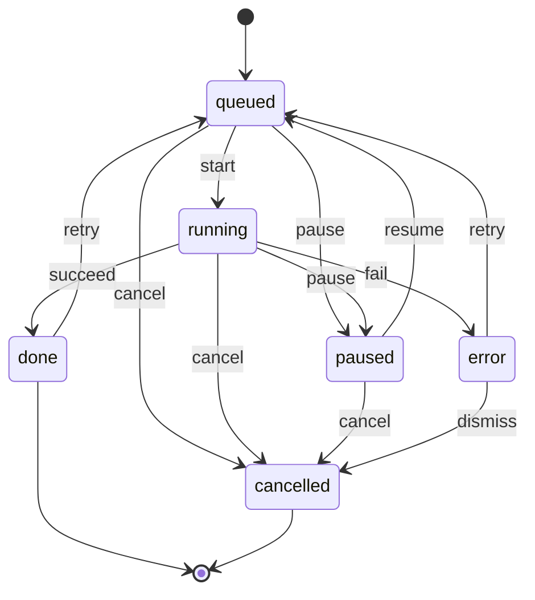

# Timers, Scheduling & State Machines

Timers look easy and are where most candidates quietly lose points: the naive solution increments a counter inside `setInterval`, so it drifts, and a timer that is not torn down keeps firing after unmount. Every problem here shares one discipline &mdash; store *timestamps*, never accumulated deltas; derive the display; clean up every subscription &mdash; and the Task Scheduler raises it to a full concurrency-aware state machine.

---

## Stopwatch

`Difficulty: Medium` `Probability: Very High`

### What are we building?

A stopwatch with Start, Stop (pause), Reset, and Lap. It shows elapsed time to the hundredth of a second, records lap totals, derives each lap's split, and keeps the correct elapsed value even when the tab is throttled or the frame rate drops.

### Example

```text
00:00.00                       [ Start ]
00:12.34                       [ Lap ] [ Stop ]
Lap 1   00:12.34
00:25.11                       [ Lap ] [ Stop ]
Lap 2   00:12.77               [ Reset ]
```

Start resumes from the paused value. Stop freezes it. Reset returns to zero and clears laps. Lap records the current total; the split is the difference from the previous lap.

### What is the interviewer testing?

- Timestamp math (`performance.now()`) instead of incrementing a counter
- Understanding of `setInterval` drift and background-tab throttling
- Derived values: elapsed and lap splits are computed during render
- Functional state updates and stale-closure avoidance
- Cleanup of the animation frame on stop and unmount
- Formatting and accessible announcements without spamming a live region

### State Design

```ts
status: "idle" | "running" | "paused"   // one enum, not a `running` boolean
startedAt: number | null                // performance.now() when the current run began
elapsedBefore: number                   // ms accumulated across previous runs
now: number                             // repaint tick, refreshed only while running
laps: { id: number; totalMs: number }[] // elapsed at the moment of each lap
```

Derived during render:

```ts
const elapsed = elapsedBefore + (startedAt === null ? 0 : Math.max(0, now - startedAt));
const split = laps[i].totalMs - (i === 0 ? 0 : laps[i - 1].totalMs); // derived, never stored
```

**Do NOT store:** `running` as a boolean alongside `status`; `elapsedMs` as a value you add to each tick; `formatted` strings; `lapSplits` (subtract consecutive totals); `isPaused` (the enum already says so). Each duplicated value is one more thing that can drift out of sync with the clock.

### Basic Version

```ts
type Status = "idle" | "running" | "paused";
type Lap = { id: number; totalMs: number };

const pad = (n: number, width = 2) => String(n).padStart(width, "0");

function format(ms: number): string {
  const total = Math.max(0, Math.floor(ms));
  const minutes = Math.floor(total / 60_000);
  const seconds = Math.floor((total % 60_000) / 1000);
  const hundredths = Math.floor((total % 1000) / 10);
  return `${pad(minutes)}:${pad(seconds)}.${pad(hundredths)}`;
}

export function Stopwatch() {
  const [status, setStatus] = useState<Status>("idle");
  const [startedAt, setStartedAt] = useState<number | null>(null);
  const [elapsedBefore, setElapsedBefore] = useState(0);
  const [now, setNow] = useState(0);
  const [laps, setLaps] = useState<Lap[]>([]);
  const lapSeq = useRef(0);

  // elapsed is derived from two timestamps, never accumulated
  const elapsed = elapsedBefore + (startedAt === null ? 0 : Math.max(0, now - startedAt));

  useEffect(() => {
    if (status !== "running") return;
    let frame = requestAnimationFrame(function loop(t: number) {
      setNow(t);                                 // repaint trigger only
      frame = requestAnimationFrame(loop);
    });
    return () => cancelAnimationFrame(frame);    // runs on pause and unmount
  }, [status]);

  const start = () => {
    if (status === "running") return;
    const t = performance.now();
    setStartedAt(t);
    setNow(t);                                   // avoid a negative first frame
    setStatus("running");
  };

  const pause = () => {
    if (status !== "running" || startedAt === null) return;
    setElapsedBefore((prev) => prev + Math.max(0, performance.now() - startedAt));
    setStartedAt(null);
    setStatus("paused");
  };

  const reset = () => {
    setStatus("idle");
    setStartedAt(null);
    setElapsedBefore(0);
    setNow(0);
    setLaps([]);
    lapSeq.current = 0;
  };

  const addLap = () => {
    if (status !== "running") return;
    lapSeq.current += 1;
    setLaps((prev) => [...prev, { id: lapSeq.current, totalMs: elapsed }]);
  };

  return (
    <section aria-labelledby="stopwatch-heading">
      <h3 id="stopwatch-heading">Stopwatch</h3>

      <output aria-live="off" className="stopwatch__time">
        {format(elapsed)}
      </output>

      <div role="group" aria-label="Stopwatch controls">
        <button onClick={start} disabled={status === "running"}>
          {elapsedBefore > 0 || status === "paused" ? "Resume" : "Start"}
        </button>
        <button onClick={pause} disabled={status !== "running"}>
          Stop
        </button>
        <button onClick={addLap} disabled={status !== "running"}>
          Lap
        </button>
        <button onClick={reset} disabled={status === "idle" && elapsed === 0 && laps.length === 0}>
          Reset
        </button>
      </div>

      {laps.length > 0 && (
        <table>
          <caption>Laps</caption>
          <thead>
            <tr>
              <th scope="col">Lap</th>
              <th scope="col">Split</th>
              <th scope="col">Total</th>
            </tr>
          </thead>
          <tbody>
            {laps.map((lap, i) => {
              const split = lap.totalMs - (i === 0 ? 0 : laps[i - 1].totalMs);
              return (
                <tr key={lap.id}>
                  <th scope="row">{i + 1}</th>
                  <td>{format(split)}</td>
                  <td>{format(lap.totalMs)}</td>
                </tr>
              );
            })}
          </tbody>
        </table>
      )}
    </section>
  );
}
```

### How It Works

- Elapsed is **`elapsedBefore + now - startedAt`**, not `elapsed + 100` per tick. A dropped frame or a throttled background tab makes the display update less often; it never makes the *value* wrong.
- The effect owns the animation frame and only exists while `status === "running"`. Changing status re-runs the effect and its cleanup cancels the pending frame, so Stop genuinely stops the loop.
- `performance.now()` is monotonic and immune to wall-clock adjustments. `Date.now()` would jump if the machine's clock changed or NTP corrected it, which is the wrong failure mode for a stopwatch.
- Pause folds the current run into `elapsedBefore` and clears `startedAt`; resume starts a fresh `startedAt`. Both directions preserve sub-second accuracy at the moment of the click, not the last painted frame.
- Laps store totals. Splits are derived by subtraction, so there is no second list to keep consistent, and a lap added one frame late is corrected by the next one only in the sense that its total is whatever `elapsed` was at that render &mdash; call this out and use a ref if you need frame-exact laps.

### Edge Cases

- **Background tab / throttling:** rAF pauses entirely. Timestamp math still returns the correct elapsed on return; a counter would have lost all that time.
- **Double Start:** guarded by `status === "running"` and the `startedAt === null` check in pause.
- **Lap while paused:** disable Lap unless running, or capture the frozen `elapsed` (say which you chose).
- **Unmount while running:** the effect cleanup cancels the frame; no "setState on unmounted" and no leaking loop.
- **Very long durations:** `format` pads minutes only; extend to hours (`HH:MM:SS.cc`) if needed. Milliseconds stay exact well beyond a day.
- **System clock change / sleep:** avoided by the monotonic clock. If you must survive a reload, persist an absolute epoch and accept that it *is* wall-clock dependent.
- **Rapid Start/Stop:** every handler uses the functional form where the next value depends on the previous, so batched clicks cannot lose a run.

### Interview Follow-ups

- **Level 1:** Start / Stop / Reset with `elapsed += 100`. Then explain precisely why it drifts: `setInterval` is best-effort, background tabs clamp it to ~1s, and every late callback silently drops time.
- **Level 2:** Timestamp math with `performance.now()` (the version above).
- **Level 3:** Laps with derived splits and fastest/slowest highlighting (derive min/max; do not store them).
- **Level 4:** Extract `useStopwatch()` returning `{ elapsed, status, start, pause, toggle, reset, lap, laps }` so the view is presentational.
- **Level 5:** Persist across reloads. Store `{ startedAtEpoch, elapsedBefore }` and on load convert to `Date.now()`; if it was running, continue it.
- **Level 6:** Add a countdown mode that shares the same clock (see **Countdown Timer**).
- **Level 7:** Multiple stopwatches sharing **one** rAF loop. Put the ticker in a store and expose it with `useSyncExternalStore`, so `N` stopwatches cause one frame callback, not `N`.

### Production Version

A real timing feature should have a single global ticker: one `requestAnimationFrame` loop notifies subscribers, and each stopwatch reads the shared clock with `useSyncExternalStore`. N components then cost one loop. Persist the run as an absolute timestamp so a reload resumes correctly, and keep the derived formatter in one module. If the elapsed value must be correlated with other measurements (analytics, performance traces), stay on `performance.now()` inside the session and use the User Timing API rather than mixing in `Date.now()`.

### Accessibility

- The ticking display should **not** be a live region: `aria-live="off"` on the `<output>` prevents a screen reader from reading every hundredth of a second. Instead announce coarse events ("Started", "Stopped at 12.34 seconds", "Lap 3, 25.11 seconds") through a separate `aria-live="polite"` node.
- Use real text buttons; do not encode running/paused only with color.
- Optional keyboard shortcuts (Space to start/pause, L to lap, R to reset) must be documented and must not hijack typing inside inputs.

### Performance

A 60fps `setNow` is cheap for one component, but re-rendering a long lap table every frame is not. Split the fast-changing display into a tiny child that subscribes to the tick, and memoize the lap table so it re-renders only when `laps` changes. Do not put `now` in a common ancestor that renders the whole page. Formatting allocates a string each frame; that is fine at this scale, and premature optimization here is noise.

### Testing

```text
✓ renders 00:00.00 before starting
✓ Start begins the timer; Stop freezes the displayed value
✓ elapsed is computed from timestamps, not an incrementing counter
✓ Reset returns to 00:00.00 and clears laps
✓ Lap records the current total; splits are derived from totals
✓ unmount cancels the animation frame and does not update after unmount
```

Notes: use fake timers (`vi.useFakeTimers()` / `jest.useFakeTimers()`) and mock `requestAnimationFrame` plus `performance.now()` so you can advance deterministically. Prefer asserting on `elapsed` from a `useStopwatch` hook test; asserting rendered hundredths couples the test to frame cadence and is flaky.

### Common Mistakes

- `setElapsed((e) => e + 100)` in `setInterval`. Every delayed callback loses time and a background tab loses seconds.
- Storing `isRunning`, `elapsed`, and `startedAt` and then trying to keep them in sync with effects.
- Forgetting `clearInterval` / `cancelAnimationFrame` in the cleanup.
- Using `Date.now()` for elapsed, so an NTP correction or manual clock change corrupts the timer.
- Putting the changing `now` in the rAF effect's dependency array, recreating the loop every frame.
- Storing lap splits next to lap totals; one of them will be wrong after an edit or a delete.

### Interview Takeaway

Store when a run **started** and how much was **accumulated before** it, then derive elapsed from a monotonic clock. The interval or animation frame is only a repaint trigger; the time itself must never depend on how often the callback fires. That one distinction is the difference between a stopwatch that drifts and one that does not.

---

## Countdown Timer

`Difficulty: Medium` `Probability: High`

### What are we building?

A countdown driven by a target timestamp. The user configures a duration, the timer counts down, and it supports pause, resume, reset, zero-clamping, and an `onComplete` callback that fires exactly once. A small progress ring or bar makes the derived state visible.

### Example

```text
Duration: [ 05 ] minutes      [ Start ]

05:00   [ Pause ] [ Reset ]
02:31   Time remaining  ◐
00:00   Time's up!            [ Reset ]
```

### What is the interviewer testing?

- Target-timestamp math (`endsAt`) instead of subtracting one per second
- Pause/resume that survives an arbitrary number of interruptions
- Clamping at zero and firing completion exactly once
- Cleanup and stale-closure avoidance
- Keeping `onComplete` out of the effect's dependency churn
- Choosing the right clock for the job

### State Design

```ts
type Status = "idle" | "running" | "paused" | "done";

durationMs: number          // configured total length
endsAt: number | null       // Date.now() ms at which it should reach zero (while running)
remainingMs: number         // frozen remaining snapshot (while idle or paused)
tick: number                // repaint timestamp, refreshed only while running
status: Status
```

Derived during render:

```ts
const left = status === "running" && endsAt !== null
  ? Math.min(durationMs, Math.max(0, endsAt - tick))
  : remainingMs;
const progress = durationMs === 0 ? 1 : 1 - left / durationMs; // 0..1
```

A more rigorous shape is a discriminated union, where only the active phase is representable:

```ts
type Timer =
  | { status: "idle"; remainingMs: number }
  | { status: "running"; endsAt: number }
  | { status: "paused"; remainingMs: number }
  | { status: "done" };
```

**Do NOT store:** `left` or `secondsLeft` as a value you decrement; the `formatted` string; `progress`; `isComplete`; or `isRunning` next to `status`. `remainingMs` is the *paused* snapshot &mdash; it is intentionally ignored while running, and the union above removes even that ambiguity.

### Basic Version

```ts
type Status = "idle" | "running" | "paused" | "done";

const clamp = (n: number, min: number, max: number) => Math.min(max, Math.max(min, n));

export function Countdown({
  durationMs,
  onComplete,
}: {
  durationMs: number;
  onComplete?: () => void;
}) {
  const [status, setStatus] = useState<Status>("idle");
  const [remainingMs, setRemainingMs] = useState(durationMs);
  const [endsAt, setEndsAt] = useState<number | null>(null);
  const [tick, setTick] = useState(0);

  // keep the latest callback without making it an effect dependency
  const onCompleteRef = useRef(onComplete);
  useEffect(() => {
    onCompleteRef.current = onComplete;
  }, [onComplete]);

  const left =
    status === "running" && endsAt !== null
      ? clamp(endsAt - tick, 0, durationMs)
      : remainingMs;

  // repaint only while running
  useEffect(() => {
    if (status !== "running") return;
    let frame = requestAnimationFrame(function loop() {
      setTick(Date.now());                        // wall clock, same origin as endsAt
      frame = requestAnimationFrame(loop);
    });
    return () => cancelAnimationFrame(frame);
  }, [status]);

  // fire exactly once when the deadline is reached
  useEffect(() => {
    if (status !== "running" || left > 0) return;
    setStatus("done");
    onCompleteRef.current?.();
  }, [status, left]);

  const start = () => {
    if (status === "running" || remainingMs <= 0) return;
    const t = Date.now();
    setEndsAt(t + remainingMs);
    setTick(t);
    setStatus("running");
  };

  const pause = () => {
    if (status !== "running" || endsAt === null) return;
    setRemainingMs(clamp(endsAt - Date.now(), 0, durationMs));
    setEndsAt(null);
    setStatus("paused");
  };

  const reset = () => {
    setStatus("idle");
    setEndsAt(null);
    setRemainingMs(durationMs);
    setTick(0);
  };

  const progress = durationMs === 0 ? 1 : 1 - left / durationMs;

  return (
    <section aria-labelledby="countdown-heading">
      <h3 id="countdown-heading">Countdown</h3>

      <div role="timer" aria-label="Time remaining" className="countdown__time">
        {format(left)}
      </div>

      <div
        role="progressbar"
        aria-label="Countdown progress"
        aria-valuemin={0}
        aria-valuemax={100}
        aria-valuenow={Math.round(progress * 100)}
        className="bar"
      >
        <div className="bar__fill" style={{ transform: `scaleX(${progress})` }} />
      </div>

      <div role="group" aria-label="Countdown controls">
        <button onClick={start} disabled={status === "running" || remainingMs <= 0}>
          {status === "paused" ? "Resume" : "Start"}
        </button>
        <button onClick={pause} disabled={status !== "running"}>
          Pause
        </button>
        <button onClick={reset}>Reset</button>
      </div>

      {status === "done" && <p role="status">Time&rsquo;s up!</p>}
    </section>
  );
}
```

### How It Works

- `endsAt` is an **absolute deadline**. Rendering computes `endsAt - now`, so if frames arrive late the remaining time is still correct; a late frame shows a *larger* one-time jump, not accumulated error.
- Pause converts the deadline back to `remainingMs`; resume creates a new deadline from the snapshot. Both directions go through remaining, so accuracy survives any number of pauses.
- `Math.max(0, ...)` clamps so the display never shows `-00:01` and progress never exceeds 100%.
- Completion is an effect that fires only on the `running &rarr; done` transition. `setStatus("done")` makes every later frame a no-op, so `onComplete` runs exactly once even when several frames observe zero.
- `onCompleteRef` is the important detail: an inline arrow at the call site would be a new function every render, re-running an effect that depends on it and potentially calling `onComplete` repeatedly.
- Countdown uses `Date.now()` rather than `performance.now()`. A deadline is inherently wall-clock: it must remain meaningful across a tab suspension and, if persisted, across a reload. The repaint loop reads the same clock, so the subtraction stays consistent.

### Edge Cases

- **Duration `0` or negative:** treat as immediately done, or reject it in the setter. Never allow a negative deadline.
- **`NaN` from an empty input:** parse and default to `0` before it reaches state.
- **Pause when not running / resume when not paused:** both are no-ops.
- **Resume at zero:** treat as done rather than restarting.
- **Background tab / sleep:** with a wall-clock deadline the timer self-corrects and may already be done when the tab returns.
- **Unmount while running:** cancel the frame and do not call `onComplete` after unmount (the completion effect is torn down with the component).
- **Unstable `onComplete` prop:** solved by the ref pattern above.
- **Reset while running:** changing status re-runs the repaint effect; the cleanup cancels the old frame.

### Interview Follow-ups

- **Level 1:** Count down from a fixed duration with `setLeft(left - 1)` each second, then explain the drift.
- **Level 2:** Deadline-based countdown with pause/resume (the version above).
- **Level 3:** Add the progress ring/bar and a distinct done state with `onComplete`.
- **Level 4:** Extract `useCountdown(durationMs)` returning `{ left, status, progress, start, pause, reset }`.
- **Level 5:** Allow adding or subtracting time while running by adjusting `endsAt` (and clamp to `[0, durationMs]`).
- **Level 6:** Run several independent timers from one global ticker instead of one rAF loop each.
- **Level 7:** Pomodoro: alternate work/break phases automatically. This is now a two-phase machine &mdash; build it the way the **Traffic Light** build is structured rather than with nested `setTimeout`s.

### Production Version

Persist `endsAt` as an absolute `Date.now()` epoch so a reload continues the countdown: `left = Math.max(0, endsAt - Date.now())`, and if the deadline has passed, render done. For completion while the tab is hidden, use the Notifications API or a service worker alarm. If several timers exist, expose one ticker through `useSyncExternalStore` so a single interval serves all of them. When the deadline comes from the server, treat the server timestamp as authoritative and compute against a corrected clock to avoid client clock skew.

### Accessibility

- `role="timer"` names the region; keep its live behavior off by default and announce completion with `role="status"` (polite) or `role="alert"` if urgent.
- Do not announce every tick. Announce coarse thresholds (five minutes, one minute, ten seconds) or only completion.
- The progress bar needs `role="progressbar"` with `aria-valuemin/max/now` and an accessible name. Provide text next to it so the value is not conveyed by a ring alone.
- Buttons change meaning (`Start` &harr; `Resume`, `Pause`), so their labels must change too, not just their appearance.

### Performance

Formatting once per frame is trivial; re-rendering a large page per frame is not. Keep the ticking state local to the timer. Prefer animating `transform`/`scaleX` or `stroke-dashoffset` (compositor-friendly) over `width` (layout-triggering), and honor `prefers-reduced-motion` by snapping the ring instead of animating it.

### Testing

```text
✓ shows the configured duration before starting
✓ counts down from the deadline, not a per-second decrement
✓ pause freezes the value; resume continues from the same value
✓ clamps at 00:00 and never renders a negative time
✓ onComplete fires exactly once
✓ unmount cancels the loop and never calls onComplete
```

Notes: fake timers plus a mocked `Date.now()` (or a mocked clock) let you advance to the deadline deterministically. For "exactly once", render with a spy callback, advance well past the deadline across several increments, and assert `toHaveBeenCalledTimes(1)`.

### Common Mistakes

- `setLeft((l) => l - 1)` every second: drifts, skips, and is simply wrong after a backgrounded tab.
- Calling `onComplete` from inside the tick with no guard, so it fires on every frame at zero.
- Listing an inline `onComplete` in the effect dependencies, causing repeated calls.
- Not clamping, so the UI shows `-00:01`.
- Resuming from `durationMs` instead of `remainingMs`, silently restarting the timer.
- Forgetting to cancel the loop on unmount.
- Mixing clocks (`performance.now()` for `endsAt`, `Date.now()` for the tick), which produces nonsense differences.

### Interview Takeaway

A countdown is a **deadline**, not a subtraction. Store the absolute time it should reach zero and derive remaining from a tick. Pause is "deadline &rarr; remaining", resume is "remaining &rarr; new deadline", and completion is a guarded one-shot transition, not a side effect of a frame.

---

## Traffic Light

`Difficulty: Easy` `Probability: Medium`

### What are we building?

A traffic light that cycles red &rarr; green &rarr; yellow &rarr; red with configurable phase durations, plus controls to pause and change the speed. It is the smallest honest state machine with timers, and the cleanest place to demonstrate a timeout chain with correct teardown.

### Example

```text
  ( RED   )   ●     4s
  ( YELLOW)   ○     1.5s
  ( GREEN )   ○     4s

  [ Pause ]   Speed:  ( ) 0.5x  (•) 1x  ( ) 2x
```

The active lamp changes every phase; pause freezes the cycle; speed rescales the demo without touching the machine.

### What is the interviewer testing?

- One phase value instead of mutually-exclusive booleans
- A timeout **chain** (one `setTimeout` per phase) vs a single counting interval
- Cleanup when the phase, speed, or running state changes, and on unmount
- Data-driven transitions instead of an `if/else` ladder
- Configurable durations and stale-closure awareness
- Testing cyclic time with fake timers

### State Design

```ts
type Light = "red" | "green" | "yellow";

phase: Light    // the entire machine state
running: boolean
speed: number   // 1 is real time

const ORDER: readonly Light[] = ["red", "green", "yellow"];
const DURATIONS: Record<Light, number> = { red: 4000, green: 4000, yellow: 1500 };
```

The transition is data, not code: `ORDER[(ORDER.indexOf(phase) + 1) % ORDER.length]`.

**Do NOT store:** `isRed` / `isGreen` / `isYellow` (three booleans that can contradict each other); `currentDuration` (derive from `phase` and `DURATIONS`); `nextPhase` (derive from `ORDER`); a `remaining` value unless you actually implement resume-at-remaining. Here a plain `running` boolean is fine because there is no richer status to represent; once you add a pedestrian request or a maintenance mode, promote it to a status enum so the invalid combinations stay unrepresentable.

### Basic Version

```ts
type Light = "red" | "green" | "yellow";

const ORDER: readonly Light[] = ["red", "green", "yellow"];
const DURATIONS: Record<Light, number> = { red: 4000, green: 4000, yellow: 1500 };

export function TrafficLight() {
  const [phase, setPhase] = useState<Light>("red");
  const [running, setRunning] = useState(true);
  const [speed, setSpeed] = useState(1);

  useEffect(() => {
    if (!running) return;

    const next = ORDER[(ORDER.indexOf(phase) + 1) % ORDER.length];
    const id = window.setTimeout(() => setPhase(next), DURATIONS[phase] / speed);

    return () => window.clearTimeout(id);
  }, [phase, running, speed]);

  return (
    <section aria-labelledby="traffic-heading">
      <h3 id="traffic-heading">Traffic light</h3>

      <div role="group" aria-label="Traffic light state">
        {(["red", "yellow", "green"] as const).map((light) => (
          <div
            key={light}
            aria-current={phase === light ? "true" : undefined}
            className={phase === light ? `light light--${light} is-on` : "light"}
          >
            <span className="sr-only">{light}</span>
          </div>
        ))}
      </div>

      <button onClick={() => setRunning((r) => !r)}>{running ? "Pause" : "Start"}</button>

      <fieldset>
        <legend>Speed</legend>
        {[0.5, 1, 2].map((rate) => (
          <label key={rate}>
            <input
              type="radio"
              name="speed"
              checked={speed === rate}
              onChange={() => setSpeed(rate)}
            />
            {rate}x
          </label>
        ))}
      </fieldset>
    </section>
  );
}
```

### How It Works

- `phase` is the whole machine: `"red" | "green" | "yellow"`. "Red and green at once" is not a representable state, which is the entire point of a discriminated union.
- The effect schedules exactly **one** timeout for the current phase, and its cleanup clears it. Changing `phase`, `running`, or `speed` re-runs the effect, so pause and speed changes need no extra bookkeeping &mdash; changing any of them cancels the pending transition.
- `ORDER[(index + 1) % length]` derives the next phase from data. Adding a "flashing yellow" maintenance phase means editing `ORDER` and `DURATIONS`, not the scheduling logic.
- Dividing the duration by `speed` scales the simulation without altering the machine.
- `aria-current` marks the active lamp and the visible text alternative (`sr-only`) means the phase is not conveyed by color alone.

### Edge Cases

- **Unmount:** the cleanup clears the last timeout, so nothing fires afterward.
- **Pause mid-phase:** `running` flips false, cleanup clears the pending timeout, the effect returns early. Resuming restarts the **full** phase duration &mdash; true resume-at-remaining needs `endsAt` + `remainingMs` (see the Countdown design) and belongs in the follow-ups.
- **Speed change mid-phase:** the effect re-runs and reschedules from the current phase with the new duration. State this behavior explicitly; silently resetting the phase would be a bug.
- **Zero or negative durations:** guard, or the light cycles as fast as the event loop allows.
- **Reduced motion:** there is no required motion; the change is a color/text swap, so nothing to disable.

### Interview Follow-ups

- **Level 1:** A single `setInterval` that increments a counter and cycles the lights with modulo. It works, and it is the baseline you then improve.
- **Level 2:** Data-driven durations and a timeout chain with cleanup (the version above).
- **Level 3:** Pause/resume that resumes at the remaining time. Store `endsAt` and a frozen `remainingMs`, exactly like **Countdown Timer**.
- **Level 4:** A pedestrian button. A press sets `walkRequested`; the machine guarantees a red + walk phase, and shortens the current green when safe. This is where `running` stops being enough &mdash; introduce a status/phase union.
- **Level 5:** Emergency all-red and a flashing-yellow maintenance mode. Draw the machine before you code it: each mode is a state with its own transition table.
- **Level 6:** Extract `useTrafficLight(config)` and drive it with a reducer (`TICK`, `PAUSE`, `RESUME`, `REQUEST_WALK`, `SET_MODE`) so the transitions are unit-testable without timers.
- **Level 7:** Several intersections sharing one global ticker instead of one timeout chain each.

### Production Version

Real signal controllers are safety-critical state machines: explicit transition tables, minimum and maximum phase durations, and interlocks that make conflicting greens impossible. The React simulation has the same skeleton &mdash; a transition table plus a scheduler. Keep durations in config, keep transitions pure, and drive them from one clock. If the phase reflects a server or hardware state, treat the remote value as authoritative and render it directly rather than running an independent local cycle that can disagree.

### Accessibility

- Never signal the phase with color alone. Provide the text (`Red`, `Green`, `Yellow`) visibly or with a visually hidden label, and expose the active one with `aria-current`.
- Announce phase changes politely (`aria-live="polite"`) or via a status region, but do not put the whole light in a live region that re-announces on every render.
- Pause and speed controls are real buttons and a labelled `radiogroup`; radio inputs give arrow-key selection for free.

### Performance

Changing a class every few seconds is free. There is no reason to run a 60fps loop to switch a light on a multi-second cadence &mdash; a timeout per phase is strictly better than a fast interval with a counter. If you animate a countdown ring, animate compositor-friendly properties (`transform`, `opacity`) and respect `prefers-reduced-motion`.

### Testing

```text
✓ starts on red
✓ advances red -> green -> yellow -> red with fake timers
✓ pause stops the cycle (no further transition after advancing time)
✓ resume continues the cycle
✓ each phase lasts its configured duration
✓ unmount clears the pending timeout
```

Notes: `vi.useFakeTimers()` plus `vi.advanceTimersByTime(4000)` inside `act()` is the whole test; assert the active lamp after each advance. Because the chain is stateful, advance one phase at a time rather than one big jump, otherwise you only prove the final value.

### Common Mistakes

- Three booleans (`isRed`, `isGreen`, `isYellow`) that can all be true at once.
- One `setInterval` with an empty dependency array that reads a stale `phase` from its closure and never really changes.
- Forgetting to clear the timeout when the phase changes, so two chains race and the light skips states.
- Recreating a `setInterval` on every render.
- Resuming from the full duration while claiming it resumes where it left off.
- Treating the speed multiplier as state and recomputing it inside the timeout callback from a stale closure.

### Interview Takeaway

Cyclic behavior should be a state machine: one `phase` value, a data-driven transition table, and **one scheduled transition at a time**, with cleanup as part of the transition. "Cancel the old timer before scheduling the new one" is the entire discipline, and it is exactly what keeps pause, speed changes, and unmount correct.

---

## Task Scheduler / Progress Bars

`Difficulty: Hard` `Probability: Very High`

### What are we building?

A task queue with visible progress. You can add tasks, watch their bars fill, run several concurrently up to a limit, and pause, resume, retry, or cancel any task. Every task is in exactly one of six states, and the list is driven by a scheduler that promotes queued work as slots free up. This is one problem with a six-level ladder, not six separate exercises.

### Example

```text
Add: [ Build report          ] [ Add ]        Running 2 of 3

[ Start all ] [ Pause all ] [ Clear done ]

  Build report      ████████░░░░░░   62%   running    [Pause] [Cancel]
  Resize images     ████░░░░░░░░░░   31%   running    [Pause] [Cancel]
  Export CSV        ░░░░░░░░░░░░░░    0%   queued
  Upload assets     ████████████░░   90%   paused     [Resume] [Cancel]
  Send email        ██████████████  100%   done       [Retry]
  Sync CRM          ██████░░░░░░░░   48%   error      [Retry] [Dismiss]
```

### What is the interviewer testing?

- Modeling asynchronous progress as an explicit per-task state machine
- A scheduler that enforces a concurrency limit and reacts to completions
- Correct teardown: no orphaned intervals, no progress after cancel, no updates after unmount
- Reducer discipline across a list of independently-changing objects
- The semantics of pause, resume, cancel, and retry &mdash; including what "cancel" means for a real promise
- Extracting a reusable hook with a clean interface and swapping in real async work
- Stale closure and generation-counter ("is this result still current?") reasoning

This is one of the highest-signal questions in the bank, because no CSS or DOM trick can fake the scheduler.

### State Design

```ts
type TaskStatus = "queued" | "running" | "paused" | "done" | "error" | "cancelled";

type Task = {
  id: string;
  label: string;
  status: TaskStatus;
  progress: number;   // 0..100
  durationMs: number; // for the fake runner
  attempts: number;
  error?: string;
  runId: number;      // increments on every start/resume; stale results carry an old runId
};

type QueueState = {
  tasks: Task[];      // order is priority
  concurrency: number;
};
```

Derived, never stored: `runningCount`, `overallProgress`, `canStart`, and any `isPaused` flag.

The transitions form a small machine. `runId` is the safety net: every new run gets a new identity, so a result arriving from a previous run (after pause, cancel, or retry) can be recognized and ignored.



**Do NOT store:** `runningCount` (derive with `.filter()`), `overallPercent` (derive as the mean of task progress), `canStart` (derive from queued count and concurrency), a separate `isPaused` when `status` already says so, and never a second copy of `progress` in a DOM ref *and* in state. One representation, many derivations.

### Basic Version

The ladder starts with a single self-animating bar. It uses the same timestamp math as the other timers, so it is the seed that the follow-ups generalize.

```ts
function useFakeProgress(durationMs: number, active: boolean) {
  const [progress, setProgress] = useState(0);
  const offset = useRef(0);
  offset.current = progress; // read the current value once, when a run starts

  useEffect(() => {
    if (!active) return;
    const startedAt = performance.now() - (offset.current / 100) * durationMs;

    let frame = requestAnimationFrame(function loop(t: number) {
      const next = Math.min(100, ((t - startedAt) / durationMs) * 100);
      setProgress(next);
      if (next < 100) frame = requestAnimationFrame(loop);
    });

    return () => cancelAnimationFrame(frame);
  }, [active, durationMs]);

  return progress;
}

export function ProgressBar({ label, value }: { label: string; value: number }) {
  return (
    <div
      role="progressbar"
      aria-label={label}
      aria-valuemin={0}
      aria-valuemax={100}
      aria-valuenow={Math.round(value)}
      className="bar"
    >
      <div className="bar__fill" style={{ transform: `scaleX(${value / 100})` }} />
      <span className="bar__text">{Math.round(value)}%</span>
    </div>
  );
}

export function SingleTask() {
  const [active, setActive] = useState(false);
  const progress = useFakeProgress(4000, active);

  return (
    <section aria-labelledby="task-heading">
      <h3 id="task-heading">Task</h3>
      <ProgressBar label="Build report" value={progress} />
      <button onClick={() => setActive(true)} disabled={active}>
        Start
      </button>
    </section>
  );
}
```

### How It Works

- Progress is derived from `startedAt` and the current frame timestamp, exactly like the stopwatch. A dropped frame changes when the bar is painted, never how far along it is.
- The effect starts the run when `active` becomes true and cancels the frame on teardown. `offset.current` lets a resumed run continue from the current progress without making `progress` an effect dependency (which would restart the loop every frame).
- The bar is a `role="progressbar"` with `aria-valuenow`, so it is real UI rather than a decorated `<div>`.
- The fill uses `transform: scaleX(...)` (compositor-only) instead of `width` (layout + paint), which matters the moment there are many bars animating at once.

### Edge Cases

- **`durationMs <= 0`:** clamp or complete immediately; do not divide by zero.
- **Progress overshoot:** clamp at 100 and stop scheduling frames.
- **Restart while running:** cancel the old frame first; a generation counter is the robust version (level 5).
- **Unmount mid-run:** the cleanup cancels the frame.
- **`prefers-reduced-motion`:** render the value without the fill animation.

### Interview Follow-ups

The rest of the question is the ladder. Each level builds directly on the previous one; do not jump to the hook.

**Level 1 &mdash; a single animated progress bar.** The Basic Version above: one task, timestamp-based progress, start/pause/reset, cleanup. Confirm the bar is a real `progressbar` and that progress is derived rather than incremented.

**Level 2 &mdash; a sequential queue (one at a time).** The insight is that "sequential" is not a different algorithm &mdash; it is a scheduler with a concurrency limit of `1`. Model the list in a reducer, and have a scheduler effect promote the next queued task whenever nothing is running:

```ts
// concurrency = 1: when no task is running, promote the first queued one
useEffect(() => {
  if (tasks.some((t) => t.status === "running")) return;
  const next = tasks.find((t) => t.status === "queued");
  if (next) dispatch({ type: "START", id: next.id });
}, [tasks]);
```

```ts
// one rAF loop for the whole queue, advancing only the running tasks
const anyRunning = tasks.some((t) => t.status === "running");

useEffect(() => {
  if (!anyRunning) return;
  let last = performance.now();

  let frame = requestAnimationFrame(function loop(now: number) {
    const dt = now - last;
    last = now;
    dispatch({ type: "TICK", dt });
    frame = requestAnimationFrame(loop);
  });

  return () => cancelAnimationFrame(frame);
}, [anyRunning]);
```

```ts
case "TICK": {
  let advanced = false;
  const tasks = state.tasks.map((task) => {
    if (task.status !== "running") return task;
    advanced = true;
    const progress = Math.min(100, task.progress + (action.dt / task.durationMs) * 100);
    return { ...task, progress, status: progress >= 100 ? "done" : "running" };
  });
  return advanced ? { ...state, tasks } : state; // same ref => no wasted render
}
```

Returning the same state reference when nothing is running lets React bail out instead of re-rendering every frame.

**Level 3 &mdash; a concurrency limit (max 3).** Generalize the Level 2 effect into a slot-filling scheduler. This is a semaphore: `concurrency` workers pull from a shared `queued` list.

```ts
// promote queued tasks into every free slot
useEffect(() => {
  const running = tasks.filter((t) => t.status === "running").length;
  const slots = concurrency - running;
  if (slots <= 0) return;

  tasks
    .filter((t) => t.status === "queued")
    .slice(0, slots)
    .forEach((t) => dispatch({ type: "START", id: t.id }));
}, [tasks, concurrency]);
```

Because `START` is ignored unless the task is actually `queued`, this converges even though the effect re-runs after every progress update. When a running task flips to `done`, `running` drops and the next queued task is promoted on the following render &mdash; no completion callback or manual bookkeeping needed. `concurrency = 1` reproduces Level 2 exactly.

**Level 4 &mdash; pause, resume, cancel per task.** Add three actions. The subtle part is resume: a paused task goes back to `queued`, not straight to `running`, so it waits for a free slot and the concurrency limit is never violated.

```ts
function patch(tasks: Task[], id: string, fn: (t: Task) => Task): Task[] {
  return tasks.map((t) => (t.id === id ? fn(t) : t));
}

// inside the reducer
case "PAUSE":
  return patch(state, action.id, (t) =>
    t.status === "running" || t.status === "queued"
      ? { ...t, status: "paused", runId: t.runId + 1 } // invalidate the current run
      : t,
  );

case "RESUME":
  return patch(state, action.id, (t) =>
    t.status === "paused" ? { ...t, status: "queued" } : t,
  );

case "CANCEL":
  return patch(state, action.id, (t) =>
    t.status === "done" || t.status === "cancelled"
      ? t
      : { ...t, status: "cancelled", runId: t.runId + 1 },
  );
```

`PAUSE` increments `runId` so any in-flight result from the current run is stale; the single rAF loop already stops advancing a task that is no longer `running`, and the counter covers real async runners. `RESUME` preserves `progress`, so a resume continues rather than restarts.

**Level 5 &mdash; retry, error, and the full status set.** Now every task proves it is in one of `queued | running | paused | done | error | cancelled`. Add `FAIL` and `RETRY`, plus `attempts`.

```ts
case "START":
  return patch(state, action.id, (t) =>
    t.status === "queued" ? { ...t, status: "running", runId: t.runId + 1 } : t,
  );

case "PROGRESS":
  return patch(state, action.id, (t) =>
    t.status === "running" && t.runId === action.runId
      ? { ...t, progress: clamp(action.progress, t.progress, 100) } // reject stale + backward
      : t,
  );

case "FAIL":
  return patch(state, action.id, (t) =>
    t.status === "running" && t.runId === action.runId
      ? { ...t, status: "error", error: action.error }
      : t,
  );

case "RETRY":
  return patch(state, action.id, (t) =>
    t.status === "error" || t.status === "cancelled"
      ? { ...t, status: "queued", progress: 0, error: undefined, attempts: t.attempts + 1, runId: t.runId + 1 }
      : t,
  );
```

The guard `t.runId === action.runId` is the whole point: a late `PROGRESS` or `SUCCEED` from a task that was paused, retried, or cancelled in the meantime carries an old identity and is dropped. `clamp(action.progress, t.progress, 100)` also rejects a stale frame arriving after a newer one.

| From | Action | To |
|---|---|---|
| `queued` | start | `running` |
| `queued` | pause | `paused` |
| `running` | pause | `paused` |
| `running` | succeed | `done` |
| `running` | fail | `error` |
| `running` / `queued` / `paused` | cancel | `cancelled` |
| `paused` | resume | `queued` |
| `error` | retry | `queued` |
| `error` | dismiss | `cancelled` |
| `done` | retry | `queued` |

**Level 6 &mdash; a generic `useTaskQueue` and a real async task.** The fake rAF tick is replaced by a `runner` adapter. The hook owns scheduling, status, and cancellation; the caller owns what a task actually does.

```ts
type RunnerContext = {
  task: Task;
  signal: AbortSignal;
  onProgress: (value: number) => void;
};

type TaskRunner = (ctx: RunnerContext) => Promise<void>;

function useTaskQueue({ concurrency = 3, runner }: { concurrency?: number; runner: TaskRunner }) {
  const [state, dispatch] = useReducer(queueReducer, { tasks: [], concurrency });
  const runnerRef = useRef(runner);
  useEffect(() => {
    runnerRef.current = runner; // never restart work when the prop identity changes
  }, [runner]);

  // promotion: fill every free slot from the queue
  useEffect(() => {
    const running = state.tasks.filter((t) => t.status === "running").length;
    const slots = state.concurrency - running;
    if (slots > 0) {
      state.tasks
        .filter((t) => t.status === "queued")
        .slice(0, slots)
        .forEach((t) => dispatch({ type: "START", id: t.id }));
    }
  }, [state.tasks, state.concurrency]);

  // execution: start each run exactly once, identified by id + runId
  const inFlight = useRef(new Set<string>());
  const controllers = useRef(new Map<string, AbortController>());

  useEffect(() => {
    for (const task of state.tasks) {
      if (task.status !== "running") continue;

      const key = `${task.id}:${task.runId}`;
      if (inFlight.current.has(key)) continue; // progress updates re-run this effect
      inFlight.current.add(key);

      const controller = new AbortController();
      controllers.current.set(key, controller);
      const { runId } = task;

      runnerRef.current({
        task,
        signal: controller.signal,
        onProgress: (progress) => dispatch({ type: "PROGRESS", id: task.id, runId, progress }),
      })
        .then(() => {
          if (!controller.signal.aborted) dispatch({ type: "SUCCEED", id: task.id, runId });
        })
        .catch((error: unknown) => {
          if (controller.signal.aborted) return;
          dispatch({ type: "FAIL", id: task.id, runId, error: String(error) });
        })
        .finally(() => {
          inFlight.current.delete(key);
          controllers.current.delete(key);
        });
    }
  }, [state.tasks]);

  const cancel = useCallback((id: string) => {
    dispatch({ type: "CANCEL", id });
    for (const [key, controller] of controllers.current) {
      if (key.startsWith(`${id}:`)) controller.abort();
    }
  }, []);

  return {
    tasks: state.tasks,
    add: (label: string) => dispatch({ type: "ADD", label }),
    pause: (id: string) => dispatch({ type: "PAUSE", id }),
    resume: (id: string) => dispatch({ type: "RESUME", id }),
    cancel,
    retry: (id: string) => dispatch({ type: "RETRY", id }),
    clearDone: () => dispatch({ type: "CLEAR_DONE" }),
  };
}
```

```ts
// swap in real work: report progress, honor the abort signal
const runner: TaskRunner = async ({ task, signal, onProgress }) => {
  const res = await fetch(`/api/jobs/${task.id}`, { method: "POST", signal });
  if (!res.ok) throw new Error(`HTTP ${res.status}`);

  // download with a stream to surface real progress
  const reader = res.body?.getReader();
  const total = Number(res.headers.get("content-length")) || 0;
  let received = 0;
  while (reader) {
    const { done, value } = await reader.read();
    if (done) break;
    received += value.byteLength;
    if (total) onProgress((received / total) * 100);
  }
  onProgress(100);
};
```

The `inFlight` set is essential: `dispatch(PROGRESS)` changes `state.tasks`, which re-runs the execution effect, and without a "has this exact run already started?" guard it would spawn a duplicate runner on every progress update. The effect's real job is to reconcile **desired** work (tasks that are `running`) with **actual** work (keys in `inFlight`), which is the same reconciliation shape as Effects in general.

### Production Version

For uploads, `fetch` cannot report request progress &mdash; use `XMLHttpRequest.upload.onprogress`, or stream the response as above for downloads. For server-driven jobs, do not invent local progress: subscribe to SSE or WebSocket updates and treat the server's percent as authoritative, reconciling your optimistic estimate when the truth arrives. Persist the queue (IndexedDB for large payloads, `localStorage` for metadata) if it must survive reloads, and rebuild `runId`s on restore so no persisted in-flight work is treated as current. Concurrency belongs in one place; a library such as `p-limit` expresses the same semaphore, but the interview answer is the scheduler you wrote. For CPU-bound tasks, move the work to a Web Worker so the progress loop stays smooth. If many components need the same queue, hold it in a context or an external store read through `useSyncExternalStore` rather than prop-drilling.

### Accessibility

- Each bar is a `role="progressbar"` with `aria-valuemin/max/now` and an accessible name from the task label.
- Do **not** update `aria-valuenow` 60 times a second; screen readers will thrash. Let the visual fill animate at frame rate, but throttle the announced value (roughly once per second) or announce only status transitions ("Build report finished", "Sync CRM failed").
- Put status changes in a polite live region; keep per-task buttons labelled with the task name ("Pause Build report") so the list is navigable out of context.
- Respect `prefers-reduced-motion` and never encode status by color alone &mdash; pair the status color with its text.

### Performance

- **One** rAF loop for every bar, never one loop per task. The Level 2 tick loop scales to any number of running tasks.
- Animate `transform: scaleX` or `translateX`, not `width`; the former stays on the compositor.
- Avoid re-rendering the whole list every frame. Memoize the row, or split each bar into a leaf that subscribes to its own progress. For very large queues, keep progress in a ref and update the DOM via a subscription, committing to React state only on status changes.
- Do not deep-clone state per tick; the reducer only maps the tasks array, and returns the same reference when nothing is running.

### Testing

```text
✓ a single bar animates to 100% and then stops
✓ concurrency = 1 runs tasks strictly one at a time
✓ concurrency = 3 never runs more than three tasks at once
✓ a queued task starts when a running task finishes
✓ pause freezes progress; resume continues from the same value
✓ cancel stops the task and ignores late progress from its previous runId
✓ retry requeues an errored task and resets progress
✓ the reducer rejects illegal transitions (e.g. DONE from queued)
✓ unmount aborts every in-flight task
```

Notes: test the reducer first, as a pure function, with a table of transitions &mdash; that is where the state machine lives and it needs no timers at all. Then test the scheduler with fake timers and a controllable runner (a promise you resolve by hand), asserting the invariant `runningCount <= concurrency` after every step. Wrap timer advancement and resolutions in `act()`. For cancellation, resolve the runner *after* abort and assert the status did not change.

### Common Mistakes

- One `setInterval` per task, never cleared, or a new one created every render.
- Restarting the runner on every progress update because the execution effect depends on the whole `tasks` array &mdash; the `inFlight` key guard exists precisely to prevent this.
- Storing a `running` boolean per task *and* a status enum, which can disagree.
- No `runId`/generation counter, so a cancelled or retried task receives stale progress and jumps back to running.
- `setProgress((p) => p + 10)`: drifts, overshoots, and ignores pause and concurrency.
- Deriving an `overallPercent` into state instead of computing it during render.
- Mutating a task in place (`task.progress = x`) so React never sees a change.
- `concurrency` of 0 (deadlock) or a negative value; clamp it to at least 1.
- Not aborting the real request on cancel, so the promise resolves and flips a cancelled task back to done.
- Letting the task list grow unbounded because `done`/`error` rows are never cleared.

### Interview Takeaway

A task queue is two things: a **scheduler** (who gets to run) and a **state machine** (what each task is doing). Keep each task's status explicit and immutable, derive counts and overall progress during render, promote queued work from an effect that reacts to transitions so completion handling is automatic, and give every run an identity (`runId`) so late results can be recognized and dropped. Get those four right and the ladder from one bar to a real async queue is the same design at every level.
