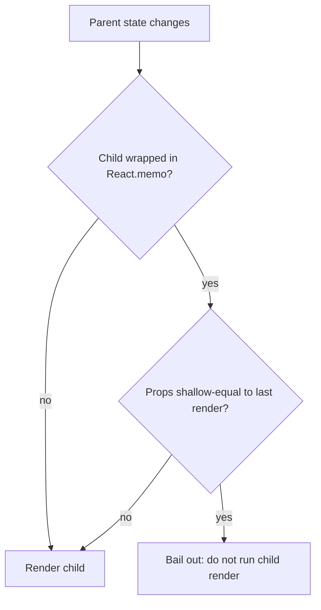

# Performance & Large Data

These problems share one skill: only do work proportional to what the user can actually see. Virtualization bounds the DOM, deferral bounds the per-keystroke cost, lazy images bound the network, and memoization bounds the render tree &mdash; each is a different way of saying "the dataset is large, but the viewport is small."

---

## Virtualized List

`Difficulty: Hard` `Probability: Very High`

### What are we building?

A list that renders only the rows currently visible in a fixed-height scroll container, no matter how many items exist. Fixed row height keeps the math honest: `scrollTop` divided by `rowHeight` gives the first visible index, the viewport height gives the last, and a spacer keeps the scrollbar proportional to the *full* list. This is the interview-grade version of "render 100,000 rows without freezing", and it is a windowing exercise, not a library exercise.

### Example

```text
scroll container (height = 400px, rowHeight = 40px)

items.length = 100,000        spacer height = 4,000,000px
scrollTop    = 4,000          first visible index = 100
overscan     = 3              rendered window = rows 97..112 (16 DOM nodes)

> row 97
> row 98
  ...
> row 112
```

The DOM contains ~16 rows. The scrollbar still reflects 100,000 rows because an invisible spacer is 4,000,000px tall.

### What is the interviewer testing?

- The windowing formula: `startIndex`, `endIndex`, and the spacer height
- Overscan to hide blank flashes while scrolling fast
- `scrollTop` as the only state; everything else derived during render
- Absolute positioning (or `transform`) so rows do not affect layout
- Stable keys and stable `renderRow`, so the window does not re-render the whole list on every scroll tick
- Awareness that off-screen content leaves the accessibility tree and breaks in-page find

### State Design

```ts
type VirtualListProps<T> = {
  items: T[];
  rowHeight: number;       // fixed, in px
  height: number;          // viewport height, in px
  overscan?: number;       // extra rows above/below
  getKey: (item: T, index: number) => React.Key;
  renderRow: (item: T, index: number) => React.ReactNode;
};

scrollTop: number          // the ONLY state
```

Derived every render:

```ts
const totalHeight = items.length * rowHeight;
const startIndex  = Math.max(0, Math.floor(scrollTop / rowHeight) - overscan);
const endIndex    = Math.min(items.length, Math.ceil((scrollTop + height) / rowHeight) + overscan);
const windowed    = items.slice(startIndex, endIndex);
```

**Do NOT store:** `startIndex`, `endIndex`, `windowed`, `totalHeight`, or the list of visible items. They are all pure functions of `scrollTop`, the props, and `items.length`. Storing them invites a second source of truth that drifts on every scroll. Also do **not** store the container height as state if it is fixed; measure it with a ref only when it can resize.

### Basic Version

```ts
import { useState } from "react";

type VirtualListProps<T> = {
  items: T[];
  rowHeight: number;
  height: number;
  overscan?: number;
  getKey: (item: T, index: number) => React.Key;
  renderRow: (item: T, index: number) => React.ReactNode;
};

export function VirtualList<T>({
  items,
  rowHeight,
  height,
  overscan = 3,
  getKey,
  renderRow,
}: VirtualListProps<T>) {
  const [scrollTop, setScrollTop] = useState(0);

  const totalHeight = items.length * rowHeight;
  const startIndex = Math.max(0, Math.floor(scrollTop / rowHeight) - overscan);
  const endIndex = Math.min(
    items.length,
    Math.ceil((scrollTop + height) / rowHeight) + overscan,
  );

  return (
    <div
      role="list"
      aria-label="Virtualized list"
      onScroll={(e) => setScrollTop(e.currentTarget.scrollTop)}
      style={{ height, overflowY: "auto", position: "relative", overscrollBehavior: "contain" }}
    >
      {/* Spacer: gives the scrollbar the full height without mounting the rows. */}
      <div style={{ height: totalHeight, position: "relative" }}>
        {items.slice(startIndex, endIndex).map((item, i) => {
          const index = startIndex + i;
          return (
            <div
              key={getKey(item, index)}
              role="listitem"
              aria-posinset={index + 1}
              aria-setsize={items.length}
              style={{
                position: "absolute",
                top: 0,
                left: 0,
                right: 0,
                height: rowHeight,
                transform: `translateY(${index * rowHeight}px)`,
              }}
            >
              {renderRow(item, index)}
            </div>
          );
        })}
      </div>
    </div>
  );
}
```

Usage:

```ts
type Person = { id: string; name: string; email: string };

export function PeopleList({ people }: { people: Person[] }) {
  const renderRow = useCallback(
    (person: Person) => (
      <div style={{ padding: "8px 16px" }}>
        <strong>{person.name}</strong> <span>{person.email}</span>
      </div>
    ),
    [],
  );

  return (
    <VirtualList
      items={people}
      rowHeight={40}
      height={400}
      getKey={(p) => p.id}
      renderRow={renderRow}
    />
  );
}
```

### How It Works

- **The window is arithmetic, not state.** With `rowHeight = 40`, `height = 400`, and `scrollTop = 4000`: `floor(4000 / 40) = 100`, minus `overscan = 3` gives `startIndex = 97`. `ceil((4000 + 400) / 40) = 110`, plus overscan gives `endIndex = 113`. So 16 rows are mounted while 100,000 exist.
- **The spacer is the scroll affordance.** A `div` of height `items.length * rowHeight` holds the scroll height. The rendered rows are absolutely positioned *over* it, so the browser's scrollbar, `scrollTop`, and `Ctrl+End` all behave as if the full list were there.
- **Absolute positioning keeps rows out of layout.** Each row is pinned with `transform: translateY(index * rowHeight)`. `transform` avoids a layout pass; `top` works too but is marginally more expensive for fast scrolling.
- **Overscan is a latency buffer.** Without it, a fast scroll can outrun React's commit and show blank space for a frame. Two to four extra rows above and below is usually enough.
- **Only `scrollTop` changes on scroll.** `items` and `renderRow` keep their identities, so the browser updates ~16 nodes per frame instead of re-rendering every row.

### Edge Cases

- **Empty list:** `totalHeight` is `0` and nothing renders; show an empty state instead of a blank box.
- **Fewer items than the viewport:** `endIndex` is clamped to `items.length`; do not render phantom rows.
- **Last window overshoot:** `Math.min(items.length, ...)` prevents `slice` from running past the end.
- **Container resize:** if `height` is not fixed, measure the container with a `ResizeObserver` in an effect and clean it up. Do not hard-code a magic number you will forget.
- **Variable row heights:** `index * rowHeight` is wrong the moment a row is taller. You must maintain a measured-offset cache (see Follow-ups).
- **Scroll restoration:** initialize `scrollTop` from a ref/URL on mount, but only after the container exists, or use `scrollTo`.
- **Fast scrolling / wheel bursts:** React batches state, so multiple scroll events collapse into one render. For a 60fps guarantee, throttle with `requestAnimationFrame`.
- **Content that changes height after mount** (fonts, images): re-measure or reserve space with `aspect-ratio`.
- **Programmatic scroll:** `containerRef.current?.scrollTo({ top: index * rowHeight })`, then let the scroll handler update the window.

### Interview Follow-ups

- **Level 1:** Fixed-height windowing with a spacer and absolute rows (above).
- **Level 2:** Add overscan and a `scrollToIndex` API.
- **Level 3:** Variable heights: keep an offsets array, measure each row on mount with `ResizeObserver`, and binary-search the start index from the offsets.
- **Level 4:** Horizontal virtualization, or a 2-D grid where rows and columns are both windowed.
- **Level 5:** Keyboard navigation with roving focus that calls `scrollToIndex` so the focused row is always mounted.
- **Level 6:** Recycle row components (like `TableView`) instead of unmounting/mounting, and memoize `renderRow`.
- **Level 7:** Jump-to-index with an estimated offset, then correct after measurement (the "scroll anchoring" problem).
- **Level 8:** Infinite + virtualized (see **Windowed Infinite List**) and server-driven total counts.
- **Level 9:** A virtualization primitive that works for lists, grids, and tables behind one hook (`useVirtualizer`) rather than three components.

### Production Version

The hand-rolled window above is the interview answer because it proves you can derive the formula. In production you should hand it to a maintained implementation. `react-window` gives you `FixedSizeList` and `VariableSizeList` components; `@tanstack/react-virtual` gives you a headless `useVirtualizer` hook that also covers grids, horizontal lists, window scrolling, and dynamic measurement. Both solve the parts that are easy to get subtly wrong: `ResizeObserver` container measurement, scroll anchoring, a dynamic measurement cache, smooth `scrollToIndex`, and per-item overscan tuning. Libraries do not change the mental model &mdash; they implement exactly the arithmetic and offset bookkeeping above.

### Accessibility

- Keep the semantic roles: `role="list"` on the container and `role="listitem"` on each windowed row.
- Set `aria-setsize={items.length}` and `aria-posinset={index + 1}` so a screen reader knows each row's position in the *full* list, not the window.
- Virtualization removes off-screen rows from the accessibility tree, and browser in-page find (`Ctrl+F`) cannot see them. If find matters, render a non-virtualized fallback or a matching results panel.
- Keyboard navigation must move focus to a row *and* scroll it into the window. Never leave focus on an unmounted node.
- Announce "showing rows 97 to 112 of 100,000" in a polite live region only if the list is long enough that users would otherwise be lost.

### Performance

- Mounting ~16 nodes per frame is the whole point. If your profiler shows thousands of commits per scroll, you are storing the window in state or recreating `renderRow` every render.
- Memoize the row component (`React.memo`) and pass primitives so only rows whose data changed re-render.
- Prefer `translateY` over `top`; both avoid margin collapsing, but transforms compose on the GPU.
- Throttle `scrollTop` with `requestAnimationFrame` if scroll events fire faster than the frame budget. Store the latest value in a ref and commit once per frame.
- Do not read `offsetHeight` or `getBoundingClientRect()` inside the row render; that forces layout.

### Testing

```text
✓ renders only the windowed rows, not all items
✓ the spacer height equals items.length * rowHeight
✓ scrolling updates which rows are mounted
✓ overscan adds rows above and below the viewport
✓ scrollToIndex makes the requested row visible
✓ an empty list renders the empty state, not a spacer
✓ clamp at the end does not slice past items.length
```

### Common Mistakes

- Forgetting the spacer, so the scrollbar only reflects the mounted rows and the list "snaps back".
- Storing `startIndex`/`endIndex` in state instead of deriving them from `scrollTop`.
- Off-by-one on `endIndex`: using `Math.floor` there drops the last partially visible row.
- `key={index}` so a row's local state (an open menu, a checkbox) attaches to the wrong item after data changes.
- Recreating `renderRow` on every render, which defeats any memoization downstream.
- Measuring every row's height on mount; only measure what has been rendered, lazily.
- Assuming `height` from props matches the real container, so the last row is clipped.
- Reading layout (`getBoundingClientRect`) during render and thrashing.

### Interview Takeaway

Virtualization is one idea: keep a spacer for the full scroll height and mount only the rows whose indices fall in `[scrollTop, scrollTop + height]`, expanded by overscan. `scrollTop` is the single piece of state; the window, the offset, and the total are pure functions of it. Get the arithmetic right with fixed heights first, then extend the same model with a measured-offset cache for variable heights.

---

## Windowed Infinite List

`Difficulty: Hard` `Probability: High`

### What are we building?

A feed that combines the two hardest large-data patterns: it virtualizes the rows so the DOM stays small, **and** it fetches more data as the user scrolls toward the bottom. The loading sentinel is not a DOM node at the bottom &mdash; it is a *virtual row* at index `items.length`, so the trigger is derived from the window math and fires even when the user flings past the end. For the pure fetch/observer side without windowing, see **Infinite Scroll** (#45).

### Example

```text
items.length = 40          hasMore = true
virtual row count = 41     index 40 is the sentinel

window = rows 26..40
> row 39
> [ spinner ]   <- index 40, the sentinel
                   endIndex >= rowCount - threshold -> fetch next page

scroll far -> window jumps to rows 60..74 while page 4 is still in flight
              the in-flight guard prevents a duplicate request
```

### What is the interviewer testing?

- Windowing (see **Virtualized List**) plus async pagination in one component
- Deriving the sentinel as `items.length + (hasMore ? 1 : 0)`, not a separate state flag
- Triggering fetch from the rendered window instead of an `IntersectionObserver` (or both)
- De-duplicating requests (`inFlight` ref, requested-cursor set) so renders do not double-fetch
- Cancelling in-flight requests on unmount and dropping stale responses
- Appending pages immutably and keeping cursors separate from items

### State Design

```ts
type FeedItem = { id: string; title: string };
type Page = { items: FeedItem[]; nextCursor: string | null };

items: FeedItem[]                 // flattened, immutable source of truth
cursor: string | null             // next-page token
hasMore: boolean                  // false once the server returns no cursor
status: "idle" | "loading" | "error"
error: string | null
scrollTop: number                 // window position, same as #55

// refs, NOT state (changing them must not re-render):
controllerRef: AbortController | null
requestedRef: Set<string>         // cursors already requested, for de-dup
```

Derived every render:

```ts
const rowCount = items.length + (hasMore ? 1 : 0);   // sentinel is a row
const totalHeight = rowCount * ROW_HEIGHT;
const endIndex = Math.min(rowCount, Math.ceil((scrollTop + VIEWPORT) / ROW_HEIGHT) + OVERSCAN);
```

**Do NOT store:** `pages[]` alongside `items`, a flattened `allItems`, `startIndex`/`endIndex`, `inFlight`, `isFetchingMore` as a second loading flag, or `hasMore` computed from `items.length % pageSize`. Derive the window from `scrollTop`; keep in-flight bookkeeping in a ref.

### Basic Version

```ts
import { useCallback, useEffect, useRef, useState } from "react";

type FeedItem = { id: string; title: string };
type Page = { items: FeedItem[]; nextCursor: string | null };

const ROW_HEIGHT = 64;
const VIEWPORT = 480;
const OVERSCAN = 5;
const LOAD_THRESHOLD = 8; // fetch when the window is this close to the end

async function fetchPage(cursor: string | null, signal: AbortSignal): Promise<Page> {
  const res = await fetch(`/api/feed?cursor=${encodeURIComponent(cursor ?? "")}`, { signal });
  if (!res.ok) throw new Error(`Request failed: ${res.status}`);
  return (await res.json()) as Page;
}

export function WindowedFeed() {
  const [items, setItems] = useState<FeedItem[]>([]);
  const [cursor, setCursor] = useState<string | null>(null);
  const [hasMore, setHasMore] = useState(true);
  const [status, setStatus] = useState<"idle" | "loading" | "error">("idle");
  const [error, setError] = useState<string | null>(null);
  const [scrollTop, setScrollTop] = useState(0);

  const controllerRef = useRef<AbortController | null>(null);
  const requestedRef = useRef<Set<string>>(new Set());

  const rowCount = items.length + (hasMore ? 1 : 0);
  const totalHeight = rowCount * ROW_HEIGHT;
  const startIndex = Math.max(0, Math.floor(scrollTop / ROW_HEIGHT) - OVERSCAN);
  const endIndex = Math.min(
    rowCount,
    Math.ceil((scrollTop + VIEWPORT) / ROW_HEIGHT) + OVERSCAN,
  );

  const loadMore = useCallback(async () => {
    if (!hasMore || status === "loading") return;

    const key = cursor ?? "__first__";
    if (requestedRef.current.has(key)) return; // already asked for this page
    requestedRef.current.add(key);

    const controller = new AbortController();
    controllerRef.current = controller;
    setStatus("loading");
    setError(null);

    try {
      const page = await fetchPage(cursor, controller.signal);
      setItems((prev) => [...prev, ...page.items]);
      setCursor(page.nextCursor);
      setHasMore(page.nextCursor !== null);
      setStatus("idle");
    } catch {
      if (controller.signal.aborted) return; // unmounted or superseded
      requestedRef.current.delete(key);       // allow a retry
      setError("Could not load more.");
      setStatus("error");
    } finally {
      if (controllerRef.current === controller) controllerRef.current = null;
    }
  }, [cursor, hasMore, status]);

  // Trigger while the rendered window approaches the sentinel row.
  useEffect(() => {
    if (endIndex >= rowCount - LOAD_THRESHOLD) void loadMore();
  }, [endIndex, rowCount, loadMore]);

  // Abort any in-flight request on unmount.
  useEffect(() => () => controllerRef.current?.abort(), []);

  return (
    <div
      role="list"
      aria-label="Feed"
      aria-busy={status === "loading"}
      onScroll={(e) => setScrollTop(e.currentTarget.scrollTop)}
      style={{ height: VIEWPORT, overflowY: "auto", position: "relative" }}
    >
      <div style={{ height: totalHeight, position: "relative" }}>
        {items.slice(startIndex, endIndex).map((item, i) => {
          const index = startIndex + i;
          return (
            <div
              key={item.id}
              role="listitem"
              aria-posinset={index + 1}
              aria-setsize={-1}
              style={{
                position: "absolute",
                top: 0,
                left: 0,
                right: 0,
                height: ROW_HEIGHT,
                transform: `translateY(${index * ROW_HEIGHT}px)`,
              }}
            >
              <FeedRow item={item} />
            </div>
          );
        })}

        {hasMore && (
          <div
            role="listitem"
            aria-posinset={items.length + 1}
            aria-setsize={-1}
            style={{
              position: "absolute",
              top: 0,
              left: 0,
              right: 0,
              height: ROW_HEIGHT,
              transform: `translateY(${items.length * ROW_HEIGHT}px)`,
            }}
          >
            {status === "error" ? (
              <button
                onClick={() => {
                  requestedRef.current.clear();
                  void loadMore();
                }}
              >
                Retry
              </button>
            ) : (
              <Spinner label="Loading more" />
            )}
          </div>
        )}
      </div>
    </div>
  );
}
```

### How It Works

- **`rowCount` includes the sentinel.** When `hasMore` is true, the virtual list is one row longer than `items`, so the spacer and scroll math make room for the spinner at exactly `items.length * ROW_HEIGHT`.
- **The trigger is window math.** `endIndex >= rowCount - LOAD_THRESHOLD` fires when the last rendered rows approach the end. Unlike an `IntersectionObserver`, it still fires if the sentinel scrolled past before it could be observed.
- **The cursor set is the de-dup guard.** A render can run the effect many times; `requestedRef` ensures one request per cursor. The ref does not trigger renders, so it is the right home for in-flight bookkeeping.
- **`AbortController` makes stale responses impossible.** Every request gets a controller; on unmount the cleanup aborts it, and the catch ignores aborted errors. A superseded request cannot append a duplicate page.
- **Reset on retry.** A failed page removes its cursor from the set so the button can ask again, and clearing the set before retry handles the "first page failed" case.

### Edge Cases

- **Fast fling past the end:** the window jumps far beyond `items.length`; the threshold condition still holds, so `loadMore` fires.
- **Duplicate fetch on mount:** React StrictMode runs effects twice in development; `requestedRef` absorbs the second call.
- **Server returns an empty page with a non-null cursor:** `hasMore` stays true and the sentinel never advances. Treat an empty page as the end.
- **Cursor repeats:** if the server echoes the same cursor, `requestedRef` prevents an infinite loop; also defensively set `hasMore = false`.
- **Error mid-feed:** keep the loaded items, show an inline retry row, do not wipe the list.
- **Unmount mid-flight:** abort; also guard any state write after abort.
- **Scroll restoration / jump-to-top:** reset `scrollTop` state when the scroll container is remounted.
- **Variable row heights:** the sentinel offset must use measured offsets, not `items.length * ROW_HEIGHT`.
- **Query changes (search/filter):** reset `items`, `cursor`, and `requestedRef`, and abort the previous controller.

### Interview Follow-ups

- **Level 1:** Virtualized rows with a static dataset (see **Virtualized List**).
- **Level 2:** Add pagination and render the sentinel as a virtual row (above).
- **Level 3:** Replace the derived trigger with an `IntersectionObserver` on the sentinel as a belt-and-braces fallback, and explain why the observer alone can miss fast scrolls.
- **Level 4:** Bidirectional loading: fetch newer items at the top while preserving scroll position (`scrollHeight` before/after correction).
- **Level 5:** Reset and refetch on query change with abort and a request generation counter.
- **Level 6:** Swap the hand-rolled fetch for `useInfiniteQuery` with cursor pagination and `keepPreviousData`.
- **Level 7:** Variable-height rows with a measurement cache and correct sentinel offset.
- **Level 8:** Optimistic insert at the top, rollback on failure, and de-duplication by id.

### Production Version

Pair the windowing approach from **Virtualized List** with a server-state library. TanStack Query's `useInfiniteQuery` gives you `cursor` pagination, `fetchNextPage`, `hasNextPage`, `isFetchingNextPage`, and a cache shared across mounts; you feed `data.pages.flatMap((p) => p.items)` into the same virtualizer. Prefer **cursor** pagination over offset pagination: offset shifts when rows are inserted at the top and produces duplicates or gaps. Keep the virtualizer's measurements in a ref so a re-render does not throw away measured row heights.

### Accessibility

- Mark the container `aria-busy` while loading; do not re-announce the whole feed.
- Announce progress in a polite live region: "Loaded 40 feed items", throttled so it does not fire on every page.
- The sentinel row needs a real accessible name ("Loading more") even though it is a spinner.
- Do not trap keyboard users: offer a visible "Load more" button as well, so loading is not reachable only by scrolling.
- `aria-setsize={-1}` correctly signals an unknown total length.

### Performance

- Same windowing wins as **Virtualized List**: only ~15 rows mounted.
- `loadMore` is `useCallback`-stable per `[cursor, hasMore, status]`, so the effect dependency is meaningful and does not fire on every scroll tick.
- Store `scrollTop` in state but throttle commits with `requestAnimationFrame` if the feed scrolls at high frequency.
- Append with `[...prev, ...page.items]` and keep item identity; memoize `FeedRow` so existing rows do not re-render when a page arrives.
- Do not key the whole list on `cursor`; that remounts every row and loses scroll position.

### Testing

```text
✓ loads the first page on mount and renders its rows
✓ scrolling near the bottom requests the next page exactly once
✓ hasMore = false removes the sentinel and stops fetching
✓ an aborted/unmounted request does not append a stale page
✓ a failed page keeps loaded rows and shows a retry
✓ the spinner occupies a virtual row (spacer height includes it)
✓ existing rows are not re-fetched when a new page arrives
```

### Common Mistakes

- Rendering every loaded item instead of windowing, so the DOM grows without bound.
- A boolean `loading` per request that is never reset, jamming future fetches.
- Firing `fetchNextPage` inside render or in an effect with an unstable dependency, causing a request storm.
- No abort on unmount, so a late page appends after the component is gone.
- Storing `pages` and a separate `flatItems`, which can disagree.
- Hard-coding `pageSize` and assuming the server honors it.
- Offset pagination plus top insertions causing duplicate keys and React warnings.
- Losing scroll position when a page prepends items.

### Interview Takeaway

A windowed infinite list is **virtualization with one extra virtual row**. Compute `rowCount = items.length + (hasMore ? 1 : 0)`, trigger a fetch when the window nears that sentinel, and guard the fetch with a ref plus an `AbortController`. The window math keeps the DOM small; the cursor, not the page count, keeps the data correct.

---

## Large Searchable List

`Difficulty: Medium` `Probability: High`

### What are we building?

A search box over a large client-side dataset (say 100,000 rows) that filters *without making typing feel slow*. The naive version recomputes a 100k-row filter synchronously on every keystroke, so each keypress blocks the main thread. The fix is to keep the input's state urgent, defer the expensive derivation, and memoize both the filtered result and the rows.

### Example

```text
Search: [ rea|                       ]      100,000 rows
Input updates immediately (urgent)
   |
   v  deferred re-derivation
412 matches (updating...)

- React Router
- Reactive Streams
- Real-time systems
```

While the deferred render catches up, the list shows the previous results at reduced opacity &mdash; the input never stutters.

### What is the interviewer testing?

- Controlled input latency vs expensive derived work
- `useDeferredValue` (React 18) and `startTransition` as the modern answer
- Debounce vs defer: when each is appropriate
- `useMemo` on the filtered list keyed by the *deferred* query
- Memoized row components with stable props
- Knowing that 100k-row filtering is CPU-bound and that no amount of memoization makes the *first* computation free
- When to move work off the main thread (a worker) or to the server

### State Design

```ts
type Row = { id: string; name: string; email: string };

query: string                 // the input value, owned where the list can read it
selectedId: string | null     // selection, separate from the query

// derived, never stored:
deferredQuery = useDeferredValue(query)
searchIndex   = useMemo(() => rows.map(haystack), [rows])
matches       = useMemo(() => filter(searchIndex, deferredQuery), [searchIndex, deferredQuery])
isStale       = query !== deferredQuery
```

**Do NOT store:** the filtered array, the match count, a `debouncedQuery` when `useDeferredValue` will do, or a `isSearching` flag. The filtered list and the count are pure functions of the index and the deferred query; `isStale` is a direct comparison.

### Basic Version

```ts
import { memo, useCallback, useDeferredValue, useMemo, useState } from "react";

type Row = { id: string; name: string; email: string };

const ResultRow = memo(function ResultRow({
  row,
  selected,
  onSelect,
}: {
  row: Row;
  selected: boolean;
  onSelect: (id: string) => void;
}) {
  return (
    <li
      aria-current={selected ? "true" : undefined}
      style={{ background: selected ? "#eef2ff" : undefined, padding: "6px 12px" }}
    >
      <button
        type="button"
        onClick={() => onSelect(row.id)}
        style={{ all: "unset", cursor: "pointer" }}
      >
        <strong>{row.name}</strong> <span>{row.email}</span>
      </button>
    </li>
  );
});

export function LargeSearchableList({ rows }: { rows: Row[] }) {
  const [query, setQuery] = useState("");
  const [selectedId, setSelectedId] = useState<string | null>(null);

  const deferredQuery = useDeferredValue(query);
  const isStale = query !== deferredQuery;

  // Build the lowercase index once per `rows` array, not once per keystroke.
  const searchIndex = useMemo(
    () => rows.map((row) => ({ row, haystack: `${row.name} ${row.email}`.toLowerCase() })),
    [rows],
  );

  const matches = useMemo(() => {
    const q = deferredQuery.trim().toLowerCase();
    if (!q) return searchIndex;
    return searchIndex.filter((entry) => entry.haystack.includes(q));
  }, [searchIndex, deferredQuery]);

  const onSelect = useCallback((id: string) => setSelectedId(id), []);

  return (
    <section aria-label="Directory">
      <input
        type="search"
        value={query}
        onChange={(e) => setQuery(e.target.value)}
        placeholder="Search people"
        aria-label="Search people"
        autoComplete="off"
      />

      <p aria-live="polite" aria-atomic="true">
        {matches.length} match{matches.length === 1 ? "" : "es"}
        {isStale ? " (updating\u2026)" : ""}
      </p>

      <ul
        style={{
          maxHeight: 480,
          overflowY: "auto",
          opacity: isStale ? 0.6 : 1,
          transition: "opacity 120ms ease",
        }}
      >
        {/* Render a bounded slice; virtualize for the full result set (#55). */}
        {matches.slice(0, 200).map(({ row }) => (
          <ResultRow
            key={row.id}
            row={row}
            selected={row.id === selectedId}
            onSelect={onSelect}
          />
        ))}
      </ul>
    </section>
  );
}
```

For a server-backed search, debounce the request and abort the previous one:

```ts
function useDebouncedValue<T>(value: T, delay = 250): T {
  const [debounced, setDebounced] = useState(value);
  useEffect(() => {
    const id = setTimeout(() => setDebounced(value), delay);
    return () => clearTimeout(id); // cancel the pending update on every change
  }, [value, delay]);
  return debounced;
}
```

`useDeferredValue` and `useDebounce` compose: debounce the network call, defer the local computation.

### How It Works

- **Filtering 100k rows is CPU-bound.** One pass does 100k `toLowerCase` + `includes` operations, plus the array allocation for matches. At that size it is several milliseconds per keystroke; run it synchronously and the input visibly lags.
- **`useDeferredValue` splits urgency.** React renders once with the *old* deferred value (keeping the input responsive and the list stale-but-visible), then schedules a second, lower-priority render with the new value. `isStale = query !== deferredQuery` tells you which render you are in, so you can dim the list.
- **The lowercase index is the real optimization.** Precomputing `{ row, haystack }` once per `rows` removes `toLowerCase` from the hot loop. Without it, every keystroke re-lowercases 100k strings.
- **`useMemo` keeps the filtered array stable.** When unrelated state changes (selecting a row), the filter does not run again because `[searchIndex, deferredQuery]` did not change.
- **Memoized rows keep selection cheap.** `ResultRow` takes primitives plus stable callbacks, so clicking one row re-renders only that row, not all 200.
- **Debounce is different from defer.** Debounce *delays the work* (good for network calls and reducing request count) and adds latency. Deferral *deprioritizes the work* while keeping the UI interactive. Use debounce for the server, `useDeferredValue` for local filtering.
- **Segmenting when deferral is not enough.** For truly enormous data, either chunk the filter across frames with `startTransition` + yielding, move the index into a Web Worker, or push the search to the server. Deferral keeps the input responsive but does not reduce total CPU; a worker does.

### Edge Cases

- **Empty query:** return the full index; do not filter. Virtualize it.
- **Whitespace-only query:** `trim()` before matching.
- **Case and locale:** `toLowerCase()` is not locale-aware for Turkish `İ`/`ı`; use `toLocaleLowerCase` if it matters.
- **Diacritics:** "café" vs "cafe"; normalize with `String.prototype.normalize("NFD").replace(/\p{Diacritic}/gu, "")` in the index.
- **Multi-field matching:** fold all searchable fields into the `haystack` at index time.
- **IME composition:** deferring already keeps typing smooth, but never run a query mid-composition if you support CJK.
- **Stale server results:** abort the previous request on every new debounced query.
- **Result explosion:** cap the rendered slice and show "showing first 200 of 12,431".
- **Very long strings:** cap `includes` work by indexing the first N characters, or use a prefix index.

### Interview Follow-ups

- **Level 1:** Filter a small list synchronously.
- **Level 2:** Add `useDeferredValue` and a "results updating" affordance.
- **Level 3:** Precompute a lowercase search index and memoize the filter (above).
- **Level 4:** Combine debounce (for the server) with deferral (for the client) and abort stale requests.
- **Level 5:** Virtualize the result list so 100k matches render ~15 rows (see **Virtualized List**).
- **Level 6:** Move tokenizing/indexing into a Web Worker and stream results back.
- **Level 7:** Add fuzzy matching (Fuse.js-style scoring) and rank results without blocking typing.
- **Level 8:** Server-side search with cursor pagination and `keepPreviousData`.

### Production Version

For server search, debounce 250&ndash;300ms, abort on every change, and treat the query string as cache key so backspacing is instant (TanStack Query or SWR). For local fuzzy search, `Fuse.js` and `MiniSearch` are the usual choices; both build an index you can construct once and reuse. If the dataset is fixed and huge, build the index in a worker during idle time and post the matches back. The discipline is the same: keep the input urgent, keep the derivation low-priority, and never store a derived list.

### Accessibility

- Give the input a real `<label>` or `aria-label`; a placeholder is not a label.
- Use `role="search"` on the wrapping region so assistive tech exposes a search landmark.
- Announce the result count in a polite live region, but debounce it so screen readers are not flooded mid-typing.
- Mark the list `aria-busy` while stale so the count changing is not mistaken for a freeze.
- Do not move focus or re-announce the whole list when results update.
- If you dim stale results with opacity, keep contrast acceptable and do not rely on opacity alone; the "(updating)" text also carries the state.

### Performance

- The `useMemo` filter and the precomputed index are the difference between a smooth and a janky input.
- Keep `ResultRow` memoized with primitive props (`row`, `selected`) and stable callbacks; inline lambdas destroy the memo.
- Virtualize the result list once matches exceed a few hundred (see **Virtualized List**).
- Avoid rendering a `<mark>` per match by remounting rows; highlight with a class or a single span so the row identity is stable.
- Cap the rendered slice and show the total, rather than rendering 100k rows to prove you filtered.
- Use `startTransition` for the update that changes the result set (not for the controlled input value) if you want explicit control over what is urgent.

### Testing

```text
✓ typing updates the input value synchronously
✓ results update after the deferred value settles
✓ the stale indicator appears while query !== deferredQuery
✓ filtering a 100k array is memoized (does not rerun on unrelated state)
✓ the result count is announced in a live region
✓ debounced fetches abort the previous request
✓ selecting a row re-renders only that row
```

### Common Mistakes

- Filtering on every keystroke with no deferral, so the input drops characters.
- Storing the filtered array in state and syncing it with an effect.
- Using `useMemo` with the immediate `query` while trying to defer &mdash; memoize on the deferred value.
- Debouncing local filtering, which adds latency without reducing total work.
- Recomputing `toLowerCase()` on every row on every keystroke instead of indexing once.
- Passing inline `onSelect={(id) => ...}` to memoized rows, defeating `React.memo`.
- Rendering all 100k matches after filtering.
- Forgetting to abort a stale server request, so an old response overwrites a new one.

### Interview Takeaway

Large local search is a latency problem, not a data problem. Keep the input urgent, defer the expensive derivation with `useDeferredValue`, precompute the search index once, memoize the filtered result and the rows, and virtualize whatever survives. Reach for a debounce only when a network call is involved, and for a worker when even a deferred filter is too slow.

---

## Lazy-Loaded Image Gallery

`Difficulty: Medium` `Probability: High`

### What are we building?

A grid of images where each image only starts downloading when it comes *near* the viewport, shows a low-res placeholder (or a solid color) until it loads, and fades in cleanly. The manual version uses `IntersectionObserver` so you control the preload margin and the blur-up effect; the simple version uses the browser's native `loading="lazy"`.

### Example

```text
+--------+--------+--------+
| [img]  | [img]  |  [ ]   |    loaded / loading
+--------+--------+--------+
|  [ ]   |  [ ]   |  [ ]   |    blurred thumbnails,
+--------+--------+--------+    not yet near viewport

scrolling down -> new column enters rootMargin (200px early)
               -> observer unobserves that node, full image downloads
               -> onLoad removes the blur
```

### What is the interviewer testing?

- `IntersectionObserver` wiring: options (`root`, `rootMargin`, `threshold`), one-shot `unobserve`, and `disconnect` cleanup
- `loading="lazy"` vs a manual observer, and when each is right
- Placeholder / blur-up technique and avoiding layout shift with explicit dimensions
- `decoding="async"` and `fetchpriority` awareness
- Not lazy-loading the above-the-fold / LCP image
- Per-image local state instead of a global loaded map

### State Design

```ts
type Photo = {
  id: string;
  src: string;       // full-resolution image
  thumb: string;     // tiny placeholder or data URI
  alt: string;       // always present; "" only for decorative images
  width: number;
  height: number;    // reserve space to prevent CLS
};

// LazyImage owns its own state:
inView: boolean      // has the observer fired?
loaded: boolean      // has the full image finished decoding/loading?
failed: boolean

// parent owns:
photos: Photo[]
```

**Do NOT store:** a `Record<id, boolean>` of loaded images in the gallery, the observer instance in state, or a ref to the element in state. Each image owns its three booleans; the observer lives in a ref-effect and is never state.

### Basic Version

```ts
import { memo, useEffect, useRef, useState } from "react";

type Photo = {
  id: string;
  src: string;
  thumb: string;
  alt: string;
  width: number;
  height: number;
};

export const LazyImage = memo(function LazyImage({ photo }: { photo: Photo }) {
  const [inView, setInView] = useState(false);
  const [loaded, setLoaded] = useState(false);
  const [failed, setFailed] = useState(false);
  const imgRef = useRef<HTMLImageElement>(null);

  useEffect(() => {
    const node = imgRef.current;
    if (!node) return;

    // No observer support (old browsers, some test environments): load now.
    if (typeof IntersectionObserver === "undefined") {
      setInView(true);
      return;
    }

    const observer = new IntersectionObserver(
      (entries) => {
        for (const entry of entries) {
          if (entry.isIntersecting) {
            setInView(true);
            observer.unobserve(entry.target); // one-shot: never fires again
          }
        }
      },
      { rootMargin: "200px 0px" }, // start ~200px before it is visible
    );

    observer.observe(node);
    return () => observer.disconnect(); // always clean up the observer
  }, []);

  return (
    <figure
      style={{
        margin: 0,
        position: "relative",
        aspectRatio: `${photo.width} / ${photo.height}`,
        overflow: "hidden",
        background: "#e5e7eb",
      }}
    >
       setLoaded(true)}
        onError={() => setFailed(true)}
        style={{
          width: "100%",
          height: "100%",
          objectFit: "cover",
          filter: loaded ? "none" : "blur(12px)",
          transform: loaded ? "scale(1)" : "scale(1.05)",
          transition: "filter 300ms ease, transform 300ms ease",
        }}
      />
      {failed && <figcaption>Image unavailable</figcaption>}
    </figure>
  );
});

export function Gallery({ photos }: { photos: Photo[] }) {
  return (
    <div
      style={{
        display: "grid",
        gridTemplateColumns: "repeat(auto-fill, minmax(180px, 1fr))",
        gap: 8,
      }}
    >
      {photos.map((photo) => (
        <LazyImage key={photo.id} photo={photo} />
      ))}
    </div>
  );
}
```

If you do not need a blur-up or a custom preload margin, the browser can do it for you:

```ts
function PlainImage({ photo }: { photo: Photo }) {
  return (
    
  );
}
```

### How It Works

- **`IntersectionObserver` is a subscription.** A single observer watches the placeholder ``; when it intersects the viewport (expanded by `rootMargin: "200px 0px"`), the callback flips `inView`, which swaps `src` from `thumb` to `src` and starts the real download.
- **One-shot via `unobserve`.** Once an image is loading, there is nothing left to watch, so `observer.unobserve(entry.target)` removes it. The effect cleanup calls `observer.disconnect()` for the case where the component unmounts before it ever intersects.
- **The ref is not state.** `useRef` holds the node; setting a ref does not re-render, which is what you want. The observer is created once in a mount effect with `[]` dependencies.
- **Blur-up.** The `thumb` is a tiny image (a few hundred bytes or a `data:` URI) scaled up and blurred. When the full image's `onLoad` fires, the filter and transform transition to their final values.
- **Explicit dimensions prevent CLS.** `width`/`height` plus `aspect-ratio` reserve the layout box, so images fading in never push content around.
- **`loading="lazy"` still helps.** Even with our own observer, the browser skips decoding until near the viewport. `decoding="async"` keeps decode off the main thread so scrolling stays smooth.

### Edge Cases

- **SSR / no `IntersectionObserver`:** fall back to loading immediately, as above, or use the native `loading="lazy"`-only component.
- **Cached image:** if an image is already in cache, `onLoad` may fire before React attaches the handler. Read `imgRef.current?.complete` (in an effect or a callback ref) and set `loaded` if it is already `true`.
- **Unmount mid-load:** `disconnect()` stops the observer; the in-flight image download is cancelled by the browser when the node leaves the DOM.
- **Broken URL:** `onError` shows a fallback caption instead of a permanently blurred tile.
- **Layout shift:** never omit `width`/`height` or `aspect-ratio`.
- **Scroll container instead of the viewport:** pass `root: containerRef.current` to the observer; the default root is the viewport and will not fire for nested scrollers.
- **Reduced motion:** replace the fade with no animation when `prefers-reduced-motion: reduce`.
- **`<noscript>` / JS disabled:** consider a `<noscript>` fallback that loads the real `src`.
- **Many images:** one observer per image is fine into the hundreds, but a single shared observer with a `Map<Element, Photo>` scales better.

### Interview Follow-ups

- **Level 1:** Native `loading="lazy"` with explicit dimensions.
- **Level 2:** Manual `IntersectionObserver` with a blur-up placeholder (above).
- **Level 3:** Responsive `srcset`/`sizes` so small viewports do not download desktop images.
- **Level 4:** `fetchpriority="high"` for the LCP/hero image and lower priority for the rest; never lazy-load the hero.
- **Level 5:** Error + retry, and a shared observer with a ref-counted disconnect.
- **Level 6:** Progressive placeholders: BlurHash / ThumbHash or a dominant-color average.
- **Level 7:** Virtualize the gallery so off-screen tiles are not even mounted (see **Virtualized List**).
- **Level 8:** Full-screen lightbox with preloading of the next/previous image and focus management.

### Production Version

Reach for native `loading="lazy"` first: it is simpler, works with `srcset`, and needs no JavaScript. Hand-roll `IntersectionObserver` only when you need a custom `rootMargin`, a blur-up placeholder, a shared observer, or a nested scroll root. Frameworks package the whole thing: `next/image` (with `priority` and `sizes`), `react-lazy-load-image-component`, and CDNs such as Cloudinary/Imgix that serve responsive, compressed variants. Hash-based placeholders (`blurhash`, `thumbhash`) beat a solid color for perceived quality on slow connections.

### Accessibility

- Every `` needs `alt`; use `alt=""` only for genuinely decorative images, and never omit the attribute.
- The hero/above-the-fold image should not be lazy &mdash; delay there hurts LCP and can leave a blank first paint for screen-reader users too.
- Always set `width`/`height`/`aspect-ratio`; layout shift is an accessibility problem, not just a metric.
- Provide an error fallback with text, not an empty broken tile.
- Honor `prefers-reduced-motion` for the blur/scale transition.
- If the gallery is a lightbox, moving focus into the dialog and trapping it is required (see **Accessible Modal / Dialog**).

### Performance

- `decoding="async"` moves decode off the main thread; `loading="lazy"` and the observer both reduce network and decode work.
- Reserve space with dimensions to keep CLS at zero.
- Do not lazy-load LCP candidates; use `fetchpriority="high"` and load them eagerly.
- One shared `IntersectionObserver` avoids creating hundreds of observer objects.
- `rootMargin` is a latency knob: "200px" preloads ~one screen ahead without downloading the whole gallery.
- `content-visibility: auto` plus `contain-intrinsic-size` can skip rendering work for far-off-screen tiles, but test it against find-in-page and accessibility.

### Testing

```text
✓ renders a placeholder before the image is in view
✓ the observer fires and swaps in the full src when intersecting
✓ the observer is disconnected on unmount
✓ onLoad removes the blur and marks the image loaded
✓ a broken src shows the error fallback
✓ dimensions are set so layout does not shift
✓ prefers-reduced-motion disables the transition
```

### Common Mistakes

- Lazy-loading the hero/LCP image and tanking first paint.
- Creating a new `IntersectionObserver` on every render instead of in a mount effect.
- Forgetting `unobserve`/`disconnect`, leaking observers across navigation.
- Omitting `width`/`height`, causing layout shift as images arrive.
- Storing image refs or the observer in React state.
- Using the viewport as `root` for images inside a scroll container.
- A placeholder that never resolves because `onLoad` was missed on a cached image.
- Relying on `onLoad` alone without an `onError` path.

### Interview Takeaway

Lazy images are a subscription plus a placeholder. Observe the tile, load when it nears the viewport, swap in the full image, and clean up the observer. Prefer the native `loading="lazy"` when you can; hand-roll the observer only for a preload margin or a blur-up. Always reserve space and never lazy-load the hero.

---

## Memoization & Re-render Optimization

`Difficulty: Medium` `Probability: Very High`

This merged problem also covers the classic "rendering optimization exercise": you are handed a screen that re-renders too much and asked to fix it.

### What are we building?

Not a widget &mdash; a *repair*. You are given a screen that already works but janks: a search input, a list of hundreds of rows with like buttons, a stats panel, and an expensive chart. Typing re-renders everything, including the chart, on every keystroke. Your job is to explain *why* each component re-renders, fix it with `React.memo`/`useMemo`/`useCallback`, stable props, state colocation, and children-as-props, and &mdash; crucially &mdash; know when *not* to memoize.

### Example

```text
BEFORE typing "react" (one keystroke):
  <App>                 render
  <StatsPanel>          render   (recompute stats over 500 items)
  <ExpensiveChart>      render   (recompute 40ms sort)
  <Row x 500>           render   (all 500, every keystroke)
  <SearchInput>         render

AFTER:
  <App>                 render
  <SearchInput>         render   (only the input)
  <StatsPanel>          skip     (stats memoized on [items])
  <ExpensiveChart>      skip     (chartData memoized on [items])
  <ul>                  render   (reconcile the child list)
  <Row>                 0 renders (props shallow-equal -> memo bails out)
```

### What is the interviewer testing?

- Reading a render tree and identifying *why* children re-render
- `React.memo` and shallow prop comparison
- The referential-equality trap: new objects, arrays, and functions each render defeat `memo`
- `useMemo` / `useCallback` with correct dependencies
- Stable props: module-level constants, memoized values, the `setState` functions
- State placement (colocate, don't over-lift) and component splitting
- children-as-props to keep an expensive subtree's element identity stable
- Judgment: why premature memoization makes code worse

### State Design

Optimization is not about new state; it is about **where** existing state lives, because state ownership decides which subtree re-renders.

```ts
// In App (shared by the list, so it must live here):
query: string                 // filters the list
selectedId: string | null     // one selected row
items: Item[]                 // the data

// Colocated into Row and NOT lifted:
rowExpanded: boolean          // each row's details toggle
rowDraft: string              // each row's inline edit buffer
```

**Do NOT store:** memoized derivations (`filtered`, `stats`, `chartData`) in state, a `renderVersion` counter to force updates, `isMemoized` flags, or copies of props. Derived data belongs in `useMemo` at render time, not in `useState`; storing it adds a second source of truth and an extra render.

### Basic Version

The broken version first &mdash; find every new reference and every broad re-render:

```ts
type Item = { id: string; label: string; liked: boolean; tags: string[] };

// BEFORE: everything re-renders on every keystroke.
export function App({ items }: { items: Item[] }) {
  const [query, setQuery] = useState("");
  const [selectedId, setSelectedId] = useState<string | null>(null);

  const filtered = items.filter((i) => i.label.toLowerCase().includes(query.toLowerCase()));
  const stats = computeStats(items);                       // expensive, every render
  const chartData = items.map((i) => i.label.length);      // new array every render

  const select = (id: string) => setSelectedId(id);        // new function every render
  const like = (id: string) => updateItem(id);             // new function every render

  return (
    <main>
      <input value={query} onChange={(e) => setQuery(e.target.value)} />
      <StatsPanel stats={stats} />
      <ExpensiveChart data={chartData} />
      <ul>
        {filtered.map((item) => (
          <Row
            key={item.id}
            item={item}
            selected={item.id === selectedId}
            onSelect={select}
            onLike={like}
            style={{ padding: 12, borderBottom: "1px solid #eee" }} // new object every render
            tags={item.tags.filter(Boolean)}                        // new array every render
          />
        ))}
      </ul>
    </main>
  );
}
```

The fixed version: split the component, memoize the expensive derivations, stabilize the props, and let `React.memo` do its job:

```ts
import { memo, useCallback, useMemo, useState } from "react";

type Item = { id: string; label: string; liked: boolean; tags: string[] };
type Stats = { total: number; liked: number };

// Module-level constant: same reference on every render.
const rowStyle: React.CSSProperties = { padding: 12, borderBottom: "1px solid #eee" };

const Row = memo(function Row({
  item,
  selected,
  onSelect,
  onLike,
}: {
  item: Item;
  selected: boolean;
  onSelect: (id: string) => void;
  onLike: (id: string) => void;
}) {
  return (
    <li style={rowStyle}>
      <button type="button" onClick={() => onSelect(item.id)} disabled={selected}>
        {item.label}
      </button>
      <button type="button" onClick={() => onLike(item.id)} aria-pressed={item.liked}>
        {item.liked ? "\u2665" : "\u2661"}
      </button>
    </li>
  );
});

const StatsPanel = memo(function StatsPanel({ stats }: { stats: Stats }) {
  return (
    <p>
      {stats.liked} of {stats.total} liked
    </p>
  );
});

const ExpensiveChart = memo(function ExpensiveChart({ data }: { data: number[] }) {
  return <svg role="img" aria-label="Label lengths">{/* expensive render */}</svg>;
});

const SearchInput = memo(function SearchInput({
  value,
  onChange,
}: {
  value: string;
  onChange: (value: string) => void;
}) {
  return (
    <input
      value={value}
      onChange={(e) => onChange(e.target.value)}
      aria-label="Search"
      placeholder="Search"
    />
  );
});

export function App({ items }: { items: Item[] }) {
  const [query, setQuery] = useState("");
  const [selectedId, setSelectedId] = useState<string | null>(null);

  // Expensive derivations run only when `items` (or the query) actually changes.
  const filtered = useMemo(() => {
    const q = query.trim().toLowerCase();
    return q ? items.filter((i) => i.label.toLowerCase().includes(q)) : items;
  }, [items, query]);

  const stats = useMemo(() => computeStats(items), [items]);
  const chartData = useMemo(() => items.map((i) => i.label.length), [items]);

  // Stable callbacks: same reference until their real dependencies change.
  const onSelect = useCallback((id: string) => setSelectedId(id), []);
  const onLike = useCallback((id: string) => updateItem(id), []);

  return (
    <main>
      <SearchInput value={query} onChange={setQuery} />
      <StatsPanel stats={stats} />
      <ExpensiveChart data={chartData} />
      <ul>
        {filtered.map((item) => (
          <Row
            key={item.id}
            item={item}
            selected={item.id === selectedId}
            onSelect={onSelect}
            onLike={onLike}
          />
        ))}
      </ul>
    </main>
  );
}
```

Now the two patterns that are easiest to get wrong.

**A new object/function prop defeats `React.memo`:**

```ts
// memo is DEFEATED: `style` and `onClick` are new references every render,
// so shallow comparison always fails and Row re-renders anyway.
<Row item={item} style={{ padding: 8 }} onClick={() => open(item.id)} />

// memo WORKS: a module-level object is stable, `open` is a stable callback,
// and `item` only changes when the data changes.
<Row item={item} style={rowStyle} onClick={open} />
```

**children-as-props keeps an expensive subtree out of a re-render:**

```ts
// State lives in the wrapper. `children` was created by Page, which does NOT
// re-render when the color changes, so its element identity is unchanged.
// React bails out of re-rendering ExpensiveDashboard.
function ColorTheme({ children }: { children: React.ReactNode }) {
  const [color, setColor] = useState("#2563eb");
  return (
    <div style={{ color }}>
      <input type="color" value={color} onChange={(e) => setColor(e.target.value)} />
      {children}
    </div>
  );
}

export function Page() {
  return (
    <ColorTheme>
      <ExpensiveDashboard />
    </ColorTheme>
  );
}
```

**A decision checklist for when optimization is actually worth it:**

```text
Optimize when ALL of these are true:
✓ You measured a problem (React Profiler / why-did-you-render), not guessed.
✓ A component is genuinely expensive (large tree, heavy math) OR renders very often.
✓ Its props can be made shallow-stable cheaply.
✓ It re-renders because of unrelated parent/context state, not its own data.
✓ Memoization removes real work rather than shifting it around.

Do NOT optimize when:
✗ The component is cheap (a few DOM nodes, no computation).
✗ Props are inherently unstable and stabilizing them needs a redesign.
✗ The real bottleneck is network, decoding, or layout &mdash; not rendering.
✗ You have not measured: you will optimize the wrong component.
✗ The memo bookkeeping costs more than the render it skips.
```

### How It Works

- **React re-renders a component's children by default.** When `App` renders, every child element is created again. Reconciliation then *renders* each child component unless it bails out. `React.memo` is the bail-out: it shallow-compares the new props to the previous ones and, if every value is `Object.is`-equal, skips rendering that component (React may still render its element, but the function body does not run).
- **Shallow equality is reference equality for objects.** `{ padding: 8 }` is a new object each render, `[Boolean]` is a new array, `() => open(id)` is a new function. Any one of them makes the comparison fail, so the `memo` never fires. This is the single most common reason a memo "does not work".
- **`useMemo` stabilizes values, `useCallback` stabilizes functions.** `useMemo(fn, deps)` recomputes `fn` only when `deps` change; `useCallback(fn, deps)` is the same for function identity. They are the supply line that makes `React.memo` actually bail out. With the wrong deps you get either stale values (missing dep) or no benefit (an object or a fresh function in deps).
- **State placement is a topology decision.** If `query` lived in `App`, typing re-renders `App` and everything below. If it can live in `SearchInput`, only the input re-renders. Likewise, a row's `expanded` toggle belongs in the row, not in a parent array, so expanding one row does not re-render the others.
- **children-as-props uses element identity.** The parent that *creates* an element controls whether that element reference changes. Passing a subtree as `children` from a parent that does not re-render keeps the reference stable, so the wrapper can re-render while the subtree is skipped &mdash; no `memo` required.
- **Keys are a different kind of optimization.** Changing `key` *unmounts and remounts* the component (resetting its state). That is intentional for "reset this form when the user changes", and a bug when it accidentally destroys state.



### Edge Cases

- **Context still re-renders memoized consumers.** `React.memo` does not block context updates; a component that calls `useContext` re-renders when the context value changes, memo or not.
- **`children` as a prop defeats `memo` if the parent re-renders.** A memoized wrapper whose `children` is created inline by a re-rendering parent gets a new element each time. Use children-as-props only when the *creator* is stable.
- **`useMemo` with an object/array dependency** recomputes every render; depend on primitives or stable references.
- **`useCallback` depending on a fast-changing value** returns a new function anyway; solve the dependency instead.
- **StrictMode double-renders in development.** Render counts look doubled; do not "fix" production behavior based on a dev-only artifact.
- **React 19's compiler** can auto-memoize, but it is not a licence to write impure components or unstable props.
- **An index key on a reordering list** makes rows remount or reuse the wrong state; keys are correctness, not just performance.
- **Memoizing a whole screen** instead of splitting it often fails because at least one prop is unstable; split first, then memo.

### Interview Follow-ups

- **Level 1:** Identify which components re-render and why (read the tree, do not guess).
- **Level 2:** Wrap the row in `React.memo` and verify with a render counter.
- **Level 3:** Stabilize the props (`useCallback`, module-level constants) so `memo` can fire.
- **Level 4:** Memoize the expensive derivations with `useMemo` on real dependencies.
- **Level 5:** Split components and colocate state so a keystroke re-renders only the input.
- **Level 6:** Use children-as-props to skip an expensive subtree from a wrapper with its own state.
- **Level 7:** Replace a synchronous expensive update with `useDeferredValue`/`startTransition`.
- **Level 8:** Profile with `<Profiler>` and `why-did-you-render`, then virtualize the list (see **Virtualized List**).
- **Level 9:** Explain how the React Compiler changes the default and what it does *not* fix.

A measurement snippet:

```ts
<Profiler
  id="RowList"
  onRender={(id, phase, actualDuration) => {
    if (import.meta.env.DEV) {
      console.log(`${id} ${phase} ${actualDuration.toFixed(2)}ms`);
    }
  }}
>
  <RowList items={items} />
</Profiler>
```

### Production Version

React 19's **React Compiler** auto-memoizes components and hooks, which removes most hand-written `useMemo`/`useCallback` for teams that adopt it. That does not make the mental model optional: the compiler still cannot fix an unstable prop it cannot see, impure renders, or state placed too high. In production, keep the *structure* right (split, colocate, stable props) and let the compiler handle the mechanical memoization. For measurement, the React DevTools Profiler and `why-did-you-render` are the standard tools. When a problem is broad re-renders from global state, the fix is usually selector-based subscriptions (Redux `useSelector`, Zustand selectors) or splitting context into tiny value/actions contexts &mdash; not wrapping more components in `memo`.

### Accessibility

- Never skip an update that changes an accessible name, a live-region message, or focus. Optimization must not silence assistive tech.
- A memoized row that receives a non-memoized accessible label can go stale; keep the label derived from the same props the memo compares.
- If you use `content-visibility: auto` to skip off-screen rendering, ensure focusable content is still reachable and find-in-page still works.
- Virtualization and memoization both remove nodes from the accessibility tree; keep `aria-setsize`/`aria-posinset` and a live-region count accurate (see **Virtualized List**).
- `aria-busy` on a deferred region tells non-visual users that results are still settling.

### Performance

- **Measure before and after.** The Profiler's flame chart and commit durations are the evidence; a render counter on the row is the cheapest proof that `memo` works.
- **Rendering is not the whole cost.** Memoizing a component that is cheap to render but expensive to *mount* (large DOM) does not help; virtualization does.
- **Keep render pure and cheap.** `useMemo` around a function that also allocates heavily inside a loop still allocates; hoist constants and precompute.
- **Avoid layout thrash.** Reading `getBoundingClientRect()` / `offsetHeight` during render forces synchronous layout and dwarfs any memo win.
- **Context granularity matters more than memo.** A single large context value that changes often re-renders every consumer; split it or use selectors.
- **The cost of a memo** is a shallow comparison plus retained props; for tiny components rendered thousands of times that overhead is real, which is why the checklist above matters.

### Testing

```text
✓ typing in the input updates only the input's controlled value
✓ a memoized row does not re-render when an unrelated parent state changes
✓ selecting a row re-renders only that row
✓ the chart re-renders when `items` changes, but not when `query` changes
✓ the stats panel stays stable across keystrokes
✓ filtered results update when the query changes
✓ a context update still reaches memoized consumers
```

A render-counter test sketch:

```ts
it("does not re-render unaffected rows", () => {
  const renderSpy = vi.fn();
  render(<App items={items} />);
  renderSpy.mockClear();
  // ...assert renderSpy was not called for rows after an unrelated update
});
```

### Common Mistakes

- Wrapping everything in `memo`/`useMemo`/`useCallback` "just in case", adding indirection with no measured benefit.
- Passing a new inline object, array, or arrow function to a memoized child, defeating the memo.
- `useMemo` with a missing dependency (stale) or an object dependency (useless).
- Memoizing a parent instead of splitting it, so one unstable prop disables the whole subtree.
- Lifting state too high and forcing a broad re-render, then trying to fix it with memo.
- Putting fast-changing values into context, causing every consumer to re-render.
- `key={index}` on a reordering list, so components remount and lose state.
- Forgetting `useCallback` around a handler passed to a memoized list.
- Trusting development StrictMode double-renders as production behavior.
- Optimizing renders when the real bottleneck is a network waterfall or image decode.

### Interview Takeaway

Re-renders are a consequence of **state ownership and prop identity**, not of missing `memo`. First explain why a component re-renders, then split the component and colocate state so fewer components are affected, then stabilize the props that remain. Reach for `React.memo`/`useMemo`/`useCallback` last, and only after you have measured. Knowing when *not* to memoize is the part interviewers score highest.
