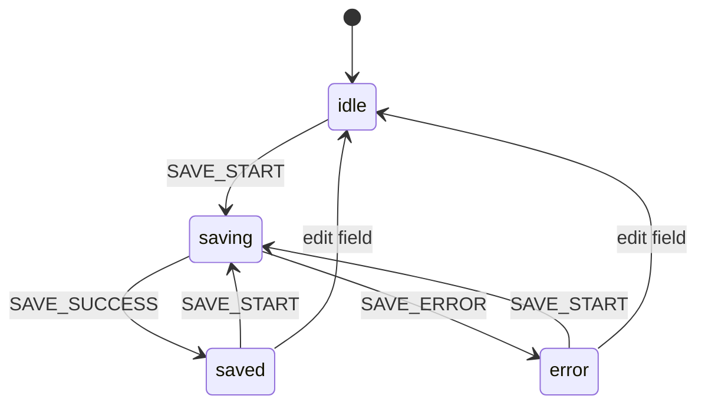

# Application State & Architecture

Where a component stops being a component and starts being a system: shared state, ownership, boundaries, and APIs. Every problem here is still built with React alone &mdash; context, reducers, refs, and composition &mdash; but the question is always *who owns this state, and who is allowed to change it?*

The through-line: **state lives at the lowest common owner; derive everything you can; split the read path from the write path so unrelated consumers stay still.**

---

## Shopping Cart with Context + `useReducer`

`Difficulty: Medium` `Probability: Very High`

### What are we building?

A cart that many components touch: product cards add items, a header badge shows the count, a drawer lists them, and a summary totals them. The cart is the canonical "shared state" problem. It forces you to choose a global state shape, keep updates immutable, expose a narrow API, and stop every consumer from re-rendering when one line item changes.

This single problem covers both the **Shopping Cart** and **global state via Context + `useReducer`** checklist items &mdash; there is no separate cart chapter.

### Example

```text
Coffee beans        [ - ]  2  [ + ]   Remove     $24.00
Ceramic mug         [ - ]  1  [ + ]   Remove      $9.50
----------------------------------------------------
Items                                       3
Subtotal                                  $33.50
Tax (8%)                                   $2.68
Total                                     $36.18
[ Checkout ]
```

The header badge reads `3` and is a *different subtree* from the list. Both read the same store; neither receives a prop.

### What is the interviewer testing?

- A reducer with explicit actions (`add`, `remove`, `updateQty`, `clear`) instead of scattered setters
- Immutable updates and normalization decisions
- Derived totals (subtotal, tax, count) computed during render, never stored
- Context **split into state and dispatch** so write-only consumers do not re-render
- A guarded custom hook instead of raw `useContext`
- Safe `localStorage` persistence and rehydration
- Optimistic checkout with rollback

### State Design

```ts
type CartItem = { id: string; name: string; price: number; qty: number };
type CartState = { items: CartItem[] };

type CartAction =
  | { type: "ADD"; item: Omit<CartItem, "qty">; qty?: number }
  | { type: "REMOVE"; id: string }
  | { type: "UPDATE_QTY"; id: string; qty: number }
  | { type: "CLEAR" }
  | { type: "RESTORE"; state: CartState }; // used by optimistic checkout rollback

// Context values
state: CartState
dispatch: React.Dispatch<CartAction>
```

**Do NOT store:** `subtotal`, `tax`, `total`, `itemCount`, `isEmpty`, or a per-line `lineTotal`. Every one of them is derivable from `items` and the tax rate. Storing them guarantees at least one code path forgets to recompute after a `REMOVE`.

**Do NOT store** the whole cart in `localStorage` *and* a server. Pick one source of truth; `localStorage` here is only a durable cache for the anonymous cart.

### Basic Version

The reducer first. It is pure, so it is testable without React:

```ts
export type CartItem = { id: string; name: string; price: number; qty: number };
export type CartState = { items: CartItem[] };

export type CartAction =
  | { type: "ADD"; item: Omit<CartItem, "qty">; qty?: number }
  | { type: "REMOVE"; id: string }
  | { type: "UPDATE_QTY"; id: string; qty: number }
  | { type: "CLEAR" }
  | { type: "RESTORE"; state: CartState };

export const TAX_RATE = 0.08;

export function cartReducer(state: CartState, action: CartAction): CartState {
  switch (action.type) {
    case "ADD": {
      const qty = Math.max(1, action.qty ?? 1);
      const existing = state.items.find((i) => i.id === action.item.id);
      if (existing) {
        return {
          items: state.items.map((i) =>
            i.id === action.item.id ? { ...i, qty: i.qty + qty } : i,
          ),
        };
      }
      return { items: [...state.items, { ...action.item, qty }] };
    }
    case "REMOVE":
      return { items: state.items.filter((i) => i.id !== action.id) };
    case "UPDATE_QTY":
      // qty <= 0 is a remove, not an invalid state
      return action.qty <= 0
        ? { items: state.items.filter((i) => i.id !== action.id) }
        : { items: state.items.map((i) => (i.id === action.id ? { ...i, qty: action.qty } : i)) };
    case "CLEAR":
      return { items: [] };
    case "RESTORE":
      return action.state;
  }
}
```

Now the store: two contexts, a provider, and guarded hooks.

```ts
import {
  createContext,
  useCallback,
  useContext,
  useEffect,
  useMemo,
  useReducer,
  type ReactNode,
} from "react";

const CartStateContext = createContext<CartState | null>(null);
const CartDispatchContext = createContext<React.Dispatch<CartAction> | null>(null);

const STORAGE_KEY = "cart:v1";
const EMPTY: CartState = { items: [] };

function initCart(fallback: CartState): CartState {
  try {
    const raw = localStorage.getItem(STORAGE_KEY);
    if (!raw) return fallback;
    const parsed = JSON.parse(raw) as CartState;
    return Array.isArray(parsed.items) ? parsed : fallback;
  } catch {
    return fallback; // private mode / disabled storage / bad JSON
  }
}

export function CartProvider({ children }: { children: ReactNode }) {
  const [state, dispatch] = useReducer(cartReducer, EMPTY, initCart);

  useEffect(() => {
    try {
      localStorage.setItem(STORAGE_KEY, JSON.stringify(state));
    } catch {
      /* quota or disabled storage — persistence is best-effort */
    }
  }, [state]);

  return (
    <CartStateContext.Provider value={state}>
      <CartDispatchContext.Provider value={dispatch}>{children}</CartDispatchContext.Provider>
    </CartStateContext.Provider>
  );
}

/** Read the cart. Re-renders whenever the cart changes. */
export function useCartState(): CartState {
  const state = useContext(CartStateContext);
  if (!state) throw new Error("useCartState must be used within <CartProvider>");
  return state;
}

/**
 * Write to the cart. `dispatch` and the action object are stable,
 * so a component that only calls useCart() never re-renders on cart changes.
 */
export function useCart() {
  const dispatch = useContext(CartDispatchContext);
  if (!dispatch) throw new Error("useCart must be used within <CartProvider>");
  return useMemo(
    () => ({
      add: (item: Omit<CartItem, "qty">, qty?: number) => dispatch({ type: "ADD", item, qty }),
      remove: (id: string) => dispatch({ type: "REMOVE", id }),
      updateQty: (id: string, qty: number) => dispatch({ type: "UPDATE_QTY", id, qty }),
      clear: () => dispatch({ type: "CLEAR" }),
    }),
    [dispatch],
  );
}

/** Derived totals — recomputed only when `items` changes. */
export function useCartTotals() {
  const { items } = useCartState();
  return useMemo(() => {
    const subtotal = items.reduce((sum, i) => sum + i.price * i.qty, 0);
    const tax = subtotal * TAX_RATE;
    const count = items.reduce((sum, i) => sum + i.qty, 0);
    return { subtotal, tax, total: subtotal + tax, count };
  }, [items]);
}
```

Consumers stay tiny and single-purpose:

```ts
const money = new Intl.NumberFormat("en-US", { style: "currency", currency: "USD" });

export function AddToCartButton({ item }: { item: Omit<CartItem, "qty"> }) {
  const { add } = useCart(); // write path only — no cart re-render
  return <button onClick={() => add(item)}>Add {item.name}</button>;
}

export function CartBadge() {
  const { count } = useCartTotals(); // read path
  return <span aria-label={`${count} items in cart`}>{count}</span>;
}
```

### How It Works

- **The reducer owns every transition.** `ADD` on an existing id increments instead of pushing a duplicate; `UPDATE_QTY` with `qty <= 0` removes. There is no way to produce an invalid cart from the outside because the only handle is `dispatch`.
- **Immutable updates everywhere.** `map` and `filter` return new arrays, and `{ ...i, qty }` returns a new item, so React sees a changed reference and re-renders the affected subscribers.
- **State and dispatch are separate contexts.** Context re-renders a consumer when the *value object's identity* changes. State changes on every action, but `dispatch` is stable for the lifetime of the component, so a write-only consumer subscribed to `CartDispatchContext` never re-renders. Splitting is what makes that possible.
- **If you used one context, you must memoize.** A combined `{ state, dispatch }` object would need `useMemo(() => ({ state, dispatch }), [state])`; without it, every provider render hands down a fresh object and re-renders all consumers. Memoizing here is *not* premature: it is the whole point of the pattern. The caveat appears at small scale &mdash; wrapping trivial providers in `useMemo`/`useCallback` before you have measured is noise; the split is the cheaper, clearer fix in most cases.
- **Persistence is an effect, not the source of truth.** `state` is written to `localStorage` after it changes, and `initCart` runs lazily *once* via the `useReducer` initializer, so we do not hit storage on every render.
- **Totals are derived.** `useCartTotals` recomputes from `items` only, so a render caused by something unrelated does not re-derive money.

### Edge Cases

- **Quantity below one:** treat `qty <= 0` as a remove. Do not leave a `0`-quantity line in the array.
- **Adding an item that exists:** increment `qty`; the `add` action is idempotent in shape but not in count, so be explicit in the UI ("Added" vs "Updated").
- **Money is not a float.** `0.1 + 0.2 !== 0.3`. Real carts store integer **cents** (`priceCents`), format at the edge, and round tax once at the total. The float version above is fine for a demo but call out the fix.
- **Corrupt or hostile `localStorage`:** validate the parsed shape (`Array.isArray`, numeric `qty`) and fall back to empty rather than crashing.
- **Multiple tabs:** the `storage` event fires in *other* tabs; listen for it if two tabs should share the cart, otherwise last-write-wins is acceptable.
- **SSR:** `localStorage` does not exist on the server; lazy init runs on the client only, so guard any direct access.
- **Prices change between sessions:** a persisted cart can hold stale prices. Re-price against the catalog on rehydrate, or send only ids and quantities to the server at checkout.

### Interview Follow-ups

- **Level 1:** Local cart in one component with `useState`.
- **Level 2:** Lift to `useReducer` and split `state`/`dispatch` contexts (above).
- **Level 3:** Persist to `localStorage` and rehydrate.
- **Level 4:** Add a coupon code and derived discount before tax.
- **Level 5:** Optimistic checkout: clear immediately, restore on failure.
- **Level 6:** Reconcile with a server cart (merge anonymous cart into the user cart on login).
- **Level 7:** Make it undoable by wrapping the reducer in the history reducer from **Undo / Redo State History**.
- **Level 8:** Replace context with a selector-based store and show that only components reading the changed slice re-render.

### Production Version

The server is the real source of truth for a signed-in cart; context is a cache. The production shape is a query for the cart plus mutations for the four actions, with the same optimistic contract you wrote by hand:

```ts
async function checkout() {
  const snapshot = state;
  dispatch({ type: "CLEAR" }); // optimistic: unblock the UI immediately
  try {
    await api.checkout(snapshot.items);
  } catch {
    dispatch({ type: "RESTORE", state: snapshot }); // roll back on failure
  }
}
```

Two caveats: an optimistic clear must be accompanied by a disabled/`pending` state so the user cannot double-submit, and if the request fails *after* payment, rollback is the wrong recovery &mdash; show a "payment succeeded, cart sync failed" reconciliation instead. Libraries that implement this contract are TanStack Query (`useQuery` + `useMutation` with `onMutate`/`onError`) or a store such as Redux Toolkit / Zustand when the app already has one. Say that in **Production Version**, then keep the context + reducer as the interview answer: the interviewer is testing whether you understand the state model, not whether you can import one.

### Accessibility

- Quantity steppers are buttons with accessible names ("Increase Coffee beans"), and the value lives in an `<output>` or live region so changes are announced.
- The badge needs an accessible label (`aria-label="3 items in cart"`), not a bare "3".
- If checkout succeeds, announce it; if it fails and rolls back, use `role="alert"`.
- Do not disable the whole cart during a request &mdash; disable only the checkout button and keep browsing usable.

### Performance

- The state/dispatch split is the main win: `AddToCartButton` does not subscribe to state at all, so a quantity change does not re-render every product card.
- `useCartTotals` memoizes over `items`, so money math runs once per cart change, not per render.
- A deeply nested cart tree should read only the slice it needs. Context always re-renders every consumer of that context, so a selector store is the escape hatch when one context drives a large tree.
- Keep line items in `React.memo` only after a profile shows the list is expensive; a filtered list with stable ids is usually enough.

### Testing

```text
✓ ADD on a new item appends it with qty 1
✓ ADD on an existing id increments instead of duplicating
✓ UPDATE_QTY 0 removes the line
✓ REMOVE drops only the matching id
✓ subtotal/tax/total/count are correct and derived
✓ dispatch-only consumer does not re-render when items change
✓ cart rehydrates from localStorage and survives bad JSON
✓ failed checkout restores the pre-checkout cart
```

### Common Mistakes

- Storing `subtotal`/`count` in state and forgetting to update them on `REMOVE`.
- One context holding `{ state, dispatch }` with no `useMemo`, re-rendering every consumer on every provider render.
- Mutating: `state.items.push(...)`, `item.qty++`.
- Putting the cart in `localStorage` *and* treating it as authoritative over the server.
- Floating-point money.
- A `useCart()` hook with no guard, so a component outside the provider silently reads `undefined` and crashes later or renders empty.

### Interview Takeaway

Global state is a small, explicit state machine plus a narrow API. Write the reducer first, derive all totals, split read from write, guard the hooks, and persist as a side effect. That is the entire context + `useReducer` playbook, and it applies to carts, filters, wizards, and editors alike.

---

## Auth State Provider

`Difficulty: Medium` `Probability: High`

### What are we building?

An app-wide authentication store: who is signed in, whether the session is still being checked, and how to log in, log out, and refresh. The critical detail is a **three-state** model &mdash; you do not yet know whether the user is authenticated &mdash; and the fact that the access token lives in memory, never `localStorage`.

### Example

```text
status: unknown         ->  <Spinner/>            (checking session)
status: anonymous       ->  /login                (redirect, remember intended path)
status: authenticated   ->  <Dashboard/>          (user: Ada, roles: ["admin"])

Protected route + wrong role  ->  /403 "Not authorized"
```

The spinner is what separates a good implementation from a flash of the login page before the session check resolves.

### What is the interviewer testing?

- `unknown | authenticated | anonymous` instead of a boolean `isLoggedIn`
- Separating the user object from the credential
- In-memory access token plus an httpOnly refresh cookie
- A `refresh()` bootstrap with proper error handling
- Route guards that render *nothing* until status is known
- The security boundary: client state is UX, not authorization

### State Design

```ts
type User = { id: string; name: string; email: string; roles: string[] };
type AuthStatus = "unknown" | "authenticated" | "anonymous";

type AuthState = {
  user: User | null;
  status: AuthStatus;
  token: string | null; // in-memory access token only
};

type AuthAction =
  | { type: "RESTORE"; user: User | null; token: string | null }
  | { type: "LOGIN"; user: User; token: string }
  | { type: "LOGOUT" };
```

**Do NOT store:** `isLoggedIn` (derive from `status`), `isAdmin` (derive from `user.roles`), `token` in `localStorage`/`sessionStorage`, or a copy of the user you manually sync with an effect.

### Basic Version

```ts
import {
  createContext,
  useCallback,
  useContext,
  useEffect,
  useMemo,
  useReducer,
  useRef,
  type ReactNode,
} from "react";

type User = { id: string; name: string; email: string; roles: string[] };
type AuthStatus = "unknown" | "authenticated" | "anonymous";
type AuthState = { user: User | null; status: AuthStatus; token: string | null };

type AuthAction =
  | { type: "RESTORE"; user: User | null; token: string | null }
  | { type: "LOGIN"; user: User; token: string }
  | { type: "LOGOUT" };

function authReducer(state: AuthState, action: AuthAction): AuthState {
  switch (action.type) {
    case "RESTORE":
      return action.user && action.token
        ? { user: action.user, status: "authenticated", token: action.token }
        : { user: null, status: "anonymous", token: null };
    case "LOGIN":
      return { user: action.user, status: "authenticated", token: action.token };
    case "LOGOUT":
      return { user: null, status: "anonymous", token: null };
  }
}

type AuthValue = {
  user: User | null;
  status: AuthStatus;
  login: (email: string, password: string) => Promise<void>;
  logout: () => Promise<void>;
  refresh: () => Promise<void>;
};

const AuthContext = createContext<AuthValue | null>(null);

export function AuthProvider({ children }: { children: ReactNode }) {
  const [state, dispatch] = useReducer(authReducer, {
    user: null,
    status: "unknown", // the important third state
    token: null,
  });

  // Keep the token reachable by the API client without putting it in React state.
  const tokenRef = useRef<string | null>(null);

  const refresh = useCallback(async () => {
    try {
      // The httpOnly refresh cookie is sent automatically by the browser.
      const { user, token } = await api.refreshSession();
      tokenRef.current = token;
      dispatch({ type: "RESTORE", user, token });
    } catch {
      tokenRef.current = null;
      dispatch({ type: "RESTORE", user: null, token: null });
    }
  }, []);

  const login = useCallback(async (email: string, password: string) => {
    const { user, token } = await api.login(email, password);
    tokenRef.current = token;
    dispatch({ type: "LOGIN", user, token });
  }, []);

  const logout = useCallback(async () => {
    try {
      await api.logout(); // server clears the httpOnly refresh cookie
    } finally {
      tokenRef.current = null;
      dispatch({ type: "LOGOUT" });
    }
  }, []);

  useEffect(() => {
    void refresh(); // bootstrap once; status stays "unknown" until this settles
  }, [refresh]);

  const value = useMemo(
    () => ({ user: state.user, status: state.status, login, logout, refresh }),
    [state.user, state.status, login, logout, refresh],
  );

  return <AuthContext.Provider value={value}>{children}</AuthContext.Provider>;
}

export function useAuth(): AuthValue {
  const ctx = useContext(AuthContext);
  if (!ctx) throw new Error("useAuth must be used within <AuthProvider>");
  return ctx;
}
```

Route guards read `status`, not `user`:

```ts
import { Navigate, useLocation } from "react-router-dom";

export function RequireAuth({ children }: { children: ReactNode }) {
  const { status } = useAuth();
  const location = useLocation();

  if (status === "unknown") return <div role="status">Checking session…</div>;
  if (status === "anonymous") return <Navigate to="/login" replace state={{ from: location }} />;
  return <>{children}</>;
}

export function RequireRole({ role, children }: { role: string; children: ReactNode }) {
  const { user } = useAuth();
  if (!user?.roles.includes(role)) return <Navigate to="/403" replace />;
  return <>{children}</>;
}
```

### How It Works

- **Three states, not two.** `unknown` is the state before the session check resolves. A boolean cannot represent it, which is exactly why the naive version flashes the login page on every reload.
- **Token in a ref, not storage.** An access token in `localStorage` is readable by any XSS payload that runs on the page. Keep it in memory and let the server hold the durable credential in an httpOnly, `Secure`, `SameSite` cookie. A page reload re-mints the access token via `refresh()`.
- **The context value is memoized.** Unlike the cart, this value object mixes stable functions with changing `user`/`status`, so without `useMemo` every provider render re-renders every consumer. The functions are already `useCallback`-stable; memoizing the bundle completes the contract.
- **Guards render on `status`.** `unknown` shows a loader, `anonymous` redirects, `authenticated` renders. `RequireRole` is a second, orthogonal gate.
- **Refresh on the API client, not in components.** The token ref is attached to the shared fetch wrapper; a 401 response triggers one refresh and a retry. Doing this inside components scatters auth logic across the app.

**Why context is not a security boundary.** `AuthContext` is a client-side convenience. Anyone can open devtools, edit React state, or call the API directly with a forged token. Role checks in `RequireRole` hide UI; they do not protect data. The server must authenticate the credential and authorize every request, and it must never trust a role, price, or user id that the client sends. The client guard exists so users do not see a broken screen &mdash; say this explicitly in an interview and you demonstrate that you understand the difference between UX and security.

### Edge Cases

- **Refresh fails on first load:** `status` must become `anonymous`, not stay `unknown` forever, or the app hangs on a spinner.
- **Concurrent 401s:** ten parallel requests each triggering `refresh()` is a refresh storm. Share a single in-flight refresh promise and queue the retries behind it.
- **Logout while a request is in flight:** cancel or ignore late responses so they cannot re-populate state after logout.
- **Token expiry:** re-check before sensitive actions, or rely on the 401-refresh-retry interceptor.
- **Multiple tabs:** logging out in one tab should log out the others (a `storage`/`BroadcastChannel` signal), but remember the token itself is per-tab memory.
- **Role changes:** a demoted user keeps their old UI until the next refresh unless you invalidate the session.
- **Redirect loop:** `/login` must be reachable while `anonymous`, or `RequireAuth` redirects to itself.

### Interview Follow-ups

- **Level 1:** A boolean `isLoggedIn` in a single component.
- **Level 2:** Move to context with `user`/`status` and a `useAuth` guard.
- **Level 3:** Add `refresh()` bootstrap and the loading state.
- **Level 4:** Add `RequireAuth` / `RequireRole` guards and intended-path restore.
- **Level 5:** Move to an in-memory token with a refresh cookie and a 401 interceptor.
- **Level 6:** Handle concurrent refreshes with a shared promise.
- **Level 7:** Add permissions at the data layer (per-resource checks), not just routes.

### Production Version

Mature apps use an auth SDK or an API client that owns the interceptor, and a small `AuthProvider` that only mirrors the session into React. Libraries such as TanStack Query matter here for a different reason: when the session changes you must clear the query cache, or one user's data leaks into the next user's session. Redux/Zustand are alternatives for the store itself if the app already has one, but neither changes the token strategy &mdash; the server-issued refresh cookie is the decision that matters, not the client library.

### Accessibility

- The loading state needs `role="status"` so screen readers announce "Checking session".
- On redirect, move focus to the destination heading; a client redirect that leaves focus behind is disorienting for keyboard users.
- Announce login errors with `role="alert"`, and never render an error message that reveals whether an email exists.

### Performance

Auth changes rarely, so re-render cost is negligible. The real concern is a `useEffect` that calls `refresh()` on every render because `refresh` is recreated each time; the `useCallback` above prevents that. Memoize the context value so a provider re-render does not ripple to the whole tree.

### Testing

```text
✓ starts in "unknown" and shows the loading state
✓ a successful refresh transitions to "authenticated"
✓ a failed refresh transitions to "anonymous"
✓ login stores the user and flips status
✓ logout clears the user and the token
✓ RequireAuth redirects anonymous users and stores the intended path
✓ RequireRole blocks a user without the role
✓ the token is never written to localStorage
```

### Common Mistakes

- `isLoggedIn: boolean`, which cannot express "checking".
- Storing the token in `localStorage` "so it survives reload".
- An effect that runs `refresh()` on every render because the callback is not stable.
- Trusting `user.roles` on the client for anything the server actually protects.
- Leaving `status` at `unknown` when refresh rejects.
- Re-fetching user data in every component instead of reading the provider.

### Interview Takeaway

Model auth as a state machine with an explicit `unknown`. Keep the credential out of long-lived storage, bootstrap with a single refresh, gate rendering on `status`, and repeat the sentence the interviewer wants: **context is UX, the server is the security boundary.**

---

## Compound Components

`Difficulty: Hard` `Probability: High`

### What are we building?

A family of components that look like separate exports but share one state object: `<Tabs>`, `<Tabs.TabList>`, `<Tabs.Tab>`, `<Tabs.Panel>`. The parent owns the state; the children read it through a private context and compose into flexible markup.

This is the **pattern** behind several earlier problems, not a re-implementation of them. For the full ARIA and keyboard behavior of a tablist, see **Tabs**; for outside-click, positioning, and roving focus on a listbox, see **Dropdown / Select**. Here we care about *how* those components are assembled: the shared context, the static sub-components, the dev-only `displayName` checks, and the controlled/uncontrolled hybrid.

### Example

```text
<Tabs defaultValue="profile">
  <Tabs.TabList>
    <Tabs.Tab id="profile">Profile</Tabs.Tab>     <- active
    <Tabs.Tab id="settings">Settings</Tabs.Tab>
  </Tabs.TabList>
  <Tabs.Panel id="profile">…</Tabs.Panel>
  <Tabs.Panel id="settings">…</Tabs.Panel>
</Tabs>
```

The consumer controls structure and content; the library controls state, wiring, and accessibility attributes. `<Tabs.Tab>` and `<Tabs.Panel>` never receive an `active` prop &mdash; they read it from context.

### What is the interviewer testing?

- Sharing state upward through context instead of prop-drilling
- Static members via `Object.assign` and namespaced `displayName`
- Controlled/uncontrolled hybrid (`value` + `onChange` vs `defaultValue`)
- Dev-time validation that children are used in the right parent
- Why a private context beats cloning children or passing implicit props
- The trade-off: flexibility for the consumer, more surface area to document

### State Design

```ts
type TabsContextValue = {
  activeId: string;                        // derived: controlled value ?? internal state
  setActiveId: (id: string) => void;       // writes internal state only when uncontrolled
};

// Tabs props
type TabsProps = {
  value?: string;                          // controlled
  defaultValue?: string;                   // uncontrolled seed
  onValueChange?: (id: string) => void;
  children: React.ReactNode;
};
```

**Do NOT store:** `activeId` in two places. When `value` is provided it is the truth; the internal `useState` must be ignored. **Do NOT store** an `isActive` flag on each panel, or the panel list and the active id can diverge.

### Basic Version

```ts
import {
  Children,
  createContext,
  isValidElement,
  useCallback,
  useContext,
  useMemo,
  useState,
  type ReactNode,
} from "react";

type TabsContextValue = { activeId: string; setActiveId: (id: string) => void };

const TabsContext = createContext<TabsContextValue | null>(null);

function useTabs(component: string): TabsContextValue {
  const ctx = useContext(TabsContext);
  if (!ctx) throw new Error(`<${component}> must be used inside <Tabs>`);
  return ctx;
}

type TabsProps = {
  value?: string;
  defaultValue?: string;
  onValueChange?: (id: string) => void;
  children: ReactNode;
};

function Tabs({ value, defaultValue = "", onValueChange, children }: TabsProps) {
  const [internal, setInternal] = useState(defaultValue);
  const isControlled = value !== undefined;
  const activeId = isControlled ? value : internal;

  const setActiveId = useCallback(
    (id: string) => {
      if (!isControlled) setInternal(id); // uncontrolled owns the write
      onValueChange?.(id);                // controlled parent decides what to do
    },
    [isControlled, onValueChange],
  );

  const ctx = useMemo(() => ({ activeId, setActiveId }), [activeId, setActiveId]);

  if (process.env.NODE_ENV !== "production") {
    Children.forEach(children, (child) => {
      if (!isValidElement(child)) return;
      const type = child.type as { displayName?: string };
      if (type.displayName && !type.displayName.startsWith("Tabs.")) {
        console.warn(`<${type.displayName}> is not a <Tabs> child and will not share state.`);
      }
    });
  }

  return <TabsContext.Provider value={ctx}>{children}</TabsContext.Provider>;
}

function TabList({ children }: { children: ReactNode }) {
  return <div role="tablist">{children}</div>;
}

function Tab({ id, children }: { id: string; children: ReactNode }) {
  const { activeId, setActiveId } = useTabs("Tabs.Tab");
  const selected = activeId === id;
  return (
    <button
      type="button"
      role="tab"
      id={`tab-${id}`}
      aria-selected={selected}
      aria-controls={`panel-${id}`}
      tabIndex={selected ? 0 : -1}
      onClick={() => setActiveId(id)}
    >
      {children}
    </button>
  );
}

function TabPanel({ id, children }: { id: string; children: ReactNode }) {
  const { activeId } = useTabs("Tabs.Panel");
  if (activeId !== id) return null;
  return (
    <div role="tabpanel" id={`panel-${id}`} aria-labelledby={`tab-${id}`} tabIndex={0}>
      {children}
    </div>
  );
}

TabList.displayName = "Tabs.TabList";
Tab.displayName = "Tabs.Tab";
TabPanel.displayName = "Tabs.Panel";

Tabs.TabList = TabList;
Tabs.Tab = Tab;
Tabs.Panel = TabPanel;

export { Tabs };
```

Usage is exactly the mockup:

```ts
<Tabs defaultValue="profile" onValueChange={(id) => console.log(id)}>
  <Tabs.TabList>
    <Tabs.Tab id="profile">Profile</Tabs.Tab>
    <Tabs.Tab id="settings">Settings</Tabs.Tab>
  </Tabs.TabList>
  <Tabs.Panel id="profile">Profile settings…</Tabs.Panel>
  <Tabs.Panel id="settings">Account settings…</Tabs.Panel>
</Tabs>
```

### How It Works

- **The parent is the single owner.** `activeId` and `setActiveId` live in `Tabs`; every child reaches them through `TabsContext`. Adding a new child (a `<Tabs.Badge>`) requires no new props on the parent.
- **`Object.assign` namespacing** attaches the children as static members (`Tabs.Tab`), giving discoverable dot notation and avoiding name collisions in the consumer's imports.
- **`displayName` has two jobs.** It makes React DevTools readable, and it lets the parent validate children in development. The `useTabs("Tabs.Tab")` guard is the runtime companion: a child rendered outside the parent throws immediately with an actionable message instead of silently rendering a dead control.
- **Controlled/uncontrolled hybrid.** `isControlled = value !== undefined`; the internal state is seeded by `defaultValue` and only written when uncontrolled, while `onValueChange` fires in both modes so a controlled parent can respond. This is the same API shape as the native `<input>` and as every design-system primitive.
- **The context value is memoized** because it changes only when `activeId` or `setActiveId` changes (the latter is `useCallback`-stable), so opening one tab re-renders only the children that actually read the context.
- **Why not `cloneElement`?** Cloning every child to inject `active`/`onSelect` makes the parent depend on child internals, breaks when children are wrapped, and cannot reach descendants. Context is why compound components compose.

### Edge Cases

- **Child outside the parent:** throws thanks to the guard; catch it in dev, document it, and never let it render a broken control.
- **Empty or missing `defaultValue`:** default to the first child tab or render `aria-selected=false` on all. Decide explicitly.
- **Reordering tabs:** keep using the `id`, never the index, or the active panel jumps.
- **Deeply nested consumers:** context reaches any descendant, so `<Tabs.Tab>` can sit inside a toolbar wrapper without prop-drilling.
- **SSR:** `process.env.NODE_ENV` must be replaced at build time; keep the dev warning out of production bundles.
- **Multiple independent instances:** each `<Tabs>` creates its own provider, so two tab groups do not share state.
- **Hydration:** an uncontrolled `defaultValue` must be identical on server and client or the first paint mismatches.

### Interview Follow-ups

- **Level 1:** A single component with an `active` prop and an `onSelect` callback.
- **Level 2:** Split into parent/children and share state via context (above).
- **Level 3:** Add controlled/uncontrolled support.
- **Level 4:** Add `displayName`-based dev validation and the `useTabs` guard.
- **Level 5:** Add keyboard navigation, roving tabindex, and full ARIA (see **Tabs**).
- **Level 6:** Generalize into a `createCompoundComponent` factory or a `Slot`-style API.
- **Level 7:** Add lazy panel mounting (mount on first visit, keep alive afterward).

### Production Version

This is exactly how Radix UI, React Aria, and Headless UI are built: behavior in a private context, markup left to the consumer, ARIA handled centrally. Reach for those libraries in production; build the pattern by hand in an interview so you can explain the ownership model. The two design decisions worth stating out loud are (1) the parent owns the shared state and (2) the private context is the contract between parent and children &mdash; the public API is dot notation, not the context.

### Accessibility

- Full tablist ARIA (`role="tablist"`/`tab`/`tabpanel`, `aria-selected`, `aria-controls`, `aria-labelledby`) is wired here, but keyboard roving, Home/End, and arrow navigation live in **Tabs** &mdash; compound components do not make accessibility automatic.
- Only the active tab is in the tab order (`tabIndex={selected ? 0 : -1}`); without this, keyboard users tab through every tab.
- Panels are associated with their tab by id, so screen readers announce "Profile, tab, selected" before the panel content.

### Performance

Context re-renders every consumer, so the `useMemo` on the context value is what keeps a tab click from re-rendering unrelated subtrees. For a large tab set, memoize panel contents (or keep them mounted and hide them) rather than unmounting on every switch. Avoid `React.memo` on children that read the context &mdash; they re-render anyway when the value changes.

### Testing

```text
✓ renders and switches panels on click
✓ clicking the active tab does not change panels
✓ controlled value wins over internal state
✓ onValueChange fires in both controlled and uncontrolled modes
✓ a child outside <Tabs> throws a useful error
✓ panels associate to the correct tab via aria-controls
✓ the correct tab has tabIndex 0
```

### Common Mistakes

- Duplicating the active id in both parent and child state.
- `cloneElement`-injecting props instead of using context.
- No guard, so a child outside the parent silently reads `null`.
- Forgetting `displayName`, making DevTools and dev validation useless.
- Using `value ?? defaultValue` in the child so an empty-string id can never be selected.
- Memoizing the context value with a dependency on an inline object/function that changes every render.

### Interview Takeaway

Compound components are a context provider plus namespaced children. The parent owns state, the private context is the contract, `displayName` and a guard make misuse loud, and a controlled/uncontrolled hybrid makes the API feel native. Everything else you learned in **Tabs** and **Dropdown / Select** is behavior layered on top of this pattern.

---

## Controlled vs Uncontrolled Reusable Component

`Difficulty: Medium` `Probability: High`

### What are we building?

A reusable component that works *both* ways: `<TextInput value=... onChange=...>` when the parent wants to own the value, and `<TextInput defaultValue=...>` when it just wants to drop it in. The same component must never accidentally switch between the two modes, which is the source of React's famous warning.

### Example

```text
Controlled:    <TextInput label="Email" value={email} onChange={setEmail} />
               -> parent's state is the truth; the input cannot change without the parent

Uncontrolled:  <TextInput label="Search" defaultValue="" />
               -> the input owns its value; the parent reads it only on submit
```

### What is the interviewer testing?

- Detecting controlled-ness with `value !== undefined`, not truthiness
- Seeding internal state once from `defaultValue`
- Always firing `onChange`, even when controlled
- Detecting and warning about a mode switch
- Extracting the pattern into a reusable `useControllableState`
- The same pattern on a non-input component (an accordion's open state)

### State Design

```ts
type ControllableProps<T> = {
  value?: T;                       // presence means controlled
  defaultValue?: T;                // seed for the uncontrolled case
  onChange?: (next: T) => void;    // fired in BOTH modes
};

// internal
const [internal, setInternal] = useState(defaultValue);
const isControlled = value !== undefined;
const current = isControlled ? value : internal;
```

**Do NOT store:** a `mode: "controlled" | "uncontrolled"` flag in state (derive it), or a synced copy of the controlled `value` in local state (that recreates the two-sources-of-truth bug this pattern exists to avoid).

### Basic Version

Start with the primitive every design system uses:

```ts
import { useCallback, useRef, useState } from "react";

export function useControllableState<T>({
  value,
  defaultValue,
  onChange,
}: {
  value?: T;
  defaultValue: T;
  onChange?: (next: T) => void;
}): [T, (next: T) => void] {
  const isControlled = value !== undefined;
  const [internal, setInternal] = useState(defaultValue);
  const current = isControlled ? (value as T) : internal;

  // dev-only: catch a component flipping between controlled and uncontrolled
  const wasControlled = useRef(isControlled);
  if (wasControlled.current !== isControlled) {
    if (process.env.NODE_ENV !== "production") {
      console.error(
        `A component changed from ${wasControlled.current ? "controlled" : "uncontrolled"} ` +
          `to ${isControlled ? "controlled" : "uncontrolled"}.`,
      );
    }
    wasControlled.current = isControlled;
  }

  const setValue = useCallback(
    (next: T) => {
      if (!isControlled) setInternal(next); // only the uncontrolled mode owns state
      onChange?.(next);                     // always notify
    },
    [isControlled, onChange],
  );

  return [current, setValue];
}
```

Now the reusable `TextInput` built on it:

```ts
export function TextInput({
  label,
  value,
  defaultValue = "",
  onChange,
  maxLength,
}: {
  label: string;
  value?: string;
  defaultValue?: string;
  onChange?: (value: string) => void;
  maxLength?: number;
}) {
  const [current, setCurrent] = useControllableState({ value, defaultValue, onChange });

  return (
    <label>
      {label}
      <input
        value={current}
        maxLength={maxLength}
        onChange={(e) => setCurrent(e.target.value)}
      />
    </label>
  );
}
```

And the same primitive on a non-input, an accordion:

```ts
export function Accordion({
  items,
  value,
  defaultValue = [],
  onValueChange,
}: {
  items: { id: string; title: string; content: React.ReactNode }[];
  value?: string[];
  defaultValue?: string[];
  onValueChange?: (openIds: string[]) => void;
}) {
  const [openIds, setOpenIds] = useControllableState({
    value,
    defaultValue,
    onChange: onValueChange,
  });

  const toggle = (id: string) =>
    setOpenIds(openIds.includes(id) ? openIds.filter((x) => x !== id) : [...openIds, id]);

  return (
    <div>
      {items.map((item) => (
        <section key={item.id}>
          <button aria-expanded={openIds.includes(item.id)} onClick={() => toggle(item.id)}>
            {item.title}
          </button>
          {openIds.includes(item.id) && <div>{item.content}</div>}
        </section>
      ))}
    </div>
  );
}
```

### How It Works

- **Controlled-ness is detected by the presence of `value`,** i.e. `value !== undefined`. Using `value ??` or `if (value)` would make `""` or `0` or `false` look uncontrolled, which breaks the empty string and zero cases.
- **The internal state is only a fallback.** `current = isControlled ? value : internal`. In controlled mode the internal state still exists but is never read, so the parent's value is authoritative.
- **`onChange` fires in both modes.** A controlled parent ignores the internal write and updates its own state, passing a new `value` down. An uncontrolled parent may still listen for side effects like analytics.
- **The mode-switch warning** replicates React's own behavior for `<input>`: track the previous mode in a ref and log if it changed, because a value that goes from `undefined` to defined (or back) makes the input flicker and is almost always a bug. `useRef` here is a render-phase ref write used only for diagnostics; it does not affect output.
- **Reuse the same hook** for inputs, selects, accordions, and modals. The behavior is universal; only the JSX differs.

### Edge Cases

- **Empty string and `0`:** the classic bug. `value=""` must be controlled; `value={0}` must be controlled. Only `undefined` means "uncontrolled".
- **`value={null}`:** decide the contract. Treat `null` as uncontrolled only if you document it; React's DOM inputs treat `value={null}` as uncontrolled. Whichever you choose, be consistent and test it.
- **A parent that forgets `onChange`:** in controlled mode the input becomes read-only. This is correct, but warn in dev if `value` is set without `onChange`.
- **Controlled to uncontrolled switch:** the warning above catches it; the recovery is to keep `value` defined (e.g. default it to `""`) instead of toggling between `undefined` and a string.
- **Async initial value:** an uncontrolled input seeded from `defaultValue` will not pick up a value that arrives later. Controlled mode is the fix.
- **`useState(defaultValue)` ignores later `defaultValue` changes** &mdash; by design; document that `defaultValue` is a one-time seed.

### Interview Follow-ups

- **Level 1:** A plain controlled input.
- **Level 2:** Add an uncontrolled mode with `defaultValue`.
- **Level 3:** Extract `useControllableState` and reuse it (above).
- **Level 4:** Add the mode-switch warning.
- **Level 5:** Apply it to a composite (accordion / tabs / modal open state).
- **Level 6:** Add `readOnly` and `disabled` semantics that differ in each mode.
- **Level 7:** Compare with a form library (React Hook Form) and when `register`'s uncontrolled model wins on performance.

### Production Version

Headless libraries ship this exact hook (Radix's `useControllableState`, React Aria's `useControlledState`) because every primitive needs it. If you are writing multiple controlled components, extract the hook once and reuse it; do not re-implement the `undefined` check in twelve places. For forms with many fields, React Hook Form's uncontrolled-by-default approach avoids a re-render per keystroke, and you can opt individual fields into controlled mode &mdash; the same bimodal contract, just library-managed.

### Accessibility

- Controlled vs uncontrolled does not change semantics, but the label must remain programmatically associated (`<label>` wrapping the input, as above).
- If a controlled parent rejects an input (e.g. filters characters), announce the constraint with `aria-describedby` so a screen-reader user is not confused when text does not appear.
- For the accordion, `aria-expanded` must reflect the *current* value in both modes; the hook makes that automatic.

### Performance

Controlled inputs re-render the parent on every keystroke; uncontrolled inputs do not. For a large form, prefer uncontrolled where you do not need live values, and keep controlled state local to a leaf rather than at the form root. `useCallback` on `setValue` keeps the hook's return stable so memoized consumers are not invalidated.

### Testing

```text
✓ uncontrolled: typing updates the displayed value
✓ uncontrolled: non-empty defaultValue shows on mount
✓ controlled: typing fires onChange but the value does not change without the parent
✓ controlled: value={""} is treated as controlled
✓ a controlled -> uncontrolled switch logs a warning
✓ value={0} / value={false} are treated as controlled
✓ the accordion works in both modes
```

### Common Mistakes

- `if (value)` or `value ?? defaultValue` instead of `value !== undefined`.
- Storing the controlled `value` in local state and syncing it with an effect.
- Not calling `onChange` in controlled mode, so the parent never learns about input.
- Switching between `value={undefined}` and `value={someValue}` in a single mount.
- Assuming `defaultValue` updates when the prop changes; it is a mount-time seed only.

### Interview Takeaway

The rule is one line: **`value !== undefined` means controlled; otherwise the component owns `defaultValue`-seeded state and still calls `onChange`.** Extract that into one hook and apply it to every primitive. The mode-switch warning is the difference between "it kind of works" and "it behaves like a native input."

---

## Headless Component

`Difficulty: Hard` `Probability: Medium`

### What are we building?

A component that provides **behavior only**, with no markup and no styling. The consumer renders whatever HTML they want and spreads the props the hook returns. The canonical example is `useCombobox`: it owns the query, the filtered list, the open state, and the active option, but the consumer decides whether the options are a `<ul>`, a grid, or a custom card list.

Headless is the logical end of the controlled/uncontrolled and compound-component ideas: the library owns state and interaction, the app owns presentation.

### Example

```text
Consumer markup (their choice)          useCombobox (behavior)
---------------------------------       -------------------------------
<input {...inputProps} />               query, filtered matches
<ul {...listboxProps}>                  open state
  <li {...getOptionProps(i)}>…          active index + keyboard
</ul>

The core renders NOTHING. It returns props and state.
```

### What is the interviewer testing?

- Separating logic from presentation cleanly
- Returning prop-getters (`getOptionProps(index)`) instead of DOM
- An `aria-activedescendant` model that keeps focus on the input
- Filtering derived with `useMemo`, never stored
- Stable ids via `useId` for the listbox/option relationship
- Why this is more flexible &mdash; and harder to misuse &mdash; than a render-prop or compound component

### State Design

```ts
type ComboboxState = {
  query: string;      // what the user typed
  open: boolean;      // is the popup visible
  activeIndex: number; // which option is highlighted
};

// everything else is derived
matches: T[]          // items filtered by query
activeOption: T | null
```

**Do NOT store:** `matches` or `activeOption` in state (derive from `query` + `items`), and **do NOT store** the input's DOM node in state &mdash; focus belongs to the input, tracked with `aria-activedescendant`, not a second focus state.

### Basic Version

The hook returns state plus three prop bundles. It contains no JSX:

```ts
import { useId, useMemo, useState } from "react";

type UseComboboxArgs<T> = {
  items: T[];
  getLabel: (item: T) => string;
  onSelect?: (item: T) => void;
  filter?: (item: T, query: string) => boolean;
};

export function useCombobox<T>({ items, getLabel, onSelect, filter }: UseComboboxArgs<T>) {
  const [query, setQuery] = useState("");
  const [open, setOpen] = useState(false);
  const [activeIndex, setActiveIndex] = useState(0);
  const listboxId = useId();

  const matches = useMemo(() => {
    const q = query.trim().toLowerCase();
    if (!q) return items;
    const predicate = filter ?? ((item: T, value: string) => getLabel(item).toLowerCase().includes(value));
    return items.filter((item) => predicate(item, q));
  }, [items, query, filter, getLabel]);

  const commit = (item: T) => {
    setQuery(getLabel(item));
    setOpen(false);
    setActiveIndex(0);
    onSelect?.(item);
  };

  const onKeyDown = (e: React.KeyboardEvent) => {
    if (e.key === "ArrowDown") {
      e.preventDefault();
      setOpen(true);
      setActiveIndex((i) => Math.min(i + 1, matches.length - 1));
    } else if (e.key === "ArrowUp") {
      e.preventDefault();
      setActiveIndex((i) => Math.max(i - 1, 0));
    } else if (e.key === "Enter" && open && matches[activeIndex]) {
      e.preventDefault();
      commit(matches[activeIndex]);
    } else if (e.key === "Escape") {
      setOpen(false);
    }
  };

  return {
    open,
    query,
    matches,
    activeIndex,
    inputProps: {
      role: "combobox" as const,
      "aria-expanded": open,
      "aria-controls": listboxId,
      "aria-activedescendant":
        open && matches[activeIndex] ? `${listboxId}-${activeIndex}` : undefined,
      "aria-autocomplete": "list" as const,
      value: query,
      onChange: (e: React.ChangeEvent<HTMLInputElement>) => {
        setQuery(e.target.value);
        setOpen(true);
        setActiveIndex(0);
      },
      onKeyDown,
      onBlur: () => setOpen(false),
    },
    listboxProps: {
      id: listboxId,
      role: "listbox" as const,
    },
    getOptionProps: (index: number) => ({
      id: `${listboxId}-${index}`,
      role: "option" as const,
      "aria-selected": index === activeIndex,
      onMouseDown: (e: React.MouseEvent) => e.preventDefault(), // keep focus in the input
      onClick: () => commit(matches[index]),
    }),
  };
}
```

The consumer owns every element:

```ts
export function UserPicker({ users }: { users: User[] }) {
  const cb = useCombobox({ items: users, getLabel: (u) => u.name });

  return (
    <div className="picker">
      <input {...cb.inputProps} placeholder="Search users" aria-label="Search users" />
      {cb.open && cb.matches.length > 0 && (
        <ul {...cb.listboxProps} className="menu">
          {cb.matches.map((user, i) => (
            <li
              key={user.id}
              {...cb.getOptionProps(i)}
              className={i === cb.activeIndex ? "option option--active" : "option"}
            >
              {user.name} &lt;{user.email}&gt;
            </li>
          ))}
        </ul>
      )}
    </div>
  );
}
```

The full accessible combobox behavior also exists in **Autocomplete / Typeahead / Combobox**; this page is about the *shape* &mdash; behavior hook + consumer markup &mdash; that makes such a component reusable across pickers, command palettes, and tag inputs.

### How It Works

- **No JSX in the core.** `useCombobox` returns `inputProps`, `listboxProps`, and `getOptionProps`. The consumer spreads them, so the core never commits to a DOM structure or a class name.
- **`useId` ties the input to the listbox.** The generated `listboxId` is shared by `aria-controls`, `aria-activedescendant`, and the option ids, so the relationship survives multiple instances on one page.
- **`aria-activedescendant` keeps focus on the input.** The highlight moves by changing `activeIndex`, and the input owns focus the whole time. This is why the option uses `onMouseDown={preventDefault}` &mdash; a real focus shift would close the list before the click lands.
- **Derivation, not duplication.** `matches` recomputes from `query`/`items` via `useMemo`; there is no `setMatches` to keep in sync.
- **Behavior hooks compose.** The same shape (`inputProps`, `getOptionProps`, an active index) powers a select, a multiselect, a command palette, and an autocomplete. Only the consumer's JSX changes.

### Edge Cases

- **Empty results:** expose `matches.length === 0` so the consumer can render "No results" &mdash; the core must not assume an option exists.
- **`activeIndex` out of range** after the query narrows the list: clamp before rendering and before committing, or reset to `0` on query change (done above).
- **Blur before click:** `onMouseDown` preventDefault on the option, and close on blur only if focus did not move into the option. If options are focusable, use a focus-within check instead.
- **IME composition:** pressing Enter to confirm Japanese/Chinese candidates should not select an option; check `e.nativeEvent.isComposing`.
- **Custom filter:** pass `filter` for server-side matching or fuzzy search; keep the default local filter for a simple `includes`.
- **Async items:** if matching is remote, debounce and track a request id so stale responses do not overwrite fresh ones (see **Autocomplete / Typeahead / Combobox**).
- **Multiple instances:** `useId` guarantees unique ids; never build ids from a module-level counter.

### Interview Follow-ups

- **Level 1:** A fully rendered `Autocomplete` component with markup inside.
- **Level 2:** Extract the logic into `useCombobox`, leaving the consumer to render (above).
- **Level 3:** Add `getOptionProps` and the `aria-activedescendant` model.
- **Level 4:** Allow a custom `filter` and expose `matches`.
- **Level 5:** Add grouping, virtual scrolling, or multi-select on top of the same hook.
- **Level 6:** Repackage the hook as a library and document the prop-getter contract.
- **Level 7:** Compare headless hooks with render props and compound components for the same feature.

### Production Version

Headless libraries are the production norm: Downshift's `useCombobox`, React Aria's `useComboBox`, and Headless UI's `Combobox` all return prop bundles rather than markup. The trade-off is real: headless gives the app total control over markup and styling but pushes the accessibility burden onto the consumer's DOM choices, and a prop-getter contract is harder to learn than a ready-made component. In production, prefer a battle-tested library; in an interview, write the hook so you can explain prop-getters and the `aria-activedescendant` model. Redux/Zustand/TanStack Query are orthogonal here &mdash; this is about presentation, not where the data lives.

### Accessibility

- Headless does **not** mean inaccessible by default; it means the consumer must honor the contract. The core supplies `role`, `aria-expanded`, `aria-controls`, `aria-activedescendant`, and `aria-selected`; the DOM must be `<input>` plus a listbox of options.
- Never make the highlighted option a separate tab stop. `aria-activedescendant` exists so focus stays in the text field.
- Announce the result count and an empty state via a live region, especially when matching is async.

### Performance

- `useMemo` on `matches` keeps filtering off unrelated renders.
- Debounce remote filtering and cancel in-flight requests; the hook should surface the debounce but not own an arbitrary timing policy.
- The consumer can virtualize a huge option list without changing the hook &mdash; another advantage of returning data instead of elements.
- Keep the returned prop bundles stable enough that spreading them does not invalidate memoized children; the option getter is recreated per index by design, which is fine because options are cheap.

### Testing

```text
✓ typing filters the options
✓ ArrowDown/ArrowUp move the active index within bounds
✓ Enter commits the active option
✓ Escape closes without committing
✓ empty query shows all items; no match shows an empty list
✓ aria-activedescendant points at the active option id
✓ two instances on one page keep distinct ids
```

### Common Mistakes

- Rendering JSX inside the "headless" core, which defeats the purpose.
- Storing `matches` in state and syncing it with an effect.
- Losing focus on option click (missing `onMouseDown` preventDefault) so the list closes before selection.
- Hardcoding a module-level id counter instead of `useId`, breaking SSR and multi-instance pages.
- Ignoring IME composition and committing on the wrong Enter.
- Claiming headless is accessible without ensuring the consumer renders semantic roles.

### Interview Takeaway

A headless component returns **state and prop-getters**, and the consumer renders the DOM. It is the cleanest expression of the "component owns behavior, consumer owns data and presentation" rule, and once you can factor a combobox this way you can factor any widget this way.

---

## Reducer-Based Complex State

`Difficulty: Medium` `Probability: High`

### What are we building?

A multi-field editor &mdash; title, body, tags, visibility, validation, save status &mdash; where the fields change *together* and the transitions have rules. The point is not the form; it is the decision: when does a pile of `useState` calls become a reducer?

### Example

```text
Title   [ Shipping update____________ ]              (required)
Body    [ We are moving to a new_______ ]            (min 10 chars)
Tags    [x] react  [ ] typescript  [ ] design
Visibility  ( ) Public  (•) Private
                                              [ Save ]
status: idle -> saving -> saved            "Saved just now"
```

### What is the interviewer testing?

- An action union that names every transition (`FIELD_CHANGE`, `SAVE_SUCCESS`, …)
- Pure reducer + pure validation, testable without React
- Immutable nested updates (`{ ...state, draft: { ...state.draft, title } }`)
- Derived validity/dirty/errors instead of stored flags
- A clear-eyed comparison against several `useState`s: when each wins
- A state machine for the async save status

### State Design

```ts
type Draft = {
  title: string;
  body: string;
  tags: string[];
  visibility: "public" | "private";
};
type Field = "title" | "body";

type EditorState = {
  draft: Draft;
  touched: Partial<Record<Field, boolean>>;
  status: "idle" | "saving" | "saved" | "error";
  errorMessage: string | null;
};

type EditorAction =
  | { type: "CHANGE_TITLE"; value: string }
  | { type: "CHANGE_BODY"; value: string }
  | { type: "TOGGLE_TAG"; tag: string }
  | { type: "SET_VISIBILITY"; value: Draft["visibility"] }
  | { type: "BLUR"; field: Field }
  | { type: "SAVE_START" }
  | { type: "SAVE_SUCCESS" }
  | { type: "SAVE_ERROR"; message: string }
  | { type: "RESET"; draft: Draft };
```

**Do NOT store:** `isValid`, `isDirty`, `errors`, or `hasErrors`. Derive them with a pure `validate(draft)` and an equality check against the initial draft. Storing them means every field change must remember to recompute all of them.

### Basic Version

The reducer is pure and the validator is a plain function, so both are unit-testable with no renderer:

```ts
import { useMemo, useReducer, useState } from "react";

type Draft = {
  title: string;
  body: string;
  tags: string[];
  visibility: "public" | "private";
};
type Field = "title" | "body";

type EditorState = {
  draft: Draft;
  touched: Partial<Record<Field, boolean>>;
  status: "idle" | "saving" | "saved" | "error";
  errorMessage: string | null;
};

type EditorAction =
  | { type: "CHANGE_TITLE"; value: string }
  | { type: "CHANGE_BODY"; value: string }
  | { type: "TOGGLE_TAG"; tag: string }
  | { type: "SET_VISIBILITY"; value: Draft["visibility"] }
  | { type: "BLUR"; field: Field }
  | { type: "SAVE_START" }
  | { type: "SAVE_SUCCESS" }
  | { type: "SAVE_ERROR"; message: string }
  | { type: "RESET"; draft: Draft };

export function validate(draft: Draft): Partial<Record<Field, string>> {
  const errors: Partial<Record<Field, string>> = {};
  if (!draft.title.trim()) errors.title = "Title is required";
  if (draft.body.trim().length < 10) errors.body = "At least 10 characters";
  return errors;
}

export function editorReducer(state: EditorState, action: EditorAction): EditorState {
  switch (action.type) {
    case "CHANGE_TITLE":
      return { ...state, draft: { ...state.draft, title: action.value }, status: "idle" };
    case "CHANGE_BODY":
      return { ...state, draft: { ...state.draft, body: action.value }, status: "idle" };
    case "TOGGLE_TAG": {
      const tags = state.draft.tags.includes(action.tag)
        ? state.draft.tags.filter((t) => t !== action.tag)
        : [...state.draft.tags, action.tag];
      return { ...state, draft: { ...state.draft, tags } };
    }
    case "SET_VISIBILITY":
      return { ...state, draft: { ...state.draft, visibility: action.value } };
    case "BLUR":
      return { ...state, touched: { ...state.touched, [action.field]: true } };
    case "SAVE_START":
      return { ...state, status: "saving", errorMessage: null };
    case "SAVE_SUCCESS":
      return { ...state, status: "saved", errorMessage: null, touched: {} };
    case "SAVE_ERROR":
      return { ...state, status: "error", errorMessage: action.message };
    case "RESET":
      return { draft: action.draft, touched: {}, status: "idle", errorMessage: null };
  }
}
```

The component stays thin; derivation happens during render:

```ts
export function PostEditor({ initial }: { initial: Draft }) {
  const [state, dispatch] = useReducer(editorReducer, {
    draft: initial,
    touched: {},
    status: "idle",
    errorMessage: null,
  });

  const errors = useMemo(() => validate(state.draft), [state.draft]);
  const isValid = Object.keys(errors).length === 0;
  const isDirty = useMemo(
    () => JSON.stringify(state.draft) !== JSON.stringify(initial),
    [state.draft, initial],
  );

  const save = async () => {
    if (!isValid) return;
    dispatch({ type: "SAVE_START" });
    try {
      await api.save(state.draft);
      dispatch({ type: "SAVE_SUCCESS" });
    } catch (e) {
      dispatch({ type: "SAVE_ERROR", message: e instanceof Error ? e.message : "Save failed" });
    }
  };

  return (
    <form
      onSubmit={(e) => {
        e.preventDefault();
        void save();
      }}
    >
      <label>
        Title
        <input
          value={state.draft.title}
          onChange={(e) => dispatch({ type: "CHANGE_TITLE", value: e.target.value })}
          onBlur={() => dispatch({ type: "BLUR", field: "title" })}
        />
      </label>
      {state.touched.title && errors.title && <p role="alert">{errors.title}</p>}

      <label>
        Body
        <textarea
          value={state.draft.body}
          onChange={(e) => dispatch({ type: "CHANGE_BODY", value: e.target.value })}
          onBlur={() => dispatch({ type: "BLUR", field: "body" })}
        />
      </label>
      {state.touched.body && errors.body && <p role="alert">{errors.body}</p>}

      <fieldset>
        <legend>Visibility</legend>
        {(["public", "private"] as const).map((v) => (
          <label key={v}>
            <input
              type="radio"
              name="visibility"
              checked={state.draft.visibility === v}
              onChange={() => dispatch({ type: "SET_VISIBILITY", value: v })}
            />
            {v}
          </label>
        ))}
      </fieldset>

      <button type="submit" disabled={!isValid || state.status === "saving"}>
        {state.status === "saving" ? "Saving…" : "Save"}
      </button>
      {state.status === "error" && <p role="alert">{state.errorMessage}</p>}
      {state.status === "saved" && <p role="status">Saved</p>}
      {isDirty && <p>Unsaved changes</p>}
    </form>
  );
}
```

### How It Works

- **One state object, one dispatch.** Every field write goes through an action, so the transition rules (changing a field resets `status` to `"idle"`, a blur marks the field touched) are centralized and cannot be forgotten at one call site.
- **The reducer is pure and the validator is pure.** `validate` is a plain function used by render *and* by `save`; there is exactly one definition of "valid". Test the reducer and the validator with no React involved.
- **Nested immutability is explicit.** `{ ...state, draft: { ...state.draft, title } }` is the whole rule: copy each level on the path to the change, share the rest.
- **Derived, not stored.** `errors`, `isValid`, and `isDirty` are computed from `draft`; nothing can drift.
- **The status field is a small state machine.** `saving → saved | error`, and editing returns to `idle`. Naming the states makes the UI branches exhaustive.



- **The same screen with `useState`** shows the cost of the alternative:

```ts
// Seven setters, and the invariant "a field change clears errors" lives nowhere.
const [title, setTitle] = useState(initial.title);
const [body, setBody] = useState(initial.body);
const [tags, setTags] = useState(initial.tags);
const [visibility, setVisibility] = useState(initial.visibility);
const [touched, setTouched] = useState<Partial<Record<Field, boolean>>>({});
const [status, setStatus] = useState<"idle" | "saving" | "saved" | "error">("idle");
const [errorMessage, setErrorMessage] = useState<string | null>(null);
```

**When is a reducer worth it?** When three or more of these hold: fields change in groups that must stay consistent; transitions have rules beyond assignment; actions need to reach nested children without threading setters; you want to unit-test transitions; or you need history (see **Undo / Redo State History**). **When `useState` wins:** one or two independent values with no cross-field invariants &mdash; a reducer there is ceremony.

### Edge Cases

- **Rapid edits during a save:** a keystroke while `status === "saving"` moves it to `"idle"`; if the in-flight save then fails, you can overwrite the newer draft. Track a save id or only apply `SAVE_*` if the draft still matches the saved snapshot.
- **Unmount during save:** cancel or ignore the response; setState after unmount is silently dropped in React 18+, but the request should still be aborted.
- **`isDirty` via `JSON.stringify`** is fine for this shape; for nested/cyclic data use a structural equality helper or track a revision number.
- **Touched vs errors:** show an error only after the field is touched, or the form yells at the user before they type.
- **Tags array identity:** `[...prev, tag]` and `filter` produce new arrays so React re-renders; do not `push`.
- **Reset:** `RESET` must also clear `touched`/`status`, or a saved form still shows validation errors.
- **Dynamic fields:** if the field list comes from config, keep one `Record<string, FieldValue>` map rather than N keys.

### Interview Follow-ups

- **Level 1:** Five `useState`s and derive validity in render.
- **Level 2:** Move to `useReducer` with an action union (above).
- **Level 3:** Add a pure `validate` and touched tracking.
- **Level 4:** Model the save status as an explicit machine (mermaid above) and disable the submit while saving.
- **Level 5:** Add draft autosave with debounce and a conflict/stale guard.
- **Level 6:** Wrap the reducer in the history reducer for undo/redo.
- **Level 7:** Extract the state and actions into a custom `usePostEditor` hook so the component renders only.

### Production Version

For a single form, React Hook Form plus Zod gives you the same pure-validator idea with far less wiring and uncontrolled performance. For a large editor, put the reducer behind a custom hook or a store; Redux Toolkit's `createSlice` is literally this reducer plus action creators, and Zustand is a lighter option with selector-based subscriptions (so a title keystroke does not re-render the tag list). If the draft is server state, TanStack Query's form integration or a server action may own it. Mention the migration path in **Production Version**, but the interview answer is the reducer: it proves you can identify the transition rules and keep state consistent.

### Accessibility

- Errors must be programmatically associated: give the message an id and point the field at it with `aria-describedby` / `aria-invalid`, not just visual placement.
- Announce the save result via a live region (`role="status"` for success, `role="alert"` for failure).
- Do not disable the submit silently; when disabled because of validation, show the reason near the field.
- Radio groups need a `<fieldset>`/`<legend>`; arrow keys then work for free.

### Performance

- `useMemo` on `validate` keeps validation off unrelated renders; for heavy validation move it to a worker or run it on blur only.
- A single reducer re-renders the whole form on every keystroke. If one field's re-render is expensive, split the form or memoize the leaf fields &mdash; but measure first.
- `JSON.stringify` dirty checks grow with the draft; switch to a revision counter for large documents.
- Keep the reducer pure and side-effect-free: no fetches, no `localStorage`, no logging inside it.

### Testing

```text
✓ CHANGE_TITLE / CHANGE_BODY update only the draft, immutably
✓ TOGGLE_TAG adds then removes the same tag
✓ BLUR marks the field touched
✓ validate returns the expected errors for empty/short input
✓ SAVE_START -> SAVE_SUCCESS transitions status to "saved"
✓ SAVE_ERROR stores the message and status "error"
✓ editing after save returns status to "idle"
✓ RESET clears draft, touched, and status
✓ invalid drafts cannot be submitted
```

### Common Mistakes

- Storing `isValid`/`errors` in state and forgetting to recompute on one field.
- Mutating nested state: `state.draft.title = value`.
- Putting side effects (fetch, storage) inside the reducer.
- A reducer for two independent booleans &mdash; ceremony with no invariant.
- Showing validation errors before the field is touched.
- Losing edits when a save resolves after a newer keystroke.
- One giant action per field with duplicated body instead of `{ type: "FIELD_CHANGE", field, value }` when the fields are truly uniform.

### Interview Takeaway

Reach for a reducer when fields move in groups, transitions have rules, or you need to test the state logic in isolation. Keep the reducer pure, validate with a shared pure function, derive errors and dirtiness, and model async status as an explicit small machine. Below that threshold, `useState` is the honest answer &mdash; and being able to say *why* is the senior signal.
