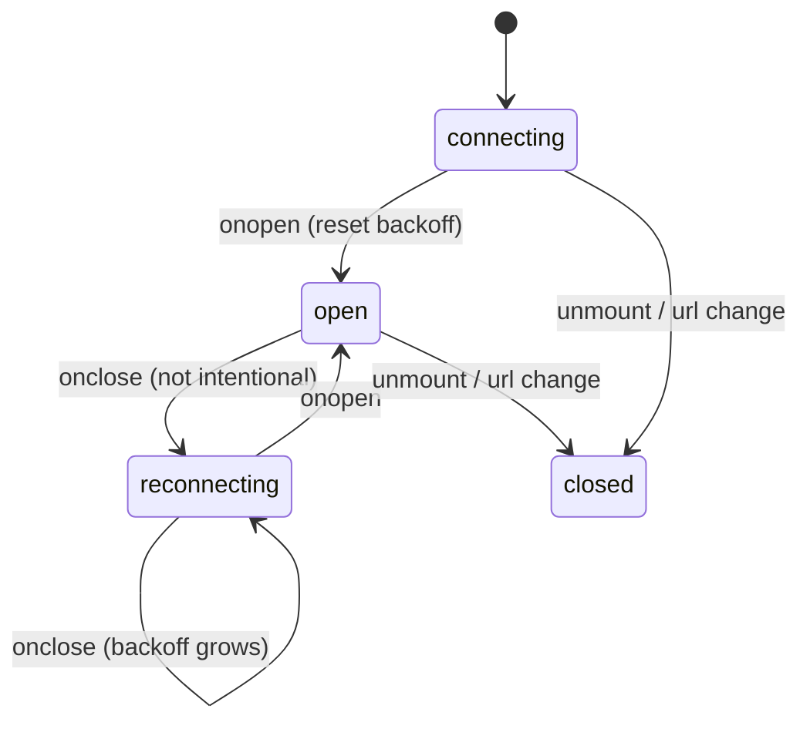
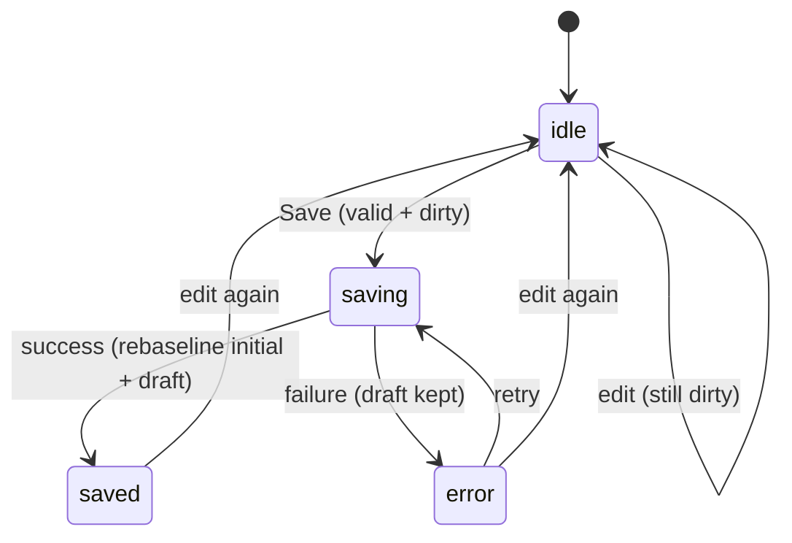

# Real-World Frontend Features

These are the prompts that arrive as a product brief rather than a component spec: a catalog, a chat, a live feed, a dashboard. Every one of them is a composition of patterns you already built &mdash; the Data Table pipeline, the API-Backed List state machine, the sortable-list gesture, the cart store &mdash; so the new skill is wiring them together without inventing a second source of truth.

---

## Product Listing / E-commerce Catalog

`Difficulty: Hard` `Probability: Very High`

### What are we building?

A product grid with a filter facet rail (category, price, rating), a sort control, and pagination, all driven by the URL. It is the capstone of **#38 Data Table** and **#39 API-Backed List**: the same filter &rarr; sort &rarr; paginate pipeline, the same async state machine, but the results render as cards and every input is a query parameter. Reuse those patterns by reference; this problem adds facets, images, and a handoff to the cart.

### Example

```text
┌ Filters ──────────┐  Search [ headphones        ]  Sort [ Price: low → high ▾ ]
│ Category          │  Showing 1–12 of 87
│  [x] Audio        │  ┌────────┐ ┌────────┐ ┌────────┐
│  [ ] Wearables    │  │  img   │ │  img   │ │  img   │
│ Price  [$20–$200] │  │ Studio │ │ Buds   │ │ ANC    │
│ Rating  [★4+]     │  │ $129   │ │ $59    │ │ $199   │
└───────────────────┘  │ [Add]  │ │ [Add]  │ │ [Sold] │
                       └────────┘ └────────┘ └────────┘
                       Page 1 of 8     [ < ]  [ > ]
/search?q=headphones&category=audio&sort=price-asc&page=1
```

The URL above reproduces the exact view when pasted into a new tab.

### What is the interviewer testing?

- Reusing the **Data Table** derived pipeline instead of re-deriving filter/sort/paginate from scratch
- Reusing the **API-Backed List** five-state machine for the fetch, including abort and retry
- URL as the single source of truth for query, filters, sort, and page (see **#67**)
- Card-grid rendering with stable `id` keys and sized images
- Loading skeletons, an honest empty state, and an error state with retry
- A narrow add-to-cart write path into the cart store from **#60**, with no grid-wide re-render

### State Design

```ts
type Product = {
  id: string;
  title: string;
  priceCents: number;         // money as integers, format at the edge
  rating: number;             // 0..5
  category: string;
  imageUrl: string;
};

type SortKey = "relevance" | "price-asc" | "price-desc" | "rating";

type CatalogQuery = {
  q: string;
  categories: string[];
  minPrice: string;
  maxPrice: string;
  minRating: string;
  sort: SortKey;
  page: number;
};

type CatalogState = {
  status: "idle" | "loading" | "success" | "empty" | "error";
  items: Product[];           // only the current page (server mode)
  total: number;              // for the page count
  error: string | null;
};

// the URL is the query store; `q` has a local draft for the input only
draft: string;
```

**Do NOT store:** the filtered, sorted, or paginated arrays &mdash; the server owns them, exactly as in server-side **Data Table**. Do NOT store facet result counts (the response carries them), a resolved `totalPages` (derive `Math.ceil(total / pageSize)`), or a second copy of `q`/`categories`/`sort`/`page` in `useState`. Do NOT keep fetched pages in a parallel array; if you need "load more", model it as an explicit append list the way **#45 Infinite Scroll** does.

### Basic Version

The async half is **#39**'s machine with the query serialized to one stable key. Only the differences from #39 are shown:

```ts
import { useEffect, useMemo, useState } from "react";

export function useCatalog(query: CatalogQuery) {
  const [state, setState] = useState<CatalogState>({
    status: "idle",
    items: [],
    total: 0,
    error: null,
  });
  const [attempt, setAttempt] = useState(0);

  // Serialize to a string so the effect depends on a primitive,
  // not on the query object's identity. Same abort/retry rules as #39.
  const key = useMemo(() => {
    const p = new URLSearchParams({ q: query.q, sort: query.sort, page: String(query.page) });
    query.categories.forEach((c) => p.append("category", c));
    if (query.minPrice) p.set("minPrice", query.minPrice);
    if (query.maxPrice) p.set("maxPrice", query.maxPrice);
    if (query.minRating) p.set("minRating", query.minRating);
    return p.toString();
  }, [query]);

  useEffect(() => {
    const controller = new AbortController();
    setState((s) => ({ ...s, status: "loading", error: null }));

    fetch(`/api/products?${key}`, { signal: controller.signal })
      .then((res) => {
        if (!res.ok) throw new Error(`Request failed (${res.status})`);
        return res.json() as Promise<{ items: Product[]; total: number }>;
      })
      .then(({ items, total }) =>
        setState({ status: items.length ? "success" : "empty", items, total, error: null }),
      )
      .catch((err: unknown) => {
        if (err instanceof DOMException && err.name === "AbortError") return;
        setState({ status: "error", items: [], total: 0, error: "Could not load products." });
      });

    return () => controller.abort(); // #39's cleanup obligation
  }, [key, attempt]);

  return { ...state, retry: () => setAttempt((n) => n + 1) };
}
```

The card, the facet rail, and the grid:

```ts
import { useEffect, useState } from "react";
import { useCart } from "../cart/CartProvider"; // #60

const money = new Intl.NumberFormat("en-US", { style: "currency", currency: "USD" });

function ProductCard({ product }: { product: Product }) {
  const { add } = useCart(); // write path only: no cart re-render (#60)

  return (
    <li>
      <article>
        
        <h3>{product.title}</h3>
        <p>{product.category}</p>
        <p aria-label={`Rated ${product.rating} out of 5`}>
          {"★".repeat(Math.round(product.rating))} {product.rating.toFixed(1)}
        </p>
        <p>{money.format(product.priceCents / 100)}</p>
        <button
          type="button"
          onClick={() =>
            add({ id: product.id, name: product.title, price: product.priceCents / 100 })
          }
        >
          Add {product.title} to cart
        </button>
      </article>
    </li>
  );
}

function ProductSkeletonGrid({ count }: { count: number }) {
  // Same grid shape, aria-hidden: it is decorative, the live region speaks.
  return (
    <ul className="grid" aria-hidden="true">
      {Array.from({ length: count }, (_, i) => (
        <li key={i} className="card skeleton" />
      ))}
    </ul>
  );
}

export function ProductCatalog({
  query,
  categories,
  onQueryChange,
}: {
  query: CatalogQuery;
  categories: string[];
  onQueryChange: (patch: Partial<CatalogQuery>, mode?: "push" | "replace") => void;
}) {
  const { status, items, total, error, retry } = useCatalog(query);
  const [draft, setDraft] = useState(query.q);

  // Back/forward can change the URL underneath us; mirror it into the input.
  useEffect(() => setDraft(query.q), [query.q]);

  // Debounce typing into the URL; "replace" so every keystroke is not a history entry (#67).
  useEffect(() => {
    if (draft === query.q) return;
    const id = setTimeout(() => onQueryChange({ q: draft, page: 1 }, "replace"), 300);
    return () => clearTimeout(id);
  }, [draft, query.q, onQueryChange]);

  return (
    <div className="catalog">
      <aside aria-label="Filters">
        <fieldset>
          <legend>Category</legend>
          {categories.map((c) => (
            <label key={c}>
              <input
                type="checkbox"
                checked={query.categories.includes(c)}
                onChange={(e) =>
                  onQueryChange(
                    {
                      categories: e.target.checked
                        ? [...query.categories, c]
                        : query.categories.filter((x) => x !== c),
                      page: 1,
                    },
                    "push",
                  )
                }
              />
              {c}
            </label>
          ))}
        </fieldset>
        {/* price and rating facets use the identical controlled-checkbox shape */}
      </aside>

      <section aria-label="Products" aria-busy={status === "loading"}>
        <label>
          Search
          <input type="search" value={draft} onChange={(e) => setDraft(e.target.value)} />
        </label>

        <label>
          Sort
          <select
            value={query.sort}
            onChange={(e) =>
              onQueryChange({ sort: e.target.value as SortKey, page: 1 }, "push")
            }
          >
            <option value="relevance">Relevance</option>
            <option value="price-asc">Price: low to high</option>
            <option value="price-desc">Price: high to low</option>
            <option value="rating">Rating</option>
          </select>
        </label>

        {status === "loading" && <ProductSkeletonGrid count={8} />}

        {status === "error" && (
          <div role="alert">
            <p>{error}</p>
            <button type="button" onClick={retry}>
              Try again
            </button>
          </div>
        )}

        {status === "empty" && <p role="status">No products match these filters.</p>}

        {status === "success" && (
          <>
            <p role="status">{total} products</p>
            <ul className="grid">
              {items.map((p) => (
                <ProductCard key={p.id} product={p} />
              ))}
            </ul>
          </>
        )}
      </section>
    </div>
  );
}
```

### How It Works

- **The URL is the query, and the query is the render input.** A parent parses `window.location` into `CatalogQuery` (mechanics in **#67**) and hands it down. Reload, share, and back/forward all work because nothing lives only in component state.
- **The fetch is #39 unchanged.** `status` is one discriminated value, `empty` is derived from `items.length`, the effect aborts on every dependency change, and `retry` re-runs the effect. The only new line is serializing the query to `key` so the effect does not re-fire on every render from a fresh object.
- **Server-side mode mirrors #38.** The client never sorts or slices; it sends `sort`, facets, and `page`, then renders `items` and derives `totalPages` from `total`. Facet counts come back from the server because only it knows the full result set.
- **The grid is a presentational map.** `ProductCard` receives one product and a stable `key`. It calls only `add` from the cart store, so a cart quantity change re-renders the badge, not the catalog.
- **Facets are controlled inputs whose value lives in the URL.** Toggling a category patches `category` and resets `page` to 1, because a filter change invalidates the current page.
- **Skeletons render the grid's shape**, so the swap to real cards does not shift layout.

### Edge Cases

- **Page beyond the last after a filter tightens:** reset `page` to `1` on every facet, search, and sort change. If the server still returns empty, render the empty state, not a blank grid.
- **Price range where `min > max`:** swap the bounds or ignore the range, but pick one and keep the facet label honest.
- **Rapid checkbox toggles:** the abort in `useCatalog` plus the serialized key means only the latest response renders (the race described in **#41**).
- **A debounced URL write racing the Back button:** the `useEffect` that mirrors `query.q` into `draft` keeps the input from resurrecting stale text.
- **Images that 404 or load slowly:** fixed `width`/`height` plus a neutral background prevents a reflow storm; add an `onError` placeholder.
- **Out-of-stock or variant products:** disable Add and explain why; adding a product with required variants should deep-link to the product page instead.
- **Empty result with active facets:** keep the facet rail visible so the user can undo a filter; do not hide the controls.
- **Money and locale:** store integer cents and format with `Intl.NumberFormat`; never do float arithmetic on display prices.

### Interview Follow-ups

- **Level 1:** Render a static `products` array as a grid, keyed by `id`.
- **Level 2:** Add a sort `<select>` and derive the sorted array &mdash; reusing the comparator from **#38**.
- **Level 3:** Add category and price facets, derived client-side (the **#38** client pipeline).
- **Level 4:** Move to server mode with `#39`'s state machine, loading skeletons, empty, and error + retry.
- **Level 5:** Sync every input to the URL with `useUrlQuery` from **#67**, including back/forward.
- **Level 6:** Paginate and reset `page` on filter changes; keep the view shareable.
- **Level 7:** Add a product detail route and a quick-view modal (reuse **#17**), preserving the list scroll position.
- **Level 8:** Wire add-to-cart to the **#60** store, then show a toast from **#24**.
- **Level 9:** Add "load more" or infinite scroll (**#45**) as an alternative to pagination.
- **Level 10:** Optimistic wishlist/favorite on each card (**#4**), virtualize very large grids (**#55**), and cache pages by URL (**#42**).

### Production Version

A server-state library replaces the hand-rolled cache: `useInfiniteQuery` or `useQuery` keyed on the serialized catalog query gives request de-duplication, `placeholderData` (v5) to keep the old page visible while the next loads, and `keepPreviousData` semantics for paging. Facet counts, cursor pagination, and personalization belong on the server. The interview answer remains the manual machine, because the point is proving you know where the cache key comes from and why `page` resets.

### Accessibility

- Facet groups are `<fieldset>` + `<legend>`; each option is a labeled checkbox, never a bare colored chip.
- The result count and "page X of Y" live in a polite live region so filtering and sorting are perceivable without sight.
- Set `aria-busy="true"` on the results region during a fetch; keep `role="alert"` for the error and place `Try again` next to the message.
- Skeletons are `aria-hidden`; a screen reader hears "Loading" from the status region, not a wall of empty boxes.
- Every Add button has an accessible name containing the product ("Add Studio Headphones to cart").
- Product images carry a meaningful `alt` when they convey information; pass `alt=""` for purely decorative shots.

### Performance

- Lazy-load images with explicit dimensions and `loading="lazy"`; below-the-fold cards should not block the grid.
- Memoize `ProductCard` and pass primitives plus a stable `add` callback so a single cart change does not re-render every card.
- Keep the facet option list referentially stable; rebuilding it each render invalidates any memoized children.
- In server mode, debounce the search and cache pages by query string so Back is instant.
- For grids of thousands, virtualize the list (**#55**) or cap the page and paginate; do not render 5,000 cards.

### Testing

```text
✓ renders a card per product, keyed by id
✓ sorting changes the order (client) or the request params (server)
✓ toggling a category adds it to the URL and resets the page
✓ typing debounces into the URL exactly once
✓ back/forward restores the previous filters and results
✓ shows skeletons while loading and the empty state on zero results
✓ a failed request shows the error and retry refetches
✓ add-to-cart updates the cart without re-rendering the grid
```

### Common Mistakes

- Storing a `filtered`/`sorted`/`paged` array in state when it is a pure function of the query (client) or already returned (server).
- Forgetting to reset `page` when a filter or sort changes, leaving the user on a blank page.
- Two sources of truth: URL filters plus local filter state kept in sync with an effect.
- Rebuilding the facet options array every render, invalidating memos.
- Making the whole catalog subscribe to the cart so every Add re-renders the grid.
- Showing "empty" while the request is still loading.
- Rendering images without dimensions, causing a layout shift when they arrive.

### Interview Takeaway

A catalog is the Data Table's pipeline plus the API-Backed List's machine, rendered as cards and driven by the URL. Derive the query from the URL, fetch one page with the #39 state machine, keep facets controlled by URL params, and hand add-to-cart to the #60 store as a narrow write path. Get the key stable and the rest is composition.

---

## Search + Filters Synced with URL

`Difficulty: Hard` `Probability: High`

### What are we building?

A search box and filter controls whose state lives in the URL rather than in component state. Every change is shareable, survives a reload, and works with the browser's Back and Forward buttons. The URL is the store; React only reads and writes it.

### Example

```text
/search?q=react&category=frameworks&sort=stars&page=2
[ react_______ ]  [x] Frameworks  [ ] Libraries   Sort: [ Stars ▾ ]

[ Copy link ]  → paste into a new tab → identical view
Back after toggling a filter → the previous filter set returns
```

### What is the interviewer testing?

- Treating the URL as the single source of truth instead of mirroring it into `useState`
- Reading and writing with `URLSearchParams` (`get`, `getAll`, `set`, `append`, `delete`)
- Choosing `history.pushState` vs `replaceState` deliberately
- Handling Back/Forward with a `popstate` listener **and cleaning it up**
- Debouncing typed input before it reaches the URL, and not storing duplicate state
- Encoding and multi-value parameters done correctly

### State Design

```ts
// The store is the URL itself: window.location.search
type QueryState = {
  q: string;
  categories: string[];
  sort: "relevance" | "price-asc" | "rating";
  page: number;
};

params: URLSearchParams   // a render-safe parse of the latest URL string
draft: string             // in-progress input, before debounce — the ONLY local state
```

**Do NOT store:** a `useState` copy of `q`, `categories`, `sort`, or `page` that you keep in sync with an effect. The URL is authoritative; a mirrored copy is the bug that makes Back show the wrong thing. `draft` is allowed because it is input that has not been committed yet. Do not store `hasFilters` or `isSearching` &mdash; both are derivable from `params`.

### Basic Version

A small hook that reads the URL, subscribes to `popstate`, and patches on demand:

```ts
import { useCallback, useEffect, useMemo, useState } from "react";

type Patch = Record<string, string | string[] | number | null>;

export function useUrlQuery() {
  // state holds the raw search string, not a parsed object
  const [search, setSearch] = useState(() => window.location.search);

  useEffect(() => {
    const onPop = () => setSearch(window.location.search); // Back/Forward
    window.addEventListener("popstate", onPop);
    return () => window.removeEventListener("popstate", onPop);
  }, []);

  // Parse on demand; memoized so consumers get a stable reference per URL.
  const params = useMemo(() => new URLSearchParams(search), [search]);

  const update = useCallback((patch: Patch, mode: "push" | "replace" = "push") => {
    const next = new URLSearchParams(window.location.search);

    for (const [key, value] of Object.entries(patch)) {
      next.delete(key); // replace the key entirely: no stale duplicates
      if (value == null || value === "") continue;
      if (Array.isArray(value)) value.forEach((v) => next.append(key, v));
      else next.set(key, String(value));
    }

    const query = next.toString();
    const url = `${window.location.pathname}${query ? `?${query}` : ""}${window.location.hash}`;

    // pushState/replaceState do NOT fire popstate, so update our own snapshot.
    if (mode === "replace") window.history.replaceState(null, "", url);
    else window.history.pushState(null, "", url);
    setSearch(query ? `?${query}` : "");
  }, []);

  return { params, update };
}
```

```ts
export function SearchAndFilters() {
  const { params, update } = useUrlQuery();

  const q = params.get("q") ?? "";
  const categories = params.getAll("category");
  const sort = params.get("sort") ?? "relevance";

  const [draft, setDraft] = useState(q);

  // The URL can change from Back/Forward; push that into the input.
  useEffect(() => setDraft(q), [q]);

  // Debounce typing into the URL. "replace": do not add a history entry per keystroke.
  useEffect(() => {
    if (draft === q) return;
    const id = setTimeout(() => update({ q: draft, page: null }, "replace"), 300);
    return () => clearTimeout(id);
  }, [draft, q, update]);

  return (
    <form role="search" onSubmit={(e) => e.preventDefault()}>
      <label htmlFor="q">Search</label>
      <input
        id="q"
        type="search"
        value={draft}
        onChange={(e) => setDraft(e.target.value)}
        placeholder="Search…"
      />

      <fieldset>
        <legend>Category</legend>
        {["frameworks", "libraries", "tools"].map((c) => (
          <label key={c}>
            <input
              type="checkbox"
              checked={categories.includes(c)}
              onChange={(e) =>
                update(
                  {
                    category: e.target.checked
                      ? [...categories, c]
                      : categories.filter((x) => x !== c),
                    page: null,
                  },
                  "push", // a deliberate filter is worth a Back step
                )
              }
            />
            {c}
          </label>
        ))}
      </fieldset>

      <label>
        Sort
        <select value={sort} onChange={(e) => update({ sort: e.target.value, page: null }, "push")}>
          <option value="relevance">Relevance</option>
          <option value="price-asc">Price: low to high</option>
          <option value="rating">Rating</option>
        </select>
      </label>
    </form>
  );
}
```

### How It Works

- **One writer, one reader.** Every control funnels through `update`, which patches the current URL and re-syncs the local `search` snapshot. Nothing writes React state directly, so the URL cannot drift.
- **`push` vs `replace` is a product decision.** Filter, sort, and pagination pushes (Back should undo them). Typing replaces (one Back should leave search, not unwind six keystrokes). State it explicitly &mdash; it is a favorite interview question.
- **`popstate` fires on Back/Forward only.** `pushState` and `replaceState` do not, which is why `update` also updates the snapshot. Miss this and the UI freezes on the URL it just wrote.
- **`delete` before `set`/`append`** guarantees a key is replaced, not accumulated. Multi-value params use `getAll`/`append` so `?category=a&category=b` round-trips.
- **`URLSearchParams` handles encoding**, so spaces, `&`, and Unicode are safe. Never hand-concatenate query strings.
- **The snapshot is a parse cache, not a second source of truth.** The URL is still authoritative; the effect exists only to re-read it after a navigation. The cleaner refactor subscribes to the platform with `useSyncExternalStore`:

```ts
function useUrlSearch(): string {
  return useSyncExternalStore(
    (onStoreChange) => {
      window.addEventListener("popstate", onStoreChange);
      return () => window.removeEventListener("popstate", onStoreChange);
    },
    () => window.location.search,   // getSnapshot: a primitive, so it compares by value
    () => "",                        // getServerSnapshot for SSR
  );
}
```

This removes the `useState`/`useEffect` pair entirely and makes the "URL is the store" claim literal.

### Edge Cases

- **Absent or empty params:** `get` returns `null`; `getAll` returns `[]`. Default in the reader, not by writing defaults into the URL.
- **Multi-value order:** `append` preserves insertion order; decide whether `?a=1&a=2` and `?a=2&a=1` should be the same state (usually yes &mdash; sort before comparing).
- **Encoding:** `URLSearchParams` writes spaces as `+` and handles `%20` on read; never compare raw strings, compare parsed values.
- **Filter change while on page 3:** patch `page: null` (which deletes it) so the reader falls back to `1`.
- **No-op updates:** if the patch produces an identical URL, skip `pushState`; otherwise Back becomes a stack of identical entries.
- **Rapid pushes:** debounce typed input with `replace`; a click is a single push.
- **External navigation:** links that leave the app should not be intercepted; scope this to your route.
- **SSR/hydration:** `window` is undefined on the server; initialize from a prop or an empty string and read the URL in an effect, or use the `useSyncExternalStore` server snapshot.
- **Hash routing:** if the app uses a hash router, the query lives after `#`; read `window.location.hash` instead.

### Interview Follow-ups

- **Level 1:** A controlled search input whose value is local `useState` only (name the sharing bug).
- **Level 2:** Write the query into the URL with `history.replaceState` on submit.
- **Level 3:** Read it back on mount so a pasted link reproduces the view.
- **Level 4:** Add multi-value category filters with `getAll`/`append`.
- **Level 5:** Handle Back/Forward with `popstate` and clean it up.
- **Level 6:** Debounce typed input with `replace` and push on filter clicks.
- **Level 7:** Refactor to `useSyncExternalStore` so the URL subscription has no effect.
- **Level 8:** Add pagination and reset `page` on any filter change.
- **Level 9:** Debounce + abort the fetch that reads the URL (**#41**), and cache responses per URL (**#42**).
- **Level 10:** Replace the hand-rolled hook with a router's `useSearchParams` or a dedicated URL-state library, keeping the same `push`/`replace` policy.

### Production Version

Meta-frameworks ship this: `react-router`'s `useSearchParams`, Next.js `searchParams`, and libraries such as `nuqs` or `use-query-params` provide typed parse/serialize, batching, and integration with the router's history. They solve the same three problems you just solved: encoding, push-vs-replace policy, and `popstate` synchronization. Mention that, but write the manual version first &mdash; the interviewer wants to hear the policy, not the import.

### Accessibility

- Wrap the controls in `<form role="search">` (a `<search>` landmark) so assistive tech can jump to it.
- Every input has a real `<label>`; placeholders are not labels.
- Announce result changes in a polite live region; the URL itself is invisible to screen-reader users.
- When filters change while focus is in the list, do not steal focus back to the top unless the user asked to search.
- Filter chips should be removable buttons with names, not just an `×`.

### Performance

- Debounce typed input and use `replace`; a push per keystroke makes the history stack unusable and re-runs the effect chain.
- Cache responses by the serialized query string (**#42**) so Back is instant and no refetch fires.
- Keep `params` memoized per URL string so consumers do not get a new object every render.
- Avoid re-parsing `window.location` during render; read it in the subscription so concurrent rendering sees a stable value.
- Only the components that read a given param should subscribe to it; a single big context re-renders the whole page on every keystroke.

### Testing

```text
✓ typing debounces and writes q to the URL once
✓ pasting a URL reproduces the input values and the fetch
✓ Back restores the previous filters (popstate path)
✓ Forward re-applies the filters that were undone
✓ pushing a filter does not duplicate the param on repeated toggles
✓ multi-value category params round-trip through getAll/append
✓ an identical patch does not add a history entry
✓ the popstate listener is removed on unmount
```

### Common Mistakes

- Mirroring the URL into `useState` and syncing with an effect: two sources of truth that drift.
- Pushing a history entry on every keystroke instead of replacing.
- Forgetting that `pushState`/`replaceState` do not fire `popstate`, so the UI never updates after a write.
- Not cleaning up the `popstate` listener.
- Hand-building query strings and breaking on spaces, `&`, or Unicode.
- Resetting the whole URL instead of patching one key.
- Reading `window.location.search` during render, which breaks SSR and can tear under concurrent rendering.
- Forgetting to clear `page` when filters change.

### Interview Takeaway

The URL is a store with real UX value: shareable, refresh-proof, and navigable. Read it with `URLSearchParams`, write it with a single `update` that chooses `push` or `replace`, subscribe with `popstate` (ideally through `useSyncExternalStore`), and keep exactly one piece of local state &mdash; the uncommitted draft. Everything else is derived.

---

## Chat / Messaging UI

`Difficulty: Hard` `Probability: High`

### What are we building?

A message list and composer: send a message optimistically, append it to the list, auto-scroll only when the user is already at the bottom, show a "new messages" affordance when they are not, and mark messages seen. Enter sends, Shift+Enter inserts a newline. Real-time transport is **#69**; this problem is the UI and state model on top of it.

### Example

```text
┌─────────────────────────────────┐
│ Ada                             │
│   hey!                   14:02  │
│ you: on it                14:03 ✓✓│  ← optimistic, then sent + seen
│   sounds good            14:03  │
│        [ 3 new messages ↓ ]     │  ← user scrolled up
├─────────────────────────────────┤
│ [ Type a message…         ] [↑] │
└─────────────────────────────────┘
Enter sends · Shift+Enter newline
```

### What is the interviewer testing?

- An append-only message list with stable keys and optimistic inserts reconciled against the server
- Auto-scroll that respects a user who scrolled up, instead of hijacking it
- Seen/unread derived from a `lastSeenId` pointer, not a boolean flipped by an effect
- Composer semantics: Enter vs Shift+Enter, IME safety, disabled empty send
- Keeping `draft` local so typing does not re-render the list
- Cleanup of scroll listeners and any subscription to the socket in **#69**

### State Design

```ts
type Message = {
  id: string;
  senderId: string;
  body: string;
  createdAt: number;
  status: "sending" | "sent" | "failed";   // client-side delivery only
};

type ChatState = {
  messages: Message[];        // ordered by createdAt, id as tiebreak
  lastSeenId: string | null;  // pointer to the newest message the user has seen
  draft: string;              // local to the composer
};

// refs (no re-render on scroll):
listRef: HTMLUListElement | null;
atBottomRef: boolean;
```

**Do NOT store:** `isScrolledToBottom` in state, `unreadCount` (derive it from `lastSeenId` and the array), a separate array of optimistic messages, or a boolean per message for "is mine" (derive from `senderId === meId`). Do NOT store a `hasNewMessages` flag that an effect toggles &mdash; that is the derive-vs-store trap in scroll clothing.

### Basic Version

```ts
import { useEffect, useRef, useState } from "react";

const BOTTOM_THRESHOLD = 48; // px within the bottom that still counts as "pinned"

function isNearBottom(el: HTMLElement) {
  return el.scrollHeight - el.scrollTop - el.clientHeight < BOTTOM_THRESHOLD;
}

export function Chat({
  meId,
  onSend,
}: {
  meId: string;
  onSend: (body: string) => Promise<Message>;
}) {
  const [messages, setMessages] = useState<Message[]>([]);
  const [lastSeenId, setLastSeenId] = useState<string | null>(null);
  const [draft, setDraft] = useState("");

  const listRef = useRef<HTMLUListElement>(null);
  const atBottomRef = useRef(true); // ref, not state: scroll must not re-render the list

  const onScroll = () => {
    const el = listRef.current;
    if (el) atBottomRef.current = isNearBottom(el);
  };

  // Auto-scroll only if the user was pinned before this message arrived.
  useEffect(() => {
    const el = listRef.current;
    if (!el) return;
    if (!atBottomRef.current) return;

    el.scrollTop = el.scrollHeight;
    const last = messages[messages.length - 1];
    if (last) setLastSeenId(last.id); // at the bottom ⇒ everything is seen
  }, [messages]);

  const send = async () => {
    const body = draft.trim();
    if (!body) return;

    const optimistic: Message = {
      id: `temp-${crypto.randomUUID()}`,
      senderId: meId,
      body,
      createdAt: Date.now(),
      status: "sending",
    };

    atBottomRef.current = true; // sending always brings you to the bottom
    setMessages((prev) => [...prev, optimistic]);
    setDraft("");

    try {
      const saved = await onSend(body);
      setMessages((prev) =>
        prev.map((m) => (m.id === optimistic.id ? { ...saved, status: "sent" } : m)),
      );
    } catch {
      setMessages((prev) =>
        prev.map((m) => (m.id === optimistic.id ? { ...m, status: "failed" } : m)),
      );
    }
  };

  const jumpToLatest = () => {
    const el = listRef.current;
    if (!el) return;
    el.scrollTop = el.scrollHeight;
    atBottomRef.current = true;
    const last = messages[messages.length - 1];
    if (last) setLastSeenId(last.id);
  };

  // Unread is derived: incoming messages after the seen pointer.
  const seenIndex = lastSeenId ? messages.findIndex((m) => m.id === lastSeenId) : 0;
  const unread = lastSeenId
    ? messages.slice(seenIndex + 1).filter((m) => m.senderId !== meId).length
    : 0;

  return (
    <section className="chat" aria-label="Conversation with Ada">
      <ul
        ref={listRef}
        className="messages"
        role="log"
        aria-live="polite"
        aria-relevant="additions"
        onScroll={onScroll}
        tabIndex={0}
        style={{ overflowY: "auto", maxHeight: 420 }}
      >
        {messages.map((m) => (
          <li key={m.id} data-mine={m.senderId === meId}>
            <span>{m.senderId === meId ? "you" : "Ada"}: </span>
            <span>{m.body}</span>
            {m.status === "sending" && <span aria-label="Sending"> …</span>}
            {m.status === "failed" && (
              <button type="button" onClick={() => {/* retry send */}}>
                Retry
              </button>
            )}
          </li>
        ))}
      </ul>

      {unread > 0 && (
        <button type="button" onClick={jumpToLatest}>
          {unread} new message{unread === 1 ? "" : "s"} ↓
        </button>
      )}

      <form
        onSubmit={(e) => {
          e.preventDefault();
          void send();
        }}
      >
        <label htmlFor="composer">Message</label>
        <textarea
          id="composer"
          rows={1}
          value={draft}
          onChange={(e) => setDraft(e.target.value)}
          onKeyDown={(e) => {
            if (e.key === "Enter" && !e.shiftKey && !e.nativeEvent.isComposing) {
              e.preventDefault(); // stop the newline; submit instead
              void send();
            }
          }}
        />
        <button type="submit" disabled={!draft.trim()}>
          Send
        </button>
      </form>
    </section>
  );
}
```

### How It Works

- **Optimistic append, then reconcile.** The message enters the list with a temporary id and `status: "sending"`, so ordering and layout are final before the server answers. On success the row is patched with the saved message; on failure it becomes `failed` with a retry.
- **Scroll pinning is decided before the append.** `onScroll` records whether the user was near the bottom in a **ref**. The effect then either follows the new message or leaves the viewport alone. Using state here would re-render the list on every wheel event and would still race the append.
- **Unread is a pointer.** `lastSeenId` marks the newest seen message; unread is `messages.slice(seenIndex + 1)` filtered to incoming. No flag, no effect, no drift.
- **The composer owns `draft`.** Typing updates only the composer. If `draft` lived in the parent, every keystroke would re-render every message row.
- **Enter sends, Shift+Enter newlines.** `preventDefault` stops the textarea from inserting a newline on submit. `isComposing` prevents IME users from sending an incomplete character.
- **Keys are stable.** The temp id is the key until reconciliation; if the server echoes the client id back, the node is reused rather than remounted.

### Edge Cases

- **A message arrives while the user is scrolled up:** do not jump; increment the derived unread count and show the button.
- **The user is at the bottom and a message arrives:** scroll and advance `lastSeenId`.
- **A send fails or the component unmounts mid-send:** mark it `failed` and keep the text recoverable; abort the request on unmount (**#41**).
- **Double Enter:** two optimistic messages; if the transport requires serialized sends, disable Send while `pending` or queue them.
- **Out-of-order arrivals:** sort by `createdAt` with `id` as a tiebreak; never trust arrival order.
- **Grouping and day separators:** derive from `createdAt` in a memo; do not bake separators into the array.
- **Attachments that load late and change height:** anchor to a bottom sentinel and use `scrollIntoView({ block: "end" })`, or reserve the media height.
- **Switching conversations:** clear `lastSeenId` per conversation and keep drafts per conversation if you support multiple.
- **Very long histories:** virtualize (**#55**) while preserving the bottom anchor; load older messages on scroll-up with an explicit cursor (**#44**).

### Interview Follow-ups

- **Level 1:** Render a static message list keyed by id.
- **Level 2:** Add the composer with Enter-to-send and a disabled empty state.
- **Level 3:** Optimistic send with `sending`/`sent`/`failed` and retry.
- **Level 4:** Auto-scroll that follows new messages.
- **Level 5:** Respect a user who scrolled up, with a "new messages" button (above).
- **Level 6:** Seen/unread derived from `lastSeenId`; group by day and sender.
- **Level 7:** Wire the transport to **#69**: incoming frames update the same `messages` array, deduped by id.
- **Level 8:** Typing indicators and read receipts as separate ephemeral state, not message objects.
- **Level 9:** Jump-to-message, search within the conversation, and load older messages with a cursor.
- **Level 10:** Virtualized history with a stable bottom anchor and accessibility announcements.

### Production Version

Production chat uses a server-owned ordered log: an infinite query for history plus a live subscription that prepends/appends into the same normalized cache, with optimistic sends via a mutation and rollback on failure. A library such as TanStack Query handles the cache and cursors; the scroll-pinning and `lastSeenId` logic stay exactly as written because they are UI concerns the library does not own.

### Accessibility

- The log is `role="log"` with `aria-live="polite"` and `aria-relevant="additions"`, so new messages are announced without stealing focus. For a high-frequency feed, announce summaries instead of every frame.
- The composer is a labeled `<textarea>`; the Send button has a clear name and a `disabled` empty state.
- Do not autofocus the composer on load in a way that scrolls the page; manage focus deliberately.
- Failed bubbles expose a real Retry button with an accessible name.
- Scroll position is not the only indicator of new messages; the button plus the count is perceivable without sight.

### Performance

- Keep `draft` in the composer so keystrokes do not re-render the message list.
- Track scroll position in a ref; state-per-scroll re-renders the list dozens of times a second.
- Memoize the message row and pass primitives, so appending one message does not re-render the others.
- Virtualize long histories and keep the bottom anchor stable; the list can reach tens of thousands of rows.
- Batch bursts of incoming messages (an animation-frame buffer) rather than calling `setMessages` per frame.

### Testing

```text
✓ sending appends an optimistic message and clears the input
✓ a successful send reconciles to the saved message exactly once
✓ a failed send shows Retry and does not drop the text
✓ new messages scroll when the user is pinned to the bottom
✓ new messages do not scroll when the user scrolled up, and the button appears
✓ Enter sends; Shift+Enter inserts a newline; IME composition does not send
✓ unread count is derived from lastSeenId
✓ the scroll handler is attached and detached with the list
```

### Common Mistakes

- Scrolling to the bottom on every message, yanking the viewport away from a user reading history.
- Storing `isScrolledToBottom` in state and deriving intent in an effect, creating a render loop.
- Duplicate `key`s for optimistic messages, causing React to reuse the wrong row after reconciliation.
- Sending on Enter without `preventDefault`, leaving a newline in the box.
- Ignoring `isComposing`, so Japanese/Chinese input sends mid-character.
- Keeping `draft` in the parent and re-rendering the entire list on every keypress.
- Treating "seen" as a boolean on each message instead of one pointer.

### Interview Takeaway

Chat is an append-only ordered list plus a scroll policy. Insert optimistically with a temp id and a status, reconcile on the server response, and decide *before* each append whether to follow the bottom. Keep unread as a pointer (`lastSeenId`) and the composer local. The transport lives in **#69**; the hard part here is never fighting the user's scroll.

---

## Real-Time WebSocket Messages

`Difficulty: Hard` `Probability: Very High`

### What are we building?

A live connection that pushes messages into the UI. This is the focused WebSocket problem: one effect owns the socket lifecycle, reconnects with exponential backoff and jitter, cleans up on unmount, deduplicates replayed messages by id, and exposes a `connecting | open | closed | reconnecting` status. **#68 Chat** consumes this hook for its message stream.

### Example

```text
Connection: ● Live          →   ○ Reconnecting… (attempt 3, retry in 4s)

14:02:11  Order #8412 created
14:02:19  Order #8390 shipped
14:03:02  Order #8413 cancelled
[ Ping ]   ← disabled unless status === "open"
```



### What is the interviewer testing?

- The `WebSocket` lifecycle: construct, `onopen`, `onmessage`, `onerror`, `onclose`
- Reconnect with exponential backoff, a cap, and jitter, reset only on a successful open
- Cleanup that closes the socket, clears the retry timer, and **does not reconnect** after unmount
- StrictMode's double-invoke and why a shared `closed` ref is the wrong flag
- Deduplication by id because a reconnect can replay frames
- One connection shared across the app, not one per component
- A connection-state UI driven by a single discriminated status

### State Design

```ts
type ConnectionStatus = "connecting" | "open" | "closed" | "reconnecting";

type WsState<T> = {
  status: ConnectionStatus;
  messages: T[];        // append-only, deduplicated by id
  error: string | null;
};

// refs — the socket must never live in state:
socketRef: React.MutableRefObject<WebSocket | null>;
seenIdsRef: React.MutableRefObject<Set<string>>;
// effect-local (NOT refs): closed, attempt, timer — see How It Works
```

**Do NOT store:** the `WebSocket` instance in `useState` (constructing it in render or re-rendering on it causes duplicate connections), a boolean `isConnected` alongside `status` (they contradict), a per-message `delivered` flag, or a second copy of the messages array. Do not store the reconnect attempt count in state if it only drives the label; `status` already tells the user what matters.

### Basic Version

```ts
import { useCallback, useEffect, useRef, useState } from "react";

type ConnectionStatus = "connecting" | "open" | "closed" | "reconnecting";

export function useWebSocket<T extends { id: string }>(url: string) {
  const [status, setStatus] = useState<ConnectionStatus>("connecting");
  const [messages, setMessages] = useState<T[]>([]);
  const [error, setError] = useState<string | null>(null);

  const socketRef = useRef<WebSocket | null>(null);
  const seenIdsRef = useRef<Set<string>>(new Set());

  const send = useCallback((data: unknown) => {
    const socket = socketRef.current;
    if (socket?.readyState !== WebSocket.OPEN) return false;
    socket.send(JSON.stringify(data));
    return true;
  }, []);

  useEffect(() => {
    // Effect-local lifecycle flags. A shared ref would let the *previous*
    // effect's onclose schedule a reconnect after the new one starts —
    // the StrictMode double-mount trap.
    let closed = false;
    let attempt = 0;
    let timer: number | null = null;

    const connect = () => {
      setStatus(attempt > 0 ? "reconnecting" : "connecting");
      const socket = new WebSocket(url);
      socketRef.current = socket;

      socket.onopen = () => {
        attempt = 0; // reset backoff only on a real open
        setStatus("open");
        setError(null);
      };

      socket.onmessage = (event: MessageEvent<string>) => {
        let parsed: T;
        try {
          parsed = JSON.parse(event.data) as T;
        } catch {
          return; // ignore a malformed frame; never let one break the stream
        }
        // A reconnect may replay frames. Deduplicate by id.
        if (!parsed?.id || seenIdsRef.current.has(parsed.id)) return;
        seenIdsRef.current.add(parsed.id);
        setMessages((prev) => [...prev, parsed]);
      };

      socket.onerror = () => setError("Live connection failed.");

      socket.onclose = () => {
        if (closed) return; // we closed it: do not reconnect
        attempt += 1;
        const base = Math.min(1000 * 2 ** (attempt - 1), 30_000); // 1s,2s,4s…30s cap
        const jitter = Math.random() * 0.3 * base;                 // avoid a thundering herd
        setStatus("reconnecting");
        timer = window.setTimeout(connect, base + jitter);
      };
    };

    connect();

    return () => {
      closed = true;
      if (timer !== null) window.clearTimeout(timer);
      const socket = socketRef.current;
      socketRef.current = null;
      socket?.close(1000, "component unmounted"); // 1000 = normal closure
    };
  }, [url]);

  return { status, messages, error, send };
}
```

```ts
type OrderEvent = {
  id: string;
  type: "created" | "shipped" | "cancelled";
  orderId: string;
  at: number;
};

function ConnectionBanner({ status }: { status: ConnectionStatus }) {
  const label: Record<ConnectionStatus, string> = {
    connecting: "Connecting…",
    open: "Live",
    reconnecting: "Reconnecting…",
    closed: "Offline",
  };
  return (
    <p role="status" aria-live="polite">
      <span aria-hidden="true">{status === "open" ? "●" : "○"}</span> {label[status]}
    </p>
  );
}

export function OrderFeed({ url }: { url: string }) {
  const { status, messages, error, send } = useWebSocket<OrderEvent>(url);

  return (
    <section aria-label="Order events">
      <ConnectionBanner status={status} />
      {error && <p role="alert">{error}</p>}

      <ul>
        {messages.map((event) => (
          <li key={event.id}>
            <time dateTime={new Date(event.at).toISOString()}>
              {new Date(event.at).toLocaleTimeString()}
            </time>{" "}
            Order {event.orderId} {event.type}
          </li>
        ))}
      </ul>

      <button type="button" onClick={() => send({ type: "ping" })} disabled={status !== "open"}>
        Ping
      </button>
    </section>
  );
}
```

### How It Works

- **One effect owns the connection.** `useEffect(..., [url])` creates the socket, wires the four handlers, and returns cleanup. Reconnects happen inside the same effect via `connect`, so a retry does not re-run the effect or leak listeners.
- **Cleanup is the contract.** `closed = true` makes a late `onclose` a no-op, the pending timer is cleared, and the socket is closed with code `1000`. Without `closed`, an unmount schedules a reconnect on a dead component.
- **The `closed` flag is effect-local, deliberately.** React StrictMode mounts, cleans up, and mounts again. A component-level ref would be reset by the second effect, letting the first socket's `onclose` schedule a reconnect. A closure variable belongs to exactly one effect run.
- **Backoff: `min(1000 * 2 ** (attempt - 1), 30_000)` plus 0–30% jitter.** It grows on each failed close and resets only in `onopen`, so a flapping server does not get hammered. Jitter stops thousands of clients from retrying in lockstep.
- **Dedupe by id.** A reconnect often replays the backlog; `seenIdsRef` makes the append idempotent. The ref is a `Set`, mutated in place because it never participates in rendering.
- **`status` is the only connection state.** The banner is a lookup over a discriminated union, so "open and reconnecting" is unrepresentable.
- **`send` guards on `readyState`.** Sending to a `CONNECTING` or `CLOSED` socket throws; returning `false` lets the caller queue or disable the control.

### Edge Cases

- **Replay after reconnect:** dedupe by id, and prefer a server sequence number if order matters more than identity.
- **Out-of-order or missing frames:** sort by sequence/time on insert if the feed requires ordering; otherwise append and let the id be the identity.
- **Malformed JSON:** catch and drop the frame. One bad payload must not tear down the socket.
- **Intentional close:** unmount or a `url` change sets `closed`, so no reconnect fires.
- **Offline / network flaps:** reconnect on the `online` event and pause attempts while `offline`; `navigator.onLine` is a hint, not a guarantee.
- **Background tab:** browsers may throttle timers; on `visibilitychange` back to visible, reconnect immediately instead of waiting out the backoff.
- **Auth expiry:** a close code such as `4001` should refresh the token, then reconnect; a `1008` (policy violation) should stop entirely.
- **Unbounded memory:** cap the in-memory list (keep the last N) and bound `seenIdsRef` (a ring or by dropping ids older than the window).
- **SSR:** `WebSocket` is undefined on the server; constructing it inside the effect is safe, but guard any direct reference during render.
- **Multiple consumers:** a `useWebSocket` call per component opens a socket per component. Lift it to a provider or a module singleton.

### Interview Follow-ups

- **Level 1:** Open one socket, log frames, close on unmount.
- **Level 2:** Render received messages in a keyed list with a status line.
- **Level 3:** Reconnect on close with a fixed delay.
- **Level 4:** Exponential backoff with a cap and jitter; reset on open (the version above).
- **Level 5:** Deduplicate by id and ignore malformed frames.
- **Level 6:** Extract `useWebSocket` and use it from **#68 Chat** as the transport.
- **Level 7:** Share a single connection via context or a module singleton so many widgets reuse one socket.
- **Level 8:** Add a heartbeat `ping`/`pong` with a timeout that forces a reconnect when the peer goes silent.
- **Level 9:** Resume from a cursor after reconnect instead of replaying the whole backlog.
- **Level 10:** Batch high-frequency frames into an animation frame, virtualize the feed, and add offline queueing for `send`.

### Production Version

At app scale you want exactly one socket, owned outside React and exposed through a store: a module singleton or a context provider that holds the connection and lets many components subscribe to slices. Libraries such as Socket.IO or a managed realtime service add heartbeats, rooms, and backpressure for you, and server-sent events (SSE) are the simpler choice when the stream is one-way. Whatever the transport, the state model is the same: one status, append-only deduplicated messages, and lifecycle owned by cleanup.

### Accessibility

- The connection status is text plus shape, not color alone, and lives in a `role="status"` region.
- New items in a live feed should not interrupt: use `aria-live="polite"` (or `off` with a periodic summary for high volume).
- Disable the send/Ping control while `status !== "open"` and explain why ("Reconnecting…"), rather than letting a click silently fail.
- Errors use `role="alert"` and sit next to the connection banner; keep a manual Reconnect button for users who do not want to wait out the backoff.

### Performance

- **One socket per app, not per component.** A per-component hook multiplies connections and server load.
- Append immutably and memoize row components so one frame does not re-render the whole feed.
- Batch bursts: buffer frames and `setMessages` once per animation frame instead of per message.
- Cap the list and window it (**#55**); a live feed grows without bound otherwise.
- Keep the socket, timers, and attempt counts in refs/closures; state changes only for what the UI renders.

### Testing

```text
✓ opens a socket on mount and reports "connecting" then "open"
✓ onmessage appends a message keyed by id
✓ a duplicate id is ignored (replay safe)
✓ malformed JSON is ignored without tearing down the socket
✓ onclose schedules a reconnect and status becomes "reconnecting"
✓ backoff delay grows across attempts and resets after a successful open
✓ unmount closes the socket and prevents any further reconnect
✓ StrictMode's double mount does not leave a reconnecting ghost
✓ send returns false and does not throw when the socket is not open
```

### Common Mistakes

- Putting the `WebSocket` in `useState`, or constructing it during render, creating duplicate connections.
- No cleanup: the socket reconnects forever after navigation and the retry timer leaks.
- Reconnecting after an intentional close (unmount, url change).
- Reconnecting immediately in a tight loop with no backoff, hammering the server.
- Using one shared `closed` ref across effect runs, so StrictMode's first cleanup does not stick.
- No dedupe, so every reconnect re-appends the backlog.
- A separate `isConnected` boolean that disagrees with the connection status.
- Re-rendering the entire feed on every incoming frame.

### Interview Takeaway

A socket is a subscription with a lifecycle: create it in one effect, wire four handlers, and tear it all down in cleanup. Reconnect with capped exponential backoff plus jitter, reset only on `open`, and guard reconnects with an effect-local flag so StrictMode cannot resurrect a dead connection. Model connection state as one status and dedupe messages by id. That single effect is the whole pattern.

---

## Notification Center

`Difficulty: Medium` `Probability: High`

### What are we building?

A bell with an unread badge that opens a panel of notifications. The panel groups items by day, marks one or all as read, and persists across reloads. It is a dropdown problem (**#18**) plus a list problem (**#2**) plus persistence, and it can take its data from either a fetch or the live feed in **#69**.

### Example

```text
🔔 3
┌─────────────────────────────────────┐
│ Notifications        [ Mark all read ]│
│ Today                                │
│  ● Ada mentioned you        2m       │
│  ● Build #412 passed        1h       │
│ Yesterday                            │
│    Weekly report ready               │
│  [ View all ]                        │
└─────────────────────────────────────┘
```

### What is the interviewer testing?

- Unread count **derived** from the list, not a stored counter
- Mark-one and mark-all as immutable updates
- Grouping by day derived at render, not stored
- Panel behavior: toggle, outside click, Escape to close, focus return
- Persistence with a lazy initializer and safe `localStorage`
- Optional live source (**#69**) without duplicating or double-counting items

### State Design

```ts
type Notification = {
  id: string;
  type: "mention" | "system" | "assignment";
  title: string;
  body?: string;
  createdAt: number;
  readAt: number | null;   // null = unread; one timestamp, not a boolean pair
};

type NotificationState = {
  open: boolean;                 // panel UI only
  notifications: Notification[]; // the single source of truth
};
```

**Do NOT store:** `unreadCount` (derive with `.filter((n) => !n.readAt).length`), the `groups` array (derive with a memo over `createdAt`), a separate `ReadIds` set alongside `readAt`, or `hasUnread`. Do NOT keep a local copy *and* a server copy that an effect tries to reconcile; pick the source (server, cached locally) and update through one handler.

### Basic Version

```ts
import { useEffect, useMemo, useRef, useState } from "react";

function startOfDay(ts: number): number {
  const d = new Date(ts);
  d.setHours(0, 0, 0, 0);
  return d.getTime();
}

function groupByDay(items: Notification[]): { label: string; items: Notification[] }[] {
  const buckets = new Map<number, Notification[]>();
  for (const n of items) {
    const key = startOfDay(n.createdAt);
    (buckets.get(key) ?? buckets.set(key, []).get(key)!).push(n);
  }
  // newest day first; items within a day newest first
  return [...buckets.entries()]
    .sort((a, b) => b[0] - a[0])
    .map(([day, list]) => ({
      label: day === startOfDay(Date.now()) ? "Today" : new Date(day).toLocaleDateString(),
      items: list.slice().sort((a, b) => b.createdAt - a.createdAt),
    }));
}

export function NotificationCenter({ initial }: { initial: Notification[] }) {
  const [notifications, setNotifications] = useState<Notification[]>(() => {
    try {
      const raw = localStorage.getItem("notifications:v1");
      return raw ? (JSON.parse(raw) as Notification[]) : initial;
    } catch {
      return initial;
    }
  });
  const [open, setOpen] = useState(false);

  const rootRef = useRef<HTMLDivElement>(null);
  const buttonRef = useRef<HTMLButtonElement>(null);

  const unread = notifications.filter((n) => !n.readAt).length;
  const groups = useMemo(() => groupByDay(notifications), [notifications]);

  // Persist as a side effect; storage is a cache, the array is truth.
  useEffect(() => {
    try {
      localStorage.setItem("notifications:v1", JSON.stringify(notifications));
    } catch {
      /* quota or disabled storage: best effort */
    }
  }, [notifications]);

  // Outside click + Escape close, reusing the Dropdown pattern (#18).
  useEffect(() => {
    if (!open) return;
    const onPointerDown = (e: PointerEvent) => {
      if (rootRef.current && !rootRef.current.contains(e.target as Node)) setOpen(false);
    };
    const onKeyDown = (e: KeyboardEvent) => {
      if (e.key === "Escape") {
        setOpen(false);
        buttonRef.current?.focus(); // return focus to the trigger
      }
    };
    document.addEventListener("pointerdown", onPointerDown);
    document.addEventListener("keydown", onKeyDown);
    return () => {
      document.removeEventListener("pointerdown", onPointerDown);
      document.removeEventListener("keydown", onKeyDown);
    };
  }, [open]);

  const markRead = (id: string) =>
    setNotifications((prev) =>
      prev.map((n) => (n.id === id && !n.readAt ? { ...n, readAt: Date.now() } : n)),
    );

  const markAllRead = () =>
    setNotifications((prev) =>
      prev.map((n) => (n.readAt ? n : { ...n, readAt: Date.now() })),
    );

  return (
    <div ref={rootRef}>
      <button
        ref={buttonRef}
        type="button"
        aria-haspopup="dialog"
        aria-expanded={open}
        aria-label={`Notifications, ${unread} unread`}
        onClick={() => setOpen((v) => !v)}
      >
        <span aria-hidden="true">🔔</span>
        {unread > 0 && <span aria-hidden="true">{unread > 99 ? "99+" : unread}</span>}
      </button>

      {open && (
        <div role="dialog" aria-label="Notifications">
          <header>
            <h2>Notifications</h2>
            <button type="button" onClick={markAllRead} disabled={unread === 0}>
              Mark all read
            </button>
          </header>

          {groups.length === 0 && <p role="status">You are all caught up.</p>}

          {groups.map((group) => (
            <section key={group.label} aria-label={group.label}>
              <h3>{group.label}</h3>
              <ul>
                {group.items.map((n) => (
                  <li key={n.id}>
                    <button
                      type="button"
                      onClick={() => markRead(n.id)}
                      aria-describedby={undefined}
                    >
                      {!n.readAt && <span aria-hidden="true">●</span>}{" "}
                      <span>{n.title}</span>
                      <time dateTime={new Date(n.createdAt).toISOString()}>
                        {new Date(n.createdAt).toLocaleTimeString()}
                      </time>
                      <span className="sr-only">{n.readAt ? " (read)" : " (unread)"}</span>
                    </button>
                  </li>
                ))}
              </ul>
            </section>
          ))}

          <footer>
            <a href="/notifications">View all</a>
          </footer>
        </div>
      )}
    </div>
  );
}
```

### How It Works

- **Unread and groups are derived.** `unread` is a filter over `readAt`; `groups` is a memo over `createdAt`. A stored count inevitably misses the path that marks a single item read on a click.
- **One timestamp per item.** `readAt: number | null` encodes read/unread and answers *when*, which a boolean cannot.
- **Mark updates are immutable and idempotent.** `markRead` skips already-read items so a second click does not rewrite the timestamp; `markAllRead` maps in one pass.
- **Persistence is an effect, not the source of truth.** The lazy initializer reads storage once; the effect writes after changes. Bad JSON falls back to the prop instead of crashing.
- **The panel reuses the Dropdown contract.** Register the outside-click and Escape listeners only while open, remove them on close, and return focus to the bell on Escape. No focus trap: this is a non-modal panel.
- **Live data has exactly one entry point.** For a real-time source, feed frames from **#69** into a single `onNotification` handler that dedupes by id and inserts immutably; do not maintain a second list.

### Edge Cases

- **Duplicate ids** from a fetch plus a live frame: dedupe in one upsert handler (`prev.some(n => n.id === id) ? prev : [n, ...prev]`).
- **Day boundaries and timezones:** `startOfDay` uses the local timezone; decide whether "Today" is local or UTC and test around midnight.
- **Clock changes / DST:** grouping is recomputed each render, so it self-corrects; do not cache groups across a day change.
- **Bad or hostile storage:** validate the parsed shape (`Array.isArray`, required fields) and fall back.
- **Unbounded growth:** cap the list (e.g. keep the newest 100) or paginate "View all"; storage will eventually throw on quota.
- **Badge overflow:** clamp the visible number to `99+` while keeping the full count in the accessible name.
- **SSR:** `localStorage` does not exist on the server; the lazy initializer runs on the client, so guard any direct access.
- **Read state across tabs:** listen for the `storage` event if two tabs must agree, or accept last-write-wins.

### Interview Follow-ups

- **Level 1:** A bell that toggles a static list.
- **Level 2:** Derive the unread badge and add mark-one/mark-all.
- **Level 3:** Outside-click and Escape to close, with focus return.
- **Level 4:** Group by day; add an empty state.
- **Level 5:** Persist to `localStorage` with a lazy initializer and validation (above).
- **Level 6:** Seed from a fetch using the **#39** state machine (loading, error, retry).
- **Level 7:** Add a live source from **#69** with id dedupe and an upsert handler.
- **Level 8:** Optimistic mark-read with rollback on a failed mutation, plus a per-item "unread" toggle.
- **Level 9:** Filter tabs (All / Unread / Mentions) and a "View all" page with pagination.
- **Level 10:** Browser Notification API with permission handling and a service-worker push source.

### Production Version

Server-backed notifications are the norm: the list is an infinite query, `readAt` is a mutation, and the bell subscribes to a live channel for new items. The optimistic contract is the same one you wrote for the like button (**#4**): update locally, fire the mutation, roll back on failure. A library such as TanStack Query gives you the cache, dedupe, and background refetch; the grouping and derivation stay client-side.

### Accessibility

- The bell is a `<button>` with `aria-haspopup="dialog"`, `aria-expanded`, and an accessible name that includes the unread count.
- The panel is `role="dialog"` with an accessible label; this is a non-modal panel, so do not trap focus, but do return focus to the bell on Escape.
- Unread is conveyed by text ("unread") for screen readers, not by a colored dot alone.
- The list uses `<ul>`/`<li>` semantics; each item is a real button or link, and the timestamp uses `<time>`.
- Mark-all-read announces the result in a live region so non-visual users know the badge cleared.

### Performance

- Render the panel only when open; a hidden mounted list still costs a render on any parent update.
- Memoize `groups` over `notifications`; grouping is O(n) and runs on every render otherwise.
- Cap the in-panel list; "View all" handles the long tail.
- Memoize the notification row and pass a stable `markRead`, so marking one item re-renders one row.
- Keep the panel's event listeners registered only while open, which also avoids a listener per closed bell.

### Testing

```text
✓ the badge shows the derived unread count
✓ clicking an item marks only that item read
✓ "Mark all read" clears the badge and is disabled when already read
✓ items group under Today / earlier dates
✓ Escape closes the panel and returns focus to the bell
✓ an outside click closes the panel
✓ state rehydrates from localStorage and survives bad JSON
✓ a duplicate id from a live frame does not double-insert
```

### Common Mistakes

- Storing `unreadCount` in state and forgetting one path that changes it.
- Mutating `readAt` on the object in place, so React never re-renders.
- Keeping a local list and a server list in sync with an effect: two sources of truth.
- A panel with no Escape or outside-click handling, trapping the user in an open menu.
- Indicating unread with color alone.
- Letting the list grow without bound or persisted storage exceed quota.
- Registering document listeners while closed, leaking one per bell.

### Interview Takeaway

A notification center is a list with a derived count, a derived grouping, and a dropdown shell. Keep `readAt` as one timestamp, derive everything else, persist through one effect, and let a single upsert handler own any live source. The dropdown's outside-click/Escape/focus contract is exactly the **#18** pattern; do not reinvent it.

---

## Configurable Dashboard with Async Widgets

`Difficulty: Medium` `Probability: High`

### What are we building?

A dashboard assembled from a configuration array of widgets, each of which loads its own data. You can reorder widgets in edit mode, and each widget owns its loading, empty, and error state so one failing request never blanks the grid. It is a data-driven layout problem plus failure isolation.

### Example

```text
┌ Revenue ───────┐ ┌ Users ─────────┐
│ $42.1k  ▲ 8%   │ │ 1,204   ▲ 2%   │
└────────────────┘ └────────────────┘
┌ Orders ────────┐ ┌ Errors ────────┐
│ ▁▃▅▂▇▅         │ │ ⚠ Failed to    │
│                │ │   load [Retry] │  ← this widget failed; the rest render
└────────────────┘ └────────────────┘
[ Edit layout ]   drag ⠿ to reorder
```

### What is the interviewer testing?

- A `WidgetConfig[]` that drives layout order and size
- A widget registry so adding a widget is one entry, not a new branch in the grid
- **Per-widget** async state and error isolation: one failure does not break the grid
- An error boundary to catch render throws, distinct from an async error state
- Immutable reordering, reusing the `moveBefore` helper from **#36 Sortable List**
- Edit mode that gates the drag affordance and persists layout

### State Design

```ts
type WidgetType = "revenue" | "users" | "orders" | "errors";

type WidgetConfig = {
  id: string;
  type: WidgetType;
  title: string;
  span: 1 | 2 | 3;        // columns in a 3-column grid
};

type DashboardState = {
  widgets: WidgetConfig[]; // order + config, persisted
  editMode: boolean;       // gates draggable
  dragId: string | null;   // the gesture
  overId: string | null;
};
```

**Do NOT store:** any widget's fetched data in the dashboard state (each widget fetches its own), a single `loading`/`error` flag for the whole grid, the resolved grid template string, or a copy of the widget list sorted for display. Do NOT store `isDragging` on each widget; one `dragId`/`overId` pair describes the gesture.

### Basic Version

```ts
import React, { useState } from "react";

const REGISTRY: Record<WidgetType, React.ComponentType> = {
  revenue: RevenueWidget,
  users: UsersWidget,
  orders: OrdersWidget,
  errors: ErrorsWidget,
};

// Same helper as the Sortable List (#36): copy, splice out, splice in.
function moveBefore<T extends { id: string }>(list: T[], dragId: string, overId: string): T[] {
  const from = list.findIndex((i) => i.id === dragId);
  const to = list.findIndex((i) => i.id === overId);
  if (from === -1 || to === -1 || from === to) return list;
  const next = list.slice();
  const [moved] = next.splice(from, 1);
  next.splice(to, 0, moved);
  return next;
}

// A render-throw in one widget must not unmount the whole dashboard.
class WidgetBoundary extends React.Component<
  { children: React.ReactNode },
  { error: Error | null }
> {
  state = { error: null as Error | null };
  static getDerivedStateFromError(error: Error) {
    return { error };
  }
  render() {
    if (this.state.error) {
      return (
        <div role="alert">
          <p>This widget crashed.</p>
          <button type="button" onClick={() => this.setState({ error: null })}>
            Retry
          </button>
        </div>
      );
    }
    return this.props.children;
  }
}

function WidgetCard({ config }: { config: WidgetConfig }) {
  const Widget = REGISTRY[config.type];
  return (
    <section style={{ gridColumn: `span ${config.span}` }} aria-label={config.title}>
      <h3>{config.title}</h3>
      <WidgetBoundary>
        <Widget />
      </WidgetBoundary>
    </section>
  );
}

export function Dashboard({ initial }: { initial: WidgetConfig[] }) {
  const [widgets, setWidgets] = useState(initial);
  const [editMode, setEditMode] = useState(false);
  const [dragId, setDragId] = useState<string | null>(null);
  const [overId, setOverId] = useState<string | null>(null);

  return (
    <div>
      <button type="button" aria-pressed={editMode} onClick={() => setEditMode((v) => !v)}>
        {editMode ? "Done" : "Edit layout"}
      </button>

      <div
        style={{
          display: "grid",
          gridTemplateColumns: "repeat(3, 1fr)",
          gap: 16,
          alignItems: "start",
        }}
      >
        {widgets.map((w) => (
          <div
            key={w.id}
            draggable={editMode}
            onDragStart={(e) => {
              setDragId(w.id);
              e.dataTransfer.effectAllowed = "move";
              e.dataTransfer.setData("text/plain", w.id); // Firefox requires a payload
            }}
            onDragOver={(e) => {
              if (!editMode) return;
              e.preventDefault(); // without this, onDrop never fires (#36)
              if (overId !== w.id) setOverId(w.id);
            }}
            onDrop={(e) => {
              e.preventDefault();
              if (dragId) setWidgets((prev) => moveBefore(prev, dragId, w.id));
              setDragId(null);
              setOverId(null);
            }}
            onDragEnd={() => {
              setDragId(null);
              setOverId(null);
            }}
            style={{
              opacity: dragId === w.id ? 0.5 : 1,
              outline: overId === w.id && dragId !== w.id ? "2px solid #4f8" : "none",
            }}
          >
            {editMode && (
              <button type="button" aria-label={`Reorder ${w.title}`} style={{ cursor: "grab" }}>
                ⠿
              </button>
            )}
            <WidgetCard config={w} />
          </div>
        ))}
      </div>
    </div>
  );
}
```

A widget is self-contained and uses the **#39** state machine for its own fetch:

```ts
type Point = { id: string; label: string; value: number };

function RevenueWidget() {
  const { status, data, error, retry } = useWidget<Point>("/api/metrics/revenue"); // #39 shape

  if (status === "loading" || status === "idle") {
    return <div className="skeleton" aria-hidden="true" style={{ height: 96 }} />;
  }
  if (status === "error") {
    return (
      <div role="alert">
        <p>{error}</p>
        <button type="button" onClick={retry}>
          Retry
        </button>
      </div>
    );
  }
  if (status === "empty") {
    return <p role="status">No data for this period.</p>;
  }
  return <strong>{data!.reduce((sum, p) => sum + p.value, 0).toLocaleString()}</strong>;
}
```

### How It Works

- **The config drives the layout.** The grid maps `widgets` to `<section>`s; `span` sets the column width. Reordering changes the array, and the grid re-renders in the new order. Adding a widget is one entry in the config and one entry in the registry.
- **Each widget fetches independently.** It owns its own `status`, `data`, and `retry` from the **#39** machine. A slow revenue query does not delay users, and a failed errors query renders its own retry next to healthy neighbors.
- **Two failure layers.** The async error state covers expected request failures; `WidgetBoundary` catches an unexpected render throw so one broken widget cannot unmount the dashboard. `getDerivedStateFromError` + a Retry that clears the boundary is the minimum viable recovery.
- **Reordering reuses #36.** `moveBefore` copies, splices, and returns a new array; commit happens on `drop`, and `onDragEnd` cleans up the gesture whether or not a drop landed.
- **Edit mode gates the gesture.** `draggable={editMode}` means viewing never turns the dashboard into a drag surface by accident, and the grab handle is a real button that can be reached by keyboard.
- **Persistence is an effect over `widgets`**, writing the order/config array, not the data.

### Edge Cases

- **Unknown widget type in a persisted config** (a widget was removed in a deploy): filter it out or render a fallback card; never crash the registry lookup.
- **Duplicate or missing ids:** ensure ids are unique and stable; keying by index breaks reorder.
- **Span larger than the grid:** clamp to the available columns, especially on narrow screens.
- **Permissions:** a user may not be allowed to see a widget; filter the config by role before rendering.
- **A widget throws on first render:** the boundary catches it; retry remounts the subtree. Key the boundary by widget id so one reset does not reset the others.
- **Reordering while a widget loads:** the fetch state travels with the widget's React subtree only if the key is stable; key by `widget.id`, not position.
- **Responsive collapse:** at small widths the grid becomes one column; convert `span` to a no-op.
- **Layout versioning:** a persisted config from an old schema needs a migration or a `version` field.

### Interview Follow-ups

- **Level 1:** Render a static config array as a grid of placeholder cards.
- **Level 2:** Give each widget its own fetch with the **#39** machine (per-widget loading, empty, error, retry).
- **Level 3:** Add the per-widget error boundary so a render throw is isolated.
- **Level 4:** Add edit mode and drag-to-reorder via the **#36** helper (above).
- **Level 5:** Persist the layout and rehydrate it, validating the shape.
- **Level 6:** Add/remove widgets and change `span` (a settings panel).
- **Level 7:** Lazy-load below-the-fold widgets with `React.lazy` and a `Suspense` skeleton per widget.
- **Level 8:** Share a global date-range or tenant filter through context, and refetch widgets when it changes.
- **Level 9:** Server-driven layout with role-based visibility and a default template.
- **Level 10:** Coalesce widget requests through one query cache so two widgets asking for the same series share a request (**#42**).

### Production Version

A production dashboard usually pairs a headless grid library (for drag, resize, and responsive breakpoints) with a widget registry and code splitting, so each widget is a lazy chunk. The key architectural rule survives the libraries: the parent owns *layout*, each widget owns *data*. A shared query cache stops two widgets from issuing the same request, and role-based config comes from the server.

### Accessibility

- Each widget is a labelled `<section>` (`aria-label` or `aria-labelledby`) with a heading, so screen-reader users can navigate by region.
- Drag is not keyboard-operable by itself; ship Move Up / Move Down buttons in edit mode and announce each move in a live region.
- The edit toggle is `aria-pressed`; do not rely on the drag handle's color.
- Skeletons are `aria-hidden` with `aria-busy` on the widget; errors use `role="alert"` and a real Retry button.
- Never reorder content under focus; if a widget moves, keep focus on its handle.

### Performance

- Each widget fetches separately, so a slow request degrades one card, not the page.
- Lazy-load below-the-fold widgets so first paint loads only what is visible.
- Memoize `WidgetCard` and keep `moveBefore` allocations bounded; reordering re-renders the grid, not the data.
- Avoid a single parent fetch that blocks the whole dashboard; fan out and let each card stream in.
- Use a shared cache (**#42**) or a query library to dedupe identical requests across widgets.

### Testing

```text
✓ renders one card per config entry, keyed by id
✓ a widget shows its own loading, empty, and error states
✓ one widget's failure does not affect the others
✓ a widget that throws on render is caught by its boundary
✓ edit mode enables drag; view mode disables it
✓ dropping a widget commits the new order immutably
✓ dragend cleans up when the drop is outside a target
✓ the layout persists and rehydrates, ignoring unknown widget types
```

### Common Mistakes

- Fetching every widget's data in the parent, coupling all loading states together.
- One shared `loading`/`error` flag so a single failure blanks the grid.
- No error boundary, so one render throw unmounts the dashboard.
- Keying widgets by index, so reordering destroys and recreates their state.
- Persisting derived layout (a sorted copy or a CSS grid string) instead of the config.
- Leaving drag enabled in view mode, so text selection turns into accidental reorders.
- Shipping drag with no keyboard alternative.

### Interview Takeaway

A configurable dashboard is a config array, a widget registry, and one rule: the parent owns layout, each widget owns its data. Give every widget the **#39** state machine, wrap it in a boundary so failures stay local, and reuse the **#36** reorder helper for edit mode. Isolation is the whole point &mdash; a dashboard that goes blank because one chart 500s is the bug this problem exists to prevent.


## Calendar / Date Picker

`Difficulty: Hard` `Probability: High`

### What are we building?

A month-grid date picker: a header with the current month and prev/next controls, a 7-column grid of day cells, a highlighted "today", a single selected date, `min`/`max` bounds that disable out-of-range days, and full keyboard navigation across the grid. The core logic is built with the `Date` object and `Intl.DateTimeFormat` &mdash; no external date library. The grid is always *derived* from a view month, never stored.

This problem is a favorite because date code is where otherwise-strong candidates introduce timezone bugs, mutate `Date` objects, and store arrays that should be computed.

### Example

```text
        <  September 2026  >                [ Today ]

Mo Tu We Th Fr Sa Su
    1  2  3  4  5  6
 7  8  9 10 11 12 13
14 15 16 17 18 19 20
21 22 23 24 (25) 26 27
28 29 30  1  2  3  4

today    = 19   (ringed)
selected = 25   (filled)
min = 2026-09-01   max = 2026-12-31  -> out-of-range days disabled

ArrowRight from 25 -> focus lands on 26
PageDown           -> grid shows October, focus moves into it
Home / End         -> start / end of the focused week
```

The trailing `1 2 3 4` are the first days of October, shown dimmed. Clicking one selects it and navigates the view.

### What is the interviewer testing?

- Date arithmetic without a library: month lengths, leap years, week offsets
- Deriving the grid from `(year, month)` instead of storing a 42-cell array
- Comparing dates by *value* (timestamps) not by object identity
- Immutability &mdash; never mutating a `Date` in place
- Keyboard navigation with a roving `tabIndex`
- `min`/`max` clamping and disabling
- Locale-aware formatting with `Intl` and a configurable first day of the week
- Awareness of timezone/DST pitfalls

### State Design

```ts
type DatePickerProps = {
  value: Date | null;              // controlled selection
  onChange: (date: Date) => void;
  min?: Date;
  max?: Date;
  locale?: string;
  weekStartsOn?: 0 | 1;            // 0 = Sunday, 1 = Monday
};

// state
viewMonth: Date;                   // any date inside the displayed month
focusedDate: Date;                 // the keyboard cursor (roving tabindex)

// derived every render (never stored)
days: Date[];                      // 42 cells from buildMonthGrid(viewMonth)
monthLabel: string;                // Intl month + year
weekdayLabels: string[];           // Intl narrow weekday names
```

**Do NOT store:** the 42-cell grid array, `isToday`/`isSelected` flags per cell, the month label string, the weekday header labels, or a separate `selectedIndex`. All are pure functions of `viewMonth`, `focusedDate`, `value`, and the props. Storing the grid means you must remember to rebuild it on every navigation &mdash; a guaranteed drift bug.

**Do NOT mutate:** `viewMonth`, `focusedDate`, or `value`. `date.setMonth(...)` mutates in place; always construct a new `Date`.

### Basic Version

```ts
type DatePickerProps = {
  value: Date | null;
  onChange: (date: Date) => void;
  min?: Date;
  max?: Date;
  locale?: string;
  weekStartsOn?: 0 | 1;
};

const startOfDay = (d: Date) => new Date(d.getFullYear(), d.getMonth(), d.getDate());

const addDays = (d: Date, n: number) => {
  const next = new Date(d);
  next.setDate(next.getDate() + n); // copies first: never mutate the input
  return next;
};

// Returns the first day of the month, normalized to midnight local time.
const addMonths = (d: Date, n: number) =>
  new Date(d.getFullYear(), d.getMonth() + n, 1);

const isSameDay = (a: Date, b: Date) =>
  a.getFullYear() === b.getFullYear() &&
  a.getMonth() === b.getMonth() &&
  a.getDate() === b.getDate();

const inRange = (d: Date, min?: Date, max?: Date) =>
  (!min || d.getTime() >= startOfDay(min).getTime()) &&
  (!max || d.getTime() <= startOfDay(max).getTime());

// Always 42 cells so the grid never changes height between months.
function buildMonthGrid(viewMonth: Date, weekStartsOn: number): Date[] {
  const first = new Date(viewMonth.getFullYear(), viewMonth.getMonth(), 1);
  const offset = (first.getDay() - weekStartsOn + 7) % 7;
  const gridStart = addDays(first, -offset);
  return Array.from({ length: 42 }, (_, i) => addDays(gridStart, i));
}

// Local YYYY-MM-DD key. Do NOT use toISOString() here: it converts to UTC
// and can shift the date by a day for users behind/ahead of UTC.
const dateKey = (d: Date) =>
  `${d.getFullYear()}-${String(d.getMonth() + 1).padStart(2, "0")}-${String(
    d.getDate(),
  ).padStart(2, "0")}`;

export function DatePicker({
  value,
  onChange,
  min,
  max,
  locale = "en-US",
  weekStartsOn = 1,
}: DatePickerProps) {
  const today = useMemo(() => startOfDay(new Date()), []);
  const [viewMonth, setViewMonth] = useState(() => addMonths(value ?? today, 0));
  const [focusedDate, setFocusedDate] = useState<Date>(() => value ?? today);
  const gridRef = useRef<HTMLDivElement>(null);

  const days = useMemo(
    () => buildMonthGrid(viewMonth, weekStartsOn),
    [viewMonth, weekStartsOn],
  );

  const monthLabel = useMemo(
    () =>
      new Intl.DateTimeFormat(locale, { month: "long", year: "numeric" }).format(
        viewMonth,
      ),
    [viewMonth, locale],
  );

  const weekdayLabels = useMemo(
    () =>
      Array.from({ length: 7 }, (_, i) =>
        new Intl.DateTimeFormat(locale, { weekday: "narrow" }).format(
          addDays(new Date(2021, 7, 1), weekStartsOn + i), // 2021-08-01 was a Sunday
        ),
      ),
    [locale, weekStartsOn],
  );

  const formatFull = useMemo(
    () => new Intl.DateTimeFormat(locale, { dateStyle: "full" }),
    [locale],
  );

  const moveFocus = (next: Date) => {
    setFocusedDate(next);
    if (
      next.getMonth() !== viewMonth.getMonth() ||
      next.getFullYear() !== viewMonth.getFullYear()
    ) {
      setViewMonth(addMonths(next, 0));
    }
  };

  const onKeyDown = (e: React.KeyboardEvent<HTMLDivElement>) => {
    let next: Date | null = null;
    switch (e.key) {
      case "ArrowLeft":
        next = addDays(focusedDate, -1);
        break;
      case "ArrowRight":
        next = addDays(focusedDate, 1);
        break;
      case "ArrowUp":
        next = addDays(focusedDate, -7);
        break;
      case "ArrowDown":
        next = addDays(focusedDate, 7);
        break;
      case "Home":
        next = addDays(focusedDate, -((focusedDate.getDay() - weekStartsOn + 7) % 7));
        break;
      case "End":
        next = addDays(focusedDate, 6 - ((focusedDate.getDay() - weekStartsOn + 7) % 7));
        break;
      case "PageUp":
        next = addMonths(focusedDate, -1);
        break;
      case "PageDown":
        next = addMonths(focusedDate, 1);
        break;
      default:
        return;
    }
    e.preventDefault();
    if (inRange(next, min, max)) moveFocus(next);
  };

  // Move real DOM focus to the roving cell, but only if focus is already
  // inside the grid so we never steal focus from elsewhere on the page.
  useEffect(() => {
    const grid = gridRef.current;
    if (!grid || !grid.contains(document.activeElement)) return;
    grid
      .querySelector<HTMLButtonElement>(`[data-date="${dateKey(focusedDate)}"]`)
      ?.focus();
  }, [focusedDate, viewMonth]);

  return (
    <section aria-label="Choose a date">
      <header>
        <button
          type="button"
          onClick={() => setViewMonth((m) => addMonths(m, -1))}
          aria-label="Previous month"
        >
          &lsaquo;
        </button>
        <h3 aria-live="polite" aria-atomic="true">
          {monthLabel}
        </h3>
        <button
          type="button"
          onClick={() => setViewMonth((m) => addMonths(m, 1))}
          aria-label="Next month"
        >
          &rsaquo;
        </button>
        <button
          type="button"
          onClick={() => {
            setViewMonth(addMonths(today, 0));
            setFocusedDate(today);
          }}
          disabled={!inRange(today, min, max)}
        >
          Today
        </button>
      </header>

      <div ref={gridRef} role="grid" aria-label={monthLabel} onKeyDown={onKeyDown}>
        <div role="row">
          {weekdayLabels.map((label, i) => (
            <div role="columnheader" key={i} abbr={label}>
              {label}
            </div>
          ))}
        </div>

        {Array.from({ length: 6 }, (_, row) => (
          <div role="row" key={row}>
            {days.slice(row * 7, row * 7 + 7).map((day) => {
              const outside = day.getMonth() !== viewMonth.getMonth();
              const disabled = !inRange(day, min, max);
              const selected = value !== null && isSameDay(day, value);
              const isToday = isSameDay(day, today);
              const isFocused = isSameDay(day, focusedDate);

              return (
                <div
                  role="gridcell"
                  key={dateKey(day)}
                  aria-selected={selected}
                  data-outside={outside || undefined}
                >
                  <button
                    type="button"
                    data-date={dateKey(day)}
                    tabIndex={isFocused ? 0 : -1}
                    disabled={disabled}
                    aria-current={isToday ? "date" : undefined}
                    aria-label={formatFull.format(day)}
                    onClick={() => {
                      setFocusedDate(day);
                      if (outside) setViewMonth(addMonths(day, 0));
                      onChange(day);
                    }}
                  >
                    {day.getDate()}
                  </button>
                </div>
              );
            })}
          </div>
        ))}
      </div>
    </section>
  );
}
```

### How It Works

- **`buildMonthGrid` is pure.** It finds the first of the month, computes how many blanks precede it for the chosen `weekStartsOn`, then returns 42 consecutive dates. Always 42 means the grid is exactly six rows and never reflows between months.
- **The grid is a render-time derivation.** Navigating months changes `viewMonth`; React recomputes `days`. There is no array to keep in sync and no effect that "rebuilds the grid".
- **Dates compare by value.** `isSameDay` checks year/month/date, and `inRange` compares `getTime()`. Comparing `Date` objects with `===` compares references and is always wrong.
- **Immutability.** `addDays` copies with `new Date(d)` before `setDate`. Calling `d.setDate(d.getDate() + 1)` on the prop would mutate the parent's object and cause a class of bugs that are very hard to trace.
- **Roving `tabIndex`.** Exactly one day has `tabIndex={0}` &mdash; the focused cell &mdash; and the rest are `-1`. Tab enters the grid once; arrow keys move within it. After `focusedDate` changes, the focus effect moves real DOM focus to the matching button.
- **`Intl.DateTimeFormat` does the formatting.** Month/year labels, narrow weekday headers, and full accessible day names all come from `Intl`, so the picker localizes for free. `dateKey` stays local-time on purpose; `toISOString()` would shift dates across the UTC boundary.
- **The focus effect guards against theft.** It only refocuses when `document.activeElement` is already inside the grid, so clicking the prev/next buttons does not yank focus back into the days.

### Edge Cases

- **Month lengths and leap years.** `new Date(year, month + 1, 0).getDate()` is the days-in-month trick; `new Date(2024, 1, 29)` is valid, `new Date(2023, 1, 29)` rolls to March 1. The grid sidesteps this by generating dates, but validation code must not.
- **DST transitions.** Adding 24&nbsp;hours is *not* always adding a day (23 or 25 hours on transition days). Always add calendar days via `setDate`, never `+ 86_400_000`.
- **Timezone drift.** `toISOString()` and `getTimezoneOffset()` convert to UTC. A user in UTC+13 selecting the 1st can serialize as the previous month. Serialize with local `dateKey`, not ISO.
- **`min > max`.** Normalize or clamp; otherwise every day is disabled and the picker looks broken.
- **Selection outside `min`/`max`.** A controlled `value` can arrive out of range; either clamp it or render it selected-but-invalid with a message.
- **Keyboard on disabled days.** Disabled buttons are not focusable, so `moveFocus` refuses to land on one. For long disabled ranges, skip forward to the next enabled day instead of stopping.
- **`PageUp`/`PageDown` land on the 1st.** `addMonths` normalizes to the 1st; a common refinement is to keep the day-of-month and clamp (e.g., 31 &rarr; 28/30).
- **Locale week start.** `weekStartsOn` is a prop, not `Intl`'s `weekInfo`; some locales start on Saturday. Make it configurable.
- **Uncontrolled vs controlled.** `value` is optional in some designs; if you allow internal state, seed it once with a lazy initializer and never write both.
- **Six rows always.** A month that fits in five rows still renders six, keeping layout stable; hiding the sixth row is a visual choice that shifts the popover height.

### Interview Follow-ups

- **Level 1:** Render the current month and highlight today (the derived grid above).
- **Level 2:** Prev/next navigation plus clicking a day to select it.
- **Level 3:** `min`/`max` disabling and clamping (above).
- **Level 4:** Full keyboard navigation with roving `tabIndex` (above).
- **Level 5:** Range selection. Store `{ start: Date | null; end: Date | null }` and treat the first click as the anchor, the second as the end (swap if reversed). Derive `inRangeHighlight` per cell with `d >= start && d <= end`; hovering previews the range without committing it. Do not store a `rangeDays` array.
- **Level 6:** Two-month / multi-month view. Render `buildMonthGrid(addMonths(viewMonth, i))` for `i` in `0..n-1`; keyboard navigation crosses the boundary.
- **Level 7:** Presets ("Today", "Last 7 days", "This month") that set `value` without touching the grid logic.
- **Level 8:** Time selection. Keep the date and time as separate pieces; a single `Date` for both makes "same day, different time" comparisons subtle.
- **Level 9:** Disabled dates as a predicate (`isDateDisabled?: (d: Date) => boolean`) instead of only `min`/`max`, so weekends or blackout days can be excluded.
- **Level 10:** Wrap the grid in a popover anchored to an input, with focus trap and `Escape` to close (see **Dropdown / Select**), and return focus to the input on close.

### Production Version

Real pickers add localization, a11y quirks, and range/time complexity that are not worth re-deriving per project. `react-day-picker` is the common headless choice: it exposes the same derived-grid model, ships the ARIA grid and keyboard behavior, and lets you style the cells. Mention that in an interview, but build the manual version first so you can explain week offsets, `min`/`max`, and the roving-tabindex pattern.

### Accessibility

- Use `role="grid"` with `role="row"` and `role="gridcell"`; add `role="columnheader"` for weekday labels so screen readers announce the column.
- Every day button needs a full accessible name (`aria-label` with the complete date), not just the number.
- `aria-current="date"` marks today; `aria-selected` marks the selection. They are different concepts and both can be true.
- `aria-live="polite"` on the month heading announces navigation without interrupting.
- Roving `tabIndex` keeps the grid a single tab stop. Add `Home`/`End`/`PageUp`/`PageDown` so the whole grid is reachable from the keyboard.
- Disabled days use the `disabled` attribute so they are skipped by keyboard and announced as unavailable.
- The prev/next buttons are icon-only, so they need `aria-label`.
- If the picker opens in a popover, it is a dialog: trap focus and restore it on close (see **Accessible Modal / Dialog**).

### Performance

- `useMemo` the grid, month label, weekday labels, and formatter. They are cheap, but the formatter allocation is the one worth caching across renders.
- Do not create `Intl.DateTimeFormat` instances inside the cell loop; create each formatter once per locale.
- Keys are `dateKey(day)` &mdash; stable across renders for the same date, so React reuses the right cell when the month changes.
- The grid is at most 42 buttons. No virtualization is needed; do not over-engineer it.
- Avoid `useEffect` to compute derived values. The focus effect is the only effect, and it exists because DOM focus is genuinely imperative.

### Testing

```text
✓ renders 42 cells for any month, including February in a leap year
✓ places the 1st under the correct weekday for the configured weekStartsOn
✓ prev/next change the month heading and the day numbers
✓ clicking a day calls onChange with that day at local midnight
✓ days before min and after max are disabled
✓ today has aria-current="date"; the selected day has aria-selected="true"
✓ ArrowRight/ArrowLeft move focus by one day and across month boundaries
✓ ArrowUp/ArrowDown move by a week
✓ PageDown moves to the next month
✓ Home/End move to the start/end of the week
✓ selecting an outside day updates the view month
```

### Common Mistakes

- Storing the 42-day grid in state and forgetting to rebuild it on navigation.
- Mutating `Date` objects (`d.setDate(...)`, `d.setMonth(...)`) that came from props or state.
- Comparing dates with `===` or `==` instead of by timestamp.
- Serializing with `toISOString()` and getting an off-by-one day for non-UTC users.
- Adding `86_400_000` milliseconds to advance a day and breaking on DST days.
- `key={index}` on cells, so month navigation reuses the wrong node state.
- Putting every day in the tab order instead of using a roving `tabIndex`.
- Building `Intl.DateTimeFormat` inside the render loop, hundreds of times.
- A focus effect that runs on mount and steals focus from the page.
- Assuming every month fits in five rows.

### Interview Takeaway

A calendar is a pure function from `(viewMonth, weekStartsOn)` to a 42-cell grid, plus one imperative effect for keyboard focus. Keep dates immutable, compare by timestamp, format with `Intl`, and never store a derived array. The same discipline &mdash; one canonical input, everything else derived &mdash; is what makes range selection and time pickers tractable later.

---

## Seat Booking / Grid Selection

`Difficulty: Hard` `Probability: High`

### What are we building?

A cinema/venue seat map: a grid of seats whose persisted status is `available` or `booked`, a per-seat *rendered* status of `available | selected | booked`, click-to-toggle selection, a max-selection rule, rectangular drag-select across rows using pointer events, and derived counts and price. The hard parts are the rectangle hit-test and keeping the selection immutable while dragging fast.

### Example

```text
                 SCREEN
   A B C   D E F   G H I
1  [ ] [ ] [ ]  [ ] [X] [ ]  [ ] [ ] [ ]
2  [ ] [ ] [X]  [ ] [ ] [ ]  [ ] [ ] [X]
3  [ ] [ ] [ ]  [ ] [ ] [X]  [ ] [ ] [ ]
4  [ ] [ ] [ ]  [ ] [ ] [ ]  [ ] [ ] [ ]

   [ ] available   [S] selected   [X] booked

drag A1 -> C3 selects the 3x3 block minus the booked seat at C2
Selected: 7 seats      Total: $99.00      (max 6 exceeded? no: 7 > 6 -> blocked)
```

`selected` is never written into the seat object. It lives in one `Set<string>`, and the rendered status is derived from the seat plus that set.

### What is the interviewer testing?

- Modeling selection as one `Set` of ids, not a boolean on each seat
- Immutable grid updates &mdash; never `seats[r][c].selected = true`
- The max-selection invariant enforced in one place
- Pointer Events: `pointerdown`/`pointermove`/`pointerup`/`pointercancel`
- Rectangle hit-testing between an anchor cell and the current cell
- Add-vs-remove drag semantics (dragging over selected seats deselects)
- Derived counts and price
- Listener cleanup and fast-move correctness

### State Design

```ts
type PersistedStatus = "available" | "booked";
type SeatStatus = "available" | "selected" | "booked"; // rendered

type Seat = {
  id: string;        // "A1", stable
  row: number;
  col: number;
  label: string;
  price: number;
  status: PersistedStatus;
};

seats: Seat[][]                    // source of truth (immutable rows)
selected: ReadonlySet<string>      // the ONLY selection state

// refs, NOT state (must not re-render):
dragRef: {
  anchor: { r: number; c: number };
  snapshot: ReadonlySet<string>;   // selection when the drag started
  mode: "add" | "remove";
  moved: boolean;
  startX: number; startY: number;
} | null;

// derived every render
selectedSeats: Seat[];
selectedCount: number;
totalPrice: number;
```

**Do NOT store:** a `selected: boolean` field on each seat, a second `selectedSeats` array, the counts, the total price, the rendered status, or the drag rectangle. Selection is a `Set` of ids; everything else is computed. Storing a per-seat boolean means a rectangle drag has to rebuild the whole grid, and the counts can disagree with the Set.

**Do NOT mutate:** `seats` or `selected`. Every selection change builds a new `Set`; every status change (e.g., a booking confirmed) builds new rows.

### Basic Version

```ts
import { useCallback, useEffect, useMemo, useRef, useState } from "react";

type PersistedStatus = "available" | "booked";
type SeatStatus = "available" | "selected" | "booked";

type Seat = {
  id: string;
  row: number;
  col: number;
  label: string;
  price: number;
  status: PersistedStatus;
};

const ROWS = ["A", "B", "C", "D", "E", "F"];
const COLS = 9;
const MAX_SELECTION = 6;

function makeSeats(): Seat[][] {
  return ROWS.map((rowLabel, r) =>
    Array.from({ length: COLS }, (_, c) => ({
      id: `${rowLabel}${c + 1}`,
      row: r,
      col: c,
      label: `${rowLabel}${c + 1}`,
      price: r < 2 ? 15 : 12,
      status: ((r * COLS + c) % 7 === 3 ? "booked" : "available") as PersistedStatus,
    })),
  );
}

const money = new Intl.NumberFormat("en-US", { style: "currency", currency: "USD" });

export function SeatMap() {
  const [seats] = useState<Seat[][]>(makeSeats);
  const [selected, setSelected] = useState<ReadonlySet<string>>(() => new Set());
  const [dragging, setDragging] = useState(false);
  const dragRef = useRef<{
    anchor: { r: number; c: number };
    snapshot: ReadonlySet<string>;
    mode: "add" | "remove";
    moved: boolean;
    startX: number;
    startY: number;
  } | null>(null);

  const statusOf = useCallback(
    (seat: Seat): SeatStatus =>
      seat.status === "booked" ? "booked" : selected.has(seat.id) ? "selected" : "available",
    [selected],
  );

  // Derived counts and price. No parallel selected array.
  const { selectedCount, totalPrice } = useMemo(() => {
    let count = 0;
    let total = 0;
    for (const seat of seats.flat()) {
      if (selected.has(seat.id)) {
        count += 1;
        total += seat.price;
      }
    }
    return { selectedCount: count, totalPrice: total };
  }, [seats, selected]);

  const toggleSeat = useCallback((seat: Seat) => {
    if (seat.status === "booked") return;
    setSelected((prev) => {
      const next = new Set(prev);
      if (next.has(seat.id)) {
        next.delete(seat.id);
      } else if (next.size < MAX_SELECTION) {
        next.add(seat.id);
      }
      return next; // always a new Set, never mutate prev
    });
  }, []);

  // Rectangle from the drag anchor to (r, c), applied to the pre-drag snapshot.
  const applyRect = useCallback(
    (r: number, c: number) => {
      const drag = dragRef.current;
      if (!drag) return;
      const minR = Math.min(drag.anchor.r, r);
      const maxR = Math.max(drag.anchor.r, r);
      const minC = Math.min(drag.anchor.c, c);
      const maxC = Math.max(drag.anchor.c, c);

      setSelected(() => {
        const next = new Set(drag.snapshot);
        for (let rr = minR; rr <= maxR; rr += 1) {
          for (let cc = minC; cc <= maxC; cc += 1) {
            const seat = seats[rr][cc];
            if (seat.status === "booked") continue;
            if (drag.mode === "add") {
              if (next.size < MAX_SELECTION || next.has(seat.id)) next.add(seat.id);
            } else {
              next.delete(seat.id);
            }
          }
        }
        return next;
      });
    },
    [seats],
  );

  const onSeatPointerDown = (e: React.PointerEvent<HTMLButtonElement>, seat: Seat) => {
    if (seat.status === "booked") return;
    e.preventDefault(); // stop text selection / native drag
    dragRef.current = {
      anchor: { r: seat.row, c: seat.col },
      snapshot: selected,
      mode: selected.has(seat.id) ? "remove" : "add",
      moved: false,
      startX: e.clientX,
      startY: e.clientY,
    };
    setDragging(true);
  };

  // Window-level listeners so the drag survives leaving a seat and the grid.
  useEffect(() => {
    if (!dragging) return;

    const onMove = (e: PointerEvent) => {
      const drag = dragRef.current;
      if (!drag) return;
      if (!drag.moved) {
        if (Math.hypot(e.clientX - drag.startX, e.clientY - drag.startY) < 4) return;
        drag.moved = true; // threshold: a jittery click is still a click
      }
      const el = document
        .elementFromPoint(e.clientX, e.clientY)
        ?.closest<HTMLElement>("[data-seat]");
      if (!el) return;
      applyRect(Number(el.dataset.r), Number(el.dataset.c));
    };

    const onUp = () => {
      const drag = dragRef.current;
      dragRef.current = null;
      setDragging(false);
      // A drag that never moved is a click: toggle the single seat.
      if (drag && !drag.moved) toggleSeat(seats[drag.anchor.r][drag.anchor.c]);
    };

    window.addEventListener("pointermove", onMove);
    window.addEventListener("pointerup", onUp);
    window.addEventListener("pointercancel", onUp);
    return () => {
      window.removeEventListener("pointermove", onMove);
      window.removeEventListener("pointerup", onUp);
      window.removeEventListener("pointercancel", onUp);
    };
  }, [dragging, applyRect, toggleSeat, seats]);

  return (
    <section aria-label="Seat selection">
      <p style={{ textAlign: "center", letterSpacing: "0.3em" }}>SCREEN</p>

      <div
        role="grid"
        aria-label="Seats"
        aria-busy={dragging}
        style={{ userSelect: "none", touchAction: "pan-y" }}
      >
        {seats.map((row, r) => (
          <div role="row" key={ROWS[r]} style={{ display: "flex" }}>
            <span role="rowheader" style={{ width: 24 }}>
              {r + 1}
            </span>
            {row.map((seat) => {
              const status = statusOf(seat);
              const disabled = status === "booked";
              return (
                <div role="gridcell" key={seat.id}>
                  <button
                    type="button"
                    data-seat
                    data-r={seat.row}
                    data-c={seat.col}
                    role="checkbox"
                    aria-checked={status === "selected"}
                    aria-label={`Seat ${seat.label}, ${money.format(seat.price)}, ${
                      status === "booked" ? "unavailable" : status
                    }`}
                    disabled={disabled}
                    onPointerDown={(e) => onSeatPointerDown(e, seat)}
                    style={{ width: 32, height: 32, margin: 2 }}
                  >
                    {status === "selected" ? "S" : status === "booked" ? "X" : ""}
                  </button>
                </div>
              );
            })}
          </div>
        ))}
      </div>

      <footer aria-live="polite" aria-atomic="true">
        {selectedCount} seat{selectedCount === 1 ? "" : "s"} selected &middot;{" "}
        {money.format(totalPrice)} &middot; max {MAX_SELECTION}
        {selectedCount >= MAX_SELECTION ? " (limit reached)" : ""}
      </footer>
    </section>
  );
}
```

### How It Works

- **`selected` is a `Set<string>` of ids.** `toggleSeat` copies the set and adds or removes one id. Because the set is a new reference, React re-renders; because the ids are stable, only the affected cells change appearance in a memoized row.
- **The rendered status is derived.** `statusOf` combines the persisted `seat.status` with `selected.has(id)`. `booked` always wins. There is no place for a stale `selected` flag to live on a seat.
- **The drag snapshot is the key idea.** At `pointerdown`, `snapshot` captures the current selection and `mode` is `add` if the anchor was unselected, `remove` if it was selected. Every `pointermove` rebuilds the selection as *snapshot plus/minus the rectangle* rather than incrementally toggling. That makes the result idempotent: moving the pointer back and forth does not accumulate or oscillate.
- **The rectangle is two min/max pairs.** `applyRect` computes the bounding box between the anchor and the cell under the pointer, iterates it, skips booked seats, and applies the mode.
- **`elementFromPoint` beats `onPointerEnter`.** Fast pointer movement can skip intermediate seats, so `pointerenter` drops cells. `document.elementFromPoint(x, y)` resolves the seat actually under the cursor on every `pointermove`, so a fling still paints the whole rectangle.
- **The movement threshold separates click from drag.** A pointer that never travels more than 4px is a click and toggles the anchor; anything more is a drag and never double-fires. This avoids attaching both `onClick` and `onPointerDown`, which would toggle twice.
- **The max rule lives in one function.** Both `toggleSeat` and `applyRect` check `next.size < MAX_SELECTION`, so the invariant cannot be bypassed by one code path.

### Edge Cases

- **Dragging across booked seats.** They are skipped, but the rectangle still spans them, so a drag over a middle row of booked seats still selects the available seats on both sides.
- **Hitting the max mid-drag.** Once the set reaches `MAX_SELECTION`, `add` mode stops adding new ids but keeps already-selected ones. The footer announces "limit reached".
- **`pointercancel`.** Touch gestures, browser gestures, or a lost pointer fire `pointercancel`; treat it like `pointerup` and always clean up.
- **Dragging outside the grid.** `elementFromPoint` returns a non-seat element, so `applyRect` is skipped and the last valid rectangle stands. Window-level listeners keep the drag alive.
- **Text selection and native drag.** `e.preventDefault()` on `pointerdown` plus `user-select: none` prevents the browser from starting a text selection or an image drag.
- **Touch scrolling vs drag.** `touch-action: pan-y` lets the page scroll vertically but lets horizontal drags reach the handler. For a full drag experience you may need `touch-action: none` on the grid and a dedicated scroll area.
- **A seat becomes booked by someone else mid-session.** Refresh the map; a seat that is now `booked` must be dropped from `selected`. Reconcile by intersecting the set with the available ids.
- **Empty selection / all booked.** Show an empty state and disable the checkout button.
- **Large maps.** Hundreds of seats are fine; thousands need windowing (see **Virtualized List**), and the rectangle logic must map screen coordinates to virtual indices.
- **`elementFromPoint` and overlays.** A toast or sticky header under the pointer steals the hit test; ensure the grid is not covered while dragging.

### Interview Follow-ups

- **Level 1:** Render the grid with `available`/`booked` and click-to-toggle selection.
- **Level 2:** Derive counts and total price (above).
- **Level 3:** Enforce `MAX_SELECTION` (above).
- **Level 4:** Rectangular drag-select with pointer events (above).
- **Level 5:** Hold/expiry timer. When the user proceeds, POST the selection and store an `expiresAt: number` timestamp, not a countdown. Derive the remaining seconds from `expiresAt - Date.now()` on a `setInterval`, and clean it up (see **Countdown Timer**). On expiry, clear the selection and re-enable the seats; on unmount, clear the interval. Never decrement a stored `secondsLeft` in the interval, or the hold drifts.
- **Level 6:** Optimistic hold with rollback: show the seats as held immediately, and if the server rejects (someone else beat you), restore them and surface a message (see **Like / Favorite Button** for the snapshot/reconcile/rollback shape).
- **Level 7:** Server-authoritative availability via a WebSocket; reconcile incoming bookings and drop any now-booked seat from `selected`.
- **Level 8:** Aisle gaps, wheelchair spaces, and per-section pricing driven by seat metadata rather than hard-coded rows.
- **Level 9:** Two-way sync with a URL query (`?seats=A1,A2`) so a refresh preserves the selection.
- **Level 10:** Group booking: a "select N adjacent seats" helper that validates contiguity within a row.

### Production Version

Real ticketing systems treat seats as server-held inventory with short-lived reservations, not client state. The client renders availability from the server, requests a hold with an idempotency key, and shows the expiry from the server's `expiresAt`. A payments provider or a seat-map library handles the checkout side; the selection model above is unchanged. Keep the hold server-authoritative so two tabs cannot reserve the same seat.

### Accessibility

- A seat grid is a real grid: `role="grid"` with `role="row"` and `role="gridcell"`.
- Each seat is a toggle, so `role="checkbox"` with `aria-checked` communicates selection; alternatively keep `role="gridcell"` with `aria-selected`. Pick one and be consistent.
- The accessible name must include the seat label, price, and status: "Seat A1, $15.00, selected".
- Booked seats use `disabled` so they are skipped by keyboard and announced as unavailable.
- Add roving `tabIndex` and arrow-key navigation so the whole grid is one tab stop and reachable without a mouse. Space/Enter toggles the focused seat.
- The footer is `aria-live="polite"` and `aria-atomic="true"` so counts and price changes are announced as a whole, not digit by digit.
- Do not rely on color alone for status; use a glyph (`S`/`X`) and the accessible name.
- Announce the max-selection limit before the user hits it, not only after.

### Performance

- `selected` is a `Set`, so `has`/`add`/`delete` are O(1) and the derived count is one O(n) pass &mdash; not a nested scan per cell.
- Wrap each seat row (or seat) in `memo` so a selection change only re-renders the changed cells. Pass `selected`/`status` as primitives, not the whole set, to keep memoization effective.
- Throttle `pointermove` work with `requestAnimationFrame` if the grid is large; coalesce multiple moves into one `applyRect` per frame.
- `elementFromPoint` is a layout read; calling it once per frame is fine, hundreds of times per second is not.
- Do not store the drag rectangle in state. It changes on every move and would re-render the whole grid; the anchor and snapshot live in a ref, and only `dragging` (a boolean) is state.
- Keys are `seat.id`, never the array index, so reconciliation stays correct if rows are added or reordered.

### Testing

```text
✓ renders the correct number of seats and marks booked seats disabled
✓ clicking an available seat selects it and updates the count and price
✓ clicking a selected seat deselects it
✓ clicking a booked seat does nothing
✓ selection stops at MAX_SELECTION
✓ a drag across a rectangle selects every available seat inside it
✓ dragging over already-selected seats removes them
✓ moving the pointer back and forth during a drag is idempotent
✓ a pointerdown/up with no movement toggles exactly one seat
✓ pointercancel ends the drag and removes the window listeners
✓ the price equals the sum of the selected seats' prices
```

### Common Mistakes

- Storing `selected: boolean` on each seat and rebuilding the grid on every move.
- Mutating the set: `selected.add(id); setSelected(selected)`, which does not re-render because the reference is unchanged.
- Incrementally toggling seats on `pointermove` instead of applying the rectangle to a snapshot, so a fast drag oscillates.
- Relying on `onPointerEnter` alone and dropping cells during a fast drag.
- Attaching both `onClick` and `onPointerDown`, toggling the anchor twice.
- Listening on the seat instead of the window, so the drag dies when the pointer leaves the grid.
- Forgetting `pointercancel` and leaving listeners attached after a gesture is interrupted.
- Enforcing the max only in the click handler and not in the drag path.
- Storing counts or total price in state and letting them drift from `selected`.
- Using the array index as the key, so a reordered row selects the wrong seat.

### Interview Takeaway

Selection is one `Set` of ids plus a derived view. A rectangle drag is a snapshot plus a bounding box, reapplied on every move so it is idempotent. Keep transient drag data in refs, enforce the max invariant in one place, and clean up every listener. That is the same "one source of truth, derive the rest" discipline as the rest of this page, applied to a 2D interaction.

---

## Poll / Voting UI with Optimistic Update

`Difficulty: Medium` `Probability: High`

### What are we building?

A single-choice poll: a question, a list of options with vote counts and percentage bars, one vote per user, and a vote that applies *optimistically* &mdash; the count and bar move immediately, the request fires, and the UI rolls back if it fails. Once the user has voted, the options are disabled and the results are shown. This is the Like button's snapshot/apply/reconcile/rollback contract applied to an aggregate, which is exactly why interviewers pair the two.

### Example

```text
Which framework should we standardize on?

( ) React     ███████████████░░░░  68%   1,204
( ) Vue       ██████░░░░░░░░░░░░░  24%     425
( ) Svelte    ██░░░░░░░░░░░░░░░░░   8%     141
                                            ─────
                                   1,770 votes

click React:
  immediately   -> React 1,205 / 68.6%, myVote = "react", all options disabled
  success       -> server returns { react: 1,205, ... } -> reconcile
  failure       -> rollback to 1,204, myVote = null, alert: "Vote not saved. Try again."
```

### What is the interviewer testing?

- Optimistic UI: apply before the request resolves (see **Like / Favorite Button**)
- Rollback to a precise snapshot, including the previous vote
- One-vote-per-user enforced by state, not by CSS
- Derived totals and percentages
- Preventing double submits while a request is in flight
- Reconciliation when the server returns authoritative counts
- Progress-bar accessibility

### State Design

```ts
type PollOption = { id: string; label: string; votes: number };

options: PollOption[]        // counts, including the optimistic delta
myVote: string | null        // the option id this user chose
pendingId: string | null     // option id with an in-flight request
error: string | null

// derived every render
totalVotes = options.reduce((sum, o) => sum + o.votes, 0)
percent(option) = totalVotes === 0 ? 0 : Math.round((option.votes / totalVotes) * 100)
hasVoted = myVote !== null
```

**Do NOT store:** `totalVotes`, any `percentage`, a `results` array, `hasVoted`, or a separate "server options" copy to sync. The total and every percentage are pure functions of `options`; `hasVoted` is `myVote !== null`. A second options copy is the classic drift bug.

**Do NOT store:** `disabled` as state. Derive it from `pendingId !== null || hasVoted`.

### Basic Version

```ts
type PollOption = { id: string; label: string; votes: number };
type PollResponse = { options: PollOption[] };

export function Poll({
  question,
  initialOptions,
  initialVote = null,
  onVote,
}: {
  question: string;
  initialOptions: PollOption[];
  initialVote?: string | null;
  onVote: (optionId: string) => Promise<PollResponse>;
}) {
  const [options, setOptions] = useState<PollOption[]>(initialOptions);
  const [myVote, setMyVote] = useState<string | null>(initialVote);
  const [pendingId, setPendingId] = useState<string | null>(null);
  const [error, setError] = useState<string | null>(null);

  const totalVotes = options.reduce((sum, o) => sum + o.votes, 0);
  const hasVoted = myVote !== null;
  const disabled = pendingId !== null || hasVoted;

  const vote = async (optionId: string) => {
    if (disabled) return;

    // 1. Snapshot for rollback.
    const prevOptions = options;
    const prevVote = myVote;

    // 2. Optimistic apply.
    setOptions((prev) =>
      prev.map((o) => (o.id === optionId ? { ...o, votes: o.votes + 1 } : o)),
    );
    setMyVote(optionId);
    setPendingId(optionId);
    setError(null);

    try {
      // 3. Reconcile with the server's authoritative counts.
      const result = await onVote(optionId);
      setOptions(result.options);
    } catch {
      // 4. Roll back to the exact snapshot.
      setOptions(prevOptions);
      setMyVote(prevVote);
      setError("Vote not saved. Try again.");
    } finally {
      setPendingId(null);
    }
  };

  return (
    <section aria-labelledby="poll-question">
      <h3 id="poll-question">{question}</h3>

      <ul role="radiogroup" aria-label={question} style={{ listStyle: "none", padding: 0 }}>
        {options.map((option) => {
          const pct = totalVotes === 0 ? 0 : Math.round((option.votes / totalVotes) * 100);
          const chosen = myVote === option.id;
          const pending = pendingId === option.id;
          return (
            <li key={option.id} style={{ marginBlock: 8 }}>
              <button
                type="button"
                role="radio"
                aria-checked={chosen}
                disabled={disabled}
                onClick={() => vote(option.id)}
                aria-label={`Vote for ${option.label}, currently ${pct}%`}
                style={{ width: "100%", textAlign: "left" }}
              >
                <span>{option.label}</span>
                <span
                  role="progressbar"
                  aria-valuemin={0}
                  aria-valuemax={100}
                  aria-valuenow={pct}
                  aria-label={`${option.label} percentage`}
                  style={{
                    display: "block",
                    height: 8,
                    background: "currentColor",
                    opacity: 0.25,
                    width: `${pct}%`,
                  }}
                />
                <span>
                  {pct}% &middot; {option.votes.toLocaleString()} votes
                  {chosen ? " \u2713 your vote" : ""}
                  {pending ? " \u2026" : ""}
                </span>
              </button>
            </li>
          );
        })}
      </ul>

      <p aria-live="polite">{totalVotes.toLocaleString()} votes total</p>
      {hasVoted && <p role="status">Thanks for voting. You can vote once.</p>}
      {error && <p role="alert">{error}</p>}
    </section>
  );
}
```

### How It Works

- **Snapshot before apply.** `prevOptions` and `prevVote` are captured before any `setState`, because they are the rollback data. Capturing them after the optimistic update would capture the optimistic values and roll back to the wrong state.
- **One immutable map.** `setOptions(prev => prev.map(...))` bumps exactly one option's count and returns a new array, so React re-renders and the bar animates.
- **`myVote` is the single vote flag.** `hasVoted`, `disabled`, and the checkmark all derive from it. There is no separate `disabled` state to forget to reset on error.
- **Reconcile, do not trust the delta.** On success the server's full `options` array replaces the optimistic one. If another user voted concurrently, the client now shows the server's truth instead of "my guess plus one".
- **Rollback is exact.** On failure both `options` and `myVote` return to their snapshots, so the UI is as if the click never happened.
- **`pendingId` guards double submits** and drives the "…" indicator. It is cleared in `finally`, so a throw cannot leave the poll permanently disabled.
- **Percentages are derived.** Two options at 33/33/33 round to 33/33/33, not necessarily 100; the bar widths use the same rounded value, so they are visually consistent with the labels.

### Edge Cases

- **Zero votes.** Guard division: `totalVotes === 0 ? 0 : ...`. An empty poll should show 0% bars, not `NaN%`.
- **Rounding does not sum to 100.** Three options at 33.3% render 33/33/33. If exactness matters, compute with a largest-remainder method and accept the complexity; otherwise label the bars "approximate".
- **Changing a vote.** If the product allows it, the snapshot must include the old option so the handler decrements it and increments the new one in the same update; rollback restores both. This is where a reducer earns its keep (see **Reducer-Based Complex State**).
- **Rapid double click.** `disabled` is true as soon as `pendingId` is set, and the `if (disabled) return` guard reads the render value. For extra safety, also check a ref so two clicks in the same tick cannot both pass.
- **Unmount mid-request.** Abort the request and ignore the result; a late reconcile after unmount is a no-op in React 18+, but the request should still be cancelled.
- **Server returns an error payload with HTTP 200.** Normalize it: check for an `error` field or validate the shape before treating it as success.
- **Anonymous vs authenticated.** "One vote per user" is a server concern; the client only reflects it. If the server rejects a second vote, roll back and show the message.
- **Poll closed / expired.** A `closed` flag should disable voting and show "Voting has ended", derived from the poll, not from local state.
- **Real-time counts.** If a WebSocket pushes new counts, merge them by option id rather than replacing, so an in-flight optimistic vote is not clobbered.

### Interview Follow-ups

- **Level 1:** Local-only vote with a single choice.
- **Level 2:** Optimistic vote with rollback (above).
- **Level 3:** Percentage bars and a derived total.
- **Level 4:** Allow changing a vote, moving the increment from the old option to the new one.
- **Level 5:** Multi-select polls with a "max choices" rule; the `myVote` scalar becomes a `Set<string>`.
- **Level 6:** Abort the in-flight request on unmount and on a new vote.
- **Level 7:** Live results over a WebSocket with per-option merge and a "new votes" pulse.
- **Level 8:** Poll closing time, with a countdown derived from an `endsAt` timestamp (see **Countdown Timer**), and disable voting at zero.

### Production Version

React 19's `useOptimistic` formalizes this exact contract: you pass the current `options` and a reducer, and React reverts the optimistic value automatically when the underlying update settles. For a poll embedded in a larger app, a server-state cache with `onMutate`/`onError`/`onSettled` gives the same rollback plus shared counts across components. Either way, the mental model to state out loud is snapshot &rarr; apply &rarr; request &rarr; reconcile or roll back.

### Accessibility

- A single-choice poll is a `radiogroup` with `radio` children, or a set of `button`s with `aria-pressed`. Use one pattern consistently; do not mix `aria-checked` with `aria-pressed`.
- The accessible name should include the current percentage so screen-reader users hear the result: "Vote for React, currently 68%".
- Use `role="progressbar"` with `aria-valuemin`/`aria-valuemax`/`aria-valuenow` for each bar, and give it an `aria-label` naming the option. Never rely on the colored bar alone.
- Announce the new total in a polite live region after a vote; announce failures with `role="alert"`.
- Disabled options should keep readable labels so users can still review the results; disabling a control must not hide its content.
- If the vote count changes because of other users, do not announce every change &mdash; throttle the live region.

### Performance

- The poll is tiny; do not memoize the option list prematurely.
- Deriving the total is one O(n) pass; deriving each percentage is O(1) inside the same map. Do not nest a reduce per option.
- Immutable `map` over a handful of options is cheaper than any bookkeeping to avoid it.
- If counts stream in frequently, batch updates with a short interval or `startTransition` so the bars do not thrash (see **Performance & Large Data**).
- Keep keys as `option.id`; labels can change and counts change constantly.

### Testing

```text
✓ renders each option with its derived percentage and count
✓ clicking an option immediately increments its count and sets myVote
✓ the option is marked aria-checked after voting
✓ all options are disabled once a vote is registered
✓ on success the server counts replace the optimistic ones
✓ on failure the count and myVote roll back to the snapshot
✓ a failed vote shows an alert
✓ a second click while pending does not fire a second request
✓ a zero-vote poll renders 0% and not NaN
✓ the total is the sum of all option counts
```

### Common Mistakes

- Storing `totalVotes` or percentages in state and forgetting to recompute.
- Keeping a second "serverOptions" copy and syncing it with an effect.
- Forgetting rollback, leaving a phantom vote on screen.
- Capturing the rollback snapshot *after* the optimistic update.
- Reading `myVote` after calling `setMyVote` in the same handler.
- Using `setOptions(options.map(...))` with a captured array, which loses concurrent updates; always use the functional form.
- Disabling options with a `disabled` state flag that is never cleared on error.
- Dividing by zero when no one has voted.
- Marking the bars with color only, with no percentage text and no `progressbar` role.
- Treating a 200 response with an error body as success.

### Interview Takeaway

An optimistic vote is a snapshot, an immediate local delta, a request, and either a reconcile or a rollback. One `Set` or scalar holds the user's choice; totals and percentages are derived. The moment you are tempted to store a percentage, you have created a value that can disagree with the votes it came from.

---

## Editable Profile / Settings Page

`Difficulty: Medium` `Probability: High`

### What are we building?

A sectioned settings form &mdash; Profile, Contact, Preferences &mdash; where the user edits fields, sees dirty-state feedback ("2 unsaved changes"), gets field-level validation errors, saves optimistically, resets to the last saved snapshot, and is warned before leaving with unsaved changes. It is the form problem with the two things that separate a toy from a product: **dirty tracking against a baseline** and an **unsaved-changes guard**.

### Example

```text
Profile
  Display name  [ Ada Lovelace          ]
  Bio           [ First programmer.     ]

Contact
  Email         [ ada@example.com       ]   ! Enter a valid email
  Phone         [                       ]

Preferences
  Timezone      [ Europe/London      v  ]
  Theme         ( ) Light   (o) Dark

[ Reset ]   [ Save changes ]        • 2 unsaved changes

navigate away -> "You have unsaved changes. Leave anyway?"
```

### What is the interviewer testing?

- Dirty tracking by comparing the draft to a **baseline snapshot**, not with a `isDirty` boolean you set by hand
- Keeping `initial` and `draft` as two references, and rebaselining after a save
- Deriving field errors from a pure `validate` function, shown only when touched
- A save state machine (`idle | saving | saved | error`) and optimistic save
- The `beforeunload` guard with correct add/remove cleanup
- Sectioned, semantic form markup
- Not losing edits when a save resolves after a newer keystroke

### State Design

```ts
type Profile = {
  displayName: string;
  bio: string;
  email: string;
  phone: string;
  timezone: string;
  theme: "light" | "dark";
};

type Field = keyof Profile;
type SaveStatus = "idle" | "saving" | "saved" | "error";

initial: Profile                      // the last saved baseline
draft: Profile                        // what the user is editing
touched: Partial<Record<Field, boolean>>
status: SaveStatus
saveError: string | null

// derived every render
errors: Partial<Record<Field, string>>   // validate(draft)
isDirty: boolean                         // !shallowEqual(draft, initial)
isValid: boolean                         // Object.keys(errors).length === 0
visibleErrors: Partial<Record<Field, string>>  // only touched fields
```

**Do NOT store:** `isDirty`, `isValid`, `errors`, `dirtyFieldCount`, or a copy of `draft` inside `initial`. Dirty is a comparison; errors are a function of the draft. A hand-maintained `isDirty` flag is the single most common bug in this problem: it goes true and never comes back when the user undoes their edit.

**Do NOT store:** per-field `isValid` booleans. Validate once, derive every field's error from the result.

### Basic Version

```ts
type Profile = {
  displayName: string;
  bio: string;
  email: string;
  phone: string;
  timezone: string;
  theme: "light" | "dark";
};

type Field = keyof Profile;
type SaveStatus = "idle" | "saving" | "saved" | "error";

function validate(draft: Profile): Partial<Record<Field, string>> {
  const errors: Partial<Record<Field, string>> = {};
  if (!draft.displayName.trim()) errors.displayName = "Display name is required.";
  if (draft.displayName.trim().length > 60) errors.displayName = "Keep it under 60 characters.";
  if (!/^[^@\s]+@[^@\s]+\.[^@\s]+$/.test(draft.email)) errors.email = "Enter a valid email.";
  if (draft.phone && !/^[+()\-\s\d]{7,}$/.test(draft.phone)) errors.phone = "Enter a valid phone number.";
  if (draft.bio.length > 280) errors.bio = "Bio must be 280 characters or fewer.";
  return errors;
}

const shallowEqual = <T extends object>(a: T, b: T) =>
  (Object.keys(a) as (keyof T)[]).every((k) => a[k] === b[k]);

export function ProfileSettings({
  saved,
  onSave,
}: {
  saved: Profile;
  onSave: (draft: Profile) => Promise<Profile>;
}) {
  const [initial, setInitial] = useState(saved);
  const [draft, setDraft] = useState(saved);
  const [touched, setTouched] = useState<Partial<Record<Field, boolean>>>({});
  const [status, setStatus] = useState<SaveStatus>("idle");
  const [saveError, setSaveError] = useState<string | null>(null);

  const errors = useMemo(() => validate(draft), [draft]);
  const isDirty = useMemo(() => !shallowEqual(draft, initial), [draft, initial]);
  const isValid = Object.keys(errors).length === 0;

  const setField = <K extends Field>(field: K, value: Profile[K]) =>
    setDraft((prev) => ({ ...prev, [field]: value }));

  const blur = (field: Field) => setTouched((prev) => ({ ...prev, [field]: true }));

  const save = async () => {
    if (status === "saving" || !isValid || !isDirty) return;
    const snapshot = draft; // what we are saving
    setStatus("saving");
    setSaveError(null);
    try {
      const result = await onSave(snapshot);
      // Rebaseline to the server's normalized value.
      setInitial(result);
      setDraft(result);
      setTouched({});
      setStatus("saved");
    } catch {
      setSaveError("Could not save. Your changes are still here.");
      setStatus("error");
    }
  };

  const reset = () => {
    setDraft(initial);
    setTouched({});
    setStatus("idle");
    setSaveError(null);
  };

  // Warn on tab close / reload while there are unsaved edits.
  useEffect(() => {
    if (!isDirty) return;
    const handler = (e: BeforeUnloadEvent) => {
      e.preventDefault();
      e.returnValue = ""; // Chrome requires returnValue to be set
    };
    window.addEventListener("beforeunload", handler);
    return () => window.removeEventListener("beforeunload", handler);
  }, [isDirty]);

  // Any edit after a save/error returns the status to idle.
  useEffect(() => {
    if (status === "saved" || status === "error") setStatus("idle");
    // eslint-disable-next-line react-hooks/exhaustive-deps
  }, [draft]);

  const fieldProps = (field: Field) => ({
    value: draft[field],
    onChange: (e: React.ChangeEvent<HTMLInputElement>) => setField(field, e.target.value as never),
    onBlur: () => blur(field),
    "aria-invalid": touched[field] && errors[field] ? true : undefined,
    "aria-describedby": touched[field] && errors[field] ? `${field}-error` : undefined,
  });

  return (
    <form
      onSubmit={(e) => {
        e.preventDefault();
        void save();
      }}
      aria-busy={status === "saving"}
    >
      <fieldset>
        <legend>Profile</legend>
        <label htmlFor="displayName">Display name</label>
        <input id="displayName" {...fieldProps("displayName")} />
        {touched.displayName && errors.displayName && (
          <p id="displayName-error" role="alert">
            {errors.displayName}
          </p>
        )}

        <label htmlFor="bio">Bio</label>
        <textarea id="bio" {...(fieldProps("bio") as never)} />
        {touched.bio && errors.bio && (
          <p id="bio-error" role="alert">
            {errors.bio}
          </p>
        )}
      </fieldset>

      <fieldset>
        <legend>Contact</legend>
        <label htmlFor="email">Email</label>
        <input id="email" type="email" {...fieldProps("email")} />
        {touched.email && errors.email && (
          <p id="email-error" role="alert">
            {errors.email}
          </p>
        )}

        <label htmlFor="phone">Phone</label>
        <input id="phone" type="tel" {...fieldProps("phone")} />
        {touched.phone && errors.phone && (
          <p id="phone-error" role="alert">
            {errors.phone}
          </p>
        )}
      </fieldset>

      <fieldset>
        <legend>Preferences</legend>
        <label htmlFor="timezone">Timezone</label>
        <select
          id="timezone"
          value={draft.timezone}
          onChange={(e) => setField("timezone", e.target.value)}
          onBlur={() => blur("timezone")}
        >
          <option value="UTC">UTC</option>
          <option value="Europe/London">Europe/London</option>
          <option value="America/New_York">America/New_York</option>
        </select>

        <div role="radiogroup" aria-label="Theme">
          {(["light", "dark"] as const).map((theme) => (
            <label key={theme}>
              <input
                type="radio"
                name="theme"
                value={theme}
                checked={draft.theme === theme}
                onChange={() => setField("theme", theme)}
              />
              {theme}
            </label>
          ))}
        </div>
      </fieldset>

      <div>
        <button type="button" onClick={reset} disabled={!isDirty || status === "saving"}>
          Reset
        </button>
        <button type="submit" disabled={!isDirty || !isValid || status === "saving"}>
          {status === "saving" ? "Saving\u2026" : "Save changes"}
        </button>
        <span aria-live="polite" role="status">
          {isDirty ? "Unsaved changes" : status === "saved" ? "Saved" : ""}
        </span>
      </div>

      {saveError && <p role="alert">{saveError}</p>}
    </form>
  );
}
```

### How It Works

- **Two references, one comparison.** `initial` is the last saved baseline; `draft` is what is on screen. `isDirty` is `!shallowEqual(draft, initial)`. Edit a field and change it back and dirty clears itself &mdash; no flag to reset.
- **Rebaseline on save.** On success both `initial` and `draft` are set to the server's returned object. The server may normalize values (trimming, lowercasing email), so using the response rather than the local snapshot keeps the baseline honest.
- **Errors are derived and gated by touch.** `validate(draft)` runs on every render via `useMemo`; a field's message shows only if it is touched, so the form does not scream at the user before they type.
- **Optimistic-feeling save.** The draft is never discarded on save; it stays until the server confirms. On failure the user's work is intact and only the status changes. This is the "never lose edits" rule.
- **Status is a small machine.** `idle &rarr; saving &rarr; saved | error`, and any edit moves it back to `idle`. That effect exists because "Saved" should not linger once the user types again.
- **The guard is a subscription.** `beforeunload` is added only while dirty and removed on cleanup and when the form becomes clean.

The save lifecycle:



### Edge Cases

- **Deeply nested settings.** `shallowEqual` only compares top-level fields. For nested objects use a deep-equal or compare `JSON.stringify` &mdash; and note that stringify is order-sensitive and expensive on large drafts. For very large forms, keep a `revision` counter bumped on each edit instead.
- **Arrays (tags, permissions).** Replace the array immutably on edit; reference comparison then works. A push into the same array is invisible to dirty tracking.
- **Whitespace-only changes.** Decide whether trimming happens on blur (before compare) or on the server. If on blur, the dirty state can flicker.
- **Save resolves after a newer keystroke.** The handler saves `snapshot` but the user may have typed since. On success, rebaselining `draft` to the server value would *overwrite* the newer keystrokes. Either disable the form while saving, or track a revision and only rebaseline if the draft still equals the snapshot.
- **Server-side validation.** A 422 with per-field messages must map onto the same `errors` shape and mark those fields touched, or the user cannot see why the save failed.
- **`beforeunload` limitations.** It only covers reload/close, not client-side navigation. An SPA needs a router blocker for in-app links; the browser warning is a backstop, not a substitute.
- **No baseline loaded yet.** A loading state must not render the form with an empty draft and mark it dirty.
- **`initial` prop changes** (e.g., a refetch). Do not blindly reset the draft, or you discard edits; only rebaseline when the form is clean or after an explicit confirm.
- **Password/secret fields.** Never keep them in a snapshot that is serialized or logged.
- **IME composition.** Do not mark a field touched on every composition event; `onBlur` handles it.

### Interview Follow-ups

- **Level 1:** Controlled sectioned form with a single save.
- **Level 2:** Dirty tracking against a baseline and a Reset button (above).
- **Level 3:** Field-level validation shown on blur (above).
- **Level 4:** Unsaved-changes warning on unload (above).
- **Level 5:** Optimistic save with a status machine and error retry (above).
- **Level 6:** Per-section save &mdash; each section compares its own slice to its baseline and has its own saving status. The `initial`/`draft` split is unchanged; you just narrow the comparison.
- **Level 7:** Autosave with debounce. Debounce the save, abort the previous request, and keep the same baseline logic so a fast typist is not fighting the network (see **Debounced Search** for the abort discipline).
- **Level 8:** Move the whole form into a reducer (`FIELD_CHANGE`, `BLUR`, `SAVE_START`, `SAVE_SUCCESS`, `SAVE_ERROR`, `RESET`) once the transitions multiply (see **Reducer-Based Complex State**).
- **Level 9:** An error summary at the top of the form that lists all invalid fields and moves focus to the first one on a failed submit.
- **Level 10:** Sync the draft to `sessionStorage` so a refresh does not lose edits, and clear it after a successful save.

### Production Version

For a form with many fields, cross-field rules, and async validation, a library such as React Hook Form removes the per-keystroke re-render cost by keeping values in refs and subscribing fields individually. The `initial`/`draft`/`errors`/`status` model above is exactly what such a library implements internally, so knowing it lets you debug and extend the library instead of fighting it. The router-level navigation blocker still has to be wired up by hand.

### Accessibility

- Use `<fieldset>`/`<legend>` per section; the legend gives screen readers the section context on every field.
- Every input has a `<label htmlFor>`; placeholders are not labels.
- Associate errors with `aria-invalid` and `aria-describedby` pointing at the message's `id`. Do not rely on color or position alone.
- Use `role="alert"` for a field error that appears after blur, and a polite `role="status"` for "Saved".
- On a failed submit, move focus to the first invalid field or to an error summary, so keyboard users are not stranded at the submit button.
- The Save button's disabled state must be explained: show "Fix the errors above" or keep it enabled and validate on click. A silently disabled button is a dead end.
- Radio groups need a `fieldset`/`legend` (or `role="radiogroup"` with an `aria-label`); arrow keys then work for free.
- Warn before navigation with a dialog, not just `window.confirm`, if the app has its own modal system.

### Performance

- `useMemo` the validation and the dirty comparison so unrelated renders (e.g., a spinner in a sibling) do not re-run them.
- A single controlled `draft` object re-renders the whole form on every keystroke. For a large form, split the draft per section or move to a library that subscribes per field.
- `JSON.stringify` dirty checks grow with the draft size; a shallow compare or a revision counter is cheaper.
- Keep the validation function pure and free of side effects; it runs on every render.
- The `beforeunload` effect re-subscribes only when `isDirty` flips, not on every keystroke, because `isDirty` is a boolean.

### Testing

```text
✓ renders the baseline values in every field
✓ editing a field marks the form dirty
✓ editing a field back to its original value clears dirty
✓ Reset restores the baseline and clears touched state
✓ an invalid email shows a field error only after blur
✓ Save is disabled while invalid or when not dirty
✓ a successful save rebaselines and shows "Saved"
✓ a failed save keeps the draft and shows an alert
✓ editing after a save returns the status to idle
✓ beforeunload is registered while dirty and removed after save
✓ the reset button is disabled when there is nothing to reset
```

### Common Mistakes

- A hand-set `isDirty` boolean that never returns to false when the user undoes their edit.
- Comparing the draft to itself because `initial` was initialized from `draft` by reference.
- Showing errors before a field is touched.
- Discarding the draft on save failure.
- Rebaselining `draft` to the server response while the user typed during the save.
- Adding a `beforeunload` listener without removing it.
- Storing `errors` in state and forgetting to recompute on one field.
- Mutating nested state: `draft.profile.name = value`.
- A silently disabled Save button with no explanation.
- Relying on `beforeunload` to cover in-app navigation, which it does not.

### Interview Takeaway

Dirty tracking is a comparison, not a flag: keep an `initial` baseline and a `draft`, and derive everything else. Validate with a pure function, gate messages on touch, model the save as a small state machine, and never lose the user's edits on failure. This is the difference between a form that works and a form that feels trustworthy.

---

## Infinite Social Feed

`Difficulty: Hard` `Probability: High`

### What are we building?

A social feed that combines the hardest large-data patterns in one component: **windowed rendering** so the DOM stays small (see **Virtualized List**), **cursor-based infinite fetch** so scrolling loads more (see **Infinite Scroll** and **Windowed Infinite List**), **optimistic like and comment**, **lazy-loaded media**, and **scroll restoration** so returning to the feed lands where the user left off. If you can build this, you can build any feed.

### Example

```text
+------------------------------------------+  scroll container (viewport 600px)
| [av] Ada Lovelace           2m            |  row 12 (mounted)
|      Hello world, first post.            |
|      [ 640x360 media, lazy ]             |
|      (heart) 12   Comment 3              |
| [av] Grace Hopper           5m            |  row 13 (mounted)
|      ...                                 |
|          (window ends here)              |
|          [ spinner ]                     |  sentinel row, index = posts.length
+------------------------------------------+

posts loaded: 1,204 of unknown     DOM rows mounted: ~14
like: (heart) 12 -> 13 instantly, rollback on failure
comment: appears immediately with a temp id, reconciled to the server id
media: only rows near the viewport download
returning to the tab: scrollTop restored from sessionStorage
```

### What is the interviewer testing?

- Windowing plus pagination in one component, without the DOM growing unbounded
- Deriving the sentinel as a virtual row, not a separate observer-only node
- Cursor pagination and de-duplication of page requests
- Optimistic mutations on individual rows (like, comment) with rollback
- Lazy media that only loads near the viewport
- Scroll restoration and cleanup of every observer, listener, and request
- Memoized rows so a new page does not re-render the whole feed

### State Design

```ts
type Post = {
  id: string;
  author: string;
  avatar: string;
  body: string;
  media?: { src: string; thumb: string; width: number; height: number; alt: string };
  likeCount: number;
  liked: boolean;
  comments: Comment[];
};

type Comment = { id: string; author: string; body: string; pending?: boolean };
type Page = { posts: Post[]; nextCursor: string | null };

posts: Post[]                      // flattened, immutable source of truth
cursor: string | null              // next-page token
hasMore: boolean
status: "idle" | "loading" | "error"
error: string | null
scrollTop: number                  // window position (see Virtualized List)

// refs, NOT state:
controllerRef: AbortController | null
requestedRef: Set<string>          // cursors already requested (de-dup)
containerRef: HTMLDivElement | null
rafRef: number | null              // scroll commit throttle

// per-row mutation state lives in refs keyed by id, or in the post itself:
pendingLikesRef: Set<string>       // post ids with an in-flight like
pendingCommentsRef: Map<string, string>  // temp comment id -> post id
```

Derived every render:

```ts
const rowCount = posts.length + (hasMore ? 1 : 0);   // the sentinel is a row
const totalHeight = rowCount * ROW_HEIGHT;
const startIndex = Math.max(0, Math.floor(scrollTop / ROW_HEIGHT) - OVERSCAN);
const endIndex = Math.min(rowCount, Math.ceil((scrollTop + VIEWPORT) / ROW_HEIGHT) + OVERSCAN);
const visible = posts.slice(startIndex, endIndex);
```

**Do NOT store:** a separate `pages[]` array alongside `posts`, a flattened copy, `startIndex`/`endIndex`, `isLoadingMore` as a second flag beside `status`, a `loadedImages` map in the feed (each media element owns its own state), or the like count as a separate field from the post. Everything above is derived or a ref.

### Basic Version

```ts
import { memo, useCallback, useEffect, useLayoutEffect, useRef, useState } from "react";

type Comment = { id: string; author: string; body: string; pending?: boolean };
type Media = { src: string; thumb: string; width: number; height: number; alt: string };
type Post = {
  id: string;
  author: string;
  avatar: string;
  body: string;
  media?: Media;
  likeCount: number;
  liked: boolean;
  comments: Comment[];
};
type Page = { posts: Post[]; nextCursor: string | null };

const ROW_HEIGHT = 320;
const VIEWPORT = 600;
const OVERSCAN = 3;
const LOAD_THRESHOLD = 4;
const SCROLL_KEY = "feed-scroll";

async function fetchPage(cursor: string | null, signal: AbortSignal): Promise<Page> {
  const res = await fetch(`/api/feed?cursor=${encodeURIComponent(cursor ?? "")}`, { signal });
  if (!res.ok) throw new Error(`Request failed: ${res.status}`);
  return (await res.json()) as Page;
}

// Media owns its own in-view / loaded / failed state (see Lazy-Loaded Image Gallery).
const LazyMedia = memo(function LazyMedia({ media }: { media: Media }) {
  const [inView, setInView] = useState(false);
  const [loaded, setLoaded] = useState(false);
  const [failed, setFailed] = useState(false);
  const ref = useRef<HTMLImageElement>(null);

  useEffect(() => {
    const node = ref.current;
    if (!node) return;
    if (typeof IntersectionObserver === "undefined") {
      setInView(true);
      return;
    }
    const observer = new IntersectionObserver(
      (entries) => {
        for (const entry of entries) {
          if (entry.isIntersecting) {
            setInView(true);
            observer.unobserve(entry.target);
          }
        }
      },
      { rootMargin: "300px 0px" },
    );
    observer.observe(node);
    return () => observer.disconnect();
  }, []);

  return (
    <figure style={{ margin: 0, aspectRatio: `${media.width} / ${media.height}`, background: "#e5e7eb" }}>
       setLoaded(true)}
        onError={() => setFailed(true)}
        style={{
          width: "100%",
          height: "100%",
          objectFit: "cover",
          filter: loaded ? "none" : "blur(12px)",
          transition: "filter 300ms ease",
        }}
      />
      {failed && <figcaption>Media unavailable</figcaption>}
    </figure>
  );
});

const PostRow = memo(function PostRow({
  post,
  onLike,
  onComment,
}: {
  post: Post;
  onLike: (id: string) => void;
  onComment: (id: string, body: string) => void;
}) {
  const [draft, setDraft] = useState("");
  return (
    <article>
      <header>
        
        <strong>{post.author}</strong>
      </header>
      <p>{post.body}</p>
      {post.media && <LazyMedia media={post.media} />}
      <button
        type="button"
        onClick={() => onLike(post.id)}
        aria-pressed={post.liked}
        aria-label={post.liked ? "Unlike" : "Like"}
      >
        {post.liked ? "\u2665" : "\u2661"} {post.likeCount}
      </button>
      <ul>
        {post.comments.map((c) => (
          <li key={c.id} style={{ opacity: c.pending ? 0.6 : 1 }}>
            <strong>{c.author}</strong> {c.body}
          </li>
        ))}
      </ul>
      <form
        onSubmit={(e) => {
          e.preventDefault();
          const body = draft.trim();
          if (!body) return;
          onComment(post.id, body);
          setDraft("");
        }}
      >
        <input
          value={draft}
          onChange={(e) => setDraft(e.target.value)}
          placeholder="Add a comment"
          aria-label={`Comment on ${post.author}'s post`}
        />
        <button type="submit" disabled={!draft.trim()}>
          Post
        </button>
      </form>
    </article>
  );
});

export function SocialFeed() {
  const [posts, setPosts] = useState<Post[]>([]);
  const [cursor, setCursor] = useState<string | null>(null);
  const [hasMore, setHasMore] = useState(true);
  const [status, setStatus] = useState<"idle" | "loading" | "error">("idle");
  const [error, setError] = useState<string | null>(null);
  const [scrollTop, setScrollTop] = useState(0);

  const containerRef = useRef<HTMLDivElement>(null);
  const controllerRef = useRef<AbortController | null>(null);
  const requestedRef = useRef<Set<string>>(new Set());
  const rafRef = useRef<number | null>(null);
  const pendingLikesRef = useRef<Set<string>>(new Set());

  const rowCount = posts.length + (hasMore ? 1 : 0);
  const totalHeight = rowCount * ROW_HEIGHT;
  const startIndex = Math.max(0, Math.floor(scrollTop / ROW_HEIGHT) - OVERSCAN);
  const endIndex = Math.min(rowCount, Math.ceil((scrollTop + VIEWPORT) / ROW_HEIGHT) + OVERSCAN);

  const loadMore = useCallback(async () => {
    if (!hasMore || status === "loading") return;
    const key = cursor ?? "__first__";
    if (requestedRef.current.has(key)) return;
    requestedRef.current.add(key);

    const controller = new AbortController();
    controllerRef.current = controller;
    setStatus("loading");
    setError(null);

    try {
      const page = await fetchPage(cursor, controller.signal);
      setPosts((prev) => {
        // De-duplicate by id: cursor pagination can overlap on top insertions.
        const seen = new Set(prev.map((p) => p.id));
        return [...prev, ...page.posts.filter((p) => !seen.has(p.id))];
      });
      setCursor(page.nextCursor);
      setHasMore(page.nextCursor !== null && page.posts.length > 0);
      setStatus("idle");
    } catch {
      if (controller.signal.aborted) return;
      requestedRef.current.delete(key);
      setError("Could not load more posts.");
      setStatus("error");
    } finally {
      if (controllerRef.current === controller) controllerRef.current = null;
    }
  }, [cursor, hasMore, status]);

  // Trigger when the rendered window approaches the sentinel row.
  useEffect(() => {
    if (endIndex >= rowCount - LOAD_THRESHOLD) void loadMore();
  }, [endIndex, rowCount, loadMore]);

  // Abort any in-flight request on unmount.
  useEffect(() => () => controllerRef.current?.abort(), []);

  // Scroll restoration: set scrollTop before paint, save on scroll (rAF-throttled).
  useLayoutEffect(() => {
    const el = containerRef.current;
    if (!el) return;
    const saved = Number(sessionStorage.getItem(SCROLL_KEY) ?? "0");
    if (saved > 0) {
      el.scrollTop = saved;
      setScrollTop(saved);
    }
  }, []);

  const onScroll = (e: React.UIEvent<HTMLDivElement>) => {
    const top = e.currentTarget.scrollTop;
    sessionStorage.setItem(SCROLL_KEY, String(top));
    if (rafRef.current !== null) return;
    rafRef.current = requestAnimationFrame(() => {
      rafRef.current = null;
      setScrollTop(top);
    });
  };

  useEffect(
    () => () => {
      if (rafRef.current !== null) cancelAnimationFrame(rafRef.current);
    },
    [],
  );

  const onLike = useCallback(async (id: string) => {
    if (pendingLikesRef.current.has(id)) return;
    pendingLikesRef.current.add(id);

    let snapshot: Post | undefined;
    setPosts((prev) =>
      prev.map((p) => {
        if (p.id !== id) return p;
        snapshot = p;
        return { ...p, liked: !p.liked, likeCount: p.likeCount + (p.liked ? -1 : 1) };
      }),
    );

    try {
      const res = await fetch(`/api/posts/${id}/like`, { method: "POST" });
      if (!res.ok) throw new Error("like failed");
      const server = (await res.json()) as { liked: boolean; likeCount: number };
      setPosts((prev) =>
        prev.map((p) => (p.id === id ? { ...p, liked: server.liked, likeCount: server.likeCount } : p)),
      );
    } catch {
      if (snapshot) {
        const restore = snapshot;
        setPosts((prev) => prev.map((p) => (p.id === id ? restore : p)));
      }
    } finally {
      pendingLikesRef.current.delete(id);
    }
  }, []);

  const onComment = useCallback(async (id: string, body: string) => {
    const tempId = `temp-${crypto.randomUUID()}`;
    setPosts((prev) =>
      prev.map((p) =>
        p.id === id
          ? { ...p, comments: [...p.comments, { id: tempId, author: "You", body, pending: true }] }
          : p,
      ),
    );
    try {
      const res = await fetch(`/api/posts/${id}/comments`, {
        method: "POST",
        headers: { "Content-Type": "application/json" },
        body: JSON.stringify({ body }),
      });
      if (!res.ok) throw new Error("comment failed");
      const saved = (await res.json()) as Comment;
      setPosts((prev) =>
        prev.map((p) =>
          p.id === id
            ? { ...p, comments: p.comments.map((c) => (c.id === tempId ? saved : c)) }
            : p,
        ),
      );
    } catch {
      // Roll back the optimistic comment.
      setPosts((prev) =>
        prev.map((p) =>
          p.id === id ? { ...p, comments: p.comments.filter((c) => c.id !== tempId) } : p,
        ),
      );
    }
  }, []);

  return (
    <div
      ref={containerRef}
      role="feed"
      aria-label="Social feed"
      aria-busy={status === "loading"}
      onScroll={onScroll}
      style={{ height: VIEWPORT, overflowY: "auto", position: "relative" }}
    >
      <div style={{ height: totalHeight, position: "relative" }}>
        {posts.slice(startIndex, endIndex).map((post, i) => {
          const index = startIndex + i;
          return (
            <div
              key={post.id}
              style={{
                position: "absolute",
                top: 0,
                left: 0,
                right: 0,
                height: ROW_HEIGHT,
                transform: `translateY(${index * ROW_HEIGHT}px)`,
              }}
            >
              <PostRow post={post} onLike={onLike} onComment={onComment} />
            </div>
          );
        })}

        {hasMore && (
          <div
            style={{
              position: "absolute",
              top: 0,
              left: 0,
              right: 0,
              height: ROW_HEIGHT,
              transform: `translateY(${posts.length * ROW_HEIGHT}px)`,
            }}
          >
            {status === "error" ? (
              <button
                type="button"
                onClick={() => {
                  requestedRef.current.clear();
                  void loadMore();
                }}
              >
                Retry loading posts
              </button>
            ) : (
              <p aria-live="polite">Loading more posts&hellip;</p>
            )}
          </div>
        )}
      </div>
      {error && <p role="alert">{error}</p>}
    </div>
  );
}
```

### How It Works

- **One flattened `posts` array.** Pages are appended, never stored as a separate `pages[]`. The window is a slice of this array, so pagination and windowing agree by construction.
- **The sentinel is a virtual row.** `rowCount = posts.length + (hasMore ? 1 : 0)` makes the spacer one row taller, and `endIndex >= rowCount - LOAD_THRESHOLD` fires `loadMore`. Because the trigger is window math, a fast fling past the end still fetches, which an `IntersectionObserver` on a DOM node can miss.
- **`requestedRef` de-duplicates pages.** A render can run the effect many times; the cursor set guarantees one request per cursor. StrictMode's double effect invocation is absorbed.
- **`AbortController` prevents stale appends.** On unmount the cleanup aborts; the catch ignores aborted errors. A superseded page cannot duplicate or reorder the feed.
- **Optimistic like snapshots one post.** `snapshot` captures the exact `Post` object before the change, so rollback restores it by reference. `pendingLikesRef` guards double clicks without a re-render.
- **Optimistic comment uses a temp id.** The comment appears immediately with `pending: true`, then is replaced in place by the server's object. On failure it is filtered out. Because the temp id is unique, React keys stay stable through the swap.
- **Media loads only when its row is near the viewport.** `LazyMedia` owns its own `inView`/`loaded`/`failed` state and disconnects its observer. Off-screen rows that are unmounted by the window never start a download.
- **Scroll restoration is a layout effect.** It sets `container.scrollTop` before paint so there is no jump, and persists the position on scroll, throttled by `requestAnimationFrame` so high-frequency scroll events do not flood React with renders.
- **Rows are memoized with stable callbacks.** `PostRow` and `LazyMedia` are `memo`; `onLike` and `onComment` are `useCallback` with empty deps, so a new page does not re-render existing rows.

### Edge Cases

- **Fast fling past the end.** The window jumps far beyond `posts.length`; the threshold condition still holds and `loadMore` fires. The in-flight guard prevents a storm.
- **Server returns an empty page with a non-null cursor.** Treat an empty page as the end (`hasMore = false`) or the sentinel never advances.
- **Cursor repeats.** `requestedRef` prevents an infinite loop; also defensively stop when the cursor equals the previous one.
- **Overlapping pages.** Cursor pagination can repeat a post when items are inserted at the top; de-duplicate by id when appending.
- **A post is deleted server-side.** Remove it by id and adjust scroll if it was above the viewport.
- **Unmount mid-request.** Abort; the catch drops the result.
- **Scroll restoration with variable heights.** Fixed `ROW_HEIGHT` makes `scrollTop` a reliable index; variable heights need a measurement cache and `scrollTop` cannot be restored by simple multiplication (see **Virtualized List**).
- **`sessionStorage` unavailable.** Wrap reads/writes in `try/catch` (private mode, storage disabled) and fall back to starting at the top.
- **Like rollback after the post scrolled out of the window.** The snapshot is captured from state, not the DOM, so rollback works even though the row is unmounted. (If the row is windowed out, its optimistic value is still in `posts`.)
- **Comment box state in a windowed row.** `PostRow` owns its `draft`; if the row is unmounted, the draft is lost. Lift the draft to the feed or accept the loss.
- **Reduced motion / autoplay video.** Do not autoplay; pause media that leaves the viewport.
- **Reduced data / slow network.** Media `thumb` placeholders and `loading="lazy"` keep the feed usable; consider not mounting media at all while scrolling fast.

### Interview Follow-ups

- **Level 1:** Static list of posts with lazy media (see **Lazy-Loaded Image Gallery**).
- **Level 2:** Add cursor-based infinite fetch with an in-flight guard (see **Infinite Scroll**).
- **Level 3:** Virtualize the rows so the DOM stays small (see **Virtualized List**).
- **Level 4:** Combine windowing and pagination with a virtual sentinel row (above).
- **Level 5:** Optimistic like with rollback (above; see **Like / Favorite Button**).
- **Level 6:** Optimistic comment with a temp id and in-place reconciliation (above).
- **Level 7:** Scroll restoration via `sessionStorage` with `requestAnimationFrame`-throttled saves (above).
- **Level 8:** Load-newer at the top (pull-to-refresh) while preserving scroll position by measuring `scrollHeight` before and after and correcting `scrollTop`.
- **Level 9:** Variable row heights with a measurement cache; store measured offsets in a ref so re-renders do not discard them.
- **Level 10:** Shared state across routes so opening a post detail and coming back preserves the feed, the window, and the optimistic mutations.

### Production Version

A real feed composes three layers: a server-state cache with `useInfiniteQuery` for cursor pagination and optimistic mutations, a virtualizer for windowing, and an intersection-based lazy loader for media. The cache gives `fetchNextPage`/`hasNextPage` and a shared store; the virtualizer handles variable heights; the media layer handles placeholders. Everything you hand-rolled above is the contract those tools implement &mdash; so be ready to explain the window math, the cursor de-duplication, and the rollback shape, because those are the parts that break in production.

### Accessibility

- The container can be `role="feed"`; each post is an `article`. Announce new items with `aria-busy` while loading, and do not re-announce the whole feed on every page.
- Provide `aria-posinset` and `aria-setsize={-1}` on rows if you want screen readers to know the position; the total is unknown for an infinite feed.
- Always offer a visible "Load more" button as an alternative to scrolling, so loading is not reachable only by a scroll gesture.
- The loading sentinel needs a real accessible name ("Loading more posts"), not just a spinner.
- Announce optimistic results politely: a like or a posted comment should be in a `role="status"` region, and failures in `role="alert"`.
- Media needs `alt` text (empty `alt=""` for decorative avatars) and explicit dimensions so the feed does not shift.
- Focus must never be trapped or lost when a page appends; appending below the viewport is safe, but inserting at the top must not steal focus.
- Honor `prefers-reduced-motion` for any pulse or fade animation on new content.

### Performance

- Only ~14 of 1,204 rows are mounted. That is the single biggest win; without it the DOM grows without bound and scrolling degrades.
- `scrollTop` commits are throttled with `requestAnimationFrame`, so a scroll that fires 100 times per second causes at most 60 React renders.
- Memoize `PostRow` and `LazyMedia`, and keep `onLike`/`onComment` stable, so a new page appends without re-rendering every existing row.
- De-duplicate by id when appending; duplicate keys cause React warnings and wasted reconciliation.
- Media only downloads near the viewport; `decoding="async"` keeps decode off the main thread.
- Do not key the list on `cursor`; that remounts every row and loses scroll position and comment drafts.
- Store measured row heights and in-flight bookkeeping in refs, not state, so they never trigger renders.
- If likes stream in from other users, batch them with a short interval rather than one render per event.

### Testing

```text
✓ loads the first page on mount and renders its rows
✓ scrolling near the bottom requests the next page exactly once
✓ a duplicate cursor is not requested twice
✓ hasMore = false removes the sentinel and stops fetching
✓ an aborted/unmounted request does not append a stale page
✓ a failed page keeps loaded posts and shows a retry
✓ only the visible rows are mounted (windowed)
✓ clicking like updates the count immediately
✓ a failed like rolls the post back to its snapshot
✓ a posted comment appears immediately and is replaced by the server comment
✓ a failed comment is removed
✓ media does not load until the row is near the viewport
✓ scroll position is restored from sessionStorage on mount
✓ scroll listeners and observers are removed on unmount
```

### Common Mistakes

- Rendering every loaded post, so the DOM grows without bound as the user scrolls.
- Storing `pages[]` and a separate flattened `posts`, which can disagree.
- Triggering `loadMore` in an effect with an unstable dependency, causing a request storm.
- No `AbortController`, so a late page appends after unmount or after a query change.
- A boolean `loading` per request that is never reset, jamming future fetches.
- Capturing the rollback snapshot *after* the optimistic update.
- Replacing a temp comment with a new object but keeping the same key, so React cannot tell what changed; use a stable temp id and replace by id.
- Keying rows by array index, so windowing maps state to the wrong post.
- Storing scroll position only in state, so it resets on remount.
- Forgetting to disconnect media observers and leaving hundreds attached.
- Lazy-loading media with `width`/`height` omitted, causing layout shift as images arrive.
- Letting the sentinel's spinner re-render the whole feed on every status change.

### Interview Takeaway

A feed is **windowing plus pagination plus per-row optimistic mutations plus lazy media**, and each of those is a pattern from elsewhere on this page. The window math keeps the DOM small, the cursor keeps the data correct, the snapshot keeps the UI honest, and cleanup keeps it from leaking. Build it in those layers and you can explain any feed the interviewer throws at you.
