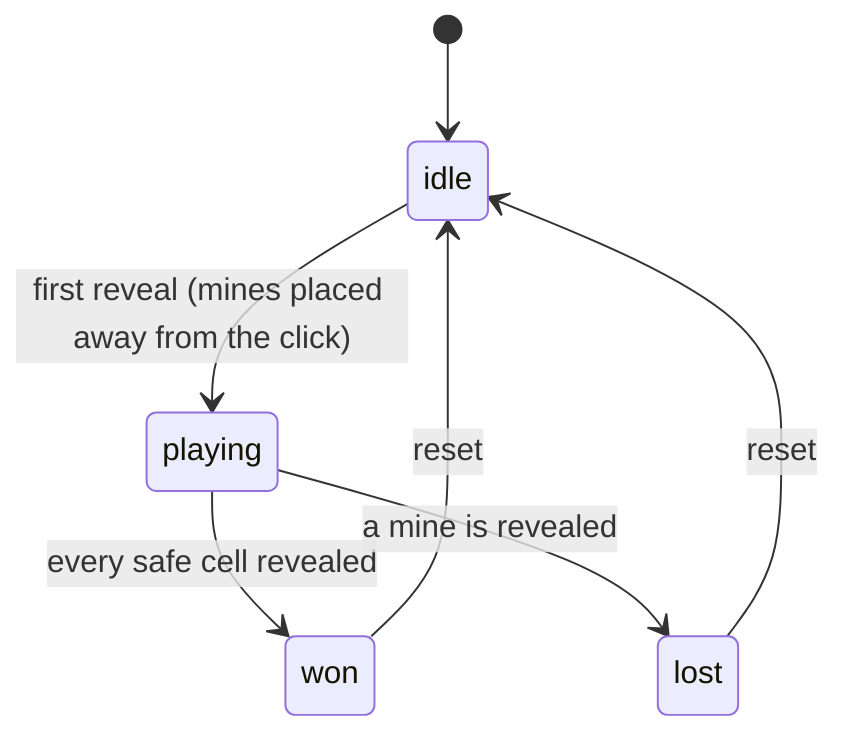

# Games / Logic-Heavy UI

These problems look like games, but they are really matrix state, derived state, and immutable-update exercises. No game-design knowledge is required &mdash; the entire task is one grid, one or two pieces of state, pure functions that compute the next board, and event handlers that feed them.

Every game below follows the same discipline: keep the board and the turn in state, put all the rules in **plain functions outside the component** so they can be unit-tested without React, and derive the winner, the draw, the counts, and the available moves during render. If you can do that for tic-tac-toe, the other five are variations on the same three tricks.

---

## Tic-Tac-Toe (N x N, M to Win)

`Difficulty: Medium` `Probability: Very High`

### What are we building?

The classic 3&times;3 tic-tac-toe, then the generalized board: an `N &times; N` grid where the first player to line up `M` in a row &mdash; horizontally, vertically, or diagonally &mdash; wins. It is one problem with a ladder, not two. The interesting move is that after the 3&times;3 version works, you never scan the whole board again: you only scan outward from the cell that was just played, in four directions.

### Example

```text
 3x3, 3 to win               5x5, 4 to win
 X | O | X                  . . . . .
---+---+---                 . X O . .
 O | X | O      X wins       . . X O .    X has a diagonal
---+---+---                 . . . X .    4 in a row
 X | O | X                  . . . . .
                             winning: (1,1) (2,2) (3,3) (4,4)
```

### What is the interviewer testing?

- A 2D matrix in state updated immutably (no `board[r][c] = ...`)
- Derived value: winner, draw, and `current` player computed from the board, not stored
- Generalizing a special case into a parameterized algorithm
- Local win detection &mdash; scanning four directions from the last move instead of the whole board
- Clean state reset and stable cell keys

### State Design

```ts
type Player = "X" | "O";
type Cell = Player | null;
type Board = Cell[][];                     // size x size

board: Board                               // source of truth
current: Player                            // whose turn it is
lastMove: { r: number; c: number } | null  // needed to scan for a win
```

**Do NOT store:** `winner`, `isDraw`, `moveCount`, or `winningCells`. All four are derived during render. `lastMove` is the one thing the board cannot tell you (the board does not record move order), so it is legitimate state &mdash; and it is exactly what makes the win check O(M) instead of O(N&sup2;).

### Basic Version

First the 3&times;3 version with a hard-coded size, then the generalized rule check that powers every size. Keep the rules pure.

```ts
export type Player = "X" | "O";
export type Cell = Player | null;
export type Board = Cell[][];

export const createBoard = (size: number): Board =>
  Array.from({ length: size }, () => Array<Cell>(size).fill(null));

const DIRECTIONS = [
  [0, 1],   // horizontal
  [1, 0],   // vertical
  [1, 1],   // diagonal down-right
  [1, -1],  // diagonal down-left
] as const;

/**
 * Scan outward from (row, col) in four directions.
 * Returns the winning cells, or null. Only the last move can complete a line,
 * so scanning from it is enough.
 */
export function findWin(
  board: Board,
  row: number,
  col: number,
  m: number,
): [number, number][] | null {
  const player = board[row][col];
  if (!player) return null;

  for (const [dr, dc] of DIRECTIONS) {
    const line: [number, number][] = [[row, col]];

    for (const sign of [1, -1] as const) {
      for (let step = 1; step < m; step++) {
        const r = row + dr * step * sign;
        const c = col + dc * step * sign;
        const cell = board[r]?.[c];
        if (cell !== player) break;
        if (sign === 1) line.push([r, c]);
        else line.unshift([r, c]);
      }
    }

    if (line.length >= m) return line;
  }
  return null;
}
```

```ts
export function TicTacToe({ size = 3, win = 3 }: { size?: number; win?: number }) {
  const [board, setBoard] = useState<Board>(() => createBoard(size));
  const [current, setCurrent] = useState<Player>("X");
  const [lastMove, setLastMove] = useState<{ r: number; c: number } | null>(null);

  // All derived, every render.
  const winningCells = lastMove ? findWin(board, lastMove.r, lastMove.c, win) : null;
  const winner = winningCells && lastMove ? board[lastMove.r][lastMove.c] : null;
  const isFull = board.every((row) => row.every((cell) => cell !== null));
  const isDraw = !winner && isFull;
  const isOver = Boolean(winner) || isDraw;

  const play = (r: number, c: number) => {
    if (isOver || board[r][c] !== null) return;

    setBoard((prev) =>
      prev.map((row, i) =>
        i === r ? row.map((cell, j) => (j === c ? current : cell)) : row,
      ),
    );
    setLastMove({ r, c });
    setCurrent((p) => (p === "X" ? "O" : "X"));
  };

  const reset = () => {
    setBoard(createBoard(size));
    setCurrent("X");
    setLastMove(null);
  };

  const status = winner ? `${winner} wins` : isDraw ? "Draw" : `${current} to move`;

  return (
    <section aria-labelledby="ttt-heading">
      <h3 id="ttt-heading">Tic-Tac-Toe</h3>
      <p aria-live="polite">{status}</p>

      <div
        role="group"
        aria-label="Tic tac toe board"
        style={{ display: "grid", gridTemplateColumns: `repeat(${size}, 48px)` }}
      >
        {board.map((row, r) =>
          row.map((cell, c) => {
            const isWinCell = winningCells?.some(([wr, wc]) => wr === r && wc === c) ?? false;
            return (
              <button
                key={`${r}-${c}`}
                className={isWinCell ? "cell cell--win" : "cell"}
                aria-label={`Row ${r + 1}, column ${c + 1}, ${cell ?? "empty"}`}
                disabled={cell !== null || isOver}
                onClick={() => play(r, c)}
              >
                {cell}
              </button>
            );
          }),
        )}
      </div>

      <button onClick={reset}>New game</button>
    </section>
  );
}
```

### How It Works

- Every move rebuilds the board with `map`. The clicked row is replaced by a new row where only the clicked cell changes; the other rows keep their references. React sees new references for the changed path and re-renders.
- `winner` and `isDraw` are recomputed on every render from `board` plus `lastMove`. There is no second copy to drift.
- `findWin` walks at most `M - 1` cells in each of eight half-directions. That is a constant amount of work per move regardless of board size &mdash; the reason this generalizes cleanly to 10&times;10.
- `isOver` disables every cell after the game ends, so play stops without a separate "locked" flag.
- The cell key is positional and stable (`r` plus `c`): the cell at row 2, column 3 is always the same DOM node, so no state is misattributed.

### Edge Cases

- **Clicking an occupied cell:** guarded by `board[r][c] !== null` and by `disabled`.
- **Clicking after the game ends:** guarded by `isOver`.
- **`win > size`:** cannot happen; validate `win <= size` in the props and fall back.
- **A line longer than `M`:** check `line.length >= m`, not `=== m`; on a 5&times;5 board `M = 4` can be completed inside a run of 5.
- **Diagonal bounds:** `board[r]?.[c] !== player` is safe when `r`/`c` run off the board, because optional chaining yields `undefined`.
- **Reset mid-game:** rebuild the board and clear `lastMove` together, or the stale move scans a fresh board.

### Interview Follow-ups

- **Level 1:** Fixed 3&times;3 with a hard-coded winner check.
- **Level 2:** N&times;N with M-to-win, scanning four directions from the last move (the version above).
- **Level 3:** Highlight the winning line and disable the board.
- **Level 4:** Add move history and time-travel: click a past move to jump back and branch (see **Undo / Redo State History**).
- **Level 5:** Scoreboard and best-of-five across games.
- **Level 6:** A computer opponent &mdash; random first, then minimax with alpha-beta on 3&times;3.
- **Level 7:** Move the board and turn into a single `useReducer` (`PLAY`, `RESET`, `UNDO`), and persist the series to `localStorage`.

### Production Version

For a real multiplayer game the server owns the board: the client sends a move and receives the authoritative state (WebSocket or SSE), and React reconciles. Optimistic local moves plus rollback on rejection is the same pattern as **Optimistic Mutation with Rollback**. Locally, a reducer makes the move log the single source of truth, which is also what enables replay.

### Accessibility

- Every cell is a real `<button>` with an `aria-label` naming its row and column and its contents.
- The status line uses `aria-live="polite"` so the winner is announced without stealing focus.
- For the full grid pattern, add `role="grid"`/`role="gridcell"` with roving `tabindex` so arrow keys move between cells; the Basic Version trades that for simpler, always-tabbable buttons.
- Do not signal the winner with color alone; also mark the cells and announce the text.

### Performance

Trivial for a normal board. The only visible cost is re-rendering every cell each move. For large boards, wrap `Cell` in `React.memo` and pass primitive props so only the clicked cell re-renders; `findWin` is already O(M).

### Testing

```text
✓ createBoard(3) returns a 3x3 matrix of nulls
✓ findWin detects horizontal, vertical, and both diagonals
✓ findWin returns null for a run shorter than M
✓ findWin does not read past the board edges
✓ clicking an occupied cell changes nothing
✓ winner is derived, not stored
✓ reset clears the board, turn, and last move
```

### Common Mistakes

- Storing `winner`/`isDraw` in state and forgetting to update them.
- Mutating the board (`board[r][c] = current`) instead of returning a new matrix.
- Scanning the entire board for a win on every render instead of scanning from the last move.
- Using `line.length === m`, which misses longer runs on big boards.
- `key={index}`, or a key derived from the cell value, which breaks reconciliation.
- Forgetting to guard against playing after the game is over.

### Interview Takeaway

A board game is matrix state plus a pure rule function. Store the board and the turn, record the last move so the win check stays local, and derive everything the UI shows. Get the 3&times;3 version working, then parameterize the size and the run length &mdash; that generalization is the actual interview.

---

## Memory Game

`Difficulty: Medium` `Probability: High`

### What are we building?

A grid of face-down cards in shuffled pairs. The player flips two at a time; a matching pair stays face up, a mismatch flips back after a short delay. It tracks moves, runs a timer, and ends when every pair is matched. The subtle requirement is that while two cards are open, a third flip must be impossible.

### Example

```text
Memory Game                 Moves: 7     Time: 00:21

[ ? ] [ ? ] [ ? ] [ ? ]
[ ? ] [ A ] [ A ] [ ? ]     <- pair matched, stays face up
[ ? ] [ ? ] [ ? ] [ ? ]
[ ? ] [ ? ] [ ? ] [ ? ]

Mismatch: two cards open -> wait 800ms -> both flip back
```

### What is the interviewer testing?

- Derived state: "is a card face up?" is a function of `selected` and `matched`, not a per-card boolean you sync
- Preventing a third flip without adding a redundant `isLocked` boolean
- A timer with a real cleanup, plus a pending timeout that also gets cleaned up
- A pure, testable shuffle and a deck built once &mdash; not regenerated on every render
- Derived win, moves counter, and stopping the clock at the end

### State Design

```ts
type Card = { id: number; pairId: number };

cards: Card[]            // the shuffled deck, built once
selected: number[]        // ids of face-up, unmatched cards (length 0, 1, or 2)
matched: Set<number>      // pairIds that have been matched
moves: number             // completed two-card attempts
started: boolean          // has the first card been flipped
seconds: number           // elapsed time
```

**Do NOT store:** `flipped` per card, `matchedCount`, `isWon`, or `isLocked`. A card is face up when `selected.includes(card.id) || matched.has(card.pairId)`; the win is `matched.size === pairs`; and "locked" is simply `selected.length === 2`. Deriving the lock is the whole point &mdash; there is no window where a stale boolean can let a third flip through.

### Basic Version

Pure deck logic first, then the component. Notice the mismatch timeout is stored in a ref so it can be cleared on unmount.

```ts
type Card = { id: number; pairId: number };

export function shuffle<T>(items: T[]): T[] {
  const out = [...items];
  for (let i = out.length - 1; i > 0; i--) {
    const j = Math.floor(Math.random() * (i + 1));
    [out[i], out[j]] = [out[j], out[i]];
  }
  return out;
}

export function createDeck(pairs: number): Card[] {
  const deck: Card[] = [];
  for (let pairId = 0; pairId < pairs; pairId++) {
    deck.push({ id: pairId * 2, pairId });
    deck.push({ id: pairId * 2 + 1, pairId });
  }
  return shuffle(deck);
}
```

```ts
export function MemoryGame({ pairs = 6, flipDelayMs = 800 }: { pairs?: number; flipDelayMs?: number }) {
  const [cards, setCards] = useState<Card[]>(() => createDeck(pairs));
  const [selected, setSelected] = useState<number[]>([]);
  const [matched, setMatched] = useState<Set<number>>(() => new Set());
  const [moves, setMoves] = useState(0);
  const [started, setStarted] = useState(false);
  const [seconds, setSeconds] = useState(0);
  const timeoutRef = useRef<number | null>(null);

  const isWon = matched.size === pairs;
  const isLocked = selected.length === 2;

  // clock runs while a game is in progress
  useEffect(() => {
    if (!started || isWon) return;
    const id = window.setInterval(() => setSeconds((s) => s + 1), 1000);
    return () => window.clearInterval(id);
  }, [started, isWon]);

  // clear the pending flip-back when the component unmounts
  useEffect(
    () => () => {
      if (timeoutRef.current !== null) window.clearTimeout(timeoutRef.current);
    },
    [],
  );

  const flip = (card: Card) => {
    if (isWon || isLocked) return;                              // blocks the third flip
    if (selected.includes(card.id) || matched.has(card.pairId)) return;
    if (!started) setStarted(true);

    const next = [...selected, card.id];
    setSelected(next);
    if (next.length < 2) return;

    setMoves((m) => m + 1);

    const a = cards.find((c) => c.id === next[0]);
    const b = cards.find((c) => c.id === next[1]);
    if (a && b && a.pairId === b.pairId) {
      setMatched((prev) => new Set(prev).add(a.pairId));
      setSelected([]);                                          // match: clear immediately
    } else {
      timeoutRef.current = window.setTimeout(() => setSelected([]), flipDelayMs);
    }
  };

  const reset = () => {
    if (timeoutRef.current !== null) window.clearTimeout(timeoutRef.current);
    setCards(createDeck(pairs));
    setSelected([]);
    setMatched(new Set());
    setMoves(0);
    setStarted(false);
    setSeconds(0);
  };

  const isFaceUp = (card: Card) =>
    selected.includes(card.id) || matched.has(card.pairId);

  return (
    <section aria-labelledby="memory-heading">
      <h3 id="memory-heading">Memory Game</h3>
      <p>
        Moves: {moves} &middot; Time: {String(seconds).padStart(2, "0")}s
        {isWon && " &mdash; You won!"}
      </p>

      <div
        role="group"
        aria-label="Memory board"
        style={{ display: "grid", gridTemplateColumns: "repeat(4, 56px)", gap: 8 }}
      >
        {cards.map((card) => {
          const faceUp = isFaceUp(card);
          const isMatched = matched.has(card.pairId);
          return (
            <button
              key={card.id}
              onClick={() => flip(card)}
              disabled={isMatched || faceUp}
              aria-label={faceUp ? `Card ${card.pairId + 1}` : "Hidden card"}
              style={{ opacity: isMatched ? 0.6 : 1 }}
            >
              {faceUp ? `[${card.pairId + 1}]` : "?"}
            </button>
          );
        })}
      </div>

      <button onClick={reset}>New game</button>
    </section>
  );
}
```

### How It Works

- `createDeck` runs once via the lazy initializer. If you shuffle during render, the deck reshuffles on every state change &mdash; the classic memory-game bug.
- `isFaceUp` is derived from `selected` plus `matched`, so there is no per-card boolean to keep in sync.
- `isLocked = selected.length === 2` closes the third-flip window with no extra state. When the mismatch timeout fires and clears `selected`, the board unlocks on its own.
- A match clears `selected` immediately; a mismatch schedules a flip-back. Both paths return the board to a state where at most two cards are open.
- The clock is a single interval with a cleanup; the flip-back timeout is held in a ref so unmount can clear it too. Two timers, two cleanups.

### Edge Cases

- **Rapid double-click on the same card:** `selected.includes(card.id)` blocks the duplicate.
- **Clicking a third card while two are open:** blocked by `isLocked`.
- **Clicking a matched card:** `matched.has` blocks it and the button is disabled.
- **Mismatch then unmount before the delay:** the cleanup effect clears the timeout, so no state update lands on an unmounted tree.
- **Reset during the delay:** reset clears the timeout before rebuilding the deck.
- **Odd `pairs`:** the grid has `2 * pairs` cards; pick a layout that fits your grid columns or let CSS wrap.

### Interview Follow-ups

- **Level 1:** A grid where clicking reveals a card and tracks flips.
- **Level 2:** Two-card matching with a flip-back delay and a move counter (the version above).
- **Level 3:** Timer plus derived win; stop the clock on the final match.
- **Level 4:** Difficulty levels (4&times;3, 6&times;4) that resize and reshuffle the deck.
- **Level 5:** Emoji or image faces and a CSS 3D flip animation.
- **Level 6:** Best score persisted to `localStorage`, sorted by moves then time.
- **Level 7:** Full keyboard play &mdash; arrow keys move focus, Enter flips, and matched cards are announced.

### Production Version

A real card game layers animation over the same state. Keep the flip-back delay as a pure "model" timer and let CSS drive the visual rotation from a derived `faceUp` class, so a slow animation can never desynchronize the logic. Persist best scores and difficulty in a small store; nothing here needs a server.

### Accessibility

- Cards are `<button>`s; matched cards are `disabled`, which removes them from the tab order.
- The `aria-label` states whether a card is hidden or revealed (and which pair), so non-visual users get the same information.
- Announce match/mismatch and the win through an `aria-live` region; a visual flip alone communicates nothing to a screen reader.
- Do not rely on the emoji color or image alone to distinguish pairs; the label carries it.

### Performance

The deck is small; `createDeck` and the render are cheap. Two things matter: build the deck once (lazy initializer), and key cards by `card.id` so a shuffle or reset remounts the right cells. Avoid re-shuffling, which also destroys focus.

### Testing

```text
✓ createDeck(pairs) returns 2*pairs cards, two per pairId
✓ createDeck returns a different order across calls (shuffle is real)
✓ flipping two equal cards adds the pairId to matched
✓ flipping two different cards clears selected after the delay
✓ a third flip does nothing while two are open
✓ clicking an already matched card does nothing
✓ isWon becomes true when matched.size === pairs
✓ the timer interval is cleared on unmount and reset
```

### Common Mistakes

- Shuffling during render, so cards reshuffle on every flip.
- Storing an `isFlipped`/`isMatched` boolean per card and syncing it.
- Adding a separate `isLocked` state and letting it go stale.
- Forgetting to clear the flip-back timeout on unmount or reset.
- Keying by array index, so a reset maps state onto the wrong card.
- Starting the timer in an effect that never stops when the game is won.

### Interview Takeaway

The memory game is "is this card face up?" expressed as a pure function of two pieces of state. Derive the lock from `selected.length`, store the deck once, and treat every timer as a subscription you must clean up. Once the third-flip guard is derived rather than stored, you have the pattern for every flip-based UI.

---

## Connect Four

`Difficulty: Hard` `Probability: High`

### What are we building?

A 7-column, 6-row board where two players alternately drop discs. A disc falls to the lowest empty cell in its column, so you cannot choose a row. The first player to line up four &mdash; horizontally, vertically, or on either diagonal &mdash; wins; a full board with no line is a draw. The gravity drop and the local four-in-a-row scan are the two things being tested.

### Example

```text
  1    2    3    4    5    6    7
 [ ]  [ ]  [ ]  [ ]  [ ]  [ ]  [ ]   <- drop buttons above each column
 [ ]  [ ]  [ ]  [ ]  [ ]  [ ]  [ ]
 [ ]  [ ]  [ ]  [ ]  [ ]  [ ]  [ ]
 [ ]  [ ]  [ ]  [R]  [ ]  [ ]  [ ]
 [ ]  [ ]  [Y]  [R]  [ ]  [ ]  [ ]
 [ ]  [Y]  [Y]  [R]  [ ]  [ ]  [R]   Red: column 4, row 4 (bottom)

Column 4 is full -> that drop button is disabled.
```

### What is the interviewer testing?

- Gravity as a pure function: find the lowest empty row in the column
- Immutable matrix updates on a 2D array
- Win detection in four directions, scanning **only** from the last drop
- Draw detection from the board, not a counter
- Handling a full-column click and a play after the game ends

### State Design

```ts
type Player = "Red" | "Yellow";
type Cell = Player | null;
type Board = Cell[][];                     // rows x cols, board[0] is the top row

board: Board
current: Player
lastMove: { r: number; c: number } | null
```

**Do NOT store:** `winner`, `isDraw`, `isFull`, `columnHeights`, or the winning line. `columnHeights` looks tempting, but it is derivable by scanning a column for its lowest empty row, and a separate copy can drift out of sync with the board. Keep the matrix as the single source of truth.

### Basic Version

```ts
export type Player = "Red" | "Yellow";
export type Cell = Player | null;
export type Board = Cell[][];

export const ROWS = 6;
export const COLS = 7;

export const createBoard = (rows = ROWS, cols = COLS): Board =>
  Array.from({ length: rows }, () => Array<Cell>(cols).fill(null));

export function lowestEmptyRow(board: Board, col: number): number {
  for (let r = board.length - 1; r >= 0; r--) {
    if (board[r][col] === null) return r;
  }
  return -1;
}

export function drop(board: Board, col: number, player: Player): { board: Board; row: number } | null {
  const row = lowestEmptyRow(board, col);
  if (row === -1) return null; // column is full

  const next = board.map((r, i) =>
    i === row ? r.map((cell, j) => (j === col ? player : cell)) : r,
  );
  return { board: next, row };
}

const DIRECTIONS = [
  [0, 1],
  [1, 0],
  [1, 1],
  [1, -1],
] as const;

/** Scan from the last drop only. Returns the four-or-more line, or null. */
export function findFour(board: Board, row: number, col: number): [number, number][] | null {
  const player = board[row][col];
  if (!player) return null;

  for (const [dr, dc] of DIRECTIONS) {
    const line: [number, number][] = [[row, col]];

    for (const sign of [1, -1] as const) {
      for (let step = 1; step < 4; step++) {
        const r = row + dr * step * sign;
        const c = col + dc * step * sign;
        if (r < 0 || r >= board.length || c < 0 || c >= board[0].length) break;
        if (board[r][c] !== player) break;
        if (sign === 1) line.push([r, c]);
        else line.unshift([r, c]);
      }
    }

    if (line.length >= 4) return line;
  }
  return null;
}

export const isFull = (board: Board): boolean =>
  board.every((row) => row.every((cell) => cell !== null));
```

```ts
export function ConnectFour() {
  const [board, setBoard] = useState<Board>(() => createBoard());
  const [current, setCurrent] = useState<Player>("Red");
  const [lastMove, setLastMove] = useState<{ r: number; c: number } | null>(null);

  const winningCells = lastMove ? findFour(board, lastMove.r, lastMove.c) : null;
  const winner = winningCells && lastMove ? board[lastMove.r][lastMove.c] : null;
  const draw = !winner && isFull(board);
  const isOver = Boolean(winner) || draw;

  const play = (col: number) => {
    if (isOver) return;
    const result = drop(board, col, current);
    if (!result) return; // full column

    setBoard(result.board);
    setLastMove({ r: result.row, c: col });
    setCurrent((p) => (p === "Red" ? "Yellow" : "Red"));
  };

  const reset = () => {
    setBoard(createBoard());
    setCurrent("Red");
    setLastMove(null);
  };

  const status = winner ? `${winner} wins` : draw ? "Draw" : `${current} to move`;

  return (
    <section aria-labelledby="c4-heading">
      <h3 id="c4-heading">Connect Four</h3>
      <p aria-live="polite">{status}</p>

      <div role="group" aria-label="Drop a disc" style={{ display: "flex", gap: 8 }}>
        {Array.from({ length: COLS }, (_, col) => (
          <button
            key={col}
            onClick={() => play(col)}
            disabled={isOver || lowestEmptyRow(board, col) === -1}
            aria-label={`Drop in column ${col + 1}`}
          >
            &#8595;
          </button>
        ))}
      </div>

      <div
        role="group"
        aria-label="Connect four board"
        style={{ display: "grid", gridTemplateColumns: `repeat(${COLS}, 48px)`, gap: 4 }}
      >
        {board.map((row, r) =>
          row.map((cell, c) => {
            const isWinCell = winningCells?.some(([wr, wc]) => wr === r && wc === c) ?? false;
            return (
              <div
                key={`${r}-${c}`}
                role="img"
                aria-label={`Row ${r + 1}, column ${c + 1}: ${cell ?? "empty"}`}
                className={isWinCell ? "disc disc--win" : "disc"}
                data-cell={cell ?? "empty"}
              />
            );
          }),
        )}
      </div>

      <button onClick={reset}>New game</button>
    </section>
  );
}
```

### How It Works

- `drop` finds the lowest empty row with a bottom-up loop, then rebuilds only that row. The returned `row` saves the caller from searching again and gives `findFour` its starting point.
- `findFour` starts at the dropped disc and walks outward in four lines. Any winning line must include the last disc, so scanning the whole board is wasted work.
- Checking `line.length >= 4` (not `=== 4`) correctly handles a run of five or more created by dropping into the middle.
- Draw is derived: no winner and the board is full. There is no `moves` counter to keep in sync.
- The drop buttons above the board map one-to-one with columns, which is both the natural UI and the keyboard-accessible control; the board itself is presentational.

### Edge Cases

- **Full column:** `drop` returns `null` and the button is disabled.
- **Playing after a win or draw:** guarded by `isOver`.
- **Diagonal bounds:** explicit `r < 0 || r >= rows || c < 0 || c >= cols` checks before indexing.
- **`rows < 4` or `cols < 4`:** four-in-a-row is impossible; validate and warn.
- **Drop into the middle of an existing run:** `>= 4` catches it.
- **Reset while the board is full:** rebuild and clear `lastMove` together.

### Interview Follow-ups

- **Level 1:** Render the grid and drop discs to the bottom of a column.
- **Level 2:** Win detection in all four directions from the last drop (the version above).
- **Level 3:** Draw detection and disabling all input at game end.
- **Level 4:** Highlight the winning line and animate the falling disc.
- **Level 5:** A computer opponent: minimax with alpha-beta, depth-limited to keep it responsive, scored by open threes and center control.
- **Level 6:** Undo/redo by keeping a move log and replaying it (see **Undo / Redo State History**).
- **Level 7:** A `useReducer` with `DROP`, `RESET`, `UNDO`, and persistence of the series.
- **Level 8:** Online play with an authoritative server and optimistic local drops.

### Production Version

Real Connect Four apps keep a move log as the source of truth and derive the board by replaying it; that makes undo, replay, and network sync trivial. For the AI, run minimax in a Web Worker so a deep search never blocks the UI, and cap the search time rather than the depth so the opponent always responds within a budget.

### Accessibility

- The per-column drop buttons are real buttons with labels like "Drop in column 4" &mdash; keyboard and screen-reader users drop discs with no pointer.
- Announce status (`winner`, `draw`, `to move`) in a live region.
- The board uses `role="img"` cells with descriptive labels; for a fully navigable grid, upgrade to `role="grid"` with roving `tabindex`.
- Do not communicate the winner by color alone; mark the winning cells and state the result in text.

### Performance

The board is 42 cells; re-rendering it each move is nothing. `lowestEmptyRow` is O(rows) per column, and the win check is O(16) worst case. If you add an AI, the search &mdash; not React &mdash; is what needs the Worker and a time budget.

### Testing

```text
✓ lowestEmptyRow returns the bottom row first, then climbs
✓ drop returns null for a full column
✓ drop places the disc at the lowest empty row, not the clicked row
✓ findFour detects horizontal, vertical, and both diagonals
✓ findFour returns null for a run of three
✓ a board with an empty top row is not full
✓ winner/draw are derived, not stored
✓ occupied cells are never overwritten
```

### Common Mistakes

- Letting the player choose a row instead of dropping by column.
- Mutating `board[row][col]` instead of returning a new matrix.
- Rescanning the entire board for a win on every render.
- Using `=== 4` and missing longer runs.
- Storing `winner`/`columnHeights` and letting them drift from the board.
- Forgetting the diagonal-bounds guard and reading `board[-1]`.

### Interview Takeaway

Connect Four = gravity (a pure "find the lowest empty row" function) + a local win scan from the last drop. Model the matrix as the only state, rebuild one row immutably per move, and derive the winner and the draw. The gravity helper and the four-direction scan are the two functions an interviewer wants to see.

---

## Grid Lights

`Difficulty: Medium` `Probability: Medium`

### What are we building?

An `N &times; N` grid of cells that starts off. Clicking a cell turns it on and records the order of activation. A **Deactivate** button is enabled only once every cell is on; pressing it turns the cells off one at a time in the **reverse** of the order they were activated, on a fixed interval. The two things being tested are the activation-order stack and cleaning up the interval.

### Example

```text
start              activate 3 cells        press Deactivate
[ ][ ][ ]          [■][■][ ]              [■][■][ ]
[ ][ ][ ]    ->    [ ][■][ ]    ->        [ ][■][ ]   -> ... -> [ ][ ][ ]
[ ][ ][ ]          [ ][ ][ ]              [ ][ ][ ]

Deactivate (disabled until all on)   Deactivate (enabled)
Turns off the most recently activated cell first, every 300ms.
```

### What is the interviewer testing?

- An ordered stack of activations, stored as data rather than as per-cell booleans
- Derived enablement: the button is enabled iff every cell is on
- A single interval that removes the last-activated cell each tick, in reverse order
- Cleanup: the interval must stop on completion, on reset, and on unmount
- Locking input while the deactivation animation runs

### State Design

```ts
activated: number[]        // cell indices, in the order they were turned on
isDeactivating: boolean    // true while the clear-out interval is running
```

**Do NOT store:** `isOn` per cell (a cell is on iff `activated` contains its index), `allOn` (derive `activated.length === total`), or the count of lit cells. One ordered array explains both which cells are on and the order to switch them off.

### Basic Version

The cell logic is trivial, so the interesting parts are the interval lifecycle and the derived guard. Scheduling here is the same problem as **Task Scheduler / Progress Bars**: an interval that must be torn down exactly when the work finishes.

```ts
export function GridLights({ size = 3, delayMs = 300 }: { size?: number; delayMs?: number }) {
  const total = size * size;
  const [activated, setActivated] = useState<number[]>([]);
  const [isDeactivating, setIsDeactivating] = useState(false);

  const allOn = activated.length === total;
  const isOn = (index: number) => activated.includes(index);

  const activate = (index: number) => {
    if (isDeactivating || isOn(index)) return;
    setActivated((prev) => [...prev, index]);
  };

  const deactivate = () => {
    if (!allOn || isDeactivating) return;
    setIsDeactivating(true);
  };

  // One interval for the whole clear-out. Effect cleanup stops it when
  // isDeactivating flips back to false, on reset, and on unmount.
  useEffect(() => {
    if (!isDeactivating) return;
    const id = window.setInterval(() => {
      setActivated((prev) => prev.slice(0, -1)); // drop the most recent
    }, delayMs);
    return () => window.clearInterval(id);
  }, [isDeactivating, delayMs]);

  // Stop once every cell is off.
  useEffect(() => {
    if (isDeactivating && activated.length === 0) setIsDeactivating(false);
  }, [isDeactivating, activated]);

  const reset = () => {
    setIsDeactivating(false);
    setActivated([]);
  };

  return (
    <section aria-labelledby="grid-lights-heading">
      <h3 id="grid-lights-heading">Grid Lights</h3>
      <p aria-live="polite">
        {activated.length} of {total} cells on
      </p>

      <div
        role="group"
        aria-label="Light grid"
        style={{ display: "grid", gridTemplateColumns: `repeat(${size}, 48px)`, gap: 4 }}
      >
        {Array.from({ length: total }, (_, index) => (
          <button
            key={index}
            onClick={() => activate(index)}
            disabled={isDeactivating}
            aria-pressed={isOn(index)}
            aria-label={`Cell ${index + 1}`}
            className={isOn(index) ? "light light--on" : "light"}
          />
        ))}
      </div>

      <button onClick={deactivate} disabled={!allOn || isDeactivating}>
        Deactivate
      </button>
      <button onClick={reset}>Reset</button>
    </section>
  );
}
```

### How It Works

- `activated` doubles as the "which cells are on" list and the "order to turn them off" stack. The reverse order is just removing from the end (`slice(0, -1)`) each tick.
- `allOn` gates the button. Because it is derived from the array length, it turns on exactly when the last cell lights up and off the moment clearing begins.
- One interval drives the whole animation; its cleanup runs whenever `isDeactivating` goes false, which covers completion, reset, and unmount in a single place.
- Input is blocked while `isDeactivating`, so a click cannot interleave with the clear-out and corrupt the order.
- The guard `if (!allOn || isDeactivating) return;` in `deactivate` means the button's `disabled` state is a convenience, not the only protection.

### Edge Cases

- **Clicking an already-on cell:** `isOn` returns and nothing changes; `prev.includes` would be an alternative guard inside the updater.
- **Clicking during deactivation:** blocked by `isDeactivating`.
- **Reset while deactivating:** `setIsDeactivating(false)` triggers the effect cleanup, stopping the interval before the array is cleared.
- **Unmount mid-clear:** the effect's cleanup clears the interval; no update lands on an unmounted tree.
- **`size = 1`:** `allOn` becomes true after a single click; the clear-out removes it and stops.
- **Very small `delayMs`:** still safe, but clamp to a sane minimum for a visible animation.

### Interview Follow-ups

- **Level 1:** Render the grid; clicking toggles a cell on.
- **Level 2:** Activate-only (no toggle) with `Deactivate` enabled only when all cells are on (the version above).
- **Level 3:** Deactivate in reverse activation order on an interval.
- **Level 4:** Clear on reset and on unmount, and lock input during the animation.
- **Level 5:** Extract a reusable `useStepInterval` hook (start/stop/cleanup) and reuse it in the **Task Scheduler / Progress Bars** problem.
- **Level 6:** Add a delay before deactivation begins and a "speed" control.
- **Level 7:** Persist the grid size and support keyboard activation with roving focus.

### Production Version

For long-running sequences prefer a chained timeout or a `requestAnimationFrame` clock over `setInterval`, because intervals drift and pile up if a tick runs long. Either way, the lifecycle rule is the same: the timer is created when the sequence starts and destroyed in one cleanup path. See **Task Scheduler / Progress Bars** for the general queue-plus-interval design.

### Accessibility

- Cells are `<button>`s with `aria-pressed` so their on/off state is programmatic.
- The `Deactivate` button uses `disabled`, which is communicated to assistive tech.
- A live region reports "X of N cells on" so the progress of the clear-out is announced.
- Do not rely on the light color alone; keep the pressed state and the label.

### Performance

`activated.includes(index)` is O(n) per cell, which is fine for interview-sized grids. For a large grid, replace `activated` with a `Set` plus an order array, or a boolean matrix plus a separate order stack. The render itself is cheap; the interval is the only resource to manage.

### Testing

```text
✓ clicking a cell turns it on and records the order
✓ clicking an on cell does nothing
✓ Deactivate is disabled until every cell is on
✓ Deactivate removes cells in reverse activation order
✓ the interval stops when the grid is empty
✓ clicks are ignored while deactivating
✓ reset clears the grid and stops any running interval
```

### Common Mistakes

- Storing an `isOn` boolean per cell and having to keep it consistent with the order.
- Forgetting to stop the interval when the grid empties, leaving it firing forever.
- Enabling `Deactivate` from a stored `allOn` flag instead of deriving it.
- Allowing clicks during the clear-out, which reorders or duplicates activations.
- Starting a new interval on every render or every click instead of once per sequence.

### Interview Takeaway

The grid lights are an ordered stack plus one interval. Store the activation order, derive "all on" and "which cells are lit", and give the interval exactly one lifecycle. Reverse order is free because you remove from the tail. This is the same timer discipline every scheduling question rewards.

---

## Wordle

`Difficulty: Hard` `Probability: Medium`

### What are we building?

A word-guessing game: the player has six tries to guess a five-letter word. After each guess every tile is marked **correct** (right letter, right spot), **present** (right letter, wrong spot), or **absent** (not in the word), and an on-screen keyboard reflects the best state seen for each letter. The whole problem turns on one function: scoring a guess in **two passes** so duplicate letters are handled correctly.

### Example

```text
answer: P A P E R

guess:  A P P L E
tiles:  absent  present  correct  absent  present

keyboard:
 Q W E R T Y U I O P
  A S D F G H J K L
   Enter Z X C V B N M Backspace
   (E, R, A, P tinted by best result)
```

### What is the interviewer testing?

- Two-pass evaluation: exact matches first, then partials against a count of the remaining letters
- Why the naive `answer.includes(letter)` is wrong with duplicates
- Deriving the keyboard map from the guess history, with "best state wins"
- Controlled input with an invalid-word state and a shake/reset
- Game-over derivation and a physical-keyboard listener with cleanup

### State Design

```ts
type Tile = "correct" | "present" | "absent";

guesses: string[]        // submitted, lower-case guesses
current: string          // the row being typed
answer: string           // the secret word (fixed for the round)
invalid: boolean         // last submit was not a real word
status: "playing" | "won" | "lost"
```

**Do NOT store:** the per-tile results, the keyboard letter map, or `remainingGuesses`. Evaluate each submitted guess during render; the keyboard map is a fold over `guesses`; the remaining count is `MAX - guesses.length`. Storing scores is how the board and keyboard drift apart.

### Basic Version

The scoring function is the heart of the problem. Read it twice: pass one takes exact matches and counts the answer's leftover letters; pass two spends those leftovers on the guess's remaining letters.

```ts
export type Tile = "correct" | "present" | "absent";

export const WORD_LEN = 5;
export const MAX_GUESSES = 6;

export function evaluateGuess(guess: string, answer: string): Tile[] {
  const result: Tile[] = Array(guess.length).fill("absent");
  const remaining: Record<string, number> = {};

  // Pass 1: exact matches, and count the answer letters not yet matched.
  for (let i = 0; i < guess.length; i++) {
    if (guess[i] === answer[i]) {
      result[i] = "correct";
    } else {
      remaining[answer[i]] = (remaining[answer[i]] ?? 0) + 1;
    }
  }

  // Pass 2: mark present only while an unmatched copy remains.
  for (let i = 0; i < guess.length; i++) {
    if (result[i] === "correct") continue;
    const ch = guess[i];
    if ((remaining[ch] ?? 0) > 0) {
      result[i] = "present";
      remaining[ch] -= 1;
    }
  }

  return result;
}
```

The naive version &mdash; `guess[i] === answer[i] ? "correct" : answer.includes(guess[i]) ? "present" : "absent"` &mdash; is **wrong**. With `answer = "APPLE"` and `guess = "PIPER"`, the answer has only one unmatched `P`, but `includes` marks every `P` in the guess as present. Pass two's frequency count is what prevents a letter from being "used up" more than once.

```ts
const RANK: Record<Tile, number> = { absent: 0, present: 1, correct: 2 };

/** Fold the guess history into the best-known state for each letter. */
export function keyboardState(guesses: string[], answer: string): Record<string, Tile> {
  const map: Record<string, Tile> = {};
  for (const guess of guesses) {
    const tiles = evaluateGuess(guess, answer);
    guess.split("").forEach((ch, i) => {
      if (!map[ch] || RANK[tiles[i]] > RANK[map[ch]]) map[ch] = tiles[i];
    });
  }
  return map;
}
```

```ts
export function Wordle({ answer, words }: { answer: string; words: Set<string> }) {
  const [guesses, setGuesses] = useState<string[]>([]);
  const [current, setCurrent] = useState("");
  const [invalid, setInvalid] = useState(false);
  const [status, setStatus] = useState<"playing" | "won" | "lost">("playing");

  const keyState = useMemo(() => keyboardState(guesses, answer), [guesses, answer]);

  const submit = useCallback(() => {
    if (status !== "playing" || current.length < WORD_LEN) return;
    if (!words.has(current)) {
      setInvalid(true); // stays until the next keystroke
      return;
    }
    const next = [...guesses, current];
    setGuesses(next);
    setCurrent("");
    setInvalid(false);
    if (current === answer) setStatus("won");
    else if (next.length === MAX_GUESSES) setStatus("lost");
  }, [status, current, words, guesses, answer]);

  const type = useCallback(
    (key: string) => {
      if (status !== "playing") return;
      setInvalid(false);
      if (key === "Enter") return submit();
      if (key === "Backspace") return setCurrent((c) => c.slice(0, -1));
      if (/^[a-z]$/.test(key) && current.length < WORD_LEN) {
        setCurrent((c) => (c.length < WORD_LEN ? c + key : c));
      }
    },
    [status, submit, current.length],
  );

  useEffect(() => {
    const onKeyDown = (e: KeyboardEvent) => {
      if (e.key === "Enter") type("Enter");
      else if (e.key === "Backspace") type("Backspace");
      else if (/^[a-zA-Z]$/.test(e.key)) type(e.key.toLowerCase());
    };
    window.addEventListener("keydown", onKeyDown);
    return () => window.removeEventListener("keydown", onKeyDown);
  }, [type]);

  const rows = Array.from({ length: MAX_GUESSES }, (_, r) => {
    if (r < guesses.length) return { letters: guesses[r].split(""), tiles: evaluateGuess(guesses[r], answer) };
    if (r === guesses.length && status === "playing") {
      return { letters: current.padEnd(WORD_LEN).split(""), tiles: Array<Tile>(WORD_LEN).fill("absent") };
    }
    return { letters: Array<string>(WORD_LEN).fill(""), tiles: Array<Tile>(WORD_LEN).fill("absent") };
  });

  return (
    <section aria-labelledby="wordle-heading">
      <h3 id="wordle-heading">Wordle</h3>

      <div role="group" aria-label="Guess grid">
        {rows.map((row, r) => (
          <div key={r} style={{ display: "flex", gap: 4 }}>
            {row.letters.map((ch, c) => (
              <span key={c} data-tile={row.tiles[c]} className="tile">
                {ch.trim()}
              </span>
            ))}
          </div>
        ))}
      </div>

      {invalid && (
        <p role="alert" className="shake">
          Not in the word list
        </p>
      )}
      <p aria-live="polite">
        {status === "won" ? "You won!" : status === "lost" ? `Out of guesses. It was ${answer}.` : ""}
      </p>

      <div role="group" aria-label="Keyboard">
        {["qwertyuiop", "asdfghjkl", "zxcvbnm"].map((row) => (
          <div key={row}>
            {row.split("").map((ch) => (
              <button key={ch} onClick={() => type(ch)} data-state={keyState[ch] ?? "unused"}>
                {ch}
              </button>
            ))}
          </div>
        ))}
        <button onClick={() => type("Enter")}>Enter</button>
        <button onClick={() => type("Backspace")} aria-label="Backspace">
          Backspace
        </button>
      </div>
    </section>
  );
}
```

### How It Works

- Pass one records exact matches and builds a frequency table of the answer's letters that were **not** matched exactly.
- Pass two walks the guess left to right and consumes one copy from that table when it can. Once a letter's count hits zero, extra copies in the guess are correctly marked absent.
- `keyboardState` folds every guess and keeps the strongest state per letter via the `RANK` map &mdash; a letter already known correct never downgrades to present.
- The board is fully derived: submitted rows are evaluated on render, the active row is `current`, and empty rows are placeholders. No per-tile state exists.
- The physical keyboard listener and the on-screen keys both call `type`, so behavior is identical. The window listener is removed on cleanup, and `type` is stable via `useCallback` so it is not re-attached every keystroke.
- `invalid` is set on a rejected submit and cleared on the next keystroke, giving the shake a natural lifetime.

### Edge Cases

- **Duplicates:** the two-pass, frequency-accurate case above is the whole point.
- **Guess longer/shorter than the answer:** enforce `WORD_LEN` in `type` and reject short submits.
- **Non-letters:** the regex filter drops them; handle an IME or paste case separately.
- **Submit after the game ends:** guarded by `status === "playing"`.
- **Case:** normalize to lower-case on input; compare against a lower-case answer.
- **Repeated letters in the answer:** the frequency table counts each unmatched copy, so two correct `P`s are both matched.
- **Unknown word:** show the alert, keep the letters, do not consume a guess.

### Interview Follow-ups

- **Level 1:** Fixed answer, compare the whole guess with exact-match scoring only.
- **Level 2:** Two-pass scoring with letter-frequency handling (the version above) &mdash; the core of the question.
- **Level 3:** On-screen keyboard whose letter states are derived from the guess history.
- **Level 4:** A word list for validation, an invalid-word state, and a reset on the next keystroke.
- **Level 5:** A daily word seeded by date, plus a shareable result grid.
- **Level 6:** Hard mode that enforces revealed hints before allowing a submit.
- **Level 7:** Win/loss statistics persisted to `localStorage`, then flip animations per tile.

### Production Version

A shipped Wordle fetches a daily word and server-validates guesses, so the answer never ships to the client. The scoring function stays on the client for instant feedback, but the server is authoritative and anti-cheat. Statistics and streaks live in a small store synced to the backend.

### Accessibility

- Use a visually hidden or screen-reader-friendly input for typing, or the on-screen keyboard buttons; both need labels.
- Announce the result of each guess ("correct", "present", "absent") and the win/loss in a live region &mdash; color must never be the only signal.
- The keyboard buttons need accessible names; `Backspace` and `Enter` are labelled.
- Respect `prefers-reduced-motion` for the shake and flip animations.

### Performance

Tiny at this scale. `evaluateGuess` is O(5) and `keyboardState` is O(guesses &times; 5). Memoize the keyboard map with `useMemo` so it is not recomputed on every keystroke, and keep the rendering of finished rows stable.

### Testing

```text
✓ evaluateGuess marks exact matches correct
✓ evaluateGuess marks present letters against unmatched copies only
✓ evaluateGuess is not fooled by duplicate letters (the PIPER case)
✓ evaluateGuess marks a letter absent once its copies are used up
✓ keyboardState keeps the strongest state for a letter across guesses
✓ submit rejects a word not in the list and sets invalid
✓ invalid clears on the next keystroke
✓ status becomes won/lost at the right time
```

### Common Mistakes

- Naive `includes` scoring that lets duplicate letters be marked present too many times.
- Running the partial pass before the exact pass, so a letter claimed by a partial is missing when the exact match needs it.
- Storing per-tile results and then trying to keep them in sync with the answer.
- Letting the keyboard downgrade a correct letter to present.
- Registering the window `keydown` listener without removing it.
- Forgetting to clear `invalid`, so the shake never goes away.

### Interview Takeaway

Wordle is one correct function: score a guess in two passes using a frequency count of the unmatched answer letters, then fold the guesses into a keyboard map. Derive everything from the history, validate through a word list, and cancel the keyboard listener on cleanup. Nail the duplicate-letter case and you have passed the question.

---

## Minesweeper

`Difficulty: Hard` `Probability: Medium`

### What are we building?

A grid hiding a fixed number of mines. Clicking a cell reveals it; if it is a mine you lose, otherwise you see the count of adjacent mines. Revealing an empty cell (adjacent count zero) floods open its neighbors. The first click is always safe, right-click places a flag, and you win by revealing every non-mine cell. The emphasis is on **pure helper functions** and a board whose derived facts are never stored twice.

### Example

```text
      col 1  col 2  col 3  col 4
row 1  🚩      1      .      .
row 2   1      1      .      .
row 3   .      .      .      .

Flags: 1 / 3      Mines: 3      [Reset]
Clicking an empty cell with 0 adjacent mines flood-fills its whole region.
First click never hits a mine.
```

### What is the interviewer testing?

- Pure functions for generation, adjacent counts, flood fill, and win detection
- Immutable board updates (or a single careful clone, then a return)
- Iterative flood fill instead of recursion that can blow the stack
- First-click safety by deferring mine placement until the first reveal
- Derived status: win/loss/counts computed from the board, not stored

### State Design

```ts
type Cell = {
  mine: boolean;
  adjacent: number;   // computed once mines are placed
  revealed: boolean;
  flagged: boolean;
};
type Board = Cell[][];
type Status = "idle" | "playing" | "won" | "lost";

board: Board        // the grid
status: Status      // idle until the first reveal
minesPlaced: boolean // first-click safety: place mines on the first reveal
```

**Do NOT store:** the count of revealed cells, `flagsUsed`, `isWin`, or `isLost`. `flagsUsed` is `board.flat().filter(c => c.flagged).length`; the win is "every non-mine cell revealed"; the loss is "a mine was revealed". The `mine` and `adjacent` fields live on the cell, but nothing derived is duplicated.



### Basic Version

Write the board logic as pure functions first. Each one takes a board and returns a board; none of them touch React.

```ts
type Cell = { mine: boolean; adjacent: number; revealed: boolean; flagged: boolean };
export type MBoard = Cell[][];
export type Status = "idle" | "playing" | "won" | "lost";

const NEIGHBORS: [number, number][] = [
  [-1, -1], [-1, 0], [-1, 1],
  [0, -1], [0, 1],
  [1, -1], [1, 0], [1, 1],
];

export const createBoard = (rows: number, cols: number): MBoard =>
  Array.from({ length: rows }, () =>
    Array.from({ length: cols }, () => ({ mine: false, adjacent: 0, revealed: false, flagged: false })),
  );

const inBounds = (board: MBoard, r: number, c: number) =>
  r >= 0 && r < board.length && c >= 0 && c < board[0].length;

/** Place `count` mines, never on the first click or its neighbors. */
export function placeMines(board: MBoard, count: number, safe: [number, number]): MBoard {
  const spots: [number, number][] = [];
  for (let r = 0; r < board.length; r++) {
    for (let c = 0; c < board[0].length; c++) {
      const isSafe = Math.abs(r - safe[0]) <= 1 && Math.abs(c - safe[1]) <= 1;
      if (!isSafe) spots.push([r, c]);
    }
  }

  // partial Fisher-Yates shuffle, then take the first `count`
  for (let i = spots.length - 1; i > 0; i--) {
    const j = Math.floor(Math.random() * (i + 1));
    [spots[i], spots[j]] = [spots[j], spots[i]];
  }
  const mineSet = new Set(spots.slice(0, count).map(([r, c]) => `${r},${c}`));

  return board.map((row, r) =>
    row.map((cell, c) => ({ ...cell, mine: mineSet.has(`${r},${c}`) })),
  );
}

/** Compute each non-mine cell's adjacent-mine count. */
export function computeAdjacent(board: MBoard): MBoard {
  return board.map((row, r) =>
    row.map((cell, c) => {
      if (cell.mine) return { ...cell, adjacent: 0 };
      const adjacent = NEIGHBORS.filter(
        ([dr, dc]) => inBounds(board, r + dr, c + dc) && board[r + dr][c + dc].mine,
      ).length;
      return { ...cell, adjacent };
    }),
  );
}

/** Iterative flood fill. Clones once, mutates the clone, returns it. */
export function reveal(board: MBoard, row: number, col: number): MBoard {
  const next = board.map((rowCells) => rowCells.map((cell) => ({ ...cell })));
  const stack: [number, number][] = [[row, col]];

  while (stack.length > 0) {
    const [r, c] = stack.pop()!;
    const cell = next[r][c];
    if (cell.revealed || cell.flagged || cell.mine) continue;

    cell.revealed = true;
    if (cell.adjacent !== 0) continue; // stopping condition for the flood

    for (const [dr, dc] of NEIGHBORS) {
      const nr = r + dr;
      const nc = c + dc;
      if (inBounds(next, nr, nc) && !next[nr][nc].revealed) stack.push([nr, nc]);
    }
  }
  return next;
}

export const revealMines = (board: MBoard): MBoard =>
  board.map((row) => row.map((cell) => (cell.mine ? { ...cell, revealed: true } : cell)));

export const isWin = (board: MBoard, mineCount: number): boolean => {
  const cells = board.flat();
  return cells.filter((cell) => cell.revealed).length === cells.length - mineCount;
};
```

```ts
export function Minesweeper({ rows = 9, cols = 9, mineCount = 10 }) {
  const [board, setBoard] = useState<MBoard>(() => createBoard(rows, cols));
  const [status, setStatus] = useState<Status>("idle");
  const [placed, setPlaced] = useState(false);

  const flagsUsed = board.flat().filter((cell) => cell.flagged).length;
  const isOver = status === "won" || status === "lost";

  const revealCell = (r: number, c: number) => {
    if (isOver) return;
    const cell = board[r][c];
    if (cell.flagged || cell.revealed) return;

    // First reveal: place mines away from this cell, then count neighbors.
    let working = board;
    if (!placed) {
      working = computeAdjacent(placeMines(board, mineCount, [r, c]));
      setPlaced(true);
      setStatus("playing");
    }

    if (working[r][c].mine) {
      setBoard(revealMines(working));
      setStatus("lost");
      return;
    }

    const next = reveal(working, r, c);
    setBoard(next);
    if (isWin(next, mineCount)) setStatus("won");
  };

  const toggleFlag = (r: number, c: number) => {
    if (isOver || board[r][c].revealed) return;
    setBoard((prev) =>
      prev.map((row, i) =>
        i === r ? row.map((cell, j) => (j === c ? { ...cell, flagged: !cell.flagged } : cell)) : row,
      ),
    );
  };

  const reset = () => {
    setBoard(createBoard(rows, cols));
    setStatus("idle");
    setPlaced(false);
  };

  const statusText =
    status === "won" ? "You cleared the field!" : status === "lost" ? "Boom." : `Flags: ${flagsUsed} / ${mineCount}`;

  return (
    <section aria-labelledby="mine-heading">
      <h3 id="mine-heading">Minesweeper</h3>
      <p aria-live="polite">{statusText}</p>

      <div
        role="group"
        aria-label="Minefield"
        style={{ display: "grid", gridTemplateColumns: `repeat(${cols}, 32px)`, gap: 2 }}
      >
        {board.map((row, r) =>
          row.map((cell, c) => (
            <button
              key={`${r}-${c}`}
              onClick={() => revealCell(r, c)}
              onContextMenu={(e) => {
                e.preventDefault();
                toggleFlag(r, c);
              }}
              disabled={isOver || cell.revealed}
              aria-label={`Row ${r + 1}, column ${c + 1}: ${
                cell.revealed ? (cell.mine ? "mine" : `${cell.adjacent} adjacent`) : cell.flagged ? "flagged" : "hidden"
              }`}
              className={cell.revealed ? "mine-cell mine-cell--open" : "mine-cell"}
            >
              {cell.revealed ? (cell.mine ? "*" : cell.adjacent || "") : cell.flagged ? "F" : ""}
            </button>
          )),
        )}
      </div>

      <button onClick={reset}>Reset</button>
    </section>
  );
}
```

### How It Works

- Mines are placed lazily on the first reveal, excluding the clicked cell **and its neighbors**, so the first click always opens a region rather than ever being a mine.
- `computeAdjacent` runs once, right after placement, and writes a number onto each safe cell. Nothing recomputes it during play.
- `reveal` clones the board once, then mutates the clone in place. This is the one place a mutation is clearer than a chain of spreads, and it is safe because the clone is local; the function still returns a fresh board.
- The flood uses an explicit stack, so a large empty region cannot overflow the call stack the way recursion can.
- Win is derived: `isWin` counts revealed cells against `total - mineCount`. There is no reveal counter to keep in sync.
- Flags are immutable single-cell updates with `map`, and `flagsUsed` is derived from the board.
- `status` is the only extra state; everything else the UI shows is computed from `board`.

### Edge Cases

- **First click on a would-be mine:** solved by deferring placement.
- **First click in a corner or on an edge:** the safe zone is clipped naturally by the bounds checks.
- **`mineCount` too high:** cap it at `rows * cols - 9` so a safe first click always exists; validate on the prop.
- **Flag then reveal the same cell:** `revealCell` returns early for flagged cells.
- **Right-click during game over:** guarded by `isOver`.
- **Already revealed cell:** `cell.revealed` returns early.
- **Chording:** clicking a revealed number whose flags equal its count can reveal all neighbors &mdash; a follow-up, not the base version.

### Interview Follow-ups

- **Level 1:** Render a grid of hidden cells.
- **Level 2:** Reveal a single cell on click.
- **Level 3:** Adjacent-mine counts.
- **Level 4:** Flood-fill reveal from zero-adjacent cells.
- **Level 5:** Win and loss detection, revealing all mines on loss.
- **Level 6:** Flags via right-click, plus a touch-friendly flag mode.
- **Level 7:** First-click safety by deferring mine placement (the version above).
- **Level 8:** Chording, a timer, and difficulty levels.
- **Level 9:** A `useReducer` for the whole game plus persisted best times.

### Production Version

For a large board, cloning every cell on every reveal is the bottleneck: patch only the changed cells and reuse references for the rest so `React.memo` on the cell component can skip untouched cells. The rules stay pure functions; the reducer just decides when to call them. Persist best times and difficulty, and keep the board generation deterministic per seed if you want shareable puzzles.

### Accessibility

- Cells are `<button>`s with labels that state row, column, and state (mine, count, flagged, hidden).
- Because right-click is not available to everyone, provide an explicit "flag mode" toggle or a long-press/space alternative.
- Announce win/loss and the flag count in a live region.
- For a fully keyboard-navigable field, use `role="grid"` with roving `tabindex` and arrow-key movement.

### Performance

Board operations are O(cells) per action. The win check flattens the board each time &mdash; fine at 9&times;9, and trivially avoidable with a running count at 30&times;16. The real optimization is reference preservation: flood fill currently clones all cells, so memoized cells all re-render. Patch in place and return shared references for unchanged cells to keep large boards smooth.

### Testing

```text
✓ placeMines places exactly mineCount mines
✓ placeMines never places a mine on the safe cell or its neighbors
✓ computeAdjacent counts mines on all eight neighbors, clipped at edges
✓ reveal flood-fills a zero-adjacent region and stops at numbers
✓ reveal never opens a flagged or already-revealed cell
✓ reveal is iterative (deep boards do not overflow the stack)
✓ isWin is true when every safe cell is revealed
✓ first reveal is never a mine
```

### Common Mistakes

- Placing mines at board creation, so the first click can kill you.
- Mutating the board in place instead of cloning or returning a new one.
- Recursive flood fill that overflows on a large empty region.
- Recomputing adjacent counts on every reveal instead of once after placement.
- Storing `revealedCount`/`isWin` and letting them drift from the board.
- Forgetting the diagonal neighbors, or reading out of bounds at the edges.
- Letting `mineCount` exceed the safe capacity with no validation.

### Interview Takeaway

Minesweeper is four pure functions &mdash; place, count, flood, check &mdash; wrapped in one stateful component. Defer mine placement so the first click is safe, keep the board as the single source of truth, and derive the win, the loss, and the flag count. If those functions are pure and separately tested, the React layer is almost trivial.

---

Games are the most direct test of whether you can hold a matrix in state and derive everything else. Tic-tac-toe and Connect Four teach local win scans from the last move; Memory and Grid Lights teach derived locks and timer lifecycles; Wordle and Minesweeper teach two-pass algorithms and pure helper functions. The board is state, the rules are pure functions, and the UI is a projection of both.
