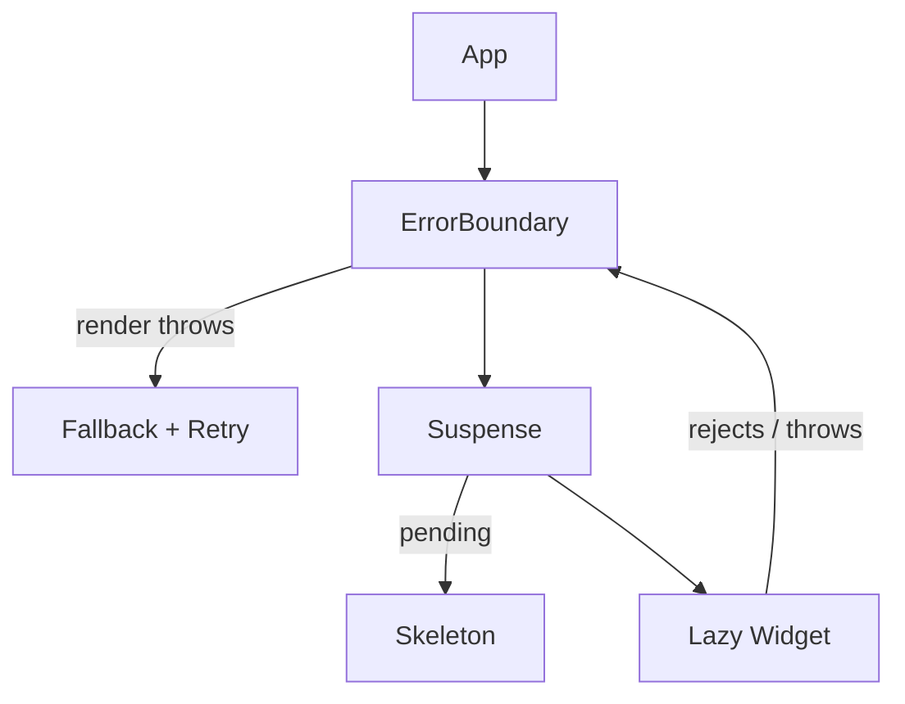

# Senior / Advanced React Machine Coding

A senior loop rarely asks you to build one more widget. It hands you a component that is already broken and watches you diagnose it, or it asks you to assemble the patterns from earlier chapters into a small library with a stable public API. The two skills are the same skill: you have to *see the state machine underneath the UI*.

This section is the capstone. **#90** is the production shape of everything in the API/Async chapter &mdash; one reusable data layer. **#91** is the failure layer that belongs above it. **#92** is the debugging clinic: nine classic bugs, each with broken code, an explanation, and the fix. **#93** maps the "build a reusable X" prompts back to the problem that already teaches X, so you can route any senior prompt to a pattern you have rehearsed.

---

**Part A &mdash; Two full problems.** First the data layer, then the failure layer that wraps it.

## Resilient API-Data Component

`Difficulty: Hard` `Probability: Very High`

### What are we building?

A reusable data component that owns the entire request lifecycle &mdash; `idle`, `loading`, `success`, `empty`, `error` &mdash; plus retry, refetch, abort, stale-response guarding, and duplicate-request protection, exposed through a render-prop (`children`-as-function) API. It is the production shape of **#39 API-Backed List**, **#41 Cancellable Search & Race Conditions**, and **#46 Retryable Requests**, distilled into one generic primitive instead of being re-implemented per screen. On top of the hook we build a small `QueryBoundary` abstraction that supplies sane default UI for loading, empty, and error, so a consumer writes only the success branch. No data library is allowed.

### Example

```text
┌────────────────────────────────────────────────────────┐
│  <QueryBoundary query={{ key: `posts:${userId}`, run }}> │
│                                                          │
│  idle / loading →  Loading…                              │
│  error          →  ⚠ Request failed (500)   [ Try again ]│
│  empty          →  "Nothing here yet."                   │
│  success        →  children(data)                        │
│  refetch        →  old data stays, aria-busy="true"      │
└────────────────────────────────────────────────────────┘
```

The same primitive backs a list, a single object, a chart, and a search panel. The only thing the consumer provides is a `key` and a `run(signal)` function.

### What is the interviewer testing?

- A single discriminated `status`, never contradictory booleans
- A **generic** hook with a typed public API, not a copy-pasted list component
- The effect depending on `key` and an attempt counter &mdash; **not** on the inline `run` function's identity
- Abort on every dependency change and on unmount, *plus* a sequence guard because abort is best-effort
- `empty` derived from the data, not set by a separate branch
- The difference between `retry` (after an error) and `refetch` (keep showing old data while reloading)
- A render-prop API that keeps the hook in charge of the lifecycle and the consumer in charge of presentation
- One logical request per `key`, and a retry button disabled while a run is in flight

### State Design

```ts
type AsyncStatus = "idle" | "loading" | "success" | "empty" | "error";

type AsyncState<T> = {
  status: AsyncStatus;
  data: T | null;          // valid in success / empty
  error: string | null;    // valid in error
  isRefetching: boolean;   // success data on screen while a new run is in flight
};

type AsyncQuery<T> = {
  key: string;                               // request identity; the effect's real dependency
  run: (signal: AbortSignal) => Promise<T>;  // the fetcher
  isEmpty?: (data: T) => boolean;            // default: an array with length 0
  enabled?: boolean;                         // false → stay idle
};

// refs (never rendered):
runRef / emptyRef: latest callbacks        // keep effect deps to [key, enabled, attempt]
abortRef: AbortController | null
seqRef: number                             // stale-response guard
```

**Do NOT store:** `isLoading`, `isError`, `isEmpty`, or `hasFetched` as separate booleans (they are functions of `status`); a shadow copy of the previous data (the reducer keeps it in place for a refetch); the pending `AbortController` or the sequence number in state (they must not trigger renders); or `query.run` in the dependency array &mdash; its identity changes on every render and would loop the effect forever.

### Basic Version

Three pieces: the machine, the hook, and two thin components. The hook is generic over `T`.

```ts
import {
  useCallback,
  useEffect,
  useReducer,
  useRef,
  useState,
  type ReactNode,
} from "react";

export type AsyncStatus = "idle" | "loading" | "success" | "empty" | "error";

export type AsyncQuery<T> = {
  key: string;
  run: (signal: AbortSignal) => Promise<T>;
  isEmpty?: (data: T) => boolean;
  enabled?: boolean;
};

export type AsyncState<T> = {
  status: AsyncStatus;
  data: T | null;
  error: string | null;
  isRefetching: boolean;
};

type Action<T> =
  | { type: "start" }
  | { type: "success"; data: T; empty: boolean }
  | { type: "error"; error: string }
  | { type: "reset" };

const initialState = <T,>(): AsyncState<T> => ({
  status: "idle",
  data: null,
  error: null,
  isRefetching: false,
});

function reducer<T>(state: AsyncState<T>, action: Action<T>): AsyncState<T> {
  switch (action.type) {
    case "start":
      // Refetch keeps the old data on screen; first load shows the loading state.
      return state.data == null
        ? { status: "loading", data: null, error: null, isRefetching: false }
        : { ...state, error: null, isRefetching: true };
    case "success":
      return {
        status: action.empty ? "empty" : "success",
        data: action.data,
        error: null,
        isRefetching: false,
      };
    case "error":
      return { status: "error", data: null, error: action.error, isRefetching: false };
    case "reset":
      return initialState<T>();
  }
}

export function normalizeError(err: unknown): string {
  if (err instanceof DOMException && err.name === "AbortError") return "Request cancelled.";
  if (err instanceof TypeError) return "Network error. Check your connection.";
  if (err instanceof Error && err.message) return err.message;
  return "Something went wrong.";
}

export type UseAsyncResult<T> = AsyncState<T> & {
  isPending: boolean;
  retry: () => void;
  refetch: () => void;
  abort: () => void;
  reset: () => void;
};

export function useAsync<T>(query: AsyncQuery<T>): UseAsyncResult<T> {
  const [state, dispatch] = useReducer(reducer<T>, initialState<T>());
  const [attempt, setAttempt] = useState(0);

  // Latest-ref: read the newest callbacks inside the effect without making
  // their identity a dependency. An inline `run` changes every render.
  const runRef = useRef(query.run);
  const emptyRef = useRef(query.isEmpty);
  runRef.current = query.run;
  emptyRef.current = query.isEmpty;

  const abortRef = useRef<AbortController | null>(null);
  const seqRef = useRef(0);
  const { key, enabled = true } = query;

  useEffect(() => {
    const seq = ++seqRef.current;  // invalidate every earlier run
    abortRef.current?.abort();     // cancel the previous network work

    if (!enabled) {
      dispatch({ type: "reset" });
      return;
    }

    const controller = new AbortController();
    abortRef.current = controller;
    dispatch({ type: "start" });

    (async () => {
      try {
        const data = await runRef.current(controller.signal);
        if (seq !== seqRef.current) return;  // a newer run owns the UI
        const empty = emptyRef.current
          ? emptyRef.current(data)
          : Array.isArray(data) && data.length === 0;
        dispatch({ type: "success", data, empty });
      } catch (err) {
        if (seq !== seqRef.current) return;
        if (err instanceof DOMException && err.name === "AbortError") return;
        dispatch({ type: "error", error: normalizeError(err) });
      }
    })();

    return () => controller.abort();
  }, [key, enabled, attempt]);

  const refetch = useCallback(() => setAttempt((n) => n + 1), []);
  const abort = useCallback(() => {
    seqRef.current++;               // the in-flight run is stale now
    abortRef.current?.abort();
  }, []);
  const reset = useCallback(() => dispatch({ type: "reset" }), []);

  const isPending = state.status === "idle" || state.status === "loading";

  return { ...state, isPending, retry: refetch, refetch, abort, reset };
}
```

The render-prop component gives the consumer the whole result object when they need full control:

```ts
type RenderAsync<T> = (state: UseAsyncResult<T>) => ReactNode;

export function Async<T>({
  query,
  children,
}: {
  query: AsyncQuery<T>;
  children: RenderAsync<T>;
}) {
  return <>{children(useAsync(query))}</>;
}
```

`QueryBoundary` is the opinionated version: defaults for loading, empty, and error, and the consumer only renders success.

```ts
type QueryBoundaryProps<T> = {
  query: AsyncQuery<T>;
  children: (data: T, helpers: { refetch: () => void; isRefetching: boolean }) => ReactNode;
  loadingFallback?: ReactNode;
  emptyFallback?: ReactNode;
  errorFallback?: (error: string, retry: () => void) => ReactNode;
};

export function QueryBoundary<T>({
  query,
  children,
  loadingFallback = <p role="status">Loading…</p>,
  emptyFallback = <p role="status">Nothing here yet.</p>,
  errorFallback,
}: QueryBoundaryProps<T>) {
  const { status, data, error, isRefetching, refetch } = useAsync(query);

  if (status === "idle" || status === "loading") {
    return <>{loadingFallback}</>;
  }

  if (status === "error") {
    return (
      <>
        {errorFallback ? (
          errorFallback(error ?? "Something went wrong.", refetch)
        ) : (
          <div role="alert">
            <p>{error}</p>
            <button type="button" onClick={refetch}>
              Try again
            </button>
          </div>
        )}
      </>
    );
  }

  if (status === "empty" || data == null) {
    return <>{emptyFallback}</>;
  }

  return <>{children(data, { refetch, isRefetching })}</>;
}
```

Usage is then just the success branch:

```ts
type Post = { id: string; title: string; body: string };

export function PostFeed({ userId }: { userId: string }) {
  return (
    <QueryBoundary
      query={{
        key: `posts:${userId}`,
        run: async (signal) => {
          const res = await fetch(`/api/users/${userId}/posts`, { signal });
          if (!res.ok) throw new Error(`Request failed (${res.status})`);
          return (await res.json()) as Post[];
        },
      }}
    >
      {(posts, { refetch, isRefetching }) => (
        <section aria-busy={isRefetching}>
          <button type="button" onClick={refetch} disabled={isRefetching}>
            Refresh
          </button>
          <ul>
            {posts.map((post) => (
              <li key={post.id}>{post.title}</li>
            ))}
          </ul>
        </section>
      )}
    </QueryBoundary>
  );
}
```

Need the escape hatch? Use `Async` directly:

```ts
<Async query={{ key: "cart", run: loadCart }}>
  {({ status, data, error, refetch }) =>
    status === "success" ? (
      <CartView cart={data!} />
    ) : status === "error" ? (
      <button onClick={refetch}>{error} &mdash; retry</button>
    ) : (
      <Spinner />
    )
  }
</Async>
```

### How It Works

- **One status drives the UI.** The reducer produces exactly one of five states, so a spinner and an error can never render together. The reducer is pure and unit-testable without React.
- **The effect depends on `key`, `enabled`, and `attempt` &mdash; never on `run`.** An inline `run` gets a new identity every render; if it were a dependency the effect would loop. The latest-ref pair lets the effect call the newest `run` while keeping the dependency list stable.
- **`seqRef` is the correctness guarantee, abort is the optimization.** A response can already be resolved when a newer `key` arrives, and some environments ignore the signal. Incrementing the sequence *first* invalidates every run that is not the current one, so only the newest result may dispatch.
- **Retry and refetch are the same mechanism: `setAttempt(n => n + 1)`.** The effect re-runs, cleanup aborts the old request, a new sequence is allocated, and there is no duplicate code path to keep in sync.
- **`empty` is derived at success time**, in the same dispatch that sets `data`, so `success` and `empty` can never disagree.
- **A refetch keeps the old data.** The `start` action checks `state.data == null`: first load shows `loading`; a reload sets `isRefetching` and leaves `status` on `success` so the consumer can show a subtle busy affordance instead of blanking the view.
- **Duplicate requests are prevented structurally.** `run` is only ever called from the effect, so one logical request exists per `key`/`attempt`; the UI additionally disables the refetch control while `isRefetching`.

### Edge Cases

- **Unmount mid-request.** Cleanup aborts; the sequence guard drops any late continuation. The request is still cancelled even though React 18 no longer warns.
- **StrictMode double-invokes effects.** The first run is aborted by its own cleanup and made stale by the second sequence. Do not "fix" StrictMode by removing cleanup.
- **`run` rejects before the signal exists** (a synchronous throw): it is caught by the same `try/catch` and dispatched as an error.
- **HTTP 204 / empty body.** `res.json()` throws. Treat `204` as `[]` (or `null`) instead of surfacing a fake error.
- **Non-array data.** The default `isEmpty` only calls `Array.isArray`. Pass `isEmpty` for objects (`(o) => !o || Object.keys(o).length === 0`).
- **Rapid `key` changes.** Many sequences, many aborts; only the latest renders. This is correct, not a leak.
- **`enabled` toggles false mid-flight.** The effect cleanup aborts, and the `reset` branch returns the machine to `idle`.
- **Error message leaking internals.** `normalizeError` is the single place to scrub or map messages; do not render raw server text.
- **A refetch that fails after a success.** `data` is dropped (status becomes `error`). If you want stale-while-error, keep `data` in the `error` branch and render both &mdash; decide explicitly and say why.

### Interview Follow-ups

- **Level 1:** A `useFetch<T>(url)` hook with `data`, `loading`, `error`, and a cleanup comment.
- **Level 2:** Replace the booleans with the five-state machine and add a retry (the **#39** baseline).
- **Level 3:** Make the hook generic and move the API to `{ key, run, isEmpty, enabled }` (the version above).
- **Level 4:** Add the `Async` render-prop and `QueryBoundary` opinionated wrapper.
- **Level 5:** Add `isRefetching` so refetches keep the previous data; add `reset` and `abort` to the public API.
- **Level 6:** Add automatic retry with backoff and jitter for retryable failures, reusing the **#46** policy (`isRetryable`, `retryDelay`, abortable `sleep`).
- **Level 7:** Add a small cache keyed by `key` with a TTL so navigating back is instant, plus in-flight request de-duplication shared across components (**#42**).
- **Level 8:** Add optimistic mutations (`setData`, `mutate`) on the same store so a write can update a read entry and roll back (**#48**).
- **Level 9:** Swap the internal store for `useSyncExternalStore` so every `useAsync` with the same key subscribes to one cache entry.

### Production Version

This *is* the production architecture. A library like TanStack Query or SWR replaces the hook with a cache and adds `staleTime`, `gcTime`, window refocus refetch, and request de-duplication across components. The interview point is that you can name exactly which lines the library removes: the effect, the sequence guard, the reducer, and the cache. React 19's `use(promise)` changes how the pending state is *read* (Suspense instead of a `loading` status) but not the cancellation, sequencing, or error-normalization work underneath.

### Accessibility

- Announce loading with `role="status"` (`aria-live="polite"` is implied), not a bare spinner.
- Announce failures with `role="alert"` so assistive tech interrupts; keep the retry button adjacent and focusable.
- Set `aria-busy="true"` on the region whose data is reloading; keep the old content visible rather than replacing it with a spinner.
- Give the retry control a real name ("Try again", not an icon alone).
- If a successful request replaces the whole view, move focus to the new heading or announce the change in a live region.

### Performance

- **Stable effect dependencies are the whole performance story.** `[key, enabled, attempt]` means an inline `run` cannot cause a fetch storm.
- Abort aggressively: a cancelled request costs one round trip; a stale render costs a confusing bug.
- Render skeletons for first loads and keep previous data for refetches to avoid layout shift.
- Memoize list rows only once the list is large; a hundred rows are cheaper than the memo bookkeeping.
- Share one cache entry per `key` across consumers so two widgets do not issue the same request (**#42**).
- Do not put the response object in a global context; subscribe near the consumer.

### Testing

```text
✓ shows loading on first run, then success with data
✓ derives empty when the fetcher returns []
✓ shows the normalized error message and a working retry
✓ retry re-runs the request and clears the error
✓ changing `key` aborts the old request and never flashes the old data
✓ a slow first response does not overwrite a fast second response
✓ unmount during a pending request aborts and does not update state
✓ a refetch keeps the old data and sets isRefetching
✓ an inline `run` identity does not re-trigger the effect on every render
✓ AbortError is never shown to the user
```

### Common Mistakes

- Putting `query.run` (or the whole `query` object) in the dependency array, causing an infinite fetch loop.
- Relying on `AbortController` alone for ordering; a resolved response can still land after abort.
- Storing `isLoading` / `isError` / `isEmpty` separately and letting them contradict.
- Forgetting to invalidate the in-flight request when `enabled` flips to `false`.
- Re-implementing retry as a second fetch path instead of re-running the effect.
- Clearing `data` on refetch and blanking the screen the user was reading.
- Defaulting `isEmpty` to `data.length` without guarding non-arrays.
- Making the component generic in name only &mdash; the hook must not know what `T` is.

### Interview Takeaway

A resilient data component is a **state machine plus a cancellation policy**, and a reusable one is that machine behind a generic hook and a render-prop. Model one `status`, allocate a sequence number per run, abort on every dependency change and unmount, derive `empty` from the data, and keep the effect's dependencies on `key`/`attempt` rather than function identity. `Async` exposes it; `QueryBoundary` makes it pleasant. Every screen after that is a success branch.

---

## Error Boundary + Retry Experience

`Difficulty: Medium` `Probability: High`

### What are we building?

A class-based error boundary &mdash; still the only way to catch render errors, because there is no hook equivalent &mdash; with `getDerivedStateFromError` to compute the fallback state and `componentDidCatch` for side effects like logging. It supports two reset strategies: changing a `key` to remount, and a `resetKeys` prop for an in-place retry. We wrap async widgets with it, add a logging hook so failures reach the error reporter, and combine it with `Suspense` so pending and failed states are handled by the right mechanism. Finally, we explain the boundary's sharp edges: it catches render errors, not event-handler or async errors.

### Example

```text
┌──────────────────────────────────────────────────┐
│  <ErrorBoundary resetKeys={[widgetId]} onError>   │
│      <Suspense fallback={<Skeleton />}>           │
│          <LazyWidget id={widgetId} />             │
│      </Suspense>                                  │
│  </ErrorBoundary>                                 │
│                                                    │
│  render throw   → fallback + [ Retry ]  (boundary)  │
│  lazy pending   → Skeleton              (Suspense)  │
│  click throws   → NOT caught  → try/catch + state   │
│  fetch rejects  → NOT caught  → setError + rethrows │
└──────────────────────────────────────────────────┘
```

### What is the interviewer testing?

- That you know a boundary **must** be a class, and why (`getDerivedStateFromError` / `componentDidCatch` have no hook form as of React 19)
- The split between `getDerivedStateFromError` (pure, computes state) and `componentDidCatch` (impure, logs)
- A retry that actually recovers: `resetKeys` for in-place, `key` for a full remount
- Where the boundary goes in the tree: above each independently failing widget, not only once at the root
- A logging hook with `componentStack`, routed to the error reporter once, not repeatedly
- `Suspense` for the **pending** path and the boundary for the **rejected/thrown** path, with the boundary outside
- The precise reason event-handler and async errors slip past a boundary, and the pattern that bridges them

### State Design

```ts
type ErrorBoundaryState = {
  error: Error | null;   // the only state: null means "render children"
};

type ErrorBoundaryProps = {
  children: React.ReactNode;
  fallback?: (error: Error, reset: () => void) => React.ReactNode;
  onError?: (error: Error, info: React.ErrorInfo) => void;  // logging hook
  resetKeys?: ReadonlyArray<unknown>;                        // in-place retry trigger
};

// For async/event errors you own (not the boundary):
error: unknown;   // set in a catch, then thrown during render by a tiny component
```

**Do NOT store:** the `componentStack` (pass it straight to the reporter), a `hasError` boolean alongside `error` (they are the same fact), or anything derived from `children`.

### Basic Version

```ts
import React from "react";

type ErrorBoundaryProps = {
  children: React.ReactNode;
  fallback?: (error: Error, reset: () => void) => React.ReactNode;
  onError?: (error: Error, info: React.ErrorInfo) => void;
  resetKeys?: ReadonlyArray<unknown>;
};

type ErrorBoundaryState = { error: Error | null };

export class ErrorBoundary extends React.Component<ErrorBoundaryProps, ErrorBoundaryState> {
  state: ErrorBoundaryState = { error: null };

  // Static and pure: it only computes the next state. No side effects here.
  static getDerivedStateFromError(error: Error): ErrorBoundaryState {
    return { error };
  }

  // Impure: this is where logging/reporting belongs. Runs after the fallback commits.
  componentDidCatch(error: Error, info: React.ErrorInfo) {
    this.props.onError?.(error, info);
  }

  // In-place retry: when any resetKey changes, clear the error and re-render children.
  componentDidUpdate(prev: ErrorBoundaryProps) {
    if (!this.state.error) return;
    const next = this.props.resetKeys ?? [];
    const before = prev.resetKeys ?? [];
    if (next.length !== before.length || next.some((k, i) => !Object.is(k, before[i]))) {
      this.reset();
    }
  }

  reset = () => this.setState({ error: null });

  render() {
    const { error } = this.state;
    if (error) {
      return this.props.fallback ? (
        this.props.fallback(error, this.reset)
      ) : (
        <div role="alert">
          <p>Something went wrong.</p>
          <button type="button" onClick={this.reset}>
            Try again
          </button>
        </div>
      );
    }
    return this.props.children;
  }
}
```

Wrapping an async widget and wiring the logger:

```ts
function WidgetFrame({ id }: { id: string }) {
  return (
    <ErrorBoundary
      resetKeys={[id]}
      onError={(error, info) =>
        reportError(error, { componentStack: info.componentStack, widget: id })
      }
      fallback={(error, reset) => (
        <div role="alert">
          <p>This widget crashed: {error.message}</p>
          <button type="button" onClick={reset}>
            Retry
          </button>
        </div>
      )}
    >
      <AsyncWidget id={id} />
    </ErrorBoundary>
  );
}
```

Full remount instead of in-place reset, when the widget itself must be rebuilt:

```ts
<ErrorBoundary key={routeKey} fallback={renderFallback}>
  <RoutedPage />
</ErrorBoundary>
```

Bridging an event-handler or async error into the boundary: catch it, store it, and throw it during render from a tiny child.

```ts
function ErrorThrower({ error }: { error: unknown }) {
  throw error; // thrown during render → the nearest boundary catches it
}

function SaveButton({ onSave }: { onSave: () => Promise<void> }) {
  const [error, setError] = useState<unknown>(null);
  const [saving, setSaving] = useState(false);

  if (error) return <ErrorThrower error={error} />;

  return (
    <button
      type="button"
      disabled={saving}
      onClick={async () => {
        setSaving(true);
        try {
          await onSave();
        } catch (err) {
          setError(err); // promote an async error into a render error
        } finally {
          setSaving(false);
        }
      }}
    >
      Save
    </button>
  );
}
```

### How It Works



- **React calls `getDerivedStateFromError` during the render phase** to compute the fallback state, so it must be static and pure. React then commits the fallback and calls **`componentDidCatch` during the commit phase**, where side effects are legal. That ordering is the reason the two methods exist.
- **`componentDidCatch` receives `errorInfo.componentStack`**, a string of the component stack. Send it to your reporter; do not render it to users.
- **Retry is a state reset.** `reset()` clears `error`, so `render` returns `children` again. `resetKeys` automates that when the identity of the content changes (a new widget id, a new route). Changing the boundary's `key` is the heavier hammer: React unmounts the whole subtree, clearing not just the boundary but every child's state, and re-runs effects.
- **The boundary goes where failure should be isolated.** One at the root protects the app but blanks the page. One per widget keeps a crash local &mdash; the same isolation principle as **#71 Configurable Dashboard with Async Widgets** and **#90**.
- **`Suspense` handles pending, the boundary handles failure.** A lazy component throws a promise while loading and an error when its chunk fails to load; `use()` a rejected promise re-throws the rejection on the next render. Put the boundary *outside* `Suspense` so both the throw and the rejection propagate to it.
- **The boundary only sees render-phase errors.** `getDerivedStateFromError` and `componentDidCatch` fire for errors thrown while rendering the subtree, in its constructors, and in its lifecycle methods. React also routes an error thrown synchronously while committing effects to the nearest boundary, but a callback that runs *later* &mdash; an event handler, a `setTimeout`, a promise `.then` &mdash; executes outside React's render/commit call stack, so there is no boundary on the stack to catch it. Errors in the boundary's own `render` or in the fallback are not caught by that same boundary either.

### Edge Cases

- **A crash in the fallback itself** is not caught by this boundary; keep fallbacks trivial and avoid data dependencies in them.
- **Errors thrown in an event handler** are not caught: use `try/catch` and either show inline state or promote via `ErrorThrower`.
- **Errors in async callbacks** are not caught: same bridge, or render an explicit error state (**#90**'s machine). Rejections from `fetch` do not reach a boundary.
- **`componentDidCatch` runs once per error**, then React unmounts the subtree; do not set state there (it is too late and redundant).
- **Retry loops:** if the child throws deterministically again, the user sees the fallback repeatedly. Cap retries or surface the error instead of offering infinite retry.
- **`resetKeys` identity:** passing a fresh array literal `resetKeys={[id]}` is fine (we compare element-wise), but passing a new *object* inside it every render is not. Use primitives.
- **SSR/hydration errors** are not caught by client boundaries; handle them at the server or at the framework's error route.
- **StrictMode** may double-invoke the render that throws; `getDerivedStateFromError` is pure, so that is safe.
- **Combining with an async error state:** expected request failures belong in **#90**'s `error` status; the boundary is for the unexpected throw. Do not route a 500 through the boundary and do not route a render crash through `useAsync`.

### Interview Follow-ups

- **Level 1:** A boundary with `getDerivedStateFromError` and a static fallback.
- **Level 2:** Add `componentDidCatch` and an `onError` logging hook (the version above).
- **Level 3:** Add `resetKeys` for in-place retry and document the `key` remount alternative.
- **Level 4:** Support a `fallback` render prop that receives `(error, reset)`.
- **Level 5:** Bridge async and event errors with a `useErrorBoundary`-style `showBoundary(error)` that stores the error and throws it in render.
- **Level 6:** Combine with `Suspense` per widget and lazy-load each chunk.
- **Level 7:** Add a top-level boundary that reports to an error service and shows a route-level `errorElement`, plus per-widget boundaries for isolation.
- **Level 8:** Retry by re-importing a failed lazy chunk (`React.lazy` with a retry wrapper) when the failure was a network chunk error.

### Production Version

`react-error-boundary` packages the exact props used here (`FallbackComponent`, `resetKeys`, `onReset`, `onError`, and the `useErrorBoundary` hook). Frameworks wire boundaries into routing: a route-level boundary with an `errorElement` is the common shape. The manual version is still the interview answer because the ordering of `getDerivedStateFromError` and `componentDidCatch`, and the reason event/async errors escape, are the points being tested &mdash; not the import.

### Accessibility

- Render the fallback with `role="alert"` so screen readers announce the failure immediately.
- Keep the message human and the recovery action clear: what failed, and a "Try again" button. Do not show a raw stack to users.
- Move focus to the fallback (or its heading) on failure so keyboard users are not stranded on a node that has been unmounted.
- Announce a successful retry in a live region; a silent recovery is confusing.
- Never disable the retry control without explaining why (e.g., "Retrying…" with `aria-busy`).

### Performance

- Boundaries are cheap; add them at isolation seams, not around every component.
- A retry that unmounts a subtree also discards its cached data. Prefer `resetKeys` when the child can recover without losing state, and `key` remount only when a clean slate is required.
- Keep the fallback tiny and dependency-free so it cannot itself be a source of layout shift or failure.
- Lazy-load the wrapped widget so a never-opened boundary costs nothing (**#55 Virtualized List** and code-splitting share this goal).

### Testing

```text
✓ a child that throws during render shows the fallback
✓ onError is called once with the error and a componentStack
✓ clicking Retry clears the fallback and re-renders children
✓ a change to a resetKey clears the error automatically
✓ changing the boundary key remounts children and clears state
✓ a throwing event handler is not caught until its error is thrown in render
✓ a rejected fetch does not trigger the boundary
✓ a lazy chunk that fails to load is caught by the enclosing boundary
✓ a crash in a sibling widget leaves the other widget rendered
```

### Common Mistakes

- Assuming `useEffect` or a hook can replace a boundary; it cannot (as of React 19).
- Doing logging in `getDerivedStateFromError` (it must be pure) instead of `componentDidCatch`.
- Retrying by toggling a boolean that does not actually remount the failing child, so it throws again immediately.
- Forgetting that `key` remount loses child state, while `resetKeys` preserves it.
- Rendering a fallback that itself reads a store that just failed.
- Putting the boundary *inside* `Suspense` and expecting it to catch a rejected lazy import that fires above it.
- Expecting the boundary to catch `try { risky() } catch {}`-free event handler or `.then` errors.
- Reporting the same error repeatedly across nested boundaries; report once and let outer boundaries be quiet.

### Interview Takeaway

A boundary is a class with one piece of state (`error`), a pure `getDerivedStateFromError`, and an impure `componentDidCatch` for logging. Retrying is clearing that state (in place) or changing the `key` (remount). It catches render errors only, so event-handler and async errors must be promoted into render errors before it can see them. Put one above each independently failing widget, keep `Suspense` for pending, and route the component stack to your reporter.

---

**Part B &mdash; Debugging clinic.** These nine bugs cover most of what a "find the bug in this component" round will show you. For each: what is broken, why, the fix, and the tell that gives it away in review.

## React Debugging Clinic

`Difficulty: Hard` `Probability: Very High`

### Case 1: Fix a stale closure

#### Broken code

```ts
function Heartbeat() {
  const [count, setCount] = useState(0);

  useEffect(() => {
    const id = setInterval(() => setCount(count + 1), 1000);
    return () => clearInterval(id);
  }, []); // registers once, closes over the first render

  return <span>{count}</span>;
}
```

#### Why it's broken

The effect runs once, so the interval callback closes over the `count` value from the first render (`0`). Every tick calls `setCount(0 + 1)`, so the display jumps to `1` and never moves again. The closure is a snapshot from the render that created it; it does not see later values.

#### The fix

```ts
useEffect(() => {
  const id = setInterval(() => setCount((c) => c + 1), 1000);
  return () => clearInterval(id);
}, []);
```

Use the functional updater so the next value is computed from the latest committed state. If the callback genuinely needs to *read* a value, either add it to the dependency array (accepting that the interval restarts) or mirror it in a ref that is updated on every render.

#### How to spot it in review

A callback that reads a state or prop variable inside an effect with an empty or incomplete dependency array &mdash; especially timers, subscriptions, and long-lived async handlers.

---

### Case 2: Fix a missing `useEffect` cleanup

#### Broken code

```ts
function WindowWidth() {
  const [width, setWidth] = useState(window.innerWidth);

  useEffect(() => {
    const onResize = () => setWidth(window.innerWidth);
    window.addEventListener("resize", onResize);
  }, []);

  return <span>{width}</span>;
}
```

#### Why it's broken

Nothing removes the listener. Under StrictMode the effect mounts, its (empty) cleanup runs, and it mounts again, so two listeners are attached. On unmount the handler leaks and keeps calling `setWidth` on a dead component. The same shape hides intervals that keep ticking, observers that keep observing, and sockets that keep reconnecting.

#### The fix

```ts
useEffect(() => {
  const onResize = () => setWidth(window.innerWidth);
  window.addEventListener("resize", onResize);
  return () => window.removeEventListener("resize", onResize);
}, []);
```

Every effect that starts something must return a function that stops it. The cleanup must undo *exactly* what the setup did, using the same function reference.

#### How to spot it in review

Any `addEventListener`, `setInterval`/`setTimeout`, `.subscribe(`, `.observe(`, `new WebSocket`, or `AbortController` inside an effect with no returned teardown.

---

### Case 3: Fix an infinite `useEffect` loop

#### Broken code

```ts
function Feed({ filter }: { filter: string }) {
  const [params, setParams] = useState({ filter, page: 0 });

  useEffect(() => {
    // "reset pagination when the filter changes"
    setParams({ filter, page: 0 }); // a brand-new object every run
  }, [filter, params]); // params changed → run again → forever

  return <List params={params} />;
}
```

#### Why it's broken

The effect writes `params` and also depends on `params`. Each write creates a new object, so the dependency is a new reference, so the effect runs again immediately &mdash; an unconditional loop that also overwrites any user paging. React compares dependencies with `Object.is`; two equal objects with different identities are different dependencies.

#### The fix

```ts
// Derive instead of syncing:
const params = useMemo(() => ({ filter, page: 0 }), [filter]);

// Or, if paging is interactive, keep one primitive as state and reset it in the event:
const [page, setPage] = useState(0);
const chooseFilter = (next: string) => {
  setFilter(next);
  setPage(0); // reset in the handler, not in an effect
};
```

State that can be computed from props does not need to be state. When a prop change must reset internal state, do it in the event that causes the change, during render with the "previous value" pattern, or by remounting with a `key` &mdash; never by writing state you also depend on.

#### How to spot it in review

An effect that calls a setter and whose dependency array contains the state it sets, or contains an object/array/function literal that is recreated on every render. A profiling trace that shows the same component re-rendering without end.

---

### Case 4: Fix a race condition

#### Broken code

```ts
function SearchResults({ query }: { query: string }) {
  const [results, setResults] = useState<Item[]>([]);

  useEffect(() => {
    fetch(`/api/search?q=${query}`)
      .then((res) => res.json())
      .then(setResults); // last response to arrive wins — not the last request
  }, [query]);

  return <List items={results} />;
}
```

#### Why it's broken

Type `ab`, then `abc`. The `abc` response can resolve before the `ab` response, and the older `ab` result then overwrites the newer one. There is also no cleanup, so a response can land after unmount. `fetch` has no ordering guarantee across separate requests; "latest request started" is not "latest response rendered".

#### The fix

```ts
useEffect(() => {
  const controller = new AbortController();
  let alive = true;

  (async () => {
    try {
      const res = await fetch(`/api/search?q=${encodeURIComponent(query)}`, {
        signal: controller.signal,
      });
      if (!res.ok) throw new Error(`Request failed (${res.status})`);
      const data = await res.json();
      if (alive) setResults(data);
    } catch (err) {
      if (err instanceof DOMException && err.name === "AbortError") return;
      if (alive) setError(normalizeError(err));
    }
  })();

  return () => {
    alive = false;
    controller.abort();
  };
}, [query]);
```

Abort the previous request in cleanup so its network work stops, and guard the state write with a liveness flag (or a sequence number) because abort is best-effort and a resolved response can still reach the continuation. **#41 Cancellable Search & Race Conditions** builds this out; **#90** packages it.

#### How to spot it in review

A fetch in an effect with no `signal`, no cleanup, and a bare `.then(setX)`. Any UI that can change a request parameter faster than the server can answer.

---

### Case 5: Fix unnecessary re-renders

#### Broken code

```ts
const RoomContext = createContext<{ user: User; theme: string } | null>(null);

function RoomProvider({ user, children }: Props) {
  return (
    <RoomContext.Provider value={{ user, theme: "dark" }}>
      <Toolbar onSave={() => save(user)} />
      {children}
    </RoomContext.Provider>
  );
}

const Toolbar = React.memo(function Toolbar({ onSave }: { onSave: () => void }) {
  return <button onClick={onSave}>Save</button>;
});
```

#### Why it's broken

The context `value` is a new object literal on every provider render, so every consumer re-renders even when `user` and `theme` did not change. The inline `onSave={() => save(user)}` is a new function on every render, so `React.memo` sees changed props and cannot skip `Toolbar`. Both defeats happen at the identity level, not the value level.

#### The fix

```ts
function RoomProvider({ user, children }: Props) {
  const value = useMemo(() => ({ user, theme: "dark" as const }), [user]);
  const onSave = useCallback(() => save(user), [user]);

  return (
    <RoomContext.Provider value={value}>
      <Toolbar onSave={onSave} />
      {children}
    </RoomContext.Provider>
  );
}
```

Stabilize the context value and any callback passed to a memoized child. The same fix applies to a `style={{}}`, an array prop, or an object passed into a `React.memo` component: hoist it to a module constant or memoize it. **#59 Memoization & Re-render Optimization** covers when this is worth it.

#### How to spot it in review

`React.memo` children receiving inline object/array/function literals; context providers whose `value` is an object literal; `.map` creating a fresh callback per row. Confirm with the React DevTools Profiler or `why-did-you-render` before adding memoization &mdash; guessing creates complexity without a win.

---

### Case 6: Fix incorrect list keys

#### Broken code

```ts
function Attendees({ people, onRemove }: Props) {
  return (
    <ul>
      {people.map((person, index) => (
        <li key={index}>
          <input defaultValue={person.name} />
          <button onClick={() => onRemove(person.id)}>{person.name}</button>
        </li>
      ))}
    </ul>
  );
}
```

#### Why it's broken

`key={index}` identifies a *position*, not a person. Delete the first row and React reuses the first `<li>` and its DOM nodes for what is now the second person, so any unsaved text in the input stays with the position and appears against the wrong name. Insertion and reordering have the same effect. The button's closure is correct only by accident because it is recreated each render.

#### The fix

```ts
{people.map((person) => (
  <li key={person.id}>
    <input defaultValue={person.name} />
    <button onClick={() => onRemove(person.id)}>{person.name}</button>
  </li>
))}
```

Use a stable, unique identity from the data. Index keys are acceptable only for lists that never reorder, insert, or delete &mdash; which rules out almost every interactive list.

#### How to spot it in review

`key={index}` or `key={i}` anywhere the list can change shape. A bug report like "the wrong row keeps my typed text" is almost always this.

---

### Case 7: Fix a derived-state synchronization bug

#### Broken code

```ts
function Cart({ items }: { items: Item[] }) {
  const [subtotal, setSubtotal] = useState(0);
  const [discounted, setDiscounted] = useState(0);

  useEffect(() => {
    setSubtotal(items.reduce((sum, item) => sum + item.price, 0));
  }, [items]);

  useEffect(() => {
    setDiscounted(subtotal * 0.9);
  }, [subtotal]);

  return <p>Total: {discounted}</p>;
}
```

#### Why it's broken

`subtotal` and `discounted` are pure functions of `items`, but they are stored in state and synchronized with chained effects. That gives wrong intermediate renders (the first paint shows `0`), extra render passes, and two places that can drift when a dependency is missed. Chained effects are especially fragile: the second runs a tick after the first commits.

#### The fix

```ts
function Cart({ items }: { items: Item[] }) {
  const subtotal = items.reduce((sum, item) => sum + item.price, 0);
  const discounted = subtotal * 0.9;

  return <p>Total: {discounted}</p>;
}
```

Compute derived values during render. If the calculation is expensive, wrap it in `useMemo`, but it stays derived &mdash; never a second source of truth. The same rule applies to `visibleTodos`, `filteredRows`, `isValid`, and `remainingCount`.

#### How to spot it in review

An effect whose entire body is a single `setX(...)` computed from props or other state. If the value can be calculated during render, it must not be state. **#1 Counter with Constraints** and **#2 Todo / CRUD Application** both call this out in their state designs.

---

### Case 8: Fix a state mutation bug

#### Broken code

```ts
function TodoList() {
  const [todos, setTodos] = useState<Todo[]>([]);

  const add = (text: string) => {
    todos.push({ id: crypto.randomUUID(), text, done: false }); // mutates
    setTodos(todos); // same reference
  };

  const toggle = (id: string) => {
    const target = todos.find((todo) => todo.id === id);
    if (target) target.done = !target.done; // mutates
    setTodos(todos); // same reference
  };

  return <List todos={todos} />;
}
```

#### Why it's broken

`push` and the property assignment modify the existing array and object in place. `setTodos(todos)` passes the same reference React already holds, so React bails out of the update and the UI does not change. Even when something else forces a render, memoized children compare the same references and skip. Mutation also corrupts any snapshot-based history or undo.

#### The fix

```ts
const add = (text: string) => {
  setTodos((prev) => [...prev, { id: crypto.randomUUID(), text, done: false }]);
};

const toggle = (id: string) => {
  setTodos((prev) =>
    prev.map((todo) => (todo.id === id ? { ...todo, done: !todo.done } : todo)),
  );
};
```

Produce a new array and a new object for the changed item; leave the rest referentially equal. Prefer `toSorted`/`toReversed` over mutating `sort`/`reverse`, or copy first.

#### How to spot it in review

`.push`, `.pop`, `.shift`, `.unshift`, `.splice`, `.sort`, `.reverse`, `delete obj.key`, or `obj.key = value` on a value that is about to be set into state. A working list that "does not update until I click something else" is this bug.

---

### Case 9: Fix a controlled/uncontrolled input switch

#### Broken code

```ts
function NicknameField() {
  const [nickname, setNickname] = useState<string>(); // undefined

  return (
    <input value={nickname} onChange={(event) => setNickname(event.target.value)} />
  );
}
```

#### Why it's broken

While `value` is `undefined`, React treats the input as **uncontrolled** and lets the DOM own the text. The moment the user types, `setNickname` stores a string, so `value` becomes defined and the input becomes **controlled**. React logs: "A component is changing an uncontrolled input to be controlled." A "Clear" button that sets the value back to `undefined` would also flip it back, and the field could render stale.

#### The fix

```ts
const [nickname, setNickname] = useState(""); // always a string

// or, defensively, keep the prop coerced:
<input value={nickname ?? ""} onChange={(event) => setNickname(event.target.value)} />
```

Pick controlled or uncontrolled for the lifetime of the input and never switch. If a value can be missing, coerce it at the boundary (`?? ""`) and decide explicitly what an empty value means.

#### How to spot it in review

`useState<string>()` with no initializer; `value={maybeUndefined}`; a conditional `value={readOnly ? undefined : text}`; or anything that writes `undefined`/`null` into a field that is otherwise controlled. The React console warning names the input directly.

---

**Part C &mdash; Capstone reference.** Route any "build a reusable X" prompt to the pattern that already teaches it.

## Capstone: Assemble the Libraries

Senior prompts are rarely new algorithms; they are the smaller patterns composed into a library with a clean public API. Use this map to answer from a pattern you have already rehearsed instead of inventing one live.

| Senior prompt | Where it is taught |
|---|---|
| Build an accessible Modal library | 3. Reusable Interactive Components &rarr; Accessible Modal / Dialog |
| Build an accessible Combobox | 3. Reusable Interactive Components &rarr; Autocomplete / Combobox |
| Build a reusable Data Table API | 4. Lists, Trees & Complex State &rarr; Data Table |
| Build Toast infrastructure | 3. Reusable Interactive Components &rarr; Toast / Notification System |
| Build a task scheduler with concurrency | 6. Timers, Scheduling & State Machines &rarr; Task Scheduler / Progress Bars |
| Build a virtualized list | 7. Performance & Large Data &rarr; Virtualized List |
| Build a dynamic form renderer | 2. Forms & User Input &rarr; Dynamic Form from Configuration |
| Build a configurable dashboard | 9. Real-World Frontend Features &rarr; Configurable Dashboard with Async Widgets |
| Build a mini file manager | 4. Lists, Trees & Complex State &rarr; File Explorer / Tree View |
| Build a WebSocket-driven chat | 9. Real-World Frontend Features &rarr; Chat / WebSocket |
| Build a reusable Drag-and-Drop Kanban | 4. Lists, Trees & Complex State &rarr; Drag-and-Drop Kanban |

Two meta-patterns cut across the whole table. A **headless hook + thin presentational component** split (see **#64 Headless Component** and **#63 Controlled vs Uncontrolled Reusable Component**) is how you make any of these reusable, and **#62 Compound Components** is how you make a large one composable. If the prompt is really about data, the answer is **#90**; if it is really about failure, the answer is **#91**.

In a 45-minute senior round, run the same sequence every time. Spend the first few minutes **clarifying** inputs, outputs, and the one behavior that matters most, and state your non-goals. Then write the **state design** as a short TypeScript block &mdash; the single source of truth and what is derived &mdash; and say the state machine out loud before writing UI. Build the **smallest correct version** end to end so something works, then layer **accessibility** (roles, labels, keyboard, focus), walk the **edge cases** (empty, error, rapid input, unmount), and close by naming the **tests** you would write. The interviewer is grading the reasoning and the state model far more than the number of components you finish.

---

Across these four problems the through-line is the same: **model the state explicitly, keep one source of truth, derive everything else, and give every effect a cleanup and a cancellation policy.** A resilient data layer, a failure boundary, and a debugging eye are all the same skill applied at different altitudes. That skill is what the rest of this chapter was training.
