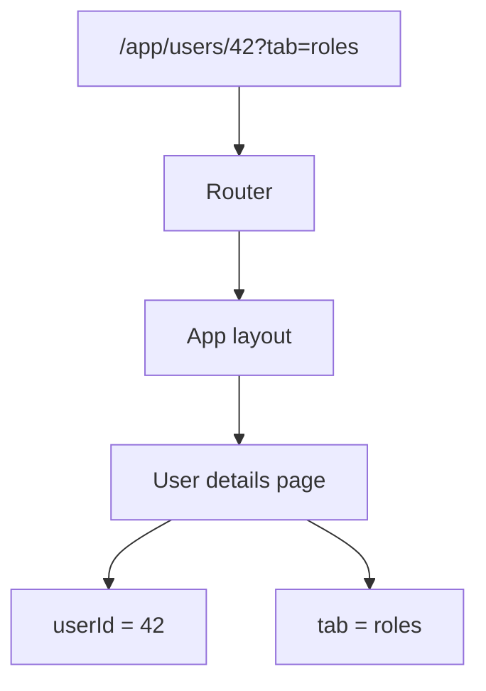

# Routing in React

## Detailed explanation
Routing connects the browser URL to the React screen that should render. In a single-page app, the browser can change URLs without reloading the full document, and the router chooses the matching component tree.

Routing is more than switching pages. Real apps use route params, query params, nested layouts, redirects, not-found pages, protected routes, lazy-loaded route modules, loaders, and URL state for filters and pagination.

## 1. One-line mental model
Routing maps the browser URL to the React UI tree that should appear for that location.

## 2. Problem it solves
Without routing, a single-page app cannot represent screens as shareable URLs, support browser back/forward navigation, protect private pages, or load route-specific code and data cleanly.

## 3. Core idea
- Client-side routing changes UI without a full document reload.
- Route params identify resources, while query params store optional view state like filters and pagination.
- Nested routes let parent layouts render shared shells and child routes render inside outlets.
- Protected routes control UI access, but real authorization must still happen on the server.
- Lazy routes and preloading improve performance by loading code when needed.

## 4. Visual / analogy
Routing is like a building directory. The URL is the room number, the router finds the floor layout, and nested routes decide which room content appears inside the shared building shell.



## 5. Minimal example

```tsx
const router = createBrowserRouter([
  {
    path: "/users/:userId",
    element: <UserDetails />,
  },
]);

function UserDetails() {
  const { userId } = useParams();
  return <h1>User {userId}</h1>;
}
```

## 6. Real-world example

```tsx
const router = createBrowserRouter([
  {
    path: "/app",
    element: <RequireAuth><AppLayout /></RequireAuth>,
    children: [
      { index: true, lazy: () => import("./routes/dashboard") },
      { path: "users/:userId", lazy: () => import("./routes/user-details") },
      { path: "settings", lazy: () => import("./routes/settings") },
    ],
  },
  { path: "/login", element: <LoginPage /> },
]);
```

This combines auth guarding, layout routes, dynamic params, and route-level code splitting.

## 7. Common interview questions
- What is client-side routing?
- Browser routing vs hash routing?
- What are nested routes?
- What is the difference between route params and query params?
- How do protected routes work?
- How do you handle role-based routing?
- What are React Router loaders and actions?
- How do you implement route-based code splitting?
- How do breadcrumbs work in large apps?
- What is route preloading?

## 8. Active recall test
- When should a value be a route param instead of a query param?
- Why does browser routing need server fallback to `index.html`?
- What bug happens if auth state is unknown but the route redirects immediately?
- How would you lazy-load dashboard routes?
- Why is frontend route protection not enough for security?

## 9. Mistakes / traps
- Putting filters in local state instead of URL state when they should be shareable.
- Redirecting before auth loading finishes, causing flicker.
- Treating hidden routes as secure authorization.
- Forgetting not-found and error routes.
- Using hash routing when clean URLs and SEO matter.
- Loading all route code in the initial bundle.

## 10. Compare with related concepts
- **Not server-side routing:** server-side routing returns a document from the server per URL.
- **Not state management:** routing stores navigation state, not arbitrary app state.
- **Not authorization:** routing can hide screens, but the API must enforce permissions.
- **Not code splitting by itself:** routing enables route-based splitting, but dynamic imports perform the split.

## 11. Summary from memory
Explain how a URL becomes a rendered React screen, including nested routes, params, query params, protected routes, and lazy-loaded route modules.

## 12. Spaced revision prompts
- After 1 day: Explain params vs query params.
- After 3 days: Design protected routes for authenticated and admin-only pages.
- After 7 days: Explain route-level code splitting.
- After 14 days: Compare React Router and TanStack Router at a high level.
