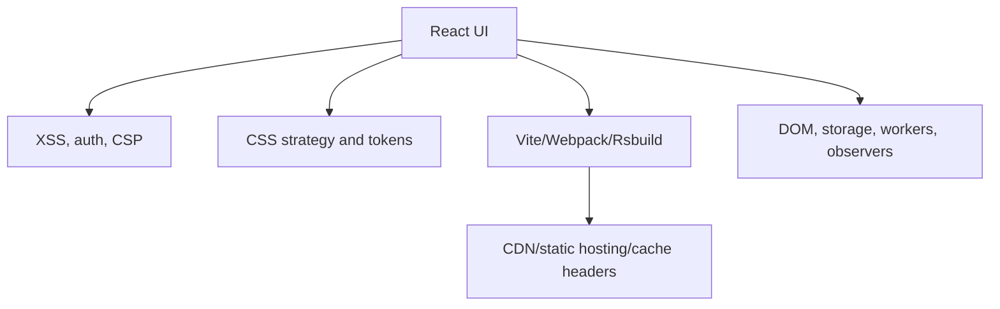

# React Security, Build Tools & Web Platform

## Detailed explanation
Production React work includes more than component code. A frontend engineer must understand how React escapes content, how unsafe HTML can create XSS, how tokens and cookies behave in the browser, how bundlers affect shipped JavaScript, and how browser rendering impacts performance.

These topics often decide whether an app is safe and fast after deployment. Interviewers use them to separate component-only knowledge from production frontend engineering.

## 1. One-line mental model
Production React work is not only components; it also needs secure rendering, efficient builds, accessible styling, and browser-platform awareness.

## 2. Problem it solves
Apps fail in production when they leak secrets, ship oversized bundles, trust frontend permissions, render unsafe HTML, ignore accessibility, or misunderstand browser rendering and storage behavior.

## 3. Core idea
- React escapes text by default, but raw HTML still needs sanitization.
- Auth tokens and secrets must be handled with browser security limits in mind.
- Build tools affect dev speed, bundle size, tree shaking, code splitting, and deployment.
- CSS strategy should support tokens, themes, responsiveness, isolation, and performance.
- Browser APIs like storage, workers, observers, and the event loop shape frontend architecture.

## 4. Visual / analogy
Think of a React app like a shop. Components are the shelves, security is the lock, build tooling is the supply chain, CSS is the floor plan, and browser APIs are the building utilities.



## 5. Minimal example

```tsx
function Comment({ text }: { text: string }) {
  return <p>{text}</p>;
}
```

React escapes `text`, so user input renders as text instead of executable HTML.

## 6. Real-world example

```tsx
function CmsBody({ html }: { html: string }) {
  return (
    <article
      dangerouslySetInnerHTML={{
        __html: DOMPurify.sanitize(html),
      }}
    />
  );
}
```

Raw CMS HTML must be sanitized before rendering. Security should also include CSP, safe cookies, dependency scanning, and server-side authorization.

## 7. Common interview questions
- How does React protect against XSS?
- Why is `dangerouslySetInnerHTML` dangerous?
- Where should JWTs be stored?
- What is CSRF?
- What secrets can safely go in frontend environment variables?
- How does tree shaking work?
- How do you reduce bundle size?
- Vite vs Webpack vs Rsbuild?
- What are service workers?
- What are reflow, repaint, and composite?

## 8. Active recall test
- Why is hiding a button not real authorization?
- Why is `localStorage` risky for long-lived tokens?
- What makes code splitting different from tree shaking?
- Which CSS properties are safest for animation performance?
- When would you use a Web Worker?

## 9. Mistakes / traps
- Putting API secrets in frontend env vars.
- Assuming React makes raw HTML safe.
- Storing long-lived sensitive tokens in `localStorage`.
- Shipping all routes in the first bundle.
- Ignoring bundle analyzer output.
- Using ARIA instead of semantic HTML when native elements would work.
- Animating layout properties and causing repeated reflow.

## 10. Compare with related concepts
- **Security is not only React escaping:** auth, cookies, CSP, dependencies, uploads, and server authorization also matter.
- **Tree shaking is not code splitting:** tree shaking removes unused code; code splitting delays loading needed code.
- **CSS Modules are not design tokens:** modules scope classes; tokens define design values.
- **Service workers are not simple cache headers:** they run programmable caching logic in the browser.

## 11. Summary from memory
Explain how you would review a React app for XSS risk, token storage, bundle size, CSS strategy, and browser performance.

## 12. Spaced revision prompts
- After 1 day: Explain React XSS protection and its limits.
- After 3 days: Compare tree shaking and code splitting.
- After 7 days: Design a safe auth-token storage strategy.
- After 14 days: Explain reflow, repaint, and composite with examples.
