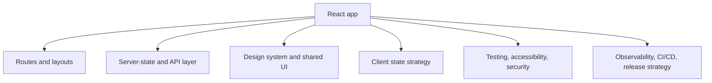

# Senior React Architecture

## Detailed explanation
Senior React architecture is about making decisions that keep an app maintainable as features, teams, users, and data flows grow. It includes state strategy, routing, API boundaries, component ownership, design-system rules, performance budgets, testing, observability, release safety, and migration planning.

At this level, the answer is rarely "use a library." The stronger answer explains trade-offs: what belongs in server state vs client state, when to lift state vs use context, when to split code, how to prevent performance regressions, and how to migrate without breaking production.

## 1. One-line mental model
Senior React architecture is the ability to choose boundaries, state strategy, performance strategy, and ownership rules that keep a large app reliable as teams and features grow.

## 2. Problem it solves
Small React apps can survive with ad hoc folders, local fetches, and loose component APIs. Large apps cannot: they need predictable data flow, clear feature ownership, typed contracts, reusable UI, observability, testing, release safety, and migration paths.

## 3. Core idea
- Start from product flows, team ownership, API contracts, routing, auth, and deployment constraints.
- Keep server state, client state, form state, URL state, and UI state separate.
- Use feature-based folders and shared UI only when components are truly reusable.
- Treat performance, accessibility, security, and testing as architecture concerns, not cleanup tasks.
- Prefer incremental migration and measurable improvements over risky rewrites.

## 4. Visual / analogy
Senior architecture is like city planning. Individual components are buildings, but the city also needs roads, power, zoning, emergency systems, and maintenance rules.



## 5. Minimal example

```txt
src/
  app/
    router.tsx
    providers.tsx
  features/
    billing/
      api/
      components/
      routes/
      types.ts
  shared/
    ui/
    lib/
    config/
```

This structure makes ownership visible: app shell in `app`, domain work in `features`, reusable primitives in `shared`.

## 6. Real-world example

```tsx
function BillingRoute() {
  const invoices = useInvoicesQuery();
  const permissions = usePermissions();

  if (!permissions.canViewBilling) return <Forbidden />;
  if (invoices.isLoading) return <BillingSkeleton />;
  if (invoices.isError) return <RetryState onRetry={invoices.refetch} />;

  return <InvoiceTable rows={invoices.data} />;
}
```

This route keeps authorization display, server state, loading/error states, and feature UI at the route boundary instead of hiding them inside a low-level table.

## 7. Common interview questions
- How would you design a large React app from scratch?
- How would you choose between Redux, Zustand, Context, and TanStack Query?
- How would you optimize a dashboard with 100k rows?
- How would you design a reusable design system?
- How would you handle permissions in a large app?
- How would you migrate a legacy React app?
- How would you reduce bundle size?
- How would you handle frontend errors globally?
- How would you design an API client layer?
- How would you prevent performance regressions?

## 8. Active recall test
- Which state belongs in the URL, server cache, local component, and global client store?
- What should be decided before choosing a state library?
- Why is a micro-frontend architecture not the default answer?
- How would you make a 100k-row table usable?
- Which checks belong in frontend CI for a serious React app?

## 9. Mistakes / traps
- Choosing Redux, Zustand, or Context before separating server state from client state.
- Creating a `components` folder where every component becomes globally shared.
- Treating route guards as real backend authorization.
- Optimizing with memoization before profiling.
- Rewriting a legacy app without tests or migration boundaries.
- Ignoring bundle budgets until performance becomes a production issue.
- Building a design system with visual variants but no accessibility contract.

## 10. Compare with related concepts
- **Not just folder structure:** architecture includes data, ownership, testing, release, and runtime behavior.
- **Not only performance:** fast code that is insecure or unmaintainable is not good architecture.
- **Not maximum abstraction:** architecture should reduce change cost, not hide every detail.
- **Not micro-frontends by default:** micro-frontends solve team/deployment independence at a real complexity cost.

## 11. Summary from memory
Explain how you would design a large dashboard app, including folder structure, routing, server state, permissions, forms, design system, testing, performance budgets, and release strategy.

## 12. Spaced revision prompts
- After 1 day: Explain the difference between server state, client state, URL state, and form state.
- After 3 days: Design the folder structure for a billing module.
- After 7 days: Explain how you would optimize a 100k-row dashboard.
- After 14 days: Give a migration plan from a legacy React app to a typed, feature-based architecture.
