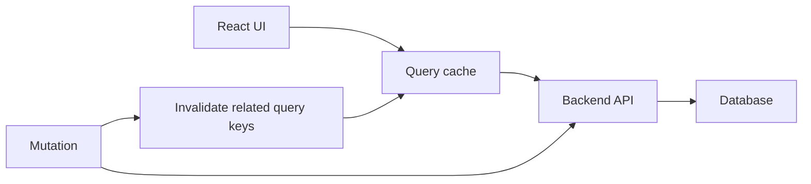

# Server State in React

## Detailed explanation
Server state is data that the frontend displays but does not truly own. The backend or database owns it; React only keeps a temporary client-side copy. Examples include users, products, invoices, permissions, notifications, comments, and analytics.

Because server state can become stale, production apps need caching, refetching, invalidation, request deduplication, retries, cancellation, and optimistic mutation handling. This is why server-state libraries like TanStack Query, SWR, RTK Query, Apollo, or Relay are common in mature React apps.

## 1. One-line mental model
Server state is data owned by the backend that the frontend reads, caches, refreshes, and mutates without pretending it is local UI state.

## 2. Problem it solves
Manual API fetching with component state creates duplicate requests, race conditions, stale data, repeated loading/error boilerplate, and hard cache invalidation after mutations.

## 3. Core idea
- Client state belongs to the UI: modals, tabs, draft inputs, selected filters, and theme.
- Server state belongs to an external system: users, products, permissions, notifications, and orders.
- Server state needs caching, retrying, deduplication, cancellation, invalidation, background refetching, and optimistic updates.
- Libraries like TanStack Query, SWR, RTK Query, Apollo, and Relay solve these server-state problems better than hand-written `useEffect` fetches.
- Query keys must be stable because they define cache identity.

## 4. Visual / analogy
Think of server state like a library book. The book belongs to the library, not your desk. You can borrow a copy, mark when it may be outdated, renew it, and return with updates, but the source of truth remains outside your app.



## 5. Minimal example

```tsx
function Users() {
  const usersQuery = useQuery({
    queryKey: ["users"],
    queryFn: () => fetch("/api/users").then((res) => res.json()),
  });

  if (usersQuery.isLoading) return <p>Loading...</p>;
  if (usersQuery.isError) return <p>Failed to load users.</p>;

  return usersQuery.data.map((user) => <p key={user.id}>{user.name}</p>);
}
```

## 6. Real-world example

```tsx
const queryClient = useQueryClient();

const invoicesQuery = useQuery({
  queryKey: ["invoices", { status, page }],
  queryFn: ({ signal }) => invoiceApi.list({ status, page, signal }),
  staleTime: 30_000,
});

const approveInvoice = useMutation({
  mutationFn: invoiceApi.approve,
  onSuccess: () => {
    queryClient.invalidateQueries({ queryKey: ["invoices"] });
  },
});
```

This keeps list caching, request cancellation, mutation, and invalidation in one predictable flow.

## 7. Common interview questions
- What is the difference between client state and server state?
- Why is fetching inside `useEffect` often not enough for production apps?
- What is a query key?
- What is stale-while-revalidate?
- How does cache invalidation work?
- How do optimistic updates work?
- How do you prevent duplicate API calls?
- When would you choose TanStack Query vs RTK Query?
- How do you handle pagination and infinite queries?
- How do you cancel an outdated request?

## 8. Active recall test
- Explain server state without using the word "API".
- Name three things server-state libraries handle that `useState` does not.
- What happens if a query key includes an unstable object?
- Why should old data often remain visible during background refetch?
- How would you roll back a failed optimistic update?

## 9. Mistakes / traps
- Treating server state as global client state in Redux or Zustand without cache rules.
- Refetching the same data in many sibling components.
- Using unstable query keys that change every render.
- Showing a full-page spinner during every background refresh.
- Forgetting cancellation when search params change quickly.
- Updating the UI optimistically without rollback.

## 10. Compare with related concepts
- **Not local state:** local state is owned by one part of the UI.
- **Not global state:** global state only means many components can access it; it does not automatically solve freshness or invalidation.
- **Not `useEffect`:** effects can fetch data, but they do not provide a cache strategy by themselves.
- **Not database state:** the frontend cache is a temporary copy, not the source of truth.

## 11. Summary from memory
Close the book and explain: what server state is, why manual fetching breaks down, how query keys and invalidation work, and when you would use TanStack Query or RTK Query.

## 12. Spaced revision prompts
- After 1 day: Define client state vs server state with two examples each.
- After 3 days: Explain stale-while-revalidate and optimistic updates.
- After 7 days: Design a query-key strategy for a paginated invoice page.
- After 14 days: Compare TanStack Query, SWR, and RTK Query.
