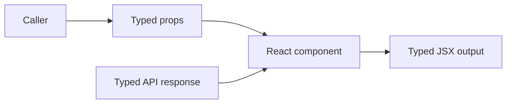

# TypeScript With React

## Detailed explanation
TypeScript adds static contracts to React code. It checks whether components receive valid props, events have the right target types, refs point to the right elements, reducers handle every action, and API data matches expected shapes.

In large React apps, TypeScript prevents many integration mistakes before runtime. It is especially valuable for reusable components, form values, route params, API responses, and discriminated UI states like loading/success/error.

## 1. One-line mental model
TypeScript makes React component contracts explicit so invalid props, events, state, refs, and API data fail before runtime.

## 2. Problem it solves
Large React apps break when component APIs are unclear, event types are guessed, API responses drift, invalid prop combinations are allowed, or `any` hides mistakes until production.

## 3. Core idea
- Type props at component boundaries.
- Use `ReactNode` for renderable children and stricter element types only when needed.
- Type events, refs, reducers, context, and custom hooks from the actual DOM or component contract.
- Use discriminated unions to prevent impossible component states.
- Infer types from schemas and API functions instead of duplicating shapes manually.

## 4. Visual / analogy
TypeScript is a contract at every component door. Props go in, JSX comes out, and the compiler checks whether the caller brought the right keys.



## 5. Minimal example

```tsx
type ButtonProps = {
  variant?: "primary" | "danger";
  onClick: () => void;
  children: React.ReactNode;
};

function Button({ variant = "primary", onClick, children }: ButtonProps) {
  return <button data-variant={variant} onClick={onClick}>{children}</button>;
}
```

## 6. Real-world example

```tsx
type AlertProps =
  | { type: "info"; message: string; action?: never }
  | { type: "error"; message: string; action: { label: string; onClick: () => void } };

function Alert(props: AlertProps) {
  if (props.type === "error") {
    return <button onClick={props.action.onClick}>{props.action.label}</button>;
  }

  return <p>{props.message}</p>;
}
```

The union prevents rendering an error alert without an action.

## 7. Common interview questions
- How do you type props?
- `ReactNode` vs `ReactElement` vs `JSX.Element`?
- How do you type children?
- How do you type events?
- How do you type refs and `forwardRef`?
- How do you type custom hooks?
- How do discriminated unions help component variants?
- How do you type reducers exhaustively?
- How do you avoid `any`?
- How do you type TanStack Query responses?

## 8. Active recall test
- Which type should you use for normal `children`?
- Why is `React.FC` not always necessary?
- How do you type an input change event?
- How does a discriminated union prevent invalid UI states?
- Why is `unknown` safer than `any`?

## 9. Mistakes / traps
- Using `any` for API data and losing type safety at the boundary.
- Using `ReactElement` for children when strings or fragments should be allowed.
- Forgetting `currentTarget` is usually safer than `target` in event handlers.
- Creating duplicate API types instead of inferring from schemas or clients.
- Typing context as nullable everywhere instead of using a safe provider hook.

## 10. Compare with related concepts
- **Not runtime validation:** TypeScript disappears at runtime; use Zod or server validation for external data.
- **Not PropTypes:** PropTypes check runtime props, while TypeScript checks at compile time.
- **Not documentation only:** types are executable contracts enforced by tooling.
- **Not a replacement for tests:** types catch shape errors, not behavior errors.

## 11. Summary from memory
Explain how you would type a reusable input component with props, children, events, refs, and validation error state.

## 12. Spaced revision prompts
- After 1 day: Compare `ReactNode`, `ReactElement`, and `JSX.Element`.
- After 3 days: Type a `forwardRef` input component.
- After 7 days: Write a discriminated union for a loading/success/error component.
- After 14 days: Explain why TypeScript still needs runtime validation for API data.
