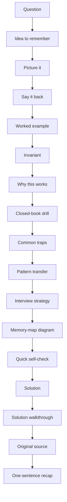
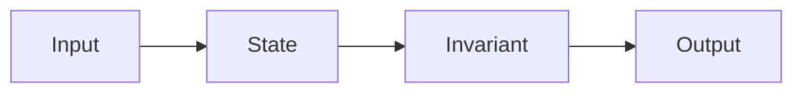

# Study System & Chapter Recipe

This book is designed as a **memory-first study system**. Every chapter should help you recall, explain, and apply a concept under interview pressure — not just reread it.

## The 17-section memory-first chapter recipe

Use this sequence for every canonical chapter.

### 1. Question

Start with the interview prompt or concept cluster itself. Keep the original wording visible so you learn to recognize what is being asked.

### 2. Idea to remember

State the single most important idea in one sentence. If the reader remembers nothing else, this is the hook.

### 3. Picture it

Add a mental model, analogy, sketch, or tiny diagram that makes the concept concrete.

### 4. Say it back

Rephrase the idea in plain language. This is the self-explanation step: if you can teach it simply, you understand it.

### 5. Worked example

Walk through a small, concrete case before you jump into abstraction. Examples make the pattern stick.

### 6. Invariant

Identify the property that stays true while the solution runs. Invariants are the backbone of correctness.

### 7. Why this works

Explain the mechanism or proof idea behind the answer. This is where intuition turns into confidence.

### 8. Closed-book drill

Hide the notes and try to answer from memory. Retrieval practice is stronger than passive rereading.

### 9. Common traps

List the mistakes, edge cases, and interview pitfalls that usually cause confusion.

### 10. Pattern transfer

Show how the same pattern appears in another topic area. This is how you learn to reuse knowledge across domains.

### 11. Interview strategy

Describe how to talk through the answer in an interview: what to mention first, what to skip, and how to steer the discussion.

### 12. Memory-map diagram (Mermaid / Excalidraw)

Add a diagram that compresses the idea into a visual memory map. Hard chapters should always have at least one.



### 13. Quick self-check

Include a few short questions that the reader can answer immediately after reading the chapter.

### 14. Solution

Provide the canonical answer, implementation, or explanation in a compact form.

### 15. Solution walkthrough

Expand the solution step by step so the logic is easy to follow.

### 16. Original source (collapsible appendix)

Preserve the source excerpt or provenance in a collapsed block so the main chapter stays readable.

<details>
<summary>Original source</summary>

- Source file: `02-javascript-theory-concepts.md`
- Relevant lines: `1-291`
- Keep the original wording here when you need a source-backed reminder.

</details>

### 17. One-sentence recap

End with a compressed summary that can be repeated aloud from memory.

## Cross-topic study principles

These principles apply across HTML, CSS, JavaScript, React, and DSA.

- **Retrieval practice over passive re-reading** — answer from memory before checking notes.
- **Self-explanation** — say why something works, not just what it does.
- **Worked examples before abstract rules** — examples anchor the pattern.
- **Invariant-first reasoning** — identify what stays true while the problem runs.
- **Pattern transfer** — once you see a pattern, test it in a different domain.
- **Difficulty-aware walkthrough depth** — harder problems deserve more explanation, more checks, and more visual support.

## DSA-specific transfer principles

Algorithm chapters need a few extra habits.

- **Define the state before writing any code** — know what variables, pointers, or recursion frames represent.
- **State the invariant** — say what your loop or recursion must preserve on every step.
- **Start with brute force, then optimize** — make the solution correct first, then compress it.
- **Always state time and space complexity** — this is part of the answer, not an optional add-on.
- **Compare trade-offs explicitly** — explain why one approach is better for the interview constraints.

## Diagram guidance

Use diagrams intentionally, not decoratively.

- Use **Mermaid code blocks** for flowcharts, state machines, and memory maps.
- Use **Excalidraw-style sketches** for component trees and architecture diagrams.
- Every hard problem chapter should include at least one memory-map diagram.
- Keep diagrams small enough that you can redraw them from memory during interview practice.

### Mermaid examples



### Excalidraw-style sketch guidance

For architecture or component-tree chapters, keep the sketch rough and memorable:

```text
App
├── Header
├── Sidebar
└── Content
    ├── Filters
    └── Results
```

The `mdbook-excalidraw` preprocessor is wired into this book so future chapters can add richer visual assets without changing the navigation structure.
