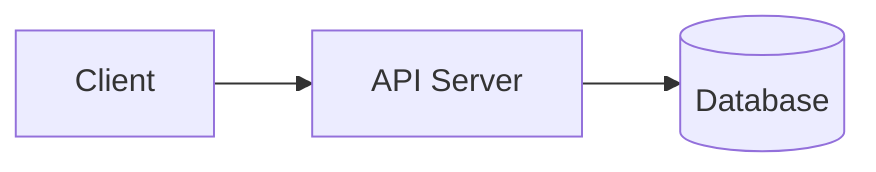
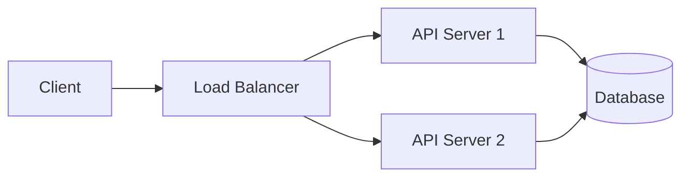
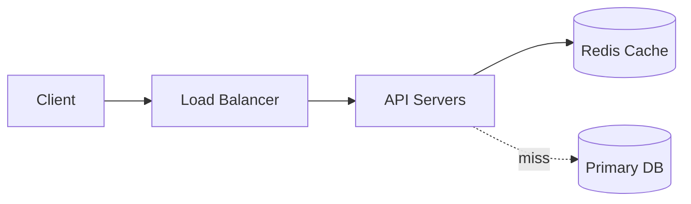
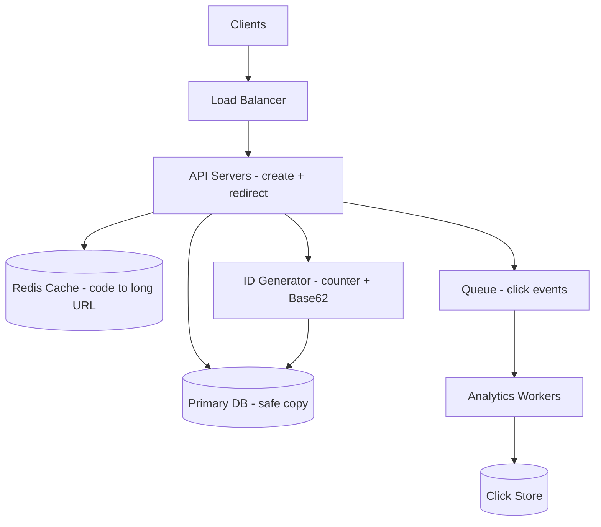

# 1. Design URL Shortener (TinyURL)

[← Easy examples](index.md)

> **Interview question:** "Design TinyURL — users paste a long URL, get a short link. Anyone who opens the short link goes to the long URL."

**Final answer in 10 lines (read this first):**

1. User gives long URL → we give back `sho.rt/aZ89kL2`.
2. Anyone opens `sho.rt/aZ89kL2` → we send them to long URL with `302 redirect`.
3. Reads are 100x more than writes, so we keep redirects super fast with cache.
4. `Redis` is the fast notebook on the desk. `Postgres DB` is the big safe register.
5. Redirect = check Redis first. If not there, check DB, then save in Redis.
6. Create = make a short code with counter + Base62, save in DB first, then in Redis.
7. Click counting goes to a side queue, never blocks redirect.
8. One table is enough: `short_code → long_url`.
9. Shard by `hash(short_code)` when we grow big.
10. Hard part is making codes without clash. We use counter so no clash.

Now let's see how to reach this answer step by step in an interview. We follow the 7-phase framework.

| Phase | Time | What we will answer for TinyURL |
|---|---|---|
| 1. Requirements | 5-7 min | What to build, what to skip |
| 2. Estimation | 3-5 min | 40 creates/sec, 4000 redirects/sec, 3 TB |
| 3. API Design | 3-5 min | `POST /shorten`, `GET /{code}` |
| 4. High-Level Design | 8-10 min | LB → API → Redis → DB + Queue |
| 5. Database Design | 5-7 min | One `urls` table, sample rows |
| 6. Deep Dives | 12-18 min | How to make short codes |
| 7. Wrap-Up | 3-5 min | 30-second closing script |

---

## Phase 1: Requirements — What Are We Building? (5-7 min)

**Meaning in easy words:** Before drawing, agree with interviewer on what to build. TinyURL can become big (login, analytics dashboard, spam check). We cut it small.

**Solved answer for TinyURL — write this on the board:**

**We WILL build (in scope):**

- `Create`: user sends long URL → gets short URL. Example: `https://example.com/very/long/.../sale` → `https://sho.rt/aZ89kL2`.
- `Redirect`: anyone opens `https://sho.rt/aZ89kL2` → goes to long URL.
- `Custom alias` (optional): user can ask for `sho.rt/sale2026` instead of random code. If already taken, say error.
- `Expiry` (optional): link can expire after some years. After that, show 404.
- `Click count` (basic): count how many times a link opened. But count later, not during redirect.

**We will NOT build (out of scope):**

- No login / signup.
- No search.
- No full analytics dashboard (no graphs, no country-wise report in this round).

**How good must it be (non-functional — also agreed):**

| Point | Our answer | Why it matters |
|---|---|---|
| Scale | 100M new links/month, 10B redirects/month | This is our test size |
| Read-write ratio | ~100 reads : 1 write | Redirects are 100x more. So cache is a must |
| Speed | Redirect < 100ms, best < 20ms | User is waiting on click |
| Availability | 99.9% up | Broken link = broken share everywhere |
| Consistency | Eventual is ok, but never lose data | New link can take few seconds to work everywhere, but once saved, it must never disappear |

**Exact lines to speak in interview:**

> "Let me propose scope so we are aligned. Core is create + redirect. Should I also include custom alias, expiry, and basic click count? I will keep login, search, and dashboard out. Is that ok?"
>
> "What scale? I will assume 100M creates and 10B redirects per month, so 100:1 reads. Redirect under 100ms. Eventual consistency is ok?"

Most interviewers say yes. If they say different numbers, just replace numbers and go ahead. Do not spend more than 6 minutes here.

---

## Phase 2: Estimation — Rough Math (3-5 min)

**Meaning in easy words:** Do simple math to prove we need cache. No exact calculator needed. Round numbers. Think of it like: "how many people per second, how much register space?"

**Solved answer for TinyURL:**

We use 2.5M seconds per month (easy number, real is 2.6M).

**1. Traffic — how many requests per second (QPS)?**

```
Writes: 100M new links / month
  = 100M / 2.5M sec = 40 creates/sec
  Peak (festival time, 3x) = 120 creates/sec

Reads: 10B redirects / month
  = 10B / 2.5M sec = 4,000 redirects/sec
  Peak (3x) = 12,000 redirects/sec
```

**What this means:** Only 40 writes/sec (very small). But 4,000 reads/sec (big). So database can easily handle writes, but will die if all reads hit it. Hence Redis cache.

**2. Storage — how much register space?**

One row = short code (7) + long URL (~500) + extra (~50) = ~550 bytes. Round to 500 bytes.

Think like one line in a notebook = 500 letters.

```
Per month: 100M * 500 bytes = 50 GB
Per year: 50 GB * 12 = 600 GB
5 years: ~3 TB
```

**What this means:** 3 TB fits on few DB machines. Storage is NOT the problem. Speed is the problem.

**3. Bandwidth — how much road traffic? (30 seconds only)**

```
Normal: 4,000 * 500 bytes = 2 MB/sec
Peak: 12,000 * 500 bytes = 6 MB/sec
```

Very small. No worry.

**Final table to speak:**

| Thing | Normal | Peak | Decision because of this |
|---|---|---|---|
| Creates | 40/sec | 120/sec | Single primary DB is enough |
| Redirects | 4,000/sec | 12,000/sec | Must add Redis cache |
| Storage 5yr | 3 TB | — | Partition later, not day one |
| Bandwidth | 2 MB/s | 6 MB/s | No problem |

**Exact line to speak:**

> "Because reads are 100x writes, I will make redirect path cache-first. Create path will be simple and safe — write to DB first."

---

## Phase 3: API Design — Doors of the System (3-5 min)

**Meaning in easy words:** API = doors. What doors will users knock? What will they give, what will we return? Only 2 doors needed.

**Solved answer for TinyURL:**

### Door 1: Create short link

User gives long URL, we give short URL.

```
POST /shorten

User sends:
{
  "long_url": "https://example.com/very/long/path/sale",
  "custom_alias": "sale2026",   // optional, user can leave empty
  "expires_at": "2030-01-01T00:00:00Z"  // optional
}

We return:
201 Created
{
  "short_url": "https://sho.rt/aZ89kL2",
  "code": "aZ89kL2"
}

If custom_alias already taken:
409 Conflict { "error": "alias already used" }
```

Rules we tell interviewer:
- Check `long_url` starts with http/https. Block private IPs like `http://192.168.1.1` (hackers use this to attack inside network).
- If same long URL comes twice, we can return same code (saves space). State your choice.
- Limit creates per IP (e.g. 10/min) to stop spam.

### Door 2: Open short link (redirect)

User opens short link, we send them to long URL.

```
GET /aZ89kL2
Example: open https://sho.rt/aZ89kL2 in browser

We return:
302 Found
Location: https://example.com/very/long/path/sale

If code wrong: 404 Not Found
If expired: 404 (or 410 Gone)
```

Why 302 and not 301? Easy rule:
- `301 Permanent` = browser remembers forever, never comes back to us. Fast, but we cannot count clicks.
- `302 Temporary` = browser asks us every time. We can count clicks. Slightly more load, but we want counts. So we use **302**.

No list API, no pagination needed in core scope.

---

## Phase 4: High-Level Design — Full Diagram (8-10 min)

**Meaning in easy words:** Start with tiny drawing (client → server → DB). Then add parts only when there is a problem. Like: one shopkeeper is not enough → add 2 shopkeepers + manager (load balancer). Too many customers asking same question → keep answers in small notebook (cache).

### Step 1: Simplest that works (for 10 users)



- Client asks, server checks DB table `code → long_url`, returns.
- Problem: one server can die. And 4,000 reads/sec will kill DB.

### Step 2: Add load balancer (many shopkeepers)



- Load balancer = traffic police. Sends one user to server 1, next to server 2.
- Servers are stateless (no memory). Any server can handle any user. If one dies, other works.
- Still problem: all 4,000 reads still go to DB.

### Step 3: Add cache (small fast notebook)



- Redirect first looks in Redis: `GET aZ89kL2`. 95% time found in ~2ms.
- Only 5% miss goes to DB, then saves answer in Redis for next time.
- Create always writes DB first (safe), then Redis (fast for next read).
- Now DB only sees ~200 misses/sec + 40 writes/sec = ~240/sec. Very easy.

### Walk with real example

**Example A: Create `https://example.com/.../sale`:**

1. You click "Shorten" → `POST /shorten` goes to Load Balancer.
2. Balancer sends to API Server 2.
3. Server checks URL is valid, makes code `aZ89kL2` (how? see Phase 6).
4. Server saves in DB: `aZ89kL2 → long URL`.
5. Server saves in Redis: `aZ89kL2 → long URL`.
6. Server returns `sho.rt/aZ89kL2` to you.

**Example B: Friend opens `sho.rt/aZ89kL2`:**

1. Friend browser → `GET /aZ89kL2` → Balancer → API Server 1.
2. Server asks Redis: `GET aZ89kL2` → found! → long URL.
3. Server returns `302 + Location: long URL`. Browser jumps.
4. At same time, server drops one chit in side basket: `{code: aZ89kL2, time: now}` to Queue. This does NOT wait. User already got redirect.
5. Later worker picks chits and adds to click count.

If Redis miss: server asks DB, puts answer in Redis, then redirects. Same speed next time.

### Final complete diagram (what to draw at end)



| Part | Why we added it for TinyURL |
|---|---|
| Load Balancer | 2+ servers, if one dies other works, spreads 12k peak |
| Redis Cache | 4,000 reads/sec cannot hit DB, serves in 2ms |
| ID Generator | Make codes without checking DB again and again |
| Queue + Workers | Counting clicks must not slow redirect |
| Read Replicas | Later, if misses grow, primary only does writes |
| CDN | Later, for viral links like `sho.rt/ipl-final` hit worldwide |

**Line to speak:**

> "I added cache because math showed 4,000 reads/sec. I added queue because analytics should never block redirect."

---

## Phase 5: Database Design — Where Data Lives? (5-7 min)

**Meaning in easy words:** Decide which notebook for what. Safe register (SQL) for real data. Small desk notebook (Redis) for fast answers. Side copybook (analytics) for counts.

**Solved answer for TinyURL:**

We use **Postgres (SQL)** as safe register. Why? Only 40 writes/sec, rows are fixed and small, and we need guarantee that `short_code` never repeats. SQL gives unique check free. NoSQL not needed now.

- Postgres = never lose mapping.
- Redis = fast, can delete and rebuild from Postgres.
- Click store = separate, only for counts.

### Main table `urls` with real sample rows

```
urls
├── short_code (PK, varchar 7)  // e.g. "aZ89kL2"
├── long_url (text)
├── created_at
├── expires_at (nullable)
└── user_id (nullable)
```

Sample data (show this to interviewer):

| short_code | long_url | created_at | expires_at |
|---|---|---|---|
| aZ89kL2 | https://example.com/very/long/path/sale | 2026-09-01 | 2030-01-01 |
| sale2026 | https://myshop.com/diwali-offer-2026-big-sale-page | 2026-09-02 | null |
| xY1pQ9z | https://blog.com/how-to-cook-biryani-step-by-step | 2026-09-03 | null |

- `short_code` is primary key → search `WHERE short_code = 'aZ89kL2'` is instant (index).
- We never search by `long_url`, so no index there.
- Custom alias uses same table. Before insert, check `SELECT 1 ... WHERE short_code='sale2026'`. If exists → error. Also block `admin`, `api`, `login` words.
- `click_count`? Do NOT update in this table on every redirect (too many writes). Keep counts in click store, show from there.

### Redis sample data

```
"aZ89kL2" → "https://example.com/very/long/path/sale"  (TTL 24h, LRU)
"sale2026" → "https://myshop.com/diwali-offer-2026..." 
"null:fake123" → NULL (for 60 sec, so attacker hitting fake codes does not kill DB)
```

### How each question is answered (access check)

| User action | How we answer |
|---|---|
| Open `GET /aZ89kL2` | Redis `GET`. If miss → `SELECT long_url FROM urls WHERE short_code=?`, fill Redis |
| Create `POST /shorten` | `INSERT INTO urls (...)`. If code clash → error retry. Then `SET` Redis |
| Check custom alias | `SELECT 1 FROM urls WHERE short_code=?` |
| Show click count | Read from Click Store, not from `urls` table |
| Expired link | Check `expires_at`, if past → 404, delete from Redis |

All are single-key lookups. No full table scan. Good design.

### When we grow big — sharding

- Start: 1 primary + 1-2 replicas. Enough with cache.
- Later when 3 TB grows: split by `hash(short_code) % N`. Example: `aZ89kL2` always goes to shard 3. Since every read/write is by code, no cross-shard pain.
- Viral link problem: `sho.rt/ipl-final` gets 100k/sec, one Redis box gets hot. Fix: keep 30-sec copy in API server memory + put CDN in front.

---

## Phase 6: Deep Dives — Hard Part (12-18 min)

Interviewer will almost always ask: **"How do you make short codes? How to avoid two users getting same code?"**

**Meaning in easy words:** Like giving cloakroom tokens. 100 counters giving tokens at same time must never give same token, and must be fast.

### Option 1: Hash the long URL (like fingerprint)

- How: `hash("https://...sale") = 8f3k...` → take first 7 letters → `aZ89kL2`.
- Good: Same long URL → same short code. Saves space. No central boss needed.
- Bad: Two different URLs can give same 7 letters (birthday clash). Then you must check DB, add salt, hash again in loop. Under load this loop hits DB and becomes slow.
- Example clash: URL-A → `aZ89kL2`, URL-B also → `aZ89kL2`. Second one must retry.

### Option 2: Counter + Base62 (like serial numbers) — best for interview

- How: Keep counter `1,2,3...1000000`. Convert number to short string using 62 letters `a-zA-Z0-9`. Example: `11157 → 2TX`, `1000000 → 4c92`.
- Good: Never clashes (numbers never repeat). Very simple.
- Bad: Codes are guessable: `aaa1, aaa2, aaa3` → anyone can scrape all links. Needs central counter (can become slow if not designed with ranges).
- Math to say: `62^7 = 3.5 trillion` codes. At 100M/month, lasts ~2900 years. Never finishes.

### Option 3: Ready-made random tokens (KGS) — best for real large scale

- How: One background worker makes millions of random codes in free time and keeps in box `free_keys`. Each API server takes 5000 codes at start and keeps in memory. On create, just pick one from memory. No DB check.
- Good: Super fast, no clash, codes are random (not guessable).
- Bad: If server crashes, its 5000 unused codes are lost. But with 3.5 trillion codes, losing 5000 is nothing.

| Way | Clash? | Guessable? | DB check on create? | Use when |
|---|---|---|---|---|
| Hash | Yes, retry needed | No | Yes (loop) | Small, want dedup |
| Counter + Base62 | No | Yes | Counter call | Interview answer, simple |
| Ready box (KGS) | No | No | No | Real big scale |

**Final answer to speak:**

> "For this interview I will use counter + Base62 because it is simple and never clashes. At real scale I will move to ready-box random keys so create never waits for DB. I will not use hash-truncate because collision loop will hurt under load."

**Other 1-minute answers to keep ready:**

- **301 vs 302:** Use 302 so every click comes to us and we can count. 301 hides clicks (browser remembers).
- **Fake code attack:** Attacker hits 1M fake codes → all miss Redis → DB dies. Fix: Bloom filter (gatekeeper list of real codes) + save `null` in Redis for 60 sec.
- **Viral expiry:** 10k people ask same expired key at same second → all hit DB. Fix: only first one goes to DB, others wait (single-flight).
- **Click counting:** Never do `UPDATE urls SET clicks=clicks+1` on redirect. Send to queue, batch write later.

---

## Phase 7: Wrap-Up — Closing (3-5 min)

Do not draw new things. Show you know limits.

**30-second script to speak (memorize this):**

> "To summarize: browser → load balancer → stateless API. Redirect checks Redis first (95% hit, ~2ms), else DB. Create makes code with counter+Base62, saves in Postgres first then Redis. Clicks go to queue so redirect stays under 100ms. Reads are 100x writes, so cache does main work."

**What can break (bottlenecks):**

1. Viral link `sho.rt/ipl-final` → one Redis key becomes hot → Redis CPU 100%. Fix: 30-sec local cache + CDN. Watch: cache hit %, Redis CPU.
2. Redis down → all 4,000 reads hit DB → DB CPU high. Fix: read replicas + circuit breaker. But 95% reads still ok from CDN.
3. Queue slow → clicks pile up. Fix: drop to disk, never block redirect. Watch: queue lag, DB IOPS.

**What next if more time:**

- Rate limit create per IP + CAPTCHA.
- Check malware URLs async (Google Safe Browsing).
- Multi-region DB for world-wide speed.
- Keep dashboard/search out unless asked.

**If interviewer asks:**

- "10x traffic?" → More Redis nodes, more replicas, CDN, pre-warm hot keys.
- "Region down?" → DB in 2 zones, traffic shift via DNS.
- "From old monolith?" → Keep old codes read-only, write new codes to new system, copy slowly.

---

## Key Takeaways

1. Reads 100x writes → cache-first redirect.
2. 40 writes/sec → single DB enough. 4,000 reads/sec → Redis must.
3. 2 APIs only: `POST /shorten`, `GET /{code}` with 302.
4. One table `short_code → long_url` + Redis copy. Shard by code hash.
5. Codes via counter+Base62 (simple). Big scale via ready-box.
6. Clicks always async via queue.
7. Close with bottlenecks: hot key, Redis down, queue lag.

**Memory hook:** Short code is a cloakroom token — make token once safely, keep fast notebook for lookups, count visits in side basket later.

**Deep link:** [Design a URL shortener](../../backend-designs/design-a-url-shortener.md)

## Interactive Visualizer

Learn the design in three moves:

1. **Follow a request** — trace a *Redirect* (cache-first read), a *Create* (write), or a *Click event* (async analytics). Each step lights up the real path on the diagram.
2. **Add traffic** — raise the user count until a component turns red and errors appear.
3. **Press Scale up** — one button fixes the current bottleneck and explains what was failing, what changed, and what improved.

<div
  id="url-shortener-visualizer"
  class="usv url-shortener-visualizer"
></div>
