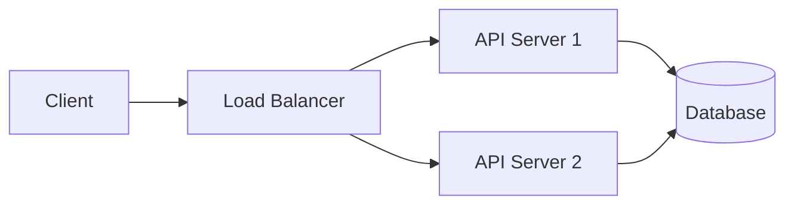
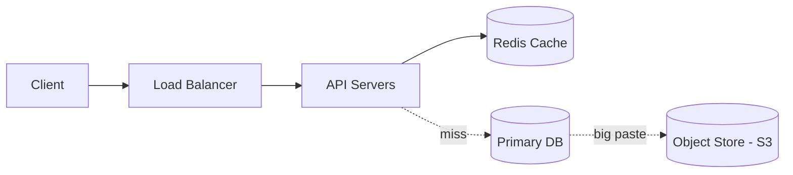
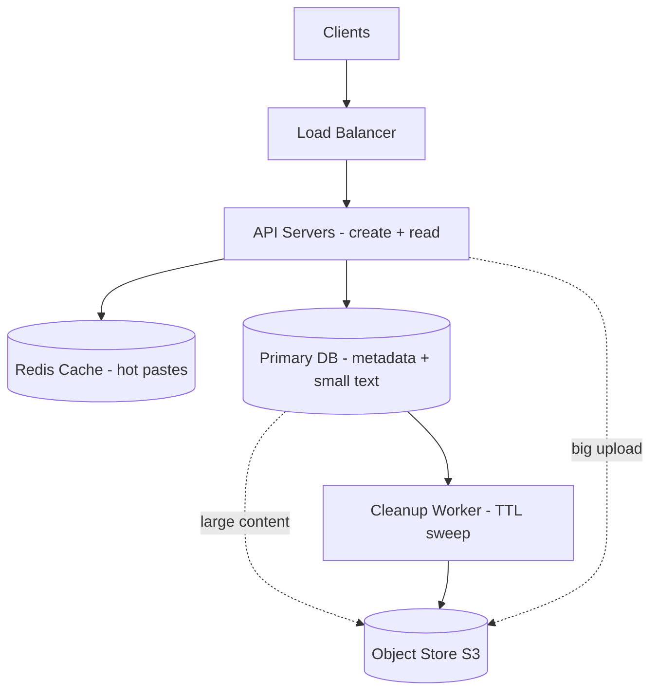

# 2. Design Pastebin (Text Storage)

[← Easy examples](index.md)

> **Interview question:** "Design Pastebin — users paste text or code, get a link. Anyone who opens the link sees the text. Links can expire."

**Final answer in 10 lines (read this first):**

1. User sends text → we give back `paste.bin/aZ89kL2`.
2. Anyone opens `paste.bin/aZ89kL2` → we show the text.
3. Reads are ~10x more than writes, so hot pastes live in cache.
4. `Redis` is the fast notebook on the desk. `DB` is the big safe register. `S3` is the big godown for fat pastes.
5. Small paste (<64KB) → save full text in DB. Big paste → save in S3, save only pointer in DB.
6. Read = check Redis first. If not there, check DB, if pointer then fetch from S3.
7. Expiry is checked on read + cleaned by background worker, never blocks user.
8. One metadata table is enough: `paste_id → content + expiry`.
9. Shard by `hash(paste_id)` when we grow big.
10. Hard part is big uploads + expiry cleanup without breaking reads.

Now let's see how to reach this answer step by step in an interview. We follow the same 7-phase framework as Easy 01.

| Phase | Time | What we will answer for Pastebin |
|---|---|---|
| 1. Requirements | 5-7 min | What to build, what to skip |
| 2. Estimation | 3-5 min | 4 creates/sec, 40 reads/sec, ~6 TB |
| 3. API Design | 3-5 min | `POST /pastes`, `GET /pastes/{id}` |
| 4. High-Level Design | 8-10 min | LB → API → Redis → DB → S3 + Cleaner |
| 5. Database Design | 5-7 min | One `pastes` table, sample rows |
| 6. Deep Dives | 12-18 min | Big pastes + expiry cleanup |
| 7. Wrap-Up | 3-5 min | 30-second closing script |

---

## Phase 1: Requirements — What Are We Building? (5-7 min)

**Meaning in easy words:** Before drawing, agree with interviewer on what to build. Pastebin can become big (login, folders, search, edit). We cut it small.

**Solved answer for Pastebin — write this on the board:**

**We WILL build (in scope):**

- `Create`: user sends text + optional expiry + optional syntax (python, java). Example: 5KB python code → `paste.bin/aZ89kL2`.
- `Read`: anyone opens `paste.bin/aZ89kL2` → sees text + syntax highlighting.
- `Expiry`: user can set 10 min, 1 hour, 1 day, 1 week, never. Default 1 day. After expiry, show 404.
- `Size limit`: max 1MB per paste. Bigger → error.
- `Public / Unlisted`: public shows in recent list (optional), unlisted only works if you know ID. No login in this round.

**We will NOT build (out of scope):**

- No login / signup.
- No edit / delete by user (admin delete only).
- No search inside text.
- No folders / accounts.

**How good must it be (non-functional — also agreed):**

| Point | Our answer | Why it matters |
|---|---|---|
| Scale | 10M new pastes/month, 100M reads/month | Test size |
| Read-write ratio | ~10 reads : 1 write | Reads more, but not 100x like TinyURL. Still need cache |
| Speed | Read < 200ms, Create < 500ms | Big text takes more time than redirect |
| Availability | 99.9% up | Paste link shared in interviews must open |
| Consistency | Eventual is ok, but never lose saved paste | New paste can take few seconds to appear everywhere |
| Durability | Once saved and not expired, never lose | Text is user data |

**Exact lines to speak in interview:**

> "Let me propose scope so we are aligned. Core is create paste + read paste + expiry. I will support up to 1MB, syntax field, public/unlisted. I will keep login, edit, search out. Is that ok?"
>
> "What scale? I will assume 10M creates and 100M reads per month, so 10:1 reads. Read under 200ms. Eventual consistency ok?"

Most interviewers say yes. If they change numbers, just replace and move. Do not spend more than 6 minutes here.

---

## Phase 2: Estimation — Rough Math (3-5 min)

**Meaning in easy words:** Do simple math to prove what breaks first. Round numbers. Think: "how many people per second, how much register + godown space?"

**Solved answer for Pastebin:**

We use 2.5M seconds per month (easy number).

**1. Traffic — how many requests per second (QPS)?**

```
Writes: 10M pastes / month
  = 10M / 2.5M sec = 4 creates/sec
  Peak (3x) = 12 creates/sec

Reads: 100M reads / month
  = 100M / 2.5M sec = 40 reads/sec
  Peak (3x) = 120 reads/sec
```

**What this means:** Very small QPS. Even single DB can handle. But pastes are big (KBs not bytes), so bandwidth and storage matter more than QPS.

**2. Storage — how much space?**

Average paste = 10KB (some 1KB, some 100KB, a few 1MB). Metadata ~200 bytes, ignore.

```
Per month: 10M * 10KB = 100 GB/month
Per year: 100 GB * 12 = 1.2 TB/year
5 years: ~6 TB
```

**What this means:** 6 TB is big for single DB rows if we put full text inside. So split: small pastes in DB, big pastes in S3 godown. DB rows stay small and fast.

Assume 90% pastes <64KB (small), 10% big:

```
Small in DB: 9M * 10KB avg = 90 GB/month
Big in S3: 1M * 100KB avg = 100 GB/month
```

Both grow steadily. Need lifecycle delete after expiry or disk fills.

**3. Bandwidth — how much road traffic? (30 seconds only)**

```
Read: 40 reads/sec * 10KB = 400 KB/sec normal
Peak: 120 * 10KB = 1.2 MB/sec
Write: 4 * 10KB = 40 KB/sec
```

Small. But one 1MB paste upload can block slow connection. So set max size + timeout + direct-to-S3 later.

**Final table to speak:**

| Thing | Normal | Peak | Decision because of this |
|---|---|---|---|
| Creates | 4/sec | 12/sec | Single primary enough |
| Reads | 40/sec | 120/sec | Redis for hot pastes |
| Storage 5yr | ~6 TB | — | DB + S3 split, TTL cleanup must |
| Bandwidth | ~1 MB/s | — | Size cap 1MB, no problem |

**Exact line to speak:**

> "QPS is tiny, but each paste is 10KB not 500 bytes. So I will split storage — small in DB, big in S3 — and cache hot reads."

---

## Phase 3: API Design — Doors of the System (3-5 min)

**Meaning in easy words:** API = doors. Only 2 doors needed.

**Solved answer for Pastebin:**

### Door 1: Create paste

User gives text, we give link.

```
POST /pastes

User sends:
{
  "content": "def hello():\n  print('hi')",
  "syntax": "python",        // optional: python, java, text
  "expires_in": "1_day",     // optional: 10_min, 1_hour, 1_day, 1_week, never
  "visibility": "unlisted"   // optional: public, unlisted
}

We return:
201 Created
{
  "id": "aZ89kL2",
  "url": "https://paste.bin/aZ89kL2",
  "expires_at": "2026-09-22T00:00:00Z"
}

If too big (>1MB):
413 Payload Too Large { "error": "max 1MB" }
```

Rules we tell interviewer:
- Check size at edge first. Reject >1MB without reading full body twice.
- Generate 8-char random ID (unguessable, so unlisted stays private).
- If `syntax` missing, store as `text`.
- Rate limit create per IP (e.g. 10/min) to stop spam.

### Door 2: Read paste

User opens link, we show text.

```
GET /pastes/aZ89kL2
Example: open https://paste.bin/aZ89kL2

We return:
200 OK
{
  "id": "aZ89kL2",
  "content": "def hello():\n  print('hi')",
  "syntax": "python",
  "created_at": "2026-09-21T10:00:00Z",
  "expires_at": "2026-09-22T10:00:00Z"
}

If wrong ID: 404 Not Found
If expired: 404 (same as not found, do not leak that it existed)
```

Raw view option: `GET /raw/aZ89kL2` returns plain text for `curl`. Mention only, don't design fully.

No edit API, no list API in core scope. Recent public list can be later.

---

## Phase 4: High-Level Design — Full Diagram (8-10 min)

**Meaning in easy words:** Start tiny, then add parts on need. Like: one shopkeeper → add manager → add fast notebook → add godown for big bags → add sweeper for expired goods.

### Step 1: Simplest that works (for 10 users)


- Create saves text in DB, read fetches from DB.
- Problem: one server can die. Big pastes make DB rows fat and slow. Expired pastes fill disk forever.

### Step 2: Add load balancer (many shopkeepers)



- Balancer = traffic police. Servers stateless. If one dies, other works.
- Still problem: popular pastes (interview question shared 10k times) hit DB again and again.

### Step 3: Add cache + godown + sweeper



- Read first checks Redis: `GET paste:aZ89kL2`. Hot pastes in ~2ms.
- Only miss goes to DB. If DB row has `s3_key` (big paste), fetch text from S3.
- Create: if text <64KB → save full text in DB. If bigger → save text in S3, save only `s3_key` in DB.
- Sweeper: background worker deletes expired rows + S3 files daily. Read also checks expiry first.

### Walk with real example

**Example A: Create 5KB python code, expiry 1 day:**

1. You click "Create" → `POST /pastes` → Balancer → API Server 2.
2. Server checks size 5KB < 1MB ok, makes ID `aZ89kL2`.
3. 5KB < 64KB → small → `INSERT INTO pastes (id, content, ...)` in DB.
4. Server puts copy in Redis: `paste:aZ89kL2 → content` with TTL = till expiry.
5. Returns `paste.bin/aZ89kL2`.

**Example B: Create 500KB log file:**

1. Same till ID `xY1pQ9z`.
2. 500KB > 64KB → big → server saves text to S3 as `pastes/xY1pQ9z.txt`, gets key.
3. Server saves in DB: `id=xY1pQ9z, s3_key=pastes/xY1pQ9z.txt, size=500KB` (no full text in DB).
4. Server caches metadata + maybe first chunk in Redis, or skips cache for huge one-time pastes.
5. Returns `paste.bin/xY1pQ9z`.

**Example C: 10,000 students open `paste.bin/aZ89kL2` (hot):**

1. Each → `GET /pastes/aZ89kL2` → Balancer → any API server.
2. Server checks Redis → hit → returns in ~5ms. DB not touched.
3. If expired → return 404 even if Redis/DB has it. Sweeper will delete later.

### Final complete diagram (what to draw at end)



| Part | Why we added it for Pastebin |
|---|---|
| Load Balancer | 2+ servers, no single death, spreads peak |
| Redis Cache | Hot interview pastes opened 10k times, serves in ms |
| Primary DB | Safe register for metadata + small texts |
| S3 Object Store | Godown for >64KB texts, keeps DB rows small |
| Cleanup Worker | Deletes expired pastes daily, stops disk full |

**Line to speak:**

> "I added S3 split because 10KB average * 10M/month = 100GB/month will make DB fat. I added cleaner because expiry is core here, unlike TinyURL."

---

## Phase 5: Database Design — Where Data Lives? (5-7 min)

**Meaning in easy words:** Three places: desk notebook (Redis) for fast, safe register (DB) for real, godown (S3) for big bags.

**Solved answer for Pastebin:**

We use **Postgres (or Mongo) for metadata**. Why? Schema is fixed: id, text or pointer, expiry. Need unique ID + expiry index for cleaner. 4 writes/sec is trivial.

- DB = metadata + small content (<64KB inline).
- S3 = big content body, DB only keeps `s3_key`.
- Redis = hot paste full body for fast reads.

### Main table `pastes` with real sample rows

```
pastes
├── paste_id (PK, varchar 8)  // e.g. "aZ89kL2"
├── content (text, nullable)  // filled only if size <64KB
├── s3_key (nullable)         // filled only if size >=64KB
├── size_bytes
├── syntax (python, java, text)
├── visibility (public, unlisted)
├── created_at
└── expires_at (indexed)
```

Sample data (show this to interviewer):

| paste_id | content / s3_key | size | syntax | expires_at |
|---|---|---|---|---|
| aZ89kL2 | `def hello(): print('hi')` (inline) | 5KB | python | 2026-09-22 |
| xY1pQ9z | `s3://pastes/xY1pQ9z.txt` (pointer) | 500KB | text | 2026-09-28 |
| pQ7mN2k | `SELECT * FROM users;` (inline) | 2KB | sql | null (never) |

- `paste_id` PK → `WHERE paste_id=?` instant.
- `expires_at` indexed → cleaner can do `DELETE ... WHERE expires_at < NOW() LIMIT 1000` fast. Also read checks expiry.
- Never store password plain. If private with password (future), store `password_hash`.
- 8-char random ID from `a-zA-Z0-9` = `62^8 = 218 trillion`. Unguessable, good for unlisted.

### Redis + S3 samples

```
Redis:
"paste:aZ89kL2" → full 5KB text (TTL till expiry)
"paste:xY1pQ9z" → metadata + S3 text cached 1h (or skip if too big, fetch from S3 each time)

S3:
pastes/xY1pQ9z.txt → 500KB log file
```

### How each question is answered (access check)

| User action | How we answer |
|---|---|
| `GET /pastes/aZ89kL2` | Redis `GET`. If miss → `SELECT ... WHERE paste_id=?`. If `s3_key` present → fetch S3. Check `expires_at`, if past → 404 |
| `POST /pastes` small | `INSERT` with content inline. Then `SET` Redis with TTL |
| `POST /pastes` big | Put body to S3 first, then `INSERT` with `s3_key`. Then optional Redis |
| Expired read | Return 404 even if row exists. Cleaner deletes later |
| Cleaner run | Scan by `expires_at` index in batches, delete DB row + S3 file + Redis key |

All single-key lookups. No scan except cleaner batch. Good.

### When we grow big — sharding

- Start: 1 primary + 1 replica. Enough for 40 reads/sec with cache.
- Later: shard DB by `hash(paste_id) % N`. Every read is by ID, no cross-shard.
- S3 already unlimited. Just use prefix `pastes/ab/cd/id` to avoid hot partition.
- Hot paste (10k students same link): Redis + CDN in front. Don't hit DB/S3 per read.

---

## Phase 6: Deep Dives — Hard Part (12-18 min)

Interviewer will ask one of these: **"Where to keep big pastes?"** or **"How expiry cleanup without breaking reads?"** Prepare both.

**Meaning in easy words:** Two hard bags: fat bag where to keep, and rotten food when to throw without stopping shop.

### Deep dive 1: Small inline vs S3 godown — where to keep text?

**Option 1: All in DB**

- How: Every paste text saved in DB `content` column, even 1MB.
- Good: One lookup, simple, no S3 call. Easy transactions.
- Bad: DB rows become fat. 1MB row * 100 reads = 100MB RAM churn. Backups slow. DB cache polluted by big blobs. At 6 TB, DB becomes heavy and costly.

**Option 2: All in S3**

- How: Every paste, even 1KB, saved in S3. DB only keeps pointer.
- Good: DB stays tiny and fast. S3 unlimited and cheap.
- Bad: Even tiny 2KB paste needs 2 calls (DB + S3). P99 latency up by ~30-50ms. Many small S3 objects = more cost + list slow.

**Option 3: Split at 64KB (recommended)**

- How: If `size <64KB` → inline in DB. Else → S3 + pointer. 64KB is tunable, not magic.
- Good: 90% pastes (small) stay one-lookup fast. Only 10% big pay extra S3 hop. DB stays lean.
- Bad: Code has two paths. Must handle S3 fail after DB insert (or DB fail after S3 put) with retry + orphan cleaner.
- Example: 5KB code → DB only. 500KB log → S3 + pointer.

| Way | Reads | DB size | Best for |
|---|---|---|---|
| All DB | 1 lookup, fast | Fat, 6 TB in DB | Tiny scale |
| All S3 | 2 lookups, slower | Tiny DB | Huge blobs only |
| Split 64KB | 1 lookup for 90% | Lean DB + cheap S3 | Interview + real (winner) |

**Final answer to speak:**

> "I will split at 64KB. Small stays inline for speed, big goes to S3 to keep DB fast. Threshold is tunable based on p99 and DB size."

### Deep dive 2: Expiry — how to delete without breaking reads?

**Problem:** User sets 10 min expiry. After 10 min, must show 404. But 1,000 people may be reading at same second. Cleaner deleting mid-read must not give half text.

**Option 1: Delete exactly on time (sync cron per row)**

- How: Timer per paste fires at expiry and deletes.
- Bad: 10M timers = impossible. Thundering herd. Never do this.

**Option 2: Lazy check on read + batch sweeper (recommended)**

- How:
  1. On every read, check `expires_at < now?` → if yes return 404, don't return text even if found.
  2. Background worker runs every 5 min, deletes in batches: `DELETE ... WHERE expires_at < NOW() LIMIT 1000`, then deletes S3 files + Redis keys.
  3. Redis TTL = `expires_at - now`, so cache auto-evicts. No stale cache.
- Good: No timers. Reads always correct (expiry gate). Sweeper can lag 5-10 min, no user impact (they already get 404). Idempotent, retry safe.
- Edge: S3 file deleted but DB row left (crash) → orphan. Fix: sweeper lists orphans weekly, or delete DB first then S3, read tolerates missing S3 → 404.

**Other 1-minute answers to keep ready:**

- **ID: UUID vs Snowflake vs Random 8-char:** Use random 8-char Base62 for unguessable unlisted links. UUID long and ugly. Snowflake time-ordered but guessable. State choice.
- **Big upload blocks server:** 1MB upload * 12/sec can fill API memory. Fix: size cap + timeout + later direct-to-S3 with presigned URL (client uploads to S3, then tells API key).
- **Private pastes:** Unlisted ID is the password (capability). If need real password, store `bcrypt(hash)`, never plain. Signed URL with expiry for S3 private files.
- **Never do:** `SELECT *` recent pastes without limit, or `LIKE '%code%'` search — full scan. Keep out of scope.

---

## Phase 7: Wrap-Up — Closing (3-5 min)

Do not draw new things. Show you know limits.

**30-second script to speak (memorize this):**

> "To summarize: browser → load balancer → stateless API. Hot pastes from Redis, else DB. Small pastes inline in DB, big pastes in S3 with pointer. Expiry checked on read, cleaned by batch worker. 10:1 reads so cache helps, but storage split is the main win for 6 TB."

**What can break (bottlenecks):**

1. Big 1MB uploads × 12/sec → API memory + bandwidth full. Fix: 1MB cap, timeout, presigned S3 upload. Watch: p99 create latency, 413 rate.
2. Hot paste (exam paper) 10k reads → Redis hot key. Fix: CDN + local 30-sec cache. Watch: Redis CPU, hit %.
3. Sweeper lag → disk fills with expired pastes. Fix: batch delete + S3 lifecycle rule as backup. Watch: DB disk %, expired-but-not-deleted count.

**What next if more time:**

- Direct-to-S3 upload for big pastes.
- Syntax highlighting + raw view caching via CDN.
- Rate limit + spam / malware scan async.
- Keep search, edit, login out unless asked.

**If interviewer asks:**

- "10x traffic?" → More Redis, DB read replicas, S3 prefix sharding, CDN.
- "1GB paste?" → Reject in this design (1MB cap). New design needs chunked upload + streaming read.
- "Region down?" → DB replica in 2 zones, S3 cross-region, DNS failover.

---

## Key Takeaways

1. 10:1 reads → cache hot pastes, but storage split matters more than QPS.
2. 4 creates/sec tiny, but 10KB avg → 6 TB in 5 years → DB + S3 + TTL must.
3. 2 APIs only: `POST /pastes`, `GET /pastes/{id}` with expiry + 1MB cap.
4. One `pastes` table + S3 for >64KB + Redis hot copy. Shard by ID hash.
5. Expiry via read-gate + batch sweeper, never per-row timer.
6. IDs via random 8-char (unguessable for unlisted).
7. Close with bottlenecks: big uploads, hot key, sweeper lag.

**Memory hook:** Paste ID is the locker number — small chits in register, big bags in godown, hot chits photocopied on desk, sweeper throws rotten ones daily.

## Interactive Visualizer

Learn the design in three moves:

1. **Follow a request** — trace a *Read* (cache-first), a *Create* (small inline write), or a *Big paste* (S3 + expiry sweep). Each step lights up the real path on the diagram.
2. **Add traffic** — raise the user count until a component turns red and errors appear.
3. **Press Scale up** — one button fixes the current bottleneck and explains what was failing, what changed, and what improved.

<div
  id="pastebin-visualizer"
  class="pbv pastebin-visualizer"
></div>
