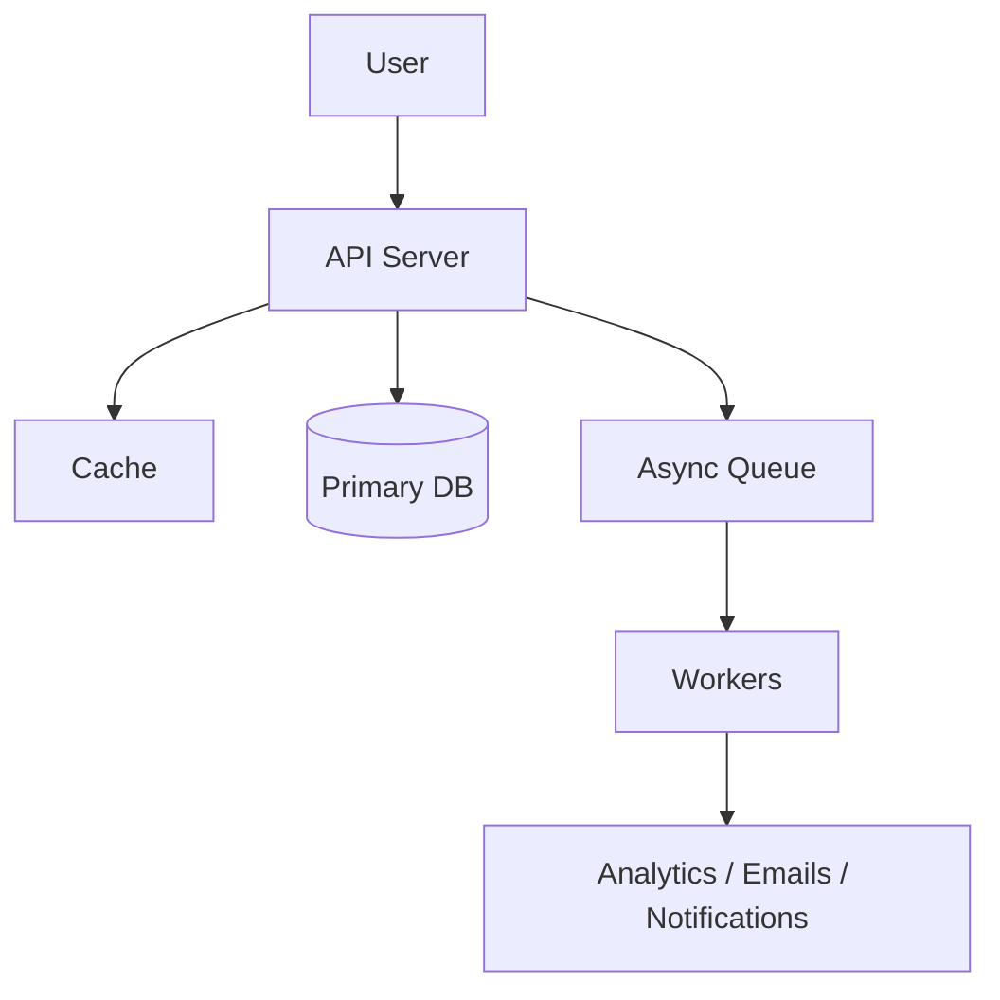

# Easy System Design Problems

[← System Design Examples](../index.md) · [System Design index](../../index.md)

Twenty foundational designs for junior-to-mid rounds. Each problem below is a compressed interview answer: name the user flow, the durable state, what you cache or queue, and the simplest scaling path that still holds under failure.

## Architecture snapshot

## Problems

| # | Problem |
|---|---|
| 1 | [Design URL Shortener (TinyURL)](1-design-url-shortener-tinyurl.md) |
| 2 | [Design Pastebin (Text Storage)](2-design-pastebin-text-storage.md) |
| 3 | [Design Content Delivery Network (CDN)](3-design-content-delivery-network-cdn.md) |
| 4 | [Design Parking Garage](4-design-parking-garage.md) |
| 5 | [Design Distributed Key-Value Store](5-design-distributed-key-value-store.md) |
| 6 | [Design Distributed Cache](6-design-distributed-cache.md) |
| 7 | [Design Distributed Job Scheduler](7-design-distributed-job-scheduler.md) |
| 8 | [Design Authentication System](8-design-authentication-system.md) |
| 9 | [Design Unified Payments Interface (UPI)](9-design-unified-payments-interface-upi.md) |
| 10 | [Design Task Management System (Todoist/Asana)](10-design-task-management-system-todoist-asana.md) |
| 11 | [Design Email Service](11-design-email-service.md) |
| 12 | [Design Logging System](12-design-logging-system.md) |
| 13 | [Design Real-time Metrics System](13-design-real-time-metrics-system.md) |
| 14 | [Design Comment System](14-design-comment-system.md) |
| 15 | [Design Leaderboard](15-design-leaderboard.md) |
| 16 | [Design Search Autocomplete](16-design-search-autocomplete.md) |
| 17 | [Design QR Code Generator](17-design-qr-code-generator.md) |
| 18 | [Design Session Management](18-design-session-management.md) |
| 19 | [Design File Upload System](19-design-file-upload-system.md) |
| 20 | [Design Recommendation System (Basic)](20-design-recommendation-system-basic.md) |
