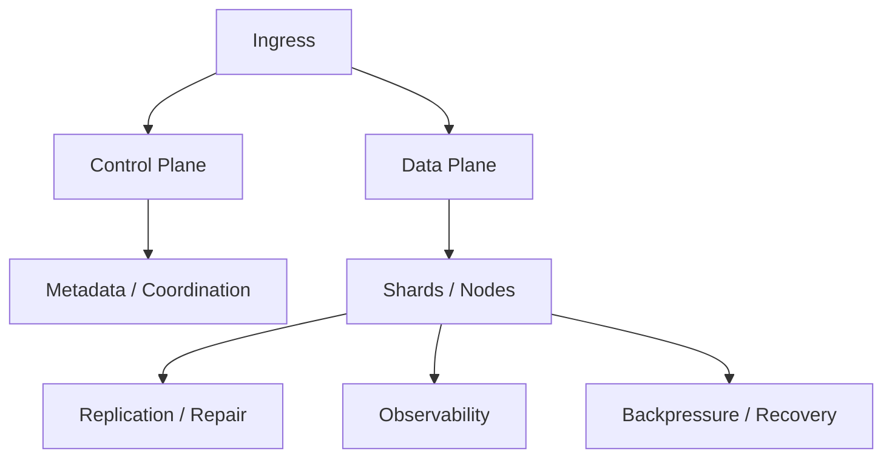

# Hard System Design Problems

[← System Design Examples](../index.md) · [System Design index](../../index.md)

These answers are about distributed systems, coordination, consistency, and reliability. Show the control plane, the data plane, and how the system recovers.

## Architecture snapshot

## Problems

| # | Problem |
|---|---|
| 56 | [Design Distributed Transaction System](56-design-distributed-transaction-system.md) |
| 57 | [Design Database Replication](57-design-database-replication.md) |
| 58 | [Design Database Sharding Strategy](58-design-database-sharding-strategy.md) |
| 59 | [Design Real-time Analytics Platform](59-design-real-time-analytics-platform.md) |
| 60 | [Design High-Frequency Trading System](60-design-high-frequency-trading-system.md) |
| 61 | [Design Ride-Sharing with Surge Pricing](61-design-ride-sharing-with-surge-pricing.md) |
| 62 | [Design Video Conference (Zoom)](62-design-video-conference-zoom.md) |
| 63 | [Design Real-time Multiplayer Game Server](63-design-real-time-multiplayer-game-server.md) |
| 64 | [Design Smart Cache System](64-design-smart-cache-system.md) |
| 65 | [Design Spam Detection System](65-design-spam-detection-system.md) |
| 66 | [Design Recommendation Algorithm](66-design-recommendation-algorithm.md) |
| 67 | [Design Email Delivery System](67-design-email-delivery-system.md) |
| 68 | [Design Bug Tracking System (Jira)](68-design-bug-tracking-system-jira.md) |
| 69 | [Design Document Management System](69-design-document-management-system.md) |
| 70 | [Design A/B Testing Platform](70-design-a-b-testing-platform.md) |
| 71 | [Design ML/AI Infrastructure](71-design-ml-ai-infrastructure.md) |
| 72 | [Design Large Language Model (LLM) Inference API](72-design-large-language-model-llm-inference-api.md) |
| 73 | [Design Microservices Architecture](73-design-microservices-architecture.md) |
| 74 | [Design GraphQL API](74-design-graphql-api.md) |
| 75 | [Design Multi-Tenancy System](75-design-multi-tenancy-system.md) |
| 76 | [Design Data Warehouse](76-design-data-warehouse.md) |
| 77 | [Design IoT System](77-design-iot-system.md) |
| 78 | [Design Content Moderation System](78-design-content-moderation-system.md) |
| 79 | [Design GDPR-Compliant System](79-design-gdpr-compliant-system.md) |
| 80 | [Design Distributed Consensus for Blockchain](80-design-distributed-consensus-for-blockchain.md) |
