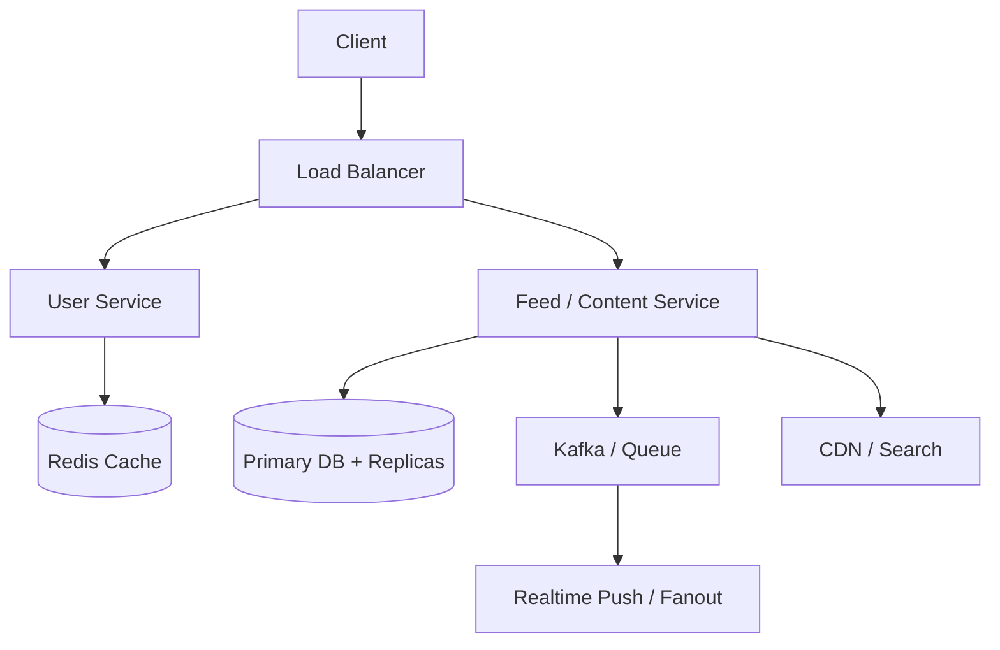

# Medium System Design Problems

[← System Design Examples](../index.md) · [System Design index](../../index.md)

These are product-scale systems. Explain request flow, fanout, caching, search, async work, and the trade-off between simplicity and scale.

## Architecture snapshot

## Problems

| # | Problem |
|---|---|
| 21 | [Design Instagram](21-design-instagram.md) |
| 22 | [Design Twitter](22-design-twitter.md) |
| 23 | [Design Facebook](23-design-facebook.md) |
| 24 | [Design WhatsApp](24-design-whatsapp.md) |
| 25 | [Design YouTube](25-design-youtube.md) |
| 26 | [Design Netflix](26-design-netflix.md) |
| 27 | [Design Uber](27-design-uber.md) |
| 28 | [Design Google Maps](28-design-google-maps.md) |
| 29 | [Design Dropbox](29-design-dropbox.md) |
| 30 | [Design Spotify](30-design-spotify.md) |
| 31 | [Design TikTok](31-design-tiktok.md) |
| 32 | [Design Airbnb](32-design-airbnb.md) |
| 33 | [Design E-commerce (Amazon)](33-design-e-commerce-amazon.md) |
| 34 | [Design Rate Limiter](34-design-rate-limiter.md) |
| 35 | [Design Notification System](35-design-notification-system.md) |
| 36 | [Design Messenger (Facebook Messenger)](36-design-messenger-facebook-messenger.md) |
| 37 | [Design Slack](37-design-slack.md) |
| 38 | [Design Twitch (Live Streaming)](38-design-twitch-live-streaming.md) |
| 39 | [Design Booking.com](39-design-booking-com.md) |
| 40 | [Design Payment System](40-design-payment-system.md) |
| 41 | [Design Flight Booking System](41-design-flight-booking-system.md) |
| 42 | [Design Google Search](42-design-google-search.md) |
| 43 | [Design News Feed Aggregation (Reddit)](43-design-news-feed-aggregation-reddit.md) |
| 44 | [Design Advertising Platform](44-design-advertising-platform.md) |
| 45 | [Design Google Docs](45-design-google-docs.md) |
| 46 | [Design Distributed Web Crawler](46-design-distributed-web-crawler.md) |
| 47 | [Design Location-Based Service (Yelp)](47-design-location-based-service-yelp.md) |
| 48 | [Design Distributed Task Scheduler](48-design-distributed-task-scheduler.md) |
| 49 | [Design Distributed Locking Service](49-design-distributed-locking-service.md) |
| 50 | [Design Distributed Consensus Protocol](50-design-distributed-consensus-protocol.md) |
| 51 | [Design Key-Value Store (Dynamo/Cassandra style)](51-design-key-value-store-dynamo-cassandra-style.md) |
| 52 | [Design Distributed File System (GFS/HDFS)](52-design-distributed-file-system-gfs-hdfs.md) |
| 53 | [Design Distributed Message Queue (Kafka)](53-design-distributed-message-queue-kafka.md) |
| 54 | [Design Video Processing Pipeline](54-design-video-processing-pipeline.md) |
| 55 | [Design Distributed Search Engine](55-design-distributed-search-engine.md) |
