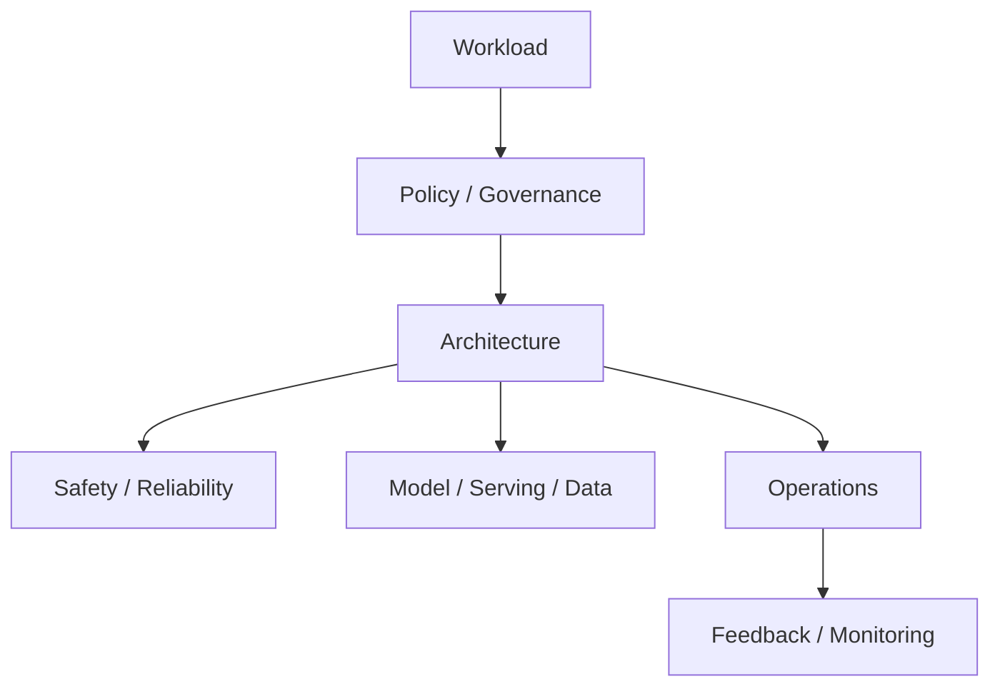

# Very Hard System Design Problems

[← System Design Examples](../index.md) · [System Design index](../../index.md)

These designs combine platform thinking, governance, and production reliability. Frame them around constraints first, then architecture, then operations.

## Architecture snapshot

## Problems

| # | Problem |
|---|---|
| 81 | [Design High-Availability Disaster Recovery](81-design-high-availability-disaster-recovery.md) |
| 82 | [Design Financial System with Consistency Guarantees](82-design-financial-system-with-consistency-guarantees.md) |
| 83 | [Design Real-time Bidding (Ad Tech)](83-design-real-time-bidding-ad-tech.md) |
| 84 | [Design Circuit Breaker Pattern](84-design-circuit-breaker-pattern.md) |
| 85 | [Design Monitoring & Alerting System](85-design-monitoring-and-alerting-system.md) |
